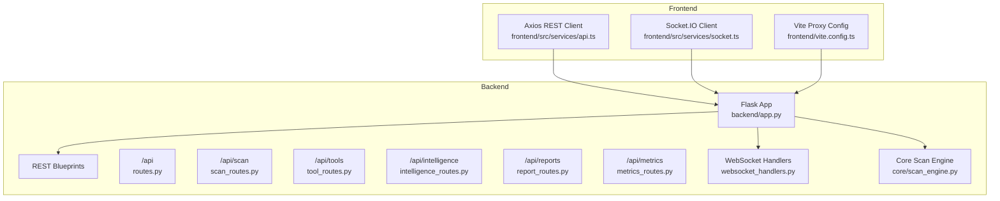
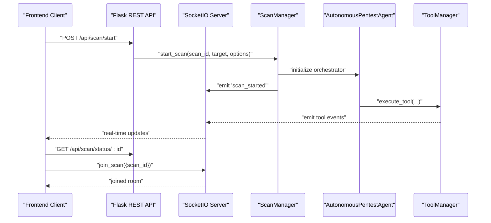
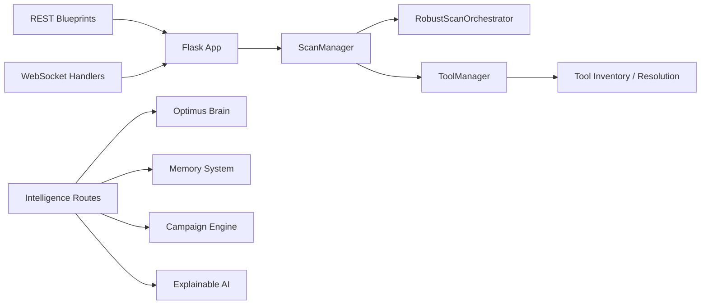
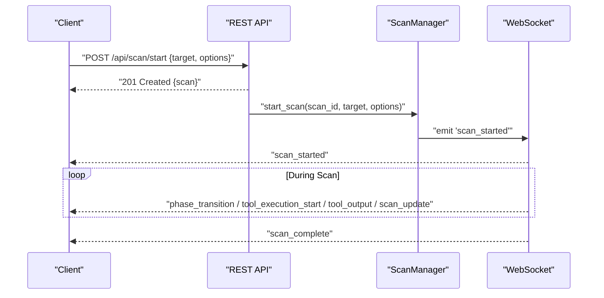
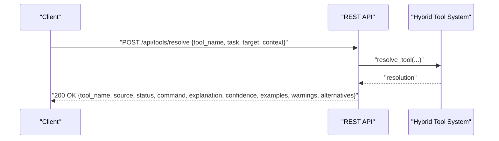
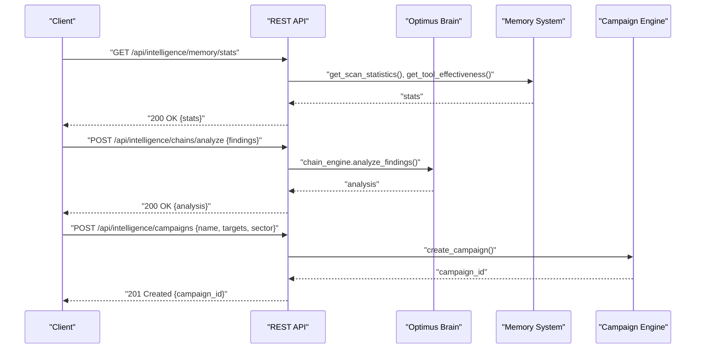
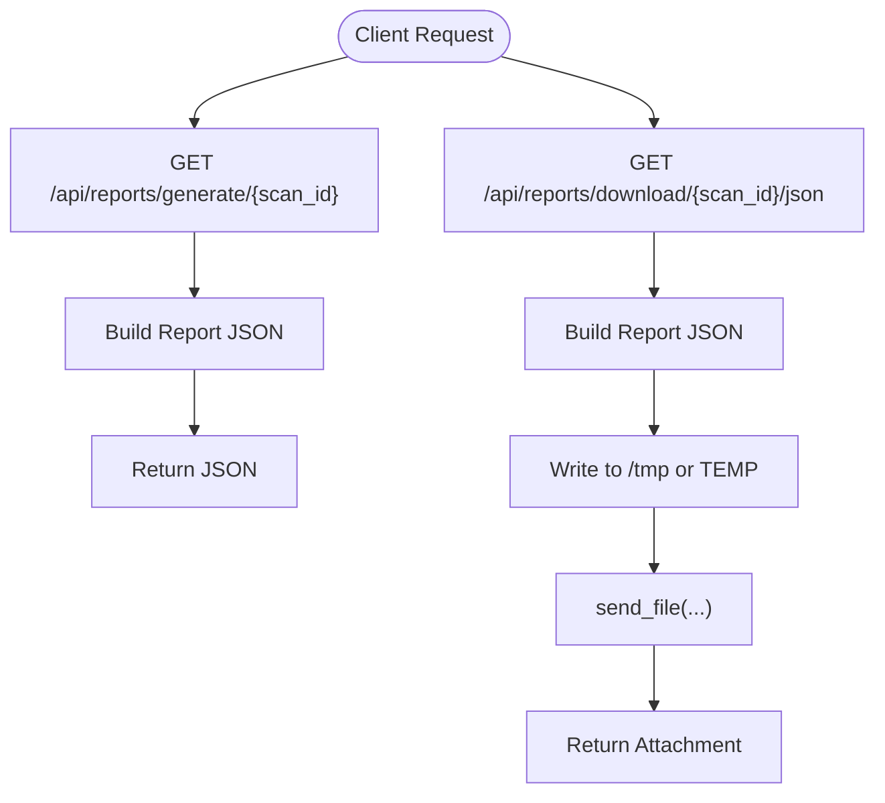

# Backend API Reference

<cite>
**Referenced Files in This Document**
- [app.py](file://backend/app.py)
- [routes.py](file://backend/api/routes.py)
- [scan_routes.py](file://backend/api/scan_routes.py)
- [tool_routes.py](file://backend/api/tool_routes.py)
- [intelligence_routes.py](file://backend/api/intelligence_routes.py)
- [report_routes.py](file://backend/api/report_routes.py)
- [websocket_handlers.py](file://backend/api/websocket_handlers.py)
- [api.ts](file://frontend/src/services/api.ts)
- [socket.ts](file://frontend/src/services/socket.ts)
- [vite.config.ts](file://frontend/vite.config.ts)
- [metrics_routes.py](file://backend/api/metrics_routes.py)
- [scan_engine.py](file://backend/core/scan_engine.py)
- [web_intelligence.py](file://backend/intelligence/web_intelligence.py)
- [test_post_exploitation_safety.py](file://backend/testing/test_post_exploitation_safety.py)
</cite>

## Table of Contents
1. [Introduction](#introduction)
2. [Project Structure](#project-structure)
3. [Core Components](#core-components)
4. [Architecture Overview](#architecture-overview)
5. [Detailed Component Analysis](#detailed-component-analysis)
6. [Dependency Analysis](#dependency-analysis)
7. [Performance Considerations](#performance-considerations)
8. [Troubleshooting Guide](#troubleshooting-guide)
9. [Conclusion](#conclusion)
10. [Appendices](#appendices)

## Introduction
This document provides a comprehensive API reference for the Optimus backend REST and WebSocket APIs. It covers:
- REST endpoints for scan management, tool integration, intelligence services, and reporting
- WebSocket event types and real-time interaction patterns for live scan progress tracking
- Authentication and security considerations
- Error handling strategies, rate limiting, and concurrency controls
- Client integration guidelines, performance optimization tips, and debugging approaches
- Migration and versioning guidance

## Project Structure
The backend is a Flask application with Blueprints for modular routing and SocketIO for real-time communication. Frontend integrates via Axios for REST and socket.io-client for WebSocket.

**Diagram sources**
- [app.py](file://backend/app.py#L179-L228)
- [routes.py](file://backend/api/routes.py#L1-L54)
- [scan_routes.py](file://backend/api/scan_routes.py#L15-L375)
- [tool_routes.py](file://backend/api/tool_routes.py#L9-L299)
- [intelligence_routes.py](file://backend/api/intelligence_routes.py#L11-L315)
- [report_routes.py](file://backend/api/report_routes.py#L33-L124)
- [websocket_handlers.py](file://backend/api/websocket_handlers.py#L9-L115)
- [api.ts](file://frontend/src/services/api.ts#L19-L391)
- [socket.ts](file://frontend/src/services/socket.ts#L64-L237)
- [vite.config.ts](file://frontend/vite.config.ts#L1-L39)

**Section sources**
- [app.py](file://backend/app.py#L179-L228)
- [routes.py](file://backend/api/routes.py#L1-L54)
- [scan_routes.py](file://backend/api/scan_routes.py#L15-L375)
- [tool_routes.py](file://backend/api/tool_routes.py#L9-L299)
- [intelligence_routes.py](file://backend/api/intelligence_routes.py#L11-L315)
- [report_routes.py](file://backend/api/report_routes.py#L33-L124)
- [websocket_handlers.py](file://backend/api/websocket_handlers.py#L9-L115)
- [api.ts](file://frontend/src/services/api.ts#L19-L391)
- [socket.ts](file://frontend/src/services/socket.ts#L64-L237)
- [vite.config.ts](file://frontend/vite.config.ts#L1-L39)

## Core Components
- Flask application with CORS enabled and SocketIO integration
- REST Blueprints for:
  - Dashboard and health checks
  - Scan lifecycle and results
  - Tool discovery and resolution
  - Intelligence insights and campaigns
  - Reporting generation and exports
  - Metrics and system health
- WebSocket handlers for real-time scan updates and tool events
- Frontend services for REST and WebSocket communication

Key runtime elements:
- Global shared state for active scans and history
- Scan manager orchestrating autonomous agent and tool execution
- Intelligence subsystems for memory, learning, and explainability

**Section sources**
- [app.py](file://backend/app.py#L120-L171)
- [scan_engine.py](file://backend/core/scan_engine.py#L26-L81)
- [websocket_handlers.py](file://backend/api/websocket_handlers.py#L9-L115)

## Architecture Overview

**Diagram sources**
- [scan_engine.py](file://backend/core/scan_engine.py#L82-L148)
- [scan_routes.py](file://backend/api/scan_routes.py#L40-L140)
- [websocket_handlers.py](file://backend/api/websocket_handlers.py#L12-L56)

## Detailed Component Analysis

### REST API Endpoints

#### Base and Health
- GET /
  - Description: Root endpoint returning metadata and available endpoints
  - Response: JSON with name, version, description, and endpoint map
- GET /health
  - Description: Health check for API, WebSocket, intelligence, and tools
  - Response: JSON with status, timestamp, version, and component statuses

**Section sources**
- [app.py](file://backend/app.py#L292-L308)
- [app.py](file://backend/app.py#L277-L290)

#### Dashboard
- GET /api/dashboard/stats
  - Description: Returns dashboard statistics (active scans, totals, findings by severity)
  - Response: JSON with counts and system health indicator
- GET /api/dashboard/activity
  - Query: limit (integer, default 10)
  - Description: Returns recent scans and findings
  - Response: JSON with arrays of scans and findings

**Section sources**
- [routes.py](file://backend/api/routes.py#L19-L54)

#### Scan Management
- POST /api/scan/start
  - Body: target (required), mode (default standard), enableExploitation (default false), useAI (default true), maxDuration (default 3600), excludePaths (default empty)
  - Response: JSON representing the created scan object
  - Notes: Generates scan_id, initializes state, and starts background scan
- GET /api/scan/status/{scan_id}
  - Description: Returns current scan state with a last_updated timestamp
  - Response: JSON scan object or error
- POST /api/scan/stop/{scan_id}
  - Description: Stops a running scan; moves it to history
  - Response: JSON success message
- POST /api/scan/pause/{scan_id}
  - Description: Pauses a running scan
  - Response: JSON success message
- POST /api/scan/resume/{scan_id}
  - Description: Resumes a paused scan
  - Response: JSON success message
- GET /api/scan/results/{scan_id}
  - Description: Returns scan results with a last_updated timestamp
  - Response: JSON scan object or error
- GET /api/scan/list
  - Query: page (default 1), limit (default 20), status (filter)
  - Description: Lists all scans (active and history) with pagination
  - Response: JSON with items, total, page, per_page, total_pages, active_count
- POST /api/scan/execute-tool
  - Body: scan_id (required), tool (required), target (required), options (optional)
  - Description: Executes a specific tool in the context of a scan
  - Response: JSON success message and result
- GET /api/scan/{scan_id}/findings
  - Description: Returns findings for a specific scan
  - Response: JSON with findings array and last_updated timestamp

Error handling:
- 400 Bad Request: Missing required fields (e.g., target)
- 404 Not Found: Scan not found
- 500 Internal Server Error: Exceptions during startup or execution

Concurrency and locking:
- Shared active_scans guarded by a threading lock to prevent race conditions

**Section sources**
- [scan_routes.py](file://backend/api/scan_routes.py#L40-L140)
- [scan_routes.py](file://backend/api/scan_routes.py#L143-L190)
- [scan_routes.py](file://backend/api/scan_routes.py#L192-L236)
- [scan_routes.py](file://backend/api/scan_routes.py#L238-L256)
- [scan_routes.py](file://backend/api/scan_routes.py#L258-L291)
- [scan_routes.py](file://backend/api/scan_routes.py#L293-L319)
- [scan_routes.py](file://backend/api/scan_routes.py#L321-L335)
- [app.py](file://backend/app.py#L168-L171)

#### Tool Integration
- GET /api/tools/available
  - Query: category (optional filter)
  - Description: Returns available tools from hybrid system or fallback inventory
  - Response: JSON with tools array
- GET /api/tools/categories
  - Description: Returns predefined tool categories
  - Response: JSON with categories array
- POST /api/tools/resolve
  - Body: tool_name (required), task (default general scan), target (default empty), context (optional)
  - Description: Resolves a tool using the hybrid system with confidence and alternatives
  - Response: JSON with tool resolution details
- POST /api/tools/scan
  - Description: Scans system for available tools; optionally uses SSH client from tool manager
  - Response: JSON with tools_found, by_category, and tools list
- GET /api/tools/research/{tool_name}
  - Description: Researches a tool from web sources
  - Response: JSON with tool details and confidence
- GET /api/tools/inventory
  - Description: Returns full tool inventory and statistics
  - Response: JSON with tools and statistics
- GET /api/tools/inventory/{tool_name}
  - Description: Returns detailed info for a specific tool
  - Response: JSON tool object or error
- GET /api/tools/knowledge-base
  - Description: Returns curated knowledge base tools
  - Response: JSON with tools array
- GET /api/tools/statistics
  - Description: Returns hybrid tool system statistics
  - Response: JSON with aggregated stats

**Section sources**
- [tool_routes.py](file://backend/api/tool_routes.py#L27-L50)
- [tool_routes.py](file://backend/api/tool_routes.py#L51-L60)
- [tool_routes.py](file://backend/api/tool_routes.py#L62-L105)
- [tool_routes.py](file://backend/api/tool_routes.py#L106-L169)
- [tool_routes.py](file://backend/api/tool_routes.py#L171-L186)
- [tool_routes.py](file://backend/api/tool_routes.py#L187-L203)
- [tool_routes.py](file://backend/api/tool_routes.py#L204-L221)
- [tool_routes.py](file://backend/api/tool_routes.py#L222-L284)
- [tool_routes.py](file://backend/api/tool_routes.py#L286-L299)

#### Intelligence Services
- GET /api/intelligence/memory/stats
  - Description: Returns memory system statistics including scan stats and tool effectiveness
  - Response: JSON with stats or error
- GET /api/intelligence/memory/target/{target_hash}
  - Description: Returns stored profile for a target hash
  - Response: JSON profile or error
- GET /api/intelligence/memory/patterns
  - Query: target_type (default web), limit (default 10)
  - Description: Returns best attack patterns for a target type
  - Response: JSON with patterns array
- POST /api/intelligence/chains/analyze
  - Body: findings (array)
  - Description: Analyzes findings for attack chains
  - Response: JSON analysis result or error
- GET /api/intelligence/chains/{chain_id}/plan
  - Description: Returns detailed exploitation plan for a chain
  - Response: JSON plan or error
- POST /api/intelligence/campaigns
  - Body: name, targets (array), sector (default unknown)
  - Description: Creates a new multi-target campaign
  - Response: JSON with campaign_id
- GET /api/intelligence/campaigns/{campaign_id}
  - Description: Returns insights for a campaign
  - Response: JSON insights or error
- GET /api/intelligence/campaigns/{campaign_id}/optimize
  - Description: Returns optimized target scanning order
  - Response: JSON with scan_order
- GET /api/intelligence/campaigns/{campaign_id}/recommendations/{target_url}
  - Description: Returns recommendations for a target based on campaign learnings
  - Response: JSON recommendations
- GET /api/intelligence/decisions/audit
  - Query: scan_id (optional)
  - Description: Returns AI decision audit trail
  - Response: JSON audit
- GET /api/intelligence/decisions/report
  - Description: Returns decision audit statistics
  - Response: JSON report
- GET /api/intelligence/status
  - Description: Returns status of intelligence subsystems
  - Response: JSON status or error
- GET /api/intelligence/zeroday/queue
  - Description: Returns anomalies requiring investigation
  - Response: JSON with queue
- POST /api/intelligence/zeroday/{anomaly_id}/resolve
  - Body: vuln_type (required)
  - Description: Marks an anomaly as resolved
  - Response: JSON with status

**Section sources**
- [intelligence_routes.py](file://backend/api/intelligence_routes.py#L56-L107)
- [intelligence_routes.py](file://backend/api/intelligence_routes.py#L110-L152)
- [intelligence_routes.py](file://backend/api/intelligence_routes.py#L155-L220)
- [intelligence_routes.py](file://backend/api/intelligence_routes.py#L223-L272)
- [intelligence_routes.py](file://backend/api/intelligence_routes.py#L275-L315)

#### Reporting
- GET /api/reports/generate/{scan_id}
  - Description: Generates a comprehensive report for a scan
  - Response: JSON report object
- GET /api/reports/download/{scan_id}/{format}
  - Query: format (only json supported)
  - Description: Downloads report as attachment
  - Response: File download or error
- GET /api/reports/vulnerability/{scan_id}/{vuln_id}
  - Description: Returns detailed information about a specific vulnerability
  - Response: JSON vulnerability entry
- GET /api/reports/executive-summary/{scan_id}
  - Description: Returns high-level executive summary for a scan
  - Response: JSON summary
- GET /api/reports/remediation-plan/{scan_id}
  - Description: Returns prioritized remediation roadmap
  - Response: JSON recommendations

**Section sources**
- [report_routes.py](file://backend/api/report_routes.py#L35-L81)
- [report_routes.py](file://backend/api/report_routes.py#L82-L124)

#### Metrics
- GET /api/metrics/ml
  - Description: Returns ML model performance metrics
  - Response: JSON metrics or default metrics
- GET /api/metrics/rl
  - Description: Returns RL agent performance metrics
  - Response: JSON metrics or default metrics
- GET /api/metrics/scan-history
  - Description: Returns historical scan metrics
  - Response: JSON metrics
- GET /api/metrics/system
  - Description: Returns system CPU, memory, disk usage
  - Response: JSON metrics or note if psutil unavailable

**Section sources**
- [metrics_routes.py](file://backend/api/metrics_routes.py#L13-L109)

### WebSocket API Endpoints

Connection handling:
- connect: Initial connection event; server responds with welcome message
- disconnect: Client disconnection event
- join_scan: Join a scan room using scan_id
- leave_scan: Leave a scan room
- ping: Server responds with pong

Server-to-client events (live scan progress):
- scan_started: Scan initialization and start
- phase_transition: Phase changes (e.g., reconnaissance to scanning)
- tool_execution_start: Tool execution begins
- tool_output: Real-time tool output streaming
- scan_update: New findings discovered
- scan_complete: Scan finished
- error: Error occurred during scan

Hybrid tool system events:
- tool_resolution
- tool_executing
- tool_complete
- tool_error
- tool_fallback
- tool_warning
- tool_blocked
- tool_discovery

Client-to-server events:
- join_scan({scan_id})
- leave_scan({scan_id})
- execute_tool({scan_id, tool, target, options})
- request_tool_recommendation({scan_id, phase, context})

Real-time interaction pattern:
- Clients connect, optionally join a scan room, and listen for events
- Backend emits events during scan execution and tool operations
- Clients can trigger tool execution or recommendations via emitted events

**Section sources**
- [websocket_handlers.py](file://backend/api/websocket_handlers.py#L12-L115)
- [socket.ts](file://frontend/src/services/socket.ts#L64-L237)

## Dependency Analysis

**Diagram sources**
- [app.py](file://backend/app.py#L252-L274)
- [scan_engine.py](file://backend/core/scan_engine.py#L44-L81)
- [intelligence_routes.py](file://backend/api/intelligence_routes.py#L15-L53)

**Section sources**
- [app.py](file://backend/app.py#L252-L274)
- [scan_engine.py](file://backend/core/scan_engine.py#L44-L81)
- [intelligence_routes.py](file://backend/api/intelligence_routes.py#L15-L53)

## Performance Considerations
- Concurrency and locking:
  - Global active_scans is protected by a threading lock to prevent race conditions during updates
- Background execution:
  - Scans run in separate threads; SocketIO background tasks emit real-time events
- Rate limiting and safety:
  - Web intelligence fetching enforces per-domain rate limits and caching
  - Tool execution includes timeout restrictions and blocking for excessive durations
- Resource monitoring:
  - Metrics endpoints expose CPU, memory, and disk usage
- Recommendations:
  - Prefer paginated lists for scans and findings
  - Use filters (status, category) to reduce payload sizes
  - Cache frequently accessed tool inventories and intelligence patterns

**Section sources**
- [app.py](file://backend/app.py#L168-L171)
- [scan_engine.py](file://backend/core/scan_engine.py#L119-L148)
- [web_intelligence.py](file://backend/intelligence/web_intelligence.py#L68-L99)
- [test_post_exploitation_safety.py](file://backend/testing/test_post_exploitation_safety.py#L106-L141)
- [metrics_routes.py](file://backend/api/metrics_routes.py#L85-L109)

## Troubleshooting Guide
Common issues and resolutions:
- Authentication and Authorization:
  - Frontend sets Authorization header with Bearer token if present
  - 401 responses trigger automatic logout; ensure tokens are valid and refreshed
- CORS and Proxies:
  - Backend enables CORS for API routes and credentials
  - Frontend Vite proxy forwards /api and /socket.io to backend
- WebSocket connectivity:
  - Use SocketService singleton; it manages reconnection and room joining
  - Verify join_scan emits joined event and subsequent events arrive
- Scan lifecycle:
  - Use GET /api/scan/status/:id to confirm scan state transitions
  - On errors, check scan_started and error events; review logs for correlation IDs
- Tool execution:
  - POST /api/scan/execute-tool requires scan_id, tool, and target
  - Monitor tool_* events for execution lifecycle and warnings
- Rate limiting:
  - Excessive tool execution may be blocked; adjust concurrency and respect timeouts
- Health and readiness:
  - GET /health confirms operational components

**Section sources**
- [api.ts](file://frontend/src/services/api.ts#L31-L56)
- [vite.config.ts](file://frontend/vite.config.ts#L18-L33)
- [socket.ts](file://frontend/src/services/socket.ts#L137-L160)
- [scan_routes.py](file://backend/api/scan_routes.py#L293-L319)
- [websocket_handlers.py](file://backend/api/websocket_handlers.py#L23-L42)
- [app.py](file://backend/app.py#L277-L290)

## Conclusion
The Optimus backend exposes a cohesive REST API for scan orchestration, tool integration, intelligence insights, and reporting, complemented by a real-time WebSocket interface for live progress tracking. The architecture emphasizes modularity, concurrency safety, and observability, enabling scalable deployments and robust integrations.

## Appendices

### Authentication and Security
- Authorization:
  - Frontend attaches Authorization: Bearer token when present
  - Backend does not enforce authentication middleware in the provided code; ensure production deployment includes authentication and authorization
- CORS:
  - API routes allow credentials and specific origins
  - WebSocket uses permissive CORS configuration for development

**Section sources**
- [api.ts](file://frontend/src/services/api.ts#L32-L38)
- [app.py](file://backend/app.py#L124-L149)
- [app.py](file://backend/app.py#L152-L163)

### Rate Limiting and Concurrency
- Domain-level rate limiting for web intelligence fetching
- Tool execution safety: timeouts and blocking for excessive durations
- Concurrency control via active_scans lock and thread-per-scan model

**Section sources**
- [web_intelligence.py](file://backend/intelligence/web_intelligence.py#L68-L99)
- [test_post_exploitation_safety.py](file://backend/testing/test_post_exploitation_safety.py#L106-L141)
- [app.py](file://backend/app.py#L168-L171)

### Client Implementation Guidelines
- REST:
  - Use ApiService for centralized HTTP calls; interceptors handle auth and 401 handling
  - Paginate scan listings; filter by status to optimize performance
- WebSocket:
  - Use SocketService singleton; subscribe to events and join scan rooms
  - Implement exponential backoff and reconnection strategies
- Proxy:
  - Frontend Vite proxy forwards /api and /socket.io to backend

**Section sources**
- [api.ts](file://frontend/src/services/api.ts#L19-L391)
- [socket.ts](file://frontend/src/services/socket.ts#L64-L237)
- [vite.config.ts](file://frontend/vite.config.ts#L18-L33)

### Example Workflows

#### Initiate a Scan and Track Progress

**Diagram sources**
- [scan_routes.py](file://backend/api/scan_routes.py#L40-L140)
- [scan_engine.py](file://backend/core/scan_engine.py#L130-L148)
- [websocket_handlers.py](file://backend/api/websocket_handlers.py#L48-L56)

#### Retrieve Tool Recommendations

**Diagram sources**
- [tool_routes.py](file://backend/api/tool_routes.py#L62-L105)

#### Access Intelligence Insights

**Diagram sources**
- [intelligence_routes.py](file://backend/api/intelligence_routes.py#L56-L107)
- [intelligence_routes.py](file://backend/api/intelligence_routes.py#L110-L152)
- [intelligence_routes.py](file://backend/api/intelligence_routes.py#L155-L173)

#### Export a Report

**Diagram sources**
- [report_routes.py](file://backend/api/report_routes.py#L35-L81)

### Migration and Versioning Notes
- API versioning:
  - No explicit version prefix in URLs; consider adding /api/v1 for future-proofing
- Backwards compatibility:
  - Maintain existing endpoint signatures; introduce new endpoints under new paths
  - Deprecation policy: announce deprecations with new endpoint availability
- Schema evolution:
  - Extend response objects with new fields; keep required fields unchanged
  - Use optional fields for new capabilities

[No sources needed since this section provides general guidance]