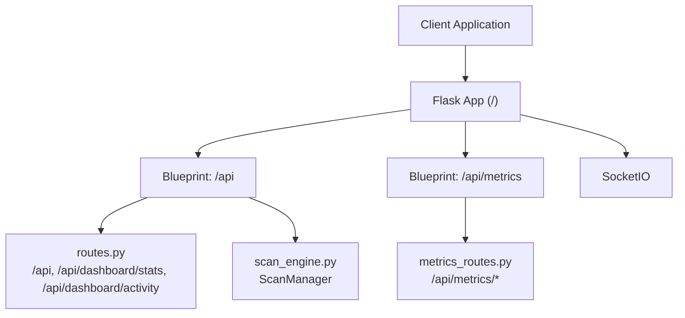
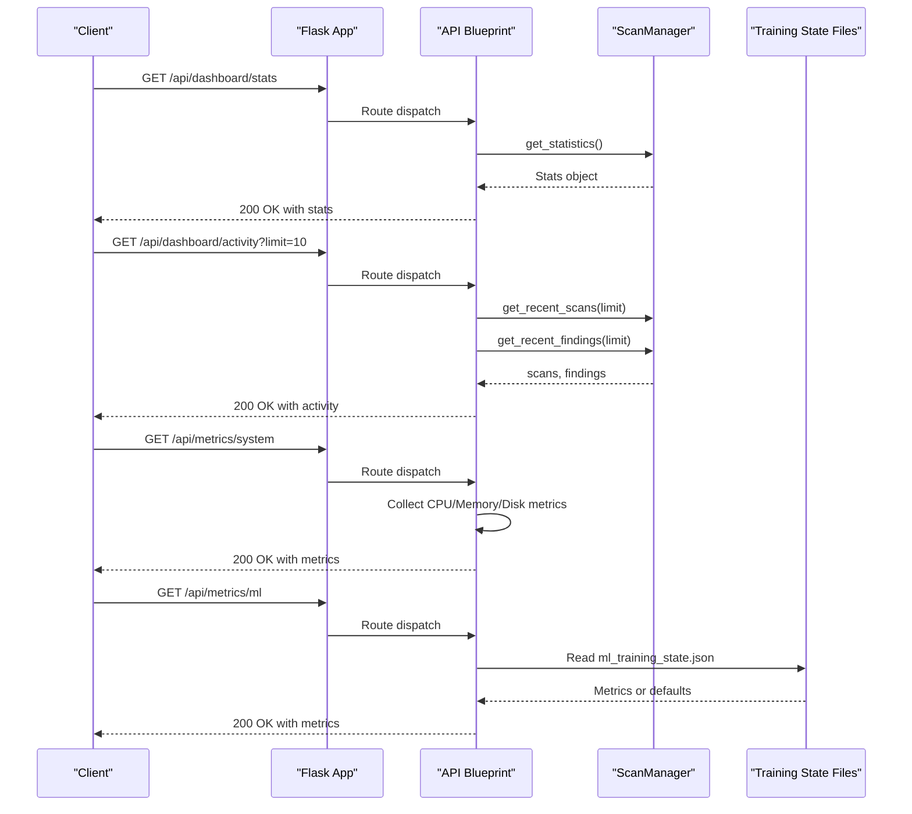
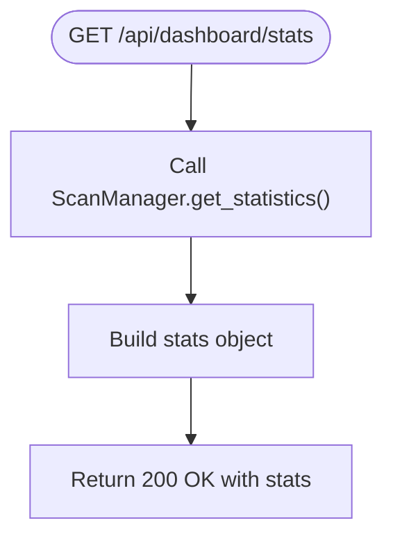
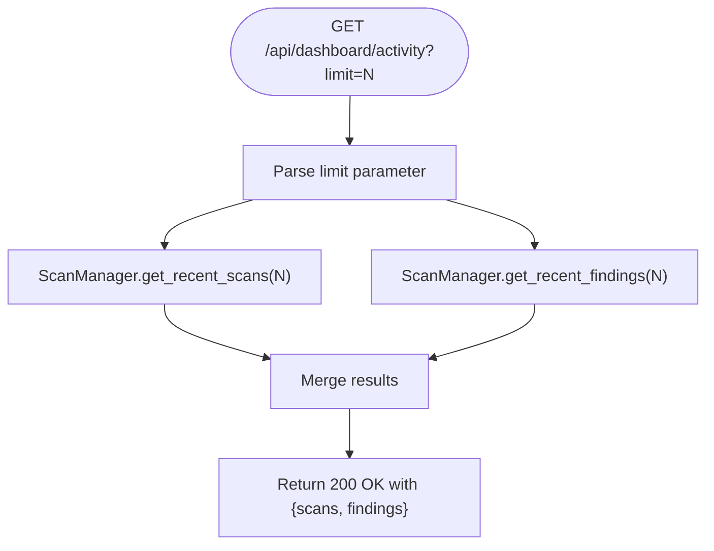
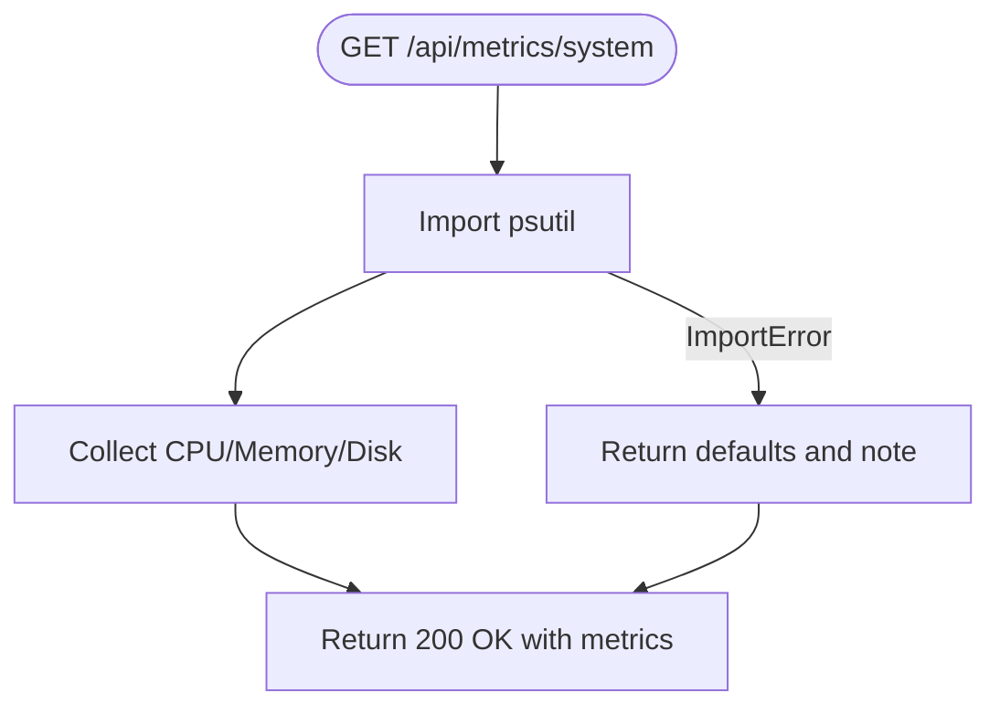
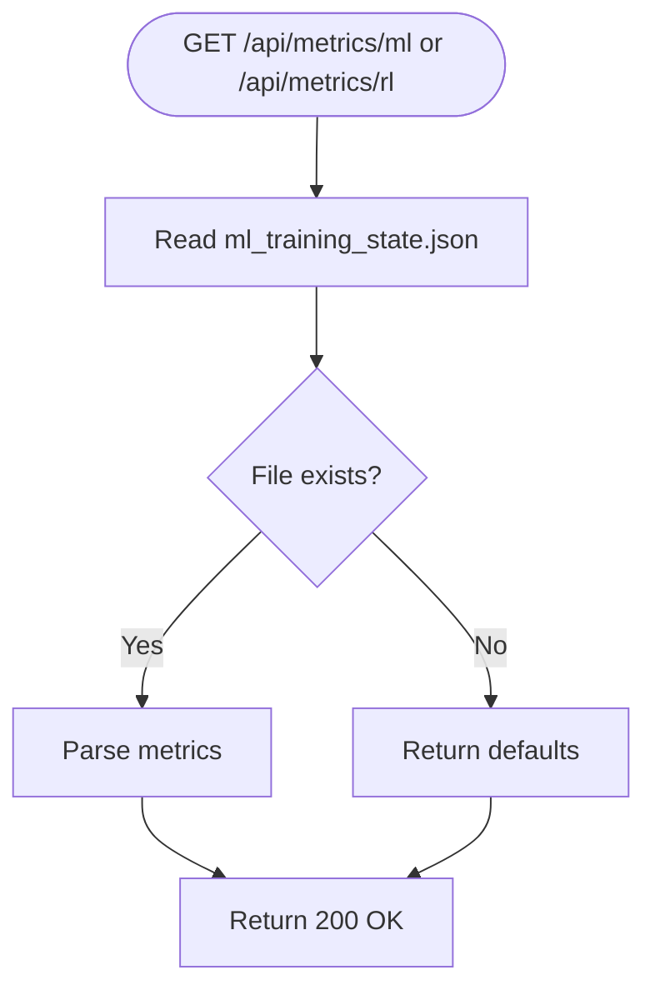
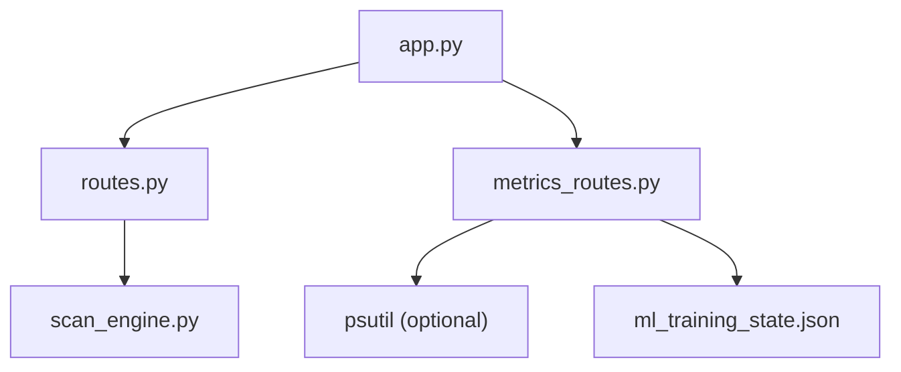

# Core API Endpoints

<cite>
**Referenced Files in This Document**
- [app.py](file://backend/app.py)
- [routes.py](file://backend/api/routes.py)
- [metrics_routes.py](file://backend/api/metrics_routes.py)
- [scan_routes.py](file://backend/api/scan_routes.py)
- [scan_engine.py](file://backend/core/scan_engine.py)
- [api.ts](file://frontend/src/services/api.ts)
- [Dashboard.tsx](file://frontend/src/pages/Dashboard.tsx)
- [models_schema.py](file://backend/models_schema.py)
- [config.py](file://backend/config.py)
</cite>

## Table of Contents
1. [Introduction](#introduction)
2. [Project Structure](#project-structure)
3. [Core Components](#core-components)
4. [Architecture Overview](#architecture-overview)
5. [Detailed Component Analysis](#detailed-component-analysis)
6. [Dependency Analysis](#dependency-analysis)
7. [Performance Considerations](#performance-considerations)
8. [Troubleshooting Guide](#troubleshooting-guide)
9. [Conclusion](#conclusion)
10. [Appendices](#appendices)

## Introduction
This document provides comprehensive API documentation for the Optimus backend REST API, focusing on dashboard statistics, recent activity, and system metrics endpoints. It covers HTTP methods, URL patterns, request/response schemas, authentication, error handling, security considerations, rate limiting, client integration guidelines, performance optimization tips, and debugging approaches. The documentation is grounded in the repository’s source files and aims to be accessible to both technical and non-technical users.

## Project Structure
The backend is a Flask application that registers multiple blueprints under the /api prefix. The core dashboard endpoints are exposed via the main API blueprint, while metrics endpoints are grouped under a dedicated metrics blueprint. The application also exposes health checks and integrates with SocketIO for real-time updates.

**Diagram sources**
- [app.py](file://backend/app.py#L179-L228)
- [routes.py](file://backend/api/routes.py#L8-L54)
- [metrics_routes.py](file://backend/api/metrics_routes.py#L11-L109)
- [scan_engine.py](file://backend/core/scan_engine.py#L26-L81)

**Section sources**
- [app.py](file://backend/app.py#L179-L228)

## Core Components
This section documents the primary endpoints relevant to dashboard statistics, recent activity, and system metrics.

- Base URL: http://<host>:<port>/api
- Additional metrics base: http://<host>:<port>/api/metrics

Endpoints:
- GET /api/
  - Purpose: Root endpoint returning API operational status and metadata.
  - Response: JSON with status, version, and timestamp.
  - Example response keys: status, version, timestamp.

- GET /api/dashboard/stats
  - Purpose: Retrieve dashboard statistics including active scans, totals, findings by severity, tools availability, and system health.
  - Response: JSON with aggregated metrics.
  - Example response keys: active_scans, total_scans, total_findings, critical_findings, high_findings, medium_findings, low_findings, tools_available, system_health.

- GET /api/dashboard/activity?limit=<number>
  - Purpose: Retrieve recent activity combining recent scans and recent findings.
  - Query Parameter: limit (integer, default 10).
  - Response: JSON containing arrays of scans and findings.
  - Example response keys: scans, findings.

- GET /api/metrics/system
  - Purpose: Retrieve system performance metrics (CPU, memory, disk utilization).
  - Response: JSON with metrics; if psutil is unavailable, returns defaults and a note.
  - Example response keys: cpu_percent, memory_percent, disk_percent (and note if applicable).

- GET /api/metrics/ml
  - Purpose: Retrieve machine learning model performance metrics.
  - Response: JSON with model metrics; returns defaults if training state file is missing.
  - Example response keys: vuln_detector (f1, precision, recall, accuracy), attack_classifier (f1, precision, recall, accuracy).

- GET /api/metrics/rl
  - Purpose: Retrieve reinforcement learning agent performance metrics.
  - Response: JSON with RL metrics; returns defaults if training state file is missing.
  - Example response keys: avg_episode_reward, episodes_trained, vulnerability_discovery_rate, time_efficiency.

- GET /api/metrics/scan-history
  - Purpose: Retrieve historical scan metrics (placeholder in current implementation).
  - Response: JSON with historical metrics structure.
  - Example response keys: total_scans, total_findings, avg_scan_time, recent_scans.

Authentication:
- The backend sets CORS allowing credentials and Authorization headers for /api/* routes. The frontend demonstrates adding an Authorization header with a bearer token when available.
- No explicit authentication middleware is enforced in the documented routes; however, CORS and Authorization headers are configured for authenticated access scenarios.

Security considerations:
- CORS is configured to allow credentials and specific headers for /api/*.
- The application uses a secret key for Flask sessions and JSON configuration.
- Environment variables are used for configuration (e.g., SECRET_KEY, KALI_*).

Rate limiting:
- No explicit rate limiting is implemented in the documented endpoints. Clients should implement client-side throttling or retries as needed.

Error handling:
- Standard HTTP status codes are used (e.g., 400 for bad requests, 404 for not found, 500 for internal errors).
- Error responses include an error message field.

**Section sources**
- [routes.py](file://backend/api/routes.py#L10-L54)
- [metrics_routes.py](file://backend/api/metrics_routes.py#L13-L109)
- [app.py](file://backend/app.py#L124-L149)
- [api.ts](file://frontend/src/services/api.ts#L31-L56)

## Architecture Overview
The dashboard endpoints integrate with the ScanManager to compute statistics and recent activity. The metrics endpoints read persisted training state files for ML/RL metrics and use psutil for system metrics when available.

**Diagram sources**
- [routes.py](file://backend/api/routes.py#L19-L54)
- [scan_engine.py](file://backend/core/scan_engine.py#L446-L476)
- [metrics_routes.py](file://backend/api/metrics_routes.py#L13-L109)

## Detailed Component Analysis

### Dashboard Statistics Endpoint
- Endpoint: GET /api/dashboard/stats
- Implementation: Calls ScanManager.get_statistics() to aggregate metrics across active scans.
- Response schema:
  - active_scans: integer
  - total_scans: integer
  - total_findings: integer
  - critical_findings: integer
  - high_findings: integer
  - medium_findings: integer
  - low_findings: integer
  - tools_available: integer
  - system_health: string (e.g., healthy)

**Diagram sources**
- [routes.py](file://backend/api/routes.py#L19-L38)
- [scan_engine.py](file://backend/core/scan_engine.py#L446-L460)

**Section sources**
- [routes.py](file://backend/api/routes.py#L19-L38)
- [scan_engine.py](file://backend/core/scan_engine.py#L446-L460)

### Recent Activity Endpoint
- Endpoint: GET /api/dashboard/activity?limit=N
- Implementation: Retrieves recent scans and findings via ScanManager methods, sorted by recency.
- Response schema:
  - scans: array of scan objects (subset of active scans)
  - findings: array of finding objects (flattened across active scans)

**Diagram sources**
- [routes.py](file://backend/api/routes.py#L40-L54)
- [scan_engine.py](file://backend/core/scan_engine.py#L462-L476)

**Section sources**
- [routes.py](file://backend/api/routes.py#L40-L54)
- [scan_engine.py](file://backend/core/scan_engine.py#L462-L476)

### System Metrics Endpoint
- Endpoint: GET /api/metrics/system
- Implementation: Uses psutil to collect CPU, memory, and disk utilization. Returns defaults and a note if psutil is unavailable.
- Response schema:
  - cpu_percent: number
  - memory_percent: number
  - disk_percent: number
  - note: string (when psutil is not installed)

**Diagram sources**
- [metrics_routes.py](file://backend/api/metrics_routes.py#L85-L109)

**Section sources**
- [metrics_routes.py](file://backend/api/metrics_routes.py#L85-L109)

### ML and RL Metrics Endpoints
- ML Metrics: GET /api/metrics/ml
  - Reads training state file and returns model performance metrics; defaults if file absent.
  - Response schema includes vulnerability detector and attack classifier metrics.

- RL Metrics: GET /api/metrics/rl
  - Reads training state file and returns RL agent metrics; defaults if file absent.
  - Response schema includes episode reward, episodes trained, discovery rate, and time efficiency.

**Diagram sources**
- [metrics_routes.py](file://backend/api/metrics_routes.py#L13-L83)

**Section sources**
- [metrics_routes.py](file://backend/api/metrics_routes.py#L13-L83)

### Client Integration Guidelines
- Frontend service integration:
  - The frontend service constructs an Axios client with base URL, timeout, and JSON headers.
  - It injects an Authorization header if a bearer token exists in local storage.
  - It handles 401 responses by removing the token and redirecting to login.
- Dashboard usage:
  - The frontend fetches dashboard stats and recent activity via dedicated methods and displays them in the dashboard page.
- Recommendations:
  - Use exponential backoff for retries on transient failures.
  - Implement optimistic UI updates with graceful fallbacks for offline scenarios.
  - Respect rate limits and cache responses where appropriate.

**Section sources**
- [api.ts](file://frontend/src/services/api.ts#L19-L57)
- [Dashboard.tsx](file://frontend/src/pages/Dashboard.tsx#L33-L67)

## Dependency Analysis
The dashboard endpoints depend on the ScanManager for statistics and recent activity. Metrics endpoints depend on external libraries and persisted files.

**Diagram sources**
- [routes.py](file://backend/api/routes.py#L22-L49)
- [metrics_routes.py](file://backend/api/metrics_routes.py#L89-L105)
- [app.py](file://backend/app.py#L179-L228)

**Section sources**
- [routes.py](file://backend/api/routes.py#L22-L49)
- [metrics_routes.py](file://backend/api/metrics_routes.py#L89-L105)
- [app.py](file://backend/app.py#L179-L228)

## Performance Considerations
- Minimize payload sizes by using pagination and filtering (e.g., limit parameter for recent activity).
- Cache frequently accessed dashboard stats and system metrics to reduce backend load.
- Monitor psutil availability and gracefully degrade metrics collection if unavailable.
- Use background tasks and asynchronous processing for long-running operations; leverage SocketIO for real-time updates.
- Optimize client polling intervals and implement exponential backoff to avoid overwhelming the server.

## Troubleshooting Guide
Common issues and resolutions:
- Unauthorized access:
  - Ensure Authorization header is present when required. The frontend removes tokens on 401 responses.
- Missing psutil:
  - The system metrics endpoint returns defaults and a note when psutil is not installed.
- File not found for ML/RL metrics:
  - The metrics endpoints return default structures when training state files are missing.
- CORS errors:
  - Verify that the frontend origin is included in allowed origins and credentials are supported.
- Rate limiting:
  - No explicit rate limiting is implemented. Apply client-side throttling and implement retry logic with backoff.

**Section sources**
- [api.ts](file://frontend/src/services/api.ts#L44-L56)
- [metrics_routes.py](file://backend/api/metrics_routes.py#L19-L38)
- [app.py](file://backend/app.py#L124-L149)

## Conclusion
The Optimus backend provides straightforward REST endpoints for dashboard statistics, recent activity, and system metrics. The design leverages a ScanManager for data aggregation and optional external libraries for system metrics. Clients should implement secure authentication, handle errors gracefully, and optimize performance through caching and controlled polling.

## Appendices

### API Definitions and Examples

- GET /api/
  - Description: Root endpoint returning API status and metadata.
  - Response fields: status, version, timestamp.
  - Example response keys: status, version, timestamp.

- GET /api/dashboard/stats
  - Description: Dashboard statistics including scan counts, findings by severity, tools availability, and system health.
  - Response fields: active_scans, total_scans, total_findings, critical_findings, high_findings, medium_findings, low_findings, tools_available, system_health.
  - Example response keys: active_scans, total_findings, critical_findings, system_health.

- GET /api/dashboard/activity?limit=N
  - Description: Recent activity combining recent scans and findings.
  - Query parameters: limit (integer, default 10).
  - Response fields: scans (array), findings (array).
  - Example response keys: scans, findings.

- GET /api/metrics/system
  - Description: System performance metrics (CPU, memory, disk).
  - Response fields: cpu_percent, memory_percent, disk_percent; note (string) if psutil not installed.
  - Example response keys: cpu_percent, memory_percent, disk_percent.

- GET /api/metrics/ml
  - Description: ML model performance metrics.
  - Response fields: vuln_detector (f1, precision, recall, accuracy), attack_classifier (f1, precision, recall, accuracy).
  - Example response keys: vuln_detector, attack_classifier.

- GET /api/metrics/rl
  - Description: RL agent performance metrics.
  - Response fields: avg_episode_reward, episodes_trained, vulnerability_discovery_rate, time_efficiency.
  - Example response keys: avg_episode_reward, episodes_trained.

- GET /api/metrics/scan-history
  - Description: Historical scan metrics (placeholder).
  - Response fields: total_scans, total_findings, avg_scan_time, recent_scans.
  - Example response keys: total_scans, avg_scan_time.

### Data Models Used by Endpoints
- Vulnerability model fields:
  - name, type, severity, confidence, evidence, location, tool, exploitable, remediation, ml_classified, pattern_matched.
- ScanState model fields:
  - scan_id, target, phase, status, start_time, findings, tools_executed, time_elapsed, coverage, risk_score, ml_confidence, phase_data.
- ToolExecution model fields:
  - tool_name, phase, parameters, start_time, end_time, exit_code, stdout, stderr, vulnerabilities_found, success.
- TrainingMetrics model fields:
  - model_name, precision, recall, f1, accuracy, sample_count, training_date.
- RLMetrics model fields:
  - avg_episode_reward, episodes_trained, vulnerability_discovery_rate, resource_efficiency, time_efficiency, adaptation_score, generalization.

**Section sources**
- [models_schema.py](file://backend/models_schema.py#L5-L85)

### Configuration Notes
- CORS allows credentials and specific headers for /api/* routes.
- Secret key and environment variables are used for configuration.
- Kali VM configuration is available for tool execution contexts.

**Section sources**
- [app.py](file://backend/app.py#L124-L149)
- [config.py](file://backend/config.py#L6-L115)