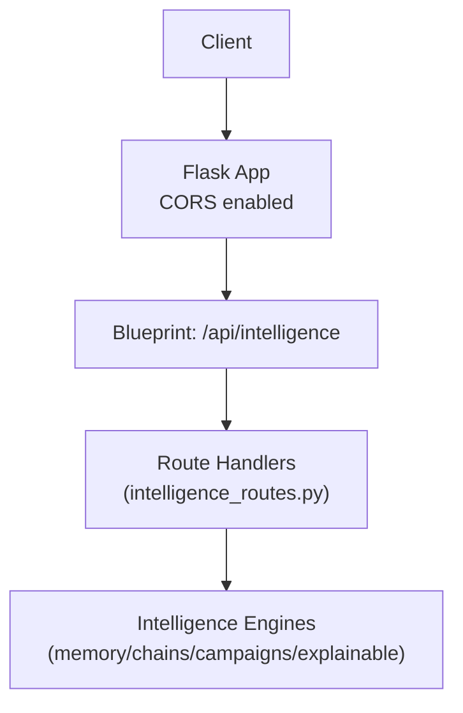
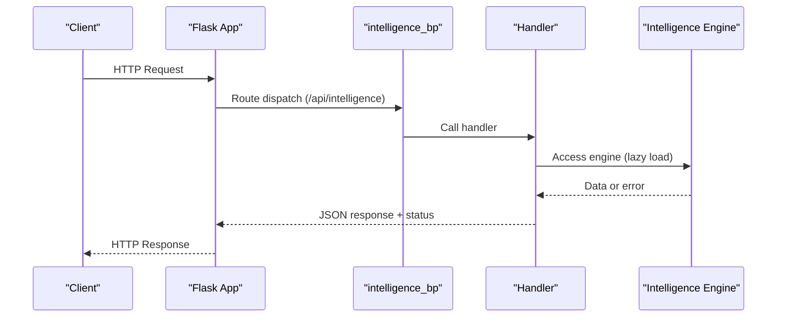
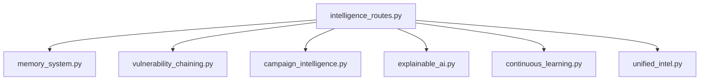

# Intelligence Service Endpoints

<cite>
**Referenced Files in This Document**
- [intelligence_routes.py](file://backend/api/intelligence_routes.py)
- [app.py](file://backend/app.py)
- [memory_system.py](file://backend/intelligence/memory_system.py)
- [vulnerability_chaining.py](file://backend/intelligence/vulnerability_chaining.py)
- [campaign_intelligence.py](file://backend/intelligence/campaign_intelligence.py)
- [explainable_ai.py](file://backend/intelligence/explainable_ai.py)
- [continuous_learning.py](file://backend/intelligence/continuous_learning.py)
- [unified_intel.py](file://backend/intelligence/unified_intel.py)
</cite>

## Table of Contents
1. [Introduction](#introduction)
2. [Project Structure](#project-structure)
3. [Core Components](#core-components)
4. [Architecture Overview](#architecture-overview)
5. [Detailed Component Analysis](#detailed-component-analysis)
6. [Dependency Analysis](#dependency-analysis)
7. [Performance Considerations](#performance-considerations)
8. [Troubleshooting Guide](#troubleshooting-guide)
9. [Conclusion](#conclusion)

## Introduction
This document describes the Optimus intelligence service REST API, focusing on endpoints for retrieving intelligence summaries, learning insights, and adaptive recommendations. It covers HTTP methods, URL patterns, request/response schemas, authentication, error handling, and practical client integration guidelines. The service exposes capabilities for memory and learning insights, vulnerability chaining, campaign intelligence, explainable AI decision auditing, and zero-day anomaly investigation.

## Project Structure
The intelligence API is implemented as a Flask blueprint mounted under `/api/intelligence`. It delegates to specialized intelligence engines that encapsulate memory, chaining, campaigns, explainability, and continuous learning.

**Diagram sources**
- [intelligence_routes.py](file://backend/api/intelligence_routes.py#L1-L315)
- [app.py](file://backend/app.py#L124-L149)

**Section sources**
- [intelligence_routes.py](file://backend/api/intelligence_routes.py#L1-L315)
- [app.py](file://backend/app.py#L124-L149)

## Core Components
- Memory and Learning: Retrieve memory statistics, target profiles, and best attack patterns.
- Vulnerability Chaining: Analyze findings to discover exploit chains and generate detailed exploitation plans.
- Campaign Intelligence: Create multi-target campaigns, compute optimized scanning orders, and derive recommendations.
- Explainable AI: Audit AI decisions and produce compliance-ready reports.
- Zero-Day Discovery: Query anomaly queues and mark anomalies as resolved.

**Section sources**
- [intelligence_routes.py](file://backend/api/intelligence_routes.py#L56-L315)
- [memory_system.py](file://backend/intelligence/memory_system.py#L42-L800)
- [vulnerability_chaining.py](file://backend/intelligence/vulnerability_chaining.py#L660-L940)
- [campaign_intelligence.py](file://backend/intelligence/campaign_intelligence.py#L507-L689)
- [explainable_ai.py](file://backend/intelligence/explainable_ai.py#L682-L932)
- [continuous_learning.py](file://backend/intelligence/continuous_learning.py#L681-L946)

## Architecture Overview
The intelligence API routes delegate to lazy-loaded intelligence engines. Each route returns JSON responses with appropriate HTTP status codes and logs errors for diagnostics.

**Diagram sources**
- [intelligence_routes.py](file://backend/api/intelligence_routes.py#L14-L52)
- [app.py](file://backend/app.py#L194-L196)

## Detailed Component Analysis

### Authentication and Security
- No explicit authentication middleware is enforced in the intelligence routes.
- CORS is configured broadly for development origins; production deployments should restrict origins and enforce authentication/authorization.
- Sensitive operations should be protected behind an auth layer (e.g., Authorization header) and validated at the application gateway or reverse proxy.

**Section sources**
- [intelligence_routes.py](file://backend/api/intelligence_routes.py#L6-L11)
- [app.py](file://backend/app.py#L124-L149)

### Endpoints Reference

#### Memory and Learning
- GET /api/intelligence/memory/stats
  - Purpose: Retrieve memory system statistics including scan stats and tool effectiveness.
  - Responses:
    - 200: { "scan_stats": ..., "tool_effectiveness": { ... } }
    - 503: {"error": "..."} when memory system unavailable.
    - 500: {"error": "..."} on processing errors.
  - Notes: Tool effectiveness aggregated across predefined tools.

- GET /api/intelligence/memory/target/{target_hash}
  - Purpose: Retrieve stored profile for a hashed target.
  - Path parameters:
    - target_hash: string (URL-encoded hash).
  - Responses:
    - 200: Target profile object.
    - 404: {"error": "Target profile not found"}.
    - 503/500: Error responses.

- GET /api/intelligence/memory/patterns
  - Purpose: Get best attack patterns for a target type.
  - Query parameters:
    - target_type: string (default "web").
    - limit: integer (default 10).
  - Responses:
    - 200: {"patterns": [ ... ]}.
    - 503/500: Error responses.

**Section sources**
- [intelligence_routes.py](file://backend/api/intelligence_routes.py#L56-L106)
- [memory_system.py](file://backend/intelligence/memory_system.py#L416-L471)

#### Vulnerability Chaining
- POST /api/intelligence/chains/analyze
  - Purpose: Analyze findings to discover exploit chains.
  - Request body:
    - findings: array of vulnerability objects (schema: see Vulnerability).
  - Responses:
    - 200: Analysis result (chains, stats).
    - 503: {"error": "..."} when intelligence system or chain engine unavailable.
    - 500: {"error": "..."} on processing errors.

- GET /api/intelligence/chains/{chain_id}/plan
  - Purpose: Get detailed exploitation plan for a discovered chain.
  - Path parameters:
    - chain_id: string.
  - Responses:
    - 200: Plan object (steps, prerequisites, recommendations).
    - 404: {"error": "Chain not found"}.
    - 503/500: Error responses.

**Section sources**
- [intelligence_routes.py](file://backend/api/intelligence_routes.py#L110-L151)
- [vulnerability_chaining.py](file://backend/intelligence/vulnerability_chaining.py#L680-L777)

#### Campaign Intelligence
- POST /api/intelligence/campaigns
  - Purpose: Create a new multi-target campaign.
  - Request body:
    - name: string.
    - targets: array of target objects (each with url and optional priority/scope).
    - sector: string (default "unknown").
  - Responses:
    - 201: {"campaign_id": string}.
    - 503: {"error": "..."} when campaign engine unavailable.
    - 500: {"error": "..."} on processing errors.

- GET /api/intelligence/campaigns/{campaign_id}
  - Purpose: Get insights for a campaign.
  - Path parameters:
    - campaign_id: string.
  - Responses:
    - 200: Campaign insights (progress, findings, timing, patterns).
    - 404: {"error": "Campaign not found"}.
    - 503/500: Error responses.

- GET /api/intelligence/campaigns/{campaign_id}/optimize
  - Purpose: Get optimized scanning order for targets.
  - Responses:
    - 200: {"scan_order": [ ... ]}.
    - 503/500: Error responses.

- GET /api/intelligence/campaigns/{campaign_id}/recommendations/{target_url}
  - Purpose: Get recommendations for a target based on campaign learnings.
  - Path parameters:
    - campaign_id: string.
    - target_url: string (path-encoded).
  - Responses:
    - 200: Recommendations (recommended tools, predicted vulnerabilities, common defenses, estimated findings).
    - 503/500: Error responses.

**Section sources**
- [intelligence_routes.py](file://backend/api/intelligence_routes.py#L155-L220)
- [campaign_intelligence.py](file://backend/intelligence/campaign_intelligence.py#L522-L580)

#### Explainable AI
- GET /api/intelligence/decisions/audit
  - Purpose: Get AI decision audit trail.
  - Query parameters:
    - scan_id: optional string.
  - Responses:
    - 200: Audit trail (array of decisions).
    - 503/500: Error responses.

- GET /api/intelligence/decisions/report
  - Purpose: Get decision audit statistics.
  - Responses:
    - 200: Audit report (counts, confidence distribution, timeline).
    - 503/500: Error responses.

**Section sources**
- [intelligence_routes.py](file://backend/api/intelligence_routes.py#L223-L251)
- [explainable_ai.py](file://backend/intelligence/explainable_ai.py#L341-L464)

#### Intelligence Status and Zero-Day Discovery
- GET /api/intelligence/status
  - Purpose: Get status of intelligence subsystems.
  - Responses:
    - 200: Status object.
    - 503/500: Error responses.

- GET /api/intelligence/zeroday/queue
  - Purpose: Get anomalies requiring investigation.
  - Responses:
    - 200: {"queue": [ ... ]}.
    - 503/500: Error responses.

- POST /api/intelligence/zeroday/{anomaly_id}/resolve
  - Purpose: Mark an anomaly as resolved.
  - Path parameters:
    - anomaly_id: string.
  - Request body:
    - vuln_type: string (type of known vulnerability or classification).
  - Responses:
    - 200: {"status": "resolved"}.
    - 503/500: Error responses.

**Section sources**
- [intelligence_routes.py](file://backend/api/intelligence_routes.py#L255-L315)
- [continuous_learning.py](file://backend/intelligence/continuous_learning.py#L681-L734)

### Request Payload Schemas

- GET /api/intelligence/memory/patterns
  - Query parameters:
    - target_type: string (e.g., "web", "api", "cloud").
    - limit: integer (e.g., 5–20).

- POST /api/intelligence/chains/analyze
  - Body:
    - findings: array of objects with keys:
      - id: string (optional).
      - type: string (mapped to vulnerability types).
      - title: string.
      - description: string.
      - severity: number (0–10 scale).
      - url/endpoint: string.
      - parameter: string (optional).
      - evidence: string (optional).
      - complexity: string ("low", "medium", "high").
      - requires_auth: boolean.

- POST /api/intelligence/campaigns
  - Body:
    - name: string.
    - targets: array of objects with keys:
      - url: string.
      - priority: integer (optional).
      - scope: string (e.g., "standard", "comprehensive", "quick").
    - sector: string (e.g., "technology", "finance").

- POST /api/intelligence/zeroday/{anomaly_id}/resolve
  - Body:
    - vuln_type: string (e.g., "known_cve", "false_positive").

**Section sources**
- [intelligence_routes.py](file://backend/api/intelligence_routes.py#L92-L106)
- [vulnerability_chaining.py](file://backend/intelligence/vulnerability_chaining.py#L314-L391)
- [campaign_intelligence.py](file://backend/intelligence/campaign_intelligence.py#L269-L309)
- [continuous_learning.py](file://backend/intelligence/continuous_learning.py#L793-L800)

### Response Schemas

- GET /api/intelligence/memory/stats
  - Response:
    - scan_stats: object (aggregated scan metrics).
    - tool_effectiveness: object keyed by tool name with values:
      - success_rate: number.
      - avg_vulns: number.
      - avg_time: number.
      - sample_count: integer.

- GET /api/intelligence/memory/target/{target_hash}
  - Response: Target profile object with keys:
    - id, target_hash, target_type, technologies[], open_ports[], vulnerabilities_found[], successful_tools[], failed_tools[], waf_detected: boolean, first_seen, last_seen, scan_count: integer.

- GET /api/intelligence/memory/patterns
  - Response:
    - patterns: array of objects with keys:
      - id, target_type, technology_stack[], attack_sequence[], success_rate, avg_time_seconds, findings_count, use_count.

- POST /api/intelligence/chains/analyze
  - Response:
    - vulnerabilities_analyzed: integer.
    - graph_stats: object (counts and distributions).
    - chains_found: integer.
    - top_chains: array of chain summaries.
    - highest_impact_chain: object or null.
    - entry_points[], high_value_targets[].

- GET /api/intelligence/chains/{chain_id}/plan
  - Response:
    - chain_id, description, final_impact, success_probability, total_severity.
    - steps: array of objects with keys:
      - step: integer.
      - vulnerability, type, target, severity, complexity.
      - tools[], payloads[], verification, fallback.
    - prerequisites[], recommendations[].

- POST /api/intelligence/campaigns
  - Response:
    - campaign_id: string.

- GET /api/intelligence/campaigns/{campaign_id}
  - Response:
    - campaign_id, name, status, progress (totals and counts), findings (totals and averages), timing (start/end/total_scan_time), patterns (optional).

- GET /api/intelligence/campaigns/{campaign_id}/optimize
  - Response:
    - scan_order: array of objects with keys:
      - target_id, target_url, score, priority, estimated_duration.

- GET /api/intelligence/campaigns/{campaign_id}/recommendations/{target_url}
  - Response:
    - recommended_tools: array of objects with keys:
      - tool, success_rate, based_on.
    - predicted_vulnerabilities: array of objects with keys:
      - vulnerability_type, likelihood_score, based_on.
    - common_defenses: array of strings.
    - estimated_findings: integer.

- GET /api/intelligence/decisions/audit
  - Response:
    - Array of decision records with keys:
      - id, timestamp, decision_type, context (summary), decision, factors[], alternatives[], confidence, confidence_score, explanation, outcome.

- GET /api/intelligence/decisions/report
  - Response:
    - generated_at, total_decisions, by_type, confidence_distribution, low_confidence_decisions[], decision_timeline[].

- GET /api/intelligence/status
  - Response:
    - status object (engine availability and health).

- GET /api/intelligence/zeroday/queue
  - Response:
    - queue: array of anomaly objects with keys:
      - id, anomaly_type, description, confidence, endpoint, payload?, response_snippet, baseline_deviation, timestamp, investigation_priority.

- POST /api/intelligence/zeroday/{anomaly_id}/resolve
  - Response:
    - status: "resolved".

**Section sources**
- [intelligence_routes.py](file://backend/api/intelligence_routes.py#L64-L106)
- [memory_system.py](file://backend/intelligence/memory_system.py#L553-L586)
- [vulnerability_chaining.py](file://backend/intelligence/vulnerability_chaining.py#L705-L777)
- [campaign_intelligence.py](file://backend/intelligence/campaign_intelligence.py#L403-L441)
- [explainable_ai.py](file://backend/intelligence/explainable_ai.py#L397-L464)
- [continuous_learning.py](file://backend/intelligence/continuous_learning.py#L793-L800)

### Error Handling Strategies
- Availability failures:
  - 503: Returned when required engines (memory, chain, campaign, explainable, zeroday) are unavailable during initialization or runtime.
- Not found:
  - 404: Returned when requested resources (e.g., campaign, chain, target profile) are missing.
- Processing errors:
  - 500: Returned for exceptions during analysis, planning, or recommendation generation.
- Logging:
  - Handlers log structured errors with stack traces for diagnostics.

**Section sources**
- [intelligence_routes.py](file://backend/api/intelligence_routes.py#L60-L73)
- [intelligence_routes.py](file://backend/api/intelligence_routes.py#L136-L151)
- [intelligence_routes.py](file://backend/api/intelligence_routes.py#L179-L189)
- [intelligence_routes.py](file://backend/api/intelligence_routes.py#L227-L236)
- [intelligence_routes.py](file://backend/api/intelligence_routes.py#L299-L314)

### Client Implementation Guidelines
- Base URL: Use the backend’s base URL hosting the Flask app; intelligence endpoints are under /api/intelligence.
- CORS: Ensure browser clients whitelist the backend origin; server allows credentials and multiple dev origins.
- Authentication: Implement Authorization headers and secure tokens at the application gateway or reverse proxy; do not rely on implicit trust.
- Idempotency: Prefer GET for retrievals; use POST/PATCH for state-changing operations.
- Pagination/limits: Respect limit parameters for pattern and campaign endpoints to avoid large payloads.
- Error handling: Parse JSON error bodies and display user-friendly messages; log correlation IDs when available.

**Section sources**
- [app.py](file://backend/app.py#L124-L149)
- [intelligence_routes.py](file://backend/api/intelligence_routes.py#L14-L52)

### Performance Considerations
- Asynchronous orchestration: Use the provided engines’ asynchronous helpers where applicable (e.g., unified intelligence search) to reduce latency.
- Caching: Leverage memory system caches for tool effectiveness and target profiles to minimize repeated computations.
- Batch operations: Combine related requests (e.g., analyze multiple findings in one call) to reduce overhead.
- Concurrency: Offload heavy computations to background workers or separate services to keep API responsive.

**Section sources**
- [unified_intel.py](file://backend/intelligence/unified_intel.py#L72-L124)
- [memory_system.py](file://backend/intelligence/memory_system.py#L61-L69)

### Debugging Approaches
- Enable backend logging and inspect structured logs for error traces.
- Use GET /api/intelligence/decisions/audit with optional scan_id to trace AI decisions.
- Verify engine availability via GET /api/intelligence/status.
- For chaining issues, inspect POST /api/intelligence/chains/analyze response for graph stats and top chains.

**Section sources**
- [intelligence_routes.py](file://backend/api/intelligence_routes.py#L255-L271)
- [explainable_ai.py](file://backend/intelligence/explainable_ai.py#L397-L405)

### Common Use Cases
- Adaptive exploitation recommendations:
  - Use GET /api/intelligence/campaigns/{campaign_id}/recommendations/{target_url} to receive recommended tools and predicted vulnerabilities derived from cross-scan learning.
- Cross-scan learning:
  - Retrieve memory stats and patterns via GET /api/intelligence/memory/stats and GET /api/intelligence/memory/patterns to inform scanning strategies.
- Explainable AI insights:
  - Audit decision-making with GET /api/intelligence/decisions/audit and GET /api/intelligence/decisions/report for compliance and transparency.

**Section sources**
- [intelligence_routes.py](file://backend/api/intelligence_routes.py#L175-L220)
- [intelligence_routes.py](file://backend/api/intelligence_routes.py#L56-L106)
- [explainable_ai.py](file://backend/intelligence/explainable_ai.py#L415-L464)

## Dependency Analysis
The intelligence routes depend on lazily loaded engines. The following diagram maps key dependencies among modules.

**Diagram sources**
- [intelligence_routes.py](file://backend/api/intelligence_routes.py#L14-L52)
- [memory_system.py](file://backend/intelligence/memory_system.py#L42-L70)
- [vulnerability_chaining.py](file://backend/intelligence/vulnerability_chaining.py#L660-L678)
- [campaign_intelligence.py](file://backend/intelligence/campaign_intelligence.py#L507-L521)
- [explainable_ai.py](file://backend/intelligence/explainable_ai.py#L682-L696)
- [continuous_learning.py](file://backend/intelligence/continuous_learning.py#L681-L702)
- [unified_intel.py](file://backend/intelligence/unified_intel.py#L52-L71)

**Section sources**
- [intelligence_routes.py](file://backend/api/intelligence_routes.py#L14-L52)

## Performance Considerations
- Minimize payload sizes by limiting returned lists (e.g., patterns, recommendations).
- Cache frequently accessed data (e.g., tool effectiveness, target profiles) in memory.
- Use pagination and filtering (e.g., target_type, limit) to reduce response sizes.
- Offload long-running analyses to background jobs and poll for results.

[No sources needed since this section provides general guidance]

## Troubleshooting Guide
- 503 Service Unavailable:
  - Indicates that a required intelligence engine could not be loaded or is not initialized. Retry after verifying engine availability.
- 404 Not Found:
  - Resource does not exist (e.g., campaign, chain, target profile). Verify identifiers and parameters.
- 500 Internal Server Error:
  - Unexpected processing failure. Inspect backend logs for stack traces and correlation IDs.

**Section sources**
- [intelligence_routes.py](file://backend/api/intelligence_routes.py#L60-L73)
- [intelligence_routes.py](file://backend/api/intelligence_routes.py#L136-L151)
- [intelligence_routes.py](file://backend/api/intelligence_routes.py#L179-L189)
- [intelligence_routes.py](file://backend/api/intelligence_routes.py#L227-L236)
- [intelligence_routes.py](file://backend/api/intelligence_routes.py#L299-L314)

## Conclusion
The Optimus intelligence service exposes a cohesive set of endpoints for memory insights, vulnerability chaining, campaign intelligence, explainable AI, and anomaly investigation. Clients should implement robust authentication, handle error responses gracefully, and leverage caching and batching for performance. The provided schemas and examples enable integration for adaptive exploitation recommendations, cross-scan learning, and explainable AI reporting.