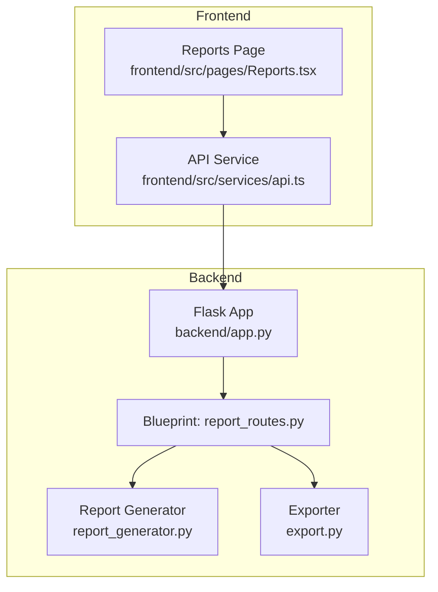
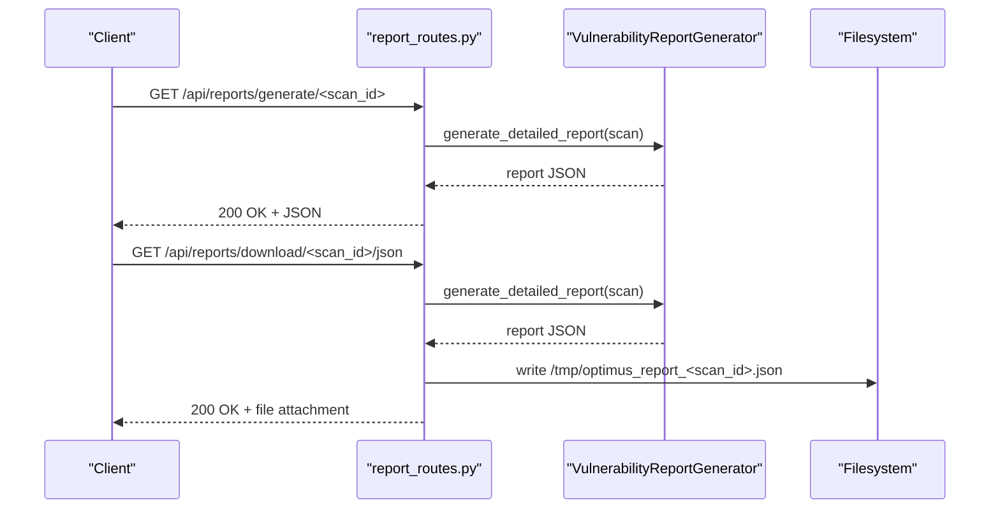
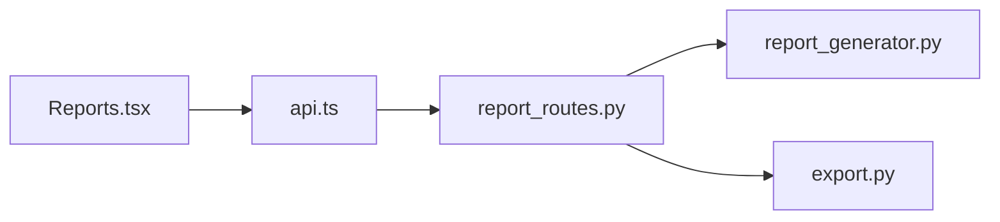

# Reporting Endpoints

<cite>
**Referenced Files in This Document**
- [app.py](file://backend/app.py)
- [report_routes.py](file://backend/api/report_routes.py)
- [report_generator.py](file://backend/reporting/report_generator.py)
- [export.py](file://backend/reporting/export.py)
- [USER_GUIDE_REPORTS.md](file://docs/USER_GUIDE_REPORTS.md)
- [api.ts](file://frontend/src/services/api.ts)
- [Reports.tsx](file://frontend/src/pages/Reports.tsx)
</cite>

## Table of Contents
1. [Introduction](#introduction)
2. [Project Structure](#project-structure)
3. [Core Components](#core-components)
4. [Architecture Overview](#architecture-overview)
5. [Detailed Component Analysis](#detailed-component-analysis)
6. [Dependency Analysis](#dependency-analysis)
7. [Performance Considerations](#performance-considerations)
8. [Troubleshooting Guide](#troubleshooting-guide)
9. [Conclusion](#conclusion)
10. [Appendices](#appendices)

## Introduction
This document describes the Optimus reporting REST API endpoints for generating, retrieving, and exporting vulnerability reports. It covers HTTP methods, URL patterns, request/response schemas, authentication, error handling, and client integration guidance. It also includes examples for GET requests to retrieve scan reports, POST requests to generate reports, and DELETE semantics for removing old reports. The guide provides practical guidance for automated report generation, manual retrieval, and multi-format export operations.

## Project Structure
The reporting functionality is exposed via Flask blueprints and implemented by report generators and exporters. The API is mounted under /api/reports and integrates with the frontend reporting dashboard.

**Diagram sources**
- [app.py](file://backend/app.py#L208-L212)
- [report_routes.py](file://backend/api/report_routes.py#L33-L124)
- [report_generator.py](file://backend/reporting/report_generator.py#L14-L438)
- [export.py](file://backend/reporting/export.py#L11-L191)
- [api.ts](file://frontend/src/services/api.ts#L237-L272)
- [Reports.tsx](file://frontend/src/pages/Reports.tsx#L239-L442)

**Section sources**
- [app.py](file://backend/app.py#L208-L212)
- [report_routes.py](file://backend/api/report_routes.py#L33-L124)

## Core Components
- Report API Blueprint: Defines endpoints for report generation, retrieval, vulnerability details, executive summary, remediation plan, and download.
- Report Generator: Produces structured vulnerability reports with metadata, executive summary, vulnerability entries, attack chains, and recommendations.
- Exporter: Serializes reports to JSON and supports HTML and Markdown export formats.

Key responsibilities:
- Validate scan existence in active scans or history.
- Generate detailed reports from scan state.
- Support JSON export and file download.
- Provide vulnerability-level details and aggregated summaries.

**Section sources**
- [report_routes.py](file://backend/api/report_routes.py#L33-L124)
- [report_generator.py](file://backend/reporting/report_generator.py#L14-L438)
- [export.py](file://backend/reporting/export.py#L11-L191)

## Architecture Overview
The reporting API is a thin controller layer that delegates to the report generator. For downloads, the generator produces a JSON report, which is persisted to disk and served as a file attachment.

**Diagram sources**
- [report_routes.py](file://backend/api/report_routes.py#L35-L80)
- [report_generator.py](file://backend/reporting/report_generator.py#L19-L41)

## Detailed Component Analysis

### Endpoint Catalog

- Base URL: /api/reports
- Authentication: Optional bearer token via Authorization header; endpoints do not enforce authentication in the blueprint.
- Content-Type: application/json for requests expecting JSON payloads.

Endpoints:
- GET /generate/<scan_id>
  - Purpose: Generate a comprehensive report for a scan.
  - Path parameters: scan_id (string).
  - Response: Report JSON (see schemas below).
  - Status codes: 200 on success, 404 if scan not found.

- GET /download/<scan_id>/<format>
  - Purpose: Download a report in the specified format.
  - Path parameters: scan_id (string), format (string).
  - Supported formats: json (others ignored and fall back to JSON).
  - Response: File attachment (.json).
  - Status codes: 200 on success, 404 if scan not found, 400 if unsupported format.

- GET /vulnerability/<scan_id>/<vuln_id>
  - Purpose: Retrieve detailed information for a specific vulnerability.
  - Path parameters: scan_id (string), vuln_id (string).
  - Response: Vulnerability entry JSON (see schemas below).
  - Status codes: 200 on success, 404 if scan not found or vulnerability not found.

- GET /executive-summary/<scan_id>
  - Purpose: Retrieve the executive summary portion of a report.
  - Path parameters: scan_id (string).
  - Response: Executive summary JSON (see schemas below).
  - Status codes: 200 on success, 404 if scan not found.

- GET /remediation-plan/<scan_id>
  - Purpose: Retrieve the prioritized remediation plan.
  - Path parameters: scan_id (string).
  - Response: Remediation plan JSON (see schemas below).
  - Status codes: 200 on success, 404 if scan not found.

Notes:
- DELETE endpoints for report removal are not implemented in the current blueprint. Clients should rely on scan lifecycle management and history retention policies.

**Section sources**
- [report_routes.py](file://backend/api/report_routes.py#L35-L124)

### Request Payload Schemas

- Generate report (POST to legacy-style endpoint in frontend integration)
  - Fields:
    - format: string, optional, default json. Supported values: json, pdf, html (only json is supported by backend).
  - Example:
    - { "format": "json" }

- Download report (GET with query parameter in frontend integration)
  - Query parameters:
    - format: string, default json. Supported values: json, pdf, html.
  - Example:
    - GET /api/reports/{reportId}/download?format=json

- Vulnerability details (GET)
  - No request body.

- Executive summary (GET)
  - No request body.

- Remediation plan (GET)
  - No request body.

**Section sources**
- [api.ts](file://frontend/src/services/api.ts#L241-L263)
- [report_routes.py](file://backend/api/report_routes.py#L50-L80)

### Response Schemas

- Report (GET /generate/<scan_id>)
  - Fields:
    - metadata: object
      - report_id: string
      - scan_id: string
      - target: string
      - generated_at: string (ISO 8601)
      - tools_used: array of strings
      - duration_seconds: number
      - coverage_percentage: number
    - executive_summary: object
      - risk_level: string ("Low", "Medium", "High", "Critical")
      - total_findings: integer
      - critical_vulnerabilities: integer
      - high_vulnerabilities: integer
      - medium_vulnerabilities: integer
      - low_vulnerabilities: integer
      - summary_text: string
    - vulnerabilities: array of vulnerability entries
    - attack_chain: array of objects
      - step: integer
      - finding_id: string
      - vulnerability: string
      - type: string
      - severity: string
    - recommendations: array of recommendation objects
      - priority: string
      - category: string
      - description: string
      - implementation: string

- Vulnerability entry (GET /vulnerability/<scan_id>/<vuln_id>)
  - Fields:
    - id: string
    - title: string
    - severity: string ("Critical", "High", "Medium", "Low")
    - cvss_score: number
    - cwe_id: string
    - owasp_category: string
    - description: string
    - reproduction_steps: array of strings
    - technical_details: object
      - location: string
      - parameter: string
      - method: string
      - payload: string
      - response: string
      - request: string
    - poc: object
      - request: string
      - response: string
      - payload: string
      - screenshot: string
    - impact: object
      - confidentiality: string
      - integrity: string
      - availability: string
    - remediation: object
      - immediate: string
      - long_term: string
      - code_example: string
    - references: array of objects
      - title: string
      - url: string
    - evidence: array of strings

- Executive summary (GET /executive-summary/<scan_id>)
  - Fields:
    - risk_level: string
    - total_findings: integer
    - critical_vulnerabilities: integer
    - high_vulnerabilities: integer
    - medium_vulnerabilities: integer
    - low_vulnerabilities: integer
    - summary_text: string

- Remediation plan (GET /remediation-plan/<scan_id>)
  - Fields:
    - Array of recommendation objects
      - priority: string
      - category: string
      - description: string
      - implementation: string

- Download response (GET /download/<scan_id>/<format>)
  - Response type: File attachment (application/octet-stream)
  - Filename: optimus_report_<scan_id>.json

**Section sources**
- [report_generator.py](file://backend/reporting/report_generator.py#L19-L438)

### Authentication and Authorization
- The reporting blueprint does not enforce authentication. The frontend API service attaches an Authorization header if a token exists in local storage.
- Production environments should configure authentication middleware at the application layer.

**Section sources**
- [report_routes.py](file://backend/api/report_routes.py#L5-L8)
- [api.ts](file://frontend/src/services/api.ts#L32-L42)

### Error Handling
- Scan not found:
  - 404 Not Found with JSON error object.
- Unsupported format for download:
  - 400 Bad Request with JSON error object.
- General server errors:
  - 500 Internal Server Error with JSON error object.

**Section sources**
- [report_routes.py](file://backend/api/report_routes.py#L41-L42)
- [report_routes.py](file://backend/api/report_routes.py#L62-L63)
- [app.py](file://backend/app.py#L311-L318)

### Client Implementation Guidelines
- Retrieve a scan’s findings and metadata from scan endpoints, then call report generation.
- Use the frontend API service patterns for generating and downloading reports.
- For automated workflows:
  - Poll scan status until completion.
  - Call report generation endpoint.
  - Optionally download the JSON report for downstream processing.

**Section sources**
- [api.ts](file://frontend/src/services/api.ts#L241-L263)
- [Reports.tsx](file://frontend/src/pages/Reports.tsx#L251-L283)

## Dependency Analysis
The reporting API depends on the report generator to produce structured report data. Downloads depend on filesystem persistence and file serving.

**Diagram sources**
- [report_routes.py](file://backend/api/report_routes.py#L35-L124)
- [report_generator.py](file://backend/reporting/report_generator.py#L14-L438)
- [export.py](file://backend/reporting/export.py#L11-L191)
- [api.ts](file://frontend/src/services/api.ts#L237-L272)
- [Reports.tsx](file://frontend/src/pages/Reports.tsx#L239-L442)

**Section sources**
- [report_routes.py](file://backend/api/report_routes.py#L35-L124)
- [report_generator.py](file://backend/reporting/report_generator.py#L14-L438)
- [export.py](file://backend/reporting/export.py#L11-L191)

## Performance Considerations
- Report generation cost scales with the number of findings. For large scans, expect increased CPU and memory usage.
- Use pagination and filtering on the frontend to limit the number of findings processed per request.
- Prefer JSON export for machine consumption; HTML and Markdown exports involve additional rendering overhead.
- Cache frequently accessed report segments (e.g., executive summary) when building dashboards.

## Troubleshooting Guide
Common issues and resolutions:
- Report not found:
  - Ensure the scan_id is valid and corresponds to a completed or recent scan.
  - Verify the scan exists in active scans or history.
- Download fails:
  - Confirm the scan completed successfully.
  - Check filesystem permissions for the temporary directory.
  - Validate that the requested format is supported (only JSON is supported by backend).
- Empty or partial findings:
  - Ensure the scan ran for sufficient time and had required tools available.
  - Verify target accessibility during the scan.

**Section sources**
- [report_routes.py](file://backend/api/report_routes.py#L41-L42)
- [report_routes.py](file://backend/api/report_routes.py#L55-L56)
- [report_routes.py](file://backend/api/report_routes.py#L62-L63)
- [USER_GUIDE_REPORTS.md](file://docs/USER_GUIDE_REPORTS.md#L240-L256)

## Conclusion
The Optimus reporting REST API provides a straightforward interface for generating and exporting vulnerability reports. It supports JSON-based report generation and file downloads, with clear schemas for reports, vulnerability entries, and summaries. Clients should integrate with the frontend API patterns for reliable automation and leverage the provided schemas for robust integrations.

## Appendices

### API Examples

- Retrieve a scan report (GET)
  - Request:
    - GET /api/reports/generate/{scan_id}
  - Response:
    - 200 OK with report JSON

- Download a report (GET)
  - Request:
    - GET /api/reports/download/{scan_id}/json
  - Response:
    - 200 OK with file attachment

- Get vulnerability details (GET)
  - Request:
    - GET /api/reports/vulnerability/{scan_id}/{vuln_id}
  - Response:
    - 200 OK with vulnerability entry JSON

- Get executive summary (GET)
  - Request:
    - GET /api/reports/executive-summary/{scan_id}
  - Response:
    - 200 OK with executive summary JSON

- Get remediation plan (GET)
  - Request:
    - GET /api/reports/remediation-plan/{scan_id}
  - Response:
    - 200 OK with remediation plan JSON

**Section sources**
- [report_routes.py](file://backend/api/report_routes.py#L35-L124)