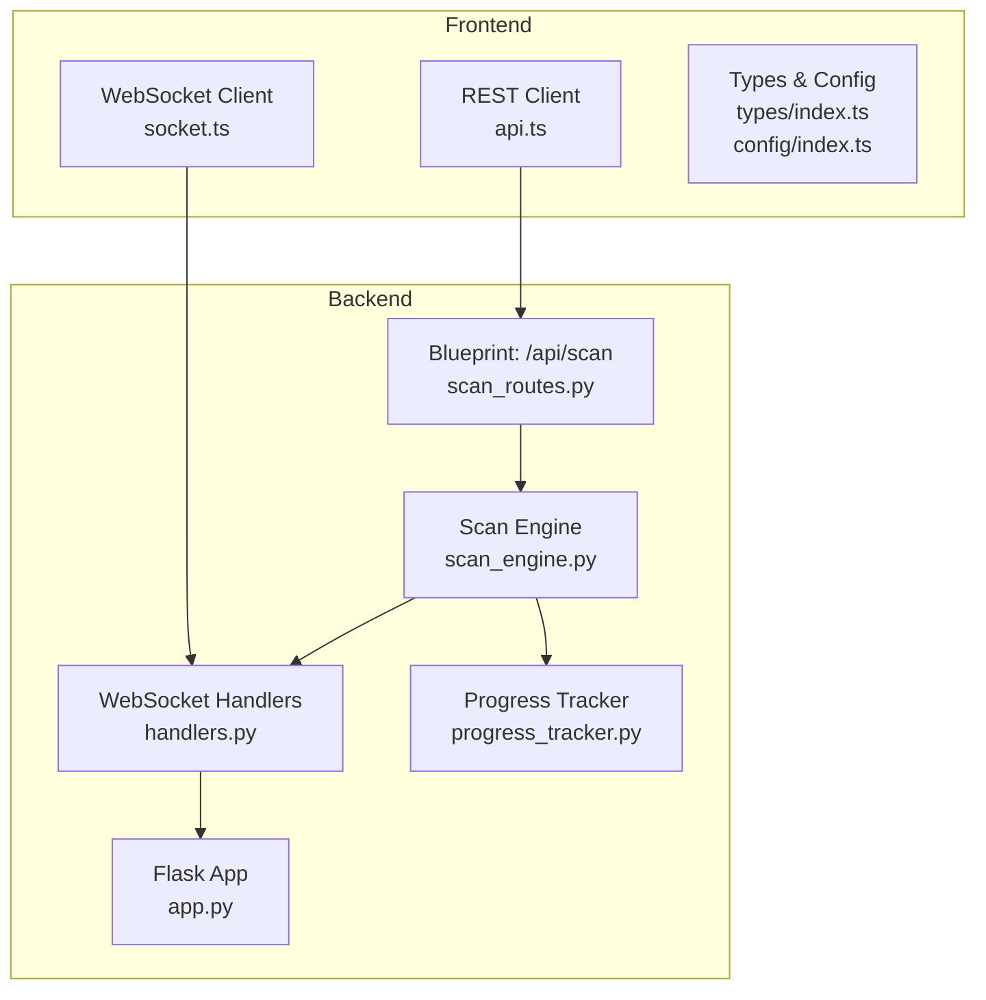
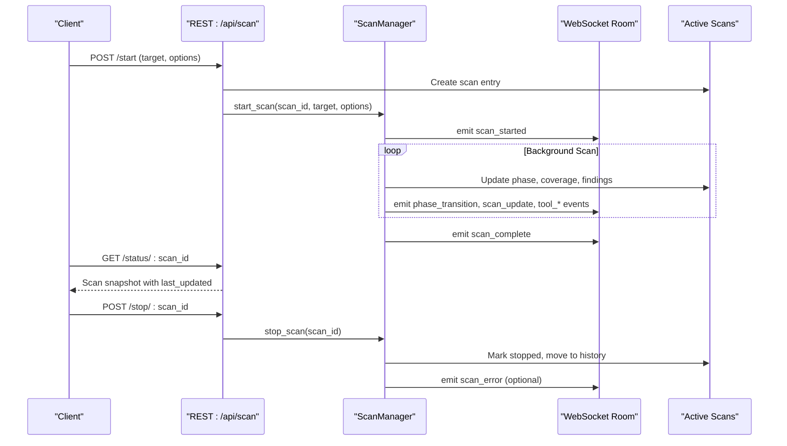
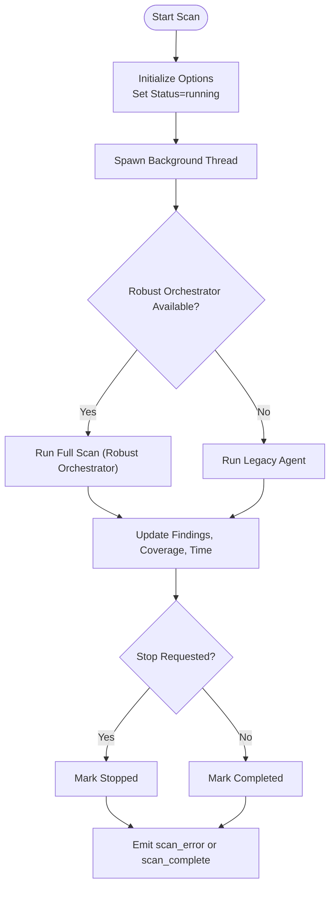
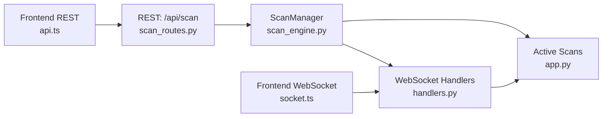

# Scan Management Endpoints

<cite>
**Referenced Files in This Document**
- [scan_routes.py](file://backend/api/scan_routes.py)
- [app.py](file://backend/app.py)
- [scan_engine.py](file://backend/core/scan_engine.py)
- [handlers.py](file://backend/websocket/handlers.py)
- [progress_tracker.py](file://backend/inference/progress_tracker.py)
- [api.ts](file://frontend/src/services/api.ts)
- [socket.ts](file://frontend/src/services/socket.ts)
- [index.ts](file://frontend/src/types/index.ts)
- [index.ts](file://frontend/src/config/index.ts)
</cite>

## Table of Contents
1. [Introduction](#introduction)
2. [Project Structure](#project-structure)
3. [Core Components](#core-components)
4. [Architecture Overview](#architecture-overview)
5. [Detailed Component Analysis](#detailed-component-analysis)
6. [Dependency Analysis](#dependency-analysis)
7. [Performance Considerations](#performance-considerations)
8. [Troubleshooting Guide](#troubleshooting-guide)
9. [Conclusion](#conclusion)
10. [Appendices](#appendices)

## Introduction
This document describes the Optimus scan management REST API and real-time WebSocket events that enable orchestration of autonomous penetration testing scans. It covers HTTP endpoints for initiating, monitoring, controlling, and retrieving scan results, along with WebSocket channels for live updates. It also documents request/response schemas, authentication considerations, error handling, and practical guidance for building clients and optimizing large-scale operations.

## Project Structure
The scan management functionality spans the backend Flask application, dedicated API routes, the central scan engine, and WebSocket handlers. The frontend integrates via REST and WebSocket to present real-time scan progress and findings.

**Diagram sources**
- [app.py](file://backend/app.py#L165-L275)
- [scan_routes.py](file://backend/api/scan_routes.py#L15-L375)
- [scan_engine.py](file://backend/core/scan_engine.py#L26-L537)
- [handlers.py](file://backend/websocket/handlers.py#L26-L119)
- [progress_tracker.py](file://backend/inference/progress_tracker.py#L182-L654)
- [api.ts](file://frontend/src/services/api.ts#L68-L116)
- [socket.ts](file://frontend/src/services/socket.ts#L64-L237)
- [index.ts](file://frontend/src/types/index.ts#L44-L79)
- [index.ts](file://frontend/src/config/index.ts#L15-L23)

**Section sources**
- [app.py](file://backend/app.py#L165-L275)
- [scan_routes.py](file://backend/api/scan_routes.py#L15-L375)
- [scan_engine.py](file://backend/core/scan_engine.py#L26-L537)
- [handlers.py](file://backend/websocket/handlers.py#L26-L119)
- [progress_tracker.py](file://backend/inference/progress_tracker.py#L182-L654)
- [api.ts](file://frontend/src/services/api.ts#L68-L116)
- [socket.ts](file://frontend/src/services/socket.ts#L64-L237)
- [index.ts](file://frontend/src/types/index.ts#L44-L79)
- [index.ts](file://frontend/src/config/index.ts#L15-L23)

## Core Components
- REST API blueprint mounted under /api/scan with endpoints for starting scans, checking status, controlling scans, listing scans, and retrieving results/findings.
- Central ScanManager that coordinates scan lifecycle, orchestrates tools, and emits real-time events.
- WebSocket handlers for live updates, room-based subscriptions, and tool execution control.
- Frontend REST and WebSocket clients that integrate with the API and receive real-time events.

**Section sources**
- [scan_routes.py](file://backend/api/scan_routes.py#L40-L290)
- [scan_engine.py](file://backend/core/scan_engine.py#L26-L148)
- [handlers.py](file://backend/websocket/handlers.py#L26-L119)
- [api.ts](file://frontend/src/services/api.ts#L68-L116)
- [socket.ts](file://frontend/src/services/socket.ts#L64-L237)

## Architecture Overview
The system uses a REST API for orchestration and a WebSocket channel for real-time updates. The REST endpoints create and control scan state, while the WebSocket handlers broadcast scan progress, tool execution events, and findings.

**Diagram sources**
- [scan_routes.py](file://backend/api/scan_routes.py#L40-L140)
- [scan_engine.py](file://backend/core/scan_engine.py#L82-L148)
- [handlers.py](file://backend/websocket/handlers.py#L123-L179)

## Detailed Component Analysis

### REST API Endpoints

- Base URL: /api/scan
- Authentication: No explicit authentication middleware is defined in the scanned code; CORS is configured for development origins. Production deployments should enforce authentication and authorization.

Endpoints:
- POST /start
  - Purpose: Start a new scan with target and options.
  - Request body:
    - target: string (required)
    - mode: string (optional, default "standard")
    - enableExploitation: boolean (optional, default false)
    - useAI: boolean (optional, default true)
    - maxDuration: integer (optional, default 3600)
    - excludePaths: string (optional)
    - lhost: string (optional)
    - lport: integer (optional)
  - Response: 201 with scan object; 400 on missing target; 500 on failure.
  - Notes: The scan object includes scan_id, target, phase, status, timestamps, findings, tools_executed, coverage, risk_score, options, and other runtime fields.

- GET /status/:scan_id
  - Purpose: Retrieve current scan status and progress snapshot.
  - Response: 200 with scan object plus last_updated timestamp; 404 if not found.

- POST /stop/:scan_id
  - Purpose: Request cancellation of a running scan.
  - Response: 200 with success message; 404 if not found.

- POST /pause/:scan_id
  - Purpose: Pause a running scan.
  - Response: 200 with success message; 404 if not found.

- POST /resume/:scan_id
  - Purpose: Resume a paused scan.
  - Response: 200 with success message; 404 if not found.

- GET /results/:scan_id
  - Purpose: Retrieve scan results snapshot.
  - Response: 200 with scan object plus last_updated timestamp; 404 if not found.

- GET /list
  - Purpose: List all scans (active and history).
  - Query params: page (integer, default 1), limit (integer, default 20), status (string filter).
  - Response: 200 with items, pagination metadata, active_count.

- POST /execute-tool
  - Purpose: Execute a specific tool against a target within a scan context.
  - Request body:
    - scan_id: string (required)
    - tool: string (required)
    - target: string (required)
    - options: object (optional)
  - Response: 200 with success message and result; 400 on missing fields; 500 on error.

- GET /:scan_id/findings
  - Purpose: Retrieve findings for a specific scan.
  - Response: 200 with findings array plus last_updated timestamp; 404 if not found.

- GET /:scan_id
  - Purpose: Retrieve scan details (alias to results).
  - Response: 200 with scan object plus last_updated timestamp; 404 if not found.

Notes:
- The scan object schema includes fields such as scan_id, target, domain, host, phase, status, start_time, end_time, findings, tools_executed, time_elapsed, coverage, risk_score, options, and additional runtime arrays and counters.
- The REST endpoints rely on shared state managed by the Flask app and protected by a global lock to prevent race conditions.

**Section sources**
- [scan_routes.py](file://backend/api/scan_routes.py#L40-L290)
- [app.py](file://backend/app.py#L165-L175)
- [index.ts](file://frontend/src/types/index.ts#L44-L79)

### WebSocket Events

- Rooms: Each scan has a room named scan_<scan_id>.
- Events emitted by the backend:
  - scan_started: Emitted when a scan begins.
  - phase_transition: Emitted when moving between phases.
  - scan_update: Periodic updates with phase, status, coverage, time_elapsed.
  - tool_execution_start, tool_execution_complete, tool_output: Tool lifecycle events.
  - finding_discovered: New findings discovered during the scan.
  - scan_complete: Emitted when the scan finishes.
  - scan_error: Emitted on errors during scan execution.
  - tool_resolution: Hybrid tool resolution events.

- Client-side subscription:
  - Join a scan room via join_scan(scanId).
  - Listen to events and update UI accordingly.

**Section sources**
- [handlers.py](file://backend/websocket/handlers.py#L26-L119)
- [handlers.py](file://backend/websocket/handlers.py#L123-L314)
- [socket.ts](file://frontend/src/services/socket.ts#L64-L237)

### Scan Engine and Control Flow

- ScanManager.start_scan creates a background thread and transitions the scan to running, emitting scan_started.
- The engine orchestrates phases and tools, updating scan state and emitting events.
- Control endpoints (stop, pause, resume) toggle flags and update status; the engine checks these flags periodically.

**Diagram sources**
- [scan_engine.py](file://backend/core/scan_engine.py#L82-L148)
- [scan_engine.py](file://backend/core/scan_engine.py#L150-L310)
- [handlers.py](file://backend/websocket/handlers.py#L123-L179)

**Section sources**
- [scan_engine.py](file://backend/core/scan_engine.py#L26-L148)
- [scan_engine.py](file://backend/core/scan_engine.py#L150-L310)
- [handlers.py](file://backend/websocket/handlers.py#L123-L179)

### Request Payload Schemas

- Start Scan (POST /start)
  - target: string (required)
  - mode: string (optional)
  - enableExploitation: boolean (optional)
  - useAI: boolean (optional)
  - maxDuration: integer (optional)
  - excludePaths: string (optional)
  - lhost: string (optional)
  - lport: integer (optional)

- Execute Tool (POST /execute-tool)
  - scan_id: string (required)
  - tool: string (required)
  - target: string (required)
  - options: object (optional)

- Pause/Resume/Stop (POST /pause/:scan_id, POST /resume/:scan_id, POST /stop/:scan_id)
  - No body required; operate on scan_id.

- List Scans (GET /list)
  - Query params: page, limit, status

**Section sources**
- [scan_routes.py](file://backend/api/scan_routes.py#L40-L140)
- [scan_routes.py](file://backend/api/scan_routes.py#L293-L319)
- [scan_routes.py](file://backend/api/scan_routes.py#L258-L290)

### Response Schemas

- Start Scan (POST /start)
  - 201 Created with scan object including:
    - scan_id, target, domain, host, phase, status, start_time, end_time, findings[], tools_executed[], time_elapsed, coverage, risk_score, options, and additional runtime fields.

- Status/Results (GET /status/:scan_id, GET /results/:scan_id)
  - 200 OK with scan object plus last_updated timestamp.

- List (GET /list)
  - 200 OK with:
    - items: array of scan objects
    - total, page, per_page, total_pages, active_count

- Execute Tool (POST /execute-tool)
  - 200 OK with success message and result object.

- Errors
  - 400 Bad Request for missing required fields.
  - 404 Not Found for unknown scan_id.
  - 500 Internal Server Error for server failures.

**Section sources**
- [scan_routes.py](file://backend/api/scan_routes.py#L40-L140)
- [scan_routes.py](file://backend/api/scan_routes.py#L143-L160)
- [scan_routes.py](file://backend/api/scan_routes.py#L238-L256)
- [scan_routes.py](file://backend/api/scan_routes.py#L258-L290)
- [scan_routes.py](file://backend/api/scan_routes.py#L293-L319)

### Authentication and Authorization
- No explicit authentication middleware is defined in the scanned code. CORS is configured for local development origins.
- Production deployments should implement authentication (e.g., API keys, OAuth, or JWT) and authorization policies to restrict access to scan operations.

**Section sources**
- [app.py](file://backend/app.py#L124-L140)
- [scan_routes.py](file://backend/api/scan_routes.py#L40-L140)

### Error Handling Strategies
- Validation errors return 400 with an error message.
- Unknown scan_id returns 404 with an error message.
- Internal server errors return 500 with an error message.
- WebSocket events include scan_error for runtime failures.
- The scan object may include an error field when a failure occurs.

**Section sources**
- [scan_routes.py](file://backend/api/scan_routes.py#L49-L51)
- [scan_routes.py](file://backend/api/scan_routes.py#L150-L154)
- [scan_routes.py](file://backend/api/scan_routes.py#L173-L189)
- [handlers.py](file://backend/websocket/handlers.py#L277-L293)

### Client Implementation Guidelines
- REST client usage (frontend):
  - Start scan: POST /api/scan/start with target and options.
  - Monitor status: GET /api/scan/status/:scan_id periodically.
  - Control scan: POST /api/scan/stop/:scan_id, POST /api/scan/pause/:scan_id, POST /api/scan/resume/:scan_id.
  - Retrieve results: GET /api/scan/results/:scan_id.
  - List scans: GET /api/scan/list?page=&limit=&status=.
  - Execute tool: POST /api/scan/execute-tool with scan_id, tool, target, options.

- WebSocket client usage (frontend):
  - Connect to WebSocket server.
  - Join scan room: joinScan(scanId).
  - Subscribe to events: scan_started, phase_transition, scan_update, tool_execution_start/complete, tool_output, finding_discovered, scan_complete, scan_error.
  - Leave scan room: leaveScan(scanId).

- Frontend types:
  - Scan, Vulnerability, ToolExecution, and WebSocket event types are defined in the frontend types.

**Section sources**
- [api.ts](file://frontend/src/services/api.ts#L68-L116)
- [socket.ts](file://frontend/src/services/socket.ts#L64-L237)
- [index.ts](file://frontend/src/types/index.ts#L44-L79)
- [index.ts](file://frontend/src/types/index.ts#L164-L204)

### Performance Considerations
- Use pagination for listing scans (page, limit).
- Poll status endpoints at intervals appropriate to scan duration.
- Prefer WebSocket for real-time updates to reduce polling overhead.
- Limit concurrent scans to avoid resource contention.
- Use maxDuration to cap long-running scans.

**Section sources**
- [scan_routes.py](file://backend/api/scan_routes.py#L258-L290)
- [handlers.py](file://backend/websocket/handlers.py#L26-L119)

### Troubleshooting Guide
- If scans fail to start, verify target format and required fields.
- If WebSocket events are not received, ensure the client joined the correct room scan_<scan_id>.
- If status returns 404, confirm the scan_id exists and has not completed or been moved to history.
- For tool execution failures, check tool availability and permissions.

**Section sources**
- [scan_routes.py](file://backend/api/scan_routes.py#L49-L51)
- [scan_routes.py](file://backend/api/scan_routes.py#L150-L154)
- [handlers.py](file://backend/websocket/handlers.py#L50-L81)

## Dependency Analysis

**Diagram sources**
- [scan_routes.py](file://backend/api/scan_routes.py#L40-L140)
- [scan_engine.py](file://backend/core/scan_engine.py#L26-L148)
- [handlers.py](file://backend/websocket/handlers.py#L26-L119)
- [app.py](file://backend/app.py#L165-L175)
- [api.ts](file://frontend/src/services/api.ts#L68-L116)
- [socket.ts](file://frontend/src/services/socket.ts#L64-L237)

**Section sources**
- [scan_routes.py](file://backend/api/scan_routes.py#L40-L140)
- [scan_engine.py](file://backend/core/scan_engine.py#L26-L148)
- [handlers.py](file://backend/websocket/handlers.py#L26-L119)
- [app.py](file://backend/app.py#L165-L175)
- [api.ts](file://frontend/src/services/api.ts#L68-L116)
- [socket.ts](file://frontend/src/services/socket.ts#L64-L237)

## Performance Considerations
- Use WebSocket for real-time updates to minimize REST polling.
- Batch requests for listing scans with appropriate page sizes.
- Avoid excessive concurrent scans; throttle based on system capacity.
- Configure maxDuration to prevent runaway scans.

[No sources needed since this section provides general guidance]

## Troubleshooting Guide
- Validation failures: Check required fields in request payloads.
- Unknown scan_id: Verify scan_id and that the scan is still active or exists in history.
- WebSocket connectivity: Ensure room join and event subscriptions are established.
- Tool execution errors: Confirm tool availability and permissions.

**Section sources**
- [scan_routes.py](file://backend/api/scan_routes.py#L49-L51)
- [scan_routes.py](file://backend/api/scan_routes.py#L150-L154)
- [handlers.py](file://backend/websocket/handlers.py#L50-L81)

## Conclusion
The Optimus scan management API provides a robust foundation for orchestrating autonomous penetration testing scans. REST endpoints enable initiation, monitoring, control, and retrieval of results, while WebSocket channels deliver real-time updates. Clients should implement authentication for production, subscribe to WebSocket rooms for live updates, and apply pagination and throttling for scalability.

[No sources needed since this section summarizes without analyzing specific files]

## Appendices

### Endpoint Reference Summary
- POST /api/scan/start
- GET /api/scan/status/:scan_id
- POST /api/scan/stop/:scan_id
- POST /api/scan/pause/:scan_id
- POST /api/scan/resume/:scan_id
- GET /api/scan/results/:scan_id
- GET /api/scan/list
- POST /api/scan/execute-tool
- GET /api/scan/:scan_id/findings

**Section sources**
- [scan_routes.py](file://backend/api/scan_routes.py#L40-L290)