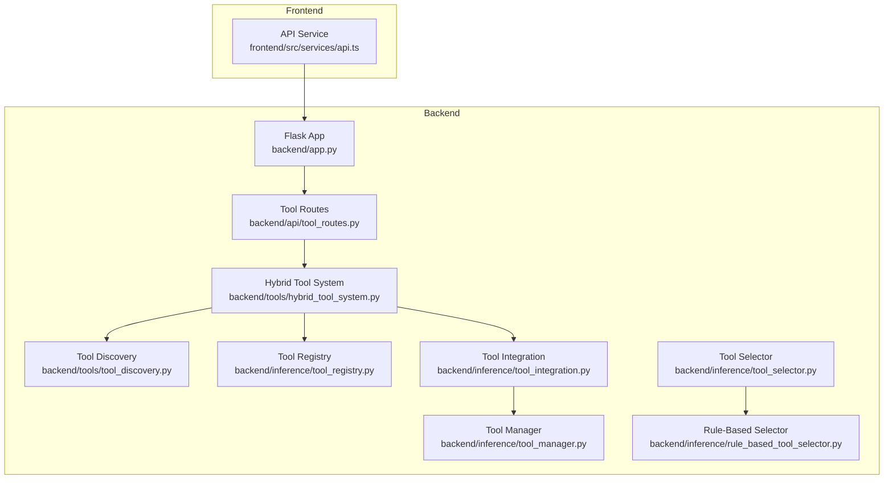
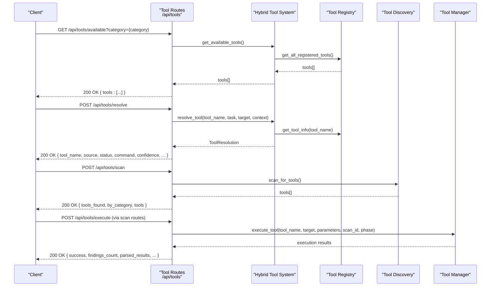
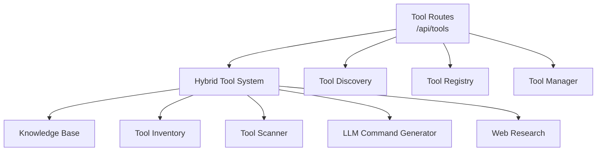

# Tool Integration Endpoints

<cite>
**Referenced Files in This Document**
- [app.py](file://backend/app.py)
- [api/tool_routes.py](file://backend/api/tool_routes.py)
- [tools/hybrid_tool_system.py](file://backend/tools/hybrid_tool_system.py)
- [tools/tool_discovery.py](file://backend/tools/tool_discovery.py)
- [inference/tool_registry.py](file://backend/inference/tool_registry.py)
- [inference/tool_integration.py](file://backend/inference/tool_integration.py)
- [inference/tool_manager.py](file://backend/inference/tool_manager.py)
- [inference/tool_selector.py](file://backend/inference/tool_selector.py)
- [inference/rule_based_tool_selector.py](file://backend/inference/rule_based_tool_selector.py)
- [frontend/src/services/api.ts](file://frontend/src/services/api.ts)
</cite>

## Table of Contents
1. [Introduction](#introduction)
2. [Project Structure](#project-structure)
3. [Core Components](#core-components)
4. [Architecture Overview](#architecture-overview)
5. [Detailed Component Analysis](#detailed-component-analysis)
6. [Dependency Analysis](#dependency-analysis)
7. [Performance Considerations](#performance-considerations)
8. [Troubleshooting Guide](#troubleshooting-guide)
9. [Conclusion](#conclusion)
10. [Appendices](#appendices)

## Introduction
This document provides API documentation for the Optimus tool integration REST API endpoints. It covers HTTP methods, URL patterns, request/response schemas, and authentication for tool discovery, execution, and management operations. It also includes examples for GET requests to discover available tools, POST requests to execute tools against targets, and PUT requests to update tool configurations. The document details request payload schemas for tool selection criteria, execution parameters, and output processing options, along with response schemas containing tool recommendations, execution results, parsing outcomes, and confidence scores. Error handling strategies for tool execution failures, timeouts, and compatibility issues are documented, alongside client implementation guidelines, performance optimization tips, and debugging approaches.

## Project Structure
The tool integration API is implemented as Flask blueprints mounted under the /api/tools prefix. The backend orchestrates tool discovery, resolution, execution, and reporting through a hybrid system and tool manager. The frontend integrates with these endpoints to provide a user interface for tool orchestration.

**Diagram sources**
- [app.py](file://backend/app.py#L178-L274)
- [api/tool_routes.py](file://backend/api/tool_routes.py#L1-L299)
- [tools/hybrid_tool_system.py](file://backend/tools/hybrid_tool_system.py#L1-L783)
- [tools/tool_discovery.py](file://backend/tools/tool_discovery.py#L1-L504)
- [inference/tool_registry.py](file://backend/inference/tool_registry.py#L1-L567)
- [inference/tool_integration.py](file://backend/inference/tool_integration.py#L1-L311)
- [inference/tool_manager.py](file://backend/inference/tool_manager.py#L1-L800)
- [inference/tool_selector.py](file://backend/inference/tool_selector.py#L1-L527)
- [inference/rule_based_tool_selector.py](file://backend/inference/rule_based_tool_selector.py#L1-L448)
- [frontend/src/services/api.ts](file://frontend/src/services/api.ts#L1-L391)

**Section sources**
- [app.py](file://backend/app.py#L178-L274)
- [frontend/src/services/api.ts](file://frontend/src/services/api.ts#L158-L231)

## Core Components
- Tool Routes: Exposes endpoints for discovering available tools, resolving tools, scanning systems, researching tools, retrieving inventory, and fetching statistics.
- Hybrid Tool System: Provides tool resolution with multiple sources (knowledge base, memory, discovered tools, LLM generation, web research) and generates commands with confidence and metadata.
- Tool Discovery: Scans local and remote systems for available tools, enumerates executables, and enriches tool information.
- Tool Registry: Centralized, ground-truth registry for tools with verification, registration, and statistics.
- Tool Integration: Synchronizes discovered tools with the registry, ensures availability, and generates commands.
- Tool Manager: Executes tools with real-time streaming, output parsing, safety validation, and error handling.
- Tool Selector: Recommends tools per phase with rule-based and ML/RL components.

**Section sources**
- [api/tool_routes.py](file://backend/api/tool_routes.py#L27-L299)
- [tools/hybrid_tool_system.py](file://backend/tools/hybrid_tool_system.py#L65-L427)
- [tools/tool_discovery.py](file://backend/tools/tool_discovery.py#L13-L504)
- [inference/tool_registry.py](file://backend/inference/tool_registry.py#L18-L567)
- [inference/tool_integration.py](file://backend/inference/tool_integration.py#L28-L311)
- [inference/tool_manager.py](file://backend/inference/tool_manager.py#L49-L646)
- [inference/tool_selector.py](file://backend/inference/tool_selector.py#L26-L527)

## Architecture Overview
The tool integration architecture centers around the Flask blueprint for tools (/api/tools). Requests flow through the routes to either the hybrid tool system for resolution or the tool manager for execution. Discovery and registry components maintain an up-to-date catalog of available tools.

**Diagram sources**
- [api/tool_routes.py](file://backend/api/tool_routes.py#L27-L169)
- [tools/hybrid_tool_system.py](file://backend/tools/hybrid_tool_system.py#L157-L220)
- [inference/tool_registry.py](file://backend/inference/tool_registry.py#L226-L241)
- [tools/tool_discovery.py](file://backend/tools/tool_discovery.py#L66-L78)
- [inference/tool_manager.py](file://backend/inference/tool_manager.py#L226-L646)

## Detailed Component Analysis

### Tool Discovery Endpoints
- GET /api/tools/available
  - Purpose: Retrieve available tools, optionally filtered by category.
  - Query Parameters:
    - category: string (optional)
  - Response Schema:
    - tools: array of tool objects with fields such as name, category, description, is_available, source, etc.
  - Example Request:
    - GET /api/tools/available?category=scanning
  - Example Response:
    - 200 OK with tools array

- GET /api/tools/categories
  - Purpose: Retrieve supported tool categories.
  - Response Schema:
    - categories: array of strings representing categories
  - Example Response:
    - 200 OK with categories array

- POST /api/tools/resolve
  - Purpose: Resolve a tool using the hybrid system with task, target, and context.
  - Request Body Schema:
    - tool_name: string (required)
    - task: string (default: "general scan")
    - target: string (default: "")
    - context: object (optional)
  - Response Schema:
    - tool_name: string
    - source: string
    - status: string
    - command: string
    - explanation: string
    - confidence: number
    - examples: array of strings
    - warnings: array of strings
    - alternatives: array of strings
    - metadata: object (optional)
  - Example Request:
    - POST /api/tools/resolve with JSON body
  - Example Response:
    - 200 OK with ToolResolution fields

- POST /api/tools/scan
  - Purpose: Scan system for available tools (local or remote via SSH).
  - Request Body: none
  - Response Schema:
    - tools_found: integer
    - by_category: object mapping category to count
    - tools: array of tool objects
    - message: string (optional, present on fallback)
    - error: string (optional, present on failure)
  - Example Request:
    - POST /api/tools/scan
  - Example Response:
    - 200 OK with scan results

- GET /api/tools/research/:tool_name
  - Purpose: Research a tool from web sources.
  - Path Parameter:
    - tool_name: string
  - Response Schema:
    - tool_name: string
    - description: string
    - github_url: string (optional)
    - basic_usage: string
    - examples: array of strings
    - confidence: number
  - Example Request:
    - GET /api/tools/research/nmap
  - Example Response:
    - 200 OK with research document

- GET /api/tools/inventory
  - Purpose: Retrieve full tool inventory and statistics.
  - Response Schema:
    - tools: array of tool objects
    - statistics: object with counts and metadata
  - Example Response:
    - 200 OK with tools and statistics

- GET /api/tools/inventory/:tool_name
  - Purpose: Retrieve detailed info for a specific tool.
  - Path Parameter:
    - tool_name: string
  - Response Schema:
    - Tool object or error
  - Example Response:
    - 200 OK with tool details or 404 Not Found

- GET /api/tools/knowledge-base
  - Purpose: Retrieve static knowledge base tools.
  - Response Schema:
    - tools: array of tool objects with name, category, description, source, is_available
  - Example Response:
    - 200 OK with KB tools

- GET /api/tools/statistics
  - Purpose: Retrieve tool system statistics from the hybrid system.
  - Response Schema:
    - total_resolutions: integer
    - by_source: object
    - success_rates: object
  - Example Response:
    - 200 OK with statistics

**Section sources**
- [api/tool_routes.py](file://backend/api/tool_routes.py#L27-L299)
- [tools/hybrid_tool_system.py](file://backend/tools/hybrid_tool_system.py#L43-L56)
- [tools/tool_discovery.py](file://backend/tools/tool_discovery.py#L13-L504)
- [inference/tool_registry.py](file://backend/inference/tool_registry.py#L18-L567)

### Tool Execution Endpoints
Note: Tool execution is orchestrated via scan routes and managed by the tool manager. The frontend API service exposes a dedicated endpoint for executing a specific tool within a scan.

- POST /api/scan/execute-tool
  - Purpose: Execute a specific tool against a target within a scan context.
  - Request Body Schema:
    - scan_id: string (required)
    - tool: string (required)
    - target: string (required)
    - options: object (optional)
  - Response Schema:
    - success: boolean
    - message: string
  - Example Request:
    - POST /api/scan/execute-tool with JSON body
  - Example Response:
    - 200 OK with success and message

- GET /api/scan/status/:scanId
  - Purpose: Retrieve scan status and progress.
  - Path Parameter:
    - scanId: string
  - Response Schema:
    - Scan object with status, findings, and metadata
  - Example Response:
    - 200 OK with scan status

- GET /api/scan/results/:scanId
  - Purpose: Retrieve scan results.
  - Path Parameter:
    - scanId: string
  - Response Schema:
    - Scan object with findings and parsed results
  - Example Response:
    - 200 OK with scan results

- GET /api/scan/:scanId/findings
  - Purpose: Retrieve findings for a scan.
  - Path Parameter:
    - scanId: string
  - Response Schema:
    - Array of vulnerability objects
  - Example Response:
    - 200 OK with findings array

**Section sources**
- [frontend/src/services/api.ts](file://frontend/src/services/api.ts#L129-L151)
- [app.py](file://backend/app.py#L178-L274)

### Tool Management Endpoints
- PUT /api/tools/inventory/:tool_name
  - Purpose: Update tool configuration or metadata in the inventory.
  - Path Parameter:
    - tool_name: string
  - Request Body Schema:
    - description: string (optional)
    - category: string (optional)
    - metadata: object (optional)
  - Response Schema:
    - success: boolean
    - message: string
  - Notes: The current implementation does not define a PUT route for inventory updates. Use the knowledge base or registry APIs for tool information.

- POST /api/tools/sync
  - Purpose: Synchronize tools with the registry and validate availability.
  - Request Body Schema: none
  - Response Schema:
    - discovered_count: integer
    - newly_registered: integer
    - total_registered: integer
    - timestamp: string
  - Notes: The current implementation does not define a dedicated sync endpoint. Use the tool integration coordinator to refresh and validate.

**Section sources**
- [api/tool_routes.py](file://backend/api/tool_routes.py#L187-L221)
- [inference/tool_integration.py](file://backend/inference/tool_integration.py#L42-L112)

## Dependency Analysis
The tool integration endpoints depend on the hybrid tool system for resolution, the tool registry for availability, and the tool manager for execution. Discovery components provide the underlying tool catalog.

**Diagram sources**
- [api/tool_routes.py](file://backend/api/tool_routes.py#L27-L169)
- [tools/hybrid_tool_system.py](file://backend/tools/hybrid_tool_system.py#L65-L135)
- [tools/tool_discovery.py](file://backend/tools/tool_discovery.py#L66-L78)
- [inference/tool_registry.py](file://backend/inference/tool_registry.py#L226-L241)
- [inference/tool_manager.py](file://backend/inference/tool_manager.py#L226-L646)

**Section sources**
- [tools/hybrid_tool_system.py](file://backend/tools/hybrid_tool_system.py#L65-L427)
- [inference/tool_registry.py](file://backend/inference/tool_registry.py#L18-L567)
- [inference/tool_manager.py](file://backend/inference/tool_manager.py#L49-L646)

## Performance Considerations
- Adaptive timeouts: The tool manager adjusts timeouts based on tool type and overall timeout to accommodate long-running tools like nmap, masscan, and nikto.
- Output streaming: Real-time streaming of tool output reduces perceived latency and enables immediate feedback.
- Command safety validation: The tool manager validates commands before execution to prevent unsafe operations.
- Execution history: Tracks tool execution times to dynamically adjust timeouts and improve reliability.
- SSH connection reuse: Maintains persistent SSH connections with keepalive to reduce overhead.

**Section sources**
- [inference/tool_manager.py](file://backend/inference/tool_manager.py#L648-L800)
- [inference/tool_manager.py](file://backend/inference/tool_manager.py#L131-L212)

## Troubleshooting Guide
Common issues and resolutions:
- SSH connection failures: The tool manager retries connections with exponential backoff and configurable timeouts. Verify KALI_HOST, KALI_PORT, KALI_USER, and credentials.
- Tool execution failures: Check tool availability via registry and ensure the tool is registered. Review logs for detailed error messages.
- Timeout scenarios: Adjust timeout parameters in execution parameters. The tool manager applies adaptive timeouts based on tool characteristics.
- Compatibility issues: Use the tool registry to verify tool availability and version. The hybrid system provides alternative tools when necessary.
- Frontend authentication: The API service injects Authorization headers for Bearer tokens. Ensure tokens are present for protected endpoints.

**Section sources**
- [inference/tool_manager.py](file://backend/inference/tool_manager.py#L131-L212)
- [inference/tool_manager.py](file://backend/inference/tool_manager.py#L623-L646)
- [frontend/src/services/api.ts](file://frontend/src/services/api.ts#L32-L56)

## Conclusion
The Optimus tool integration REST API provides comprehensive capabilities for tool discovery, resolution, execution, and management. The hybrid system enhances reliability by combining multiple resolution strategies, while the tool manager ensures secure, efficient, and observable execution. The frontend API service offers convenient wrappers for common operations, enabling seamless integration for clients.

## Appendices

### Authentication Methods
- Authorization Header: Bearer tokens are automatically added to requests by the frontend API service when present in local storage.
- CORS: The backend supports cross-origin requests for development origins.

**Section sources**
- [frontend/src/services/api.ts](file://frontend/src/services/api.ts#L32-L56)
- [app.py](file://backend/app.py#L124-L149)

### Client Implementation Guidelines
- Use the frontend API service to interact with tool endpoints.
- For manual tool execution, call POST /api/scan/execute-tool with scan_id, tool, target, and options.
- For automated tool selection, leverage the tool selector components and integrate recommendations into your workflow.
- Monitor execution progress via scan status endpoints and retrieve findings upon completion.

**Section sources**
- [frontend/src/services/api.ts](file://frontend/src/services/api.ts#L129-L151)
- [inference/tool_selector.py](file://backend/inference/tool_selector.py#L68-L186)

### Common Use Cases
- Automated tool selection: Integrate with the phase-aware tool selector to recommend tools based on scan state and findings.
- Manual tool execution: Execute specific tools against targets using the scan execution endpoint.
- Tool availability validation: Use the tool inventory and registry endpoints to validate tool presence and metadata.

**Section sources**
- [inference/tool_selector.py](file://backend/inference/tool_selector.py#L68-L186)
- [inference/tool_registry.py](file://backend/inference/tool_registry.py#L226-L241)
- [api/tool_routes.py](file://backend/api/tool_routes.py#L187-L221)