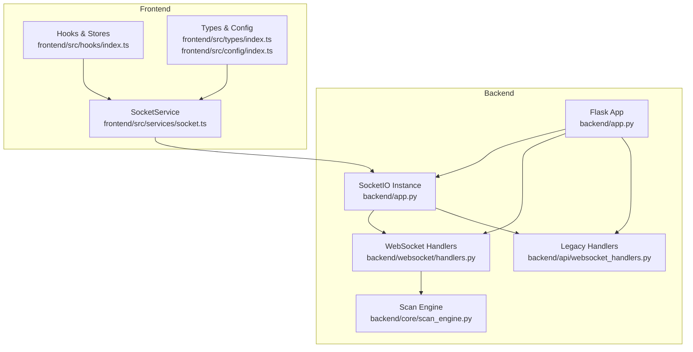
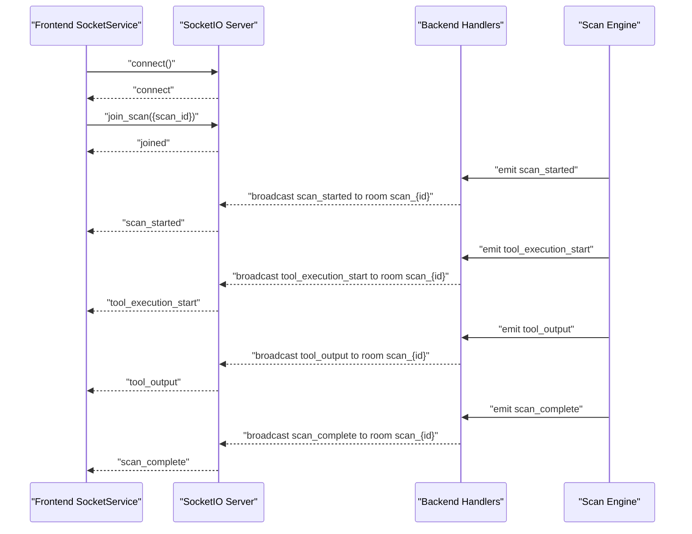
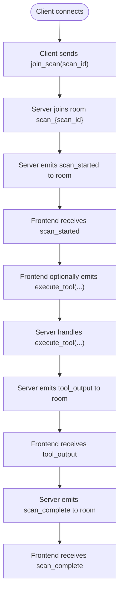
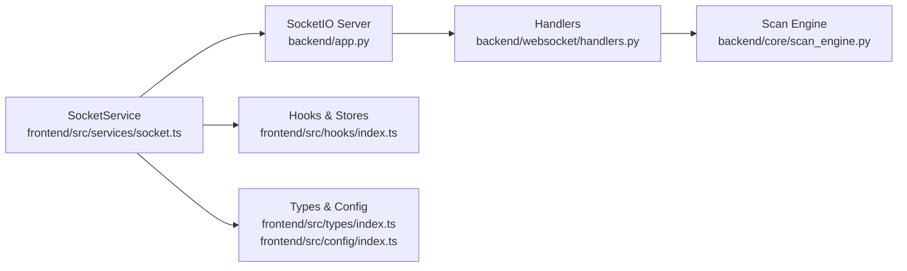

# WebSocket Communication

<cite>
**Referenced Files in This Document**
- [app.py](file://backend/app.py)
- [handlers.py](file://backend/websocket/handlers.py)
- [websocket_handlers.py](file://backend/api/websocket_handlers.py)
- [scan_engine.py](file://backend/core/scan_engine.py)
- [socket.ts](file://frontend/src/services/socket.ts)
- [index.ts](file://frontend/src/hooks/index.ts)
- [index.ts](file://frontend/src/types/index.ts)
- [index.ts](file://frontend/src/config/index.ts)
- [routes.py](file://backend/api/routes.py)
</cite>

## Table of Contents
1. [Introduction](#introduction)
2. [Project Structure](#project-structure)
3. [Core Components](#core-components)
4. [Architecture Overview](#architecture-overview)
5. [Detailed Component Analysis](#detailed-component-analysis)
6. [Dependency Analysis](#dependency-analysis)
7. [Performance Considerations](#performance-considerations)
8. [Troubleshooting Guide](#troubleshooting-guide)
9. [Conclusion](#conclusion)

## Introduction
This document describes the Optimus WebSocket communication system that powers live scan progress tracking, tool execution events, intelligence insights, and system notifications. It covers connection handling, message formats, event types, real-time interaction patterns, and client integration guidelines. The backend uses Flask-SocketIO with threaded async mode, while the frontend integrates a singleton SocketService with automatic reconnection and event subscription patterns.

## Project Structure
The WebSocket system spans backend and frontend components:
- Backend: Flask app initializes SocketIO, registers handlers, emits real-time events, and coordinates scan lifecycle.
- Frontend: SocketService manages connection, subscriptions, and emits commands to the backend.

**Diagram sources**
- [app.py](file://backend/app.py#L151-L163)
- [handlers.py](file://backend/websocket/handlers.py#L26-L119)
- [websocket_handlers.py](file://backend/api/websocket_handlers.py#L9-L115)
- [scan_engine.py](file://backend/core/scan_engine.py#L26-L81)
- [socket.ts](file://frontend/src/services/socket.ts#L64-L106)
- [index.ts](file://frontend/src/hooks/index.ts#L16-L56)
- [index.ts](file://frontend/src/types/index.ts#L156-L204)
- [index.ts](file://frontend/src/config/index.ts#L15-L23)

**Section sources**
- [app.py](file://backend/app.py#L151-L163)
- [handlers.py](file://backend/websocket/handlers.py#L26-L119)
- [websocket_handlers.py](file://backend/api/websocket_handlers.py#L9-L115)
- [socket.ts](file://frontend/src/services/socket.ts#L64-L106)
- [index.ts](file://frontend/src/hooks/index.ts#L16-L56)

## Core Components
- Backend SocketIO initialization and configuration
- WebSocket event handlers for connection, room management, and tool execution requests
- Event emitters for scan lifecycle and tool execution
- Frontend SocketService singleton with reconnection and subscription management
- Hooks for real-time monitoring and UI updates

Key responsibilities:
- Backend: Establish rooms per scan, emit structured events, and handle client commands.
- Frontend: Connect to SocketIO, subscribe to events, and render live updates.

**Section sources**
- [app.py](file://backend/app.py#L151-L163)
- [handlers.py](file://backend/websocket/handlers.py#L26-L119)
- [handlers.py](file://backend/websocket/handlers.py#L122-L314)
- [websocket_handlers.py](file://backend/api/websocket_handlers.py#L9-L115)
- [socket.ts](file://frontend/src/services/socket.ts#L64-L106)
- [index.ts](file://frontend/src/hooks/index.ts#L62-L196)

## Architecture Overview
The WebSocket architecture enables real-time bidirectional communication:
- Clients connect to the backend SocketIO server.
- Clients join a scan room identified by scan_id to receive targeted updates.
- Backend emits events during scan lifecycle and tool execution.
- Frontend subscribes to events and updates UI state.

**Diagram sources**
- [handlers.py](file://backend/websocket/handlers.py#L26-L119)
- [handlers.py](file://backend/websocket/handlers.py#L122-L314)
- [scan_engine.py](file://backend/core/scan_engine.py#L130-L148)
- [socket.ts](file://frontend/src/services/socket.ts#L207-L218)

**Section sources**
- [handlers.py](file://backend/websocket/handlers.py#L26-L119)
- [handlers.py](file://backend/websocket/handlers.py#L122-L314)
- [scan_engine.py](file://backend/core/scan_engine.py#L130-L148)
- [socket.ts](file://frontend/src/services/socket.ts#L207-L218)

## Detailed Component Analysis

### Backend WebSocket Handlers
The backend registers handlers for:
- Connection lifecycle: connect, disconnect
- Room management: join_scan, leave_scan
- Tool execution requests: execute_tool, request_tool_recommendation
- Event emission helpers: scan lifecycle and tool execution events

Room naming convention: scan_{scan_id} ensures per-scan isolation.

**Diagram sources**
- [handlers.py](file://backend/websocket/handlers.py#L50-L81)
- [handlers.py](file://backend/websocket/handlers.py#L82-L114)
- [handlers.py](file://backend/websocket/handlers.py#L122-L314)

**Section sources**
- [handlers.py](file://backend/websocket/handlers.py#L26-L119)
- [handlers.py](file://backend/websocket/handlers.py#L122-L314)

### Event Emission Patterns
The backend emits structured events to rooms. Example emissions include:
- scan_started: identifies the scan and target, includes optional config and timestamp
- scan_update: includes phase, status, coverage, elapsed time, and optional findings
- phase_transition: includes from/to phases and optional reason
- tool_execution_start: includes tool, optional target, status=start
- tool_output: includes tool, output, stream (stdout/stderr)
- tool_execution_complete: includes tool, status=complete, success, findings_count, execution_time
- finding_discovered: includes finding and total_count
- scan_complete: includes scan_id, findings_count, time_elapsed
- scan_error: includes scan_id and error message

These events are emitted to the room scan_{scan_id} to target clients subscribed to that scan.

**Section sources**
- [handlers.py](file://backend/websocket/handlers.py#L122-L314)
- [scan_engine.py](file://backend/core/scan_engine.py#L130-L148)

### Frontend SocketService and Hooks
The frontend provides:
- SocketService singleton managing connection, reconnection, and subscriptions
- useSocket hook to track connection state and errors
- useScanSocket hook to subscribe to scan-specific events and update UI state

Connection configuration:
- Transports: websocket and polling
- Reconnection enabled with configurable attempts and delay
- Timeout set for connection establishment

Subscription patterns:
- Join scan room on scan start
- Subscribe to lifecycle and tool execution events
- Leave scan room on unmount

**Section sources**
- [socket.ts](file://frontend/src/services/socket.ts#L64-L106)
- [socket.ts](file://frontend/src/services/socket.ts#L165-L191)
- [socket.ts](file://frontend/src/services/socket.ts#L207-L232)
- [index.ts](file://frontend/src/hooks/index.ts#L16-L56)
- [index.ts](file://frontend/src/hooks/index.ts#L62-L196)

### Message Schemas and Event Types
Core event types and payload structures:

- scan_started
  - Fields: scan_id, target, config (optional), timestamp
  - Emitted by: backend scan engine

- scan_update
  - Fields: phase, status, coverage, time_elapsed, scan_state (optional), timestamp
  - Emitted by: backend scan engine

- phase_transition
  - Fields: from, to, reason (optional), scan_state (optional), timestamp
  - Emitted by: backend scan engine

- tool_execution_start
  - Fields: tool, target (optional), status=start, scan_state (optional), timestamp
  - Emitted by: backend scan engine

- tool_output
  - Fields: tool, output, stream (stdout/stderr), scan_state (optional), timestamp
  - Emitted by: backend scan engine

- tool_execution_complete
  - Fields: tool, status=complete, success, findings_count, execution_time, scan_state (optional), timestamp
  - Emitted by: backend scan engine

- finding_discovered
  - Fields: finding (object), total_count, timestamp
  - Emitted by: backend scan engine

- scan_complete
  - Fields: scan_id, findings_count, time_elapsed, status, timestamp
  - Emitted by: backend scan engine

- scan_error
  - Fields: scan_id, error, timestamp
  - Emitted by: backend scan engine

Additional hybrid tool system events:
- tool_resolution: tool, source, confidence, status, explanation, timestamp
- tool_executing: tool, command, source
- tool_blocked: tool, command, reason
- tool_warning: tool, message, warnings[]
- tool_fallback: original, alternative

**Section sources**
- [handlers.py](file://backend/websocket/handlers.py#L122-L314)
- [index.ts](file://frontend/src/types/index.ts#L164-L204)

### Connection Management Strategies
- Backend
  - SocketIO configured with threading async mode, ping intervals, and timeouts
  - Room-based broadcasting to isolate updates per scan
- Frontend
  - Singleton SocketService with transport selection and reconnection
  - Automatic re-subscription of listeners after reconnect
  - Connection state tracked via useSocket hook

Reconnection handling:
- Frontend retries up to configured attempts with exponential backoff-like delay
- Listeners are reattached automatically after reconnect

**Section sources**
- [app.py](file://backend/app.py#L151-L163)
- [socket.ts](file://frontend/src/services/socket.ts#L94-L100)
- [socket.ts](file://frontend/src/services/socket.ts#L137-L160)

### Real-Time Interaction Patterns
Common patterns:
- Live scan monitoring: join scan room, subscribe to phase transitions, tool outputs, and scan updates
- Real-time dashboard updates: subscribe to scan_update and finding_discovered
- System notifications: listen for scan_error and tool warnings/blocked events

Client implementation guidelines:
- Always join the scan room upon scan start
- Subscribe to relevant events and update UI state accordingly
- Handle reconnection gracefully and re-join rooms
- Debounce or throttle frequent updates if needed

**Section sources**
- [index.ts](file://frontend/src/hooks/index.ts#L62-L196)
- [socket.ts](file://frontend/src/services/socket.ts#L207-L232)

## Dependency Analysis
The WebSocket system depends on:
- Flask-SocketIO for real-time bidirectional communication
- Backend handlers for event emission and room management
- Frontend SocketService for connection and subscription management
- Scan engine for emitting lifecycle and tool execution events

**Diagram sources**
- [app.py](file://backend/app.py#L151-L163)
- [handlers.py](file://backend/websocket/handlers.py#L26-L119)
- [scan_engine.py](file://backend/core/scan_engine.py#L26-L81)
- [socket.ts](file://frontend/src/services/socket.ts#L64-L106)
- [index.ts](file://frontend/src/hooks/index.ts#L16-L56)
- [index.ts](file://frontend/src/types/index.ts#L156-L204)
- [index.ts](file://frontend/src/config/index.ts#L15-L23)

**Section sources**
- [app.py](file://backend/app.py#L151-L163)
- [handlers.py](file://backend/websocket/handlers.py#L26-L119)
- [scan_engine.py](file://backend/core/scan_engine.py#L26-L81)
- [socket.ts](file://frontend/src/services/socket.ts#L64-L106)
- [index.ts](file://frontend/src/hooks/index.ts#L16-L56)

## Performance Considerations
- Prefer room-based broadcasting to minimize unnecessary traffic
- Batch frequent updates (e.g., tool_output) if the backend supports it
- Use efficient front-end rendering for high-frequency events (virtualization)
- Monitor ping intervals and timeouts to balance responsiveness and overhead
- Limit concurrent scans per client to reduce UI update pressure

## Troubleshooting Guide
Common issues and resolutions:
- Connection failures
  - Verify backend SocketIO configuration and network accessibility
  - Check frontend transport settings and CORS policies
- Reconnection loops
  - Adjust reconnectionAttempts and reconnectionDelay in frontend config
  - Inspect backend ping_timeout and ping_interval
- Missing events
  - Ensure clients join the correct room scan_{scan_id}
  - Confirm event names match backend emissions
- High-frequency updates
  - Implement throttling or debouncing in the frontend
  - Consider reducing update frequency at the backend source

Debugging tools and techniques:
- Frontend console logs for connection and error events
- Backend logs for handler invocations and room joins
- Network tab inspection for transport selection and latency
- Use backend health check endpoint to validate service availability

**Section sources**
- [socket.ts](file://frontend/src/services/socket.ts#L137-L160)
- [app.py](file://backend/app.py#L276-L290)

## Conclusion
The Optimus WebSocket system provides a robust foundation for real-time scan monitoring and notifications. By leveraging room-based broadcasting, structured event schemas, and resilient connection management, it enables live dashboards, terminal-style output streaming, and actionable system alerts. Following the client integration guidelines and performance recommendations ensures smooth operation under various network conditions and load scenarios.