# Adaptive Exploitation and Defense-Aware Strategies

<cite>
**Referenced Files in This Document**
- [adaptive_exploitation.py](file://backend/intelligence/adaptive_exploitation.py)
- [target_integrity_gate.py](file://backend/inference/target_integrity_gate.py)
- [target_schema.py](file://backend/inference/target_schema.py)
- [command_safety.py](file://backend/inference/command_safety.py)
- [tool_manager.py](file://backend/inference/tool_manager.py)
- [exploit_executor.py](file://backend/exploitation/exploit_executor.py)
- [exploit_chainer.py](file://backend/exploitation/exploit_chainer.py)
- [exploit_db.py](file://backend/exploitation/exploit_db.py)
- [strategic_planner.py](file://backend/exploitation/strategic_planner.py)
- [intelligent_reporter.py](file://backend/reporting/intelligent_reporter.py)
- [routes.py](file://backend/api/routes.py)
</cite>

## Table of Contents
1. [Introduction](#introduction)
2. [Project Structure](#project-structure)
3. [Core Components](#core-components)
4. [Architecture Overview](#architecture-overview)
5. [Detailed Component Analysis](#detailed-component-analysis)
6. [Dependency Analysis](#dependency-analysis)
7. [Performance Considerations](#performance-considerations)
8. [Troubleshooting Guide](#troubleshooting-guide)
9. [Conclusion](#conclusion)
10. [Appendices](#appendices)

## Introduction
This document describes the adaptive exploitation system designed to operate defense-aware strategies that dynamically adjust attack vectors in real-time based on detection avoidance requirements. It documents the adaptive exploitation algorithms that modify execution parameters and payloads when encountering defenses, the target integrity gate that ensures responsible targeting and system protection, and the command safety system that validates and sanitizes commands to prevent unintended damage or detection. Practical examples illustrate adaptive strategy adjustment, safety validation workflows, and defensive countermeasure handling. The document also covers integration with the intelligence layer for threat assessment, the exploitation system for attack execution, and the reporting system for impact documentation. Ethical considerations, legal compliance requirements, and responsible disclosure practices are addressed throughout.

## Project Structure
The adaptive exploitation system spans three primary layers:
- Intelligence Layer: Real-time adaptive engines, strategy selection, and defense detection
- Exploitation Layer: Exploit execution, chaining, and payload orchestration
- Reporting Layer: Impact documentation and remediation guidance

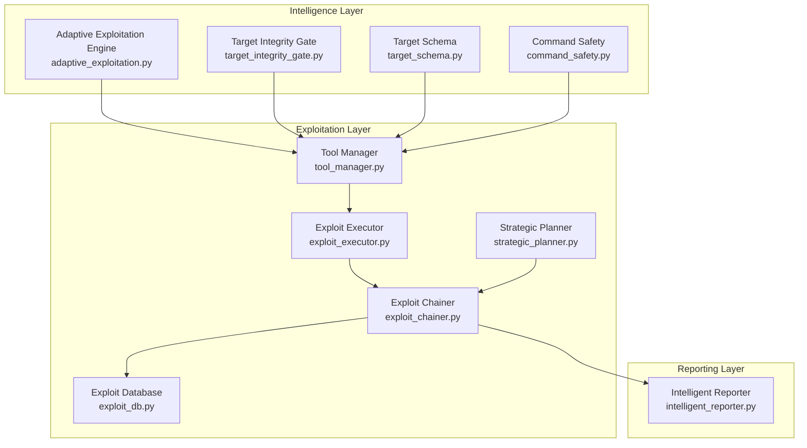

**Diagram sources**
- [adaptive_exploitation.py](file://backend/intelligence/adaptive_exploitation.py#L474-L875)
- [target_integrity_gate.py](file://backend/inference/target_integrity_gate.py#L19-L366)
- [target_schema.py](file://backend/inference/target_schema.py#L8-L81)
- [command_safety.py](file://backend/inference/command_safety.py#L1-L366)
- [tool_manager.py](file://backend/inference/tool_manager.py#L49-L800)
- [exploit_executor.py](file://backend/exploitation/exploit_executor.py#L106-L729)
- [exploit_chainer.py](file://backend/exploitation/exploit_chainer.py#L256-L865)
- [exploit_db.py](file://backend/exploitation/exploit_db.py#L186-L944)
- [strategic_planner.py](file://backend/exploitation/strategic_planner.py#L181-L662)
- [intelligent_reporter.py](file://backend/reporting/intelligent_reporter.py#L72-L555)

**Section sources**
- [adaptive_exploitation.py](file://backend/intelligence/adaptive_exploitation.py#L1-L876)
- [target_integrity_gate.py](file://backend/inference/target_integrity_gate.py#L1-L366)
- [target_schema.py](file://backend/inference/target_schema.py#L1-L81)
- [command_safety.py](file://backend/inference/command_safety.py#L1-L366)
- [tool_manager.py](file://backend/inference/tool_manager.py#L1-L800)
- [exploit_executor.py](file://backend/exploitation/exploit_executor.py#L1-L729)
- [exploit_chainer.py](file://backend/exploitation/exploit_chainer.py#L1-L865)
- [exploit_db.py](file://backend/exploitation/exploit_db.py#L1-L944)
- [strategic_planner.py](file://backend/exploitation/strategic_planner.py#L1-L662)
- [intelligent_reporter.py](file://backend/reporting/intelligent_reporter.py#L1-L555)

## Core Components
- Adaptive Exploitation Engine: Detects defenses, adapts parameters, applies evasion techniques, and selects strategies using Bayesian inference.
- Target Integrity Gate: Validates targets, enforces authorization policies, resolves hostnames, and prepares targets for tool execution.
- Unified Target Schema: Provides a consistent target representation across the pipeline.
- Command Safety: Validates commands, prevents injection patterns, and logs safety decisions.
- Tool Manager: Integrates safety gates, orchestrates tool execution, streams output, and manages timeouts.
- Exploit Executor: Safely executes exploits with validation, result parsing, and feedback for learning.
- Exploit Chainer: Orchestrates multi-step attack sequences, maintains state, and handles failures with fallbacks.
- Exploit Database: Stores templates for known exploits and maps vulnerabilities to executable commands.
- Strategic Planner: Translates high-level objectives into actionable attack steps aligned with MITRE ATT&CK.
- Intelligent Reporter: Generates executive summaries, prioritized remediation, and impact analysis.

**Section sources**
- [adaptive_exploitation.py](file://backend/intelligence/adaptive_exploitation.py#L474-L875)
- [target_integrity_gate.py](file://backend/inference/target_integrity_gate.py#L19-L366)
- [target_schema.py](file://backend/inference/target_schema.py#L8-L81)
- [command_safety.py](file://backend/inference/command_safety.py#L91-L366)
- [tool_manager.py](file://backend/inference/tool_manager.py#L226-L800)
- [exploit_executor.py](file://backend/exploitation/exploit_executor.py#L106-L729)
- [exploit_chainer.py](file://backend/exploitation/exploit_chainer.py#L256-L865)
- [exploit_db.py](file://backend/exploitation/exploit_db.py#L186-L944)
- [strategic_planner.py](file://backend/exploitation/strategic_planner.py#L181-L662)
- [intelligent_reporter.py](file://backend/reporting/intelligent_reporter.py#L72-L555)

## Architecture Overview
The system integrates intelligence-driven adaptation with secure exploitation and comprehensive reporting. The flow begins with target validation and authorization, proceeds through adaptive execution with defense detection and evasion, and concludes with impact documentation and remediation guidance.

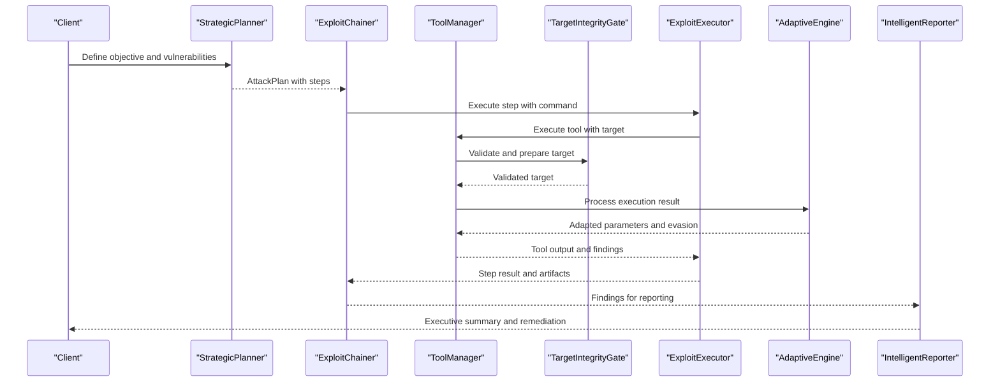

**Diagram sources**
- [strategic_planner.py](file://backend/exploitation/strategic_planner.py#L266-L315)
- [exploit_chainer.py](file://backend/exploitation/exploit_chainer.py#L345-L461)
- [tool_manager.py](file://backend/inference/tool_manager.py#L226-L618)
- [target_integrity_gate.py](file://backend/inference/target_integrity_gate.py#L267-L354)
- [exploit_executor.py](file://backend/exploitation/exploit_executor.py#L240-L356)
- [adaptive_exploitation.py](file://backend/intelligence/adaptive_exploitation.py#L527-L613)
- [intelligent_reporter.py](file://backend/reporting/intelligent_reporter.py#L102-L160)

## Detailed Component Analysis

### Adaptive Exploitation Engine
The engine performs real-time adaptation by:
- Detecting defenses from tool output and response characteristics
- Adjusting parameters (rate, threads, timeout, delay) based on outcomes
- Applying evasion techniques (encoding, case variation, fragmentation, decoy scans)
- Selecting strategies using Bayesian inference with Thompson sampling

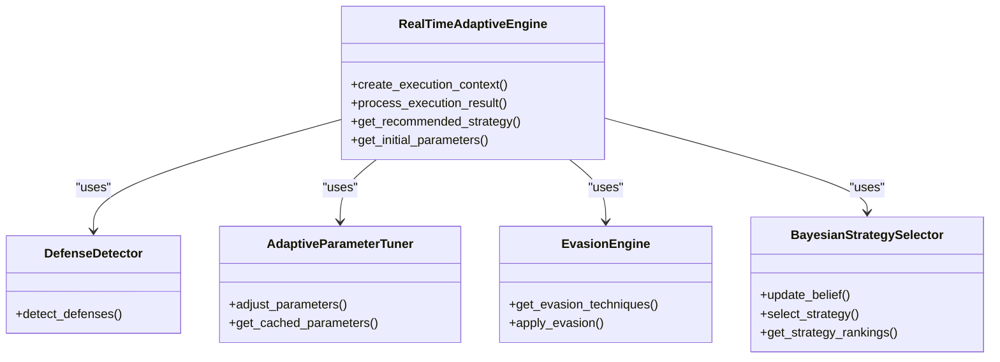

**Diagram sources**
- [adaptive_exploitation.py](file://backend/intelligence/adaptive_exploitation.py#L474-L875)

**Section sources**
- [adaptive_exploitation.py](file://backend/intelligence/adaptive_exploitation.py#L81-L800)

### Target Integrity Gate
The target integrity gate enforces responsible targeting by:
- Validating raw targets and detecting injection attempts
- Authorizing targets against predefined lists and patterns
- Resolving hostnames to IP addresses
- Formatting targets appropriately for specific tools

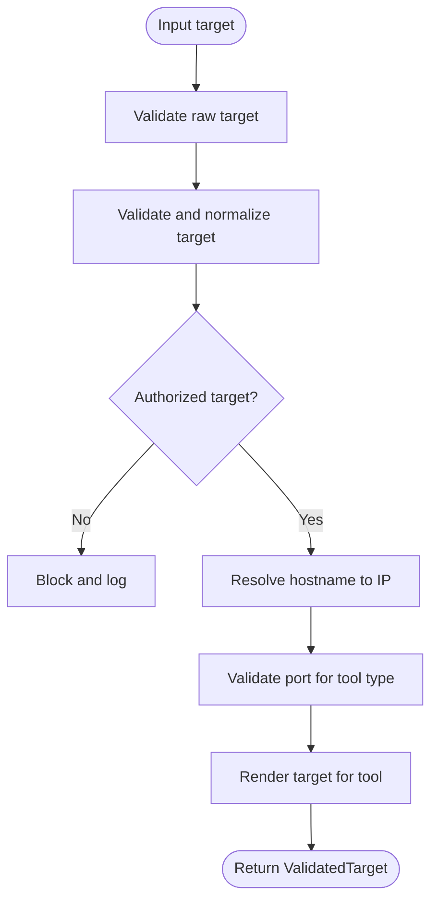

**Diagram sources**
- [target_integrity_gate.py](file://backend/inference/target_integrity_gate.py#L67-L354)
- [target_schema.py](file://backend/inference/target_schema.py#L56-L81)

**Section sources**
- [target_integrity_gate.py](file://backend/inference/target_integrity_gate.py#L19-L366)
- [target_schema.py](file://backend/inference/target_schema.py#L8-L81)

### Command Safety System
The command safety system validates commands to prevent unintended damage or detection:
- Validates tool availability and target format
- Scans arguments for dangerous patterns
- Enforces safe command construction and execution
- Logs rejections and executions for auditability

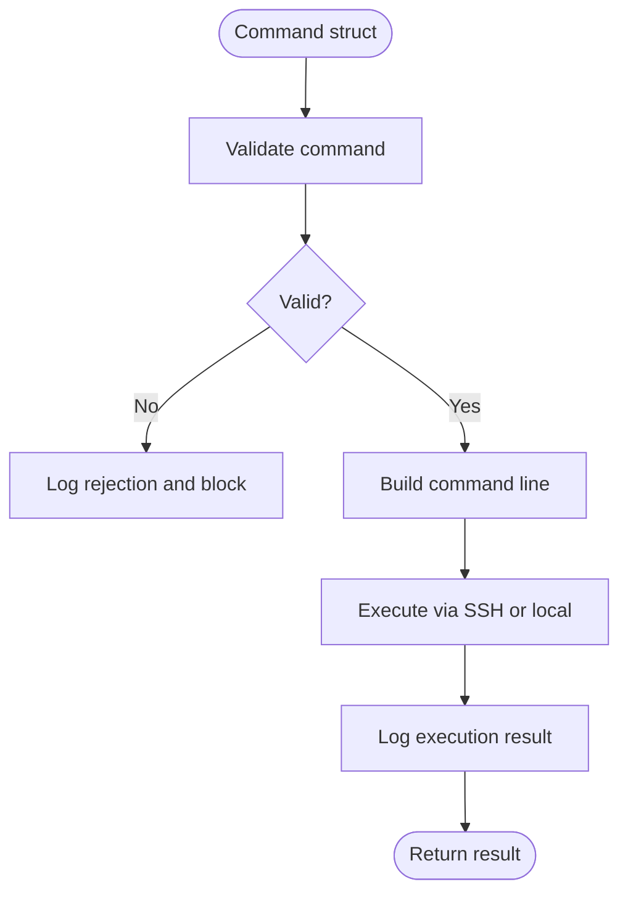

**Diagram sources**
- [command_safety.py](file://backend/inference/command_safety.py#L145-L361)

**Section sources**
- [command_safety.py](file://backend/inference/command_safety.py#L91-L366)

### Tool Manager Integration
The tool manager integrates safety gates and orchestrates execution:
- Applies target integrity validation before tool execution
- Streams output and parses findings
- Manages timeouts and dynamic adjustments
- Emits real-time updates to the frontend

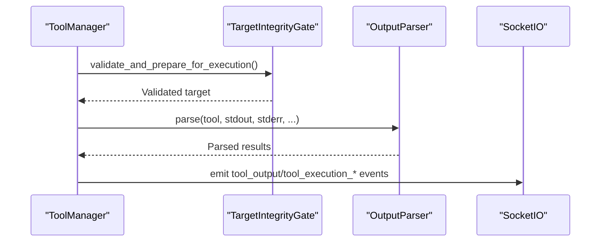

**Diagram sources**
- [tool_manager.py](file://backend/inference/tool_manager.py#L359-L593)

**Section sources**
- [tool_manager.py](file://backend/inference/tool_manager.py#L226-L800)

### Exploit Executor
The exploit executor safely executes exploits with:
- Pre-execution validation and dangerous pattern checks
- Result parsing and artifact extraction
- Feedback to the adaptive engine for learning
- Recommendations for next steps

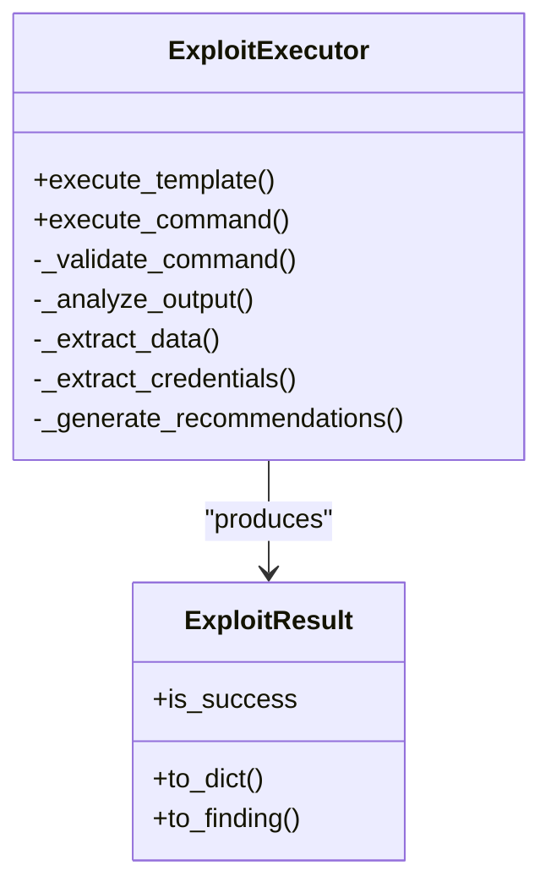

**Diagram sources**
- [exploit_executor.py](file://backend/exploitation/exploit_executor.py#L106-L729)

**Section sources**
- [exploit_executor.py](file://backend/exploitation/exploit_executor.py#L106-L729)

### Exploit Chainer
The exploit chainer orchestrates multi-step attack sequences:
- Maintains chain state across steps (sessions, credentials, data)
- Handles failures with automatic fallbacks
- Adapts steps based on discovered information
- Emits real-time execution callbacks

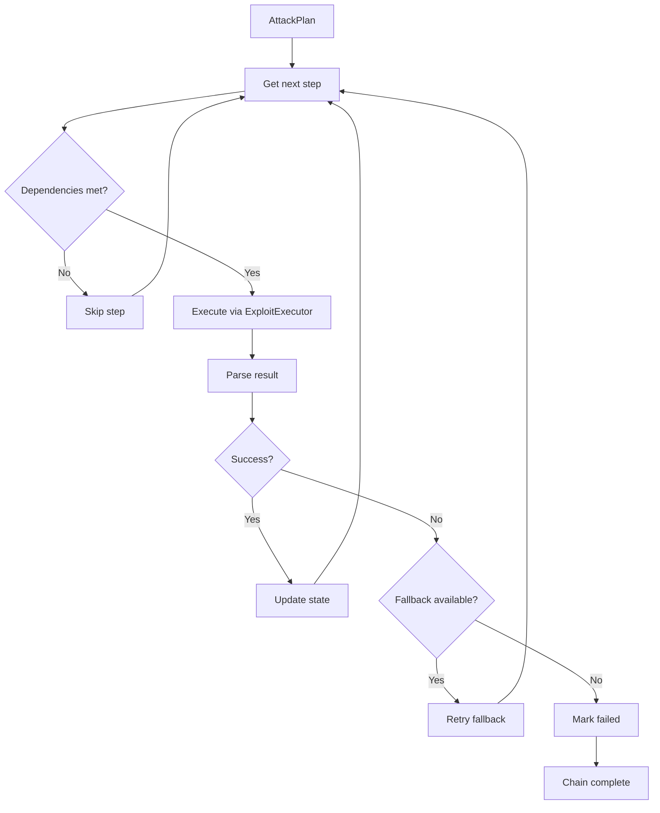

**Diagram sources**
- [exploit_chainer.py](file://backend/exploitation/exploit_chainer.py#L345-L461)

**Section sources**
- [exploit_chainer.py](file://backend/exploitation/exploit_chainer.py#L256-L865)

### Strategic Planner
The strategic planner transforms objectives into actionable steps:
- Maps vulnerabilities to MITRE ATT&CK techniques
- Builds attack plans with dependencies and fallbacks
- Suggests next actions and adapts plans after failures

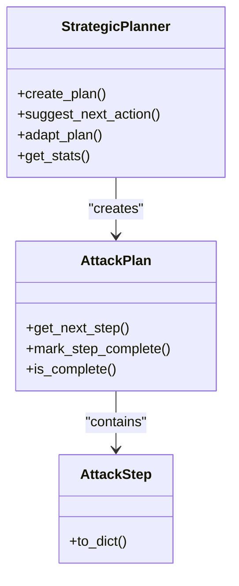

**Diagram sources**
- [strategic_planner.py](file://backend/exploitation/strategic_planner.py#L181-L662)

**Section sources**
- [strategic_planner.py](file://backend/exploitation/strategic_planner.py#L181-L662)

### Exploit Database
The exploit database provides templates for known exploits:
- Maps CVEs, vulnerability types, and services to commands
- Supports parameter substitution and reliability ratings
- Enables quick lookup and execution of appropriate exploits

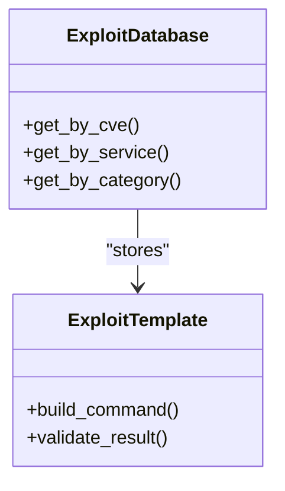

**Diagram sources**
- [exploit_db.py](file://backend/exploitation/exploit_db.py#L186-L944)

**Section sources**
- [exploit_db.py](file://backend/exploitation/exploit_db.py#L186-L944)

### Reporting System
The reporting system generates comprehensive impact documentation:
- Executive summaries and prioritized remediation
- Risk scoring and attack chain analysis
- Strategic recommendations for improvement

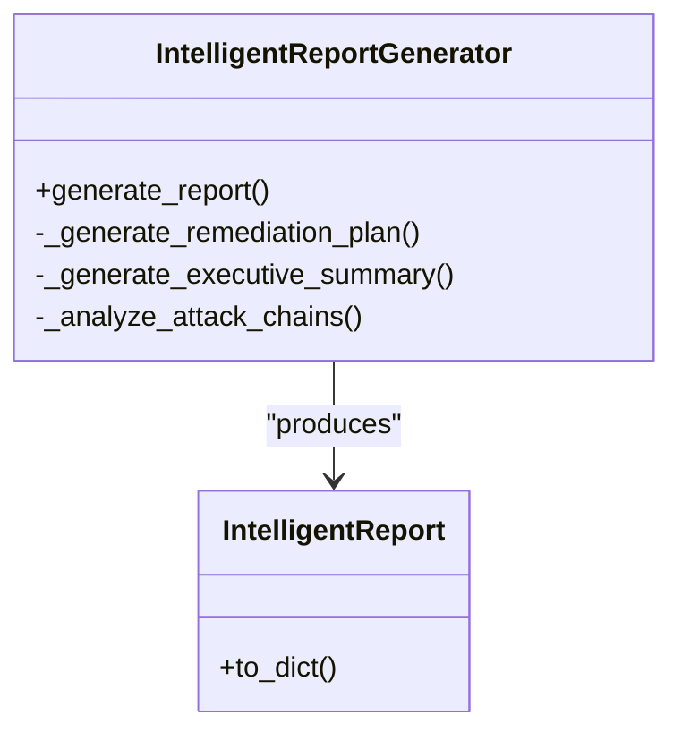

**Diagram sources**
- [intelligent_reporter.py](file://backend/reporting/intelligent_reporter.py#L72-L555)

**Section sources**
- [intelligent_reporter.py](file://backend/reporting/intelligent_reporter.py#L72-L555)

## Dependency Analysis
The system exhibits strong cohesion within layers and controlled coupling between components. Key dependencies include:
- Intelligence layer depends on adaptive engines and target schemas
- Exploitation layer depends on tool managers, executors, and databases
- Reporting layer consumes findings from exploitation and planning
- Cross-layer integrations occur at boundaries (e.g., ToolManager → TargetIntegrityGate, ExploitChainer → ExploitExecutor)

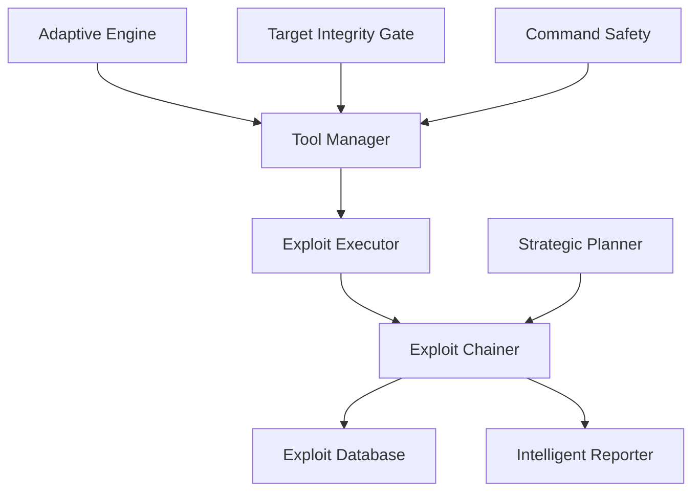

**Diagram sources**
- [adaptive_exploitation.py](file://backend/intelligence/adaptive_exploitation.py#L474-L875)
- [tool_manager.py](file://backend/inference/tool_manager.py#L359-L593)
- [exploit_executor.py](file://backend/exploitation/exploit_executor.py#L106-L729)
- [exploit_chainer.py](file://backend/exploitation/exploit_chainer.py#L256-L865)
- [exploit_db.py](file://backend/exploitation/exploit_db.py#L186-L944)
- [intelligent_reporter.py](file://backend/reporting/intelligent_reporter.py#L72-L555)

**Section sources**
- [adaptive_exploitation.py](file://backend/intelligence/adaptive_exploitation.py#L474-L875)
- [tool_manager.py](file://backend/inference/tool_manager.py#L359-L593)
- [exploit_executor.py](file://backend/exploitation/exploit_executor.py#L106-L729)
- [exploit_chainer.py](file://backend/exploitation/exploit_chainer.py#L256-L865)
- [exploit_db.py](file://backend/exploitation/exploit_db.py#L186-L944)
- [intelligent_reporter.py](file://backend/reporting/intelligent_reporter.py#L72-L555)

## Performance Considerations
- Adaptive parameter tuning reduces unnecessary retries and improves convergence under detection pressure.
- Dynamic timeout adjustments and data timeouts prevent stalls and improve throughput for long-running tools.
- Streaming output and real-time callbacks minimize latency and improve user experience.
- Bayesian strategy selection balances exploration and exploitation to optimize success rates.

[No sources needed since this section provides general guidance]

## Troubleshooting Guide
Common issues and resolutions:
- Target validation failures: Review authorization lists and hostname resolution; ensure targets are in allowed patterns.
- Command safety rejections: Remove or escape dangerous patterns; confirm tool availability and target format.
- Tool execution timeouts: Increase timeouts cautiously; reduce concurrency or adjust evasion parameters.
- Detection-induced retries: Apply evasion techniques; reduce rate and delay; switch fallback strategies.
- Reporting discrepancies: Verify findings parsing and remediation plan generation; ensure LLM availability for summaries.

**Section sources**
- [target_integrity_gate.py](file://backend/inference/target_integrity_gate.py#L107-L154)
- [command_safety.py](file://backend/inference/command_safety.py#L145-L175)
- [tool_manager.py](file://backend/inference/tool_manager.py#L620-L800)
- [adaptive_exploitation.py](file://backend/intelligence/adaptive_exploitation.py#L527-L613)
- [intelligent_reporter.py](file://backend/reporting/intelligent_reporter.py#L102-L160)

## Conclusion
The adaptive exploitation system combines real-time defense detection, Bayesian strategy selection, and robust safety controls to execute responsible and effective penetration testing. By continuously adapting to target responses and security countermeasures, it maximizes success while minimizing unintended impact. Integration with the intelligence, exploitation, and reporting layers ensures comprehensive threat assessment, secure execution, and actionable remediation guidance.

[No sources needed since this section summarizes without analyzing specific files]

## Appendices

### Practical Examples

#### Example 1: Adaptive Strategy Adjustment
- Scenario: WAF detected during SQL injection attempt
- Actions: Decrease rate, enable evasion, add encoding; retry with adapted parameters
- Outcome: Successful bypass and data extraction

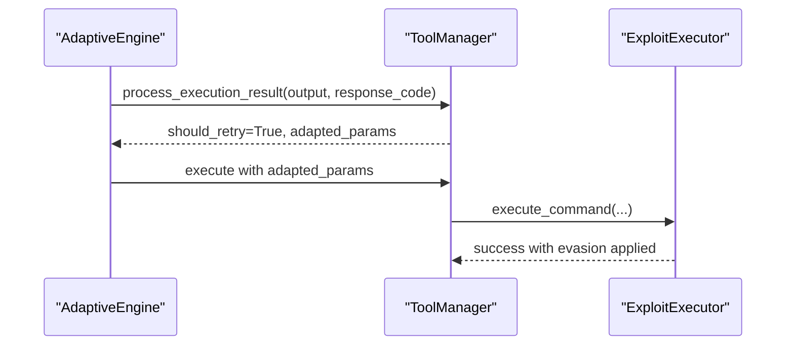

**Diagram sources**
- [adaptive_exploitation.py](file://backend/intelligence/adaptive_exploitation.py#L527-L613)
- [exploit_executor.py](file://backend/exploitation/exploit_executor.py#L273-L356)

**Section sources**
- [adaptive_exploitation.py](file://backend/intelligence/adaptive_exploitation.py#L527-L613)
- [exploit_executor.py](file://backend/exploitation/exploit_executor.py#L273-L356)

#### Example 2: Safety Validation Workflow
- Scenario: Executing a command with potential injection patterns
- Actions: Validate tool availability, target format, and arguments; prevent double injection; execute via SSH or local
- Outcome: Safe execution with audit logs

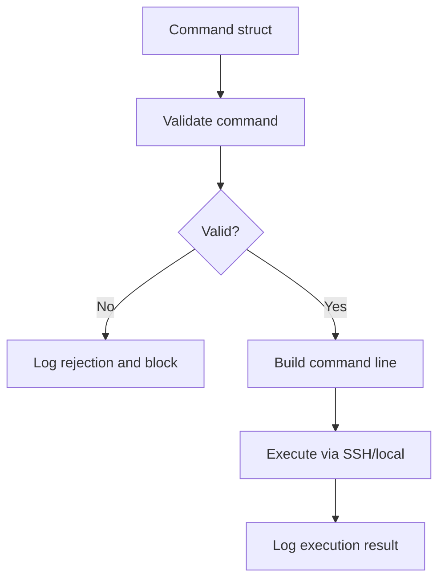

**Diagram sources**
- [command_safety.py](file://backend/inference/command_safety.py#L145-L361)

**Section sources**
- [command_safety.py](file://backend/inference/command_safety.py#L145-L361)

#### Example 3: Defensive Countermeasure Handling
- Scenario: Rate limiting and IPS detected
- Actions: Apply request spreading, IP rotation, fragmentation, and timing adjustments
- Outcome: Reduced detection probability and improved success rate

**Section sources**
- [adaptive_exploitation.py](file://backend/intelligence/adaptive_exploitation.py#L344-L472)

### Ethical and Legal Considerations
- Authorization: Only target authorized systems (e.g., localhost, private networks, lab environments).
- Responsible disclosure: Report findings to appropriate parties and provide remediation guidance.
- Compliance: Follow applicable laws and organizational policies governing security testing.
- Safety: Use post-exploitation tools only on compromised remote targets; avoid local system exposure.

**Section sources**
- [target_integrity_gate.py](file://backend/inference/target_integrity_gate.py#L25-L55)
- [tool_manager.py](file://backend/inference/tool_manager.py#L241-L290)