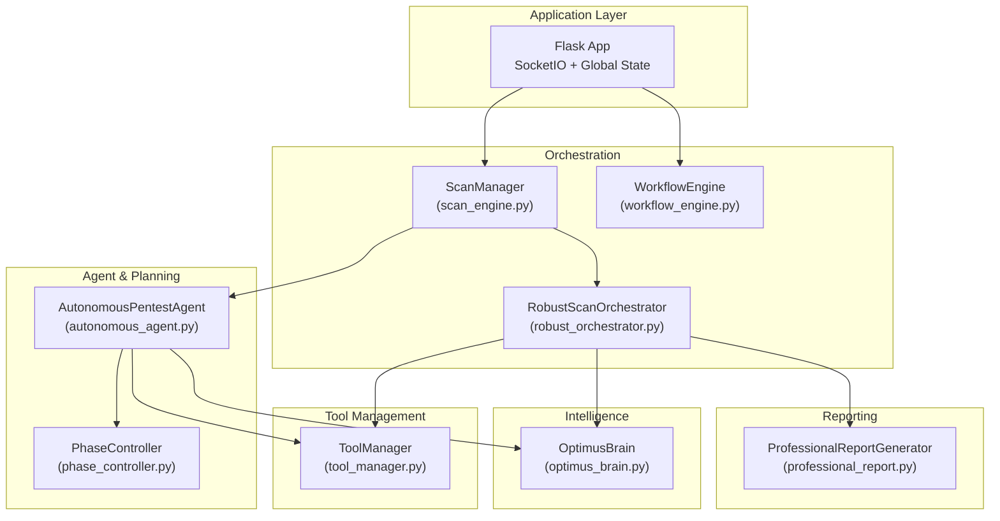
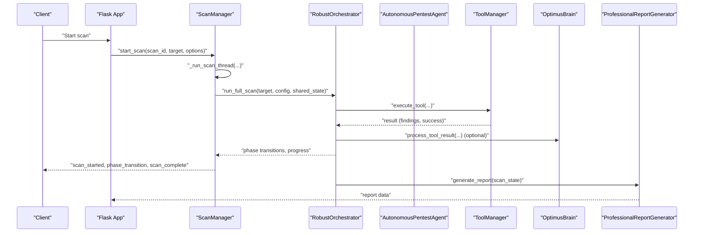
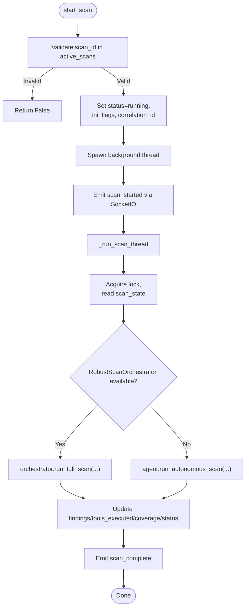
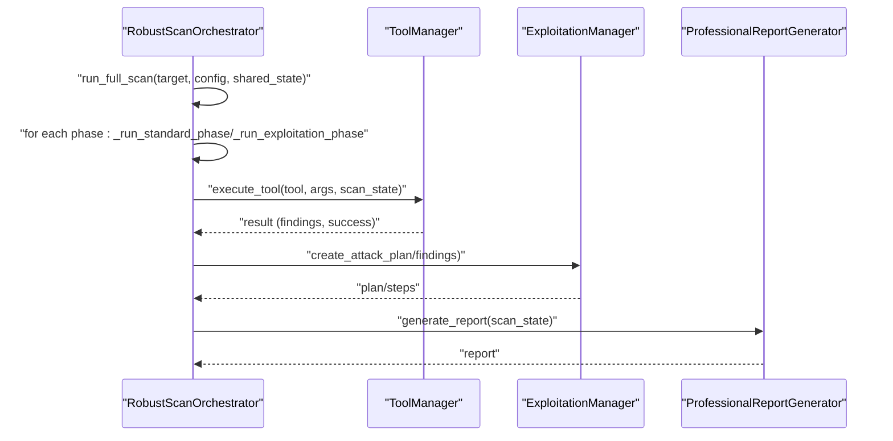
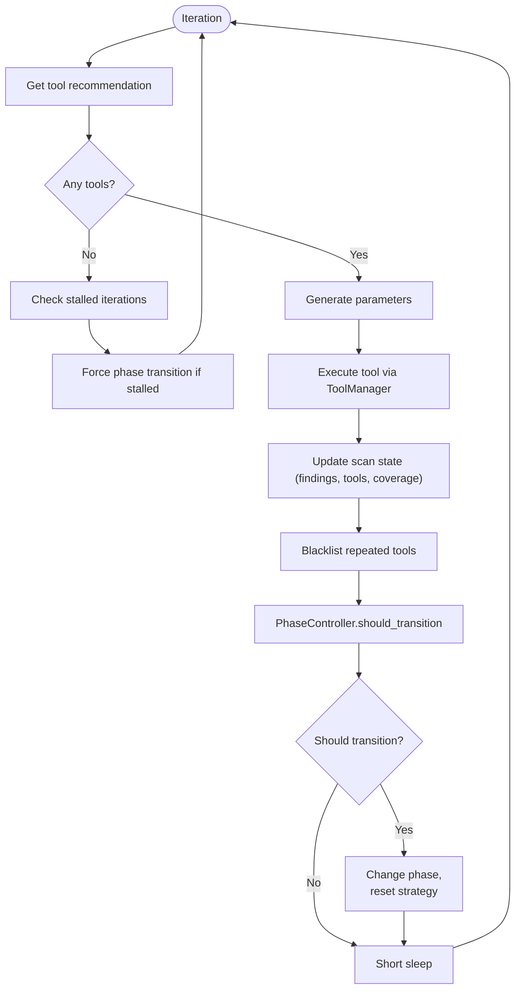
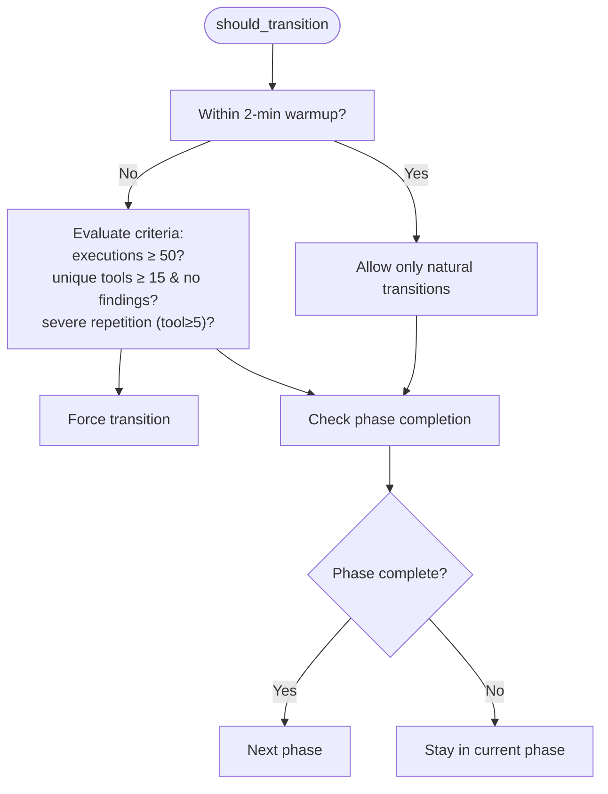
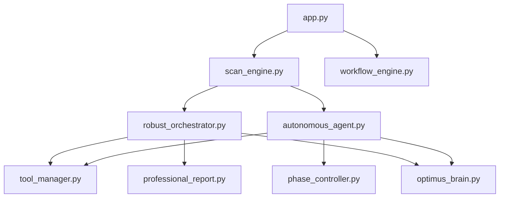

# Autonomous Scanning Engine

<cite>
**Referenced Files in This Document**
- [scan_engine.py](file://backend/core/scan_engine.py)
- [phase_controller.py](file://backend/inference/phase_controller.py)
- [autonomous_agent.py](file://backend/inference/autonomous_agent.py)
- [robust_orchestrator.py](file://backend/inference/robust_orchestrator.py)
- [tool_manager.py](file://backend/inference/tool_manager.py)
- [optimus_brain.py](file://backend/intelligence/optimus_brain.py)
- [professional_report.py](file://backend/reporting/professional_report.py)
- [app.py](file://backend/app.py)
- [workflow_engine.py](file://backend/inference/workflow_engine.py)
</cite>

## Table of Contents
1. [Introduction](#introduction)
2. [Project Structure](#project-structure)
3. [Core Components](#core-components)
4. [Architecture Overview](#architecture-overview)
5. [Detailed Component Analysis](#detailed-component-analysis)
6. [Dependency Analysis](#dependency-analysis)
7. [Performance Considerations](#performance-considerations)
8. [Troubleshooting Guide](#troubleshooting-guide)
9. [Conclusion](#conclusion)

## Introduction
This document describes the autonomous scanning engine that orchestrates multi-phase penetration testing workflows. The engine coordinates target analysis, tool selection, execution sequencing, and result processing while maintaining thread-safe operations and robust error handling. It integrates with the intelligence layer, tool management system, and reporting components to deliver a scalable, adaptive, and observable scanning platform.

## Project Structure
The scanning engine spans several backend modules:
- Core orchestration: scan engine and robust orchestrator
- Agent and decision-making: autonomous agent and phase controller
- Tool management: SSH connectivity, safety validation, and dynamic parsing
- Intelligence integration: unified brain for adaptive decisions
- Reporting: professional report generation
- Application entry: Flask + SocketIO with shared state and locks

**Diagram sources**
- [app.py](file://backend/app.py#L165-L200)
- [scan_engine.py](file://backend/core/scan_engine.py#L26-L148)
- [robust_orchestrator.py](file://backend/inference/robust_orchestrator.py#L129-L156)
- [workflow_engine.py](file://backend/inference/workflow_engine.py#L17-L104)
- [autonomous_agent.py](file://backend/inference/autonomous_agent.py#L50-L132)
- [phase_controller.py](file://backend/inference/phase_controller.py#L7-L36)
- [tool_manager.py](file://backend/inference/tool_manager.py#L49-L130)
- [optimus_brain.py](file://backend/intelligence/optimus_brain.py#L46-L78)
- [professional_report.py](file://backend/reporting/professional_report.py#L73-L100)

**Section sources**
- [app.py](file://backend/app.py#L165-L200)
- [scan_engine.py](file://backend/core/scan_engine.py#L26-L148)
- [robust_orchestrator.py](file://backend/inference/robust_orchestrator.py#L129-L156)
- [workflow_engine.py](file://backend/inference/workflow_engine.py#L17-L104)
- [autonomous_agent.py](file://backend/inference/autonomous_agent.py#L50-L132)
- [phase_controller.py](file://backend/inference/phase_controller.py#L7-L36)
- [tool_manager.py](file://backend/inference/tool_manager.py#L49-L130)
- [optimus_brain.py](file://backend/intelligence/optimus_brain.py#L46-L78)
- [professional_report.py](file://backend/reporting/professional_report.py#L73-L100)

## Core Components
- ScanManager: Central coordinator that initializes components, starts scans in background threads, emits WebSocket events, and manages stop/pause/resume signals. It uses a shared state dictionary guarded by a threading lock for thread-safe operations.
- RobustScanOrchestrator: Ensures all phases execute with minimum tool coverage, explicit exploitation handling, and comprehensive reporting. It integrates with the tool manager, output parser, and optional intelligence components.
- AutonomousPentestAgent: Fully autonomous agent that selects tools, executes them, learns from outcomes, and decides phase transitions. It integrates the phase controller, tool manager, and optional intelligence via OptimusBrain.
- PhaseController: Determines when to transition between reconnaissance, scanning, exploitation, post-exploitation, and cleanup phases based on progress metrics and findings.
- ToolManager: Manages SSH connections to the Kali VM, validates commands, streams output, parses findings, and records execution history for dynamic timeouts and learning.
- OptimusBrain: Unified intelligence engine that provides tool selection, adaptive exploitation, vulnerability chaining, explainability, and continuous learning.
- ProfessionalReportGenerator: Produces structured, actionable reports with severity mapping, remediation guidance, and risk assessments.

**Section sources**
- [scan_engine.py](file://backend/core/scan_engine.py#L26-L148)
- [robust_orchestrator.py](file://backend/inference/robust_orchestrator.py#L129-L156)
- [autonomous_agent.py](file://backend/inference/autonomous_agent.py#L50-L132)
- [phase_controller.py](file://backend/inference/phase_controller.py#L7-L36)
- [tool_manager.py](file://backend/inference/tool_manager.py#L49-L130)
- [optimus_brain.py](file://backend/intelligence/optimus_brain.py#L46-L78)
- [professional_report.py](file://backend/reporting/professional_report.py#L73-L100)

## Architecture Overview
The engine operates as a multi-layered system:
- Application layer manages global state and WebSocket communication.
- Orchestration layer starts scans, coordinates phases, and emits progress.
- Agent layer performs autonomous decision-making and tool execution.
- Intelligence layer augments decisions with memory, learning, and adaptive strategies.
- Tool management layer executes commands safely and parses results.
- Reporting layer generates professional reports.

**Diagram sources**
- [app.py](file://backend/app.py#L165-L200)
- [scan_engine.py](file://backend/core/scan_engine.py#L82-L148)
- [robust_orchestrator.py](file://backend/inference/robust_orchestrator.py#L271-L412)
- [tool_manager.py](file://backend/inference/tool_manager.py#L226-L630)
- [optimus_brain.py](file://backend/intelligence/optimus_brain.py#L328-L428)
- [professional_report.py](file://backend/reporting/professional_report.py#L82-L100)

## Detailed Component Analysis

### ScanManager: Thread-Safe Orchestration
ScanManager is the central coordinator that:
- Initializes ToolManager and AutonomousPentestAgent lazily.
- Starts scans in daemon threads, emitting WebSocket events for lifecycle and progress.
- Manages stop/pause/resume flags and thread references.
- Uses a shared state dictionary guarded by a threading lock for thread-safe updates.
- Provides tool execution and recommendations for manual intervention.

Key thread-safety mechanisms:
- Shared state protected by a lock acquired around reads/writes.
- Background threads created with daemon=True to avoid blocking shutdown.
- SocketIO events emitted asynchronously to avoid blocking execution.

Operational flow:
- start_scan validates scan existence, sets status, and launches a background thread.
- _run_scan_thread retrieves scan state under lock, selects orchestrator (RobustScanOrchestrator preferred), runs the scan, updates results, and emits completion.

**Diagram sources**
- [scan_engine.py](file://backend/core/scan_engine.py#L82-L310)

**Section sources**
- [scan_engine.py](file://backend/core/scan_engine.py#L26-L148)
- [scan_engine.py](file://backend/core/scan_engine.py#L150-L310)
- [app.py](file://backend/app.py#L165-L175)

### RobustScanOrchestrator: Multi-Phase Execution
RobustScanOrchestrator ensures:
- Phases execute with minimum tool counts and time bounds.
- Explicit exploitation phase with integrated exploitation module and fallbacks.
- Real-time progress tracking and WebSocket updates.
- Enhanced output parsing and professional reporting integration.

Execution highlights:
- PhaseConfig defines min/max tools/time per phase to guarantee coverage.
- Intelligent tool selection when available; otherwise uses hardcoded tool lists.
- Exploitation phase attempts exploitation on findings and runs fallback/exploit commands.
- Emits scan_started, phase_transition, tool_complete, and scan_complete events.

**Diagram sources**
- [robust_orchestrator.py](file://backend/inference/robust_orchestrator.py#L271-L412)
- [robust_orchestrator.py](file://backend/inference/robust_orchestrator.py#L686-L791)
- [tool_manager.py](file://backend/inference/tool_manager.py#L226-L630)
- [professional_report.py](file://backend/reporting/professional_report.py#L82-L100)

**Section sources**
- [robust_orchestrator.py](file://backend/inference/robust_orchestrator.py#L63-L127)
- [robust_orchestrator.py](file://backend/inference/robust_orchestrator.py#L271-L412)
- [robust_orchestrator.py](file://backend/inference/robust_orchestrator.py#L686-L791)

### AutonomousPentestAgent: Decision-Making and Learning
The autonomous agent:
- Integrates ToolManager, PhaseController, VulnerabilityKnowledgeBase, StrategySelector, and optional OptimusBrain.
- Executes iterative loops selecting tools, generating parameters, executing, updating state, and deciding phase transitions.
- Supports fully autonomous mode with adaptive decision-making and attack pattern matching.

Decision-making flow:
- _get_tool_recommendation aggregates tool sources (dynamic DB, KB, phase-aware selector).
- _generate_tool_parameters adapts arguments based on phase, findings, and technologies.
- _execute_tool_real delegates to ToolManager with safety checks and streaming.
- _update_scan_state_real updates findings, tools_executed, coverage, and blacklists.
- PhaseController determines transitions based on metrics and time constraints.

**Diagram sources**
- [autonomous_agent.py](file://backend/inference/autonomous_agent.py#L133-L328)
- [phase_controller.py](file://backend/inference/phase_controller.py#L28-L115)
- [tool_manager.py](file://backend/inference/tool_manager.py#L226-L630)

**Section sources**
- [autonomous_agent.py](file://backend/inference/autonomous_agent.py#L133-L328)
- [phase_controller.py](file://backend/inference/phase_controller.py#L28-L115)

### PhaseController: Intelligent Phase Transitions
The phase controller enforces:
- Warm-up period to avoid premature transitions.
- Relaxed criteria: minimum executions, unique tools, severe repetition detection.
- Phase-specific completion heuristics for reconnaissance, scanning, exploitation, post-exploitation, and cleanup.
- Optional intelligent transitions guided by a learning module.

**Diagram sources**
- [phase_controller.py](file://backend/inference/phase_controller.py#L28-L115)

**Section sources**
- [phase_controller.py](file://backend/inference/phase_controller.py#L7-L367)

### ToolManager: Secure Execution and Parsing
ToolManager provides:
- SSH connection management with retries, timeouts, and keepalive.
- Command safety validation and streaming output via PTY channels.
- Dynamic command generation and evolving parsers for output interpretation.
- Execution history for dynamic timeout adjustments and learning.

Safety and streaming:
- Post-exploitation tools are blocked unless validated remote session present.
- Target integrity gates and normalization ensure safe execution contexts.
- Real-time output streaming to frontend via SocketIO.

**Section sources**
- [tool_manager.py](file://backend/inference/tool_manager.py#L131-L212)
- [tool_manager.py](file://backend/inference/tool_manager.py#L226-L630)

### OptimusBrain: Intelligence Integration
OptimusBrain unifies:
- Memory system for cross-scan learning.
- Web intelligence and delegation systems.
- Adaptive exploitation and vulnerability chaining.
- Explainable AI and continuous learning.
- Zero-day discovery and campaign intelligence.

Integration points:
- Tool selection with confidence and reasoning.
- Processing tool results to adapt parameters and detect defenses.
- Generating exploitation plans and explainable reports.

**Section sources**
- [optimus_brain.py](file://backend/intelligence/optimus_brain.py#L46-L78)
- [optimus_brain.py](file://backend/intelligence/optimus_brain.py#L228-L327)
- [optimus_brain.py](file://backend/intelligence/optimus_brain.py#L328-L428)

### ProfessionalReportGenerator: Reporting Integration
The report generator:
- Produces structured reports with executive summaries, findings, risk assessments, and remediation guidance.
- Maps findings to CWE/OWASP categories.
- Integrates with orchestrator-generated scan states for completeness.

**Section sources**
- [professional_report.py](file://backend/reporting/professional_report.py#L73-L100)
- [professional_report.py](file://backend/reporting/professional_report.py#L584-L606)

## Dependency Analysis
The system exhibits layered dependencies:
- Application layer depends on orchestration and routes.
- Orchestration depends on agents, tool management, and reporting.
- Agents depend on planning, tool management, and optional intelligence.
- Tool management depends on parsers and optional hybrid systems.
- Intelligence provides optional augmentation to agents and orchestrators.

**Diagram sources**
- [app.py](file://backend/app.py#L179-L200)
- [scan_engine.py](file://backend/core/scan_engine.py#L26-L148)
- [robust_orchestrator.py](file://backend/inference/robust_orchestrator.py#L129-L156)
- [workflow_engine.py](file://backend/inference/workflow_engine.py#L17-L104)
- [autonomous_agent.py](file://backend/inference/autonomous_agent.py#L50-L132)
- [phase_controller.py](file://backend/inference/phase_controller.py#L7-L36)
- [tool_manager.py](file://backend/inference/tool_manager.py#L49-L130)
- [optimus_brain.py](file://backend/intelligence/optimus_brain.py#L46-L78)
- [professional_report.py](file://backend/reporting/professional_report.py#L73-L100)

**Section sources**
- [app.py](file://backend/app.py#L179-L200)
- [scan_engine.py](file://backend/core/scan_engine.py#L26-L148)
- [robust_orchestrator.py](file://backend/inference/robust_orchestrator.py#L129-L156)
- [workflow_engine.py](file://backend/inference/workflow_engine.py#L17-L104)
- [autonomous_agent.py](file://backend/inference/autonomous_agent.py#L50-L132)
- [phase_controller.py](file://backend/inference/phase_controller.py#L7-L36)
- [tool_manager.py](file://backend/inference/tool_manager.py#L49-L130)
- [optimus_brain.py](file://backend/intelligence/optimus_brain.py#L46-L78)
- [professional_report.py](file://backend/reporting/professional_report.py#L73-L100)

## Performance Considerations
- Concurrency: Background threads with daemon=True prevent blocking shutdown; shared state guarded by a threading lock avoids race conditions.
- Timeouts: Adaptive data timeouts per tool family and configurable overall timeouts prevent stalls.
- Resource limits: PhaseConfig enforces minimum tool coverage and caps execution time per phase.
- Observability: Trace IDs and correlation IDs propagate through logs and WebSocket events for end-to-end visibility.
- Scalability: SocketIO async mode and modular components enable horizontal scaling of workers and agents.

[No sources needed since this section provides general guidance]

## Troubleshooting Guide
Common issues and resolutions:
- Import failures in ScanManager: Ensure dependencies like paramiko and flask-socketio are installed; the manager logs detailed import errors and stack traces.
- SSH connection failures: ToolManager retries up to configured attempts with exponential backoff and PTY keepalive; verify KALI_HOST/PORT/USER/PASSWORD.
- Tool safety rejections: Commands violating safety rules are blocked; adjust parameters or use allowed tool variants.
- Missing API keys: ToolManager checks requirements and falls back to alternative tools when available.
- Phase stuck transitions: PhaseController enforces warmup and relaxed criteria; consider increasing tool diversity or adjusting thresholds.
- WebSocket emissions: ScanManager wraps emissions in try/catch to avoid blocking; check logs for warnings.

**Section sources**
- [scan_engine.py](file://backend/core/scan_engine.py#L67-L81)
- [tool_manager.py](file://backend/inference/tool_manager.py#L131-L212)
- [tool_manager.py](file://backend/inference/tool_manager.py#L337-L396)
- [phase_controller.py](file://backend/inference/phase_controller.py#L63-L115)

## Conclusion
The autonomous scanning engine provides a robust, thread-safe, and intelligent orchestration framework for multi-phase penetration testing. By combining autonomous decision-making, phase-aware planning, secure tool execution, and optional intelligence augmentation, it delivers scalable and observable scanning with comprehensive reporting. The modular design enables incremental enhancements and integration with external systems.