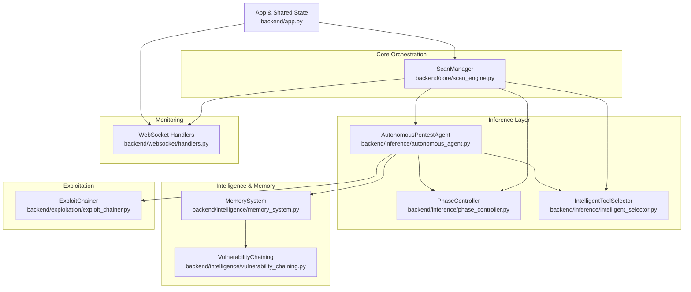
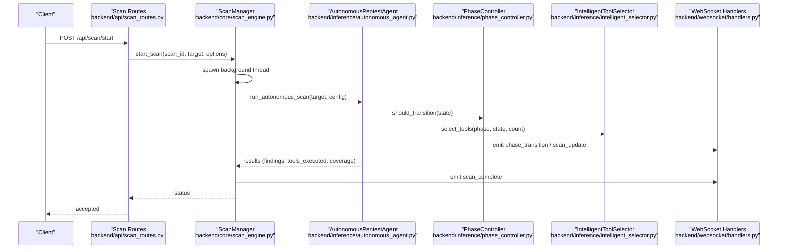
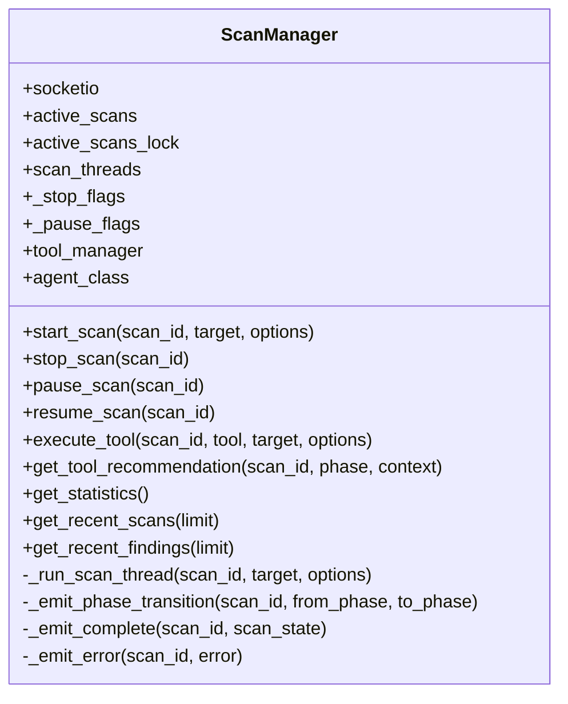
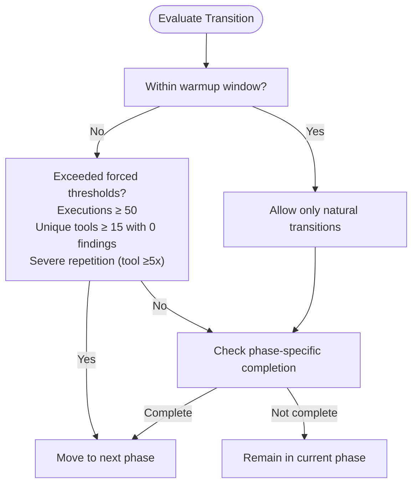
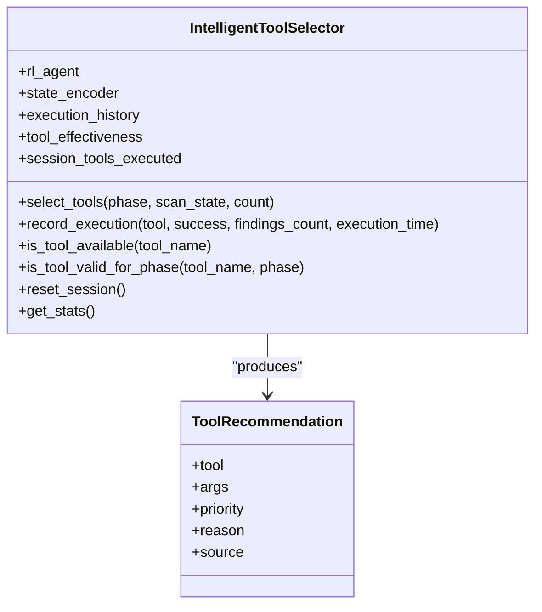
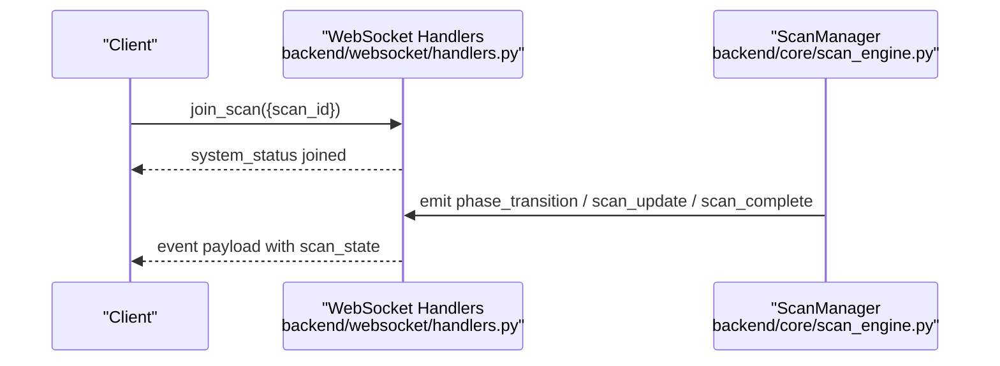
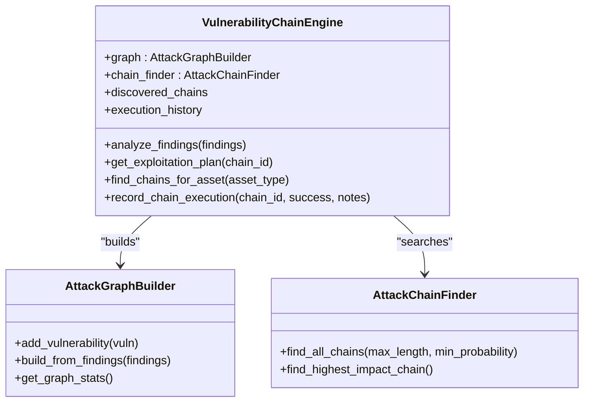
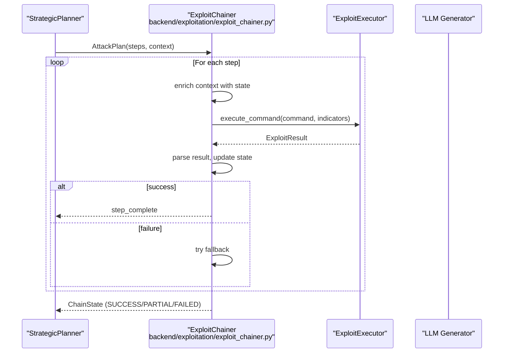
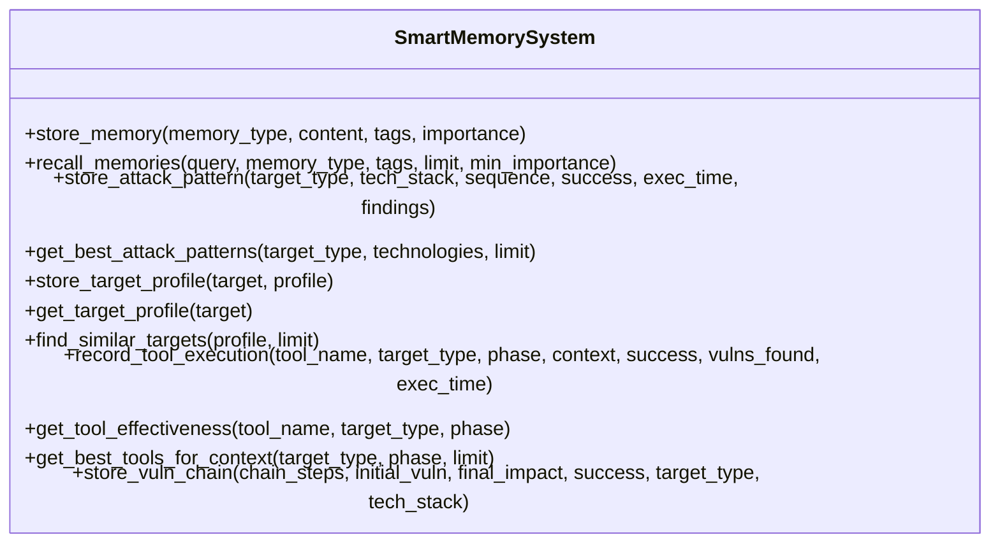
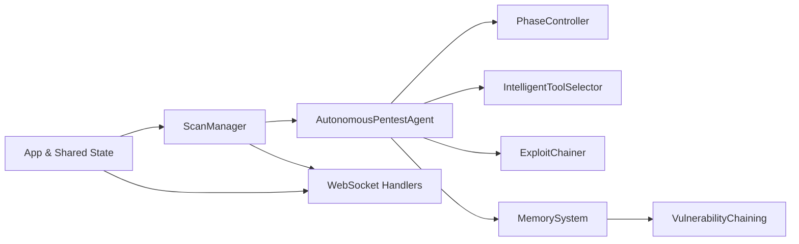

# Core Features

<cite>
**Referenced Files in This Document**
- [scan_engine.py](file://backend/core/scan_engine.py)
- [phase_controller.py](file://backend/inference/phase_controller.py)
- [intelligent_selector.py](file://backend/inference/intelligent_selector.py)
- [handlers.py](file://backend/websocket/handlers.py)
- [vulnerability_chaining.py](file://backend/intelligence/vulnerability_chaining.py)
- [exploit_chainer.py](file://backend/exploitation/exploit_chainer.py)
- [autonomous_agent.py](file://backend/inference/autonomous_agent.py)
- [memory_system.py](file://backend/intelligence/memory_system.py)
- [app.py](file://backend/app.py)
</cite>

## Table of Contents
1. [Introduction](#introduction)
2. [Project Structure](#project-structure)
3. [Core Components](#core-components)
4. [Architecture Overview](#architecture-overview)
5. [Detailed Component Analysis](#detailed-component-analysis)
6. [Dependency Analysis](#dependency-analysis)
7. [Performance Considerations](#performance-considerations)
8. [Troubleshooting Guide](#troubleshooting-guide)
9. [Conclusion](#conclusion)

## Introduction
This document explains the core features of the Optimus platform with a focus on the autonomous scanning engine, intelligent tool selection, real-time monitoring, and vulnerability chaining. It provides both conceptual overviews for cybersecurity practitioners and technical details for developers implementing similar systems. The platform’s terminology aligns with the codebase, including “phase controller,” “intelligent selector,” and “adaptive exploitation.”

## Project Structure
Optimus is organized into cohesive functional domains:
- Core orchestration and scan lifecycle management
- Inference and decision-making (phase control, tool selection, autonomous agent)
- Intelligence and memory systems (cross-scan learning, vulnerability chaining)
- Exploitation orchestration (multi-step chains)
- Real-time monitoring via WebSocket
- Application bootstrap and shared state

**Diagram sources**
- [scan_engine.py](file://backend/core/scan_engine.py#L26-L148)
- [phase_controller.py](file://backend/inference/phase_controller.py#L7-L367)
- [intelligent_selector.py](file://backend/inference/intelligent_selector.py#L33-L690)
- [autonomous_agent.py](file://backend/inference/autonomous_agent.py#L50-L132)
- [vulnerability_chaining.py](file://backend/intelligence/vulnerability_chaining.py#L660-L720)
- [memory_system.py](file://backend/intelligence/memory_system.py#L42-L1022)
- [exploit_chainer.py](file://backend/exploitation/exploit_chainer.py#L256-L462)
- [handlers.py](file://backend/websocket/handlers.py#L26-L119)
- [app.py](file://backend/app.py#L168-L275)

**Section sources**
- [app.py](file://backend/app.py#L168-L275)
- [scan_engine.py](file://backend/core/scan_engine.py#L26-L148)
- [handlers.py](file://backend/websocket/handlers.py#L26-L119)

## Core Components
- Autonomous Scanning Engine (ScanManager): Manages scan lifecycle, thread-safe orchestration, and real-time events.
- Phase Controller: Determines when to transition between reconnaissance, scanning, exploitation, post-exploitation, and covering tracks.
- Intelligent Tool Selector: Dynamically selects tools using learned patterns, reactive triggers, and rule-based heuristics.
- Vulnerability Chaining: Builds attack graphs from findings and discovers exploit chains for advanced exploitation.
- Exploit Chainer: Executes multi-step chains, manages sessions and credentials, and adapts on failure.
- Real-Time Monitoring: WebSocket handlers emit live events for scan lifecycle, tool execution, and findings.
- Cross-Scan Memory: Persistent memory system for attack patterns, target profiles, tool effectiveness, and chains.

**Section sources**
- [scan_engine.py](file://backend/core/scan_engine.py#L26-L148)
- [phase_controller.py](file://backend/inference/phase_controller.py#L7-L367)
- [intelligent_selector.py](file://backend/inference/intelligent_selector.py#L33-L690)
- [vulnerability_chaining.py](file://backend/intelligence/vulnerability_chaining.py#L660-L720)
- [exploit_chainer.py](file://backend/exploitation/exploit_chainer.py#L256-L462)
- [handlers.py](file://backend/websocket/handlers.py#L26-L119)
- [memory_system.py](file://backend/intelligence/memory_system.py#L42-L1022)

## Architecture Overview
The platform integrates a thread-safe scan manager with an autonomous agent that drives multi-phase penetration testing. The agent coordinates a phase controller and intelligent selector, emits real-time updates via WebSocket, and leverages a memory system for cross-scan learning. Exploitation builds upon findings to execute chained attacks.

**Diagram sources**
- [scan_engine.py](file://backend/core/scan_engine.py#L82-L148)
- [autonomous_agent.py](file://backend/inference/autonomous_agent.py#L133-L327)
- [phase_controller.py](file://backend/inference/phase_controller.py#L28-L114)
- [intelligent_selector.py](file://backend/inference/intelligent_selector.py#L300-L383)
- [handlers.py](file://backend/websocket/handlers.py#L122-L179)

## Detailed Component Analysis

### Autonomous Scanning Engine (ScanManager)
- Thread-safe orchestration: Uses a background thread per scan, a shared dictionary of active scans, and a lock for atomic updates.
- Lifecycle management: Initializes components, starts scans, handles stop/pause/resume, executes tools, and emits real-time events.
- Real-time monitoring: Emits scan lifecycle events (started, phase transition, complete, error) via WebSocket rooms keyed by scan_id.
- Robust orchestrator integration: Optionally delegates to a robust orchestrator for improved phase handling.

**Diagram sources**
- [scan_engine.py](file://backend/core/scan_engine.py#L26-L148)

**Section sources**
- [scan_engine.py](file://backend/core/scan_engine.py#L26-L148)
- [scan_engine.py](file://backend/core/scan_engine.py#L150-L310)
- [scan_engine.py](file://backend/core/scan_engine.py#L311-L365)
- [scan_engine.py](file://backend/core/scan_engine.py#L423-L444)

### Phase Controller (phase_controller)
- Multi-criteria transitions: Enforces minimum time in phase, caps execution counts, and checks severe repetition to avoid premature transitions.
- Phase-specific completion: Reconnaissance, scanning, exploitation, post-exploitation, and covering tracks each define completion thresholds.
- Intelligent transitions: Optionally consults a learning module to assess whether a phase remains effective.

**Diagram sources**
- [phase_controller.py](file://backend/inference/phase_controller.py#L28-L114)
- [phase_controller.py](file://backend/inference/phase_controller.py#L323-L342)

**Section sources**
- [phase_controller.py](file://backend/inference/phase_controller.py#L7-L367)

### Intelligent Tool Selection (intelligent_selector)
- Multi-source selection: RL agent (when available), finding-triggered, technology-triggered, and rule-based strategies.
- Tool effectiveness tracking: Maintains per-tool statistics and avoids redundant executions.
- Availability checks: Validates tools against system availability and phase-appropriate mappings.
- Priority and randomness: Balances high-confidence selections with exploratory diversity.

**Diagram sources**
- [intelligent_selector.py](file://backend/inference/intelligent_selector.py#L33-L690)

**Section sources**
- [intelligent_selector.py](file://backend/inference/intelligent_selector.py#L300-L383)
- [intelligent_selector.py](file://backend/inference/intelligent_selector.py#L601-L640)
- [intelligent_selector.py](file://backend/inference/intelligent_selector.py#L641-L658)

### Real-Time Monitoring (WebSocket)
- Event-driven updates: Clients join scan-specific rooms and receive events for lifecycle, tool execution, findings, and errors.
- Emission helpers: Centralized functions emit structured events with scan state snapshots and timestamps.

**Diagram sources**
- [handlers.py](file://backend/websocket/handlers.py#L50-L119)
- [handlers.py](file://backend/websocket/handlers.py#L122-L293)
- [scan_engine.py](file://backend/core/scan_engine.py#L311-L365)

**Section sources**
- [handlers.py](file://backend/websocket/handlers.py#L26-L119)
- [handlers.py](file://backend/websocket/handlers.py#L122-L293)

### Vulnerability Chaining (intelligence)
- Attack graph construction: Converts findings into vulnerability nodes and edges with relationships (enables, amplifies, pivots).
- Chain discovery: Finds exploit chains up to a configurable length, weighted by severity and success probability.
- Impact modeling: Derives final impact (e.g., RCE, credential access) and generates step-by-step plans.

**Diagram sources**
- [vulnerability_chaining.py](file://backend/intelligence/vulnerability_chaining.py#L660-L720)
- [vulnerability_chaining.py](file://backend/intelligence/vulnerability_chaining.py#L251-L313)
- [vulnerability_chaining.py](file://backend/intelligence/vulnerability_chaining.py#L449-L503)

**Section sources**
- [vulnerability_chaining.py](file://backend/intelligence/vulnerability_chaining.py#L660-L720)
- [vulnerability_chaining.py](file://backend/intelligence/vulnerability_chaining.py#L251-L313)
- [vulnerability_chaining.py](file://backend/intelligence/vulnerability_chaining.py#L449-L503)

### Exploit Chainer (execution)
- Multi-step orchestration: Executes planned steps, maintains chain state (sessions, credentials, environment), and adapts on failure.
- Fallback handling: Attempts fallback steps when primary attempts fail.
- Real-time callbacks: Emits events for step completion, session establishment, and credential discovery.

**Diagram sources**
- [exploit_chainer.py](file://backend/exploitation/exploit_chainer.py#L345-L462)
- [exploit_chainer.py](file://backend/exploitation/exploit_chainer.py#L463-L518)
- [exploit_chainer.py](file://backend/exploitation/exploit_chainer.py#L659-L697)

**Section sources**
- [exploit_chainer.py](file://backend/exploitation/exploit_chainer.py#L256-L462)
- [exploit_chainer.py](file://backend/exploitation/exploit_chainer.py#L463-L518)
- [exploit_chainer.py](file://backend/exploitation/exploit_chainer.py#L659-L697)

### Cross-Scan Memory Systems
- Persistent memory: Stores attack patterns, target profiles, tool effectiveness, and vulnerability chains with vector embeddings for semantic search.
- Cross-scan learning: Aggregates success/failure across scans to improve future decisions.
- Retrieval and ranking: Supports semantic search and tag-based filtering.

**Diagram sources**
- [memory_system.py](file://backend/intelligence/memory_system.py#L42-L1022)

**Section sources**
- [memory_system.py](file://backend/intelligence/memory_system.py#L42-L1022)

### Practical Examples
- Automated vulnerability assessment
  - Start a scan; the autonomous agent iteratively selects tools, records findings, and transitions phases.
  - Example path: [scan_engine.py](file://backend/core/scan_engine.py#L82-L148), [autonomous_agent.py](file://backend/inference/autonomous_agent.py#L133-L327)
- Tool recommendation workflows
  - Request a recommendation for the current phase; the intelligent selector merges RL, reactive, and rule-based signals.
  - Example path: [intelligent_selector.py](file://backend/inference/intelligent_selector.py#L300-L383)
- Real-time progress tracking
  - Join a scan room and receive live updates for phase transitions, tool execution, and findings.
  - Example path: [handlers.py](file://backend/websocket/handlers.py#L50-L119), [handlers.py](file://backend/websocket/handlers.py#L122-L293)

**Section sources**
- [scan_engine.py](file://backend/core/scan_engine.py#L82-L148)
- [autonomous_agent.py](file://backend/inference/autonomous_agent.py#L133-L327)
- [intelligent_selector.py](file://backend/inference/intelligent_selector.py#L300-L383)
- [handlers.py](file://backend/websocket/handlers.py#L50-L119)
- [handlers.py](file://backend/websocket/handlers.py#L122-L293)

## Dependency Analysis
The system exhibits clear separation of concerns:
- ScanManager depends on the autonomous agent, phase controller, and intelligent selector.
- The autonomous agent coordinates inference components and integrates with the exploitation subsystem.
- Intelligence and memory systems are decoupled but feed insights back into the agent.
- WebSocket handlers depend on shared state and ScanManager for emitting events.

**Diagram sources**
- [scan_engine.py](file://backend/core/scan_engine.py#L26-L148)
- [autonomous_agent.py](file://backend/inference/autonomous_agent.py#L50-L132)
- [phase_controller.py](file://backend/inference/phase_controller.py#L7-L367)
- [intelligent_selector.py](file://backend/inference/intelligent_selector.py#L33-L690)
- [exploit_chainer.py](file://backend/exploitation/exploit_chainer.py#L256-L462)
- [memory_system.py](file://backend/intelligence/memory_system.py#L42-L1022)
- [vulnerability_chaining.py](file://backend/intelligence/vulnerability_chaining.py#L660-L720)
- [handlers.py](file://backend/websocket/handlers.py#L26-L119)
- [app.py](file://backend/app.py#L168-L275)

**Section sources**
- [scan_engine.py](file://backend/core/scan_engine.py#L26-L148)
- [autonomous_agent.py](file://backend/inference/autonomous_agent.py#L50-L132)
- [phase_controller.py](file://backend/inference/phase_controller.py#L7-L367)
- [intelligent_selector.py](file://backend/inference/intelligent_selector.py#L33-L690)
- [exploit_chainer.py](file://backend/exploitation/exploit_chainer.py#L256-L462)
- [memory_system.py](file://backend/intelligence/memory_system.py#L42-L1022)
- [vulnerability_chaining.py](file://backend/intelligence/vulnerability_chaining.py#L660-L720)
- [handlers.py](file://backend/websocket/handlers.py#L26-L119)
- [app.py](file://backend/app.py#L168-L275)

## Performance Considerations
- Threading and locking: ScanManager uses a background thread per scan and a shared lock to protect concurrent updates to active scans.
- Event emission: WebSocket emissions are offloaded to background tasks to avoid blocking the main scan thread.
- Tool selection: Intelligent selector deduplicates and sorts recommendations, and applies small randomization to balance exploration and exploitation.
- Memory system: SQLite-backed storage with indexing supports efficient retrieval and cross-scan learning.

[No sources needed since this section provides general guidance]

## Troubleshooting Guide
- Scan does not start
  - Verify ScanManager initialization and component imports; check logs for import errors.
  - Confirm active scans dictionary and lock are properly initialized in the app.
  - References: [scan_engine.py](file://backend/core/scan_engine.py#L44-L81), [app.py](file://backend/app.py#L168-L175)
- No real-time updates
  - Ensure clients join the correct room (scan_<id>) and that WebSocket handlers are registered.
  - References: [handlers.py](file://backend/websocket/handlers.py#L50-L81), [handlers.py](file://backend/websocket/handlers.py#L222-L224)
- Tool selection returns empty
  - Check tool availability and phase validity; confirm the selector’s tool database and availability cache.
  - References: [intelligent_selector.py](file://backend/inference/intelligent_selector.py#L641-L658), [intelligent_selector.py](file://backend/inference/intelligent_selector.py#L660-L663)
- Phase stuck or not transitioning
  - Review warmup window and forced thresholds; confirm phase completion criteria.
  - References: [phase_controller.py](file://backend/inference/phase_controller.py#L63-L114), [phase_controller.py](file://backend/inference/phase_controller.py#L323-L342)
- Exploit chain fails repeatedly
  - Inspect fallback handling and step adaptation; verify command generation and environment enrichment.
  - References: [exploit_chainer.py](file://backend/exploitation/exploit_chainer.py#L424-L441), [exploit_chainer.py](file://backend/exploitation/exploit_chainer.py#L518-L518)

**Section sources**
- [scan_engine.py](file://backend/core/scan_engine.py#L44-L81)
- [app.py](file://backend/app.py#L168-L175)
- [handlers.py](file://backend/websocket/handlers.py#L50-L81)
- [handlers.py](file://backend/websocket/handlers.py#L222-L224)
- [intelligent_selector.py](file://backend/inference/intelligent_selector.py#L641-L658)
- [intelligent_selector.py](file://backend/inference/intelligent_selector.py#L660-L663)
- [phase_controller.py](file://backend/inference/phase_controller.py#L63-L114)
- [phase_controller.py](file://backend/inference/phase_controller.py#L323-L342)
- [exploit_chainer.py](file://backend/exploitation/exploit_chainer.py#L424-L441)
- [exploit_chainer.py](file://backend/exploitation/exploit_chainer.py#L518-L518)

## Conclusion
Optimus combines a thread-safe scanning engine, an autonomous agent with a phase controller and intelligent tool selector, persistent memory for cross-scan learning, and robust real-time monitoring. These components integrate to support automated vulnerability assessment, adaptive exploitation, and advanced chaining workflows, enabling both cybersecurity practitioners and developers to understand and extend the platform effectively.