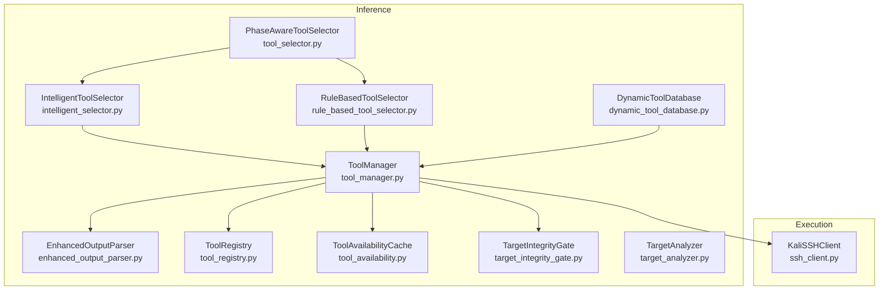
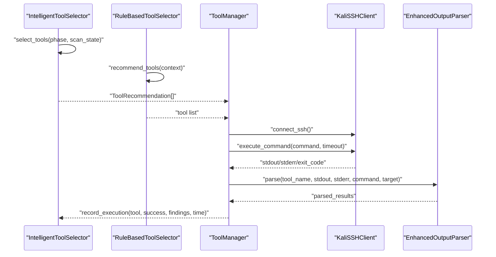
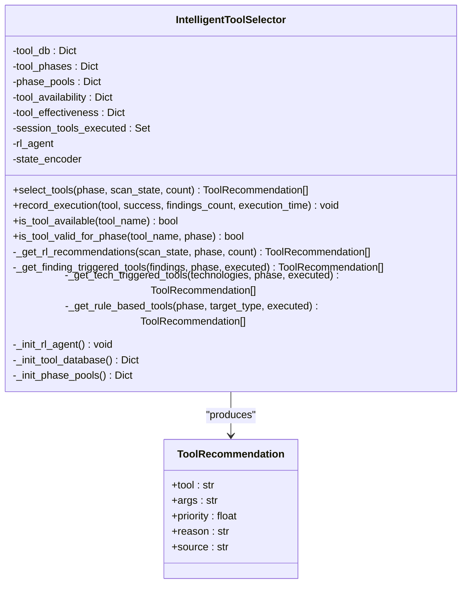
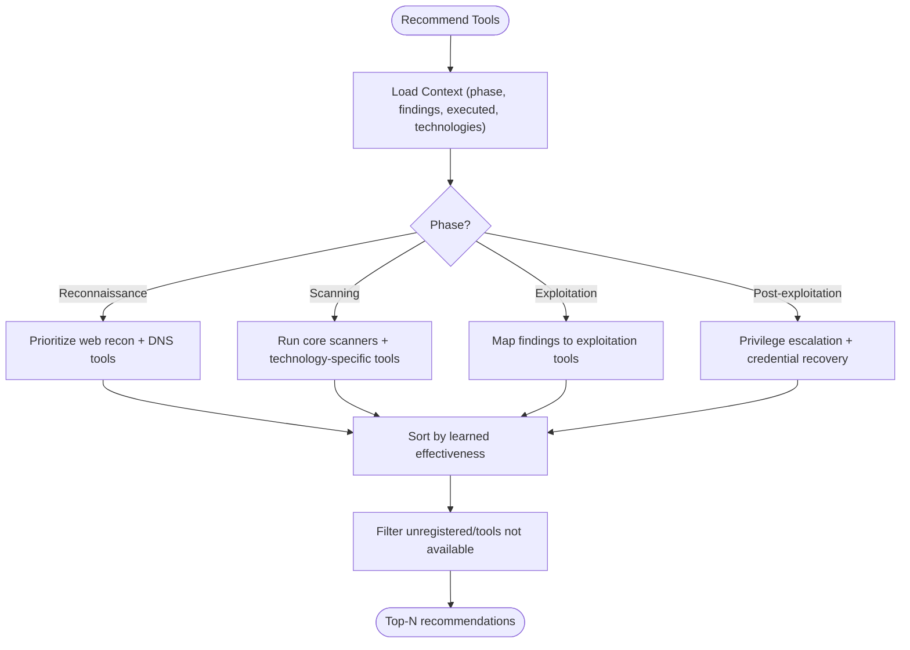
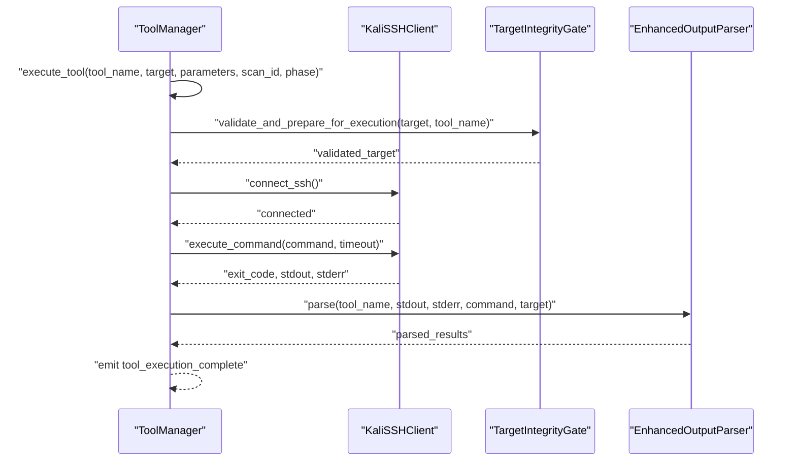
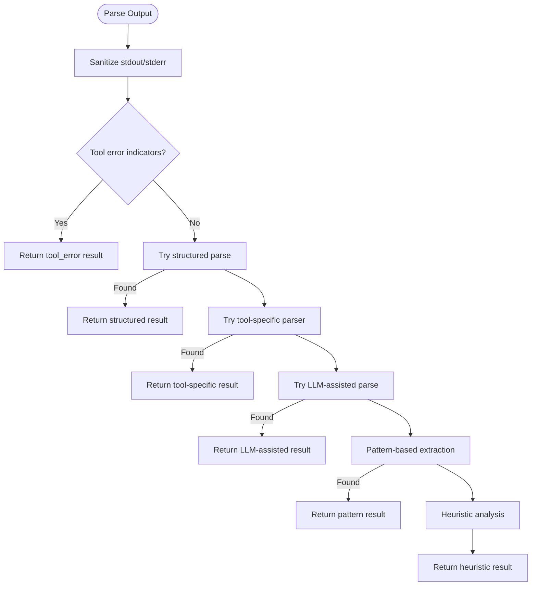
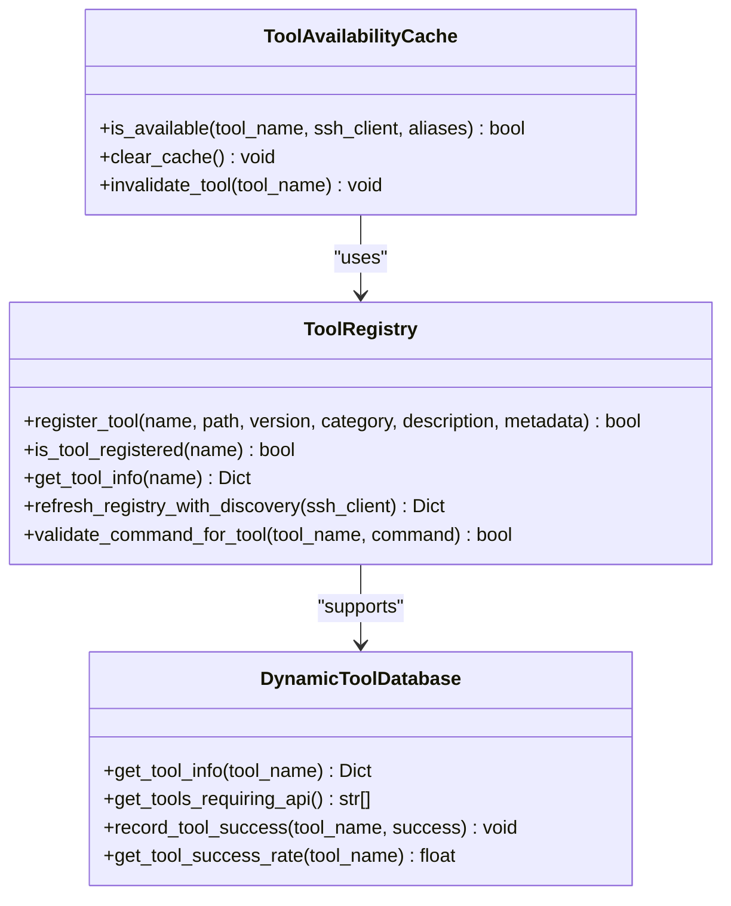
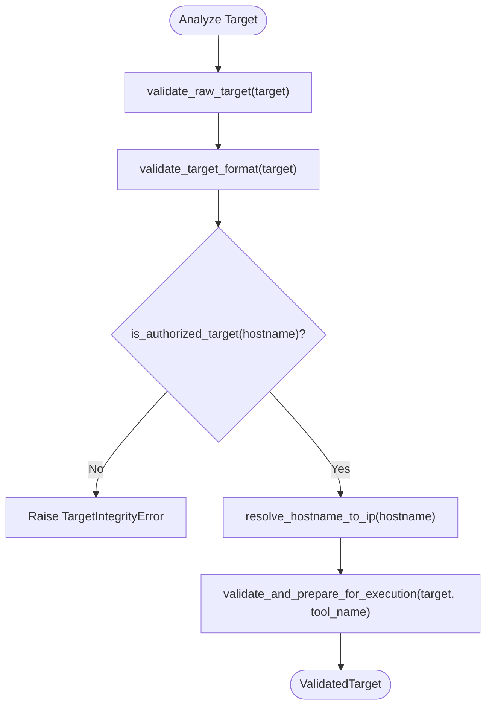
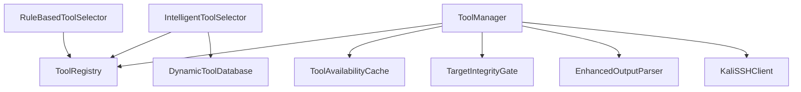

# Intelligent Tool Selection

<cite>
**Referenced Files in This Document**
- [intelligent_selector.py](file://backend/inference/intelligent_selector.py)
- [rule_based_tool_selector.py](file://backend/inference/rule_based_tool_selector.py)
- [tool_manager.py](file://backend/inference/tool_manager.py)
- [ssh_client.py](file://backend/execution/ssh_client.py)
- [enhanced_output_parser.py](file://backend/inference/enhanced_output_parser.py)
- [dynamic_tool_database.py](file://backend/inference/dynamic_tool_database.py)
- [tool_registry.py](file://backend/inference/tool_registry.py)
- [tool_availability.py](file://backend/inference/tool_availability.py)
- [target_integrity_gate.py](file://backend/inference/target_integrity_gate.py)
- [target_analyzer.py](file://backend/inference/target_analyzer.py)
- [tool_selector.py](file://backend/inference/tool_selector.py)
</cite>

## Table of Contents
1. [Introduction](#introduction)
2. [Project Structure](#project-structure)
3. [Core Components](#core-components)
4. [Architecture Overview](#architecture-overview)
5. [Detailed Component Analysis](#detailed-component-analysis)
6. [Dependency Analysis](#dependency-analysis)
7. [Performance Considerations](#performance-considerations)
8. [Troubleshooting Guide](#troubleshooting-guide)
9. [Conclusion](#conclusion)

## Introduction
This document describes the intelligent tool selection system that powers AI-driven security tool recommendations and executions. It explains how the intelligent selector blends machine learning models with rule-based logic, how the tool manager validates availability and orchestrates secure execution, and how the system integrates with the SSH client, output parsing, and result processing pipelines. The document also covers tool availability validation, execution timeouts, and error recovery procedures.

## Project Structure
The intelligent tool selection system spans several modules:
- Inference: intelligent selection, rule-based fallback, output parsing, tool registry, availability checks, target integrity, and orchestration helpers
- Execution: SSH client for remote tool execution
- Tools: hybrid tool system integration

**Diagram sources**
- [intelligent_selector.py](file://backend/inference/intelligent_selector.py#L33-L690)
- [rule_based_tool_selector.py](file://backend/inference/rule_based_tool_selector.py#L8-L448)
- [tool_manager.py](file://backend/inference/tool_manager.py#L49-L800)
- [ssh_client.py](file://backend/execution/ssh_client.py#L12-L216)
- [enhanced_output_parser.py](file://backend/inference/enhanced_output_parser.py#L60-L200)
- [dynamic_tool_database.py](file://backend/inference/dynamic_tool_database.py#L5-L441)
- [tool_registry.py](file://backend/inference/tool_registry.py#L18-L567)
- [tool_availability.py](file://backend/inference/tool_availability.py#L15-L165)
- [target_integrity_gate.py](file://backend/inference/target_integrity_gate.py#L19-L366)
- [target_analyzer.py](file://backend/inference/target_analyzer.py#L9-L81)
- [tool_selector.py](file://backend/inference/tool_selector.py#L26-L527)

**Section sources**
- [intelligent_selector.py](file://backend/inference/intelligent_selector.py#L1-L690)
- [rule_based_tool_selector.py](file://backend/inference/rule_based_tool_selector.py#L1-L448)
- [tool_manager.py](file://backend/inference/tool_manager.py#L1-L800)
- [ssh_client.py](file://backend/execution/ssh_client.py#L1-L216)
- [enhanced_output_parser.py](file://backend/inference/enhanced_output_parser.py#L1-L200)
- [dynamic_tool_database.py](file://backend/inference/dynamic_tool_database.py#L1-L441)
- [tool_registry.py](file://backend/inference/tool_registry.py#L1-L567)
- [tool_availability.py](file://backend/inference/tool_availability.py#L1-L165)
- [target_integrity_gate.py](file://backend/inference/target_integrity_gate.py#L1-L366)
- [target_analyzer.py](file://backend/inference/target_analyzer.py#L1-L81)
- [tool_selector.py](file://backend/inference/tool_selector.py#L1-L527)

## Core Components
- IntelligentToolSelector: Adaptive, multi-strategy tool selection combining a Deep RL agent, finding-triggered recommendations, technology-triggered suggestions, and rule-based fallback. It maintains tool effectiveness statistics, availability cache, and phase-aware tool pools.
- RuleBasedToolSelector: Deterministic, expert-system-based selector with learned effectiveness scoring, tool mappings, and phase-specific recommendations.
- ToolManager: Orchestrates tool execution via SSH, enforces safety gates, streams output, parses results, records outcomes, and manages timeouts and retries.
- KaliSSHClient: Robust SSH client with proper timeouts, keepalive, and streaming output handling for long-running tools.
- EnhancedOutputParser: Multi-strategy output parsing with structured, tool-specific, LLM-assisted, pattern-based, and heuristic approaches.
- DynamicToolDatabase: Comprehensive tool metadata and capability mapping used for execution planning and success tracking.
- ToolRegistry: Ground-truth registry ensuring only verified tools are executed, with discovery and validation routines.
- ToolAvailabilityCache: In-memory availability cache with TTL and registry-backed verification.
- TargetIntegrityGate: Validates targets and ensures only authorized, safe targets are used for execution.
- TargetAnalyzer: Builds target profiles for scanning strategy decisions.

**Section sources**
- [intelligent_selector.py](file://backend/inference/intelligent_selector.py#L33-L690)
- [rule_based_tool_selector.py](file://backend/inference/rule_based_tool_selector.py#L8-L448)
- [tool_manager.py](file://backend/inference/tool_manager.py#L49-L800)
- [ssh_client.py](file://backend/execution/ssh_client.py#L12-L216)
- [enhanced_output_parser.py](file://backend/inference/enhanced_output_parser.py#L60-L200)
- [dynamic_tool_database.py](file://backend/inference/dynamic_tool_database.py#L5-L441)
- [tool_registry.py](file://backend/inference/tool_registry.py#L18-L567)
- [tool_availability.py](file://backend/inference/tool_availability.py#L15-L165)
- [target_integrity_gate.py](file://backend/inference/target_integrity_gate.py#L19-L366)
- [target_analyzer.py](file://backend/inference/target_analyzer.py#L9-L81)

## Architecture Overview
The system follows a layered approach:
- Selection Layer: IntelligentToolSelector and RuleBasedToolSelector produce ranked recommendations.
- Orchestration Layer: ToolManager coordinates execution, safety validation, and output parsing.
- Execution Layer: KaliSSHClient runs tools remotely with robust timeout handling.
- Data Layer: ToolRegistry, ToolAvailabilityCache, DynamicToolDatabase, and EnhancedOutputParser support validation, availability, metadata, and parsing.

**Diagram sources**
- [intelligent_selector.py](file://backend/inference/intelligent_selector.py#L300-L383)
- [rule_based_tool_selector.py](file://backend/inference/rule_based_tool_selector.py#L147-L236)
- [tool_manager.py](file://backend/inference/tool_manager.py#L226-L630)
- [ssh_client.py](file://backend/execution/ssh_client.py#L87-L207)
- [enhanced_output_parser.py](file://backend/inference/enhanced_output_parser.py#L89-L200)

## Detailed Component Analysis

### Intelligent Tool Selector
The intelligent selector implements a multi-strategy recommendation pipeline:
- RL Agent: Encodes scan state, selects actions via a trained Deep RL agent, maps actions to tools, and ranks alternatives by Q-values.
- Finding-triggered: Scans findings for triggers and recommends tools that exploit discovered vulnerabilities.
- Technology-triggered: Detects technologies (e.g., WordPress, Drupal) and suggests specialized tools.
- Rule-based: Filters tools by phase and target type, applies weights and learned effectiveness, and deduplicates recommendations.
- Availability filtering: Ensures only registered tools are recommended.
- Effectiveness tracking: Updates per-tool statistics and session-level execution sets.

**Diagram sources**
- [intelligent_selector.py](file://backend/inference/intelligent_selector.py#L23-L690)

**Section sources**
- [intelligent_selector.py](file://backend/inference/intelligent_selector.py#L33-L690)

### Rule-Based Tool Selector
The rule-based selector provides deterministic recommendations:
- Phase-specific tool pools and mappings
- Learned effectiveness scoring from prior executions
- Attack response mapping to exploitation tools
- Availability filtering and optional learning-mode expansion

**Diagram sources**
- [rule_based_tool_selector.py](file://backend/inference/rule_based_tool_selector.py#L147-L448)

**Section sources**
- [rule_based_tool_selector.py](file://backend/inference/rule_based_tool_selector.py#L8-L448)

### Tool Manager and SSH Integration
ToolManager orchestrates secure, observable tool execution:
- SSH connectivity with retries, keepalive, and transport validation
- Target integrity gate validation and normalization
- Command safety validation and fallback execution
- Real-time streaming of stdout/stderr via WebSocket events
- Output parsing with EnhancedOutputParser
- Execution result recording and skill processing
- Dynamic timeout adjustment based on tool history

**Diagram sources**
- [tool_manager.py](file://backend/inference/tool_manager.py#L226-L630)
- [ssh_client.py](file://backend/execution/ssh_client.py#L87-L207)
- [target_integrity_gate.py](file://backend/inference/target_integrity_gate.py#L333-L354)
- [enhanced_output_parser.py](file://backend/inference/enhanced_output_parser.py#L89-L200)

**Section sources**
- [tool_manager.py](file://backend/inference/tool_manager.py#L49-L800)
- [ssh_client.py](file://backend/execution/ssh_client.py#L12-L216)
- [target_integrity_gate.py](file://backend/inference/target_integrity_gate.py#L19-L366)
- [enhanced_output_parser.py](file://backend/inference/enhanced_output_parser.py#L60-L200)

### Output Parsing Pipeline
EnhancedOutputParser implements a multi-strategy approach:
- Structured output detection (JSON/XML)
- Tool-specific parsers
- LLM-assisted parsing for complex outputs
- Pattern-based extraction with enhanced regex
- Heuristic analysis as a last resort

**Diagram sources**
- [enhanced_output_parser.py](file://backend/inference/enhanced_output_parser.py#L89-L200)

**Section sources**
- [enhanced_output_parser.py](file://backend/inference/enhanced_output_parser.py#L60-L200)

### Tool Availability and Registry
- ToolRegistry: Centralized, verified registry of tools with categories, metadata, and validation routines. Provides is_tool_registered and get_tool_info.
- ToolAvailabilityCache: In-memory cache with TTL backed by registry and discovery to minimize repeated checks.
- DynamicToolDatabase: Rich metadata for tools including capabilities, prerequisites, and output parsers.

**Diagram sources**
- [tool_registry.py](file://backend/inference/tool_registry.py#L18-L567)
- [tool_availability.py](file://backend/inference/tool_availability.py#L15-L165)
- [dynamic_tool_database.py](file://backend/inference/dynamic_tool_database.py#L5-L441)

**Section sources**
- [tool_registry.py](file://backend/inference/tool_registry.py#L18-L567)
- [tool_availability.py](file://backend/inference/tool_availability.py#L15-L165)
- [dynamic_tool_database.py](file://backend/inference/dynamic_tool_database.py#L5-L441)

### Target Analysis and Integrity
- TargetAnalyzer: Builds target profiles including type, technologies, risk level, and recommended strategy.
- TargetIntegrityGate: Validates raw targets, formats URLs/IPs, checks authorization, resolves hostnames, and prepares targets for tool execution.

**Diagram sources**
- [target_analyzer.py](file://backend/inference/target_analyzer.py#L12-L81)
- [target_integrity_gate.py](file://backend/inference/target_integrity_gate.py#L67-L354)

**Section sources**
- [target_analyzer.py](file://backend/inference/target_analyzer.py#L9-L81)
- [target_integrity_gate.py](file://backend/inference/target_integrity_gate.py#L19-L366)

## Dependency Analysis
Key dependencies and interactions:
- IntelligentToolSelector depends on ToolRegistry for availability checks and DynamicToolDatabase for metadata.
- ToolManager depends on ToolRegistry, ToolAvailabilityCache, TargetIntegrityGate, and EnhancedOutputParser.
- SSH client is reused across ToolManager and hybrid tool system integrations.
- Rule-based selector complements intelligent selector and can be used as a fallback.

**Diagram sources**
- [intelligent_selector.py](file://backend/inference/intelligent_selector.py#L641-L658)
- [tool_manager.py](file://backend/inference/tool_manager.py#L292-L395)
- [tool_registry.py](file://backend/inference/tool_registry.py#L191-L224)
- [tool_availability.py](file://backend/inference/tool_availability.py#L26-L53)
- [target_integrity_gate.py](file://backend/inference/target_integrity_gate.py#L333-L354)
- [enhanced_output_parser.py](file://backend/inference/enhanced_output_parser.py#L89-L200)
- [ssh_client.py](file://backend/execution/ssh_client.py#L12-L216)

**Section sources**
- [intelligent_selector.py](file://backend/inference/intelligent_selector.py#L641-L658)
- [tool_manager.py](file://backend/inference/tool_manager.py#L292-L395)
- [tool_registry.py](file://backend/inference/tool_registry.py#L191-L224)
- [tool_availability.py](file://backend/inference/tool_availability.py#L26-L53)
- [target_integrity_gate.py](file://backend/inference/target_integrity_gate.py#L333-L354)
- [enhanced_output_parser.py](file://backend/inference/enhanced_output_parser.py#L89-L200)
- [ssh_client.py](file://backend/execution/ssh_client.py#L12-L216)

## Performance Considerations
- Adaptive timeouts: ToolManager dynamically adjusts timeouts based on tool execution history and tool type, with per-tool caps for long-running tools.
- Output streaming: Real-time streaming reduces perceived latency and enables responsive UI updates.
- Availability caching: ToolAvailabilityCache minimizes repeated discovery checks with TTL-based invalidation.
- Effectiveness-driven selection: IntelligentToolSelector weights tools by learned success rates and effectiveness to reduce wasted execution time.
- Safety-first execution: TargetIntegrityGate and command validation prevent unintended or unsafe operations.

[No sources needed since this section provides general guidance]

## Troubleshooting Guide
Common issues and recovery steps:
- SSH connection failures: ToolManager retries up to configured attempts with increasing wait times; verify credentials and network connectivity.
- Tool not available: Use ToolRegistry.is_tool_registered to confirm; refresh registry with discovery if needed; fallback to alternatives via RuleBasedToolSelector mappings.
- Tool execution timeouts: Adjust per-tool timeouts in ToolManager; consider reducing verbosity or splitting tasks; verify target accessibility.
- Output parsing failures: EnhancedOutputParser falls back through strategies; check for tool error indicators and malformed outputs.
- Unauthorized targets: TargetIntegrityGate blocks non-authorized targets; ensure targets are in allowed patterns or private networks.

**Section sources**
- [tool_manager.py](file://backend/inference/tool_manager.py#L398-L427)
- [tool_availability.py](file://backend/inference/tool_availability.py#L139-L149)
- [target_integrity_gate.py](file://backend/inference/target_integrity_gate.py#L107-L154)
- [enhanced_output_parser.py](file://backend/inference/enhanced_output_parser.py#L110-L137)

## Conclusion
The intelligent tool selection system combines adaptive machine learning with deterministic rule-based logic to recommend optimal security tools for each phase and context. The ToolManager ensures secure, observable, and resilient execution via SSH, while the output parser transforms raw tool output into actionable findings. The registry, availability cache, and integrity gate maintain system safety and reliability. Together, these components deliver a robust, extensible platform for AI-powered security operations.