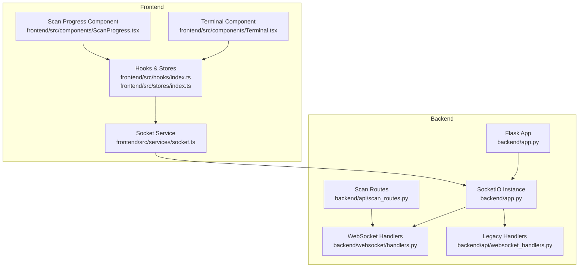
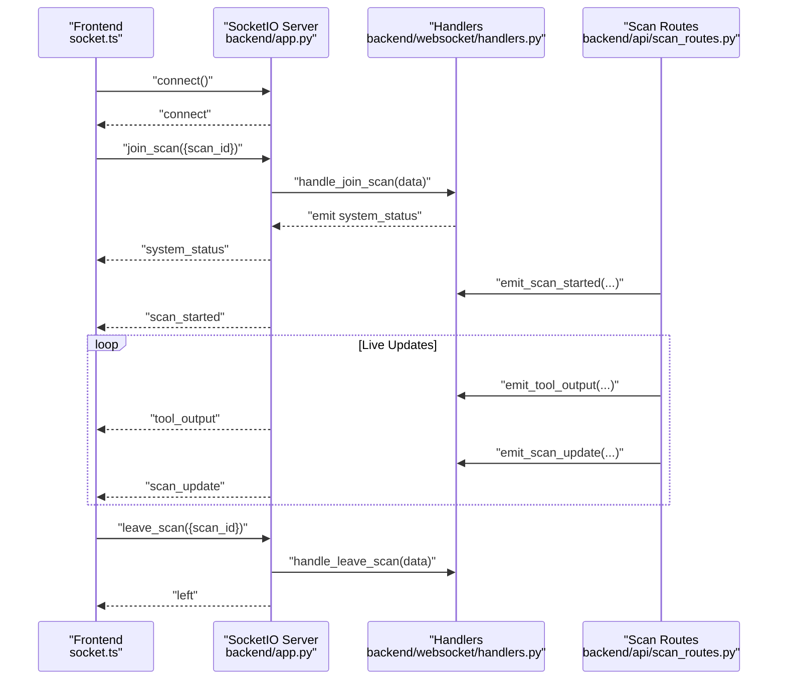
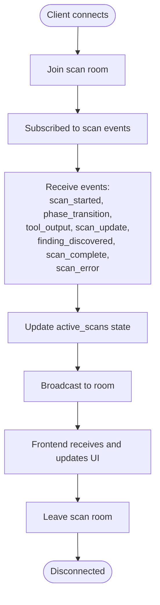
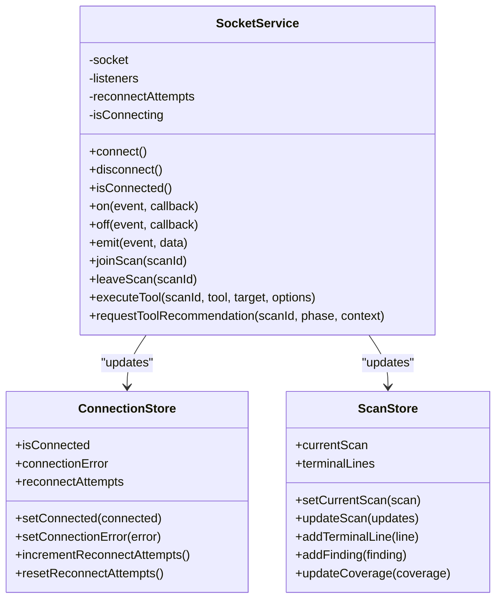
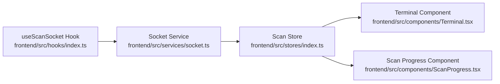
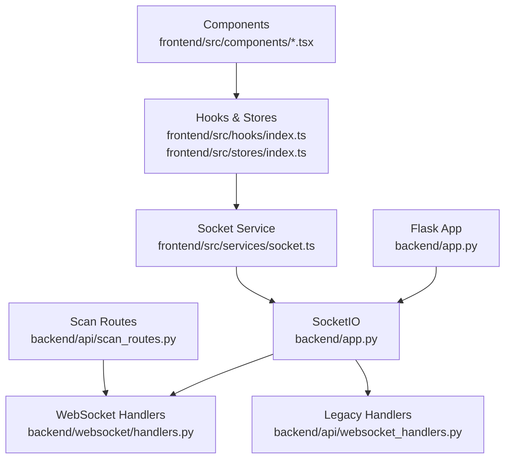

# Real-time Monitoring and Progress Tracking

<cite>
**Referenced Files in This Document**
- [app.py](file://backend/app.py)
- [websocket_handlers.py](file://backend/api/websocket_handlers.py)
- [handlers.py](file://backend/websocket/handlers.py)
- [scan_routes.py](file://backend/api/scan_routes.py)
- [socket.ts](file://frontend/src/services/socket.ts)
- [index.ts](file://frontend/src/hooks/index.ts)
- [index.ts](file://frontend/src/stores/index.ts)
- [Terminal.tsx](file://frontend/src/components/Terminal.tsx)
- [ScanProgress.tsx](file://frontend/src/components/ScanProgress.tsx)
- [index.ts](file://frontend/src/types/index.ts)
</cite>

## Table of Contents
1. [Introduction](#introduction)
2. [Project Structure](#project-structure)
3. [Core Components](#core-components)
4. [Architecture Overview](#architecture-overview)
5. [Detailed Component Analysis](#detailed-component-analysis)
6. [Dependency Analysis](#dependency-analysis)
7. [Performance Considerations](#performance-considerations)
8. [Troubleshooting Guide](#troubleshooting-guide)
9. [Conclusion](#conclusion)

## Introduction
This document explains the real-time monitoring system that powers bidirectional WebSocket communication between the backend and the React frontend dashboard. It covers how WebSocket handlers manage connection lifecycle, broadcast events, and stream live updates during scans. It also documents the event-driven architecture enabling live terminal output, scan status updates, and interactive controls, along with frontend integration patterns for receiving and displaying real-time data. Practical examples demonstrate connection establishment, event subscription, progress tracking, and error handling. Message formats, event types, and state synchronization mechanisms are detailed, alongside connection pooling, reconnection strategies, and performance optimization for high-frequency updates.

## Project Structure
The real-time monitoring system spans three primary areas:
- Backend Flask application with SocketIO integration and WebSocket event handlers
- Backend scan orchestration that emits structured events to rooms
- Frontend React services, hooks, stores, and components that subscribe to and render real-time updates

**Diagram sources**
- [app.py](file://backend/app.py#L151-L163)
- [handlers.py](file://backend/websocket/handlers.py#L26-L119)
- [websocket_handlers.py](file://backend/api/websocket_handlers.py#L9-L115)
- [scan_routes.py](file://backend/api/scan_routes.py#L40-L140)
- [socket.ts](file://frontend/src/services/socket.ts#L64-L237)
- [index.ts](file://frontend/src/hooks/index.ts#L16-L196)
- [index.ts](file://frontend/src/stores/index.ts#L47-L151)
- [Terminal.tsx](file://frontend/src/components/Terminal.tsx#L27-L180)
- [ScanProgress.tsx](file://frontend/src/components/ScanProgress.tsx#L44-L233)

**Section sources**
- [app.py](file://backend/app.py#L151-L163)
- [handlers.py](file://backend/websocket/handlers.py#L26-L119)
- [websocket_handlers.py](file://backend/api/websocket_handlers.py#L9-L115)
- [scan_routes.py](file://backend/api/scan_routes.py#L40-L140)
- [socket.ts](file://frontend/src/services/socket.ts#L64-L237)
- [index.ts](file://frontend/src/hooks/index.ts#L16-L196)
- [index.ts](file://frontend/src/stores/index.ts#L47-L151)
- [Terminal.tsx](file://frontend/src/components/Terminal.tsx#L27-L180)
- [ScanProgress.tsx](file://frontend/src/components/ScanProgress.tsx#L44-L233)

## Core Components
- Backend SocketIO configuration and global state
  - SocketIO initialization with threading, ping intervals, and CORS
  - Global shared state for active scans and scan history guarded by locks
- WebSocket handlers
  - Connection lifecycle: connect, disconnect, join/leave rooms
  - Interactive controls: execute tool, request tool recommendation
  - Event emitters: scan lifecycle, phase transitions, tool execution, findings, errors
- Frontend WebSocket service
  - Singleton service managing connection, reconnection, and event subscriptions
  - Room joining/leaving and emitting commands to backend
- Frontend hooks and stores
  - Connection store for connection state and reconnection attempts
  - Scan store for current scan state, findings, and terminal output
  - Hooks to subscribe to scan-specific events and update UI
- Frontend components
  - Terminal component rendering live output with filtering and export
  - Scan progress component visualizing scan phases and metrics

**Section sources**
- [app.py](file://backend/app.py#L151-L171)
- [handlers.py](file://backend/websocket/handlers.py#L26-L119)
- [handlers.py](file://backend/websocket/handlers.py#L122-L314)
- [websocket_handlers.py](file://backend/api/websocket_handlers.py#L9-L115)
- [socket.ts](file://frontend/src/services/socket.ts#L64-L237)
- [index.ts](file://frontend/src/hooks/index.ts#L16-L196)
- [index.ts](file://frontend/src/stores/index.ts#L47-L151)
- [Terminal.tsx](file://frontend/src/components/Terminal.tsx#L27-L180)
- [ScanProgress.tsx](file://frontend/src/components/ScanProgress.tsx#L44-L233)

## Architecture Overview
The system uses a room-based publish-subscribe model:
- Clients connect to the backend and optionally join a scan room identified by scan_id
- Backend emits events to the specific room, ensuring targeted delivery
- Frontend hooks subscribe to events and update local state and UI

**Diagram sources**
- [app.py](file://backend/app.py#L151-L163)
- [handlers.py](file://backend/websocket/handlers.py#L50-L81)
- [handlers.py](file://backend/websocket/handlers.py#L122-L293)
- [scan_routes.py](file://backend/api/scan_routes.py#L106-L134)
- [socket.ts](file://frontend/src/services/socket.ts#L207-L218)

**Section sources**
- [app.py](file://backend/app.py#L151-L163)
- [handlers.py](file://backend/websocket/handlers.py#L50-L81)
- [handlers.py](file://backend/websocket/handlers.py#L122-L293)
- [scan_routes.py](file://backend/api/scan_routes.py#L106-L134)
- [socket.ts](file://frontend/src/services/socket.ts#L207-L218)

## Detailed Component Analysis

### Backend SocketIO and Event Handlers
- Connection lifecycle
  - Tracks connected clients and rooms
  - Emits system status upon join/leave
- Room management
  - Join/leave rooms keyed by scan_id
  - Updates active scan client counters
- Interactive controls
  - Execute tool requests forwarded to scan manager
  - Tool recommendation requests handled via scan manager
- Event emitters
  - scan_started, phase_transition, tool_execution_start, tool_output, tool_execution_complete, finding_discovered, scan_complete, scan_error
  - Hybrid tool system events: tool_resolution, tool_executing, tool_blocked, tool_warning, tool_fallback

**Diagram sources**
- [handlers.py](file://backend/websocket/handlers.py#L26-L119)
- [handlers.py](file://backend/websocket/handlers.py#L122-L314)

**Section sources**
- [handlers.py](file://backend/websocket/handlers.py#L26-L119)
- [handlers.py](file://backend/websocket/handlers.py#L122-L314)

### Frontend WebSocket Service and Integration
- SocketService
  - Singleton managing connection, reconnection, and event subscriptions
  - Supports join/leave scan rooms and emits commands to backend
- Hooks
  - useSocket: manages connection state and error tracking
  - useScanSocket: subscribes to scan-specific events and updates stores
- Stores
  - Connection store: connection status, error, and reconnection attempts
  - Scan store: current scan, findings, terminal lines, and UI state
- Components
  - Terminal: renders live output with filtering and export
  - ScanProgress: visualizes scan phases and metrics

**Diagram sources**
- [socket.ts](file://frontend/src/services/socket.ts#L64-L237)
- [index.ts](file://frontend/src/hooks/index.ts#L16-L196)
- [index.ts](file://frontend/src/stores/index.ts#L47-L151)

**Section sources**
- [socket.ts](file://frontend/src/services/socket.ts#L64-L237)
- [index.ts](file://frontend/src/hooks/index.ts#L16-L196)
- [index.ts](file://frontend/src/stores/index.ts#L47-L151)

### Event-Driven Architecture and Message Formats
- Event categories and typical payloads
  - Connection: system_status, connect/disconnect
  - Scan lifecycle: scan_started, scan_update, scan_complete, scan_error
  - Phases: phase_transition
  - Tools: tool_execution_start, tool_output, tool_execution_complete, tool_error_output
  - Findings: finding_discovered
  - Hybrid tool system: tool_resolution, tool_executing, tool_blocked, tool_warning, tool_fallback
- Payload structure examples
  - scan_started: scan_id, target, config, timestamp, optional scan_state
  - scan_update: phase, status, coverage, time_elapsed, optional scan_state
  - tool_output: tool, output, stream, timestamp, optional scan_state
  - finding_discovered: finding, total_count, timestamp, optional scan_state
  - scan_error: scan_id, error, timestamp, optional scan_state
- Room-based delivery
  - All events are emitted to room "scan_{scan_id}"
  - Frontend joins the room upon receiving a scan_id

**Section sources**
- [handlers.py](file://backend/websocket/handlers.py#L122-L314)
- [index.ts](file://frontend/src/types/index.ts#L164-L204)

### Frontend Components for Real-time Display
- Terminal component
  - Renders terminalLines from scan store
  - Auto-scrolls to bottom, supports filtering, export, and expand/collapse
- ScanProgress component
  - Visualizes overall progress, current phase, elapsed time, coverage, findings, tools executed

**Diagram sources**
- [index.ts](file://frontend/src/stores/index.ts#L47-L151)
- [Terminal.tsx](file://frontend/src/components/Terminal.tsx#L27-L180)
- [ScanProgress.tsx](file://frontend/src/components/ScanProgress.tsx#L44-L233)
- [socket.ts](file://frontend/src/services/socket.ts#L64-L237)
- [index.ts](file://frontend/src/hooks/index.ts#L62-L196)

**Section sources**
- [Terminal.tsx](file://frontend/src/components/Terminal.tsx#L27-L180)
- [ScanProgress.tsx](file://frontend/src/components/ScanProgress.tsx#L44-L233)
- [index.ts](file://frontend/src/stores/index.ts#L47-L151)

### Practical Examples

#### Connection Establishment
- Backend
  - SocketIO configured with threading and ping intervals
  - Handlers registered to manage connections and rooms
- Frontend
  - SocketService.connect() initializes connection with transports websocket/polling
  - useSocket hook listens to connect/disconnect/connect_error and updates connection store

**Section sources**
- [app.py](file://backend/app.py#L151-L163)
- [handlers.py](file://backend/websocket/handlers.py#L26-L81)
- [socket.ts](file://frontend/src/services/socket.ts#L83-L106)
- [index.ts](file://frontend/src/hooks/index.ts#L16-L56)

#### Event Subscription and Progress Tracking
- Frontend
  - useScanSocket(scanId) joins the room and subscribes to scan events
  - Updates scan store and terminal lines in real-time
- Backend
  - Handlers emit events to the room and include optional scan_state for context

**Section sources**
- [index.ts](file://frontend/src/hooks/index.ts#L62-L196)
- [handlers.py](file://backend/websocket/handlers.py#L122-L293)

#### Interactive Control Capabilities
- Frontend
  - executeTool(scanId, tool, target, options) emits to backend
  - requestToolRecommendation(scanId, phase, context) requests AI-driven recommendations
- Backend
  - Handlers forward requests to scan manager and emit tool-related events

**Section sources**
- [socket.ts](file://frontend/src/services/socket.ts#L223-L232)
- [handlers.py](file://backend/websocket/handlers.py#L82-L114)

#### Error Handling
- Frontend
  - Connection errors tracked in connection store
  - scan_error events update UI and trigger notifications
- Backend
  - Error events emitted with scan_id and error message

**Section sources**
- [index.ts](file://frontend/src/hooks/index.ts#L150-L163)
- [handlers.py](file://backend/websocket/handlers.py#L277-L293)

## Dependency Analysis
The real-time monitoring system relies on:
- Flask-SocketIO for bidirectional communication and room-based messaging
- Zustand stores for frontend state management
- React hooks for lifecycle and event subscription
- Room-based event distribution to ensure targeted updates

**Diagram sources**
- [app.py](file://backend/app.py#L151-L163)
- [handlers.py](file://backend/websocket/handlers.py#L26-L119)
- [websocket_handlers.py](file://backend/api/websocket_handlers.py#L9-L115)
- [scan_routes.py](file://backend/api/scan_routes.py#L40-L140)
- [socket.ts](file://frontend/src/services/socket.ts#L64-L237)
- [index.ts](file://frontend/src/hooks/index.ts#L16-L196)
- [index.ts](file://frontend/src/stores/index.ts#L47-L151)

**Section sources**
- [app.py](file://backend/app.py#L151-L163)
- [handlers.py](file://backend/websocket/handlers.py#L26-L119)
- [websocket_handlers.py](file://backend/api/websocket_handlers.py#L9-L115)
- [scan_routes.py](file://backend/api/scan_routes.py#L40-L140)
- [socket.ts](file://frontend/src/services/socket.ts#L64-L237)
- [index.ts](file://frontend/src/hooks/index.ts#L16-L196)
- [index.ts](file://frontend/src/stores/index.ts#L47-L151)

## Performance Considerations
- Connection pooling and transport
  - Prefer WebSocket transport with polling fallback for reliability
  - Configure ping intervals and timeouts to detect stale connections
- Event frequency and batching
  - Tool output events can be frequent; consider throttling or batching in high-throughput scenarios
  - Limit terminal line buffer size to prevent memory growth
- Room scalability
  - Rooms scale horizontally; ensure room naming conventions remain consistent
- Backend concurrency
  - Threading mode allows concurrent event emission; guard shared state with locks
- Frontend rendering
  - Use virtualization for large terminal outputs
  - Debounce UI updates when aggregating many small events

[No sources needed since this section provides general guidance]

## Troubleshooting Guide
- Connection issues
  - Verify backend SocketIO configuration and CORS settings
  - Check frontend transport selection and network connectivity
  - Inspect connection store for error messages and reconnection attempts
- Room subscription problems
  - Ensure join_scan is called with the correct scan_id
  - Confirm room names match "scan_{scan_id}" across backend and frontend
- Event delivery failures
  - Validate event emitter calls and room targeting
  - Check for missing scan_state in emitted events when frontend expects it
- Frontend rendering stalls
  - Review terminal line limits and auto-scroll logic
  - Verify store updates are triggered by received events

**Section sources**
- [app.py](file://backend/app.py#L151-L163)
- [handlers.py](file://backend/websocket/handlers.py#L50-L81)
- [handlers.py](file://backend/websocket/handlers.py#L122-L293)
- [socket.ts](file://frontend/src/services/socket.ts#L83-L106)
- [index.ts](file://frontend/src/hooks/index.ts#L16-L56)
- [index.ts](file://frontend/src/stores/index.ts#L132-L147)

## Conclusion
The real-time monitoring system leverages a robust room-based event architecture to deliver live scan updates, terminal output, and interactive controls. The backend’s SocketIO integration and event emitters work in tandem with the frontend’s reactive stores and components to provide a responsive, scalable monitoring experience. By following the documented patterns for connection, subscription, and state synchronization, developers can extend and maintain the system effectively while optimizing for performance under high-frequency updates.