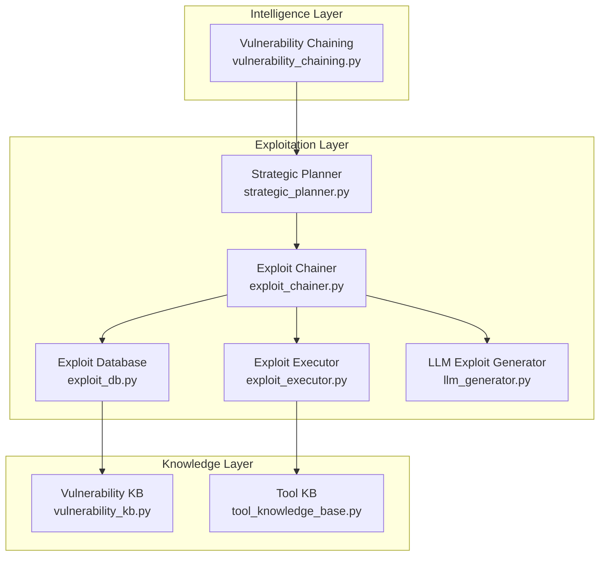
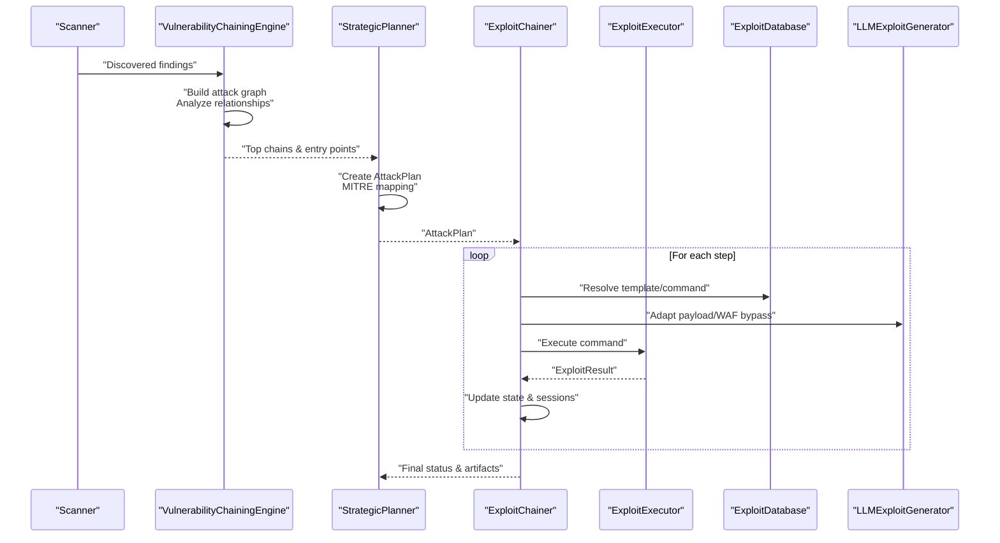
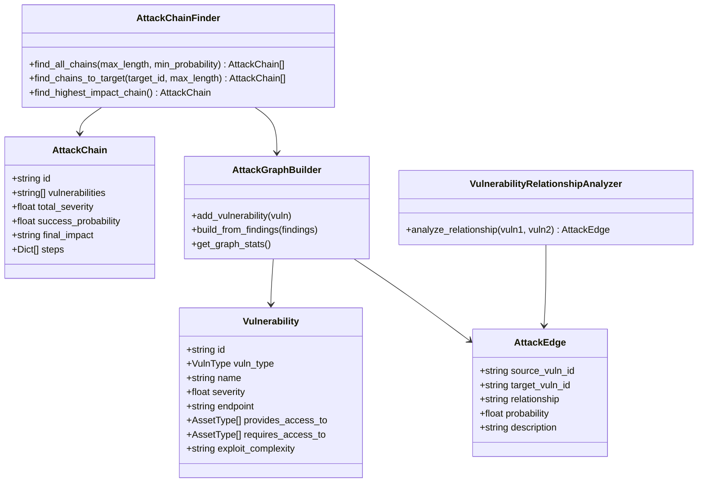
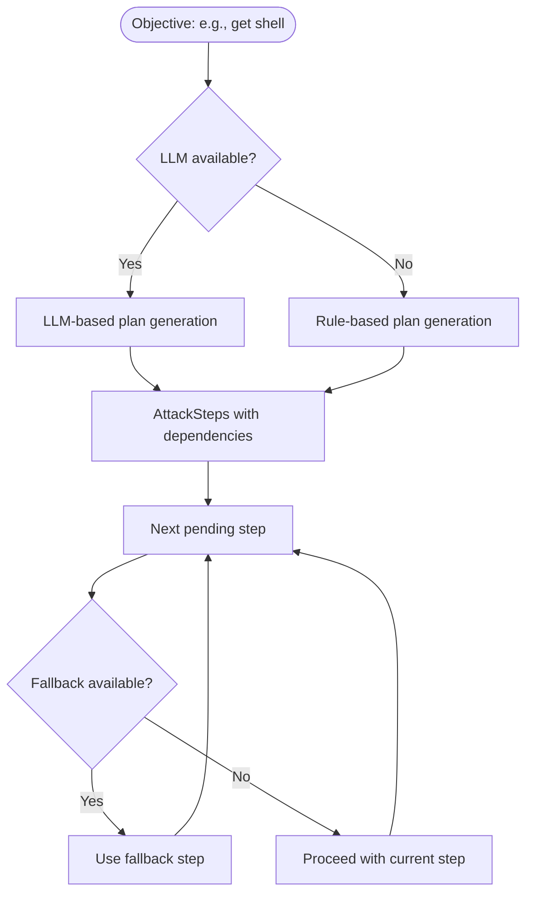
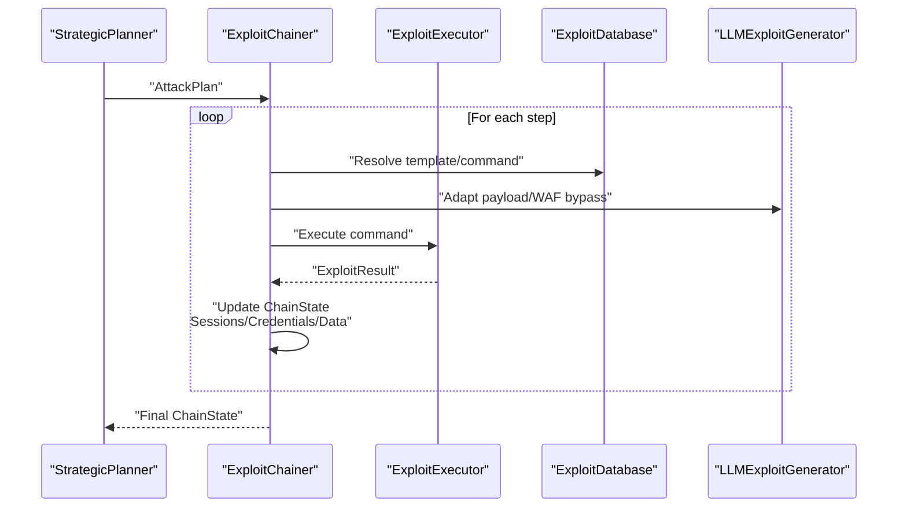
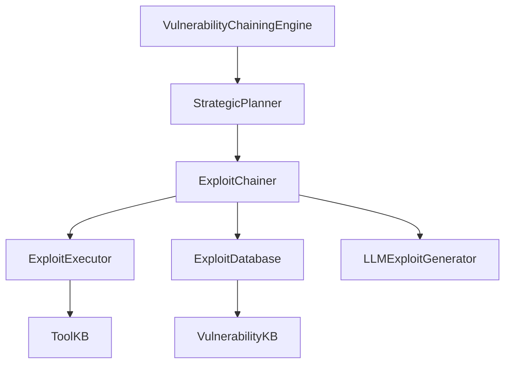

# Vulnerability Chaining and Advanced Exploitation

<cite>
**Referenced Files in This Document**
- [vulnerability_chaining.py](file://backend/intelligence/vulnerability_chaining.py)
- [exploit_chainer.py](file://backend/exploitation/exploit_chainer.py)
- [strategic_planner.py](file://backend/exploitation/strategic_planner.py)
- [vulnerability_kb.py](file://backend/knowledge/vulnerability_kb.py)
- [exploit_executor.py](file://backend/exploitation/exploit_executor.py)
- [exploit_db.py](file://backend/exploitation/exploit_db.py)
- [llm_generator.py](file://backend/exploitation/llm_generator.py)
- [tool_knowledge_base.py](file://backend/inference/tool_knowledge_base.py)
- [test_scenarios.py](file://backend/exploitation/test_scenarios.py)
</cite>

## Table of Contents
1. [Introduction](#introduction)
2. [Project Structure](#project-structure)
3. [Core Components](#core-components)
4. [Architecture Overview](#architecture-overview)
5. [Detailed Component Analysis](#detailed-component-analysis)
6. [Dependency Analysis](#dependency-analysis)
7. [Performance Considerations](#performance-considerations)
8. [Troubleshooting Guide](#troubleshooting-guide)
9. [Conclusion](#conclusion)

## Introduction
This document describes the vulnerability chaining system that coordinates multiple vulnerabilities to achieve higher-level objectives such as privilege escalation or lateral movement. It explains the implementation of the vulnerability chaining algorithm, the strategic planner’s role in multi-step exploitation, and the knowledge base integration that provides contextual information about vulnerability relationships and exploitation prerequisites. The document also covers integration with the exploitation system, tool management, and intelligence layers, along with safety considerations, coverage tracking, and adaptive strategy adjustment based on real-time feedback.

## Project Structure
The vulnerability chaining system spans several backend modules:
- Intelligence layer: vulnerability relationship modeling and attack graph construction
- Exploitation layer: strategic planning, exploit execution, and chain orchestration
- Knowledge layer: vulnerability and tool knowledge bases
- Inference layer: dynamic command generation and LLM-based generation

**Diagram sources**
- [vulnerability_chaining.py](file://backend/intelligence/vulnerability_chaining.py#L130-L312)
- [strategic_planner.py](file://backend/exploitation/strategic_planner.py#L181-L316)
- [exploit_chainer.py](file://backend/exploitation/exploit_chainer.py#L256-L462)
- [exploit_executor.py](file://backend/exploitation/exploit_executor.py#L106-L152)
- [exploit_db.py](file://backend/exploitation/exploit_db.py#L186-L228)
- [llm_generator.py](file://backend/exploitation/llm_generator.py#L93-L137)
- [vulnerability_kb.py](file://backend/knowledge/vulnerability_kb.py#L6-L52)
- [tool_knowledge_base.py](file://backend/inference/tool_knowledge_base.py#L10-L16)

**Section sources**
- [vulnerability_chaining.py](file://backend/intelligence/vulnerability_chaining.py#L1-L940)
- [exploit_chainer.py](file://backend/exploitation/exploit_chainer.py#L1-L865)
- [strategic_planner.py](file://backend/exploitation/strategic_planner.py#L1-L662)
- [vulnerability_kb.py](file://backend/knowledge/vulnerability_kb.py#L1-L348)
- [exploit_executor.py](file://backend/exploitation/exploit_executor.py#L1-L729)
- [exploit_db.py](file://backend/exploitation/exploit_db.py#L1-L944)
- [llm_generator.py](file://backend/exploitation/llm_generator.py#L1-L833)
- [tool_knowledge_base.py](file://backend/inference/tool_knowledge_base.py#L1-L1254)

## Core Components
- Vulnerability Chaining Engine: constructs attack graphs from scan findings, analyzes relationships, and discovers exploitable chains.
- Strategic Planner: decomposes objectives into actionable steps, maps to MITRE ATT&CK, and generates attack plans with fallbacks.
- Exploit Chainer: orchestrates multi-step chains, maintains state, adapts on failure, and integrates with tool management.
- Exploit Executor: safely executes commands, validates safety, parses results, and extracts artifacts.
- Exploit Database: template-driven mapping of vulnerabilities to executable commands.
- LLM Exploit Generator: generates custom payloads, adapts for WAF bypass, and designs attack chains.
- Knowledge Bases: vulnerability and tool knowledge for remediation, exploitation techniques, and adaptive command generation.

**Section sources**
- [vulnerability_chaining.py](file://backend/intelligence/vulnerability_chaining.py#L660-L719)
- [strategic_planner.py](file://backend/exploitation/strategic_planner.py#L181-L316)
- [exploit_chainer.py](file://backend/exploitation/exploit_chainer.py#L256-L462)
- [exploit_executor.py](file://backend/exploitation/exploit_executor.py#L106-L152)
- [exploit_db.py](file://backend/exploitation/exploit_db.py#L186-L228)
- [llm_generator.py](file://backend/exploitation/llm_generator.py#L93-L137)
- [vulnerability_kb.py](file://backend/knowledge/vulnerability_kb.py#L6-L52)
- [tool_knowledge_base.py](file://backend/inference/tool_knowledge_base.py#L10-L16)

## Architecture Overview
The system coordinates vulnerability discovery, chaining, planning, and execution with safety and adaptivity.

**Diagram sources**
- [vulnerability_chaining.py](file://backend/intelligence/vulnerability_chaining.py#L680-L719)
- [strategic_planner.py](file://backend/exploitation/strategic_planner.py#L266-L316)
- [exploit_chainer.py](file://backend/exploitation/exploit_chainer.py#L345-L462)
- [exploit_executor.py](file://backend/exploitation/exploit_executor.py#L240-L357)
- [exploit_db.py](file://backend/exploitation/exploit_db.py#L186-L228)
- [llm_generator.py](file://backend/exploitation/llm_generator.py#L294-L356)

## Detailed Component Analysis

### Vulnerability Chaining Engine
The engine builds an attack graph from scan findings, analyzes relationships between vulnerabilities, and discovers exploitable chains. It classifies vulnerabilities, defines asset and type relationships, and computes chain effectiveness.

**Diagram sources**
- [vulnerability_chaining.py](file://backend/intelligence/vulnerability_chaining.py#L74-L128)
- [vulnerability_chaining.py](file://backend/intelligence/vulnerability_chaining.py#L130-L312)
- [vulnerability_chaining.py](file://backend/intelligence/vulnerability_chaining.py#L449-L658)

Key implementation highlights:
- Relationship analysis adjusts probabilities based on exploit complexity and authentication requirements.
- Asset-based and endpoint-based pivoting enable realistic chain extensions.
- Chain scoring balances total severity and success probability, with diminishing returns for later steps.

**Section sources**
- [vulnerability_chaining.py](file://backend/intelligence/vulnerability_chaining.py#L130-L312)
- [vulnerability_chaining.py](file://backend/intelligence/vulnerability_chaining.py#L449-L658)

### Strategic Planner
The planner translates high-level objectives into actionable steps, aligning with MITRE ATT&CK and incorporating fallback strategies. It supports both LLM-based and rule-based planning.

**Diagram sources**
- [strategic_planner.py](file://backend/exploitation/strategic_planner.py#L266-L316)
- [strategic_planner.py](file://backend/exploitation/strategic_planner.py#L317-L347)
- [strategic_planner.py](file://backend/exploitation/strategic_planner.py#L387-L494)

Key implementation highlights:
- MITRE technique mapping and tool mappings guide step selection.
- Dependencies and fallback steps ensure resilience.
- Adaptive planning generates alternatives when steps fail.

**Section sources**
- [strategic_planner.py](file://backend/exploitation/strategic_planner.py#L181-L316)
- [strategic_planner.py](file://backend/exploitation/strategic_planner.py#L387-L494)
- [strategic_planner.py](file://backend/exploitation/strategic_planner.py#L543-L576)

### Exploit Chainer
The chainer orchestrates multi-step chains, manages state, handles failures with automatic fallbacks, and tracks sessions and credentials across steps.

**Diagram sources**
- [exploit_chainer.py](file://backend/exploitation/exploit_chainer.py#L345-L462)
- [exploit_executor.py](file://backend/exploitation/exploit_executor.py#L240-L357)
- [exploit_db.py](file://backend/exploitation/exploit_db.py#L186-L228)
- [llm_generator.py](file://backend/exploitation/llm_generator.py#L294-L356)

Key implementation highlights:
- ChainState tracks sessions, credentials, extracted data, and environment.
- Automatic fallbacks and retries improve robustness.
- Real-time callbacks enable monitoring and event-driven reactions.

**Section sources**
- [exploit_chainer.py](file://backend/exploitation/exploit_chainer.py#L256-L462)
- [exploit_chainer.py](file://backend/exploitation/exploit_chainer.py#L463-L519)
- [exploit_chainer.py](file://backend/exploitation/exploit_chainer.py#L712-L734)

### Exploit Executor
The executor safely executes exploits with validation, sandbox testing where possible, result parsing, and feedback for learning.

Key implementation highlights:
- Safety validation blocks destructive patterns; WAF detection triggers blocking status.
- Pattern-based extraction detects shells, credentials, databases, and files.
- Recommendations guide next actions based on results.

**Section sources**
- [exploit_executor.py](file://backend/exploitation/exploit_executor.py#L106-L152)
- [exploit_executor.py](file://backend/exploitation/exploit_executor.py#L394-L415)
- [exploit_executor.py](file://backend/exploitation/exploit_executor.py#L416-L534)
- [exploit_executor.py](file://backend/exploitation/exploit_executor.py#L535-L620)

### Exploit Database
The database maps vulnerabilities to executable templates, enabling rapid command generation and execution.

Key implementation highlights:
- Templates include categories, complexity, reliability, and success/failure indicators.
- Fast lookup by CVE, service, category, and tool.
- Default templates cover common vulnerabilities and attack vectors.

**Section sources**
- [exploit_db.py](file://backend/exploitation/exploit_db.py#L186-L228)
- [exploit_db.py](file://backend/exploitation/exploit_db.py#L296-L771)

### LLM Exploit Generator
The LLM generator creates custom exploit code, adapts payloads for WAF bypass, designs attack chains, and produces privilege escalation scripts.

Key implementation highlights:
- Structured prompts for exploit code, payload adaptation, WAF bypass, attack chains, and persistence.
- Confidence scoring and warning generation for generated artifacts.
- Integration with Ollama client for code-focused models.

**Section sources**
- [llm_generator.py](file://backend/exploitation/llm_generator.py#L93-L137)
- [llm_generator.py](file://backend/exploitation/llm_generator.py#L205-L244)
- [llm_generator.py](file://backend/exploitation/llm_generator.py#L245-L293)
- [llm_generator.py](file://backend/exploitation/llm_generator.py#L294-L356)

### Knowledge Bases
- Vulnerability Knowledge Base: central repository for exploitation techniques, reproduction templates, remediation knowledge, and tool performance tracking.
- Tool Knowledge Base: dynamic command generation with parameter effectiveness learning and context-aware templates.

Key implementation highlights:
- Vulnerability KB provides exploitation techniques, remediation guidance, and performance tracking.
- Tool KB adapts commands based on scan context, conditions, and learned parameter effectiveness.

**Section sources**
- [vulnerability_kb.py](file://backend/knowledge/vulnerability_kb.py#L6-L52)
- [vulnerability_kb.py](file://backend/knowledge/vulnerability_kb.py#L231-L248)
- [tool_knowledge_base.py](file://backend/inference/tool_knowledge_base.py#L10-L16)
- [tool_knowledge_base.py](file://backend/inference/tool_knowledge_base.py#L17-L55)

## Dependency Analysis
The modules exhibit clear separation of concerns with well-defined interfaces and dependencies.

**Diagram sources**
- [vulnerability_chaining.py](file://backend/intelligence/vulnerability_chaining.py#L680-L719)
- [strategic_planner.py](file://backend/exploitation/strategic_planner.py#L266-L316)
- [exploit_chainer.py](file://backend/exploitation/exploit_chainer.py#L345-L462)
- [exploit_executor.py](file://backend/exploitation/exploit_executor.py#L106-L152)
- [exploit_db.py](file://backend/exploitation/exploit_db.py#L186-L228)
- [llm_generator.py](file://backend/exploitation/llm_generator.py#L93-L137)
- [vulnerability_kb.py](file://backend/knowledge/vulnerability_kb.py#L6-L52)
- [tool_knowledge_base.py](file://backend/inference/tool_knowledge_base.py#L10-L16)

**Section sources**
- [vulnerability_chaining.py](file://backend/intelligence/vulnerability_chaining.py#L680-L719)
- [exploit_chainer.py](file://backend/exploitation/exploit_chainer.py#L281-L313)

## Performance Considerations
- Chain search complexity: The chain finder performs recursive exploration with pruning by probability thresholds and cycle avoidance. Consider limiting max chain length and min probability to control runtime.
- Template resolution: Exploit database lookups are indexed by CVE/service/category/tool for fast retrieval.
- LLM generation: Generation requests can be expensive; cache results and reuse prompts for similar scenarios.
- Executor safety: Regex-based safety checks prevent destructive commands; tune patterns for target environments.
- State management: ChainState updates incrementally; ensure efficient storage and serialization for long-running chains.

[No sources needed since this section provides general guidance]

## Troubleshooting Guide
Common issues and resolutions:
- Detection by WAF/IPS: The executor detects WAF signatures and marks results as blocked; switch to WAF bypass techniques or reduce aggressiveness.
- Execution timeouts: Increase timeouts or reduce scan intensity; verify target connectivity and network path.
- Safety violations: Review command patterns flagged by safety validators; remove destructive or unsafe patterns.
- Missing credentials/data: Use extraction patterns and enumeration steps; verify success indicators and adjust payloads.
- Chain failures: ExploitChainer applies fallbacks and retries; StrategicPlanner can generate alternative steps.

**Section sources**
- [exploit_executor.py](file://backend/exploitation/exploit_executor.py#L429-L450)
- [exploit_executor.py](file://backend/exploitation/exploit_executor.py#L336-L357)
- [exploit_executor.py](file://backend/exploitation/exploit_executor.py#L394-L415)
- [exploit_chainer.py](file://backend/exploitation/exploit_chainer.py#L424-L442)
- [strategic_planner.py](file://backend/exploitation/strategic_planner.py#L560-L576)

## Conclusion
The vulnerability chaining system integrates intelligence, planning, and execution to coordinate multi-vulnerability exploitation. By modeling relationships, generating adaptive plans, and orchestrating resilient chains with safety and feedback loops, the system achieves higher-impact outcomes such as privilege escalation and lateral movement. The knowledge bases and LLM capabilities further enhance adaptivity and coverage, while tool management ensures practical command generation aligned with target configurations.