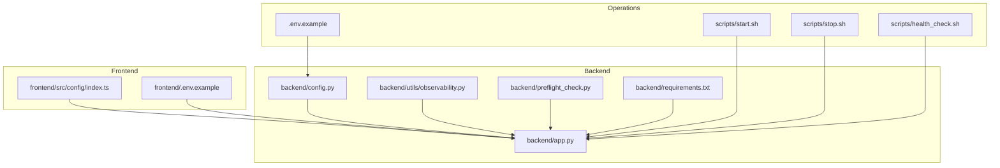
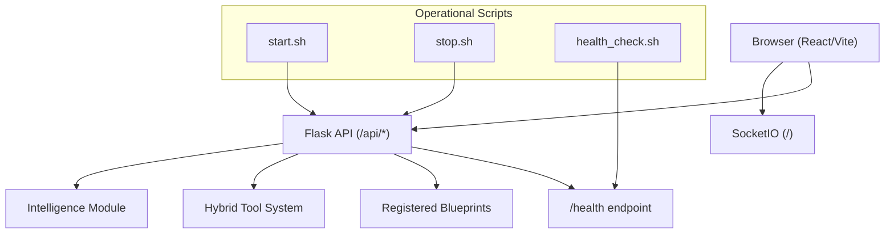
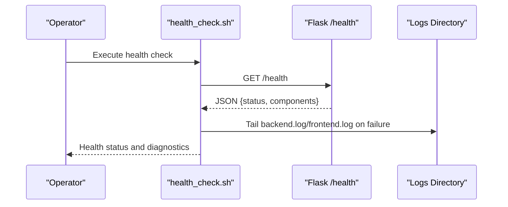
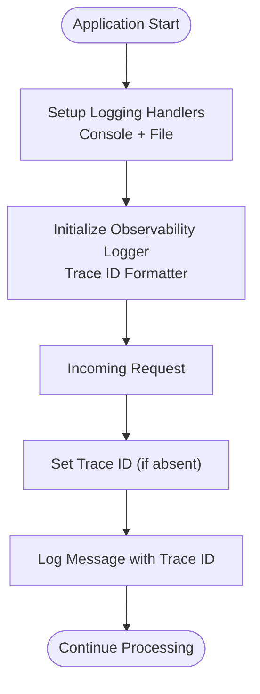
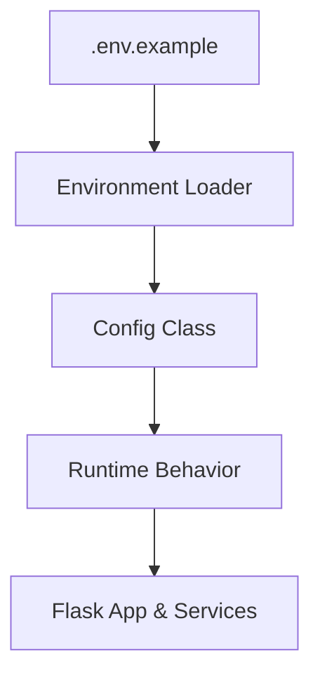
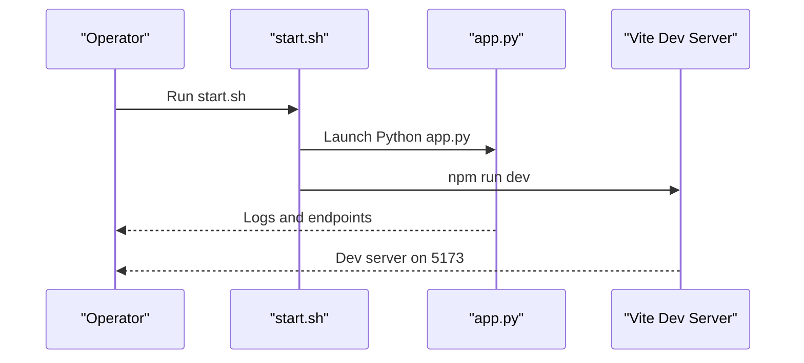
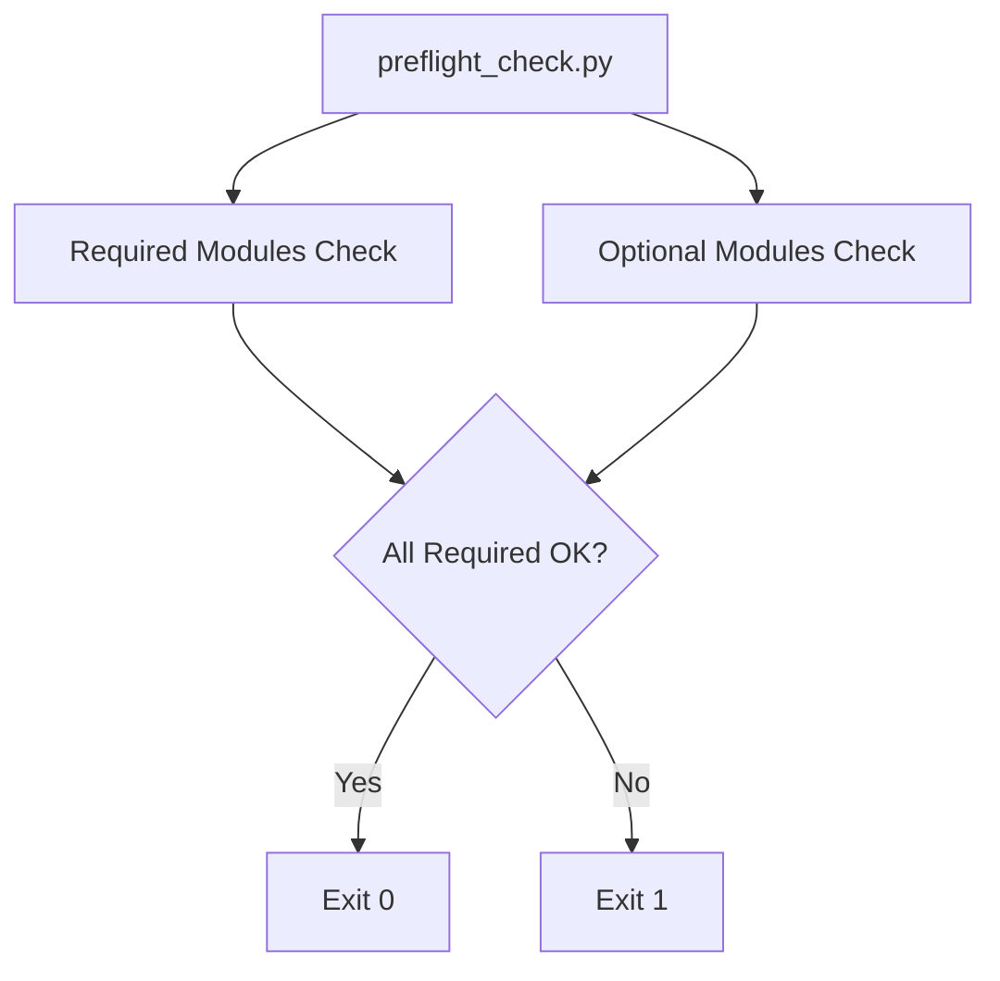
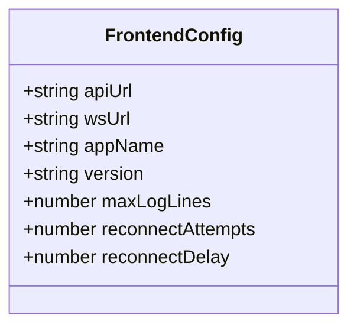
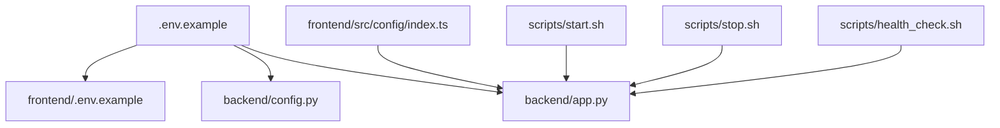

# Deployment and Operations

<cite>
**Referenced Files in This Document**
- [backend/app.py](file://backend/app.py)
- [backend/preflight_check.py](file://backend/preflight_check.py)
- [backend/config.py](file://backend/config.py)
- [backend/utils/observability.py](file://backend/utils/observability.py)
- [backend/requirements.txt](file://backend/requirements.txt)
- [scripts/start.sh](file://scripts/start.sh)
- [scripts/stop.sh](file://scripts/stop.sh)
- [scripts/health_check.sh](file://scripts/health_check.sh)
- [.env.example](file://.env.example)
- [frontend/src/config/index.ts](file://frontend/src/config/index.ts)
- [frontend/.env.example](file://frontend/.env.example)
- [README.md](file://README.md)
</cite>

## Table of Contents
1. [Introduction](#introduction)
2. [Project Structure](#project-structure)
3. [Core Components](#core-components)
4. [Architecture Overview](#architecture-overview)
5. [Detailed Component Analysis](#detailed-component-analysis)
6. [Dependency Analysis](#dependency-analysis)
7. [Performance Considerations](#performance-considerations)
8. [Troubleshooting Guide](#troubleshooting-guide)
9. [Conclusion](#conclusion)
10. [Appendices](#appendices)

## Introduction
This document provides a comprehensive guide to deploying and operating the Optimus platform in production. It covers production configuration management, environment setup across deployment scenarios, scaling considerations, health check systems, log management, and performance monitoring. The content is grounded in the repository’s actual implementation and includes practical examples for automation, monitoring configuration, and maintenance procedures. Terminology aligns with the codebase, including “preflight check,” “health check,” and “production deployment.”

## Project Structure
Optimus follows a layered architecture with a Python Flask backend, a React/Vite frontend, and supporting scripts for lifecycle management. The backend initializes logging, registers API blueprints, sets up WebSocket communication, and exposes a health endpoint. Configuration is managed via environment variables loaded from .env files, while deployment automation is handled by shell scripts.

**Diagram sources**
- [backend/app.py](file://backend/app.py#L1-L343)
- [backend/config.py](file://backend/config.py#L1-L115)
- [backend/utils/observability.py](file://backend/utils/observability.py#L1-L269)
- [backend/preflight_check.py](file://backend/preflight_check.py#L1-L81)
- [backend/requirements.txt](file://backend/requirements.txt#L1-L49)
- [scripts/start.sh](file://scripts/start.sh#L1-L53)
- [scripts/stop.sh](file://scripts/stop.sh#L1-L41)
- [scripts/health_check.sh](file://scripts/health_check.sh#L1-L63)
- [.env.example](file://.env.example#L1-L77)
- [frontend/src/config/index.ts](file://frontend/src/config/index.ts#L1-L67)
- [frontend/.env.example](file://frontend/.env.example#L1-L10)

**Section sources**
- [README.md](file://README.md#L1-L96)
- [backend/app.py](file://backend/app.py#L1-L343)
- [backend/config.py](file://backend/config.py#L1-L115)
- [scripts/start.sh](file://scripts/start.sh#L1-L53)
- [scripts/stop.sh](file://scripts/stop.sh#L1-L41)
- [scripts/health_check.sh](file://scripts/health_check.sh#L1-L63)
- [.env.example](file://.env.example#L1-L77)
- [frontend/src/config/index.ts](file://frontend/src/config/index.ts#L1-L67)
- [frontend/.env.example](file://frontend/.env.example#L1-L10)

## Core Components
- Production configuration management: Centralized via environment variables loaded by the backend and consumed by configuration classes and runtime logic.
- Health check system: A dedicated endpoint and a shell-based health verification script ensure availability and process liveness.
- Logging and observability: Structured logging with trace IDs and safe Unicode handling; separate logs for backend and observability streams.
- Deployment automation: Shell scripts orchestrate startup, shutdown, and health verification across backend and frontend.
- Scaling considerations: WebSocket and threading configuration, along with environment-driven timeouts and retries, inform operational capacity planning.

**Section sources**
- [backend/config.py](file://backend/config.py#L1-L115)
- [backend/app.py](file://backend/app.py#L90-L122)
- [backend/app.py](file://backend/app.py#L276-L290)
- [scripts/health_check.sh](file://scripts/health_check.sh#L1-L63)
- [backend/utils/observability.py](file://backend/utils/observability.py#L1-L269)
- [scripts/start.sh](file://scripts/start.sh#L1-L53)
- [scripts/stop.sh](file://scripts/stop.sh#L1-L41)

## Architecture Overview
The production deployment comprises:
- Backend service: Flask application with SocketIO, health endpoint, and modular API registration.
- Frontend service: React/Vite application communicating with the backend via HTTP and WebSocket.
- Operational layer: Shell scripts for lifecycle management and health verification.
- Configuration layer: Environment variables controlling runtime behavior, SSH connectivity, and feature toggles.

**Diagram sources**
- [backend/app.py](file://backend/app.py#L176-L290)
- [frontend/src/config/index.ts](file://frontend/src/config/index.ts#L15-L23)
- [scripts/start.sh](file://scripts/start.sh#L22-L37)
- [scripts/stop.sh](file://scripts/stop.sh#L13-L33)
- [scripts/health_check.sh](file://scripts/health_check.sh#L19-L37)

## Detailed Component Analysis

### Health Check System
- Backend health endpoint: Returns operational status and component health.
- Shell-based health verification: Confirms backend and frontend responsiveness, validates process IDs, and inspects logs.

**Diagram sources**
- [backend/app.py](file://backend/app.py#L276-L290)
- [scripts/health_check.sh](file://scripts/health_check.sh#L19-L37)

**Section sources**
- [backend/app.py](file://backend/app.py#L276-L290)
- [scripts/health_check.sh](file://scripts/health_check.sh#L1-L63)

### Log Management and Observability
- Backend logging: Safe formatter with Unicode replacement and correlation IDs; file and console handlers.
- Observability logger: Thread-local trace ID propagation, structured context logging, and specialized log categories (targets, tools, commands, findings, rewards, skills, lessons).
- Log locations: Backend logs and observability logs stored under the project logs directory.

**Diagram sources**
- [backend/app.py](file://backend/app.py#L90-L117)
- [backend/utils/observability.py](file://backend/utils/observability.py#L15-L177)

**Section sources**
- [backend/app.py](file://backend/app.py#L90-L117)
- [backend/utils/observability.py](file://backend/utils/observability.py#L1-L269)

### Production Configuration Management
- Environment loading: Backend loads environment variables early; configuration classes derive runtime settings from environment.
- Key areas controlled by environment:
  - Flask host/port, secret key, CORS origins.
  - Kali VM SSH credentials and timeouts.
  - Ollama LLM base URL, model, timeout, and enable flag.
  - Training and Deep RL parameters.
  - Intelligence features and caches.
  - Dark Web Intelligence proxy settings.

**Diagram sources**
- [.env.example](file://.env.example#L1-L77)
- [backend/config.py](file://backend/config.py#L1-L115)
- [backend/app.py](file://backend/app.py#L34-L35)

**Section sources**
- [.env.example](file://.env.example#L1-L77)
- [backend/config.py](file://backend/config.py#L1-L115)
- [backend/app.py](file://backend/app.py#L34-L35)

### Deployment Automation
- Start script: Launches backend and frontend, exports environment, saves process IDs, and prints initial logs.
- Stop script: Stops both services, removes PID files, and cleans up lingering processes on standard ports.
- Health verification script: Validates logs presence, backend health endpoint, frontend basic response, and process liveness.

**Diagram sources**
- [scripts/start.sh](file://scripts/start.sh#L22-L37)
- [backend/app.py](file://backend/app.py#L323-L340)

**Section sources**
- [scripts/start.sh](file://scripts/start.sh#L1-L53)
- [scripts/stop.sh](file://scripts/stop.sh#L1-L41)
- [scripts/health_check.sh](file://scripts/health_check.sh#L1-L63)
- [backend/app.py](file://backend/app.py#L323-L340)

### Preflight Check
- Purpose: Validates importability of required modules and optional dependencies prior to production deployment.
- Output: ASCII-only status indicators with PASS/FAIL/WARN outcomes and a deterministic exit code.

**Diagram sources**
- [backend/preflight_check.py](file://backend/preflight_check.py#L35-L77)

**Section sources**
- [backend/preflight_check.py](file://backend/preflight_check.py#L1-L81)

### Frontend Integration and Connectivity
- Frontend configuration: API and WebSocket URLs are configurable via environment variables and defaults.
- Frontend environment example: Defines VITE_API_URL and VITE_WS_URL for local development.

**Diagram sources**
- [frontend/src/config/index.ts](file://frontend/src/config/index.ts#L5-L23)

**Section sources**
- [frontend/src/config/index.ts](file://frontend/src/config/index.ts#L1-L67)
- [frontend/.env.example](file://frontend/.env.example#L1-L10)

## Dependency Analysis
- Backend depends on environment variables for configuration, logging setup, and feature toggles.
- Frontend depends on environment variables for API and WebSocket endpoints.
- Operational scripts depend on backend and frontend ports and process IDs.

**Diagram sources**
- [.env.example](file://.env.example#L1-L77)
- [backend/config.py](file://backend/config.py#L1-L115)
- [backend/app.py](file://backend/app.py#L1-L343)
- [frontend/.env.example](file://frontend/.env.example#L1-L10)
- [frontend/src/config/index.ts](file://frontend/src/config/index.ts#L1-L67)
- [scripts/start.sh](file://scripts/start.sh#L1-L53)
- [scripts/stop.sh](file://scripts/stop.sh#L1-L41)
- [scripts/health_check.sh](file://scripts/health_check.sh#L1-L63)

**Section sources**
- [backend/requirements.txt](file://backend/requirements.txt#L1-L49)
- [backend/config.py](file://backend/config.py#L1-L115)
- [frontend/src/config/index.ts](file://frontend/src/config/index.ts#L1-L67)

## Performance Considerations
- Logging overhead: File logging is enabled; ensure disk I/O capacity and rotation policies are considered in production.
- WebSocket configuration: Ping intervals and timeouts are tuned for stability; adjust for network latency and load.
- SSH connectivity: Connect timeouts, retries, and keepalive are environment-configurable; tune for remote VM stability.
- Optional dependencies: TensorFlow and other heavy libraries can increase startup time; disable where not needed in constrained environments.
- Metrics endpoint: System metrics rely on psutil; install for production monitoring or handle ImportError gracefully.

[No sources needed since this section provides general guidance]

## Troubleshooting Guide
- Health check failures:
  - Verify backend responds to /health and inspect backend.log for errors.
  - Confirm frontend is reachable and check frontend.log for startup issues.
  - Ensure process IDs exist and are running; use stop.sh to clean up stale processes.
- Encoding issues on Windows:
  - Backend applies a safe log formatter and UTF-8 environment variables; confirm locale settings and terminal support.
- Preflight check failures:
  - Review required module import results and resolve missing dependencies before production deployment.
- Environment misconfiguration:
  - Validate .env settings for Kali VM, Ollama, and feature flags; reload environment in the backend process.

**Section sources**
- [scripts/health_check.sh](file://scripts/health_check.sh#L1-L63)
- [backend/app.py](file://backend/app.py#L90-L117)
- [backend/preflight_check.py](file://backend/preflight_check.py#L1-L81)
- [.env.example](file://.env.example#L1-L77)

## Conclusion
The Optimus platform provides a robust foundation for production deployment with clear separation of concerns across backend, frontend, and operational scripts. By leveraging environment-driven configuration, structured logging with trace IDs, and comprehensive health checks, operators can achieve reliable uptime and maintainable operations. The included automation scripts streamline lifecycle management, while the preflight check ensures readiness before going live.

[No sources needed since this section summarizes without analyzing specific files]

## Appendices

### Production Deployment Checklist
- Prepare environment variables from .env.example and secure secrets.
- Run preflight check to validate imports and optional dependencies.
- Start backend and frontend using start.sh; verify /health and logs.
- Configure monitoring and alerting around /health and system metrics.
- Plan scaling and resource allocation based on WebSocket and SSH workload.

**Section sources**
- [.env.example](file://.env.example#L1-L77)
- [backend/preflight_check.py](file://backend/preflight_check.py#L1-L81)
- [scripts/start.sh](file://scripts/start.sh#L1-L53)
- [backend/app.py](file://backend/app.py#L276-L290)

### Environment Variables Reference
- Intelligence and memory features, external API keys, database path.
- Flask environment, port, secret key.
- Kali VM SSH configuration and timeouts.
- Paths for datasets, models, and data.
- Training and Deep RL parameters.
- Ollama LLM configuration and enable flag.
- Self-learning parser settings.
- Intelligence cache TTL and dark web toggle with Tor proxy.

**Section sources**
- [.env.example](file://.env.example#L1-L77)
- [backend/config.py](file://backend/config.py#L1-L115)