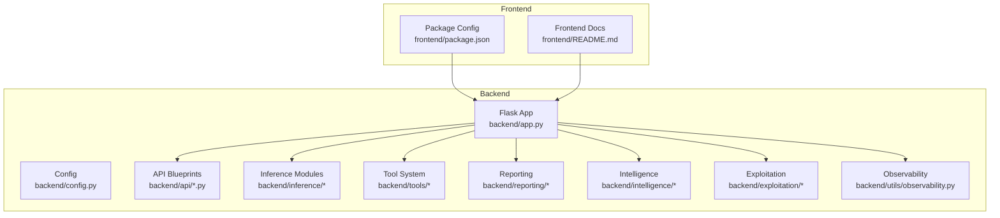
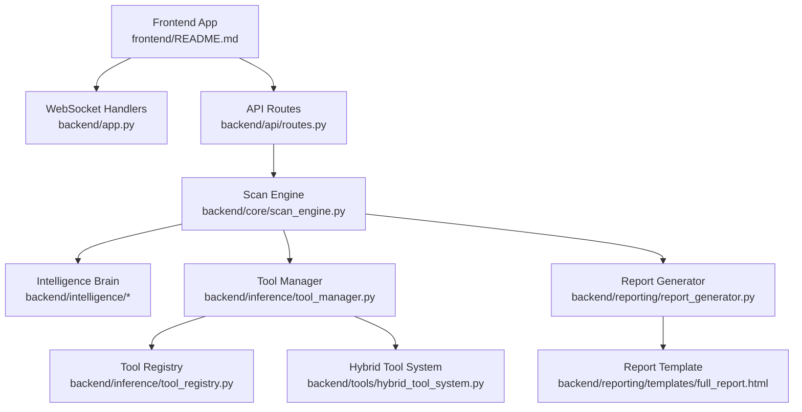
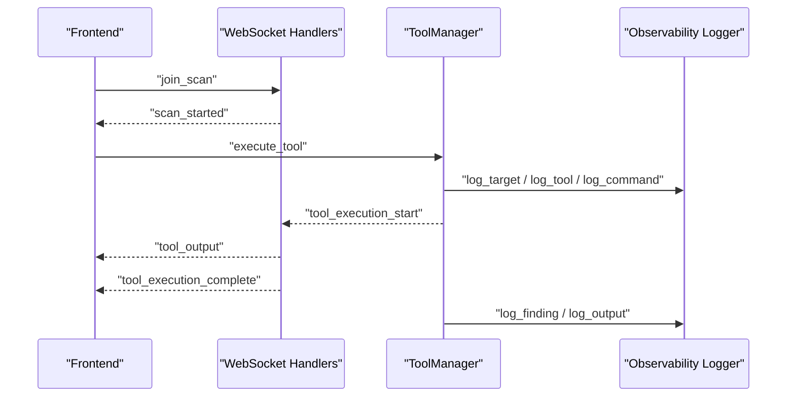
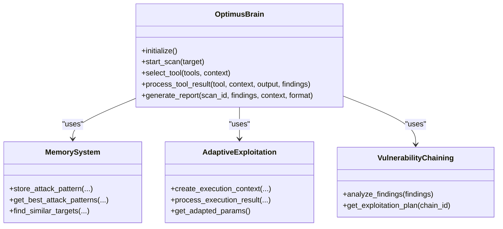
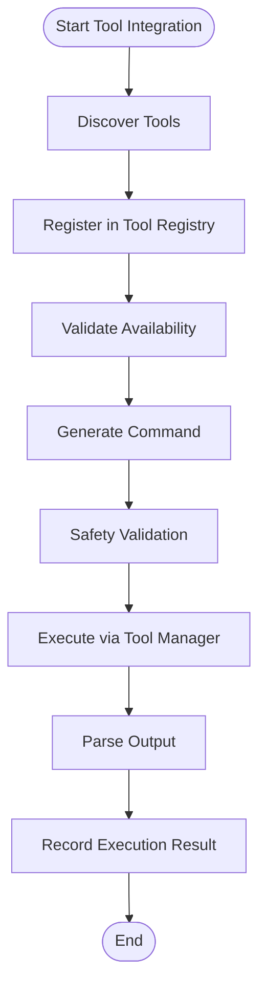
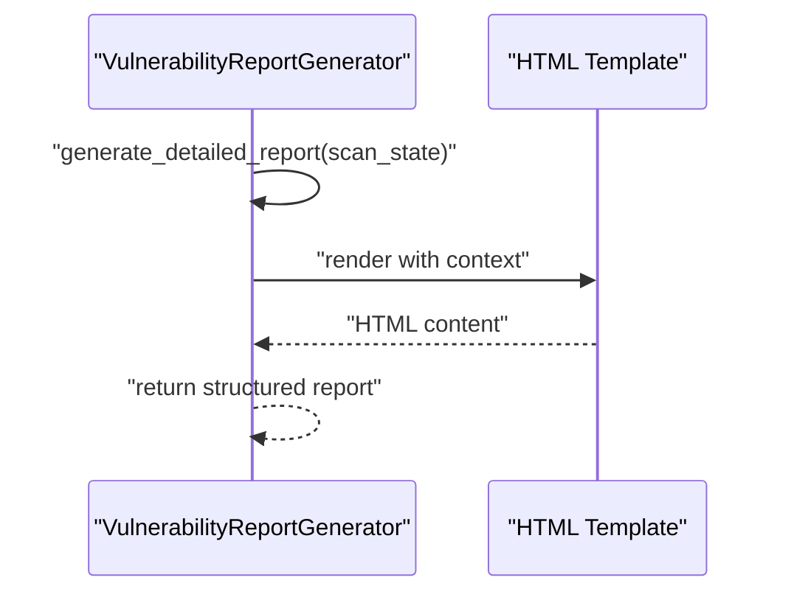
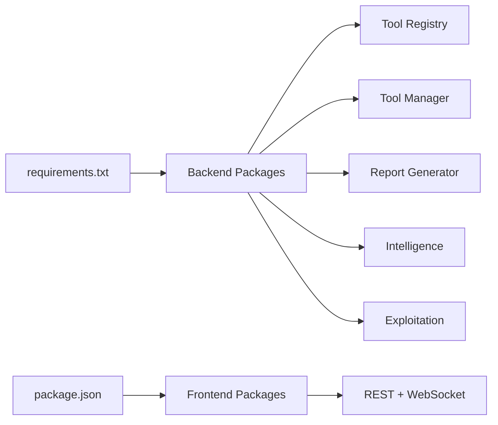

# Developer Guide

<cite>
**Referenced Files in This Document**
- [README.md](file://README.md)
- [app.py](file://backend/app.py)
- [config.py](file://backend/config.py)
- [requirements.txt](file://backend/requirements.txt)
- [routes.py](file://backend/api/routes.py)
- [tool_integration.py](file://backend/inference/tool_integration.py)
- [tool_manager.py](file://backend/inference/tool_manager.py)
- [tool_registry.py](file://backend/inference/tool_registry.py)
- [hybrid_tool_system.py](file://backend/tools/hybrid_tool_system.py)
- [report_generator.py](file://backend/reporting/report_generator.py)
- [full_report.html](file://backend/reporting/templates/full_report.html)
- [README.md](file://backend/intelligence/README.md)
- [README.md](file://backend/exploitation/README.md)
- [README.md](file://frontend/README.md)
- [package.json](file://frontend/package.json)
- [observability.py](file://backend/utils/observability.py)
</cite>

## Table of Contents
1. [Introduction](#introduction)
2. [Project Structure](#project-structure)
3. [Core Components](#core-components)
4. [Architecture Overview](#architecture-overview)
5. [Detailed Component Analysis](#detailed-component-analysis)
6. [Dependency Analysis](#dependency-analysis)
7. [Performance Considerations](#performance-considerations)
8. [Troubleshooting Guide](#troubleshooting-guide)
9. [Conclusion](#conclusion)
10. [Appendices](#appendices)

## Introduction
This Developer Guide explains how to extend and contribute to the Optimus platform. It covers:
- Development environment setup and configuration
- Debugging and observability practices
- Code contribution guidelines
- Extending the platform with new intelligence modules, custom tool integration, and report templates
- Practical examples and integration testing procedures
- How your extensions relate to platform evolution and community contributions

## Project Structure
Optimus is a full-stack platform with a Python Flask backend, a React-based frontend, and modular subsystems for intelligence, tool integration, exploitation, and reporting. The backend initializes core components, registers API blueprints, and integrates intelligence and tool systems. The frontend consumes REST and WebSocket endpoints to provide real-time dashboards and scan management.

**Diagram sources**
- [app.py](file://backend/app.py#L176-L275)
- [config.py](file://backend/config.py#L6-L115)
- [routes.py](file://backend/api/routes.py#L1-L54)
- [README.md](file://frontend/README.md#L1-L223)

**Section sources**
- [README.md](file://README.md#L1-L96)
- [app.py](file://backend/app.py#L176-L275)
- [config.py](file://backend/config.py#L6-L115)
- [README.md](file://frontend/README.md#L1-L223)

## Core Components
- Flask application bootstrap and WebSocket integration
- Configuration management for Kali VM, SSH, Ollama, and tool categories
- API blueprints for dashboard, scans, tools, intelligence, metrics, and reports
- Tool integration and registry for ground-truth tool validation
- Hybrid tool system for dynamic command generation and resolution
- Reporting pipeline with structured report generation and HTML templates
- Intelligence subsystems for memory, chaining, adaptive exploitation, and explainable AI
- Observability utilities for traceable logging and context propagation

**Section sources**
- [app.py](file://backend/app.py#L120-L343)
- [config.py](file://backend/config.py#L6-L115)
- [routes.py](file://backend/api/routes.py#L1-L54)
- [tool_integration.py](file://backend/inference/tool_integration.py#L15-L291)
- [tool_registry.py](file://backend/inference/tool_registry.py#L18-L559)
- [hybrid_tool_system.py](file://backend/tools/hybrid_tool_system.py#L65-L439)
- [report_generator.py](file://backend/reporting/report_generator.py#L14-L438)
- [full_report.html](file://backend/reporting/templates/full_report.html#L1-L230)
- [README.md](file://backend/intelligence/README.md#L1-L438)
- [README.md](file://backend/exploitation/README.md#L1-L182)
- [observability.py](file://backend/utils/observability.py#L15-L269)

## Architecture Overview
The backend orchestrates intelligence, tool integration, and reporting. The frontend connects via REST and WebSocket to receive real-time updates and control scans.

**Diagram sources**
- [app.py](file://backend/app.py#L221-L228)
- [routes.py](file://backend/api/routes.py#L1-L54)
- [tool_manager.py](file://backend/inference/tool_manager.py#L49-L130)
- [tool_registry.py](file://backend/inference/tool_registry.py#L18-L559)
- [hybrid_tool_system.py](file://backend/tools/hybrid_tool_system.py#L65-L439)
- [report_generator.py](file://backend/reporting/report_generator.py#L14-L438)
- [full_report.html](file://backend/reporting/templates/full_report.html#L1-L230)

## Detailed Component Analysis

### Development Environment Setup
- Backend prerequisites and installation
  - Python 3.10+, Flask, Flask-SocketIO, paramiko, dotenv, requests, reporting libraries, ML/AI packages
  - Install dependencies from requirements.txt
- Frontend prerequisites and installation
  - Node.js 16+, Vite, React, TypeScript, Tailwind CSS
  - Install dependencies from package.json
- Environment configuration
  - Copy .env.example to .env and configure Kali VM SSH credentials, Ollama base URL/model, timeouts, and feature flags
  - Backend reads environment variables via python-dotenv and exposes them via Config class
- Running the platform
  - Start backend: python app.py
  - Start frontend: npm run dev
  - Access frontend at http://localhost:5173

**Section sources**
- [README.md](file://README.md#L23-L88)
- [requirements.txt](file://backend/requirements.txt#L1-L49)
- [README.md](file://frontend/README.md#L73-L99)
- [package.json](file://frontend/package.json#L1-L50)
- [config.py](file://backend/config.py#L6-L115)

### Debugging and Observability
- Logging and trace IDs
  - Centralized observability logger with trace context propagation
  - Trace IDs are attached to log records and persisted across threads
  - Use context managers to propagate trace IDs during tool execution and scan phases
- Backend logging
  - Safe log formatter for Windows and Unicode handling
  - Console and file handlers with structured formatting
- Frontend integration
  - WebSocket events for real-time updates (scan progress, tool output, findings)
  - Environment variables for API and WebSocket URLs

**Diagram sources**
- [observability.py](file://backend/utils/observability.py#L15-L269)
- [tool_manager.py](file://backend/inference/tool_manager.py#L226-L630)
- [README.md](file://frontend/README.md#L135-L153)

**Section sources**
- [observability.py](file://backend/utils/observability.py#L15-L269)
- [app.py](file://backend/app.py#L90-L118)
- [README.md](file://frontend/README.md#L135-L153)

### Adding a New Intelligence Module
- Understand the intelligence subsystem
  - Optimus Brain integrates memory, delegation, adaptive exploitation, vulnerability chaining, explainable AI, continuous learning, and campaign intelligence
  - Refer to the intelligence module documentation for capabilities and integration patterns
- Extension steps
  - Define a new module under backend/intelligence
  - Integrate with the unified brain interface and lifecycle
  - Provide initialization, decision-making, and reporting capabilities
  - Ensure explainability and audit trails for decisions
- Contribution guidelines
  - Follow the existing module structure and naming conventions
  - Add unit tests and integration tests
  - Document capabilities and configuration options

**Diagram sources**
- [README.md](file://backend/intelligence/README.md#L1-L438)

**Section sources**
- [README.md](file://backend/intelligence/README.md#L1-L438)

### Custom Tool Integration (Tool Integration, Registry, Hybrid System)
- Ground-truth tool registry
  - Centralized SQLite registry with verification, categories, and metadata
  - Validates tools and ensures only registered tools are executed
- Tool integration coordinator
  - Discovers tools, registers them, and generates commands with evolving command generator
  - Provides availability checks and refresh/validation routines
- Hybrid tool system
  - Resolves tools via knowledge base, memory, discovered tools, LLM generation, and web research
  - Produces structured resolutions with confidence, explanations, and alternatives
- Extension steps
  - Extend the knowledge base with new tool templates and command patterns
  - Add categories and metadata to the registry
  - Integrate discovery mechanisms for new tools
  - Contribute to the evolving command generator and parser
- Integration testing
  - Use the tool manager’s execute_tool flow to validate command generation and execution
  - Verify safety gates, target integrity validation, and output parsing

**Diagram sources**
- [tool_integration.py](file://backend/inference/tool_integration.py#L29-L234)
- [tool_registry.py](file://backend/inference/tool_registry.py#L121-L343)
- [hybrid_tool_system.py](file://backend/tools/hybrid_tool_system.py#L166-L220)
- [tool_manager.py](file://backend/inference/tool_manager.py#L226-L630)

**Section sources**
- [tool_integration.py](file://backend/inference/tool_integration.py#L15-L291)
- [tool_registry.py](file://backend/inference/tool_registry.py#L18-L559)
- [hybrid_tool_system.py](file://backend/tools/hybrid_tool_system.py#L65-L439)
- [tool_manager.py](file://backend/inference/tool_manager.py#L49-L130)

### Report Template Creation and Extension
- Report generation pipeline
  - VulnerabilityReportGenerator produces structured reports with metadata, executive summary, attack chains, and recommendations
  - Integrates with Jinja2 templates for rendering
- Report template customization
  - Modify HTML templates under backend/reporting/templates
  - Extend report generator to include new sections or mappings
- Integration testing
  - Generate reports from scan state and verify rendering and completeness

**Diagram sources**
- [report_generator.py](file://backend/reporting/report_generator.py#L19-L42)
- [full_report.html](file://backend/reporting/templates/full_report.html#L106-L205)

**Section sources**
- [report_generator.py](file://backend/reporting/report_generator.py#L14-L438)
- [full_report.html](file://backend/reporting/templates/full_report.html#L1-L230)

### Exploitation Module Integration
- Purpose
  - Provides exploit templates, payload crafting, and safe execution with validation
- Integration steps
  - Import and initialize the exploitation manager in the autonomous agent
  - Use exploit database to select appropriate templates for findings
  - Execute commands with success indicators and parse results
- Testing
  - Run the included test suite to validate exploit execution and integration

**Section sources**
- [README.md](file://backend/exploitation/README.md#L1-L182)

### API and WebSocket Integration Points
- API blueprints
  - Dashboard stats, scan management, tool resolution, and report generation endpoints
- WebSocket handlers
  - Real-time events for scan lifecycle, tool execution, and findings
- Frontend integration
  - REST endpoints and WebSocket events documented in the frontend README

**Section sources**
- [routes.py](file://backend/api/routes.py#L1-L54)
- [app.py](file://backend/app.py#L221-L228)
- [README.md](file://frontend/README.md#L118-L153)

## Dependency Analysis
- Backend dependencies
  - Flask, Flask-SocketIO, paramiko, python-dotenv, requests, reporting libraries, ML/AI packages
- Frontend dependencies
  - React, TypeScript, Vite, Tailwind CSS, Socket.IO client, Zustand, Recharts
- Internal dependencies
  - Tool registry depends on SQLite and discovery utilities
  - Tool manager depends on parsers, safety validators, and hybrid system
  - Reporting depends on Jinja2 and templating

**Diagram sources**
- [requirements.txt](file://backend/requirements.txt#L1-L49)
- [package.json](file://frontend/package.json#L12-L48)

**Section sources**
- [requirements.txt](file://backend/requirements.txt#L1-L49)
- [package.json](file://frontend/package.json#L12-L48)

## Performance Considerations
- SSH connection tuning and keepalive to reduce latency and improve reliability
- Adaptive timeouts for different tool categories to balance responsiveness and accuracy
- Streaming output via WebSocket to provide real-time feedback without blocking
- Observability logging with trace IDs to diagnose performance bottlenecks
- Frontend optimizations: virtual scrolling, memoized selectors, debounced inputs

**Section sources**
- [config.py](file://backend/config.py#L19-L24)
- [tool_manager.py](file://backend/inference/tool_manager.py#L697-L725)
- [README.md](file://frontend/README.md#L208-L214)

## Troubleshooting Guide
- Health checks
  - Use the /health endpoint to verify API, WebSocket, intelligence, and tools status
- Logging and trace IDs
  - Enable DEBUG mode and inspect backend logs for traceable execution paths
  - Use observability utilities to log targets, tools, commands, outputs, and findings
- SSH connectivity
  - Adjust connection timeouts and retries in configuration
  - Verify Kali VM credentials and network accessibility
- Tool execution
  - Confirm tool availability via registry and discovery
  - Review safety validation and target integrity gates
- Frontend connectivity
  - Ensure VITE_API_URL and VITE_WS_URL point to the backend
  - Verify WebSocket events and real-time updates

**Section sources**
- [app.py](file://backend/app.py#L276-L290)
- [observability.py](file://backend/utils/observability.py#L157-L269)
- [config.py](file://backend/config.py#L19-L24)
- [README.md](file://frontend/README.md#L101-L109)

## Conclusion
This guide outlined how to develop, debug, and extend the Optimus platform. By leveraging the intelligence subsystem, tool integration, and reporting pipeline, contributors can add new modules, integrate custom tools, and enhance report templates. Follow the provided examples and testing procedures to ensure reliable and observable extensions that evolve the platform and benefit the community.

## Appendices
- Contribution guidelines
  - Fork and branch, implement changes with tests, document new features, and open pull requests
- Release and deployment
  - Backend: ensure requirements.txt is up to date and environment variables are configured
  - Frontend: build with Vite and serve via a static server or container

[No sources needed since this section provides general guidance]