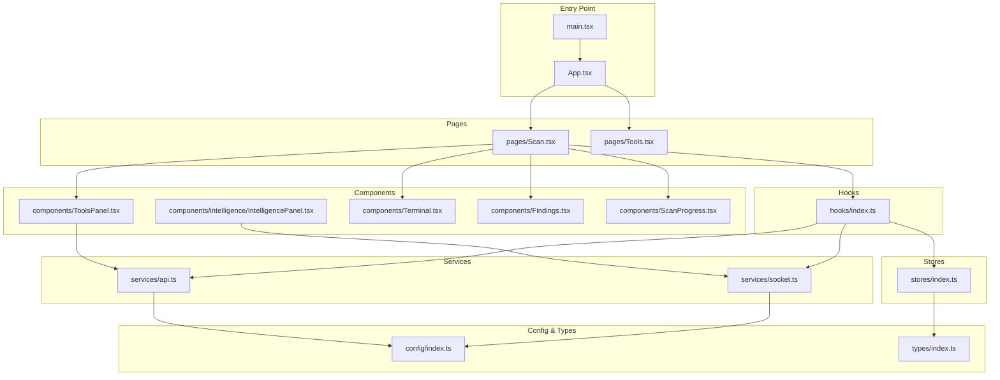
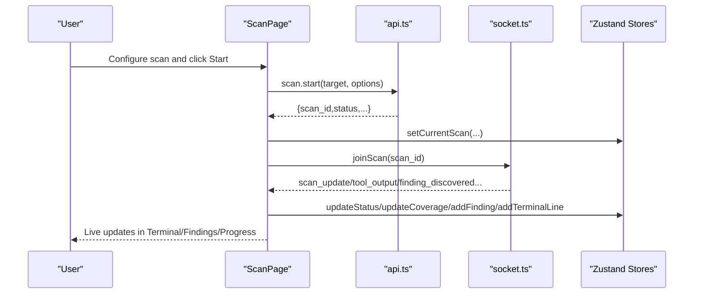
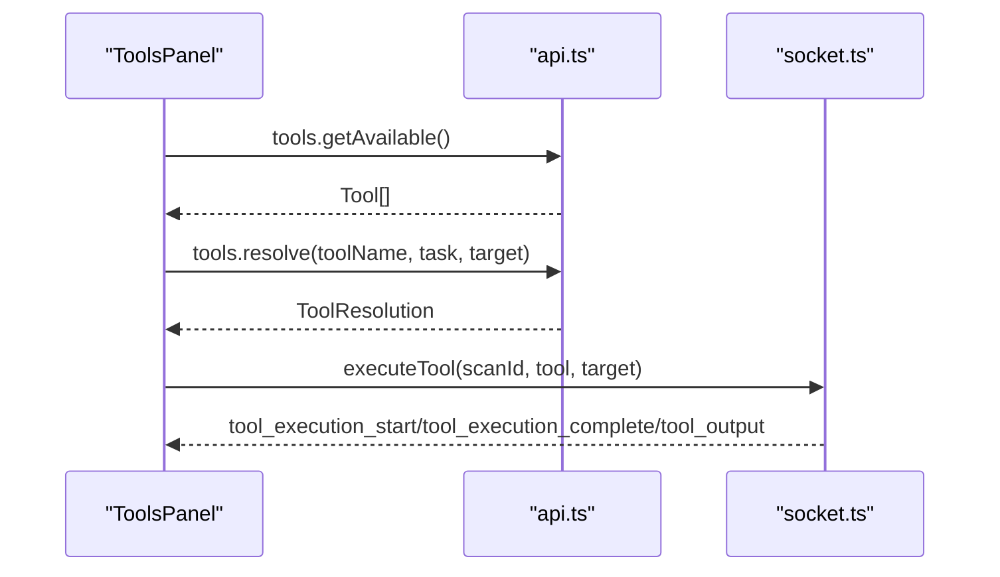
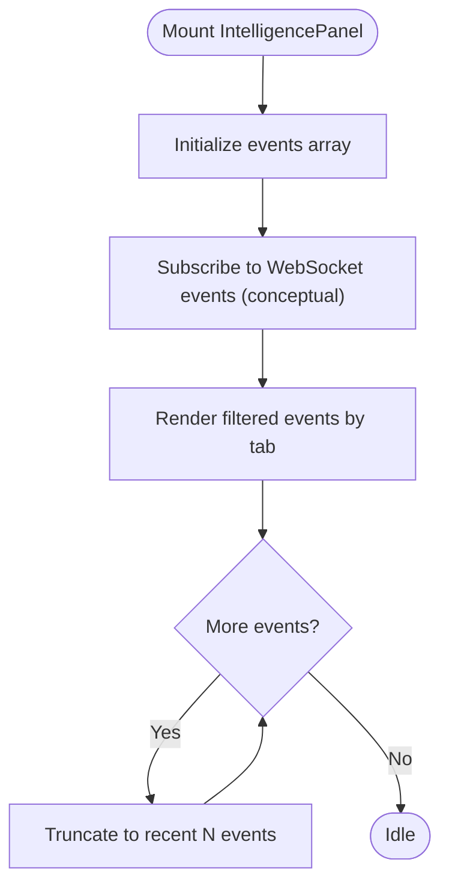
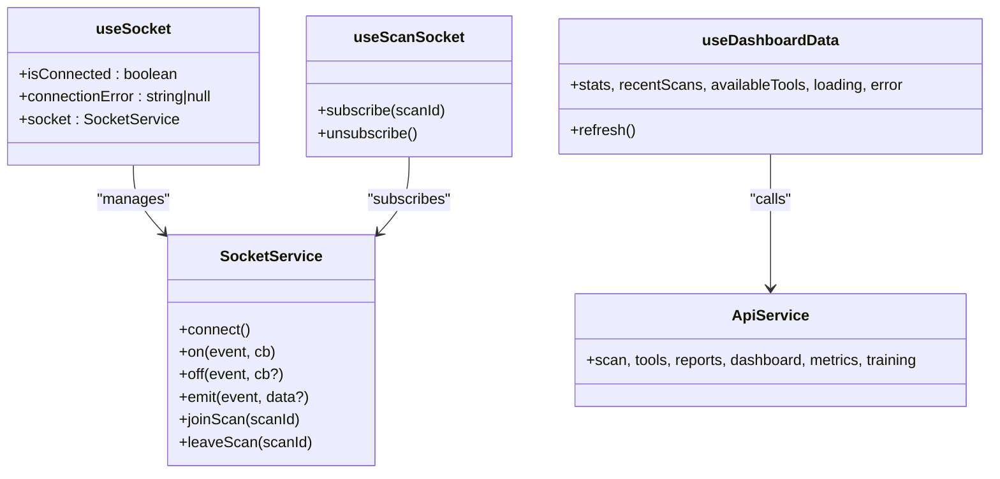
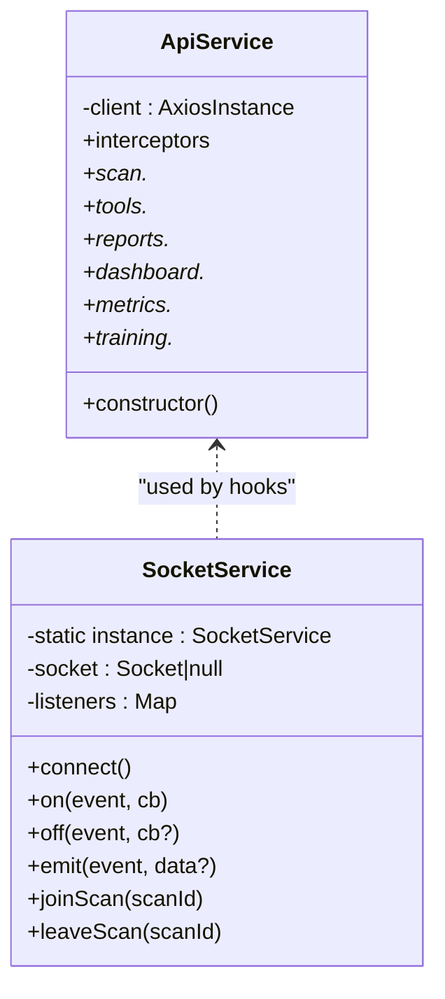
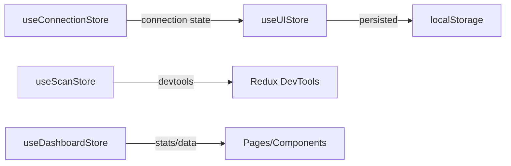
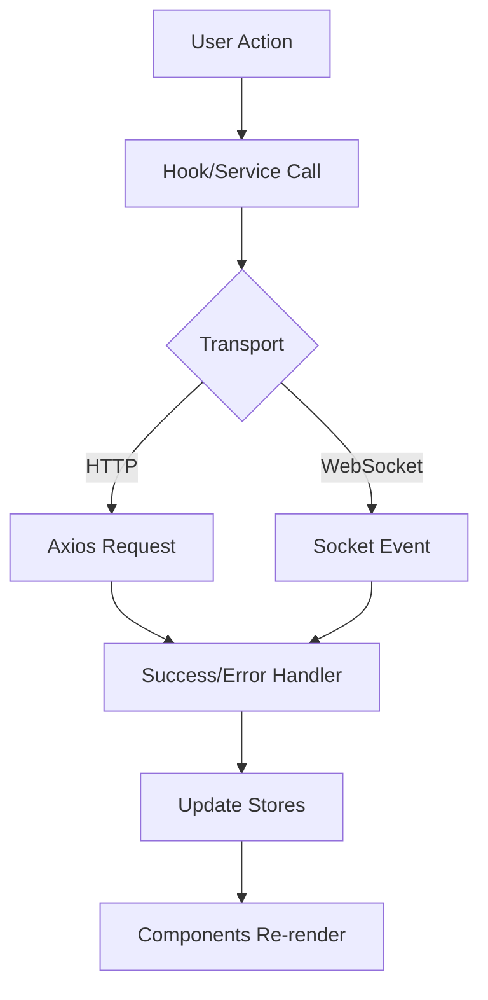
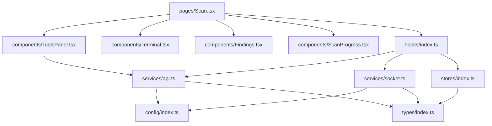

# Component Integration Patterns

<cite>
**Referenced Files in This Document**
- [App.tsx](file://frontend/src/App.tsx)
- [main.tsx](file://frontend/src/main.tsx)
- [ToolsPanel.tsx](file://frontend/src/components/ToolsPanel.tsx)
- [IntelligencePanel.tsx](file://frontend/src/components/intelligence/IntelligencePanel.tsx)
- [api.ts](file://frontend/src/services/api.ts)
- [socket.ts](file://frontend/src/services/socket.ts)
- [index.ts](file://frontend/src/hooks/index.ts)
- [Tools.tsx](file://frontend/src/pages/Tools.tsx)
- [Scan.tsx](file://frontend/src/pages/Scan.tsx)
- [index.ts](file://frontend/src/config/index.ts)
- [index.ts](file://frontend/src/types/index.ts)
- [index.ts](file://frontend/src/stores/index.ts)
- [Terminal.tsx](file://frontend/src/components/Terminal.tsx)
- [Findings.tsx](file://frontend/src/components/Findings.tsx)
- [ScanProgress.tsx](file://frontend/src/components/ScanProgress.tsx)
</cite>

## Table of Contents
1. [Introduction](#introduction)
2. [Project Structure](#project-structure)
3. [Core Components](#core-components)
4. [Architecture Overview](#architecture-overview)
5. [Detailed Component Analysis](#detailed-component-analysis)
6. [Dependency Analysis](#dependency-analysis)
7. [Performance Considerations](#performance-considerations)
8. [Troubleshooting Guide](#troubleshooting-guide)
9. [Conclusion](#conclusion)
10. [Appendices](#appendices)

## Introduction
This document explains the frontend component integration patterns and architectural approaches used across the application. It focuses on:
- How UI components integrate with services and state management
- Data flow from services to components
- Real-time integration via WebSocket and polling
- State management strategies using zustand stores
- Custom hooks for API and WebSocket orchestration
- ToolsPanel.tsx integration with backend APIs for tool discovery, resolution, and execution
- IntelligencePanel.tsx role in displaying AI/ML insights and its integration patterns
- Testing strategies, mock implementations, and debugging approaches for integration scenarios

## Project Structure
The frontend follows a feature-based structure with clear separation of concerns:
- Pages: route-level containers orchestrating data fetching and component composition
- Components: reusable UI building blocks with internal state and props
- Services: typed HTTP and WebSocket clients for backend integration
- Hooks: custom hooks encapsulating side effects and cross-cutting concerns
- Stores: zustand stores for global UI and scan state
- Types: shared TypeScript interfaces and enums
- Config: environment-driven configuration for API and WebSocket URLs

**Diagram sources**
- [main.tsx](file://frontend/src/main.tsx#L1-L11)
- [App.tsx](file://frontend/src/App.tsx#L1-L187)
- [Scan.tsx](file://frontend/src/pages/Scan.tsx#L1-L496)
- [Tools.tsx](file://frontend/src/pages/Tools.tsx#L1-L373)
- [ToolsPanel.tsx](file://frontend/src/components/ToolsPanel.tsx#L1-L488)
- [IntelligencePanel.tsx](file://frontend/src/components/intelligence/IntelligencePanel.tsx#L1-L225)
- [Terminal.tsx](file://frontend/src/components/Terminal.tsx#L1-L264)
- [Findings.tsx](file://frontend/src/components/Findings.tsx#L1-L438)
- [ScanProgress.tsx](file://frontend/src/components/ScanProgress.tsx#L1-L349)
- [api.ts](file://frontend/src/services/api.ts#L1-L391)
- [socket.ts](file://frontend/src/services/socket.ts#L1-L237)
- [index.ts](file://frontend/src/hooks/index.ts#L1-L369)
- [index.ts](file://frontend/src/stores/index.ts#L1-L318)
- [index.ts](file://frontend/src/config/index.ts#L1-L135)
- [index.ts](file://frontend/src/types/index.ts#L1-L346)

**Section sources**
- [main.tsx](file://frontend/src/main.tsx#L1-L11)
- [App.tsx](file://frontend/src/App.tsx#L1-L187)
- [index.ts](file://frontend/src/config/index.ts#L1-L135)

## Core Components
- ToolsPanel: Discovery, filtering, categorization, and resolution of tools; integrates with API for tool inventory and resolution; triggers execution via WebSocket.
- IntelligencePanel: Displays AI/ML insights and decisions; currently uses mock data but designed to consume real-time WebSocket events.
- ScanPage: Orchestrates scan lifecycle, integrates API for start/status and WebSocket for live updates; composes Terminal, Findings, and ScanProgress.
- Terminal: Renders real-time tool output streamed via WebSocket; supports filtering, export, and auto-scroll.
- Findings: Renders vulnerability findings with filtering, sorting, and severity visualization.
- ScanProgress: Visualizes scan phases and progress; supports compact and expanded modes.

**Section sources**
- [ToolsPanel.tsx](file://frontend/src/components/ToolsPanel.tsx#L1-L488)
- [IntelligencePanel.tsx](file://frontend/src/components/intelligence/IntelligencePanel.tsx#L1-L225)
- [Scan.tsx](file://frontend/src/pages/Scan.tsx#L1-L496)
- [Terminal.tsx](file://frontend/src/components/Terminal.tsx#L1-L264)
- [Findings.tsx](file://frontend/src/components/Findings.tsx#L1-L438)
- [ScanProgress.tsx](file://frontend/src/components/ScanProgress.tsx#L1-L349)

## Architecture Overview
The frontend employs a layered architecture:
- Presentation Layer: Pages and Components
- Integration Layer: Services (HTTP and WebSocket)
- Orchestration Layer: Custom Hooks
- State Management: Zustand Stores
- Configuration: Environment-driven config

**Diagram sources**
- [Scan.tsx](file://frontend/src/pages/Scan.tsx#L75-L146)
- [api.ts](file://frontend/src/services/api.ts#L63-L152)
- [socket.ts](file://frontend/src/services/socket.ts#L207-L232)
- [index.ts](file://frontend/src/hooks/index.ts#L62-L196)
- [index.ts](file://frontend/src/stores/index.ts#L47-L151)

## Detailed Component Analysis

### ToolsPanel.tsx Integration with Backend API
ToolsPanel orchestrates tool discovery, filtering, and resolution:
- Loads available tools via API on mount
- Resolves a tool for a given target using API
- Executes a tool via WebSocket after resolution
- Integrates with UI components for search, category filtering, and details preview

**Diagram sources**
- [ToolsPanel.tsx](file://frontend/src/components/ToolsPanel.tsx#L72-L94)
- [ToolsPanel.tsx](file://frontend/src/components/ToolsPanel.tsx#L376-L392)
- [ToolsPanel.tsx](file://frontend/src/components/ToolsPanel.tsx#L463-L474)
- [api.ts](file://frontend/src/services/api.ts#L158-L231)
- [socket.ts](file://frontend/src/services/socket.ts#L223-L225)

**Section sources**
- [ToolsPanel.tsx](file://frontend/src/components/ToolsPanel.tsx#L1-L488)
- [api.ts](file://frontend/src/services/api.ts#L158-L231)
- [socket.ts](file://frontend/src/services/socket.ts#L223-L225)

### IntelligencePanel.tsx Integration Patterns
IntelligencePanel displays AI/ML insights and decisions:
- Uses mock data for demonstration
- Designed to consume real-time WebSocket events for decisions, chains, anomalies, adaptations, and learning
- Supports tabbed views and confidence indicators

**Diagram sources**
- [IntelligencePanel.tsx](file://frontend/src/components/intelligence/IntelligencePanel.tsx#L70-L82)
- [IntelligencePanel.tsx](file://frontend/src/components/intelligence/IntelligencePanel.tsx#L120-L125)

**Section sources**
- [IntelligencePanel.tsx](file://frontend/src/components/intelligence/IntelligencePanel.tsx#L1-L225)

### Custom Hooks Architecture
Custom hooks encapsulate cross-cutting concerns and reduce prop drilling:
- useSocket: Initializes and manages WebSocket connection, exposes connection state
- useScanSocket: Subscribes to scan-specific events, updates stores, and emits notifications
- useDashboardData: Fetches dashboard stats, recent scans, and available tools concurrently
- Additional hooks: useDebounce, useInterval, useLocalStorage, useClickOutside, useKeyPress, useCopyToClipboard

**Diagram sources**
- [index.ts](file://frontend/src/hooks/index.ts#L16-L56)
- [index.ts](file://frontend/src/hooks/index.ts#L62-L196)
- [index.ts](file://frontend/src/hooks/index.ts#L203-L242)
- [socket.ts](file://frontend/src/services/socket.ts#L64-L233)
- [api.ts](file://frontend/src/services/api.ts#L19-L386)

**Section sources**
- [index.ts](file://frontend/src/hooks/index.ts#L1-L369)
- [socket.ts](file://frontend/src/services/socket.ts#L1-L237)
- [api.ts](file://frontend/src/services/api.ts#L1-L391)

### Service Layer Architecture
- ApiService: Centralized HTTP client with interceptors for auth and error handling; groups endpoints by domain (scan, tools, reports, dashboard, metrics, training)
- SocketService: Singleton WebSocket client with reconnection, event subscription, and room joining; exposes typed events for scan lifecycle, tool execution, and findings

**Diagram sources**
- [api.ts](file://frontend/src/services/api.ts#L19-L386)
- [socket.ts](file://frontend/src/services/socket.ts#L64-L233)

**Section sources**
- [api.ts](file://frontend/src/services/api.ts#L1-L391)
- [socket.ts](file://frontend/src/services/socket.ts#L1-L237)

### State Management Strategies
Zustand stores manage global state:
- useScanStore: Current scan, terminal output, findings, coverage, and execution history
- useUIStore: UI state (sidebar, theme, notifications), persisted and devtools-enabled
- useDashboardStore: Dashboard stats, recent scans, available tools, loading/error states
- useConnectionStore: WebSocket connection status and reconnection attempts

**Diagram sources**
- [index.ts](file://frontend/src/stores/index.ts#L47-L151)
- [index.ts](file://frontend/src/stores/index.ts#L184-L239)
- [index.ts](file://frontend/src/stores/index.ts#L260-L277)
- [index.ts](file://frontend/src/stores/index.ts#L295-L317)

**Section sources**
- [index.ts](file://frontend/src/stores/index.ts#L1-L318)

### Component Composition and Prop Drilling Solutions
- Pages compose multiple components and pass minimal props
- Hooks centralize side effects and expose derived state, reducing prop drilling
- Stores provide global state access without prop chains
- Example: ScanPage composes ToolsPanel, Terminal, FindingsPanel, and ScanProgress without passing intermediate state

**Section sources**
- [Scan.tsx](file://frontend/src/pages/Scan.tsx#L36-L442)
- [Tools.tsx](file://frontend/src/pages/Tools.tsx#L30-L274)

### Data Flow Patterns
- HTTP: Pages call ApiService methods; responses update stores and UI
- WebSocket: useSocket initializes connection; useScanSocket subscribes to events; stores update UI reactively
- Polling: ScanPage polls scan status until completion or error

**Diagram sources**
- [Scan.tsx](file://frontend/src/pages/Scan.tsx#L121-L146)
- [index.ts](file://frontend/src/hooks/index.ts#L62-L196)
- [api.ts](file://frontend/src/services/api.ts#L19-L57)
- [socket.ts](file://frontend/src/services/socket.ts#L137-L160)

## Dependency Analysis
- Pages depend on Components and Services via hooks
- Hooks depend on Services and Stores
- Components depend on UI primitives and Types
- Services depend on Config and Types
- Stores depend on Types

**Diagram sources**
- [Scan.tsx](file://frontend/src/pages/Scan.tsx#L1-L496)
- [ToolsPanel.tsx](file://frontend/src/components/ToolsPanel.tsx#L1-L488)
- [Terminal.tsx](file://frontend/src/components/Terminal.tsx#L1-L264)
- [Findings.tsx](file://frontend/src/components/Findings.tsx#L1-L438)
- [ScanProgress.tsx](file://frontend/src/components/ScanProgress.tsx#L1-L349)
- [index.ts](file://frontend/src/hooks/index.ts#L1-L369)
- [api.ts](file://frontend/src/services/api.ts#L1-L391)
- [socket.ts](file://frontend/src/services/socket.ts#L1-L237)
- [index.ts](file://frontend/src/stores/index.ts#L1-L318)
- [index.ts](file://frontend/src/config/index.ts#L1-L135)
- [index.ts](file://frontend/src/types/index.ts#L1-L346)

**Section sources**
- [index.ts](file://frontend/src/hooks/index.ts#L1-L369)
- [api.ts](file://frontend/src/services/api.ts#L1-L391)
- [socket.ts](file://frontend/src/services/socket.ts#L1-L237)
- [index.ts](file://frontend/src/stores/index.ts#L1-L318)
- [index.ts](file://frontend/src/config/index.ts#L1-L135)
- [index.ts](file://frontend/src/types/index.ts#L1-L346)

## Performance Considerations
- Debounce search/filter inputs to avoid excessive re-renders
- Limit terminal log lines to configured maximum to control memory usage
- Batch WebSocket event updates to minimize re-renders
- Use memoization for derived data (e.g., severity counts, filtered findings)
- Prefer selective store subscriptions to reduce unnecessary renders

[No sources needed since this section provides general guidance]

## Troubleshooting Guide
Common integration issues and debugging approaches:
- WebSocket connection failures: Inspect connection state and error messages; verify reconnection attempts; confirm server availability
- API authentication errors: Check token presence and interceptor behavior; ensure proper error handling and redirects
- Tool resolution failures: Validate target and tool parameters; inspect resolution status and warnings
- Real-time updates not appearing: Confirm room join and event subscriptions; verify event names and payloads
- Terminal lag or memory growth: Enforce max log lines and clear terminal when appropriate

**Section sources**
- [index.ts](file://frontend/src/hooks/index.ts#L16-L56)
- [api.ts](file://frontend/src/services/api.ts#L44-L56)
- [socket.ts](file://frontend/src/services/socket.ts#L137-L160)
- [index.ts](file://frontend/src/stores/index.ts#L132-L145)

## Conclusion
The frontend integrates UI components with robust services and hooks, enabling seamless real-time collaboration between HTTP and WebSocket transports. Zustand stores provide scalable state management, while custom hooks encapsulate complex integration logic. ToolsPanel and IntelligencePanel exemplify clean separation of concerns, with clear pathways to backend APIs and WebSocket events.

[No sources needed since this section summarizes without analyzing specific files]

## Appendices

### API Definitions and Endpoints
- Scan endpoints: start, getStatus, stop, pause, resume, getResults, list, executeTool, getFindings
- Tools endpoints: getAvailable, getCategories, resolve, scan, research, getInventory
- Reports endpoints: generate, get, download, list
- Dashboard endpoints: getStats, getActivity
- Metrics endpoints: getML, getRL, getScanHistory, getSystem
- Training endpoints: start, getStatus, listModels

**Section sources**
- [api.ts](file://frontend/src/services/api.ts#L63-L385)

### WebSocket Events
- Connection: connect, disconnect, connect_error
- Scan: scan_started, scan_complete, scan_error, scan_update
- Phase: phase_transition
- Tool: tool_recommendation, tool_execution_start, tool_execution_complete, tool_output, tool_error_output, tool_resolution, tool_executing, tool_blocked, tool_warning, tool_fallback
- Finding: finding_discovered
- System: system_status

**Section sources**
- [socket.ts](file://frontend/src/services/socket.ts#L18-L62)

### Configuration Options
- apiUrl, wsUrl, appName, version, maxLogLines, reconnectAttempts, reconnectDelay
- Severity and phase configurations for UI rendering
- Tool categories and default tools

**Section sources**
- [index.ts](file://frontend/src/config/index.ts#L15-L135)