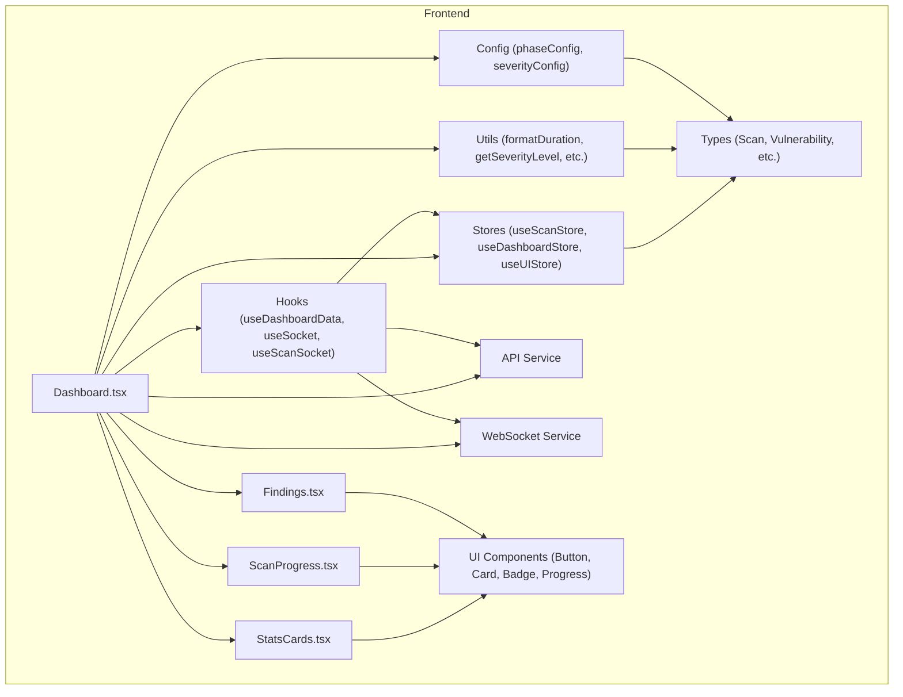
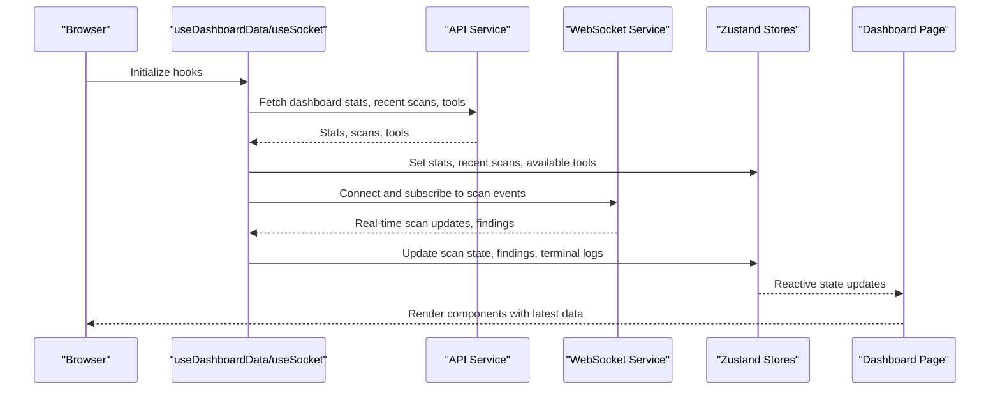
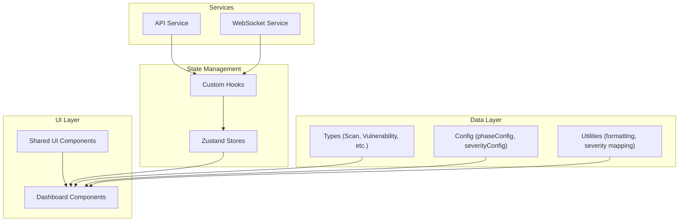

# Dashboard Components

<cite>
**Referenced Files in This Document**
- [Dashboard.tsx](file://frontend/src/pages/Dashboard.tsx)
- [StatsCards.tsx](file://frontend/src/components/StatsCards.tsx)
- [ScanProgress.tsx](file://frontend/src/components/ScanProgress.tsx)
- [Findings.tsx](file://frontend/src/components/Findings.tsx)
- [index.ts](file://frontend/src/hooks/index.ts)
- [index.ts](file://frontend/src/stores/index.ts)
- [index.ts](file://frontend/src/types/index.ts)
- [utils.ts](file://frontend/src/lib/utils.ts)
- [index.ts](file://frontend/src/config/index.ts)
- [api.ts](file://frontend/src/services/api.ts)
- [socket.ts](file://frontend/src/services/socket.ts)
- [index.ts](file://frontend/src/components/ui/index.tsx)
- [routes.py](file://backend/api/routes.py)
- [websocket_handlers.py](file://backend/api/websocket_handlers.py)
</cite>

## Table of Contents
1. [Introduction](#introduction)
2. [Project Structure](#project-structure)
3. [Core Components](#core-components)
4. [Architecture Overview](#architecture-overview)
5. [Detailed Component Analysis](#detailed-component-analysis)
6. [Dependency Analysis](#dependency-analysis)
7. [Performance Considerations](#performance-considerations)
8. [Troubleshooting Guide](#troubleshooting-guide)
9. [Conclusion](#conclusion)

## Introduction
This document provides comprehensive documentation for the Optimus dashboard components, focusing on the main Dashboard page and its constituent parts. It explains how the StatsCards, ScanProgress, and Findings components work together to present security metrics, real-time scan progress, and vulnerability findings. The guide covers component composition patterns, prop interfaces, data binding approaches, responsive design considerations, accessibility features, performance optimization techniques for large datasets, and integration with backend APIs for real-time updates.

## Project Structure
The dashboard is implemented in the frontend under the `frontend/src` directory. The main dashboard page orchestrates several specialized components:
- Dashboard page: coordinates data fetching, WebSocket subscriptions, and renders child components
- StatsCards: presents key performance indicators and severity distribution
- ScanProgress: displays real-time scan progress with timeline visualization
- Findings: lists vulnerabilities with filtering, sorting, and expandable details

**Diagram sources**
- [Dashboard.tsx](file://frontend/src/pages/Dashboard.tsx#L33-L228)
- [StatsCards.tsx](file://frontend/src/components/StatsCards.tsx#L126-L169)
- [ScanProgress.tsx](file://frontend/src/components/ScanProgress.tsx#L44-L234)
- [Findings.tsx](file://frontend/src/components/Findings.tsx#L255-L435)
- [index.ts](file://frontend/src/hooks/index.ts#L16-L242)
- [index.ts](file://frontend/src/stores/index.ts#L47-L277)
- [index.ts](file://frontend/src/types/index.ts#L5-L79)
- [utils.ts](file://frontend/src/lib/utils.ts#L10-L126)
- [index.ts](file://frontend/src/config/index.ts#L25-L107)
- [api.ts](file://frontend/src/services/api.ts#L19-L391)
- [socket.ts](file://frontend/src/services/socket.ts#L64-L237)

**Section sources**
- [Dashboard.tsx](file://frontend/src/pages/Dashboard.tsx#L1-L317)
- [StatsCards.tsx](file://frontend/src/components/StatsCards.tsx#L1-L363)
- [ScanProgress.tsx](file://frontend/src/components/ScanProgress.tsx#L1-L349)
- [Findings.tsx](file://frontend/src/components/Findings.tsx#L1-L438)

## Core Components
This section outlines the primary dashboard components and their roles:

- Dashboard page: Orchestrates data loading, WebSocket connections, and renders child components. It handles loading states, errors, and integrates with stores and hooks for real-time updates.
- StatsCards: Provides four StatCard components forming a StatsGrid, plus a SeverityDistribution card for visualizing vulnerability severity distribution.
- ScanProgress: Visualizes scan progress with an overall progress bar, phase timeline, and key metrics. Supports both full and compact modes.
- Findings: Displays vulnerability findings with filtering, sorting, and expandable details. Includes severity badges, copy-to-clipboard functionality, and empty states.

**Section sources**
- [Dashboard.tsx](file://frontend/src/pages/Dashboard.tsx#L33-L228)
- [StatsCards.tsx](file://frontend/src/components/StatsCards.tsx#L126-L246)
- [ScanProgress.tsx](file://frontend/src/components/ScanProgress.tsx#L44-L234)
- [Findings.tsx](file://frontend/src/components/Findings.tsx#L255-L435)

## Architecture Overview
The dashboard follows a reactive architecture with:
- Centralized state management via Zustand stores
- Real-time updates through WebSocket connections
- Composable UI components with shared utilities and configurations
- Backend APIs for initial data and metrics

**Diagram sources**
- [index.ts](file://frontend/src/hooks/index.ts#L16-L242)
- [api.ts](file://frontend/src/services/api.ts#L282-L297)
- [socket.ts](file://frontend/src/services/socket.ts#L83-L106)
- [index.ts](file://frontend/src/stores/index.ts#L260-L277)

## Detailed Component Analysis

### Dashboard Page (Dashboard.tsx)
The Dashboard page serves as the main orchestrator, integrating data fetching, WebSocket subscriptions, and component rendering.

Key responsibilities:
- Load dashboard data using useDashboardData hook
- Establish WebSocket connection with useSocket
- Subscribe to scan events with useScanSocket
- Render StatsGrid, ScanProgress, Terminal, and FindingsPanel
- Handle loading and error states
- Provide quick actions and recent scans

Integration patterns:
- Uses zustand stores for reactive state
- Leverages shared utilities for formatting and severity mapping
- Integrates with backend APIs for initial data and metrics

Responsive design:
- Flexbox and grid layouts adapt to different screen sizes
- Mobile-first approach with stacked layouts on smaller screens
- Max-height constraints for scrollable panels

Accessibility:
- Semantic HTML structure with headings and landmarks
- Focus management for interactive elements
- Sufficient color contrast for severity indicators

**Section sources**
- [Dashboard.tsx](file://frontend/src/pages/Dashboard.tsx#L33-L228)
- [index.ts](file://frontend/src/hooks/index.ts#L203-L242)
- [index.ts](file://frontend/src/stores/index.ts#L260-L277)
- [utils.ts](file://frontend/src/lib/utils.ts#L39-L82)

### StatsCards Component (StatsCards.tsx)
The StatsCards module provides reusable components for displaying key metrics and distributions.

#### StatCard Component
Purpose: Individual metric card with icon, trend indicator, and animated borders.

Props interface:
- title: string
- value: string | number
- subtitle?: string
- icon: React.FC
- color: string
- trend?: { value: number; direction: 'up' | 'down' | 'neutral' }
- className?: string
- delay?: number

Features:
- Framer Motion animations for entrance effects
- Dynamic background glow and hover states
- Trend indicators with directional icons
- Responsive layout with configurable delays

#### StatsGrid Component
Purpose: Grid layout for four primary metrics cards.

Metrics included:
- Active Scans
- Total Findings
- Critical Issues
- Tools Available

Implementation:
- Uses StatCard components with staggered animation delays
- Responsive grid layout (2 columns on small screens, 4 on larger)
- Subtle subtitle descriptions for context

#### SeverityDistribution Component
Purpose: Visual representation of vulnerability severity distribution.

Features:
- Stacked bar chart showing percentages
- Animated transitions for each severity segment
- Legend with counts and labels
- Empty state handling when no findings exist

#### Additional Components
- MiniStat: Compact metric display for sidebar or summaries
- SystemHealth: CPU/memory usage and connection monitoring
- HealthMetric: Animated progress bars for resource utilization

**Section sources**
- [StatsCards.tsx](file://frontend/src/components/StatsCards.tsx#L19-L169)
- [StatsCards.tsx](file://frontend/src/components/StatsCards.tsx#L175-L246)
- [StatsCards.tsx](file://frontend/src/components/StatsCards.tsx#L252-L279)
- [StatsCards.tsx](file://frontend/src/components/StatsCards.tsx#L285-L360)

### ScanProgress Component (ScanProgress.tsx)
The ScanProgress component provides comprehensive real-time scan visualization.

#### Core Props
- scan: Scan (required)
- className?: string
- compact?: boolean

#### Progress Visualization
- Overall progress bar with gradient styling
- Phase timeline with animated nodes
- Status badge indicating current scan state
- Elapsed time display with formatted duration

#### Phase Timeline
- Six-phase progression: reconnaissance, scanning, enumeration, exploitation, post_exploitation, reporting
- Animated transitions between phases
- Visual indicators for active, completed, and pending phases
- Phase-specific icons and colors from phaseConfig

#### Compact Mode
- Minimal progress display suitable for sidebar or notifications
- Simplified layout with progress bar and elapsed time

#### Statistics Cards
- Coverage percentage
- Finding count
- Tools executed
- Average phase time

#### Status Handling
- Running: pulsing indicator and spinner
- Completed: checkmark and success styling
- Other states: appropriate status badges

**Section sources**
- [ScanProgress.tsx](file://frontend/src/components/ScanProgress.tsx#L38-L234)
- [ScanProgress.tsx](file://frontend/src/components/ScanProgress.tsx#L240-L291)
- [index.ts](file://frontend/src/config/index.ts#L69-L107)

### Findings Component (Findings.tsx)
The Findings component manages vulnerability display with advanced filtering and interaction capabilities.

#### VulnerabilityCard Component
Purpose: Individual vulnerability display with expandable details.

Key features:
- Severity-based styling with colored indicators
- Expand/collapse functionality with smooth animations
- Copy-to-clipboard for vulnerability JSON
- Badge system for severity, exploitability, and CVE tags
- Evidence display with monospace formatting

#### FindingsPanel Component
Purpose: Main container for vulnerability listings with comprehensive controls.

Filtering options:
- Text search across name, type, location, and CVE
- Severity-based filtering (critical, high, medium, low, info)
- Sorting by severity or timestamp

Interactive elements:
- Expandable cards with chevron indicators
- Copy JSON functionality with feedback
- Reference links with external link icons
- Remediation text display when available

Performance optimizations:
- Memoized filtering and sorting computations
- Efficient list rendering with react-motion animations
- Scrollable containers with max-height constraints

#### Data Binding
- Receives vulnerability array via props
- Maintains local state for expanded items and filters
- Uses severity utilities for consistent classification

**Section sources**
- [Findings.tsx](file://frontend/src/components/Findings.tsx#L22-L241)
- [Findings.tsx](file://frontend/src/components/Findings.tsx#L247-L435)
- [utils.ts](file://frontend/src/lib/utils.ts#L17-L34)

## Dependency Analysis
The dashboard components rely on several foundational layers:

**Diagram sources**
- [index.ts](file://frontend/src/types/index.ts#L5-L79)
- [index.ts](file://frontend/src/config/index.ts#L25-L107)
- [utils.ts](file://frontend/src/lib/utils.ts#L10-L126)
- [api.ts](file://frontend/src/services/api.ts#L19-L391)
- [socket.ts](file://frontend/src/services/socket.ts#L64-L237)
- [index.ts](file://frontend/src/hooks/index.ts#L16-L242)
- [index.ts](file://frontend/src/stores/index.ts#L47-L277)

Key dependencies:
- Zustand stores for centralized state management
- Custom hooks for data fetching and WebSocket handling
- Shared utilities for consistent formatting and severity classification
- Backend APIs for initial data and metrics
- WebSocket service for real-time updates

**Section sources**
- [index.ts](file://frontend/src/stores/index.ts#L1-L318)
- [index.ts](file://frontend/src/hooks/index.ts#L1-L369)
- [api.ts](file://frontend/src/services/api.ts#L1-L391)
- [socket.ts](file://frontend/src/services/socket.ts#L1-L237)

## Performance Considerations
The dashboard implements several performance optimization techniques:

### Rendering Optimizations
- **Memoization**: useMemo for expensive filtering and sorting operations in FindingsPanel
- **Component-level memoization**: React.memo for stable component boundaries
- **Animation optimization**: Framer Motion with controlled animations to prevent layout thrashing
- **Virtual scrolling**: Consider implementing virtualized lists for very large datasets

### Memory Management
- **Store cleanup**: Automatic cleanup of terminal logs and notification arrays
- **Connection pooling**: Singleton WebSocket service prevents multiple connections
- **Resource cleanup**: Proper cleanup of event listeners and timers

### Network Efficiency
- **Batched requests**: useDashboardData performs concurrent API calls
- **Debounced updates**: Filtering in FindingsPanel uses debounced search
- **Efficient polling**: Configurable intervals for periodic updates

### Accessibility Features
- **Keyboard navigation**: Full keyboard support for interactive elements
- **Screen reader compatibility**: Proper ARIA labels and semantic markup
- **Focus management**: Logical tab order and focus traps for modals
- **Color contrast**: High contrast ratios for severity indicators

## Troubleshooting Guide
Common issues and solutions:

### WebSocket Connection Problems
- Verify backend WebSocket server is running
- Check network connectivity and CORS configuration
- Monitor connection attempts and reconnection logic
- Validate room joining and leaving events

### Data Loading Issues
- Check API endpoints availability
- Verify authentication tokens in localStorage
- Monitor request/response timing and error handling
- Validate TypeScript types against backend schemas

### Performance Bottlenecks
- Monitor component render times
- Check for unnecessary re-renders
- Optimize heavy computations with useMemo
- Implement lazy loading for large datasets

### State Synchronization
- Verify store updates are happening in correct order
- Check for race conditions in WebSocket event handling
- Validate component unmount cleanup
- Monitor memory leaks in long-running sessions

**Section sources**
- [socket.ts](file://frontend/src/services/socket.ts#L83-L106)
- [index.ts](file://frontend/src/hooks/index.ts#L16-L56)
- [index.ts](file://frontend/src/stores/index.ts#L132-L148)

## Conclusion
The Optimus dashboard components provide a comprehensive, real-time security monitoring interface. The modular architecture enables maintainability and scalability while delivering rich visualizations and interactive capabilities. The integration with backend APIs and WebSocket services ensures timely updates and responsive user experiences. The implementation demonstrates best practices in component composition, state management, and performance optimization, making it suitable for production deployment in security operations centers.