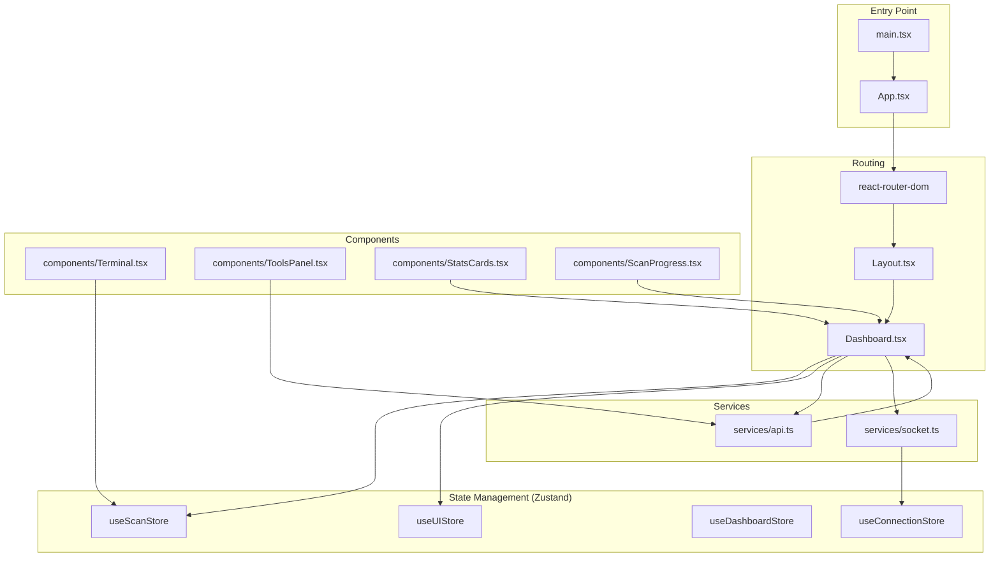
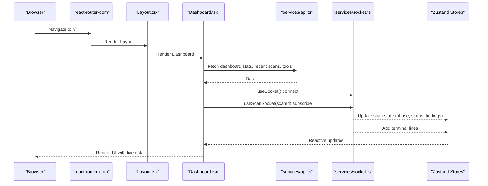
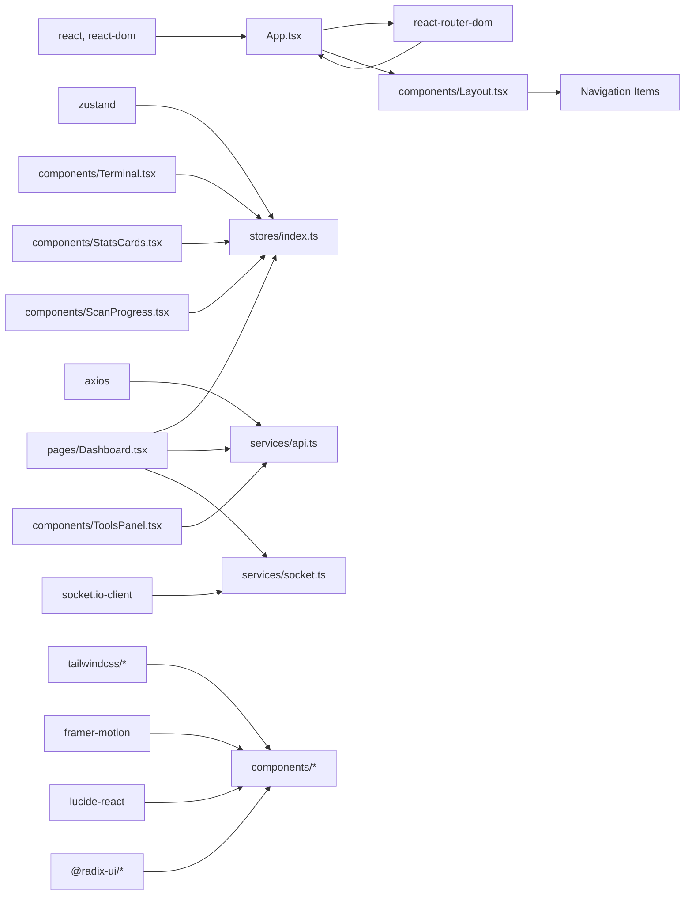

# Frontend Application

<cite>
**Referenced Files in This Document**
- [App.tsx](file://frontend/src/App.tsx)
- [main.tsx](file://frontend/src/main.tsx)
- [Dashboard.tsx](file://frontend/src/pages/Dashboard.tsx)
- [Layout.tsx](file://frontend/src/components/Layout.tsx)
- [Terminal.tsx](file://frontend/src/components/Terminal.tsx)
- [ToolsPanel.tsx](file://frontend/src/components/ToolsPanel.tsx)
- [StatsCards.tsx](file://frontend/src/components/StatsCards.tsx)
- [ScanProgress.tsx](file://frontend/src/components/ScanProgress.tsx)
- [hooks/index.ts](file://frontend/src/hooks/index.ts)
- [stores/index.ts](file://frontend/src/stores/index.ts)
- [services/api.ts](file://frontend/src/services/api.ts)
- [services/socket.ts](file://frontend/src/services/socket.ts)
- [config/index.ts](file://frontend/src/config/index.ts)
- [types/index.ts](file://frontend/src/types/index.ts)
- [lib/utils.ts](file://frontend/src/lib/utils.ts)
- [package.json](file://frontend/package.json)
</cite>

## Table of Contents
1. [Introduction](#introduction)
2. [Project Structure](#project-structure)
3. [Core Components](#core-components)
4. [Architecture Overview](#architecture-overview)
5. [Detailed Component Analysis](#detailed-component-analysis)
6. [Dependency Analysis](#dependency-analysis)
7. [Performance Considerations](#performance-considerations)
8. [Troubleshooting Guide](#troubleshooting-guide)
9. [Conclusion](#conclusion)
10. [Appendices](#appendices)

## Introduction
This document describes the React-based frontend application for the Optimus platform. It focuses on the dashboard interface built with React 18 and TypeScript, state management using Zustand, and routing patterns. It documents the layout system, navigation components, and the real-time terminal interface for displaying scan progress. It also provides usage examples with code snippet paths, WebSocket event handling, responsive design and accessibility guidelines, theming and styling customization with Tailwind CSS, and component lifecycle management. Integration with backend API endpoints and performance optimization techniques for large datasets are included.

## Project Structure
The frontend is organized around a clear separation of concerns:
- Pages: route-level views (Dashboard, Scan, Reports, Tools, Settings)
- Components: reusable UI widgets (Layout, Terminal, ToolsPanel, StatsCards, ScanProgress)
- Hooks: custom React hooks for state and effects (useSocket, useScanSocket, useDashboardData)
- Stores: global state managed with Zustand (scan, UI, dashboard, connection)
- Services: API and WebSocket clients
- Config: centralized configuration (API/WebSocket URLs, severity/phase/tool categories)
- Types: shared TypeScript interfaces and enums
- Lib: utility functions for formatting, animations, and helpers

**Diagram sources**
- [main.tsx](file://frontend/src/main.tsx#L1-L11)
- [App.tsx](file://frontend/src/App.tsx#L1-L187)
- [Layout.tsx](file://frontend/src/components/Layout.tsx#L1-L351)
- [Dashboard.tsx](file://frontend/src/pages/Dashboard.tsx#L1-L317)
- [stores/index.ts](file://frontend/src/stores/index.ts#L1-L318)
- [services/api.ts](file://frontend/src/services/api.ts#L1-L391)
- [services/socket.ts](file://frontend/src/services/socket.ts#L1-L237)
- [components/Terminal.tsx](file://frontend/src/components/Terminal.tsx#L1-L264)
- [components/ToolsPanel.tsx](file://frontend/src/components/ToolsPanel.tsx#L1-L488)
- [components/StatsCards.tsx](file://frontend/src/components/StatsCards.tsx#L1-L363)
- [components/ScanProgress.tsx](file://frontend/src/components/ScanProgress.tsx#L1-L349)

**Section sources**
- [main.tsx](file://frontend/src/main.tsx#L1-L11)
- [App.tsx](file://frontend/src/App.tsx#L1-L187)
- [Layout.tsx](file://frontend/src/components/Layout.tsx#L1-L351)
- [Dashboard.tsx](file://frontend/src/pages/Dashboard.tsx#L1-L317)
- [stores/index.ts](file://frontend/src/stores/index.ts#L1-L318)
- [services/api.ts](file://frontend/src/services/api.ts#L1-L391)
- [services/socket.ts](file://frontend/src/services/socket.ts#L1-L237)
- [components/Terminal.tsx](file://frontend/src/components/Terminal.tsx#L1-L264)
- [components/ToolsPanel.tsx](file://frontend/src/components/ToolsPanel.tsx#L1-L488)
- [components/StatsCards.tsx](file://frontend/src/components/StatsCards.tsx#L1-L363)
- [components/ScanProgress.tsx](file://frontend/src/components/ScanProgress.tsx#L1-L349)

## Core Components
- Layout: Provides responsive desktop/mobile navigation, active scan indicator, connection status, and top bar.
- Terminal: Real-time log viewer with filtering, auto-scroll, export, and expand/collapse modes.
- ToolsPanel: Tool discovery, filtering, categorization, and execution preview with confidence and warnings.
- StatsCards: Dashboard statistics cards and severity distribution visualization.
- ScanProgress: Visual timeline of scan phases with progress and metrics.
- Hooks: Centralized WebSocket connection management, scan-specific event subscriptions, and dashboard data fetching.
- Stores: Global state for scans, UI, dashboard metrics, and connection status.
- Services: Axios-based API client and Socket.IO client for real-time updates.
- Config: Environment-driven base URLs, limits, and UI constants.
- Types: Strongly typed models for scans, findings, tools, and WebSocket events.

**Section sources**
- [Layout.tsx](file://frontend/src/components/Layout.tsx#L1-L351)
- [Terminal.tsx](file://frontend/src/components/Terminal.tsx#L1-L264)
- [ToolsPanel.tsx](file://frontend/src/components/ToolsPanel.tsx#L1-L488)
- [StatsCards.tsx](file://frontend/src/components/StatsCards.tsx#L1-L363)
- [ScanProgress.tsx](file://frontend/src/components/ScanProgress.tsx#L1-L349)
- [hooks/index.ts](file://frontend/src/hooks/index.ts#L1-L369)
- [stores/index.ts](file://frontend/src/stores/index.ts#L1-L318)
- [services/api.ts](file://frontend/src/services/api.ts#L1-L391)
- [services/socket.ts](file://frontend/src/services/socket.ts#L1-L237)
- [config/index.ts](file://frontend/src/config/index.ts#L1-L135)
- [types/index.ts](file://frontend/src/types/index.ts#L1-L346)

## Architecture Overview
The application follows a unidirectional data flow:
- Pages subscribe to Zustand stores and fetch data via the API service.
- WebSocket events update the scan store and terminal output in real time.
- Components render UI and trigger actions (e.g., tool execution).
- Routing is handled by react-router-dom with nested layouts.

**Diagram sources**
- [App.tsx](file://frontend/src/App.tsx#L81-L161)
- [Layout.tsx](file://frontend/src/components/Layout.tsx#L43-L280)
- [Dashboard.tsx](file://frontend/src/pages/Dashboard.tsx#L33-L228)
- [hooks/index.ts](file://frontend/src/hooks/index.ts#L16-L56)
- [hooks/index.ts](file://frontend/src/hooks/index.ts#L62-L197)
- [services/api.ts](file://frontend/src/services/api.ts#L19-L57)
- [services/socket.ts](file://frontend/src/services/socket.ts#L64-L106)
- [stores/index.ts](file://frontend/src/stores/index.ts#L47-L151)

## Detailed Component Analysis

### Layout Component
Responsibilities:
- Desktop sidebar with collapsible navigation and active scan indicator.
- Mobile header with menu and status indicators.
- Top bar with page title and connection status.
- Background visual effects and backdrop blur.

Responsive behavior:
- Uses Tailwind utilities for breakpoints and transitions.
- Collapsible sidebar toggles margin and padding for main content.

Accessibility:
- Proper semantic markup with landmarks and focus management.
- Icons with descriptive labels via screen reader-friendly props.

Integration points:
- Reads UI and connection state from Zustand.
- Renders child routes via Outlet.

**Section sources**
- [Layout.tsx](file://frontend/src/components/Layout.tsx#L43-L280)
- [stores/index.ts](file://frontend/src/stores/index.ts#L184-L239)

### Terminal Component
Real-time logging:
- Subscribes to terminal lines from the scan store.
- Auto-scrolls to bottom when new lines arrive and user is at bottom.
- Scroll-to-bottom indicator appears when scrolled up.
- Filtering by type (all, errors, tools, info) and toolbar controls (export, clear, maximize/minimize).

Usage example (integration):
- Place inside the dashboard active scan card to visualize live output during scans.
- Configure maxHeight and autoScroll via props.

**Section sources**
- [Terminal.tsx](file://frontend/src/components/Terminal.tsx#L27-L181)
- [stores/index.ts](file://frontend/src/stores/index.ts#L47-L151)

### ToolsPanel Component
Capabilities:
- Loads available tools and categories.
- Live search and category filtering.
- Groups tools by category with color-coded labels.
- Tool card selection with availability and confidence.
- Tool details preview with command resolution, warnings, and execution button.
- Quick “scan for tools” refresh.

Execution flow:
- On selecting a tool and target, resolves command via API and displays preview.
- Executes tool via WebSocket when confirmed.

**Section sources**
- [ToolsPanel.tsx](file://frontend/src/components/ToolsPanel.tsx#L54-L266)
- [services/api.ts](file://frontend/src/services/api.ts#L158-L231)
- [services/socket.ts](file://frontend/src/services/socket.ts#L223-L232)

### StatsCards Component
Dashboard widgets:
- StatCard: animated cards with icons, trends, and subtle glow effects.
- StatsGrid: four-column grid for key metrics (active scans, total findings, critical, tools available).
- SeverityDistribution: stacked bar chart of findings by severity.
- SystemHealth: CPU/memory usage and active connections.
- MiniStat and MiniTerminal: compact variants for constrained spaces.

**Section sources**
- [StatsCards.tsx](file://frontend/src/components/StatsCards.tsx#L19-L169)
- [StatsCards.tsx](file://frontend/src/components/StatsCards.tsx#L175-L246)
- [StatsCards.tsx](file://frontend/src/components/StatsCards.tsx#L252-L363)

### ScanProgress Component
Visualization:
- Gradient progress bar and animated phase timeline.
- Current phase highlighted with pulsing dot.
- Stats row: coverage, findings, tools executed, phase time.
- Compact mode for smaller contexts.

**Section sources**
- [ScanProgress.tsx](file://frontend/src/components/ScanProgress.tsx#L44-L234)
- [ScanProgress.tsx](file://frontend/src/components/ScanProgress.tsx#L247-L291)

### Hooks and State Management
useSocket:
- Initializes WebSocket connection and tracks connection state.
- Subscribes to connection events and sets error messages.

useScanSocket:
- Joins scan room and listens to scan lifecycle events.
- Updates scan state, adds findings, and pushes terminal lines.
- Emits notifications for critical/high severity findings.

useDashboardData:
- Fetches dashboard stats, recent scans, and available tools concurrently.
- Handles loading and error states.

Zustand stores:
- useScanStore: current scan, terminal lines, findings, coverage, and execution history.
- useUIStore: sidebar state, theme, notifications, modals.
- useDashboardStore: dashboard metrics and lists.
- useConnectionStore: connection status and reconnect attempts.

**Section sources**
- [hooks/index.ts](file://frontend/src/hooks/index.ts#L16-L56)
- [hooks/index.ts](file://frontend/src/hooks/index.ts#L62-L197)
- [hooks/index.ts](file://frontend/src/hooks/index.ts#L203-L242)
- [stores/index.ts](file://frontend/src/stores/index.ts#L47-L151)
- [stores/index.ts](file://frontend/src/stores/index.ts#L184-L239)
- [stores/index.ts](file://frontend/src/stores/index.ts#L260-L277)
- [stores/index.ts](file://frontend/src/stores/index.ts#L295-L317)

### API and WebSocket Integration
API service:
- Axios client with request/response interceptors.
- Endpoints for scans, tools, reports, dashboard, metrics, and training.

WebSocket service:
- Singleton Socket.IO client with reconnection logic.
- Room-based subscriptions for scan updates.
- Typed event definitions for strong typing.

**Section sources**
- [services/api.ts](file://frontend/src/services/api.ts#L19-L57)
- [services/api.ts](file://frontend/src/services/api.ts#L63-L152)
- [services/api.ts](file://frontend/src/services/api.ts#L158-L231)
- [services/api.ts](file://frontend/src/services/api.ts#L237-L297)
- [services/api.ts](file://frontend/src/services/api.ts#L303-L347)
- [services/api.ts](file://frontend/src/services/api.ts#L353-L385)
- [services/socket.ts](file://frontend/src/services/socket.ts#L64-L106)
- [services/socket.ts](file://frontend/src/services/socket.ts#L165-L191)
- [services/socket.ts](file://frontend/src/services/socket.ts#L207-L232)

### Routing Patterns
- Nested layout under a root Layout component.
- Lazy loading with Suspense and ErrorBoundary at the app level.
- Dynamic routes for reports and settings.
- 404 handling via a wildcard route.

**Section sources**
- [App.tsx](file://frontend/src/App.tsx#L81-L161)

### Component Composition Patterns
- Dashboard composes StatsGrid, ScanProgress, Terminal, FindingsPanel, and QuickActions.
- ToolsPanel integrates with API and WebSocket for tool discovery and execution.
- Layout composes navigation items and status indicators.

**Section sources**
- [Dashboard.tsx](file://frontend/src/pages/Dashboard.tsx#L96-L225)
- [ToolsPanel.tsx](file://frontend/src/components/ToolsPanel.tsx#L54-L266)
- [Layout.tsx](file://frontend/src/components/Layout.tsx#L29-L37)

### Real-Time Terminal Interface
- Terminal receives live output via WebSocket events (tool_output, tool_execution_start/complete, scan_complete/error).
- Terminal filters and colors output by type (input, output, error, info, success, warning).
- Auto-scroll behavior maintains UX responsiveness.

**Section sources**
- [hooks/index.ts](file://frontend/src/hooks/index.ts#L98-L148)
- [Terminal.tsx](file://frontend/src/components/Terminal.tsx#L191-L231)

### Statistics Cards for Performance Metrics
- StatsGrid displays active scans, total findings, critical findings, and tools available.
- SeverityDistribution visualizes findings distribution with animated bars.
- SystemHealth shows CPU/memory usage and active connections.

**Section sources**
- [StatsCards.tsx](file://frontend/src/components/StatsCards.tsx#L126-L169)
- [StatsCards.tsx](file://frontend/src/components/StatsCards.tsx#L184-L246)
- [StatsCards.tsx](file://frontend/src/components/StatsCards.tsx#L293-L333)

### Tools Panel for Manual Tool Execution
- Filters tools by category and search term.
- Resolves commands and previews execution with warnings.
- Executes tools via WebSocket after confirmation.

**Section sources**
- [ToolsPanel.tsx](file://frontend/src/components/ToolsPanel.tsx#L96-L117)
- [ToolsPanel.tsx](file://frontend/src/components/ToolsPanel.tsx#L370-L392)
- [ToolsPanel.tsx](file://frontend/src/components/ToolsPanel.tsx#L463-L474)

### Theming and Styling Customization
- Tailwind CSS with custom color palette (neon accents, cyber backgrounds).
- cn utility merges Tailwind classes safely.
- Theme stored in UI store; sidebar state persisted.

**Section sources**
- [lib/utils.ts](file://frontend/src/lib/utils.ts#L13-L15)
- [stores/index.ts](file://frontend/src/stores/index.ts#L184-L239)
- [config/index.ts](file://frontend/src/config/index.ts#L15-L23)

### Responsive Design and Accessibility
- Responsive grid layouts and mobile-first navigation.
- Focus management and keyboard navigation support.
- Semantic HTML and ARIA-compliant components via Radix UI primitives.

**Section sources**
- [Layout.tsx](file://frontend/src/components/Layout.tsx#L154-L232)
- [StatsCards.tsx](file://frontend/src/components/StatsCards.tsx#L128-L169)

### Cross-Browser Compatibility
- Socket.IO client supports WebSocket and polling transports.
- Axios provides broad browser compatibility.
- Tailwind CSS prefixes ensure compatibility across browsers.

**Section sources**
- [services/socket.ts](file://frontend/src/services/socket.ts#L94-L100)
- [package.json](file://frontend/package.json#L29-L31)

### Performance Optimization Techniques
- Limit terminal log lines to config.maxLogLines.
- Debounce/throttle utilities for search and resize events.
- Memoization via React.memo and component-level optimizations.
- Concurrent rendering with Suspense and lazy loading.

**Section sources**
- [stores/index.ts](file://frontend/src/stores/index.ts#L140-L147)
- [lib/utils.ts](file://frontend/src/lib/utils.ts#L181-L207)

### Debugging Approaches
- Console logging in WebSocket service and hooks.
- Connection store tracks reconnect attempts and errors.
- Error boundaries wrap route renders for graceful failure handling.

**Section sources**
- [services/socket.ts](file://frontend/src/services/socket.ts#L140-L152)
- [hooks/index.ts](file://frontend/src/hooks/index.ts#L32-L42)
- [App.tsx](file://frontend/src/App.tsx#L86-L160)

## Dependency Analysis
External libraries:
- React 18, react-router-dom, framer-motion, lucide-react, zustand, axios, socket.io-client, tailwindcss ecosystem.

Internal dependencies:
- Pages depend on hooks and stores.
- Components depend on stores and services.
- Hooks depend on services and stores.
- Config and types are shared across modules.

**Diagram sources**
- [package.json](file://frontend/package.json#L12-L31)
- [App.tsx](file://frontend/src/App.tsx#L1-L12)
- [stores/index.ts](file://frontend/src/stores/index.ts#L1-L14)
- [services/api.ts](file://frontend/src/services/api.ts#L1-L13)
- [services/socket.ts](file://frontend/src/services/socket.ts#L1-L10)
- [components/Terminal.tsx](file://frontend/src/components/Terminal.tsx#L1-L14)
- [components/ToolsPanel.tsx](file://frontend/src/components/ToolsPanel.tsx#L1-L25)
- [components/StatsCards.tsx](file://frontend/src/components/StatsCards.tsx#L1-L13)
- [components/ScanProgress.tsx](file://frontend/src/components/ScanProgress.tsx#L1-L18)

**Section sources**
- [package.json](file://frontend/package.json#L12-L31)

## Performance Considerations
- Limit terminal output growth to avoid DOM bloat.
- Use virtualization for large lists (not currently implemented; consider react-window for findings).
- Batch updates to reduce re-renders.
- Prefer memoization for expensive computations (severity counts, distributions).
- Optimize image assets and SVGs for minimal bundle size.

## Troubleshooting Guide
Common issues and resolutions:
- WebSocket disconnections: Check reconnectAttempts and connectionError in the connection store; verify server connectivity.
- Terminal not updating: Ensure useScanSocket is subscribed to the current scan room and that events are being emitted.
- Tools not appearing: Confirm tools.getAvailable endpoint returns data and that the ToolsPanel is not filtered by category/search.
- Dashboard loading failures: Inspect useDashboardData error state and network tab for API failures.

**Section sources**
- [stores/index.ts](file://frontend/src/stores/index.ts#L295-L317)
- [hooks/index.ts](file://frontend/src/hooks/index.ts#L62-L197)
- [services/api.ts](file://frontend/src/services/api.ts#L158-L168)

## Conclusion
The frontend provides a modern, responsive, and real-time dashboard for managing autonomous penetration testing. It leverages React 18 with TypeScript, Zustand for state, and Socket.IO for live updates. The modular component architecture, strong typing, and clear separation of concerns enable maintainability and scalability. With thoughtful performance and accessibility practices, the application delivers a robust user experience across browsers.

## Appendices

### Backend API Endpoints Integration Examples
- Start a scan: [services/api.ts](file://frontend/src/services/api.ts#L67-L70)
- Get scan status: [services/api.ts](file://frontend/src/services/api.ts#L75-L78)
- Execute a tool: [services/api.ts](file://frontend/src/services/api.ts#L130-L141)
- Get available tools: [services/api.ts](file://frontend/src/services/api.ts#L162-L168)
- Generate report: [services/api.ts](file://frontend/src/services/api.ts#L241-L244)

### WebSocket Event Handling Examples
- Subscribe to scan updates: [hooks/index.ts](file://frontend/src/hooks/index.ts#L78-L95)
- Tool output handling: [hooks/index.ts](file://frontend/src/hooks/index.ts#L98-L104)
- Scan completion notification: [hooks/index.ts](file://frontend/src/hooks/index.ts#L136-L148)

### Component Lifecycle Management
- useSocket initializes and tears down WebSocket listeners: [hooks/index.ts](file://frontend/src/hooks/index.ts#L16-L56)
- useScanSocket joins/leaves rooms and manages cleanup: [hooks/index.ts](file://frontend/src/hooks/index.ts#L72-L196)
- Zustand selectors minimize re-renders: [stores/index.ts](file://frontend/src/stores/index.ts#L55-L77)