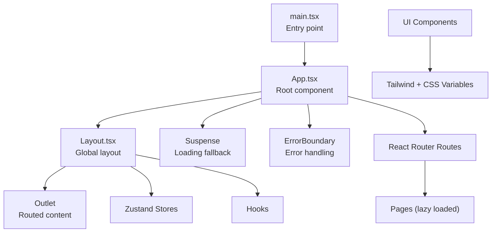
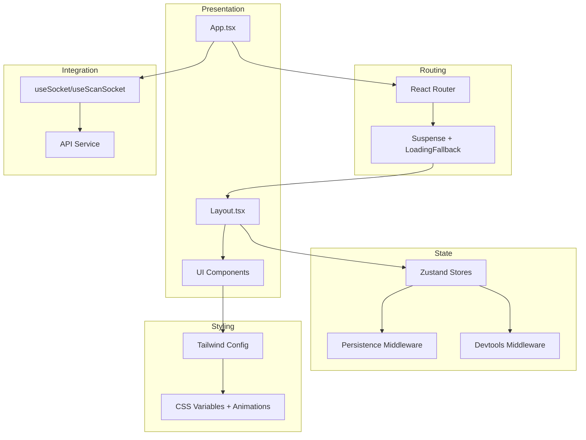
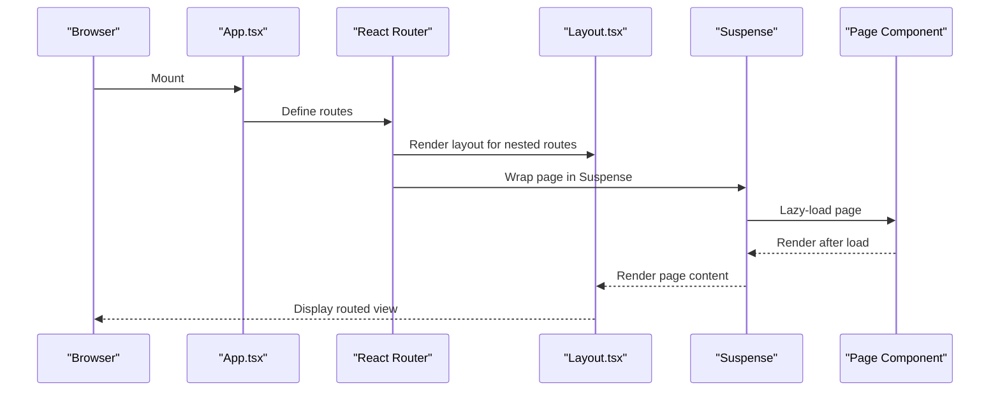
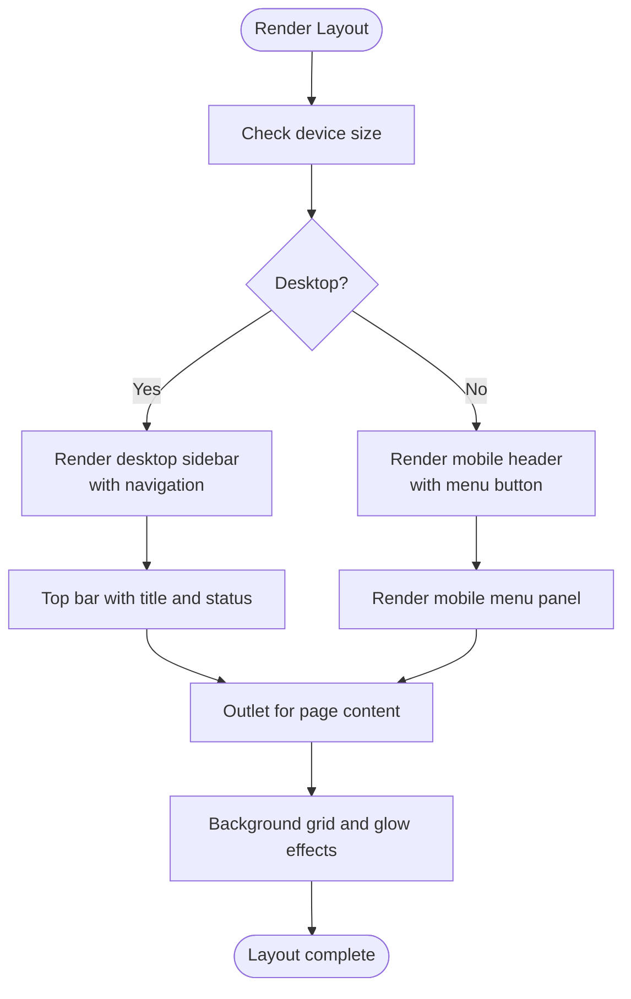
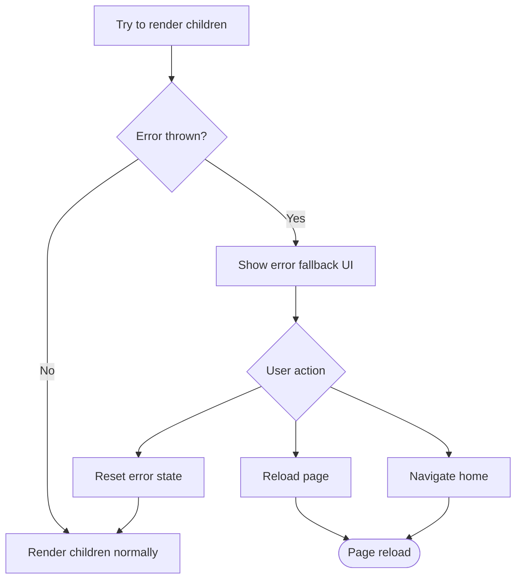
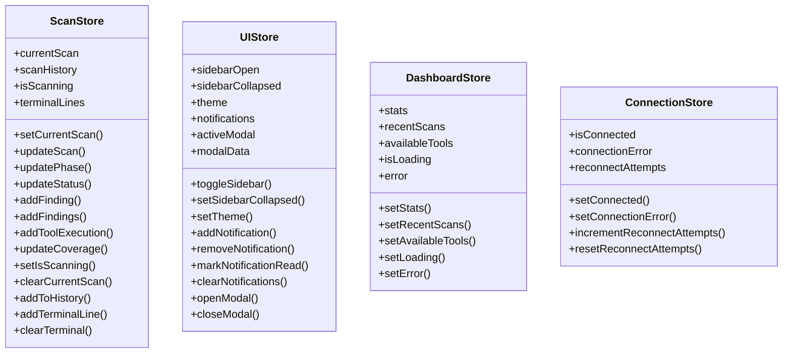
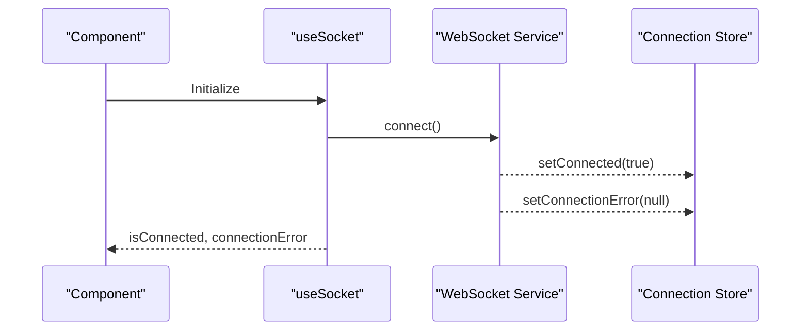
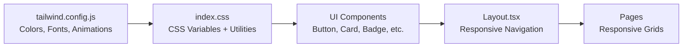
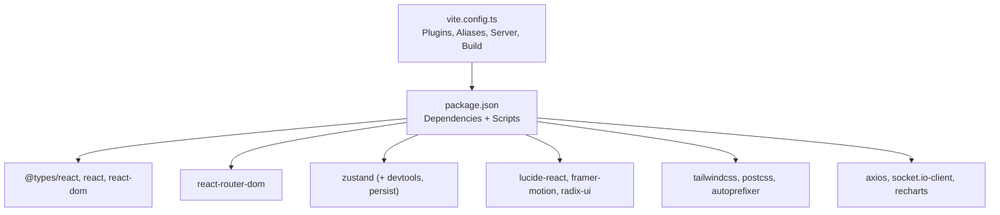

# React Application Architecture

<cite>
**Referenced Files in This Document**
- [App.tsx](file://frontend/src/App.tsx)
- [main.tsx](file://frontend/src/main.tsx)
- [Layout.tsx](file://frontend/src/components/Layout.tsx)
- [ErrorBoundary.tsx](file://frontend/src/components/ErrorBoundary.tsx)
- [stores/index.ts](file://frontend/src/stores/index.ts)
- [hooks/index.ts](file://frontend/src/hooks/index.ts)
- [vite.config.ts](file://frontend/vite.config.ts)
- [package.json](file://frontend/package.json)
- [tsconfig.json](file://frontend/tsconfig.json)
- [index.css](file://frontend/src/index.css)
- [tailwind.config.js](file://frontend/tailwind.config.js)
- [components/ui/index.tsx](file://frontend/src/components/ui/index.tsx)
- [pages/index.ts](file://frontend/src/pages/index.ts)
</cite>

## Table of Contents
1. [Introduction](#introduction)
2. [Project Structure](#project-structure)
3. [Core Components](#core-components)
4. [Architecture Overview](#architecture-overview)
5. [Detailed Component Analysis](#detailed-component-analysis)
6. [Dependency Analysis](#dependency-analysis)
7. [Performance Considerations](#performance-considerations)
8. [Troubleshooting Guide](#troubleshooting-guide)
9. [Conclusion](#conclusion)
10. [Appendices](#appendices)

## Introduction
This document describes the React application architecture for the Optimus frontend. It covers the component hierarchy starting from the root App component, routing configuration with React Router, error boundaries, and suspense-based loading patterns. It documents the main layout system using Layout as the primary container, navigation structure, and component composition patterns. It also explains the TypeScript configuration, build process with Vite, and dependency management via package.json. The cyberpunk-themed UI design system, color palette, and responsive design patterns are detailed, along with routing structure using lazy loading, error handling strategies, fallback components, component lifecycle management, state initialization patterns, and integrations with external libraries such as Zustand for state management.

## Project Structure
The frontend is organized around a clear separation of concerns:
- Root entry renders the application inside React Strict Mode.
- App configures routing with nested layouts and suspense fallbacks.
- Layout provides the global navigation, responsive sidebar, and page outlet.
- Stores encapsulate state using Zustand with persistence and development tools.
- Hooks manage WebSocket connections, scan events, and common UI behaviors.
- UI components provide a reusable design system integrated with Tailwind and custom CSS.
- Pages represent route-specific views.

**Diagram sources**
- [main.tsx](file://frontend/src/main.tsx#L1-L11)
- [App.tsx](file://frontend/src/App.tsx#L1-L187)
- [Layout.tsx](file://frontend/src/components/Layout.tsx#L1-L351)
- [ErrorBoundary.tsx](file://frontend/src/components/ErrorBoundary.tsx#L1-L150)
- [stores/index.ts](file://frontend/src/stores/index.ts#L1-L318)
- [hooks/index.ts](file://frontend/src/hooks/index.ts#L1-L369)
- [components/ui/index.tsx](file://frontend/src/components/ui/index.tsx#L1-L461)

**Section sources**
- [main.tsx](file://frontend/src/main.tsx#L1-L11)
- [App.tsx](file://frontend/src/App.tsx#L1-L187)
- [Layout.tsx](file://frontend/src/components/Layout.tsx#L1-L351)

## Core Components
- App: Configures routing, wraps the entire app in an error boundary, and sets up suspense loading for all routes except the 404 page.
- Layout: Provides desktop/mobile navigation, active scan indicator, connection status, and the main content area with Outlet for nested routes.
- ErrorBoundary: Implements a class-based error boundary with fallback UI and reset/reload/home actions.
- UI Components: Reusable primitives (Button, Card, Input, Badge, Progress, StatusIndicator, Toast, Spinner, Skeleton, Divider) styled with Tailwind and custom CSS.
- Stores: Zustand stores for scan state, UI state, dashboard data, and connection state with persistence and devtools.
- Hooks: WebSocket management, scan event handling, dashboard data fetching, and common utilities (debounce, interval, localStorage, click-outside, key press, clipboard).

**Section sources**
- [App.tsx](file://frontend/src/App.tsx#L81-L161)
- [Layout.tsx](file://frontend/src/components/Layout.tsx#L43-L280)
- [ErrorBoundary.tsx](file://frontend/src/components/ErrorBoundary.tsx#L20-L101)
- [components/ui/index.tsx](file://frontend/src/components/ui/index.tsx#L12-L461)
- [stores/index.ts](file://frontend/src/stores/index.ts#L47-L317)
- [hooks/index.ts](file://frontend/src/hooks/index.ts#L16-L369)

## Architecture Overview
The application follows a layered architecture:
- Presentation Layer: App, Layout, and UI components.
- Routing Layer: React Router with nested routes and suspense-based lazy loading.
- State Management Layer: Zustand stores with middleware for persistence and devtools.
- Integration Layer: WebSocket hooks for real-time scan updates and API service integration.
- Styling Layer: Tailwind CSS with custom CSS variables and animations for a cyberpunk aesthetic.

**Diagram sources**
- [App.tsx](file://frontend/src/App.tsx#L81-L161)
- [Layout.tsx](file://frontend/src/components/Layout.tsx#L43-L280)
- [ErrorBoundary.tsx](file://frontend/src/components/ErrorBoundary.tsx#L20-L101)
- [stores/index.ts](file://frontend/src/stores/index.ts#L47-L317)
- [hooks/index.ts](file://frontend/src/hooks/index.ts#L16-L197)
- [components/ui/index.tsx](file://frontend/src/components/ui/index.tsx#L12-L461)
- [tailwind.config.js](file://frontend/tailwind.config.js#L1-L102)
- [index.css](file://frontend/src/index.css#L1-L348)

## Detailed Component Analysis

### App Component and Routing
- Wraps the application in an error boundary.
- Uses React Router to define nested routes under the Layout container.
- Applies Suspense with a loading fallback for all routes except the 404 page.
- Includes a placeholder Intelligence page and a 404 handler.

**Diagram sources**
- [App.tsx](file://frontend/src/App.tsx#L81-L161)
- [Layout.tsx](file://frontend/src/components/Layout.tsx#L267-L269)

**Section sources**
- [App.tsx](file://frontend/src/App.tsx#L81-L161)
- [pages/index.ts](file://frontend/src/pages/index.ts#L1-L7)

### Layout Component and Navigation
- Provides a responsive layout with desktop sidebar and mobile menu.
- Integrates navigation items with active state highlighting.
- Shows active scan indicator and connection status.
- Renders the page content via Outlet and includes background effects.

**Diagram sources**
- [Layout.tsx](file://frontend/src/components/Layout.tsx#L43-L280)

**Section sources**
- [Layout.tsx](file://frontend/src/components/Layout.tsx#L29-L37)
- [Layout.tsx](file://frontend/src/components/Layout.tsx#L43-L280)

### Error Boundary and Fallbacks
- Implements a class-based error boundary with reset/reload/home actions.
- Provides a page-level fallback and a global loading spinner.
- Displays error details and component stack for debugging.

**Diagram sources**
- [ErrorBoundary.tsx](file://frontend/src/components/ErrorBoundary.tsx#L20-L101)
- [ErrorBoundary.tsx](file://frontend/src/components/ErrorBoundary.tsx#L138-L147)

**Section sources**
- [ErrorBoundary.tsx](file://frontend/src/components/ErrorBoundary.tsx#L20-L101)
- [ErrorBoundary.tsx](file://frontend/src/components/ErrorBoundary.tsx#L107-L147)

### Zustand Stores and State Initialization
- Scan store manages current scan, history, terminal output, and status.
- UI store handles sidebar state, theme, notifications, and modals.
- Dashboard store holds stats, recent scans, available tools, and loading/error states.
- Connection store tracks connectivity and reconnection attempts.
- Persistence middleware persists UI preferences; devtools middleware enables debugging.

**Diagram sources**
- [stores/index.ts](file://frontend/src/stores/index.ts#L47-L151)
- [stores/index.ts](file://frontend/src/stores/index.ts#L184-L239)
- [stores/index.ts](file://frontend/src/stores/index.ts#L260-L277)
- [stores/index.ts](file://frontend/src/stores/index.ts#L295-L317)

**Section sources**
- [stores/index.ts](file://frontend/src/stores/index.ts#L47-L151)
- [stores/index.ts](file://frontend/src/stores/index.ts#L184-L239)
- [stores/index.ts](file://frontend/src/stores/index.ts#L260-L277)
- [stores/index.ts](file://frontend/src/stores/index.ts#L295-L317)

### Hooks: WebSocket and Data Fetching
- useSocket initializes and manages WebSocket connection, updating connection state.
- useScanSocket subscribes to scan-related events, updating scan state and terminal output.
- useDashboardData fetches dashboard statistics, recent scans, and available tools concurrently.

**Diagram sources**
- [hooks/index.ts](file://frontend/src/hooks/index.ts#L16-L56)

**Section sources**
- [hooks/index.ts](file://frontend/src/hooks/index.ts#L16-L56)
- [hooks/index.ts](file://frontend/src/hooks/index.ts#L62-L197)
- [hooks/index.ts](file://frontend/src/hooks/index.ts#L203-L242)

### UI Design System and Responsive Patterns
- Tailwind configuration defines cyber and neon color palettes, custom fonts, animations, and gradients.
- CSS variables provide consistent theming across components.
- UI primitives support multiple variants and sizes, integrating with motion animations and responsive utilities.

**Diagram sources**
- [tailwind.config.js](file://frontend/tailwind.config.js#L1-L102)
- [index.css](file://frontend/src/index.css#L1-L348)
- [components/ui/index.tsx](file://frontend/src/components/ui/index.tsx#L12-L461)
- [Layout.tsx](file://frontend/src/components/Layout.tsx#L43-L280)

**Section sources**
- [tailwind.config.js](file://frontend/tailwind.config.js#L9-L98)
- [index.css](file://frontend/src/index.css#L5-L156)
- [components/ui/index.tsx](file://frontend/src/components/ui/index.tsx#L12-L461)

## Dependency Analysis
- Build toolchain: Vite with React plugin, path aliases, and development server configuration.
- Runtime dependencies: React, React Router DOM, Framer Motion, Lucide icons, Zustand, Radix UI, Axios, Socket.IO client, Recharts.
- Development dependencies: TypeScript, ESLint, PostCSS, Tailwind CSS, React plugin for Vite.
- Path aliases configured to resolve @/ paths to src.

**Diagram sources**
- [vite.config.ts](file://frontend/vite.config.ts#L1-L39)
- [package.json](file://frontend/package.json#L1-L50)

**Section sources**
- [vite.config.ts](file://frontend/vite.config.ts#L6-L39)
- [package.json](file://frontend/package.json#L6-L48)
- [tsconfig.json](file://frontend/tsconfig.json#L1-L26)

## Performance Considerations
- Suspense-based lazy loading ensures fast initial loads and improved perceived performance.
- Zustand stores use middleware for persistence and devtools; consider selective persistence to avoid bloating storage.
- WebSocket subscriptions are scoped per component lifecycle to prevent leaks.
- Tailwind utilities and CSS variables minimize runtime style computations.
- Consider code splitting for heavy pages and deferring non-critical assets.

## Troubleshooting Guide
- Error Boundary: Use the fallback UI to diagnose rendering errors; leverage reset, reload, and home actions to recover quickly.
- Connection Issues: useSocket updates connection state; inspect connectionError and reconnectAttempts in the connection store.
- Scan Events: useScanSocket logs terminal output and updates; verify room subscription and event handlers.
- Build Issues: Confirm Vite aliases and server proxy settings; ensure TypeScript strictness and module resolution are correct.

**Section sources**
- [ErrorBoundary.tsx](file://frontend/src/components/ErrorBoundary.tsx#L20-L101)
- [hooks/index.ts](file://frontend/src/hooks/index.ts#L16-L56)
- [hooks/index.ts](file://frontend/src/hooks/index.ts#L62-L197)
- [vite.config.ts](file://frontend/vite.config.ts#L13-L34)
- [tsconfig.json](file://frontend/tsconfig.json#L14-L21)

## Conclusion
The Optimus frontend employs a clean, modular architecture leveraging React Router for routing, Suspense for loading, and Zustand for state management. The cyberpunk-themed UI integrates Tailwind and custom CSS to deliver a cohesive, responsive experience. Error boundaries and hooks provide robust error handling and real-time integration. The build pipeline with Vite and TypeScript ensures a modern, maintainable development workflow.

## Appendices

### Routing Structure and Lazy Loading
- Routes are defined under the Layout container with Suspense wrapping each page.
- 404 route is handled explicitly for unmatched paths.
- Pages are exported via a centralized index for easy imports.

**Section sources**
- [App.tsx](file://frontend/src/App.tsx#L88-L156)
- [pages/index.ts](file://frontend/src/pages/index.ts#L1-L7)

### TypeScript Configuration
- Strict mode enabled with unused locals/parameters and exhaustive switch checks.
- Bundler module resolution and JSX runtime configured for Vite.
- Path aliases mapped to src for clean imports.

**Section sources**
- [tsconfig.json](file://frontend/tsconfig.json#L2-L25)

### Build and Environment
- Vite dev server runs on port 5173 with strict port enforcement.
- Proxy configured for API, WebSocket, and health endpoints to backend.
- Production build outputs to dist with source maps enabled.

**Section sources**
- [vite.config.ts](file://frontend/vite.config.ts#L13-L39)