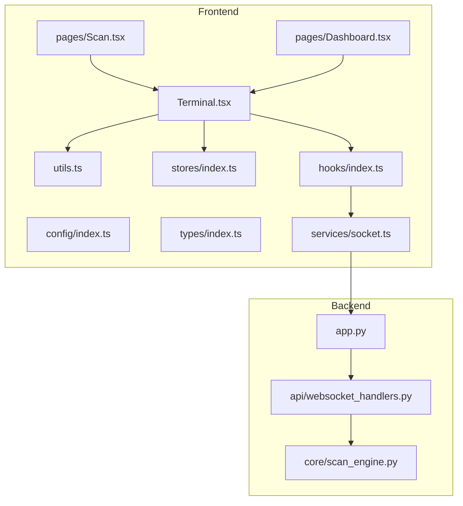
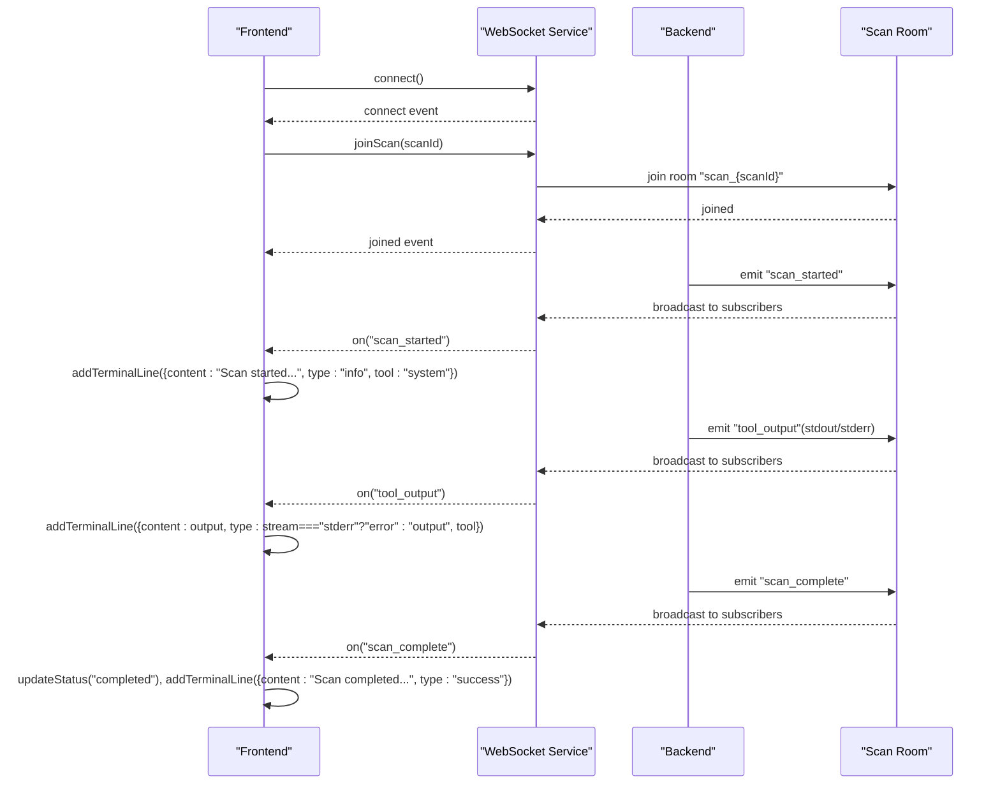
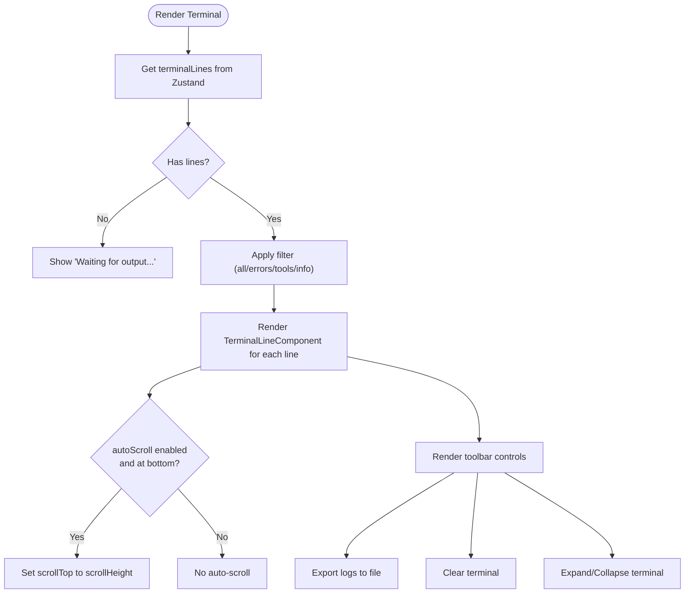
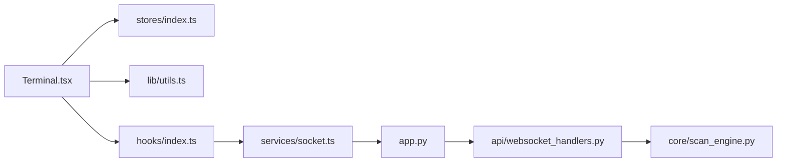

# Terminal Interface

<cite>
**Referenced Files in This Document**
- [Terminal.tsx](file://frontend/src/components/Terminal.tsx)
- [socket.ts](file://frontend/src/services/socket.ts)
- [index.ts](file://frontend/src/stores/index.ts)
- [index.ts](file://frontend/src/hooks/index.ts)
- [index.ts](file://frontend/src/config/index.ts)
- [index.ts](file://frontend/src/types/index.ts)
- [utils.ts](file://frontend/src/lib/utils.ts)
- [Scan.tsx](file://frontend/src/pages/Scan.tsx)
- [Dashboard.tsx](file://frontend/src/pages/Dashboard.tsx)
- [websocket_handlers.py](file://backend/api/websocket_handlers.py)
- [app.py](file://backend/app.py)
- [scan_engine.py](file://backend/core/scan_engine.py)
</cite>

## Table of Contents
1. [Introduction](#introduction)
2. [Project Structure](#project-structure)
3. [Core Components](#core-components)
4. [Architecture Overview](#architecture-overview)
5. [Detailed Component Analysis](#detailed-component-analysis)
6. [Dependency Analysis](#dependency-analysis)
7. [Performance Considerations](#performance-considerations)
8. [Troubleshooting Guide](#troubleshooting-guide)
9. [Conclusion](#conclusion)

## Introduction
This document provides comprehensive documentation for the terminal interface component responsible for real-time output display during scans. It covers the Terminal.tsx component's implementation of a pseudo-terminal interface, command input handling, and output streaming. It explains the WebSocket integration for real-time communication with the backend, including connection management, message parsing, and error handling. It details the terminal's role in displaying scan progress, tool execution outputs, and system messages, along with state management integration using Zustand stores, data flow patterns, and component lifecycle. Examples of terminal command processing, output formatting, and scroll management for large output streams are included, alongside performance considerations for handling continuous data streams, memory management for long-running scans, and user interaction patterns. Finally, it documents the integration with the backend's WebSocket handlers and real-time event broadcasting system.

## Project Structure
The terminal interface spans three primary areas:
- Frontend terminal component and supporting utilities
- WebSocket service and hooks for real-time communication
- Zustand stores for state management and configuration

**Diagram sources**
- [Terminal.tsx](file://frontend/src/components/Terminal.tsx#L1-L264)
- [socket.ts](file://frontend/src/services/socket.ts#L1-L237)
- [index.ts](file://frontend/src/stores/index.ts#L1-L318)
- [index.ts](file://frontend/src/hooks/index.ts#L1-L369)
- [index.ts](file://frontend/src/config/index.ts#L1-L135)
- [index.ts](file://frontend/src/types/index.ts#L1-L346)
- [utils.ts](file://frontend/src/lib/utils.ts#L1-L266)
- [Scan.tsx](file://frontend/src/pages/Scan.tsx#L1-L495)
- [Dashboard.tsx](file://frontend/src/pages/Dashboard.tsx#L95-L134)
- [app.py](file://backend/app.py#L1-L200)
- [websocket_handlers.py](file://backend/api/websocket_handlers.py#L1-L115)
- [scan_engine.py](file://backend/core/scan_engine.py#L1-L200)

**Section sources**
- [Terminal.tsx](file://frontend/src/components/Terminal.tsx#L1-L264)
- [socket.ts](file://frontend/src/services/socket.ts#L1-L237)
- [index.ts](file://frontend/src/stores/index.ts#L1-L318)
- [index.ts](file://frontend/src/hooks/index.ts#L1-L369)
- [index.ts](file://frontend/src/config/index.ts#L1-L135)
- [index.ts](file://frontend/src/types/index.ts#L1-L346)
- [utils.ts](file://frontend/src/lib/utils.ts#L1-L266)
- [Scan.tsx](file://frontend/src/pages/Scan.tsx#L1-L495)
- [Dashboard.tsx](file://frontend/src/pages/Dashboard.tsx#L95-L134)
- [app.py](file://backend/app.py#L1-L200)
- [websocket_handlers.py](file://backend/api/websocket_handlers.py#L1-L115)
- [scan_engine.py](file://backend/core/scan_engine.py#L1-L200)

## Core Components
- Terminal component: Renders real-time scan output with filtering, auto-scroll, export, and expand/collapse capabilities.
- WebSocket service: Singleton managing connection lifecycle, reconnection, and event subscriptions.
- Zustand stores: Centralized state for scan data and terminal lines with memory limits.
- Hooks: Connection management and scan-specific event handling.
- Utilities: Formatting, export, and helper functions.

Key responsibilities:
- Terminal.tsx: Renders terminal lines, manages scroll behavior, filters output, and exposes toolbar actions.
- socket.ts: Provides connection, reconnection, room joining/leaving, and event emission.
- stores/index.ts: Maintains terminalLines with capped length and exposes actions to add/clear lines.
- hooks/index.ts: Subscribes to WebSocket events and updates stores accordingly.
- utils.ts: Formats timestamps, exports logs, and provides helpers.

**Section sources**
- [Terminal.tsx](file://frontend/src/components/Terminal.tsx#L1-L264)
- [socket.ts](file://frontend/src/services/socket.ts#L64-L237)
- [index.ts](file://frontend/src/stores/index.ts#L47-L151)
- [index.ts](file://frontend/src/hooks/index.ts#L16-L196)
- [utils.ts](file://frontend/src/lib/utils.ts#L39-L234)

## Architecture Overview
The terminal integrates with the backend via WebSocket rooms keyed by scan_id. The backend emits events for scan lifecycle, tool execution, and findings. The frontend subscribes to these events, updates Zustand stores, and renders terminal output in real time.

**Diagram sources**
- [socket.ts](file://frontend/src/services/socket.ts#L83-L106)
- [socket.ts](file://frontend/src/services/socket.ts#L207-L218)
- [index.ts](file://frontend/src/hooks/index.ts#L72-L196)
- [websocket_handlers.py](file://backend/api/websocket_handlers.py#L23-L42)
- [websocket_handlers.py](file://backend/api/websocket_handlers.py#L48-L56)
- [scan_engine.py](file://backend/core/scan_engine.py#L130-L148)

## Detailed Component Analysis

### Terminal Component
The Terminal component renders a styled terminal body with optional toolbar controls. It:
- Uses Zustand to access terminalLines and clearTerminal
- Implements auto-scroll when at bottom and new lines arrive
- Tracks scroll position to show a "scroll to bottom" button when scrolled up
- Filters lines by type (all, errors, tools, info) and supports export to file
- Supports expand/collapse to fullscreen mode

Rendering highlights:
- TerminalLineComponent applies type-specific colors and prefixes
- Uses AnimatePresence for smooth line additions/removals
- Toolbar includes filter dropdown, export, clear, and maximize/minimize buttons

**Diagram sources**
- [Terminal.tsx](file://frontend/src/components/Terminal.tsx#L33-L75)
- [Terminal.tsx](file://frontend/src/components/Terminal.tsx#L162-L167)
- [Terminal.tsx](file://frontend/src/components/Terminal.tsx#L191-L231)

**Section sources**
- [Terminal.tsx](file://frontend/src/components/Terminal.tsx#L27-L181)
- [Terminal.tsx](file://frontend/src/components/Terminal.tsx#L191-L231)

### WebSocket Integration
The SocketService singleton manages:
- Connection establishment with reconnection policy
- Event subscription/unsubscription with internal listener registry
- Room management via joinScan/leaveScan
- Emitting commands to backend (execute_tool, request_tool_recommendation)

Connection lifecycle:
- connect() initializes socket with transports, reconnection attempts/delay, and timeout
- setupDefaultListeners() registers connect/disconnect/connect_error handlers and re-registers stored listeners on reconnect
- isConnected() and getSocket() provide connection status and socket instance
- emit() safely emits events only when connected

Room management:
- joinScan(scanId) emits "join_scan" and logs room join
- leaveScan(scanId) emits "leave_scan" and logs room leave

**Section sources**
- [socket.ts](file://frontend/src/services/socket.ts#L64-L106)
- [socket.ts](file://frontend/src/services/socket.ts#L137-L160)
- [socket.ts](file://frontend/src/services/socket.ts#L165-L191)
- [socket.ts](file://frontend/src/services/socket.ts#L207-L218)
- [socket.ts](file://frontend/src/services/socket.ts#L223-L232)

### Zustand Store Integration
The scan store maintains:
- terminalLines array with automatic ID and timestamp generation
- Memory management by keeping only the most recent N lines (config.maxLogLines)
- Actions to addTerminalLine and clearTerminal

Behavior:
- addTerminalLine creates a new TerminalLine with id and timestamp, appends to array, and trims to maxLogLines
- clearTerminal resets terminalLines to empty
- The store is persisted for UI preferences in other stores but terminalLines is intentionally kept in-memory

**Section sources**
- [index.ts](file://frontend/src/stores/index.ts#L47-L151)
- [index.ts](file://frontend/src/stores/index.ts#L132-L147)
- [index.ts](file://frontend/src/config/index.ts#L20-L23)

### Hooks and Real-Time Event Handling
The useSocket hook:
- Initializes connection on first render
- Updates connection store on connect/disconnect/connect_error
- Returns connection state and socket instance

The useScanSocket hook:
- Subscribes to scan-specific events when scanId is present
- Joins the scan room on mount and leaves on unmount
- Translates backend events into terminal lines and UI updates:
  - phase_transition -> info line with tool "system"
  - scan_update -> update status and coverage, append findings
  - tool_output -> append output/error line with tool name
  - tool_execution_start/complete -> info/success/warning lines
  - finding_discovered -> add finding and notification for critical/high
  - scan_complete -> success line and notification
  - scan_error -> error line and notification
  - tool_resolution/tool_blocked -> info/warning lines

**Section sources**
- [index.ts](file://frontend/src/hooks/index.ts#L16-L56)
- [index.ts](file://frontend/src/hooks/index.ts#L62-L196)

### Backend WebSocket Handlers and Event Emission
Backend registration:
- Registers handlers for "connect", "disconnect", "join_scan", "leave_scan", and "ping"
- Emits "joined" and "left" confirmations upon room join/leave

Real-time events emitted by backend:
- "scan_started", "phase_transition", "tool_execution_start", "tool_output", "scan_update", "scan_complete", "scan_error"
- Hybrid tool system events: "tool_resolution", "tool_executing", "tool_complete", "tool_error", "tool_fallback", "tool_warning", "tool_blocked", "tool_discovery"

Scan engine integration:
- Uses socketio.start_background_task to emit events to the "scan_{scan_id}" room
- Emits scan_started, phase transitions, scan_complete, and scan_error
- Uses correlation_id from scan state for logging and event context

**Section sources**
- [websocket_handlers.py](file://backend/api/websocket_handlers.py#L9-L115)
- [websocket_handlers.py](file://backend/api/websocket_handlers.py#L59-L114)
- [scan_engine.py](file://backend/core/scan_engine.py#L130-L148)
- [scan_engine.py](file://backend/core/scan_engine.py#L311-L344)
- [scan_engine.py](file://backend/core/scan_engine.py#L346-L364)

### Terminal Command Processing and Output Formatting
Command processing:
- Commands are sent via socketService.executeTool(scanId, tool, target, options)
- Tool execution events are handled by useScanSocket to update terminal and UI

Output formatting:
- TerminalLineComponent applies type-specific colors and prefixes
- Timestamps are formatted via utils.formatTimestamp
- Tool name is shown in brackets when present
- Filtering supports "all", "errors", "tools", and explicit types

Scroll management:
- Auto-scroll to bottom when isAtBottom is true
- Scroll indicator appears when scrolled above bottom threshold
- Manual scrollToBottom action available

**Section sources**
- [socket.ts](file://frontend/src/services/socket.ts#L223-L225)
- [index.ts](file://frontend/src/hooks/index.ts#L107-L121)
- [Terminal.tsx](file://frontend/src/components/Terminal.tsx#L191-L231)
- [utils.ts](file://frontend/src/lib/utils.ts#L39-L48)
- [Terminal.tsx](file://frontend/src/components/Terminal.tsx#L47-L52)
- [Terminal.tsx](file://frontend/src/components/Terminal.tsx#L71-L75)

### Component Lifecycle and User Interactions
Lifecycle:
- Terminal mounts and subscribes to Zustand terminalLines
- useSocket establishes connection on first render
- useScanSocket joins room and subscribes to events when scanId is available

User interactions:
- Toolbar actions: filter, export logs, clear terminal, expand/collapse
- Scroll indicator triggers immediate scroll to bottom
- Fullscreen expansion overlays terminal across viewport

Integration points:
- Scan page embeds Terminal with maxHeight configuration
- Dashboard shows Terminal when scanning is active

**Section sources**
- [Terminal.tsx](file://frontend/src/components/Terminal.tsx#L33-L44)
- [index.ts](file://frontend/src/hooks/index.ts#L16-L56)
- [index.ts](file://frontend/src/hooks/index.ts#L62-L76)
- [Scan.tsx](file://frontend/src/pages/Scan.tsx#L423-L427)
- [Dashboard.tsx](file://frontend/src/pages/Dashboard.tsx#L129-L133)

## Dependency Analysis
The terminal depends on:
- Zustand stores for state
- WebSocket service for real-time events
- Utilities for formatting and exporting
- Hooks for connection and scan event handling
- Backend WebSocket handlers for event broadcasting

**Diagram sources**
- [Terminal.tsx](file://frontend/src/components/Terminal.tsx#L1-L14)
- [index.ts](file://frontend/src/stores/index.ts#L1-L15)
- [utils.ts](file://frontend/src/lib/utils.ts#L1-L5)
- [index.ts](file://frontend/src/hooks/index.ts#L1-L10)
- [socket.ts](file://frontend/src/services/socket.ts#L1-L10)
- [app.py](file://backend/app.py#L151-L163)
- [websocket_handlers.py](file://backend/api/websocket_handlers.py#L1-L10)
- [scan_engine.py](file://backend/core/scan_engine.py#L26-L42)

**Section sources**
- [Terminal.tsx](file://frontend/src/components/Terminal.tsx#L1-L14)
- [index.ts](file://frontend/src/stores/index.ts#L1-L15)
- [utils.ts](file://frontend/src/lib/utils.ts#L1-L5)
- [index.ts](file://frontend/src/hooks/index.ts#L1-L10)
- [socket.ts](file://frontend/src/services/socket.ts#L1-L10)
- [app.py](file://backend/app.py#L151-L163)
- [websocket_handlers.py](file://backend/api/websocket_handlers.py#L1-L10)
- [scan_engine.py](file://backend/core/scan_engine.py#L26-L42)

## Performance Considerations
- Memory management: The terminalLines array is trimmed to config.maxLogLines to prevent unbounded growth. This ensures long-running scans remain responsive.
- Rendering efficiency: AnimatePresence minimizes DOM churn when adding/removing lines. Consider virtualization for very large datasets.
- Auto-scroll optimization: Auto-scroll only occurs when isAtBottom is true, preventing unnecessary layout thrashing when users scroll up.
- WebSocket reconnection: Reconnection attempts and delays are configurable to balance resilience and resource usage.
- Backend event batching: The backend emits events per tool output chunk; consider aggregating small chunks on the backend if needed to reduce event volume.

[No sources needed since this section provides general guidance]

## Troubleshooting Guide
Common issues and resolutions:
- Connection failures: useSocket hook updates connection store on connect_error; inspect connectionError state and reconnectAttempts.
- Missing events: Verify scanId is present and useScanSocket has joined the room; ensure backend emits to "scan_{scan_id}" room.
- Excessive memory usage: Confirm maxLogLines configuration and trimming logic in addTerminalLine.
- Export failures: downloadFile uses Blob and URL.createObjectURL; ensure browser support and permissions.
- Scroll behavior anomalies: Check isAtBottom calculation and handleScroll logic; ensure scrollRef is attached.

**Section sources**
- [index.ts](file://frontend/src/hooks/index.ts#L16-L56)
- [index.ts](file://frontend/src/hooks/index.ts#L62-L76)
- [index.ts](file://frontend/src/config/index.ts#L20-L23)
- [utils.ts](file://frontend/src/lib/utils.ts#L224-L234)
- [Terminal.tsx](file://frontend/src/components/Terminal.tsx#L47-L52)

## Conclusion
The terminal interface provides a robust, real-time display of scan outputs with efficient state management and WebSocket-driven updates. Its modular design integrates cleanly with Zustand stores, the WebSocket service, and backend event handlers. With built-in filtering, export, and scroll management, it supports both casual monitoring and intensive scanning scenarios. Proper configuration of reconnection and memory limits ensures reliability and performance for long-running operations.