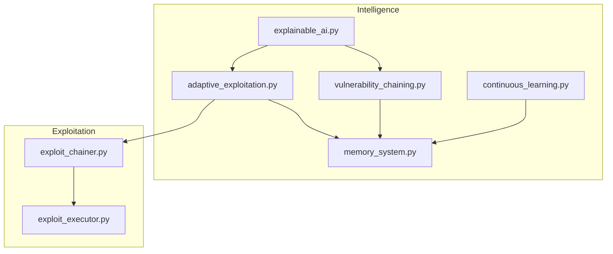
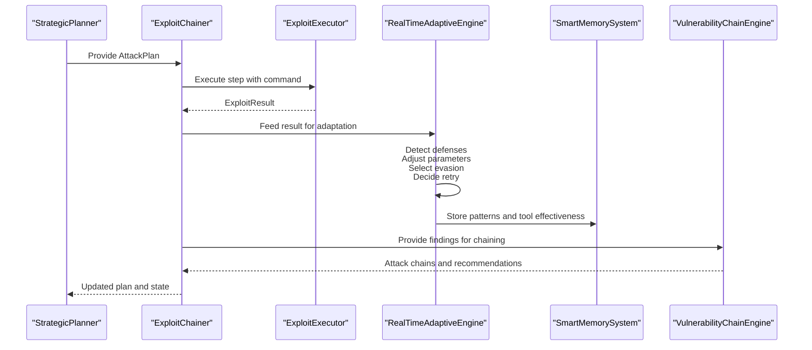
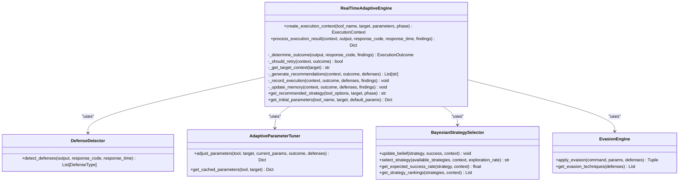
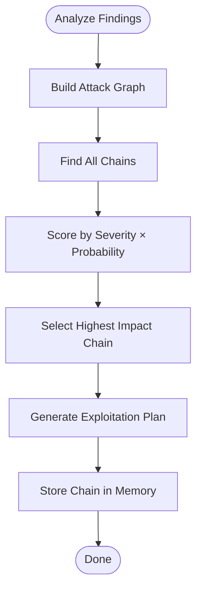
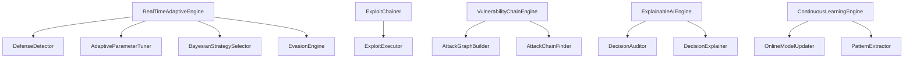

# Adaptive Exploitation Strategies

<cite>
**Referenced Files in This Document**
- [adaptive_exploitation.py](file://backend/intelligence/adaptive_exploitation.py)
- [exploit_chainer.py](file://backend/exploitation/exploit_chainer.py)
- [vulnerability_chaining.py](file://backend/intelligence/vulnerability_chaining.py)
- [memory_system.py](file://backend/intelligence/memory_system.py)
- [explainable_ai.py](file://backend/intelligence/explainable_ai.py)
- [exploit_executor.py](file://backend/exploitation/exploit_executor.py)
- [continuous_learning.py](file://backend/intelligence/continuous_learning.py)
</cite>

## Table of Contents
1. [Introduction](#introduction)
2. [Project Structure](#project-structure)
3. [Core Components](#core-components)
4. [Architecture Overview](#architecture-overview)
5. [Detailed Component Analysis](#detailed-component-analysis)
6. [Dependency Analysis](#dependency-analysis)
7. [Performance Considerations](#performance-considerations)
8. [Troubleshooting Guide](#troubleshooting-guide)
9. [Conclusion](#conclusion)
10. [Appendices](#appendices)

## Introduction
This document describes the adaptive exploitation strategies subsystem responsible for real-time adaptation during penetration testing. It explains how the system dynamically adjusts tactics based on target characteristics and defense responses, including execution context creation, defense detection, parameter adaptation, retry mechanisms, and vulnerability chaining. It also covers integration with memory systems for learning, explainable AI for documenting rationale, and performance optimization techniques for real-time decision processing.

## Project Structure
The adaptive exploitation subsystem spans several modules:
- Real-time adaptive engine and supporting components for execution feedback and adaptation
- Vulnerability chaining for attack graph construction and impact-based prioritization
- Memory system for persistent learning across scans
- Explainable AI for documenting decisions and rationale
- Exploit executor for safe execution and result parsing
- Continuous learning for zero-day discovery and model updates

**Diagram sources**
- [adaptive_exploitation.py](file://backend/intelligence/adaptive_exploitation.py#L474-L800)
- [exploit_chainer.py](file://backend/exploitation/exploit_chainer.py#L256-L462)
- [vulnerability_chaining.py](file://backend/intelligence/vulnerability_chaining.py#L660-L720)
- [memory_system.py](file://backend/intelligence/memory_system.py#L42-L186)
- [explainable_ai.py](file://backend/intelligence/explainable_ai.py#L682-L746)
- [exploit_executor.py](file://backend/exploitation/exploit_executor.py#L106-L153)
- [continuous_learning.py](file://backend/intelligence/continuous_learning.py#L268-L376)

**Section sources**
- [adaptive_exploitation.py](file://backend/intelligence/adaptive_exploitation.py#L1-L100)
- [exploit_chainer.py](file://backend/exploitation/exploit_chainer.py#L1-L50)
- [vulnerability_chaining.py](file://backend/intelligence/vulnerability_chaining.py#L1-L50)
- [memory_system.py](file://backend/intelligence/memory_system.py#L1-L50)
- [explainable_ai.py](file://backend/intelligence/explainable_ai.py#L1-L50)
- [exploit_executor.py](file://backend/exploitation/exploit_executor.py#L1-L30)
- [continuous_learning.py](file://backend/intelligence/continuous_learning.py#L1-L40)

## Core Components
- RealTimeAdaptiveEngine: orchestrates defense detection, parameter tuning, Bayesian strategy selection, evasion application, and retry logic; maintains execution contexts and integrates with memory.
- DefenseDetector: identifies WAF, rate limiting, honeypots, and other defensive indicators from tool output and response metadata.
- AdaptiveParameterTuner: adjusts execution parameters (rate, threads, timeout, delay) based on outcomes and detected defenses.
- BayesianStrategySelector: selects optimal strategies using Thompson sampling with context-aware beliefs.
- EvasionEngine: applies targeted evasion techniques (encoding, case variation, parameter pollution, fragmentation) based on detected defenses.
- ExploitChainer: executes multi-step exploit chains, manages state, handles failures with fallbacks, and coordinates with adaptive engines.
- VulnerabilityChainEngine: builds attack graphs from findings, finds optimal chains, and generates exploitation plans.
- SmartMemorySystem: persists patterns, tool effectiveness, target profiles, and chains for cross-scan learning.
- ExplainableAIEngine: records and explains AI decisions for compliance and audit.
- ExploitExecutor: safely executes commands, parses results, extracts data, and feeds feedback to adaptive engines.
- ContinuousLearningEngine: updates models from production feedback and supports zero-day discovery.

**Section sources**
- [adaptive_exploitation.py](file://backend/intelligence/adaptive_exploitation.py#L474-L800)
- [exploit_chainer.py](file://backend/exploitation/exploit_chainer.py#L256-L462)
- [vulnerability_chaining.py](file://backend/intelligence/vulnerability_chaining.py#L660-L720)
- [memory_system.py](file://backend/intelligence/memory_system.py#L42-L186)
- [explainable_ai.py](file://backend/intelligence/explainable_ai.py#L682-L746)
- [exploit_executor.py](file://backend/exploitation/exploit_executor.py#L106-L153)
- [continuous_learning.py](file://backend/intelligence/continuous_learning.py#L268-L376)

## Architecture Overview
The adaptive exploitation subsystem integrates real-time feedback loops between execution and adaptation:
- ExploitChainer drives execution and captures results.
- ExploitExecutor parses outputs and determines outcomes.
- RealTimeAdaptiveEngine processes outcomes, detects defenses, adapts parameters, selects evasions, and decides retries.
- VulnerabilityChainEngine constructs attack graphs and recommends exploitation sequences.
- SmartMemorySystem stores patterns and tool effectiveness for cross-scan learning.
- ExplainableAIEngine documents decisions and rationale for compliance.
- ContinuousLearningEngine updates models and supports zero-day discovery.

**Diagram sources**
- [exploit_chainer.py](file://backend/exploitation/exploit_chainer.py#L345-L462)
- [exploit_executor.py](file://backend/exploitation/exploit_executor.py#L273-L357)
- [adaptive_exploitation.py](file://backend/intelligence/adaptive_exploitation.py#L527-L614)
- [memory_system.py](file://backend/intelligence/memory_system.py#L639-L723)
- [vulnerability_chaining.py](file://backend/intelligence/vulnerability_chaining.py#L680-L720)

## Detailed Component Analysis

### RealTimeAdaptiveEngine
Responsibilities:
- Creates execution contexts for each tool invocation.
- Processes execution results to determine outcomes and detected defenses.
- Updates Bayesian strategy beliefs and selects optimal strategies.
- Adapts parameters and applies evasions based on outcomes and defenses.
- Manages retry logic with backoff and fallbacks.
- Records execution history and updates long-term memory.

Key behaviors:
- Outcome determination considers findings, response codes, and textual indicators.
- Defense detection recognizes WAF, rate limits, honeypots, and IPS-like symptoms.
- Parameter tuning adjusts concurrency, rate, timeouts, delays, and evasion flags.
- Evasion techniques are applied conditionally based on detected defenses.
- Retry decisions avoid retrying on honeypots and after reaching max attempts.

**Diagram sources**
- [adaptive_exploitation.py](file://backend/intelligence/adaptive_exploitation.py#L474-L800)

**Section sources**
- [adaptive_exploitation.py](file://backend/intelligence/adaptive_exploitation.py#L474-L800)

### Execution Context Creation
- ExecutionContext encapsulates tool name, target, parameters, phase, attempt number, previous outcomes, and detected defenses.
- The engine creates a new context per execution attempt and tracks it in active contexts for lifecycle management.

**Section sources**
- [adaptive_exploitation.py](file://backend/intelligence/adaptive_exploitation.py#L58-L68)
- [adaptive_exploitation.py](file://backend/intelligence/adaptive_exploitation.py#L509-L526)

### Defense Detection Algorithms
- DefenseDetector identifies WAF, rate limiting, honeypots, and IPS-like symptoms from textual output and response metadata.
- Detection thresholds include HTTP status codes, response time anomalies, and keyword patterns.

**Section sources**
- [adaptive_exploitation.py](file://backend/intelligence/adaptive_exploitation.py#L81-L154)

### Parameter Adaptation Strategies
- AdaptiveParameterTuner defines rules for rate, threads, timeout, and delay adjustments based on outcomes.
- Special handling for detected defenses (e.g., enabling evasion flags, adding delays, fragmenting traffic).

**Section sources**
- [adaptive_exploitation.py](file://backend/intelligence/adaptive_exploitation.py#L156-L256)

### Retry Mechanisms
- Retry decisions are based on outcome categories, attempt count, and presence of honeypots.
- Backoff and jitter are applied; evasion techniques are integrated into retry adaptations.

**Section sources**
- [adaptive_exploitation.py](file://backend/intelligence/adaptive_exploitation.py#L639-L663)
- [adaptive_exploitation.py](file://backend/intelligence/adaptive_exploitation.py#L597-L601)

### Vulnerability Chaining System
- VulnerabilityChainEngine builds an attack graph from findings, analyzes relationships, and finds optimal chains.
- AttackChainFinder computes success probabilities and severity-weighted scores to prioritize high-impact sequences.
- Integration with memory system stores discovered chains for future reuse.

**Diagram sources**
- [vulnerability_chaining.py](file://backend/intelligence/vulnerability_chaining.py#L680-L720)
- [vulnerability_chaining.py](file://backend/intelligence/vulnerability_chaining.py#L449-L504)

**Section sources**
- [vulnerability_chaining.py](file://backend/intelligence/vulnerability_chaining.py#L660-L720)
- [vulnerability_chaining.py](file://backend/intelligence/vulnerability_chaining.py#L449-L504)

### Integration with Memory Systems
- RealTimeAdaptiveEngine updates SmartMemorySystem with tool effectiveness, defense patterns, and execution metadata.
- VulnerabilityChainEngine stores discovered chains and their outcomes for cross-scan learning.
- ContinuousLearningEngine updates online model weights and extracts reusable patterns.

**Section sources**
- [adaptive_exploitation.py](file://backend/intelligence/adaptive_exploitation.py#L740-L776)
- [vulnerability_chaining.py](file://backend/intelligence/vulnerability_chaining.py#L715-L718)
- [memory_system.py](file://backend/intelligence/memory_system.py#L639-L723)
- [continuous_learning.py](file://backend/intelligence/continuous_learning.py#L268-L376)

### Relationship with Explainable AI
- ExplainableAIEngine records decisions (tool selection, evasion, retry, attack chain) with factors, alternatives, and confidence.
- Provides human-readable explanations and audit trails for compliance.

**Section sources**
- [explainable_ai.py](file://backend/intelligence/explainable_ai.py#L682-L746)
- [explainable_ai.py](file://backend/intelligence/explainable_ai.py#L847-L885)

### Exploit Chaining Orchestration
- ExploitChainer executes AttackPlan step-by-step, enriches context with discovered credentials and sessions, and retries with adaptations.
- Emits callbacks for step completion and chain events; aborts on detection indicators.

**Section sources**
- [exploit_chainer.py](file://backend/exploitation/exploit_chainer.py#L345-L462)
- [exploit_chainer.py](file://backend/exploitation/exploit_chainer.py#L463-L519)

### Exploit Execution and Parsing
- ExploitExecutor validates commands, executes via ToolManager, parses outputs, detects WAF/IPS, and extracts credentials and data.
- Provides structured results and recommendations for downstream adaptation.

**Section sources**
- [exploit_executor.py](file://backend/exploitation/exploit_executor.py#L273-L357)
- [exploit_executor.py](file://backend/exploitation/exploit_executor.py#L416-L534)

### Concrete Adaptive Scenarios
- Adjusting payloads based on WAF responses: evasion techniques (encoding, case variation, comments, parameter pollution) are applied automatically.
- Modifying scanning intensity based on defensive indicators: rate, threads, and delays are tuned; fragmentation and timing adjustments are used for IPS.
- Optimizing exploitation order for maximum impact: vulnerability chaining ranks chains by severity-weighted probability; Bayesian strategy selection chooses tools based on context.

**Section sources**
- [adaptive_exploitation.py](file://backend/intelligence/adaptive_exploitation.py#L344-L472)
- [adaptive_exploitation.py](file://backend/intelligence/adaptive_exploitation.py#L156-L256)
- [vulnerability_chaining.py](file://backend/intelligence/vulnerability_chaining.py#L449-L504)
- [adaptive_exploitation.py](file://backend/intelligence/adaptive_exploitation.py#L258-L342)

## Dependency Analysis
- RealTimeAdaptiveEngine depends on DefenseDetector, AdaptiveParameterTuner, BayesianStrategySelector, and EvasionEngine.
- ExploitChainer depends on ExploitExecutor and LLM generator for dynamic payloads.
- VulnerabilityChainEngine depends on AttackGraphBuilder and AttackChainFinder.
- ExplainableAIEngine depends on DecisionAuditor and DecisionExplainer.
- ContinuousLearningEngine depends on OnlineModelUpdater and PatternExtractor.

**Diagram sources**
- [adaptive_exploitation.py](file://backend/intelligence/adaptive_exploitation.py#L474-L800)
- [exploit_chainer.py](file://backend/exploitation/exploit_chainer.py#L256-L462)
- [vulnerability_chaining.py](file://backend/intelligence/vulnerability_chaining.py#L660-L720)
- [explainable_ai.py](file://backend/intelligence/explainable_ai.py#L682-L746)
- [continuous_learning.py](file://backend/intelligence/continuous_learning.py#L268-L376)

**Section sources**
- [adaptive_exploitation.py](file://backend/intelligence/adaptive_exploitation.py#L474-L800)
- [exploit_chainer.py](file://backend/exploitation/exploit_chainer.py#L256-L462)
- [vulnerability_chaining.py](file://backend/intelligence/vulnerability_chaining.py#L660-L720)
- [explainable_ai.py](file://backend/intelligence/explainable_ai.py#L682-L746)
- [continuous_learning.py](file://backend/intelligence/continuous_learning.py#L268-L376)

## Performance Considerations
- Parameter tuning uses bounded adjustments and caching to minimize unnecessary churn.
- Bayesian strategy selection employs Thompson sampling to balance exploration and exploitation efficiently.
- Memory writes are batched and limited in history size to control overhead.
- Evasion techniques are selectively applied based on detected defenses to reduce computational cost.
- ExploitExecutor’s output parsing uses compiled regex patterns and early exits to improve throughput.

[No sources needed since this section provides general guidance]

## Troubleshooting Guide
Common adaptation failures and resolutions:
- WAF evasion ineffective: switch evasion techniques (encoding, case variation, parameter pollution); reduce rate and add jitter; consider alternative attack vectors.
- Retry loop without success: verify findings parsing; confirm outcome classification; inspect memory for conflicting patterns.
- Excessive timeouts: increase timeout or reduce scope; lower concurrency; check for rate limiting and apply delays.
- No results after multiple attempts: re-evaluate target characteristics; try different tools or attack vectors; check memory for similar targets’ outcomes.
- Detection indicators present: abort chain execution; record detection; update memory with defensive patterns.

**Section sources**
- [adaptive_exploitation.py](file://backend/intelligence/adaptive_exploitation.py#L639-L663)
- [adaptive_exploitation.py](file://backend/intelligence/adaptive_exploitation.py#L673-L714)
- [exploit_executor.py](file://backend/exploitation/exploit_executor.py#L416-L534)

## Conclusion
The adaptive exploitation subsystem provides a robust, real-time framework for adjusting penetration testing tactics. By combining defense detection, parameter adaptation, evasion application, and strategic selection with persistent memory and explainability, it enables effective and auditable autonomous penetration testing. Integration with vulnerability chaining and continuous learning further enhances its ability to discover and exploit high-impact attack paths while learning from each encounter.

[No sources needed since this section summarizes without analyzing specific files]

## Appendices

### Configuration Tuning Guidelines
- Adaptive parameters: adjust max retries, base backoff, and parameter adjustment factors based on target latency and sensitivity.
- Defense detection: tune signature thresholds and response time cutoffs for accurate WAF and rate-limit detection.
- Strategy selection: configure exploration rate and context hashing to balance novelty and reliability.
- Memory importance: set importance thresholds for patterns and chains to prioritize learning signals.
- Explainable AI: define decision types and confidence thresholds for compliance reporting.

**Section sources**
- [adaptive_exploitation.py](file://backend/intelligence/adaptive_exploitation.py#L495-L507)
- [adaptive_exploitation.py](file://backend/intelligence/adaptive_exploitation.py#L81-L154)
- [memory_system.py](file://backend/intelligence/memory_system.py#L189-L242)
- [explainable_ai.py](file://backend/intelligence/explainable_ai.py#L352-L390)