# Continuous Learning Systems

<cite>
**Referenced Files in This Document**
- [continuous_learning.py](file://backend/intelligence/continuous_learning.py)
- [unified_intel.py](file://backend/intelligence/unified_intel.py)
- [continuous_retraining.py](file://backend/training/continuous_retraining.py)
- [learning_module.py](file://backend/inference/learning_module.py)
- [memory_system.py](file://backend/intelligence/memory_system.py)
- [production_data_collector.py](file://backend/training/production_data_collector.py)
- [model_trainer.py](file://backend/training/model_trainer.py)
- [phase_specific_models.py](file://backend/training/phase_specific_models.py)
- [adaptive_exploitation.py](file://backend/intelligence/adaptive_exploitation.py)
- [campaign_intelligence.py](file://backend/intelligence/campaign_intelligence.py)
- [run_rl_training.py](file://backend/training/run_rl_training.py)
- [ml_training_state.json](file://backend/data/ml_training_state.json)
- [online_weights.json](file://backend/data/models/online_weights.json)
- [exploitation_prod.jsonl (demo)](file://backend/testing/data/demo_production_logs/exploitation_prod.jsonl)
- [exploitation_prod.jsonl (test)](file://backend/testing/data/test_production_logs/exploitation_prod.jsonl)
</cite>

## Table of Contents
1. [Introduction](#introduction)
2. [Project Structure](#project-structure)
3. [Core Components](#core-components)
4. [Architecture Overview](#architecture-overview)
5. [Detailed Component Analysis](#detailed-component-analysis)
6. [Dependency Analysis](#dependency-analysis)
7. [Performance Considerations](#performance-considerations)
8. [Troubleshooting Guide](#troubleshooting-guide)
9. [Conclusion](#conclusion)
10. [Appendices](#appendices)

## Introduction
This document describes the continuous learning systems that power production-based machine learning and zero-day discovery in the Optimus platform. It explains how real-world performance data is captured, how models and strategies are updated, and how the system adapts to outcomes from penetration testing. It also documents zero-day discovery mechanisms for anomaly detection, behavioral analysis, and pattern recognition in tool outputs, and details the unified intelligence learning integration that consolidates multiple learning sources, ensures consistency across components, and provides centralized learning statistics. Practical examples illustrate tool effectiveness prediction, exploitation success rate optimization, and adaptive strategy refinement. The guide covers learning data collection, model updating mechanisms, performance evaluation metrics, and integration with memory systems for knowledge persistence. Guidance is included for configuration tuning, handling concept drift, validation procedures, and troubleshooting performance issues, along with the relationships among continuous learning and other intelligence components for coordinated system improvement.

## Project Structure
The continuous learning ecosystem spans multiple subsystems:
- Intelligence engines for continuous learning and zero-day discovery
- Unified intelligence for cross-source aggregation
- Training infrastructure for continuous retraining and model validation
- Inference modules for real-time learning and adaptive exploitation
- Memory system for persistent knowledge storage and retrieval
- Campaign intelligence for cross-target learning and optimization

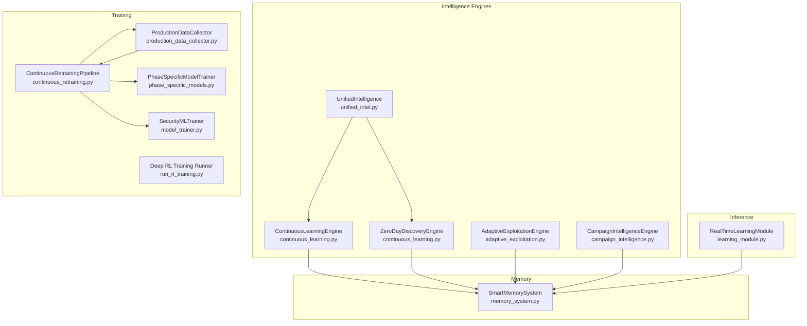

**Diagram sources**
- [continuous_learning.py](file://backend/intelligence/continuous_learning.py#L268-L376)
- [continuous_retraining.py](file://backend/training/continuous_retraining.py#L27-L212)
- [production_data_collector.py](file://backend/training/production_data_collector.py#L14-L175)
- [model_trainer.py](file://backend/training/model_trainer.py#L20-L444)
- [phase_specific_models.py](file://backend/training/phase_specific_models.py#L15-L404)
- [learning_module.py](file://backend/inference/learning_module.py#L11-L354)
- [memory_system.py](file://backend/intelligence/memory_system.py#L42-L186)
- [adaptive_exploitation.py](file://backend/intelligence/adaptive_exploitation.py#L474-L794)
- [campaign_intelligence.py](file://backend/intelligence/campaign_intelligence.py#L507-L627)
- [unified_intel.py](file://backend/intelligence/unified_intel.py#L52-L207)
- [run_rl_training.py](file://backend/training/run_rl_training.py#L91-L201)

**Section sources**
- [continuous_learning.py](file://backend/intelligence/continuous_learning.py#L1-L946)
- [unified_intel.py](file://backend/intelligence/unified_intel.py#L1-L329)
- [continuous_retraining.py](file://backend/training/continuous_retraining.py#L1-L345)
- [learning_module.py](file://backend/inference/learning_module.py#L1-L354)
- [memory_system.py](file://backend/intelligence/memory_system.py#L1-L1022)
- [production_data_collector.py](file://backend/training/production_data_collector.py#L1-L280)
- [model_trainer.py](file://backend/training/model_trainer.py#L1-L444)
- [phase_specific_models.py](file://backend/training/phase_specific_models.py#L1-L543)
- [adaptive_exploitation.py](file://backend/intelligence/adaptive_exploitation.py#L1-L876)
- [campaign_intelligence.py](file://backend/intelligence/campaign_intelligence.py#L1-L689)
- [run_rl_training.py](file://backend/training/run_rl_training.py#L1-L205)

## Core Components
- ContinuousLearningEngine: Captures tool outcomes, vulnerability confirmations, and attack chain results; updates online weights and extracts patterns for memory.
- ZeroDayDiscoveryEngine: Performs anomaly detection, builds response baselines, and guides intelligent fuzzing to discover unknown vulnerabilities.
- RealTimeLearningModule: Learns from scan executions, tracks tool effectiveness, and generates recommendations for adaptive strategy refinement.
- ContinuousRetrainingPipeline: Automates model retraining using production data, validates improvements, and deploys new models.
- SmartMemorySystem: Stores and retrieves long-term knowledge, including attack patterns, target profiles, tool effectiveness, and vulnerability chains.
- UnifiedIntelligence: Aggregates surface and dark web intelligence for threat assessment and recommendation generation.
- AdaptiveExploitationEngine: Adapts exploitation parameters, detects defenses, applies evasion techniques, and selects strategies using Bayesian inference.
- CampaignIntelligenceEngine: Enables cross-target learning, sector-specific insights, and campaign optimization.

**Section sources**
- [continuous_learning.py](file://backend/intelligence/continuous_learning.py#L268-L376)
- [continuous_learning.py](file://backend/intelligence/continuous_learning.py#L681-L800)
- [learning_module.py](file://backend/inference/learning_module.py#L11-L354)
- [continuous_retraining.py](file://backend/training/continuous_retraining.py#L27-L212)
- [memory_system.py](file://backend/intelligence/memory_system.py#L42-L186)
- [unified_intel.py](file://backend/intelligence/unified_intel.py#L52-L207)
- [adaptive_exploitation.py](file://backend/intelligence/adaptive_exploitation.py#L474-L794)
- [campaign_intelligence.py](file://backend/intelligence/campaign_intelligence.py#L507-L627)

## Architecture Overview
The continuous learning architecture integrates production data capture, real-time learning, periodic retraining, and memory-backed knowledge persistence. Unified intelligence coordinates external intelligence sources and integrates with continuous learning for holistic decision-making.

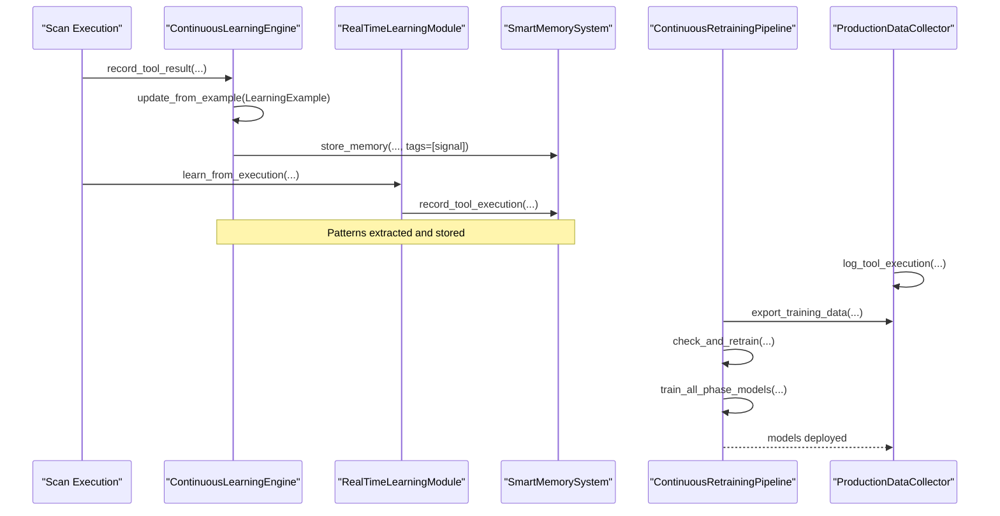

**Diagram sources**
- [continuous_learning.py](file://backend/intelligence/continuous_learning.py#L285-L363)
- [learning_module.py](file://backend/inference/learning_module.py#L42-L113)
- [memory_system.py](file://backend/intelligence/memory_system.py#L639-L723)
- [production_data_collector.py](file://backend/training/production_data_collector.py#L39-L175)
- [continuous_retraining.py](file://backend/training/continuous_retraining.py#L128-L212)

## Detailed Component Analysis

### Continuous Learning Engine
The ContinuousLearningEngine captures real-world outcomes and updates online weights for tool selection, vulnerability pattern recognition, and attack chain effectiveness. It records rewards based on success and findings, extracts features from context, and maintains learning statistics.

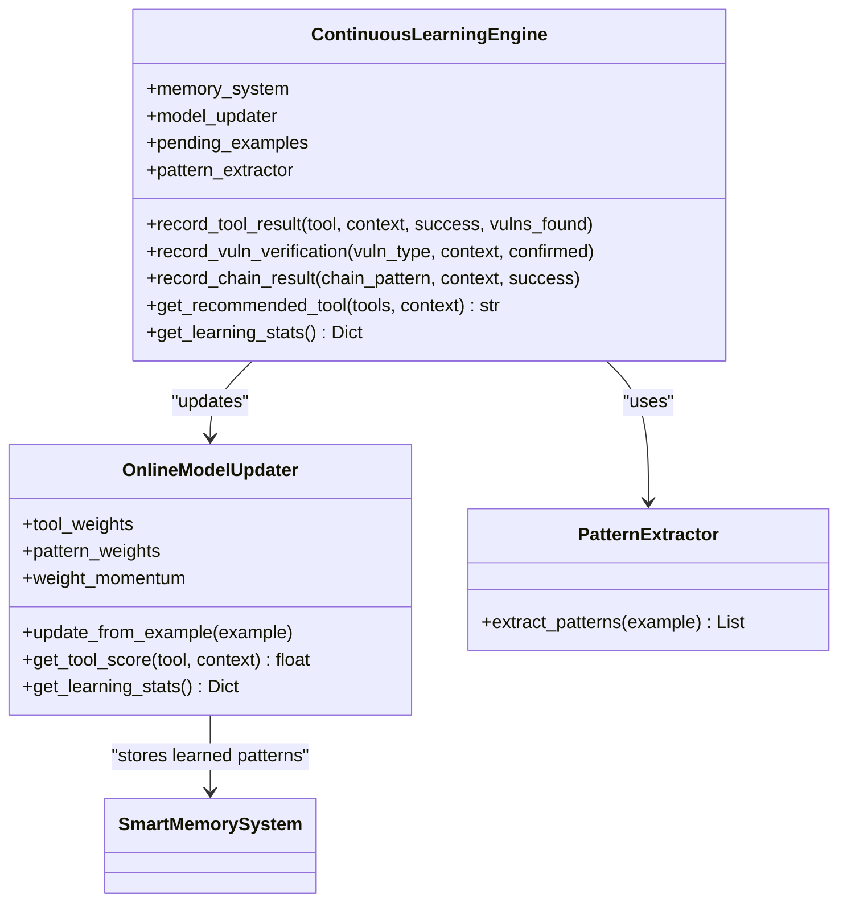

**Diagram sources**
- [continuous_learning.py](file://backend/intelligence/continuous_learning.py#L268-L376)
- [continuous_learning.py](file://backend/intelligence/continuous_learning.py#L64-L125)
- [continuous_learning.py](file://backend/intelligence/continuous_learning.py#L378-L414)

**Section sources**
- [continuous_learning.py](file://backend/intelligence/continuous_learning.py#L268-L376)
- [continuous_learning.py](file://backend/intelligence/continuous_learning.py#L64-L125)
- [continuous_learning.py](file://backend/intelligence/continuous_learning.py#L378-L414)

### Zero-Day Discovery Engine
The ZeroDayDiscoveryEngine analyzes tool responses to detect anomalies, builds baselines for comparison, and guides intelligent fuzzing with mutation strategies informed by past anomaly detection success.

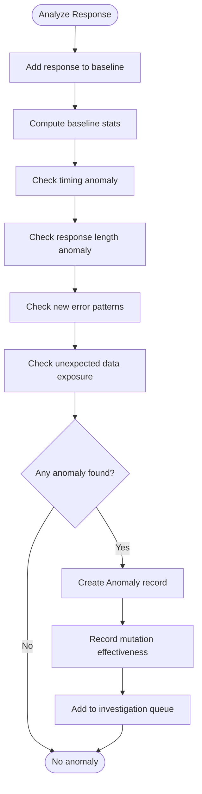

**Diagram sources**
- [continuous_learning.py](file://backend/intelligence/continuous_learning.py#L704-L800)
- [continuous_learning.py](file://backend/intelligence/continuous_learning.py#L442-L518)
- [continuous_learning.py](file://backend/intelligence/continuous_learning.py#L520-L679)

**Section sources**
- [continuous_learning.py](file://backend/intelligence/continuous_learning.py#L681-L800)
- [continuous_learning.py](file://backend/intelligence/continuous_learning.py#L442-L518)
- [continuous_learning.py](file://backend/intelligence/continuous_learning.py#L520-L679)

### Real-Time Learning Module
The RealTimeLearningModule tracks tool effectiveness, identifies patterns, and provides recommendations for adaptive strategy refinement. It computes effectiveness scores and suggests alternative tools based on context.

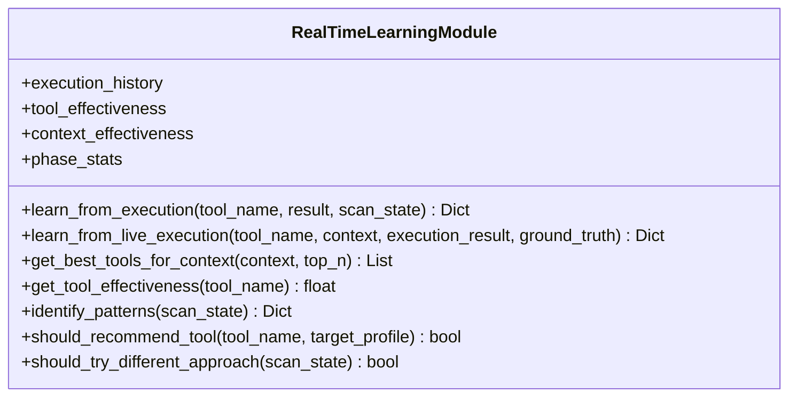

**Diagram sources**
- [learning_module.py](file://backend/inference/learning_module.py#L11-L354)

**Section sources**
- [learning_module.py](file://backend/inference/learning_module.py#L11-L354)

### Continuous Retraining Pipeline
The ContinuousRetrainingPipeline automates model retraining using production data, validates improvements, and deploys new models. It exports production logs to training format, backs up existing models, and compares accuracy thresholds to decide deployment.

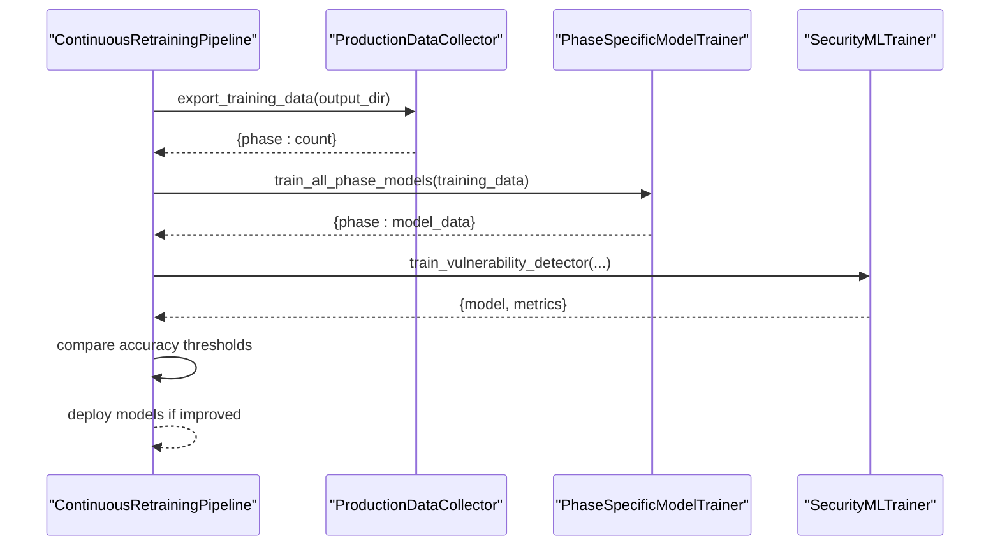

**Diagram sources**
- [continuous_retraining.py](file://backend/training/continuous_retraining.py#L128-L212)
- [production_data_collector.py](file://backend/training/production_data_collector.py#L209-L268)
- [phase_specific_models.py](file://backend/training/phase_specific_models.py#L360-L404)
- [model_trainer.py](file://backend/training/model_trainer.py#L28-L98)

**Section sources**
- [continuous_retraining.py](file://backend/training/continuous_retraining.py#L27-L212)
- [production_data_collector.py](file://backend/training/production_data_collector.py#L14-L280)
- [phase_specific_models.py](file://backend/training/phase_specific_models.py#L15-L404)
- [model_trainer.py](file://backend/training/model_trainer.py#L20-L444)

### Smart Memory System
The SmartMemorySystem persists long-term knowledge, enabling cross-scan and cross-target learning. It stores attack patterns, target profiles, tool effectiveness, and vulnerability chains, and supports semantic recall and pattern reuse.

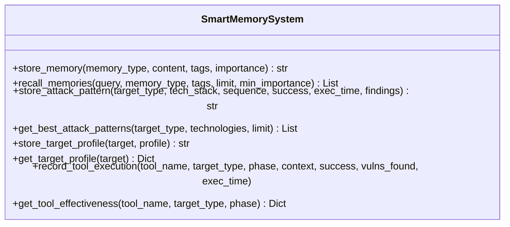

**Diagram sources**
- [memory_system.py](file://backend/intelligence/memory_system.py#L42-L186)
- [memory_system.py](file://backend/intelligence/memory_system.py#L324-L471)
- [memory_system.py](file://backend/intelligence/memory_system.py#L473-L587)
- [memory_system.py](file://backend/intelligence/memory_system.py#L638-L760)

**Section sources**
- [memory_system.py](file://backend/intelligence/memory_system.py#L42-L186)
- [memory_system.py](file://backend/intelligence/memory_system.py#L324-L471)
- [memory_system.py](file://backend/intelligence/memory_system.py#L473-L587)
- [memory_system.py](file://backend/intelligence/memory_system.py#L638-L760)

### Unified Intelligence Integration
UnifiedIntelligence aggregates surface and dark web intelligence, performs threat assessments, and enriches findings. It complements continuous learning by providing contextual threat intelligence and recommendations.

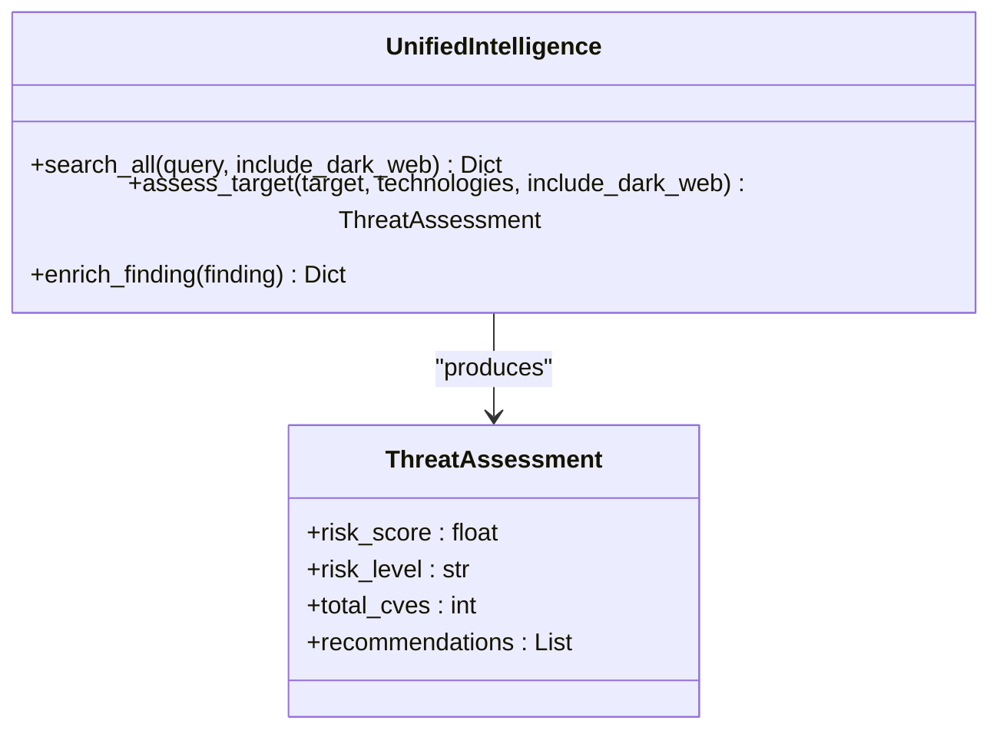

**Diagram sources**
- [unified_intel.py](file://backend/intelligence/unified_intel.py#L52-L207)

**Section sources**
- [unified_intel.py](file://backend/intelligence/unified_intel.py#L1-L329)

### Adaptive Exploitation Engine
The AdaptiveExploitationEngine adapts exploitation strategies in real-time, detects defenses, adjusts parameters, and applies evasion techniques. It uses Bayesian strategy selection and maintains execution history for learning.

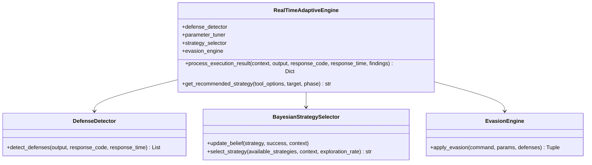

**Diagram sources**
- [adaptive_exploitation.py](file://backend/intelligence/adaptive_exploitation.py#L474-L794)
- [adaptive_exploitation.py](file://backend/intelligence/adaptive_exploitation.py#L81-L154)
- [adaptive_exploitation.py](file://backend/intelligence/adaptive_exploitation.py#L258-L342)
- [adaptive_exploitation.py](file://backend/intelligence/adaptive_exploitation.py#L344-L472)

**Section sources**
- [adaptive_exploitation.py](file://backend/intelligence/adaptive_exploitation.py#L1-L876)

### Campaign Intelligence Engine
The CampaignIntelligenceEngine enables cross-target learning, sector-specific insights, and campaign optimization. It analyzes patterns across targets, predicts vulnerabilities, and generates recommendations.

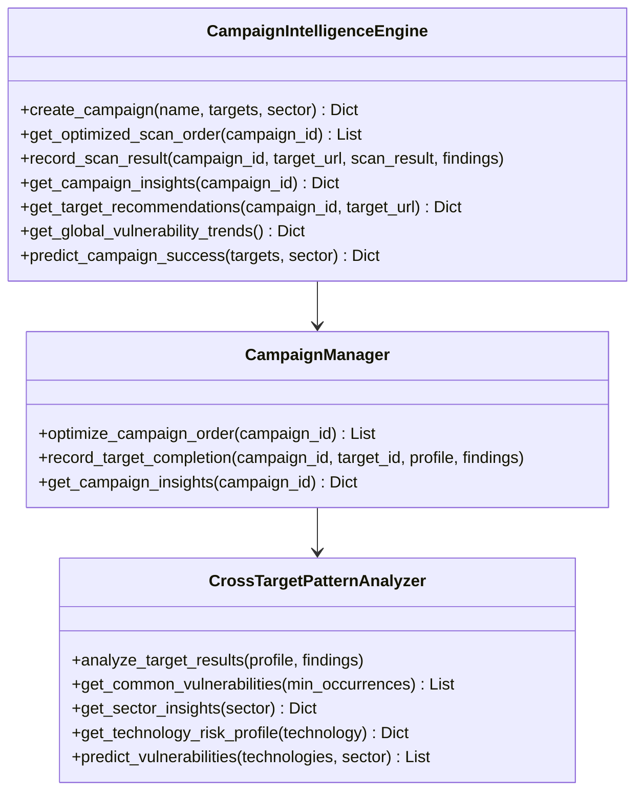

**Diagram sources**
- [campaign_intelligence.py](file://backend/intelligence/campaign_intelligence.py#L507-L627)
- [campaign_intelligence.py](file://backend/intelligence/campaign_intelligence.py#L254-L442)
- [campaign_intelligence.py](file://backend/intelligence/campaign_intelligence.py#L102-L252)

**Section sources**
- [campaign_intelligence.py](file://backend/intelligence/campaign_intelligence.py#L1-L689)

## Dependency Analysis
The continuous learning system exhibits strong cohesion within functional areas and moderate coupling between training, inference, and memory systems. Key dependencies include:
- ContinuousLearningEngine depends on OnlineModelUpdater and PatternExtractor, and integrates with SmartMemorySystem.
- ContinuousRetrainingPipeline depends on ProductionDataCollector, PhaseSpecificModelTrainer, and SecurityMLTrainer.
- RealTimeLearningModule interacts with SmartMemorySystem for tool effectiveness tracking.
- AdaptiveExploitationEngine collaborates with SmartMemorySystem for defense and tool execution memory.
- CampaignIntelligenceEngine leverages SmartMemorySystem for campaign target results and cross-target pattern analysis.
- UnifiedIntelligence coordinates external intelligence sources and complements continuous learning.

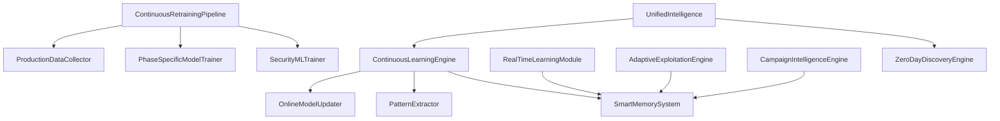

**Diagram sources**
- [continuous_learning.py](file://backend/intelligence/continuous_learning.py#L268-L376)
- [continuous_retraining.py](file://backend/training/continuous_retraining.py#L27-L212)
- [learning_module.py](file://backend/inference/learning_module.py#L11-L354)
- [adaptive_exploitation.py](file://backend/intelligence/adaptive_exploitation.py#L474-L794)
- [campaign_intelligence.py](file://backend/intelligence/campaign_intelligence.py#L507-L627)
- [unified_intel.py](file://backend/intelligence/unified_intel.py#L52-L207)

**Section sources**
- [continuous_learning.py](file://backend/intelligence/continuous_learning.py#L1-L946)
- [continuous_retraining.py](file://backend/training/continuous_retraining.py#L1-L345)
- [learning_module.py](file://backend/inference/learning_module.py#L1-L354)
- [memory_system.py](file://backend/intelligence/memory_system.py#L1-L1022)
- [adaptive_exploitation.py](file://backend/intelligence/adaptive_exploitation.py#L1-L876)
- [campaign_intelligence.py](file://backend/intelligence/campaign_intelligence.py#L1-L689)
- [unified_intel.py](file://backend/intelligence/unified_intel.py#L1-L329)

## Performance Considerations
- Online learning updates use momentum-based gradient updates for stability and responsiveness.
- Baseline builders maintain bounded statistics to handle concept drift in response characteristics.
- Retraining pipeline enforces minimum thresholds and validation splits to avoid unnecessary deployments.
- Memory system employs caching and indexing to accelerate recall and reduce latency.
- Real-time learning limits execution history sizes to control memory growth.
- Phase-specific models reduce dimensionality and improve training efficiency per scan phase.

[No sources needed since this section provides general guidance]

## Troubleshooting Guide
Common issues and resolutions:
- Missing or invalid production logs: Verify collector configuration and file permissions; ensure required fields are present in log entries.
- Model loading failures: Check for sklearn version compatibility and model attribute presence; disable phase models via environment variable if needed.
- Low learning signal quality: Validate reward assignments and context feature extraction; ensure sufficient examples per signal type.
- Memory storage errors: Confirm database connectivity and schema initialization; check embedding generation and JSON serialization.
- Retraining not triggered: Review minimum sample thresholds, time intervals, and per-phase minimums; inspect training data availability.
- Zero-day anomaly false positives: Tune baseline thresholds and anomaly detection sensitivity; incorporate manual review queues.
- Adaptive exploitation retries: Monitor retry attempts and backoff strategies; ensure evasion techniques align with detected defenses.

**Section sources**
- [production_data_collector.py](file://backend/training/production_data_collector.py#L14-L175)
- [phase_specific_models.py](file://backend/training/phase_specific_models.py#L416-L467)
- [continuous_learning.py](file://backend/intelligence/continuous_learning.py#L95-L125)
- [memory_system.py](file://backend/intelligence/memory_system.py#L75-L183)
- [continuous_retraining.py](file://backend/training/continuous_retraining.py#L104-L126)
- [adaptive_exploitation.py](file://backend/intelligence/adaptive_exploitation.py#L639-L662)

## Conclusion
The continuous learning systems integrate real-time feedback, periodic retraining, and persistent memory to adapt strategies and improve performance across production environments. By combining continuous learning, zero-day discovery, adaptive exploitation, and unified intelligence, the platform achieves coordinated improvement and robust knowledge persistence. Practical examples demonstrate tool effectiveness prediction, exploitation success optimization, and adaptive strategy refinement, supported by comprehensive metrics and validation procedures.

[No sources needed since this section summarizes without analyzing specific files]

## Appendices

### Practical Examples and Use Cases
- Tool effectiveness prediction: Use RealTimeLearningModule to compute effectiveness scores and recommend tools per context; track recent findings rates and average findings per execution.
- Exploitation success rate optimization: Apply AdaptiveExploitationEngine to adjust parameters, detect defenses, and select strategies using Bayesian inference; store outcomes in SmartMemorySystem for cross-scan learning.
- Adaptive strategy refinement: Feed ContinuousLearningEngine with tool results and vulnerability confirmations; extract patterns and update online weights; periodically retrain models via ContinuousRetrainingPipeline.
- Zero-day discovery: Utilize ZeroDayDiscoveryEngine to analyze responses, detect anomalies, and guide intelligent fuzzing; store anomalies and mutation effectiveness in SmartMemorySystem.
- Unified intelligence learning: Integrate UnifiedIntelligence for threat assessment and recommendation enrichment; correlate external intelligence with internal learning signals.

**Section sources**
- [learning_module.py](file://backend/inference/learning_module.py#L27-L40)
- [adaptive_exploitation.py](file://backend/intelligence/adaptive_exploitation.py#L474-L794)
- [continuous_learning.py](file://backend/intelligence/continuous_learning.py#L268-L376)
- [continuous_learning.py](file://backend/intelligence/continuous_learning.py#L681-L800)
- [unified_intel.py](file://backend/intelligence/unified_intel.py#L125-L207)

### Learning Data Collection and Model Updating
- Data collection: ProductionDataCollector logs tool executions, phase transitions, and scan completions; exports training-ready samples per phase.
- Model updating: OnlineModelUpdater updates weights incrementally; PhaseSpecificModelTrainer trains per-phase models; SecurityMLTrainer builds classifiers/regressors; ContinuousRetrainingPipeline orchestrates deployment.
- Evaluation metrics: Metrics include precision, recall, F1, accuracy, ROC-AUC, MAE, RMSE, and R²; stored in training state JSON for auditability.

**Section sources**
- [production_data_collector.py](file://backend/training/production_data_collector.py#L14-L280)
- [continuous_learning.py](file://backend/intelligence/continuous_learning.py#L64-L125)
- [phase_specific_models.py](file://backend/training/phase_specific_models.py#L252-L358)
- [model_trainer.py](file://backend/training/model_trainer.py#L28-L444)
- [continuous_retraining.py](file://backend/training/continuous_retraining.py#L128-L212)
- [ml_training_state.json](file://backend/data/ml_training_state.json#L1-L51)
- [online_weights.json](file://backend/data/models/online_weights.json#L1-L82)

### Integration with Memory Systems
- Long-term storage: SmartMemorySystem persists memories, attack patterns, target profiles, tool effectiveness, and vulnerability chains; supports semantic recall and pattern reuse.
- Cross-scan learning: Memory entries tagged by signal types enable pattern extraction and strategy adaptation across scans.
- Cross-target learning: CampaignIntelligenceEngine aggregates patterns across targets and sectors for broader insights.

**Section sources**
- [memory_system.py](file://backend/intelligence/memory_system.py#L42-L186)
- [memory_system.py](file://backend/intelligence/memory_system.py#L324-L471)
- [memory_system.py](file://backend/intelligence/memory_system.py#L473-L587)
- [memory_system.py](file://backend/intelligence/memory_system.py#L638-L760)
- [campaign_intelligence.py](file://backend/intelligence/campaign_intelligence.py#L102-L252)

### Configuration and Tuning Guidelines
- Continuous learning: Adjust learning rates, momentum, and reward scaling; tune feature extraction and pattern weights.
- Retraining: Configure minimum samples, retrain intervals, and accuracy thresholds; schedule auto-retraining.
- Memory: Optimize embedding dimensions, cache sizes, and recall filters; manage retention policies.
- Adaptive exploitation: Calibrate parameter adjustment factors, defense detection thresholds, and evasion technique applicability.
- Unified intelligence: Tune risk scoring weights and recommendation thresholds; configure source inclusion and confidence calculations.

**Section sources**
- [continuous_learning.py](file://backend/intelligence/continuous_learning.py#L64-L125)
- [continuous_retraining.py](file://backend/training/continuous_retraining.py#L44-L64)
- [memory_system.py](file://backend/intelligence/memory_system.py#L65-L69)
- [adaptive_exploitation.py](file://backend/intelligence/adaptive_exploitation.py#L156-L251)
- [unified_intel.py](file://backend/intelligence/unified_intel.py#L209-L238)

### Example Data Files
- Demo exploitation logs: Demonstrates structured entries for tool execution results and findings.
- Test exploitation logs: Shows minimal entries for validation and testing scenarios.

**Section sources**
- [exploitation_prod.jsonl (demo)](file://backend/testing/data/demo_production_logs/exploitation_prod.jsonl#L1-L2)
- [exploitation_prod.jsonl (test)](file://backend/testing/data/test_production_logs/exploitation_prod.jsonl#L1-L4)