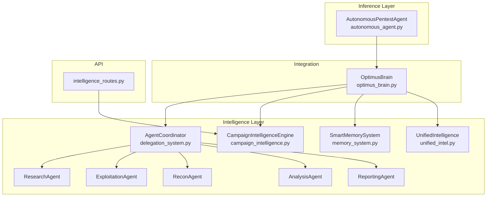
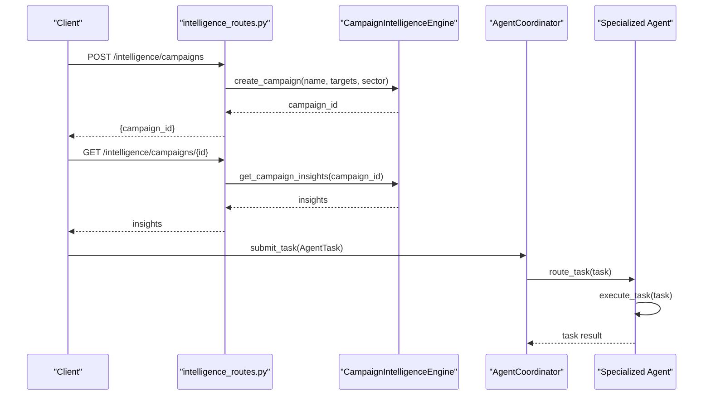
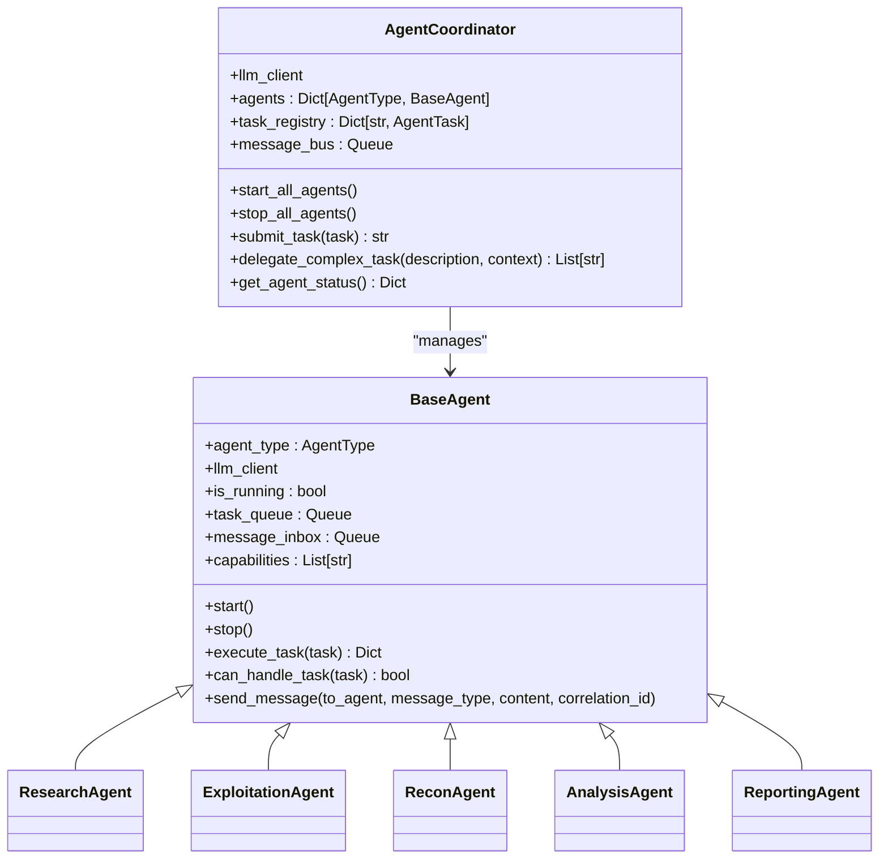
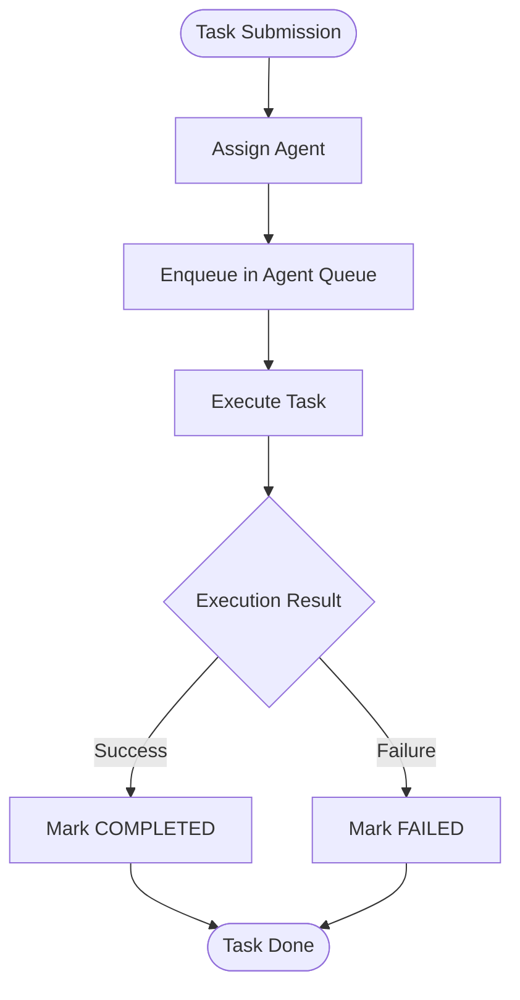
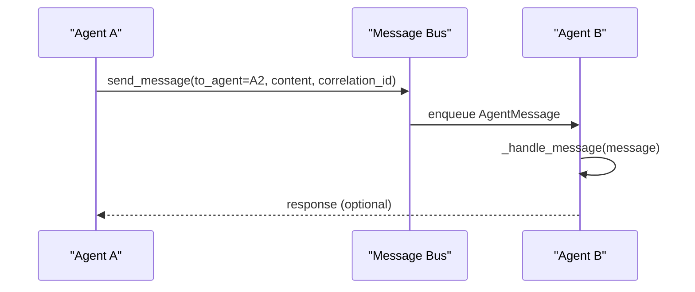
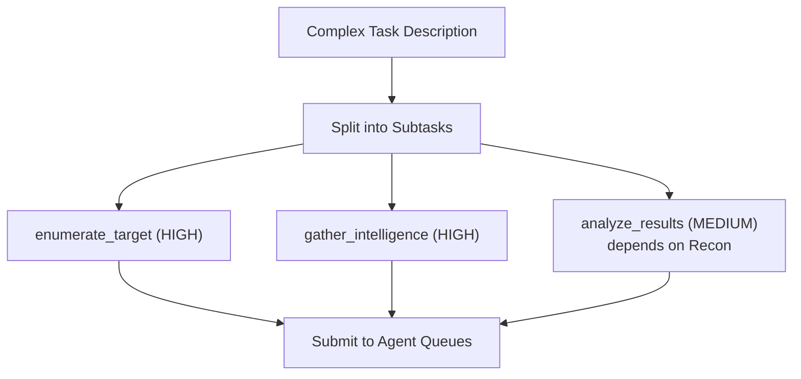
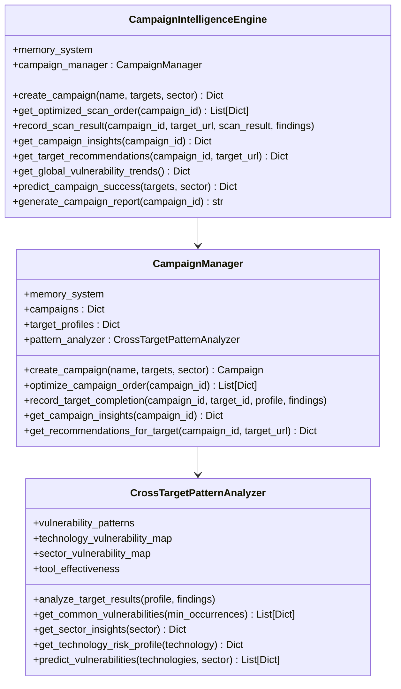
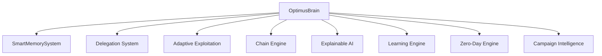
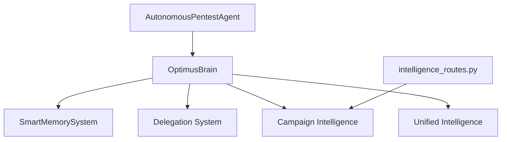

# Delegation and Multi-Agent Systems

<cite>
**Referenced Files in This Document**
- [delegation_system.py](file://backend/intelligence/delegation_system.py)
- [campaign_intelligence.py](file://backend/intelligence/campaign_intelligence.py)
- [optimus_brain.py](file://backend/intelligence/optimus_brain.py)
- [memory_system.py](file://backend/intelligence/memory_system.py)
- [unified_intel.py](file://backend/intelligence/unified_intel.py)
- [autonomous_agent.py](file://backend/inference/autonomous_agent.py)
- [intelligence_routes.py](file://backend/api/intelligence_routes.py)
</cite>

## Table of Contents
1. [Introduction](#introduction)
2. [Project Structure](#project-structure)
3. [Core Components](#core-components)
4. [Architecture Overview](#architecture-overview)
5. [Detailed Component Analysis](#detailed-component-analysis)
6. [Dependency Analysis](#dependency-analysis)
7. [Performance Considerations](#performance-considerations)
8. [Troubleshooting Guide](#troubleshooting-guide)
9. [Conclusion](#conclusion)

## Introduction
This document explains the delegation and multi-agent systems that power distributed intelligence processing and campaign-level coordination in the Optimus penetration testing platform. It covers the AgentCoordinator implementation for managing multiple specialized AI agents, task distribution algorithms, priority-based scheduling, and resource allocation strategies. It also documents multi-agent communication protocols, task decomposition mechanisms, collaborative decision-making processes, and the campaign intelligence system for multi-target, long-term penetration testing campaigns. Concrete delegation scenarios such as parallel vulnerability scanning, distributed exploitation coordination, and campaign-wide strategy adjustments are included, along with agent task management, configuration guidance, performance optimization, fault tolerance, and integration with other intelligence components.

## Project Structure
The delegation and multi-agent functionality spans several modules:
- Intelligence package: AgentCoordinator, specialized agents (Research, Exploitation, Recon, Analysis, Reporting), campaign intelligence, unified intelligence, and memory system
- Inference package: Autonomous agent orchestrating tools and integrating intelligence
- API routes: Campaign management endpoints
- Integration: Optimus Brain as the unified intelligence engine coordinating all subsystems

**Diagram sources**
- [delegation_system.py](file://backend/intelligence/delegation_system.py#L945-L1080)
- [campaign_intelligence.py](file://backend/intelligence/campaign_intelligence.py#L507-L689)
- [optimus_brain.py](file://backend/intelligence/optimus_brain.py#L46-L170)
- [memory_system.py](file://backend/intelligence/memory_system.py#L42-L186)
- [unified_intel.py](file://backend/intelligence/unified_intel.py#L52-L329)
- [autonomous_agent.py](file://backend/inference/autonomous_agent.py#L50-L132)
- [intelligence_routes.py](file://backend/api/intelligence_routes.py#L154-L189)

**Section sources**
- [delegation_system.py](file://backend/intelligence/delegation_system.py#L1-L1081)
- [campaign_intelligence.py](file://backend/intelligence/campaign_intelligence.py#L1-L689)
- [optimus_brain.py](file://backend/intelligence/optimus_brain.py#L1-L712)
- [memory_system.py](file://backend/intelligence/memory_system.py#L1-L1022)
- [unified_intel.py](file://backend/intelligence/unified_intel.py#L1-L329)
- [autonomous_agent.py](file://backend/inference/autonomous_agent.py#L1-L1642)
- [intelligence_routes.py](file://backend/api/intelligence_routes.py#L154-L189)

## Core Components
- AgentCoordinator: Manages specialized agents, routes tasks, handles inter-agent messaging, and supports task decomposition and dependency management
- Specialized Agents: ResearchAgent, ExploitationAgent, ReconAgent, AnalysisAgent, ReportingAgent with distinct capabilities and execution logic
- AgentTask and AgentMessage: Data structures for task definition, status tracking, and inter-agent communication
- CampaignIntelligenceEngine: Manages multi-target campaigns, cross-target learning, resource optimization, and pattern analysis
- OptimusBrain: Unified intelligence engine coordinating memory, delegation, adaptive exploitation, chaining, explainability, learning, zero-day discovery, and campaign intelligence
- SmartMemorySystem: Persistent memory for cross-scan learning, tool effectiveness, attack patterns, and target profiles
- UnifiedIntelligence: Aggregates surface web and dark web intelligence for threat assessments

**Section sources**
- [delegation_system.py](file://backend/intelligence/delegation_system.py#L32-L1081)
- [campaign_intelligence.py](file://backend/intelligence/campaign_intelligence.py#L87-L689)
- [optimus_brain.py](file://backend/intelligence/optimus_brain.py#L46-L651)
- [memory_system.py](file://backend/intelligence/memory_system.py#L42-L800)
- [unified_intel.py](file://backend/intelligence/unified_intel.py#L52-L329)

## Architecture Overview
The system implements a multi-agent architecture with centralized coordination and distributed execution:
- AgentCoordinator initializes and manages specialized agents
- Agents communicate via AgentMessage queues and can exchange context through shared memory
- CampaignIntelligenceEngine coordinates multi-target operations and learns across targets
- OptimusBrain integrates all subsystems for unified decision-making and adaptive behavior
- AutonomousPentestAgent orchestrates tool execution and integrates intelligence feedback loops

**Diagram sources**
- [intelligence_routes.py](file://backend/api/intelligence_routes.py#L154-L189)
- [campaign_intelligence.py](file://backend/intelligence/campaign_intelligence.py#L522-L580)
- [delegation_system.py](file://backend/intelligence/delegation_system.py#L985-L1057)

**Section sources**
- [intelligence_routes.py](file://backend/api/intelligence_routes.py#L154-L189)
- [campaign_intelligence.py](file://backend/intelligence/campaign_intelligence.py#L507-L689)
- [delegation_system.py](file://backend/intelligence/delegation_system.py#L945-L1080)

## Detailed Component Analysis

### AgentCoordinator Implementation
AgentCoordinator centralizes multi-agent orchestration:
- Initializes specialized agents (Research, Exploitation, Recon, Analysis, Reporting)
- Routes tasks to appropriate agents based on capability matching
- Supports task decomposition for complex operations (e.g., full pentest)
- Tracks task status and agent utilization
- Provides inter-agent messaging via AgentMessage bus

**Diagram sources**
- [delegation_system.py](file://backend/intelligence/delegation_system.py#L945-L1080)
- [delegation_system.py](file://backend/intelligence/delegation_system.py#L89-L217)
- [delegation_system.py](file://backend/intelligence/delegation_system.py#L219-L615)
- [delegation_system.py](file://backend/intelligence/delegation_system.py#L617-L694)
- [delegation_system.py](file://backend/intelligence/delegation_system.py#L696-L827)
- [delegation_system.py](file://backend/intelligence/delegation_system.py#L830-L943)

**Section sources**
- [delegation_system.py](file://backend/intelligence/delegation_system.py#L945-L1080)

### Task Management and Priority Scheduling
AgentTask defines task lifecycle and metadata:
- Fields include id, task_type, description, priority, payload, status, dependencies, timestamps
- TaskPriority enum supports CRITICAL, HIGH, MEDIUM, LOW
- TaskStatus enum tracks PENDING, IN_PROGRESS, COMPLETED, FAILED, CANCELLED
- Dependencies enable task chaining and coordinated execution

**Diagram sources**
- [delegation_system.py](file://backend/intelligence/delegation_system.py#L59-L76)
- [delegation_system.py](file://backend/intelligence/delegation_system.py#L42-L48)
- [delegation_system.py](file://backend/intelligence/delegation_system.py#L50-L57)

**Section sources**
- [delegation_system.py](file://backend/intelligence/delegation_system.py#L59-L76)
- [delegation_system.py](file://backend/intelligence/delegation_system.py#L42-L48)
- [delegation_system.py](file://backend/intelligence/delegation_system.py#L50-L57)

### Multi-Agent Communication Protocols
Agents communicate via AgentMessage:
- Message fields include from_agent, to_agent, message_type, content, correlation_id, timestamp
- send_message enqueues messages to recipient agent inbox
- _handle_message provides hook for custom inter-agent protocols
- Message correlation_id links related communications across agents

**Diagram sources**
- [delegation_system.py](file://backend/intelligence/delegation_system.py#L78-L87)
- [delegation_system.py](file://backend/intelligence/delegation_system.py#L180-L196)

**Section sources**
- [delegation_system.py](file://backend/intelligence/delegation_system.py#L78-L87)
- [delegation_system.py](file://backend/intelligence/delegation_system.py#L180-L196)

### Task Decomposition and Collaborative Decision-Making
AgentCoordinator.delegate_complex_task demonstrates decomposition:
- Rule-based decomposition for full pentest: reconnaissance, intelligence gathering, analysis
- Dependencies link subtasks (e.g., analysis depends on reconnaissance)
- Priority assignment ensures critical tasks execute first

**Diagram sources**
- [delegation_system.py](file://backend/intelligence/delegation_system.py#L1013-L1057)

**Section sources**
- [delegation_system.py](file://backend/intelligence/delegation_system.py#L1013-L1057)

### Campaign Intelligence System
CampaignIntelligenceEngine coordinates multi-target operations:
- CampaignManager creates and optimizes target orders based on priority, duration, and predicted vulnerability counts
- CrossTargetPatternAnalyzer extracts patterns across targets, technology-vulnerability maps, sector insights, and predicts vulnerabilities
- Memory integration records target completions, updates global patterns, and stores campaign results
- Recommendations leverage cross-campaign learning to suggest tools and predict outcomes

**Diagram sources**
- [campaign_intelligence.py](file://backend/intelligence/campaign_intelligence.py#L507-L689)
- [campaign_intelligence.py](file://backend/intelligence/campaign_intelligence.py#L254-L505)
- [campaign_intelligence.py](file://backend/intelligence/campaign_intelligence.py#L102-L252)

**Section sources**
- [campaign_intelligence.py](file://backend/intelligence/campaign_intelligence.py#L507-L689)
- [campaign_intelligence.py](file://backend/intelligence/campaign_intelligence.py#L254-L505)
- [campaign_intelligence.py](file://backend/intelligence/campaign_intelligence.py#L102-L252)

### Integration with Other Intelligence Components
OptimusBrain unifies intelligence subsystems:
- Integrates memory, web intelligence, delegation, adaptive exploitation, chaining, explainability, learning, zero-day discovery, and campaign intelligence
- Provides unified interfaces for tool selection, result processing, exploitation planning, and reporting
- Coordinates cross-component learning and decision-making

**Diagram sources**
- [optimus_brain.py](file://backend/intelligence/optimus_brain.py#L46-L170)
- [optimus_brain.py](file://backend/intelligence/optimus_brain.py#L171-L651)

**Section sources**
- [optimus_brain.py](file://backend/intelligence/optimus_brain.py#L46-L170)
- [optimus_brain.py](file://backend/intelligence/optimus_brain.py#L171-L651)

### Agent Task Management Examples
Concrete delegation scenarios:
- Parallel vulnerability scanning: Multiple agents execute complementary reconnaissance and scanning tasks concurrently, with AnalysisAgent correlating results
- Distributed exploitation coordination: ExploitationAgent generates plans and payloads; ReportingAgent produces summaries; ResearchAgent provides contextual intelligence
- Campaign-wide strategy adjustment: CampaignIntelligenceEngine analyzes cross-target patterns and recomputes optimal scan order; AgentCoordinator adjusts task priorities accordingly

**Section sources**
- [delegation_system.py](file://backend/intelligence/delegation_system.py#L1013-L1057)
- [campaign_intelligence.py](file://backend/intelligence/campaign_intelligence.py#L329-L358)

### Agent Configuration and Performance Optimization
- Agent configuration: Each agent exposes capabilities and can be extended with LLM integration for reasoning and decision-making
- Performance optimization: Asynchronous execution with event loops, thread-per-agent workers, and queue-based task distribution
- Fault tolerance: Graceful degradation when components are unavailable; fallback exploitation strategies; blacklist mechanism for ineffective tools

**Section sources**
- [delegation_system.py](file://backend/intelligence/delegation_system.py#L138-L178)
- [autonomous_agent.py](file://backend/inference/autonomous_agent.py#L1448-L1484)

## Dependency Analysis
The system exhibits layered dependencies:
- Intelligence layer depends on memory and unified intelligence for persistent learning and external data
- Inference layer orchestrates tool execution and integrates intelligence feedback
- API layer exposes campaign management endpoints
- OptimusBrain acts as a coordinator across all subsystems

**Diagram sources**
- [optimus_brain.py](file://backend/intelligence/optimus_brain.py#L46-L170)
- [memory_system.py](file://backend/intelligence/memory_system.py#L42-L186)
- [delegation_system.py](file://backend/intelligence/delegation_system.py#L945-L1080)
- [campaign_intelligence.py](file://backend/intelligence/campaign_intelligence.py#L507-L689)
- [unified_intel.py](file://backend/intelligence/unified_intel.py#L52-L329)
- [autonomous_agent.py](file://backend/inference/autonomous_agent.py#L50-L132)
- [intelligence_routes.py](file://backend/api/intelligence_routes.py#L154-L189)

**Section sources**
- [optimus_brain.py](file://backend/intelligence/optimus_brain.py#L46-L170)
- [memory_system.py](file://backend/intelligence/memory_system.py#L42-L186)
- [delegation_system.py](file://backend/intelligence/delegation_system.py#L945-L1080)
- [campaign_intelligence.py](file://backend/intelligence/campaign_intelligence.py#L507-L689)
- [unified_intel.py](file://backend/intelligence/unified_intel.py#L52-L329)
- [autonomous_agent.py](file://backend/inference/autonomous_agent.py#L50-L132)
- [intelligence_routes.py](file://backend/api/intelligence_routes.py#L154-L189)

## Performance Considerations
- Asynchronous execution: Agents use asyncio event loops to maximize throughput
- Thread-per-agent: Isolates blocking operations and prevents starvation
- Queue-based scheduling: Enables backpressure and predictable latency
- Memory-backed learning: Reduces repeated computation and accelerates decision-making
- Tool effectiveness tracking: Guides future tool selection and reduces wasted execution

[No sources needed since this section provides general guidance]

## Troubleshooting Guide
Common issues and resolutions:
- Agent not responding: Verify agent.start() called and worker thread alive; check logging for errors
- Task stuck in PENDING: Confirm can_handle_task matches task_type; verify AgentCoordinator routing logic
- Memory errors: Ensure SmartMemorySystem database initialized and accessible; check embedding dimension alignment
- Campaign recommendations stale: Trigger pattern re-analysis after new scan results; verify global pattern analyzer updated
- Tool blacklisting: Review blacklist decision logic; adjust thresholds if needed

**Section sources**
- [delegation_system.py](file://backend/intelligence/delegation_system.py#L131-L137)
- [delegation_system.py](file://backend/intelligence/delegation_system.py#L1002-L1007)
- [memory_system.py](file://backend/intelligence/memory_system.py#L71-L186)
- [autonomous_agent.py](file://backend/inference/autonomous_agent.py#L1448-L1484)

## Conclusion
The Optimus platform implements a robust multi-agent system for distributed intelligence processing and campaign-level coordination. AgentCoordinator orchestrates specialized agents with priority-based scheduling and inter-agent communication. CampaignIntelligenceEngine enables cross-target learning and resource optimization. OptimusBrain unifies all subsystems for intelligent decision-making and adaptive behavior. Together, these components support scalable, fault-tolerant, and explainable penetration testing operations across multiple targets and long-term campaigns.