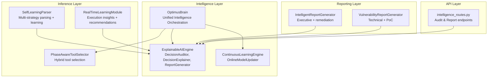
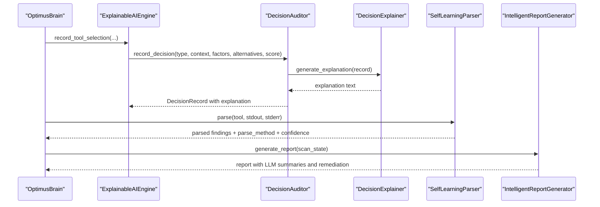
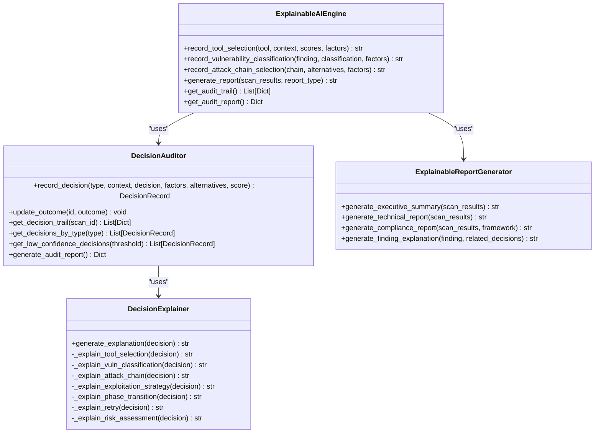
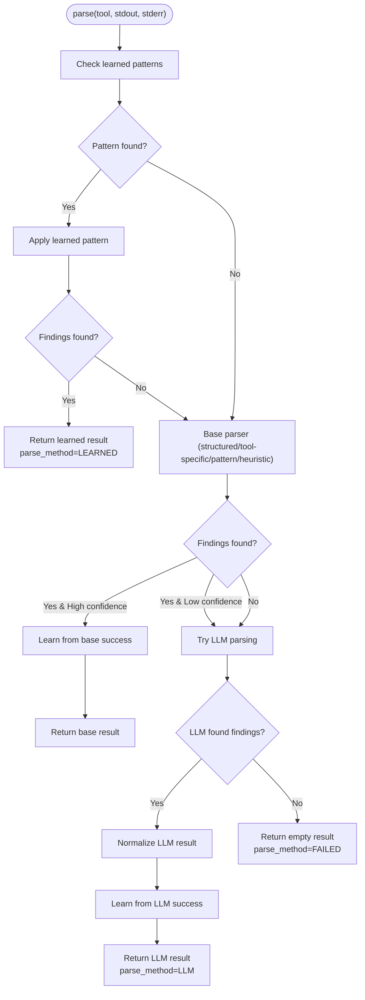
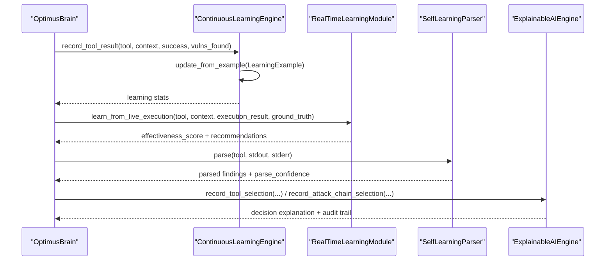
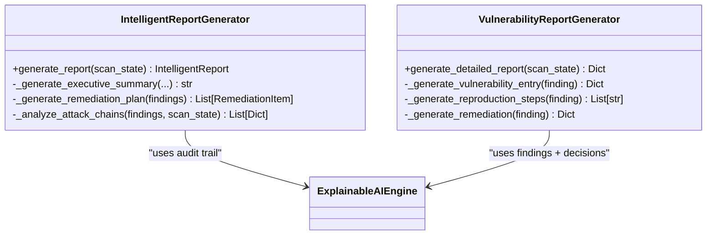
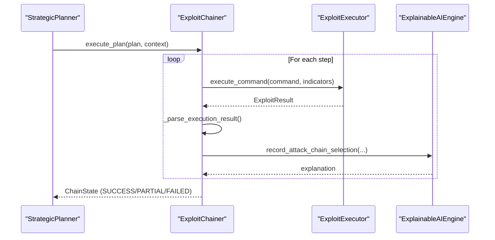
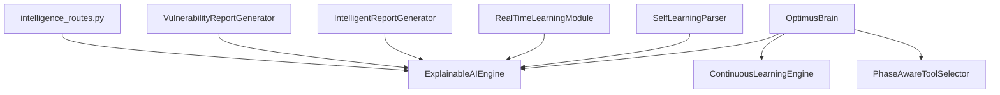

# Explainable AI Systems

<cite>
**Referenced Files in This Document**
- [explainable_ai.py](file://backend/intelligence/explainable_ai.py)
- [self_learning_parser.py](file://backend/inference/self_learning_parser.py)
- [continuous_learning.py](file://backend/intelligence/continuous_learning.py)
- [learning_module.py](file://backend/inference/learning_module.py)
- [intelligent_reporter.py](file://backend/reporting/intelligent_reporter.py)
- [optimus_brain.py](file://backend/intelligence/optimus_brain.py)
- [tool_selector.py](file://backend/inference/tool_selector.py)
- [exploit_chainer.py](file://backend/exploitation/exploit_chainer.py)
- [report_generator.py](file://backend/reporting/report_generator.py)
- [intelligence_routes.py](file://backend/api/intelligence_routes.py)
</cite>

## Table of Contents
1. [Introduction](#introduction)
2. [Project Structure](#project-structure)
3. [Core Components](#core-components)
4. [Architecture Overview](#architecture-overview)
5. [Detailed Component Analysis](#detailed-component-analysis)
6. [Dependency Analysis](#dependency-analysis)
7. [Performance Considerations](#performance-considerations)
8. [Troubleshooting Guide](#troubleshooting-guide)
9. [Conclusion](#conclusion)
10. [Appendices](#appendices)

## Introduction
This document explains the explainable AI systems that power decision transparency and learning integration within the intelligence framework. It covers:
- The ExplainableAIEngine for tracking and documenting AI decision rationale, maintaining audit trails for tool selection, exploitation planning, and learning adaptations
- The self-learning parser integration enabling AI systems to improve output interpretation and decision-making over time
- Explanation generation mechanisms for different report types, decision factor weighting, confidence scoring, and traceability of AI reasoning processes
- Concrete examples of explainable AI outputs such as tool selection justifications, exploitation chain recommendations, and learning progress reports
- Integration with other intelligence components for comprehensive decision documentation
- Strategies for maintaining explainability while optimizing AI performance

## Project Structure
The explainable AI ecosystem spans several modules:
- Intelligence layer: Explainable AI engine, continuous learning, and unified brain orchestration
- Inference layer: Self-learning parser and learning modules
- Reporting layer: Intelligent reporter and detailed vulnerability report generator
- API layer: Expose audit trails and reports

**Diagram sources**
- [explainable_ai.py](file://backend/intelligence/explainable_ai.py#L682-L931)
- [continuous_learning.py](file://backend/intelligence/continuous_learning.py#L268-L376)
- [optimus_brain.py](file://backend/intelligence/optimus_brain.py#L46-L170)
- [self_learning_parser.py](file://backend/inference/self_learning_parser.py#L41-L554)
- [learning_module.py](file://backend/inference/learning_module.py#L11-L354)
- [intelligent_reporter.py](file://backend/reporting/intelligent_reporter.py#L72-L555)
- [report_generator.py](file://backend/reporting/report_generator.py#L14-L438)
- [intelligence_routes.py](file://backend/api/intelligence_routes.py#L222-L251)

**Section sources**
- [explainable_ai.py](file://backend/intelligence/explainable_ai.py#L1-L932)
- [self_learning_parser.py](file://backend/inference/self_learning_parser.py#L1-L554)
- [continuous_learning.py](file://backend/intelligence/continuous_learning.py#L1-L946)
- [learning_module.py](file://backend/inference/learning_module.py#L1-L354)
- [intelligent_reporter.py](file://backend/reporting/intelligent_reporter.py#L1-L555)
- [optimus_brain.py](file://backend/intelligence/optimus_brain.py#L1-L712)
- [tool_selector.py](file://backend/inference/tool_selector.py#L1-L516)
- [exploit_chainer.py](file://backend/exploitation/exploit_chainer.py#L1-L865)
- [report_generator.py](file://backend/reporting/report_generator.py#L1-L438)
- [intelligence_routes.py](file://backend/api/intelligence_routes.py#L222-L251)

## Core Components
- ExplainableAIEngine: Central orchestrator for decision recording, explanation generation, and report creation. It maintains an audit trail and generates human-readable explanations for tool selection, vulnerability classification, attack chains, and risk assessments.
- DecisionAuditor: Stores DecisionRecord instances with factors, alternatives, confidence levels, and outcomes. Provides statistics and audit reports.
- DecisionExplainer: Template-driven explanation generator for different decision types with confidence and contextual reasoning.
- ExplainableReportGenerator: Produces executive, technical, and compliance reports with decision transparency and confidence summaries.
- SelfLearningParser: Multi-strategy parser that learns from successful parsing to improve accuracy and reduce reliance on expensive LLM calls.
- ContinuousLearningEngine: Online model updater that continuously improves tool selection and pattern recognition from production feedback.
- RealTimeLearningModule: Tracks execution effectiveness and provides recommendations for tool usage and alternative strategies.
- OptimusBrain: Unified intelligence engine integrating explainability, learning, and exploitation planning into cohesive decision-making.

**Section sources**
- [explainable_ai.py](file://backend/intelligence/explainable_ai.py#L682-L931)
- [self_learning_parser.py](file://backend/inference/self_learning_parser.py#L41-L554)
- [continuous_learning.py](file://backend/intelligence/continuous_learning.py#L268-L376)
- [learning_module.py](file://backend/inference/learning_module.py#L11-L354)
- [optimus_brain.py](file://backend/intelligence/optimus_brain.py#L46-L170)

## Architecture Overview
The explainable AI system integrates with the broader intelligence framework to provide transparent, auditable, and continuously improving decision-making.

**Diagram sources**
- [optimus_brain.py](file://backend/intelligence/optimus_brain.py#L228-L326)
- [explainable_ai.py](file://backend/intelligence/explainable_ai.py#L698-L745)
- [self_learning_parser.py](file://backend/inference/self_learning_parser.py#L88-L204)
- [intelligent_reporter.py](file://backend/reporting/intelligent_reporter.py#L102-L160)

## Detailed Component Analysis

### ExplainableAIEngine and Decision Transparency
The engine records decisions with:
- DecisionType enumeration for categorization (tool selection, vulnerability classification, attack chain, etc.)
- Factor objects capturing name, description, weight, value, impact, and source
- Alternative options with reasons for non-selection
- Confidence levels mapped from numeric scores
- Human-readable explanations via DecisionExplainer templates

**Diagram sources**
- [explainable_ai.py](file://backend/intelligence/explainable_ai.py#L682-L931)

**Section sources**
- [explainable_ai.py](file://backend/intelligence/explainable_ai.py#L31-L123)
- [explainable_ai.py](file://backend/intelligence/explainable_ai.py#L125-L338)
- [explainable_ai.py](file://backend/intelligence/explainable_ai.py#L341-L488)
- [explainable_ai.py](file://backend/intelligence/explainable_ai.py#L490-L680)
- [explainable_ai.py](file://backend/intelligence/explainable_ai.py#L682-L931)

### Self-Learning Parser Integration
The SelfLearningParser implements a multi-strategy parsing pipeline:
- Learned patterns (from pattern DB) for known outputs
- Structured parsing (JSON/XML), tool-specific parsers, and pattern-based extraction
- LLM parsing (Ollama) as a fallback for complex/unknown outputs
- Learning from successful parses to cache patterns and boost confidence

**Diagram sources**
- [self_learning_parser.py](file://backend/inference/self_learning_parser.py#L88-L204)
- [self_learning_parser.py](file://backend/inference/self_learning_parser.py#L292-L344)

**Section sources**
- [self_learning_parser.py](file://backend/inference/self_learning_parser.py#L41-L554)

### Continuous Learning and Real-Time Adaptation
Two complementary learning systems enhance explainability and performance:
- OnlineModelUpdater in ContinuousLearningEngine updates model weights from production signals (tool success/failure, vulnerability confirmation/false positives, chain success/failure)
- RealTimeLearningModule tracks execution effectiveness and provides recommendations and alternative tools

**Diagram sources**
- [continuous_learning.py](file://backend/intelligence/continuous_learning.py#L268-L376)
- [learning_module.py](file://backend/inference/learning_module.py#L42-L170)
- [self_learning_parser.py](file://backend/inference/self_learning_parser.py#L88-L204)
- [optimus_brain.py](file://backend/intelligence/optimus_brain.py#L328-L427)
- [explainable_ai.py](file://backend/intelligence/explainable_ai.py#L698-L805)

**Section sources**
- [continuous_learning.py](file://backend/intelligence/continuous_learning.py#L64-L266)
- [learning_module.py](file://backend/inference/learning_module.py#L11-L354)

### Reporting and Explanation Generation
Reports are generated with varying levels of detail:
- Executive summary with LLM assistance and prioritized remediation
- Technical report with decision audit trail and confidence distributions
- Compliance report with decision accountability and low-confidence review
- Finding-level explanations aggregating confidence from related decisions

**Diagram sources**
- [intelligent_reporter.py](file://backend/reporting/intelligent_reporter.py#L72-L555)
- [report_generator.py](file://backend/reporting/report_generator.py#L14-L438)
- [explainable_ai.py](file://backend/intelligence/explainable_ai.py#L490-L680)

**Section sources**
- [intelligent_reporter.py](file://backend/reporting/intelligent_reporter.py#L72-L555)
- [report_generator.py](file://backend/reporting/report_generator.py#L14-L438)

### Exploitation Planning and Chain Recommendations
Exploit chaining builds on explainable decisions to recommend and justify attack sequences:
- ChainState tracks sessions, credentials, extracted data, and environment
- StepResult captures outcomes, sessions, credentials, and data extraction
- ExploitChainer orchestrates multi-step chains with retries and fallbacks

**Diagram sources**
- [exploit_chainer.py](file://backend/exploitation/exploit_chainer.py#L345-L461)
- [explainable_ai.py](file://backend/intelligence/explainable_ai.py#L786-L805)

**Section sources**
- [exploit_chainer.py](file://backend/exploitation/exploit_chainer.py#L135-L227)
- [exploit_chainer.py](file://backend/exploitation/exploit_chainer.py#L345-L461)

## Dependency Analysis
The explainable AI system integrates tightly with the unified intelligence engine and reporting components.

**Diagram sources**
- [optimus_brain.py](file://backend/intelligence/optimus_brain.py#L46-L170)
- [intelligence_routes.py](file://backend/api/intelligence_routes.py#L222-L251)

**Section sources**
- [optimus_brain.py](file://backend/intelligence/optimus_brain.py#L171-L510)
- [intelligence_routes.py](file://backend/api/intelligence_routes.py#L222-L251)

## Performance Considerations
- Confidence scoring: Decision confidence is derived from factor margins and learned patterns, enabling prioritization of high-certainty decisions.
- Learning efficiency: SelfLearningParser reduces LLM usage by caching successful patterns and normalizing results to a standard format.
- Online learning: ContinuousLearningEngine updates model weights incrementally, minimizing disruption while improving accuracy.
- Hybrid tool selection: PhaseAwareToolSelector combines phase-specific models, rule-based heuristics, and availability checks to reduce wasted attempts.

[No sources needed since this section provides general guidance]

## Troubleshooting Guide
Common issues and resolutions:
- Explainability endpoints unavailable: Ensure the ExplainableAIEngine is initialized and exposed via API routes.
- Low-confidence decisions: Review the audit report to identify patterns and adjust factors or increase learning iterations.
- Parsing failures: Verify SelfLearningParser configuration and check pattern DB statistics for ineffective patterns.
- Learning not updating: Confirm continuous learning signals are being recorded and model weights are saved periodically.

**Section sources**
- [intelligence_routes.py](file://backend/api/intelligence_routes.py#L222-L251)
- [explainable_ai.py](file://backend/intelligence/explainable_ai.py#L415-L464)
- [self_learning_parser.py](file://backend/inference/self_learning_parser.py#L513-L537)
- [continuous_learning.py](file://backend/intelligence/continuous_learning.py#L111-L125)

## Conclusion
The explainable AI systems deliver transparent, auditable, and continuously improving decision-making across tool selection, vulnerability classification, exploitation planning, and reporting. By combining structured explanations, confidence scoring, and learning integrations, the framework supports both compliance and performance optimization while maintaining trust in AI-driven security operations.

[No sources needed since this section summarizes without analyzing specific files]

## Appendices

### Configuration and Verbosity Controls
- Explanation verbosity: Adjust DecisionExplainer templates to emphasize factors, alternatives, and confidence levels.
- Confidence thresholds: Tune DecisionAuditor thresholds for low-confidence decisions requiring manual review.
- Learning parameters: Configure SelfLearningParser thresholds for minimum confidence and pattern success counts.
- Report types: Choose between executive, technical, and compliance reports based on stakeholder needs.

**Section sources**
- [explainable_ai.py](file://backend/intelligence/explainable_ai.py#L125-L338)
- [explainable_ai.py](file://backend/intelligence/explainable_ai.py#L415-L464)
- [self_learning_parser.py](file://backend/inference/self_learning_parser.py#L513-L529)

### Concrete Examples of Explainable Outputs
- Tool selection justification: Highlights top positive factors, alternative tools, and confidence level.
- Exploitation chain recommendation: Describes chain logic, selected path rationale, and alternative chains.
- Learning progress report: Summarizes decision confidence distribution, low-confidence items, and timeline of decisions.

**Section sources**
- [explainable_ai.py](file://backend/intelligence/explainable_ai.py#L150-L179)
- [explainable_ai.py](file://backend/intelligence/explainable_ai.py#L212-L230)
- [explainable_ai.py](file://backend/intelligence/explainable_ai.py#L415-L464)