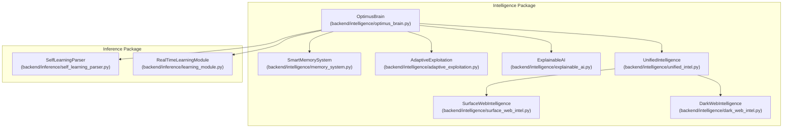
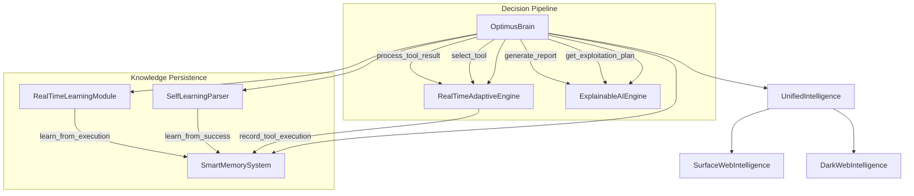
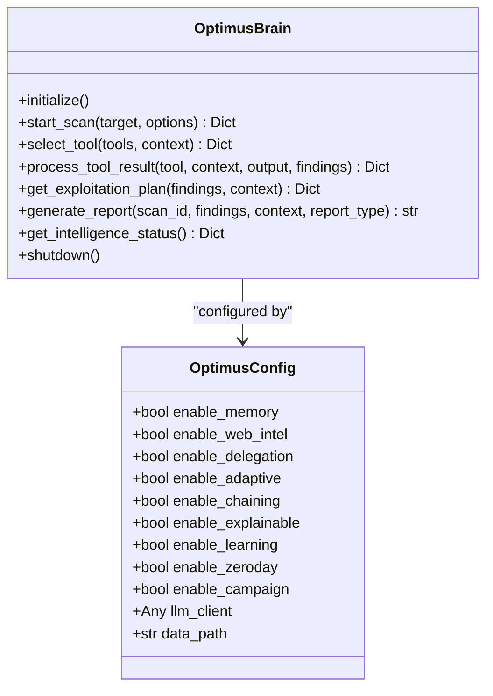
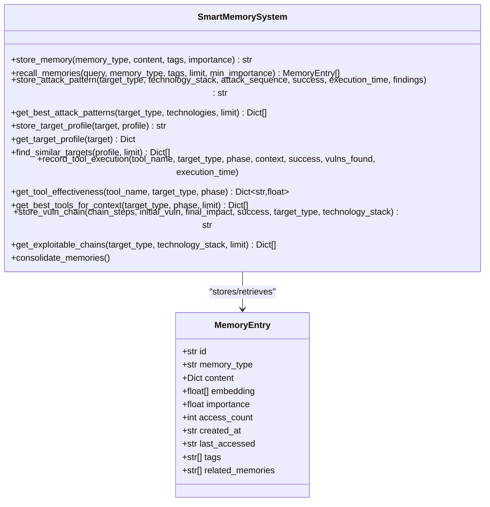
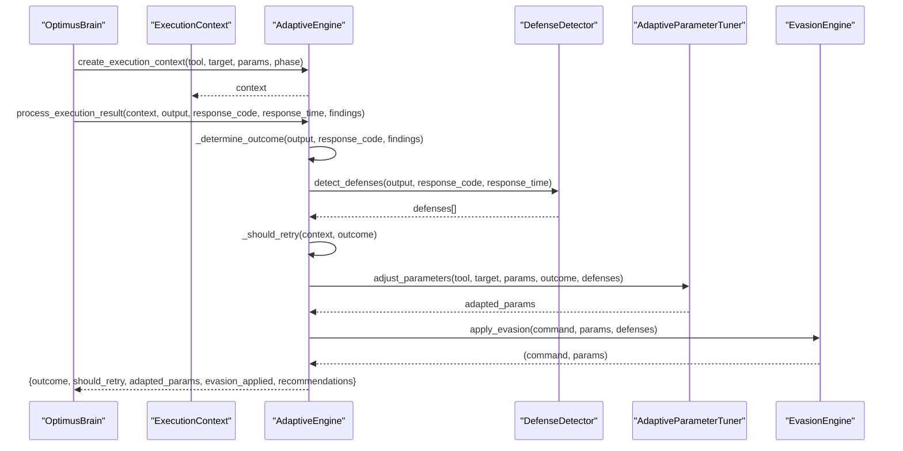
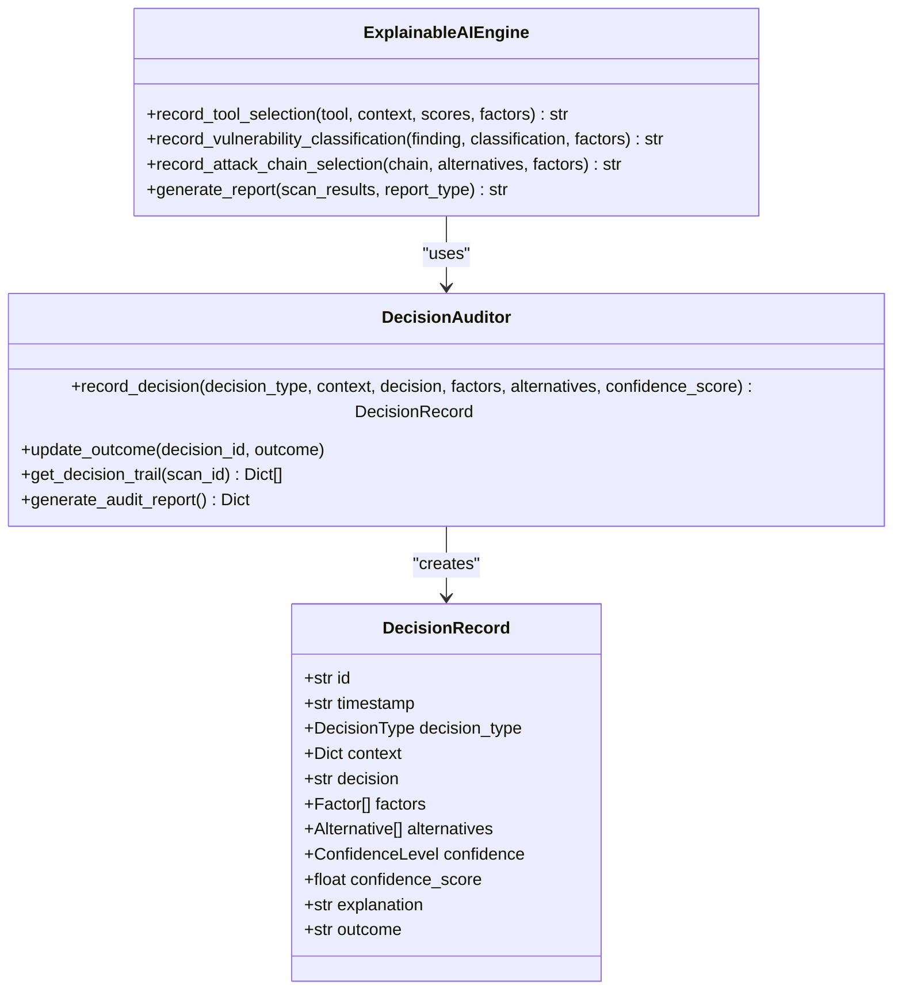
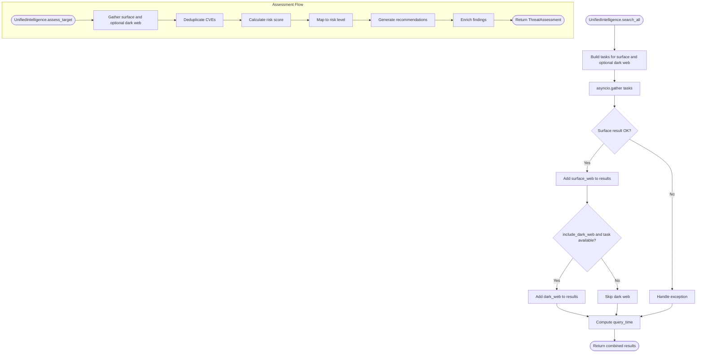
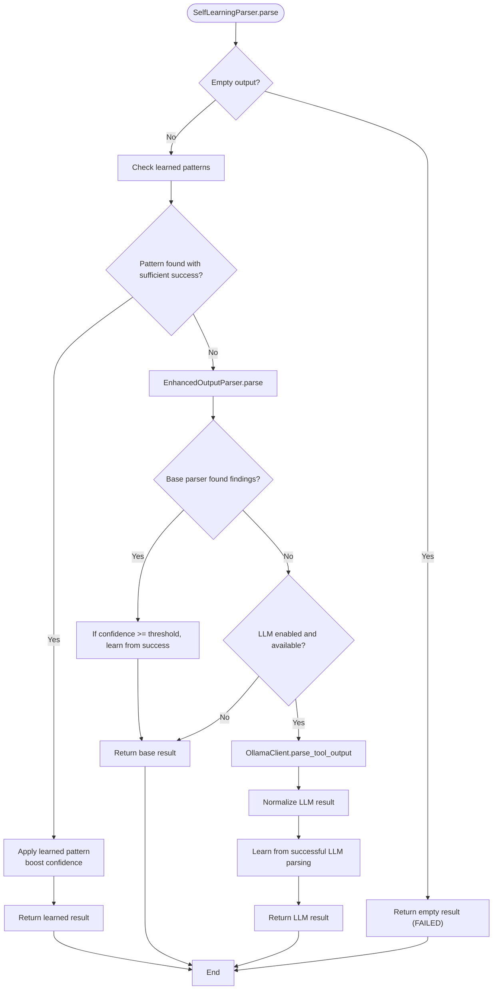
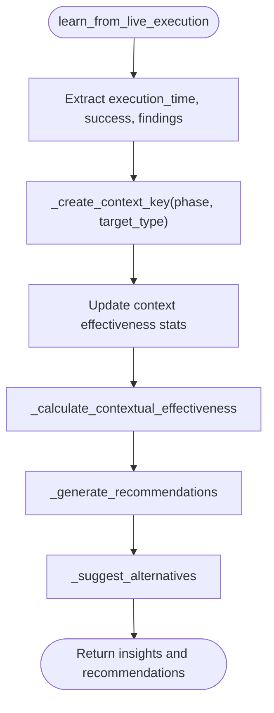
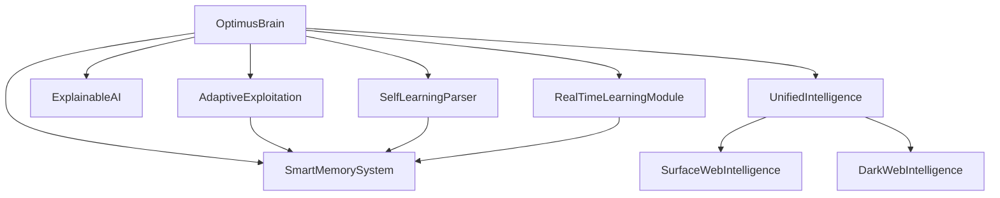

# Intelligence and AI Systems

<cite>
**Referenced Files in This Document**
- [optimus_brain.py](file://backend/intelligence/optimus_brain.py)
- [memory_system.py](file://backend/intelligence/memory_system.py)
- [unified_intel.py](file://backend/intelligence/unified_intel.py)
- [surface_web_intel.py](file://backend/intelligence/surface_web_intel.py)
- [dark_web_intel.py](file://backend/intelligence/dark_web_intel.py)
- [adaptive_exploitation.py](file://backend/intelligence/adaptive_exploitation.py)
- [explainable_ai.py](file://backend/intelligence/explainable_ai.py)
- [self_learning_parser.py](file://backend/inference/self_learning_parser.py)
- [learning_module.py](file://backend/inference/learning_module.py)
- [__init__.py](file://backend/intelligence/__init__.py)
</cite>

## Table of Contents
1. [Introduction](#introduction)
2. [Project Structure](#project-structure)
3. [Core Components](#core-components)
4. [Architecture Overview](#architecture-overview)
5. [Detailed Component Analysis](#detailed-component-analysis)
6. [Dependency Analysis](#dependency-analysis)
7. [Performance Considerations](#performance-considerations)
8. [Troubleshooting Guide](#troubleshooting-guide)
9. [Conclusion](#conclusion)

## Introduction
This document explains the intelligence and AI systems powering Optimus, focusing on the unified intelligence interface, cross-scan memory, adaptive exploitation strategies, explainable AI, and self-learning parsers. It provides both conceptual overviews for AI researchers and technical details for developers integrating or extending machine learning systems within the platform. The content maps directly to the codebase and highlights how components collaborate to improve decision-making, persistence of knowledge, and autonomous adaptation during penetration testing.

## Project Structure
The intelligence subsystems are organized under the backend/intelligence package and integrate with inference modules under backend/inference. The unified intelligence engine orchestrates specialized engines for memory, adaptive exploitation, explainable AI, and web intelligence, while inference modules provide self-learning parsing and real-time learning.

**Diagram sources**
- [optimus_brain.py](file://backend/intelligence/optimus_brain.py#L46-L170)
- [memory_system.py](file://backend/intelligence/memory_system.py#L42-L70)
- [adaptive_exploitation.py](file://backend/intelligence/adaptive_exploitation.py#L474-L507)
- [explainable_ai.py](file://backend/intelligence/explainable_ai.py#L682-L696)
- [unified_intel.py](file://backend/intelligence/unified_intel.py#L52-L71)
- [surface_web_intel.py](file://backend/intelligence/surface_web_intel.py#L86-L106)
- [dark_web_intel.py](file://backend/intelligence/dark_web_intel.py#L62-L92)
- [self_learning_parser.py](file://backend/inference/self_learning_parser.py#L41-L86)
- [learning_module.py](file://backend/inference/learning_module.py#L11-L26)

**Section sources**
- [__init__.py](file://backend/intelligence/__init__.py#L1-L80)

## Core Components
- Unified Intelligence Engine (OptimusBrain): Central coordinator that initializes and orchestrates memory, adaptive exploitation, explainable AI, vulnerability chaining, web intelligence, and learning engines. It exposes unified interfaces for tool selection, result processing, exploitation planning, and reporting.
- Cross-scan Memory System (SmartMemorySystem): Persistent, vector-backed memory enabling long-term retention of attack patterns, target profiles, tool effectiveness, vulnerability chains, and scan history. Supports semantic recall and cross-scan learning.
- Adaptive Exploitation (RealTimeAdaptiveEngine): Real-time adaptation engine that detects defenses, adjusts parameters, selects strategies via Bayesian inference, and applies evasion techniques to improve exploitation success.
- Explainable AI (ExplainableAIEngine): Decision auditing and reporting engine that records and explains AI decisions, generates human-readable explanations, and produces compliance-ready reports.
- Unified Intelligence API (UnifiedIntelligence): Aggregates surface web and optionally dark web intelligence, performs threat assessments, and enriches findings with risk scores and recommendations.
- Self-Learning Parser (SelfLearningParser): Multi-strategy parser that learns from successful parses, leverages LLM assistance, and maintains statistics for monitoring and improvement.
- Real-Time Learning Module (RealTimeLearningModule): Tracks tool effectiveness, identifies patterns, and provides recommendations to guide tool selection and phase transitions.

**Section sources**
- [optimus_brain.py](file://backend/intelligence/optimus_brain.py#L46-L170)
- [memory_system.py](file://backend/intelligence/memory_system.py#L42-L185)
- [adaptive_exploitation.py](file://backend/intelligence/adaptive_exploitation.py#L474-L507)
- [explainable_ai.py](file://backend/intelligence/explainable_ai.py#L682-L696)
- [unified_intel.py](file://backend/intelligence/unified_intel.py#L52-L207)
- [self_learning_parser.py](file://backend/inference/self_learning_parser.py#L41-L86)
- [learning_module.py](file://backend/inference/learning_module.py#L11-L26)

## Architecture Overview
The unified intelligence interface integrates specialized engines to deliver autonomous decision-making. The OptimusBrain initializes components, coordinates tool selection, adapts exploitation in real time, and ensures decisions are auditable and explainable. Cross-scan memory persists knowledge across assessments, while the self-learning parser improves output interpretation over time.

**Diagram sources**
- [optimus_brain.py](file://backend/intelligence/optimus_brain.py#L173-L510)
- [adaptive_exploitation.py](file://backend/intelligence/adaptive_exploitation.py#L527-L613)
- [explainable_ai.py](file://backend/intelligence/explainable_ai.py#L682-L800)
- [unified_intel.py](file://backend/intelligence/unified_intel.py#L72-L207)
- [memory_system.py](file://backend/intelligence/memory_system.py#L639-L760)
- [self_learning_parser.py](file://backend/inference/self_learning_parser.py#L292-L344)
- [learning_module.py](file://backend/inference/learning_module.py#L42-L112)

## Detailed Component Analysis

### Unified Intelligence Engine (OptimusBrain)
The unified intelligence engine coordinates all subsystems and exposes high-level APIs for scanning, tool selection, result processing, exploitation planning, and reporting. It initializes components conditionally, gathers pre-scan intelligence, and integrates learning and adaptive engines to inform decisions.

**Diagram sources**
- [optimus_brain.py](file://backend/intelligence/optimus_brain.py#L30-L170)

**Section sources**
- [optimus_brain.py](file://backend/intelligence/optimus_brain.py#L173-L510)

### Cross-scan Memory System (SmartMemorySystem)
The persistent memory system stores and retrieves knowledge across scans using structured tables and vector embeddings. It supports attack patterns, target profiles, tool effectiveness, vulnerability chains, and scan history, enabling long-term learning and semantic recall.

**Diagram sources**
- [memory_system.py](file://backend/intelligence/memory_system.py#L42-L185)
- [memory_system.py](file://backend/intelligence/memory_system.py#L189-L322)

**Section sources**
- [memory_system.py](file://backend/intelligence/memory_system.py#L42-L800)

### Adaptive Exploitation (RealTimeAdaptiveEngine)
The adaptive exploitation engine monitors execution outcomes, detects defenses, and dynamically adjusts parameters and strategies. It uses Bayesian strategy selection and evasion techniques to improve exploitation success rates in real time.

**Diagram sources**
- [adaptive_exploitation.py](file://backend/intelligence/adaptive_exploitation.py#L509-L613)
- [adaptive_exploitation.py](file://backend/intelligence/adaptive_exploitation.py#L527-L662)
- [adaptive_exploitation.py](file://backend/intelligence/adaptive_exploitation.py#L615-L662)

**Section sources**
- [adaptive_exploitation.py](file://backend/intelligence/adaptive_exploitation.py#L474-L800)

### Explainable AI (ExplainableAIEngine)
The explainable AI engine records decisions, generates human-readable explanations, and produces comprehensive reports. It tracks factors, alternatives, and confidence levels to ensure transparency and auditability.

**Diagram sources**
- [explainable_ai.py](file://backend/intelligence/explainable_ai.py#L682-L696)
- [explainable_ai.py](file://backend/intelligence/explainable_ai.py#L341-L488)
- [explainable_ai.py](file://backend/intelligence/explainable_ai.py#L75-L123)

**Section sources**
- [explainable_ai.py](file://backend/intelligence/explainable_ai.py#L682-L932)

### Unified Intelligence API (UnifiedIntelligence)
The unified intelligence API aggregates surface web and optionally dark web intelligence, performs threat assessments, and enriches findings with risk scores and recommendations. It deduplicates vulnerabilities, calculates risk, and generates actionable outputs.

**Diagram sources**
- [unified_intel.py](file://backend/intelligence/unified_intel.py#L72-L123)
- [unified_intel.py](file://backend/intelligence/unified_intel.py#L125-L207)

**Section sources**
- [unified_intel.py](file://backend/intelligence/unified_intel.py#L52-L329)

### Self-Learning Parser (SelfLearningParser)
The self-learning parser combines learned patterns, structured parsing, tool-specific parsers, LLM assistance, and pattern-based extraction. It learns from successful parses, normalizes LLM outputs, and maintains statistics for monitoring.

**Diagram sources**
- [self_learning_parser.py](file://backend/inference/self_learning_parser.py#L88-L204)
- [self_learning_parser.py](file://backend/inference/self_learning_parser.py#L292-L344)

**Section sources**
- [self_learning_parser.py](file://backend/inference/self_learning_parser.py#L41-L554)

### Real-Time Learning Module (RealTimeLearningModule)
The real-time learning module tracks tool effectiveness, identifies patterns, and provides recommendations to guide tool selection and phase transitions. It computes contextual effectiveness and suggests alternatives.

**Diagram sources**
- [learning_module.py](file://backend/inference/learning_module.py#L114-L169)
- [learning_module.py](file://backend/inference/learning_module.py#L171-L232)

**Section sources**
- [learning_module.py](file://backend/inference/learning_module.py#L11-L354)

## Dependency Analysis
The intelligence subsystems depend on each other and on inference modules. The OptimusBrain orchestrates initialization and delegates to specialized engines. The adaptive exploitation engine relies on memory for tool effectiveness and defense patterns. The explainable AI engine consumes decisions from orchestration. The unified intelligence API depends on surface and dark web collectors. The self-learning parser and real-time learning module contribute to improved parsing and decision quality.

**Diagram sources**
- [optimus_brain.py](file://backend/intelligence/optimus_brain.py#L79-L170)
- [adaptive_exploitation.py](file://backend/intelligence/adaptive_exploitation.py#L482-L507)
- [explainable_ai.py](file://backend/intelligence/explainable_ai.py#L689-L696)
- [unified_intel.py](file://backend/intelligence/unified_intel.py#L62-L68)
- [self_learning_parser.py](file://backend/inference/self_learning_parser.py#L62-L67)
- [learning_module.py](file://backend/inference/learning_module.py#L14-L25)

**Section sources**
- [optimus_brain.py](file://backend/intelligence/optimus_brain.py#L79-L170)
- [__init__.py](file://backend/intelligence/__init__.py#L16-L79)

## Performance Considerations
- Asynchronous Intelligence Gathering: UnifiedIntelligence and SurfaceWebIntelligence use asynchronous operations to query multiple sources concurrently, reducing latency and improving throughput.
- Caching and Deduplication: SurfaceWebIntelligence employs caching with TTL and deduplication by CVE ID to minimize redundant queries and processing overhead.
- Vector-backed Memory: SmartMemorySystem uses embeddings and semantic ranking to accelerate recall and reduce search space for relevant memories.
- Adaptive Parameter Tuning: AdaptiveExploitation adjusts concurrency, timeouts, and delays based on outcomes, balancing speed and reliability.
- Learning Efficiency: SelfLearningParser prioritizes learned patterns and structured parsing to avoid expensive LLM calls, while still leveraging LLM for complex outputs.
- Real-Time Learning: RealTimeLearningModule maintains bounded histories and computes contextual effectiveness to avoid memory bloat and provide timely recommendations.

[No sources needed since this section provides general guidance]

## Troubleshooting Guide
- Tor Support Disabled: DarkWebIntelligence requires Tor connectivity; if aiohttp_socks is unavailable, dark web features are disabled. Verify proxy configuration and availability.
- Empty or Low Confidence Parsing: SelfLearningParser falls back to base parsing and LLM; check tool output normalization and pattern database health.
- Memory Initialization Failures: SmartMemorySystem initializes SQLite tables and indexes; ensure write permissions and disk space.
- Adaptive Engine Exceptions: RealTimeAdaptiveEngine logs errors during parameter tuning and evasion; verify tool configurations and detected defense signatures.
- Explainability Audit Gaps: ExplainableAIEngine records decisions and generates reports; confirm that decision types and factors are populated during orchestration.

**Section sources**
- [dark_web_intel.py](file://backend/intelligence/dark_web_intel.py#L19-L25)
- [self_learning_parser.py](file://backend/inference/self_learning_parser.py#L160-L163)
- [memory_system.py](file://backend/intelligence/memory_system.py#L75-L183)
- [adaptive_exploitation.py](file://backend/intelligence/adaptive_exploitation.py#L578-L601)
- [explainable_ai.py](file://backend/intelligence/explainable_ai.py#L387-L388)

## Conclusion
Optimus integrates a unified intelligence engine with cross-scan memory, adaptive exploitation, explainable AI, and self-learning parsing to achieve autonomous, transparent, and continuously improving penetration testing. The OptimusBrain coordinates specialized engines, ensuring decisions are informed by persisted knowledge, real-time adaptation, and auditable reasoning. Developers can extend capabilities by adding new parsers, expanding memory schemas, enhancing adaptive strategies, and integrating additional intelligence sources.