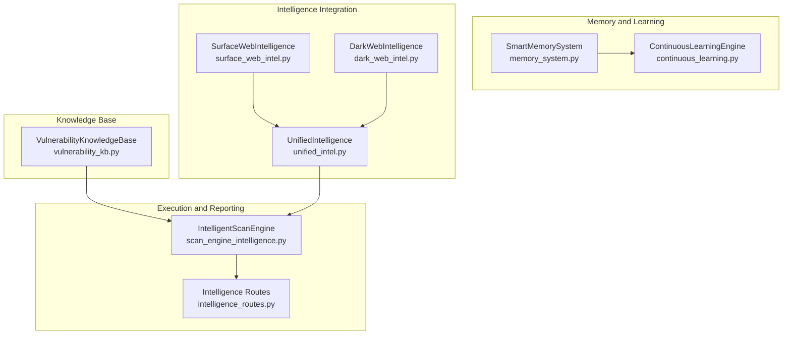
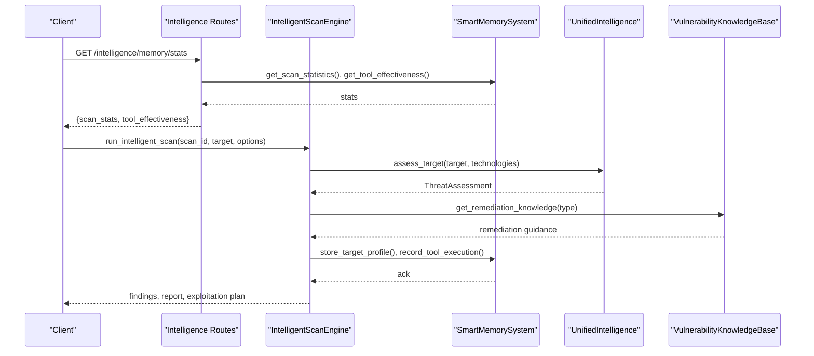
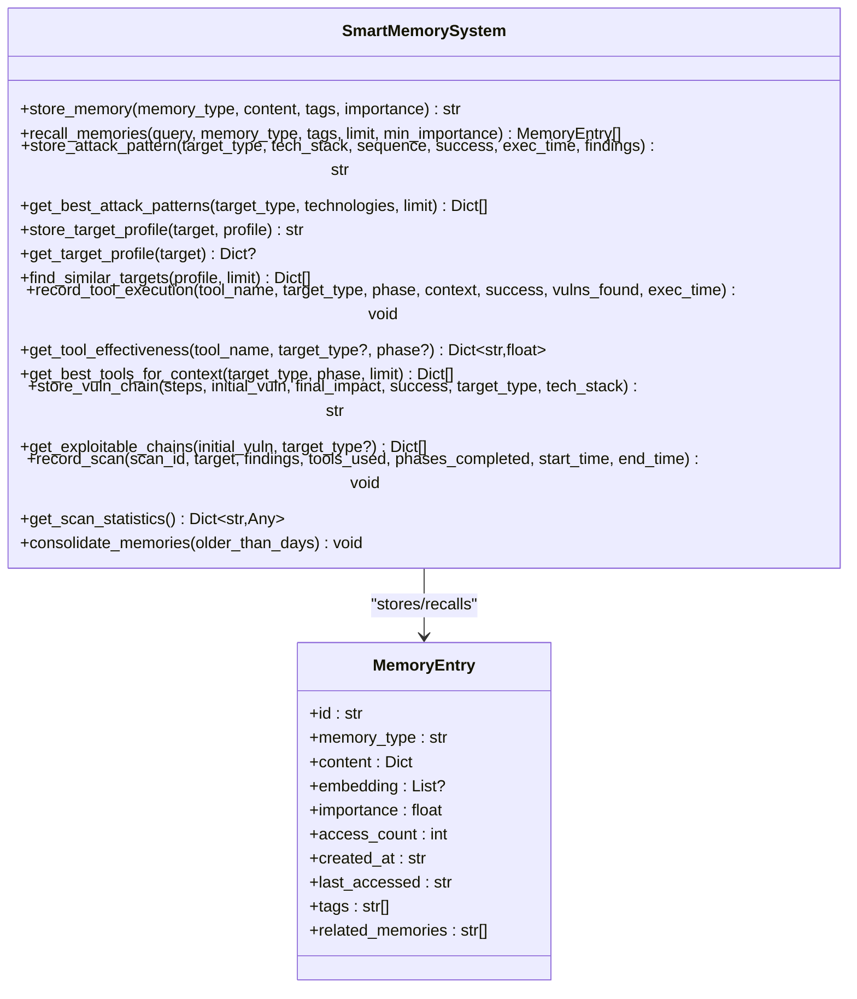
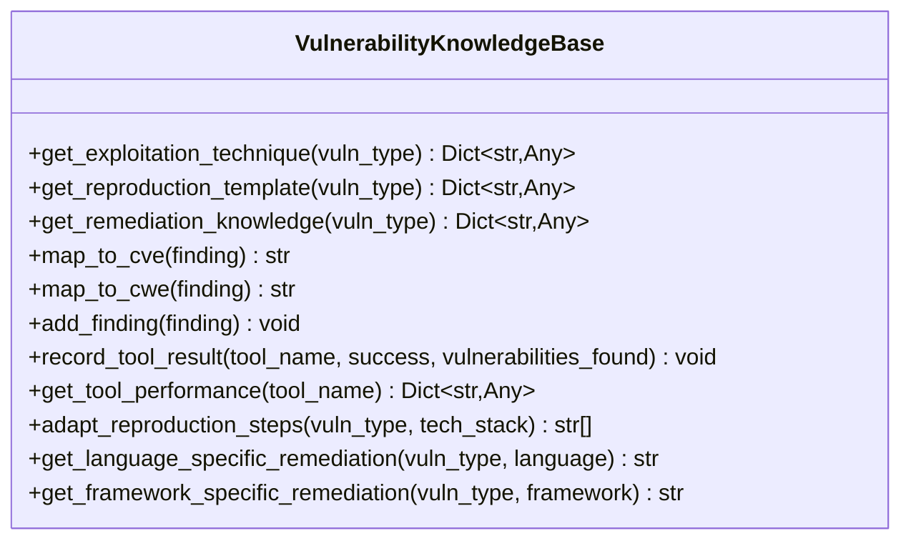
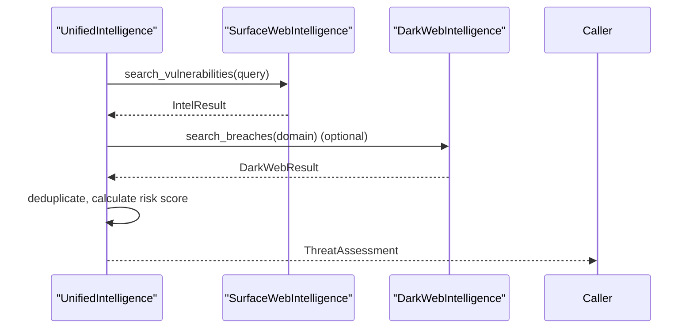
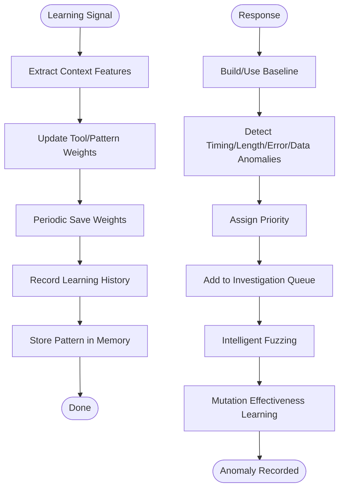
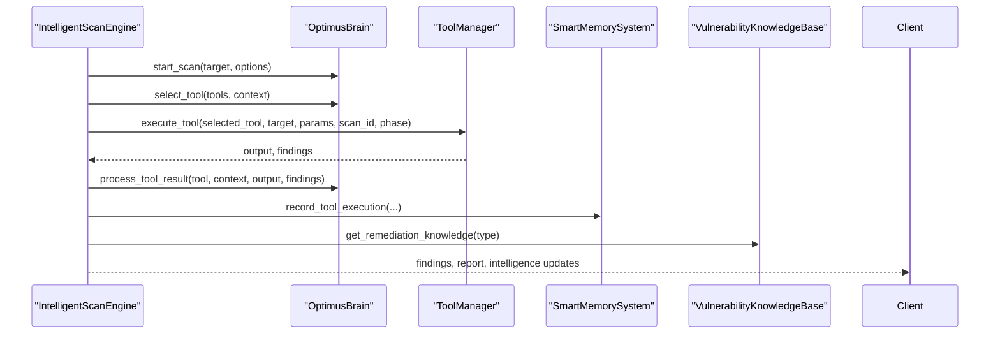
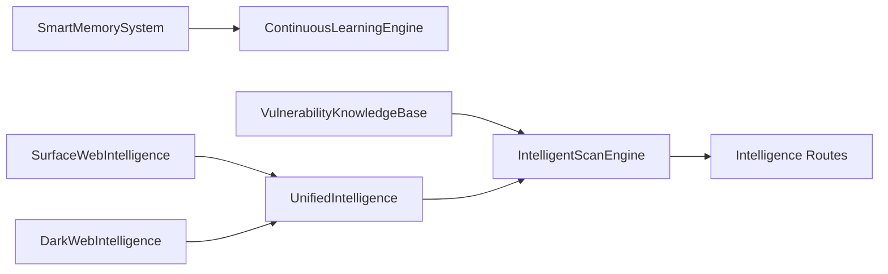

# Memory and Knowledge Systems

<cite>
**Referenced Files in This Document**
- [memory_system.py](file://backend/intelligence/memory_system.py)
- [vulnerability_kb.py](file://backend/knowledge/vulnerability_kb.py)
- [unified_intel.py](file://backend/intelligence/unified_intel.py)
- [continuous_learning.py](file://backend/intelligence/continuous_learning.py)
- [surface_web_intel.py](file://backend/intelligence/surface_web_intel.py)
- [dark_web_intel.py](file://backend/intelligence/dark_web_intel.py)
- [scan_engine_intelligence.py](file://backend/inference/scan_engine_intelligence.py)
- [scan_history.json](file://backend/data/scan_history.json)
- [ml_training_state.json](file://backend/data/ml_training_state.json)
- [online_weights.json](file://backend/data/models/online_weights.json)
- [intelligence_routes.py](file://backend/api/intelligence_routes.py)
</cite>

## Table of Contents
1. [Introduction](#introduction)
2. [Project Structure](#project-structure)
3. [Core Components](#core-components)
4. [Architecture Overview](#architecture-overview)
5. [Detailed Component Analysis](#detailed-component-analysis)
6. [Dependency Analysis](#dependency-analysis)
7. [Performance Considerations](#performance-considerations)
8. [Troubleshooting Guide](#troubleshooting-guide)
9. [Conclusion](#conclusion)
10. [Appendices](#appendices)

## Introduction
This document explains the memory and knowledge systems that enable persistent cross-scan learning and vulnerability knowledge base management in the platform. It covers:
- SmartMemorySystem: long-term memory for attack patterns, target profiles, tool effectiveness, vulnerability chains, and scan history.
- Vulnerability Knowledge Base: structured remediation guidance, exploitation techniques, and mapping to standards.
- Continuous learning and zero-day discovery: online model updates and anomaly-driven vulnerability discovery.
- Integration with intelligence sources: surface web and optional dark web feeds.
- Practical usage patterns: learning tool effectiveness, recalling successful exploitation techniques, and building target-specific profiles.
- Operational guidance: configuration, performance tuning, maintenance, and sensitive data handling.

## Project Structure
The memory and knowledge systems span several modules:
- Intelligence memory and learning: persistent storage, recall, and consolidation.
- Knowledge base: vulnerability remediation and exploitation templates.
- Unified intelligence: threat assessment and enrichment from external sources.
- Continuous learning: online model updates and zero-day discovery.
- Integration: scan engine enhancement and API exposure.

**Diagram sources**
- [memory_system.py](file://backend/intelligence/memory_system.py#L42-L1021)
- [continuous_learning.py](file://backend/intelligence/continuous_learning.py#L268-L376)
- [vulnerability_kb.py](file://backend/knowledge/vulnerability_kb.py#L6-L348)
- [unified_intel.py](file://backend/intelligence/unified_intel.py#L52-L329)
- [surface_web_intel.py](file://backend/intelligence/surface_web_intel.py#L86-L359)
- [dark_web_intel.py](file://backend/intelligence/dark_web_intel.py#L62-L254)
- [scan_engine_intelligence.py](file://backend/inference/scan_engine_intelligence.py#L13-L216)
- [intelligence_routes.py](file://backend/api/intelligence_routes.py#L55-L89)

**Section sources**
- [memory_system.py](file://backend/intelligence/memory_system.py#L1-L1022)
- [vulnerability_kb.py](file://backend/knowledge/vulnerability_kb.py#L1-L348)
- [unified_intel.py](file://backend/intelligence/unified_intel.py#L1-L329)
- [continuous_learning.py](file://backend/intelligence/continuous_learning.py#L1-L946)
- [surface_web_intel.py](file://backend/intelligence/surface_web_intel.py#L1-L359)
- [dark_web_intel.py](file://backend/intelligence/dark_web_intel.py#L1-L254)
- [scan_engine_intelligence.py](file://backend/inference/scan_engine_intelligence.py#L1-L216)
- [intelligence_routes.py](file://backend/api/intelligence_routes.py#L55-L89)

## Core Components
- SmartMemorySystem: persistent, SQLite-backed memory with vector embeddings for semantic recall, attack patterns, target profiles, tool effectiveness, vulnerability chains, and scan history. Includes consolidation and caching.
- VulnerabilityKnowledgeBase: structured remediation, exploitation techniques, reproduction templates, and mappings to standards; tracks tool performance for learning.
- UnifiedIntelligence: combines surface web and optional dark web intelligence for threat assessment and enrichment.
- ContinuousLearningEngine: online model updater and zero-day discovery pipeline.
- IntelligentScanEngine: integrates intelligence into the scan workflow and streams insights.

**Section sources**
- [memory_system.py](file://backend/intelligence/memory_system.py#L42-L1021)
- [vulnerability_kb.py](file://backend/knowledge/vulnerability_kb.py#L6-L348)
- [unified_intel.py](file://backend/intelligence/unified_intel.py#L52-L329)
- [continuous_learning.py](file://backend/intelligence/continuous_learning.py#L268-L946)
- [scan_engine_intelligence.py](file://backend/inference/scan_engine_intelligence.py#L13-L216)

## Architecture Overview
The system connects intelligence sources, memory, and execution engines to deliver persistent, cross-scan learning and actionable knowledge.

**Diagram sources**
- [intelligence_routes.py](file://backend/api/intelligence_routes.py#L55-L89)
- [memory_system.py](file://backend/intelligence/memory_system.py#L855-L923)
- [unified_intel.py](file://backend/intelligence/unified_intel.py#L125-L207)
- [vulnerability_kb.py](file://backend/knowledge/vulnerability_kb.py#L231-L348)
- [scan_engine_intelligence.py](file://backend/inference/scan_engine_intelligence.py#L34-L193)

## Detailed Component Analysis

### SmartMemorySystem
SmartMemorySystem persists and retrieves knowledge across scans with:
- Memory types: attack patterns, target profiles, tool effectiveness, vulnerability chains, techniques, failures.
- Storage: SQLite with vector embeddings for semantic search; caching for hotspots.
- Retrieval: importance-ordered, tag-filtered, and optionally embedding-ranked recall.
- Cross-scan learning: scan history and pattern aggregation.
- Consolidation: periodic pruning of low-importance, rarely-accessed memories.

**Diagram sources**
- [memory_system.py](file://backend/intelligence/memory_system.py#L27-L1021)

Key capabilities and usage patterns:
- Learning tool effectiveness rates: record_tool_execution and get_tool_effectiveness.
- Recall successful exploitation techniques: store_attack_pattern and get_best_attack_patterns.
- Build target-specific profiles: store_target_profile and find_similar_targets.
- Cross-scan similarity analysis: scan history aggregation and target similarity scoring.
- Memory consolidation: consolidate_memories to maintain database size and performance.

**Section sources**
- [memory_system.py](file://backend/intelligence/memory_system.py#L188-L322)
- [memory_system.py](file://backend/intelligence/memory_system.py#L323-L471)
- [memory_system.py](file://backend/intelligence/memory_system.py#L472-L636)
- [memory_system.py](file://backend/intelligence/memory_system.py#L637-L760)
- [memory_system.py](file://backend/intelligence/memory_system.py#L761-L854)
- [memory_system.py](file://backend/intelligence/memory_system.py#L855-L923)
- [memory_system.py](file://backend/intelligence/memory_system.py#L985-L1011)

### Vulnerability Knowledge Base
The knowledge base centralizes remediation guidance and exploitation templates:
- Exploitation techniques: variants, techniques, tools, and detection signatures.
- Reproduction templates: manual and tool commands for common vulnerabilities.
- Remediation knowledge: principles, code examples per language, and framework-specific guidance.
- Mappings: CVE/CWE/OWASP cross-references.
- Tool performance tracking: records and aggregates tool execution outcomes.

**Diagram sources**
- [vulnerability_kb.py](file://backend/knowledge/vulnerability_kb.py#L6-L348)

Practical usage:
- Retrieve remediation guidance tailored to a vulnerability type.
- Adapt reproduction steps based on target technology stack.
- Track tool performance to inform learning and selection.

**Section sources**
- [vulnerability_kb.py](file://backend/knowledge/vulnerability_kb.py#L231-L348)

### Unified Intelligence and External Sources
UnifiedIntelligence orchestrates surface web and optional dark web intelligence:
- SurfaceWebIntelligence: NVD, CIRCL, GitHub advisories with caching and rate limiting.
- DarkWebIntelligence: optional breach monitoring via Tor (simulated in this repository).
- Threat assessment: risk score calculation, breach counting, and recommendation generation.
- Enrichment: CVE lookup and public exploit detection.

**Diagram sources**
- [unified_intel.py](file://backend/intelligence/unified_intel.py#L72-L207)
- [surface_web_intel.py](file://backend/intelligence/surface_web_intel.py#L117-L359)
- [dark_web_intel.py](file://backend/intelligence/dark_web_intel.py#L119-L254)

**Section sources**
- [unified_intel.py](file://backend/intelligence/unified_intel.py#L24-L329)
- [surface_web_intel.py](file://backend/intelligence/surface_web_intel.py#L86-L359)
- [dark_web_intel.py](file://backend/intelligence/dark_web_intel.py#L62-L254)

### Continuous Learning and Zero-Day Discovery
Online model updates and anomaly detection drive adaptive behavior:
- OnlineModelUpdater: maintains weights for tools and patterns, updates via online gradient descent, saves periodically.
- ContinuousLearningEngine: records tool results, vulnerability confirmations, and chain outcomes; extracts patterns and stores in memory.
- ZeroDayDiscoveryEngine: builds response baselines, detects anomalies, and guides intelligent fuzzing.

**Diagram sources**
- [continuous_learning.py](file://backend/intelligence/continuous_learning.py#L64-L266)
- [continuous_learning.py](file://backend/intelligence/continuous_learning.py#L268-L414)
- [continuous_learning.py](file://backend/intelligence/continuous_learning.py#L681-L946)

**Section sources**
- [continuous_learning.py](file://backend/intelligence/continuous_learning.py#L64-L266)
- [continuous_learning.py](file://backend/intelligence/continuous_learning.py#L268-L414)
- [continuous_learning.py](file://backend/intelligence/continuous_learning.py#L681-L946)

### Integration with Execution and Reporting
IntelligentScanEngine integrates intelligence into the scan workflow:
- Initializes scan context, selects tools with confidence, adapts parameters, discovers exploit chains, and generates reports.
- Streams intelligence updates to the client via WebSocket.

**Diagram sources**
- [scan_engine_intelligence.py](file://backend/inference/scan_engine_intelligence.py#L34-L193)
- [vulnerability_kb.py](file://backend/knowledge/vulnerability_kb.py#L231-L348)
- [memory_system.py](file://backend/intelligence/memory_system.py#L637-L760)

**Section sources**
- [scan_engine_intelligence.py](file://backend/inference/scan_engine_intelligence.py#L13-L216)

## Dependency Analysis
The system exhibits cohesive coupling around memory and knowledge:
- SmartMemorySystem depends on SQLite and numpy for embeddings.
- VulnerabilityKnowledgeBase depends on local JSON-backed knowledge and tool performance tracking.
- UnifiedIntelligence depends on SurfaceWebIntelligence and optional DarkWebIntelligence.
- ContinuousLearningEngine depends on SmartMemorySystem for pattern storage.
- IntelligentScanEngine depends on UnifiedIntelligence, VulnerabilityKnowledgeBase, and SmartMemorySystem.

**Diagram sources**
- [memory_system.py](file://backend/intelligence/memory_system.py#L42-L1021)
- [continuous_learning.py](file://backend/intelligence/continuous_learning.py#L268-L376)
- [vulnerability_kb.py](file://backend/knowledge/vulnerability_kb.py#L6-L348)
- [unified_intel.py](file://backend/intelligence/unified_intel.py#L52-L329)
- [surface_web_intel.py](file://backend/intelligence/surface_web_intel.py#L86-L359)
- [dark_web_intel.py](file://backend/intelligence/dark_web_intel.py#L62-L254)
- [scan_engine_intelligence.py](file://backend/inference/scan_engine_intelligence.py#L13-L216)
- [intelligence_routes.py](file://backend/api/intelligence_routes.py#L55-L89)

**Section sources**
- [memory_system.py](file://backend/intelligence/memory_system.py#L1-L1022)
- [vulnerability_kb.py](file://backend/knowledge/vulnerability_kb.py#L1-L348)
- [unified_intel.py](file://backend/intelligence/unified_intel.py#L1-L329)
- [continuous_learning.py](file://backend/intelligence/continuous_learning.py#L1-L946)
- [surface_web_intel.py](file://backend/intelligence/surface_web_intel.py#L1-L359)
- [dark_web_intel.py](file://backend/intelligence/dark_web_intel.py#L1-L254)
- [scan_engine_intelligence.py](file://backend/inference/scan_engine_intelligence.py#L1-L216)
- [intelligence_routes.py](file://backend/api/intelligence_routes.py#L55-L89)

## Performance Considerations
- Embeddings and similarity ranking: the current implementation uses simple hashing-based embeddings; consider upgrading to sentence-transformers for richer semantics.
- Database indexing: indexes exist on memory types, importance, and key lookup tables; ensure appropriate coverage for high-cardinality tags and frequent filters.
- Caching: in-memory caches for patterns, target profiles, and tool stats reduce repeated computation; tune cache sizes and eviction policies.
- Consolidation: periodic consolidation reduces database size and improves query performance; schedule vacuum after consolidation.
- Concurrency: unify writes to memory tables under transactions; batch tool effectiveness inserts when possible.
- Model updates: online weights saved periodically; avoid frequent disk writes by batching updates.

[No sources needed since this section provides general guidance]

## Troubleshooting Guide
Common issues and resolutions:
- Memory storage errors: verify database path existence and permissions; ensure transactions are committed and rolled back on exceptions.
- Recall returns empty: adjust importance thresholds and tags; verify embedding generation and similarity ranking.
- Tool effectiveness statistics missing: confirm tool execution recordings and context hashing; check sample size thresholds.
- Intelligence API failures: confirm memory system availability and route handlers; inspect error responses.
- Tor connectivity disabled: dark web features require aiohttp_socks; installation and connectivity checks are logged.

**Section sources**
- [memory_system.py](file://backend/intelligence/memory_system.py#L234-L238)
- [memory_system.py](file://backend/intelligence/memory_system.py#L317-L321)
- [memory_system.py](file://backend/intelligence/memory_system.py#L677-L681)
- [intelligence_routes.py](file://backend/api/intelligence_routes.py#L72-L73)
- [dark_web_intel.py](file://backend/intelligence/dark_web_intel.py#L20-L25)

## Conclusion
The memory and knowledge systems provide a robust foundation for persistent, cross-scan learning and actionable vulnerability intelligence. By combining structured memory, knowledge bases, continuous learning, and integrated intelligence sources, the platform enables adaptive, data-driven penetration testing with shared knowledge access and scalable storage.

[No sources needed since this section summarizes without analyzing specific files]

## Appendices

### Practical Usage Patterns
- Learning tool effectiveness rates:
  - Record execution outcomes and context; retrieve aggregated statistics for informed selection.
  - Reference: [record_tool_execution](file://backend/intelligence/memory_system.py#L639-L681), [get_tool_effectiveness](file://backend/intelligence/memory_system.py#L682-L723)
- Recalling successful exploitation techniques:
  - Store attack patterns with success metadata; retrieve best patterns for target type and technologies.
  - Reference: [store_attack_pattern](file://backend/intelligence/memory_system.py#L325-L414), [get_best_attack_patterns](file://backend/intelligence/memory_system.py#L416-L471)
- Building target-specific profiles:
  - Aggregate technologies, ports, vulnerabilities, and tool outcomes; find similar targets for reuse.
  - Reference: [store_target_profile](file://backend/intelligence/memory_system.py#L474-L552), [find_similar_targets](file://backend/intelligence/memory_system.py#L588-L636)
- Cross-scan similarity analysis:
  - Use scan history and target similarity scoring to identify comparable environments.
  - Reference: [record_scan](file://backend/intelligence/memory_system.py#L857-L894), [get_scan_statistics](file://backend/intelligence/memory_system.py#L895-L923)

### Integration with Other Intelligence Components
- Unified intelligence for threat assessment and enrichment:
  - Reference: [assess_target](file://backend/intelligence/unified_intel.py#L125-L207), [search_all](file://backend/intelligence/unified_intel.py#L72-L124)
- Vulnerability knowledge base for remediation and reproduction:
  - Reference: [get_remediation_knowledge](file://backend/knowledge/vulnerability_kb.py#L243-L247), [get_reproduction_template](file://backend/knowledge/vulnerability_kb.py#L237-L241)
- Continuous learning for adaptive tool selection:
  - Reference: [get_recommended_tool](file://backend/intelligence/continuous_learning.py#L364-L372), [get_learning_stats](file://backend/intelligence/continuous_learning.py#L373-L376)

### Memory Cleanup and Maintenance Procedures
- Consolidation:
  - Periodically remove low-importance, rarely accessed memories older than a threshold; vacuum database afterward.
  - Reference: [consolidate_memories](file://backend/intelligence/memory_system.py#L985-L1011)
- Database initialization and indexing:
  - Ensure tables and indexes exist; monitor growth and tune retention policies.
  - Reference: [_init_database](file://backend/intelligence/memory_system.py#L75-L185)

### Strategies for Handling Sensitive Security Knowledge
- Restrict access to dark web intelligence; disable by default and gate behind configuration.
  - Reference: [DarkWebIntelligence.enabled](file://backend/intelligence/dark_web_intel.py#L80-L85)
- Sanitize logs and avoid exposing internal embeddings or raw memory content.
- Apply least privilege to database files and enforce filesystem permissions.

### Guidance on Memory Configuration, Performance Tuning, and Troubleshooting
- Configuration:
  - Adjust embedding dimensionality and caching parameters; configure consolidation intervals.
  - References: [embedding_dim](file://backend/intelligence/memory_system.py#L66), [consolidate_memories](file://backend/intelligence/memory_system.py#L985-L1011)
- Performance tuning:
  - Upgrade embeddings; add composite indexes; batch writes; leverage in-memory caches.
  - References: [recall_memories](file://backend/intelligence/memory_system.py#L243-L322), [get_tool_effectiveness](file://backend/intelligence/memory_system.py#L682-L723)
- Troubleshooting:
  - Inspect error logs for storage/recall failures; validate Tor connectivity for dark web; verify API routes.
  - References: [error handling](file://backend/intelligence/memory_system.py#L234-L238), [get_dark_web_intel](file://backend/intelligence/dark_web_intel.py#L237-L254), [intelligence_routes](file://backend/api/intelligence_routes.py#L72-L73)

### Supporting Data and Metrics
- Scan durations and averages:
  - Reference: [scan_history.json](file://backend/data/scan_history.json#L1-L79)
- ML training state and metrics:
  - Reference: [ml_training_state.json](file://backend/data/ml_training_state.json#L1-L51)
- Online model weights:
  - Reference: [online_weights.json](file://backend/data/models/online_weights.json#L1-L82)