# Unified Intelligence Engine

<cite>
**Referenced Files in This Document**
- [optimus_brain.py](file://backend/intelligence/optimus_brain.py)
- [__init__.py](file://backend/intelligence/__init__.py)
- [unified_intel.py](file://backend/intelligence/unified_intel.py)
- [intelligence_config.py](file://backend/config_pkg/intelligence_config.py)
- [tools_config.py](file://backend/config_pkg/tools_config.py)
- [memory_system.py](file://backend/intelligence/memory_system.py)
- [web_intelligence.py](file://backend/intelligence/web_intelligence.py)
- [delegation_system.py](file://backend/intelligence/delegation_system.py)
- [adaptive_exploitation.py](file://backend/intelligence/adaptive_exploitation.py)
- [vulnerability_chaining.py](file://backend/intelligence/vulnerability_chaining.py)
- [explainable_ai.py](file://backend/intelligence/explainable_ai.py)
- [continuous_learning.py](file://backend/intelligence/continuous_learning.py)
- [campaign_intelligence.py](file://backend/intelligence/campaign_intelligence.py)
- [app.py](file://backend/app.py)
- [autonomous_agent.py](file://backend/inference/autonomous_agent.py)
</cite>

## Table of Contents
1. [Introduction](#introduction)
2. [Project Structure](#project-structure)
3. [Core Components](#core-components)
4. [Architecture Overview](#architecture-overview)
5. [Detailed Component Analysis](#detailed-component-analysis)
6. [Dependency Analysis](#dependency-analysis)
7. [Performance Considerations](#performance-considerations)
8. [Troubleshooting Guide](#troubleshooting-guide)
9. [Conclusion](#conclusion)
10. [Appendices](#appendices)

## Introduction
The Unified Intelligence Engine centers on the OptimusBrain class, which acts as the central coordinator for all AI-powered subsystems in the penetration testing agent. It integrates:
- Smart Memory System for persistent cross-scan learning
- Web Intelligence for real-time external data gathering
- Delegation System for multi-agent task orchestration
- Real-Time Adaptive Exploitation for dynamic strategy adjustment
- Vulnerability Chaining for attack graph optimization
- Explainable AI for transparent decision-making
- Continuous Learning and Zero-Day Discovery for autonomous improvement
- Campaign Intelligence for multi-target insights

OptimusBrain exposes a unified interface for orchestrating scans, tool selection, result processing, exploitation planning, and report generation, while supporting modular feature toggles and thread-safe initialization.

## Project Structure
The intelligence package organizes subsystems under backend/intelligence, with configuration managed in backend/config_pkg. The OptimusBrain singleton is exposed via the package’s __init__.py and integrated into the backend application.

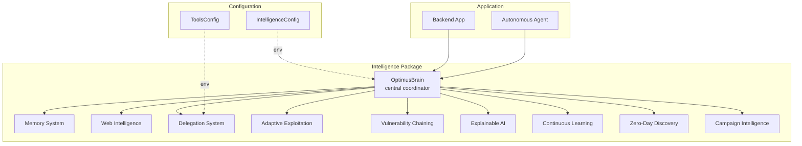

**Diagram sources**
- [optimus_brain.py](file://backend/intelligence/optimus_brain.py#L46-L77)
- [__init__.py](file://backend/intelligence/__init__.py#L16-L79)
- [intelligence_config.py](file://backend/config_pkg/intelligence_config.py#L5-L62)
- [tools_config.py](file://backend/config_pkg/tools_config.py#L8-L62)
- [app.py](file://backend/app.py#L230-L249)
- [autonomous_agent.py](file://backend/inference/autonomous_agent.py#L1130-L1288)

**Section sources**
- [optimus_brain.py](file://backend/intelligence/optimus_brain.py#L1-L712)
- [__init__.py](file://backend/intelligence/__init__.py#L1-L80)
- [intelligence_config.py](file://backend/config_pkg/intelligence_config.py#L1-L63)
- [tools_config.py](file://backend/config_pkg/tools_config.py#L1-L63)
- [app.py](file://backend/app.py#L230-L249)

## Core Components
- OptimusConfig: Feature toggles and runtime configuration for intelligence modules.
- OptimusBrain: Central coordinator implementing singleton pattern, thread-safe initialization, and unified orchestration APIs.
- Subsystems: Memory, Web Intelligence, Delegation, Adaptive Exploitation, Vulnerability Chaining, Explainable AI, Continuous Learning, Zero-Day Discovery, Campaign Intelligence.
- Unified Intelligence: Additional combined surface/dark web intelligence API.

Key orchestration methods:
- start_scan: Pre-scan intelligence gathering and context assembly
- select_tool: Multi-source tool recommendation with explainability
- process_tool_result: Post-execution learning, adaptation, chaining, anomaly detection, and memory updates
- get_exploitation_plan: Chain analysis and delegation planning
- generate_report: Explanatory reporting with fallback

**Section sources**
- [optimus_brain.py](file://backend/intelligence/optimus_brain.py#L30-L77)
- [optimus_brain.py](file://backend/intelligence/optimus_brain.py#L173-L543)
- [unified_intel.py](file://backend/intelligence/unified_intel.py#L52-L329)

## Architecture Overview
OptimusBrain initializes subsystems lazily and conditionally based on configuration. It coordinates intelligence workflows across modules, ensuring thread safety during initialization and providing a unified interface for the broader agent.

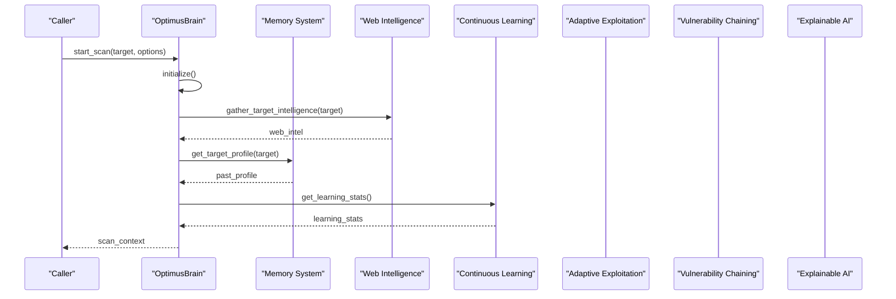

**Diagram sources**
- [optimus_brain.py](file://backend/intelligence/optimus_brain.py#L173-L226)
- [web_intelligence.py](file://backend/intelligence/web_intelligence.py#L1-L200)
- [memory_system.py](file://backend/intelligence/memory_system.py#L1-L200)
- [continuous_learning.py](file://backend/intelligence/continuous_learning.py#L1-L200)

## Detailed Component Analysis

### OptimusBrain: Singleton, Initialization, and Orchestration
- Singleton pattern: get_optimus_brain ensures a single instance across the application lifecycle.
- Thread-safe initialization: Lock-based guard prevents race conditions during subsystem setup.
- Modular initialization: Each subsystem is conditionally imported and initialized based on OptimusConfig flags.
- Unified interfaces:
  - start_scan: Assembles pre-scan context using web intelligence, memory, and learning stats.
  - select_tool: Aggregates recommendations from learning, memory, and adaptive engines; records explainability.
  - process_tool_result: Updates learning, adapts strategies, detects chains/anomalies, consolidates memory.
  - get_exploitation_plan: Builds chain plans and optionally delegates tasks.
  - generate_report: Produces explanatory reports with fallback to basic report.

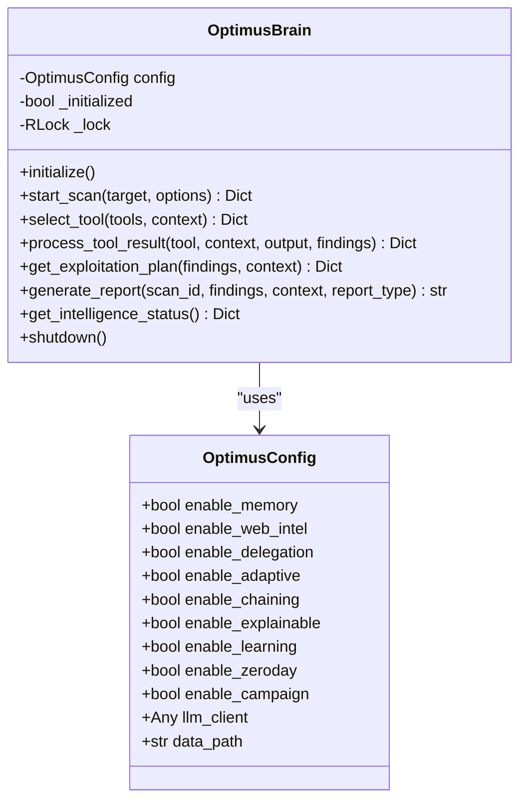

**Diagram sources**
- [optimus_brain.py](file://backend/intelligence/optimus_brain.py#L30-L77)
- [optimus_brain.py](file://backend/intelligence/optimus_brain.py#L656-L661)

**Section sources**
- [optimus_brain.py](file://backend/intelligence/optimus_brain.py#L60-L170)
- [optimus_brain.py](file://backend/intelligence/optimus_brain.py#L173-L543)

### Configuration Management
- OptimusConfig: Per-module feature flags and data paths.
- IntelligenceConfig: Environment-driven configuration for intelligence features, API keys, and LLM settings.
- ToolsConfig: Environment-driven configuration for tool discovery, LLM command generation, and safety settings.

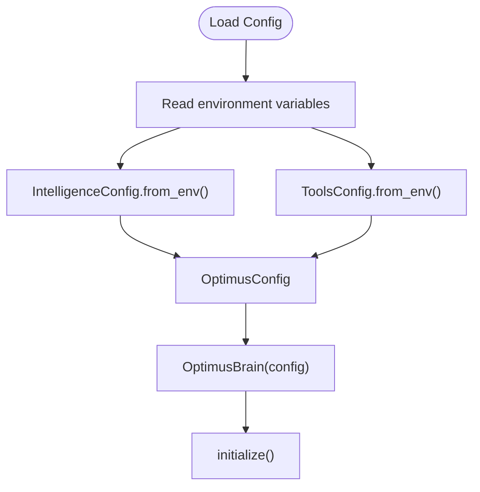

**Diagram sources**
- [intelligence_config.py](file://backend/config_pkg/intelligence_config.py#L42-L62)
- [tools_config.py](file://backend/config_pkg/tools_config.py#L50-L62)
- [optimus_brain.py](file://backend/intelligence/optimus_brain.py#L60-L77)

**Section sources**
- [intelligence_config.py](file://backend/config_pkg/intelligence_config.py#L1-L63)
- [tools_config.py](file://backend/config_pkg/tools_config.py#L1-L63)
- [optimus_brain.py](file://backend/intelligence/optimus_brain.py#L30-L77)

### Memory System
- Purpose: Persistent long-term memory across scans with vector embeddings, pattern recognition, and statistics.
- Key capabilities: Attack patterns, target profiles, tool effectiveness, vulnerability chains, and scan history.
- Integration: Used by OptimusBrain for pre-scan profiling and post-execution memory consolidation.

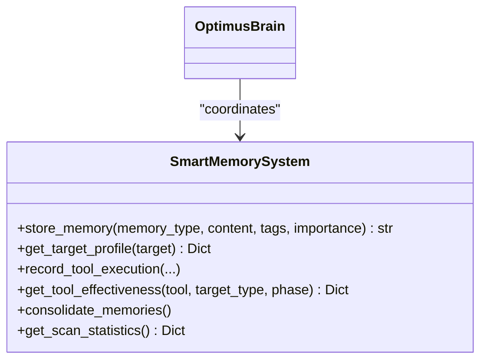

**Diagram sources**
- [memory_system.py](file://backend/intelligence/memory_system.py#L42-L200)
- [optimus_brain.py](file://backend/intelligence/optimus_brain.py#L87-L95)

**Section sources**
- [memory_system.py](file://backend/intelligence/memory_system.py#L1-L200)
- [optimus_brain.py](file://backend/intelligence/optimus_brain.py#L204-L225)

### Web Intelligence
- Purpose: Real-time gathering of CVE details, exploit info, and security blogs; external search integrations.
- Integration: OptimusBrain uses web intelligence for pre-scan enrichment and vulnerability enrichment.

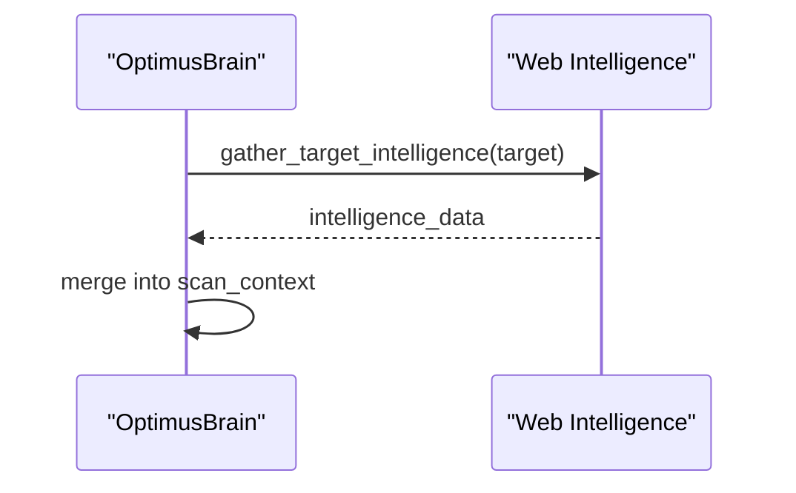

**Diagram sources**
- [optimus_brain.py](file://backend/intelligence/optimus_brain.py#L195-L202)
- [web_intelligence.py](file://backend/intelligence/web_intelligence.py#L1-L200)

**Section sources**
- [web_intelligence.py](file://backend/intelligence/web_intelligence.py#L1-L200)
- [optimus_brain.py](file://backend/intelligence/optimus_brain.py#L195-L202)

### Delegation System
- Purpose: Multi-agent architecture with specialized agents for research, exploitation, recon, analysis, and reporting.
- Integration: OptimusBrain can submit tasks to the coordinator for exploitation planning.

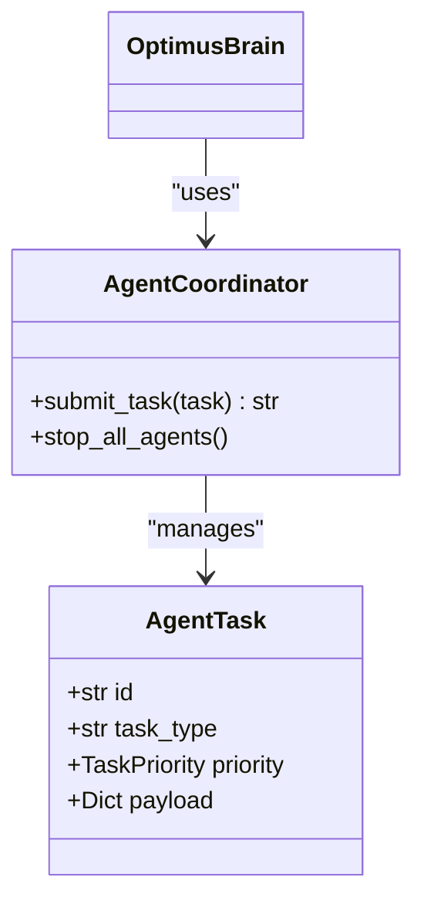

**Diagram sources**
- [delegation_system.py](file://backend/intelligence/delegation_system.py#L1-L200)
- [optimus_brain.py](file://backend/intelligence/optimus_brain.py#L468-L488)

**Section sources**
- [delegation_system.py](file://backend/intelligence/delegation_system.py#L1-L200)
- [optimus_brain.py](file://backend/intelligence/optimus_brain.py#L468-L488)

### Adaptive Exploitation
- Purpose: Real-time adaptation based on execution outcomes, defense detection, and parameter tuning.
- Integration: OptimusBrain creates execution context and processes results to adapt strategies.

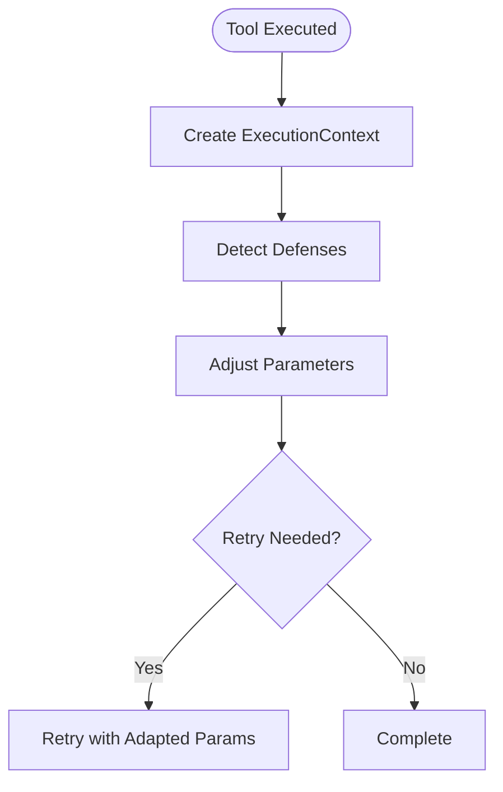

**Diagram sources**
- [adaptive_exploitation.py](file://backend/intelligence/adaptive_exploitation.py#L57-L200)
- [optimus_brain.py](file://backend/intelligence/optimus_brain.py#L364-L380)

**Section sources**
- [adaptive_exploitation.py](file://backend/intelligence/adaptive_exploitation.py#L1-L200)
- [optimus_brain.py](file://backend/intelligence/optimus_brain.py#L364-L380)

### Vulnerability Chaining
- Purpose: Build attack graphs, identify exploitation paths, and rank chains by impact and probability.
- Integration: OptimusBrain analyzes findings to produce chain plans and recommendations.

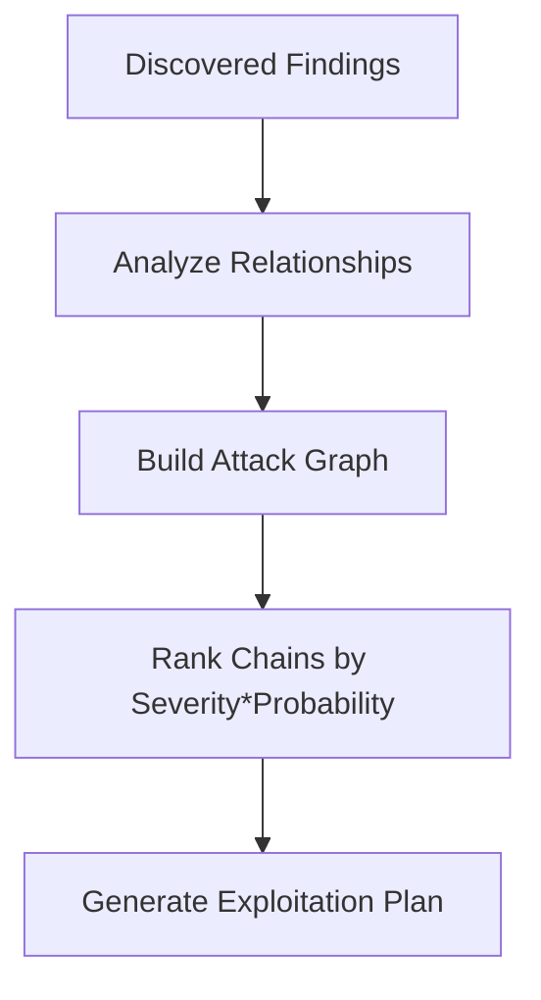

**Diagram sources**
- [vulnerability_chaining.py](file://backend/intelligence/vulnerability_chaining.py#L130-L200)
- [optimus_brain.py](file://backend/intelligence/optimus_brain.py#L452-L466)

**Section sources**
- [vulnerability_chaining.py](file://backend/intelligence/vulnerability_chaining.py#L1-L200)
- [optimus_brain.py](file://backend/intelligence/optimus_brain.py#L452-L466)

### Explainable AI
- Purpose: Audit trails, human-readable explanations, confidence scoring, and alternative analysis.
- Integration: OptimusBrain records tool selections and chain decisions for explainability.

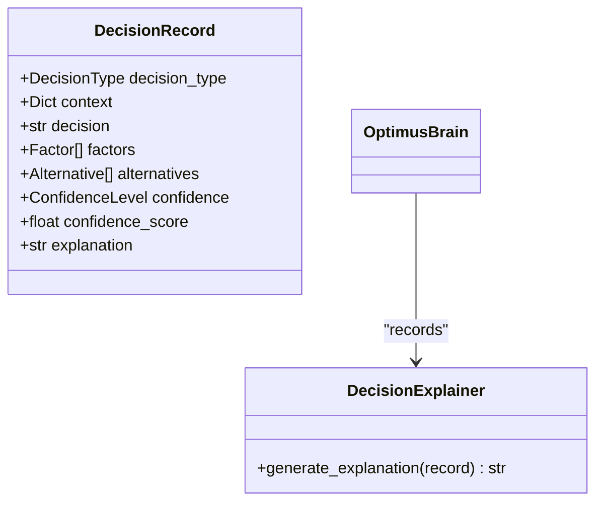

**Diagram sources**
- [explainable_ai.py](file://backend/intelligence/explainable_ai.py#L75-L148)
- [optimus_brain.py](file://backend/intelligence/optimus_brain.py#L318-L324)

**Section sources**
- [explainable_ai.py](file://backend/intelligence/explainable_ai.py#L1-L200)
- [optimus_brain.py](file://backend/intelligence/optimus_brain.py#L318-L324)

### Continuous Learning and Zero-Day Discovery
- Continuous Learning: Online model updater adjusts weights from production feedback; maintains learning history and saves weights.
- Zero-Day Discovery: Anomaly detection in responses to identify unknown vulnerabilities.

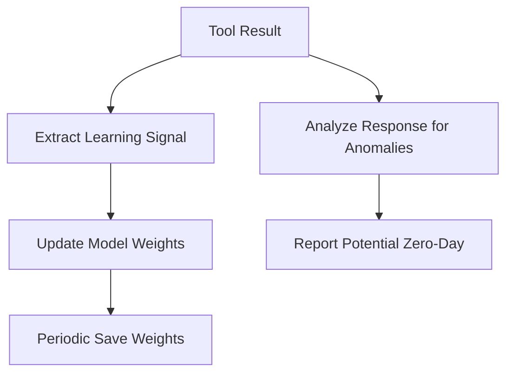

**Diagram sources**
- [continuous_learning.py](file://backend/intelligence/continuous_learning.py#L64-L200)
- [optimus_brain.py](file://backend/intelligence/optimus_brain.py#L355-L410)

**Section sources**
- [continuous_learning.py](file://backend/intelligence/continuous_learning.py#L1-L200)
- [optimus_brain.py](file://backend/intelligence/optimus_brain.py#L355-L410)

### Campaign Intelligence
- Purpose: Cross-target pattern recognition, sector insights, and resource optimization across campaigns.
- Integration: Provides aggregated insights used by OptimusBrain for higher-level planning.

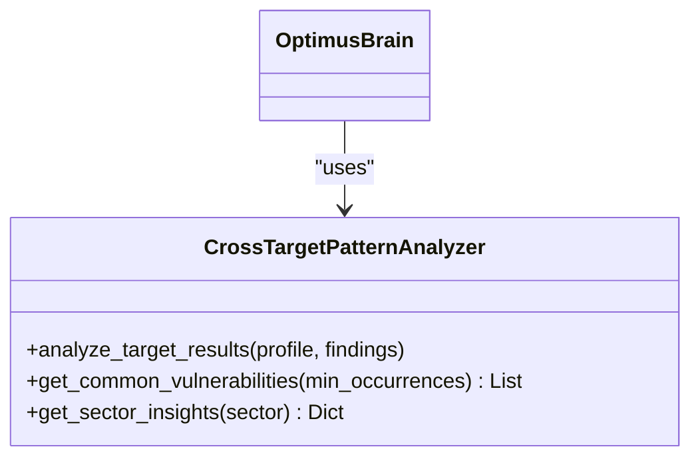

**Diagram sources**
- [campaign_intelligence.py](file://backend/intelligence/campaign_intelligence.py#L102-L200)
- [optimus_brain.py](file://backend/intelligence/optimus_brain.py#L589-L614)

**Section sources**
- [campaign_intelligence.py](file://backend/intelligence/campaign_intelligence.py#L1-L200)
- [optimus_brain.py](file://backend/intelligence/optimus_brain.py#L589-L614)

### Practical Collaboration Examples
- Tool Selection Workflow: OptimusBrain aggregates learning, memory, and adaptive recommendations, records explainability, and returns a ranked tool list.
- Exploitation Planning: After discovering findings, OptimusBrain analyzes chains, optionally delegates planning, and records rationale for explainability.
- Reporting: OptimusBrain generates explanatory reports, falling back to a basic report if explainability is unavailable.

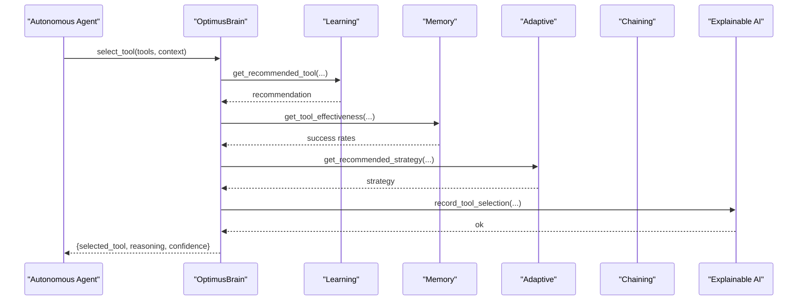

**Diagram sources**
- [optimus_brain.py](file://backend/intelligence/optimus_brain.py#L228-L326)
- [autonomous_agent.py](file://backend/inference/autonomous_agent.py#L1264-L1280)

**Section sources**
- [optimus_brain.py](file://backend/intelligence/optimus_brain.py#L228-L326)
- [autonomous_agent.py](file://backend/inference/autonomous_agent.py#L1264-L1280)

## Dependency Analysis
OptimusBrain depends on subsystems that are conditionally initialized based on configuration. The intelligence package exports the singleton getter and subsystems for use across the backend.

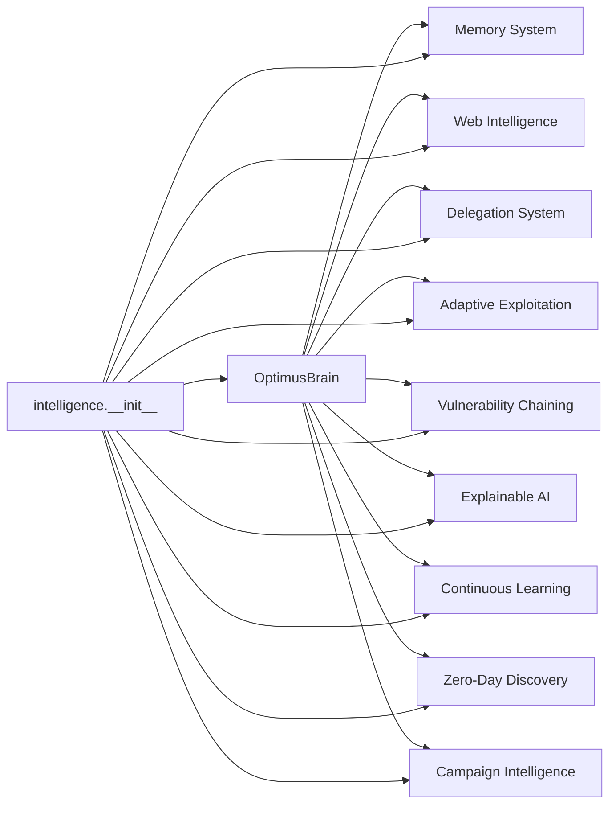

**Diagram sources**
- [optimus_brain.py](file://backend/intelligence/optimus_brain.py#L656-L710)
- [__init__.py](file://backend/intelligence/__init__.py#L16-L79)

**Section sources**
- [optimus_brain.py](file://backend/intelligence/optimus_brain.py#L656-L710)
- [__init__.py](file://backend/intelligence/__init__.py#L16-L79)

## Performance Considerations
- Concurrency: OptimusBrain uses a lock for initialization to avoid race conditions; subsystems may use threads or async I/O internally (e.g., web scraping, agent workers).
- Feature toggles: Disable unused subsystems to reduce startup time and memory footprint.
- Caching: Web Intelligence and Memory System maintain caches to minimize repeated work.
- Asynchronous operations: Unified Intelligence supports async search and assessment to improve responsiveness.

[No sources needed since this section provides general guidance]

## Troubleshooting Guide
Common issues and resolutions:
- Initialization failures:
  - Symptom: Subsystem fails to initialize.
  - Action: Verify environment variables for API keys and paths; check logs for specific errors; disable problematic subsystems via configuration.
- Missing or degraded functionality:
  - Symptom: Reports lack explanations or planning is incomplete.
  - Action: Confirm Explainable AI and Vulnerability Chaining are enabled; ensure required resources are available.
- Tool selection anomalies:
  - Symptom: Unexpected tool choice or low confidence.
  - Action: Review learning stats and memory effectiveness; validate adaptive engine configuration.
- Zero-day detection:
  - Symptom: No anomalies flagged despite suspicious responses.
  - Action: Adjust anomaly thresholds and confirm response analysis logic.

Operational checks:
- Use get_intelligence_status to inspect component initialization and stats.
- Graceful shutdown via shutdown to consolidate memory and stop agents.

**Section sources**
- [optimus_brain.py](file://backend/intelligence/optimus_brain.py#L564-L650)
- [intelligence_config.py](file://backend/config_pkg/intelligence_config.py#L42-L62)

## Conclusion
OptimusBrain provides a robust, modular, and thread-safe foundation for autonomous penetration testing. Its unified interfaces integrate diverse AI capabilities—memory, web intelligence, adaptive exploitation, vulnerability chaining, explainability, continuous learning, zero-day discovery, and campaign intelligence—into a cohesive workflow. With environment-driven configuration and selective feature toggles, it balances flexibility and performance for real-world operations.

[No sources needed since this section summarizes without analyzing specific files]

## Appendices

### Configuration Reference
- IntelligenceConfig: Feature toggles, database paths, API keys, learning parameters, adaptive settings, and LLM configuration.
- ToolsConfig: Tool discovery, LLM generation, web research, safety settings, storage paths, and timeouts.

**Section sources**
- [intelligence_config.py](file://backend/config_pkg/intelligence_config.py#L1-L63)
- [tools_config.py](file://backend/config_pkg/tools_config.py#L1-L63)

### Application Integration
- Backend app initializes OptimusBrain and integrates it with the autonomous agent pipeline.

**Section sources**
- [app.py](file://backend/app.py#L230-L249)
- [autonomous_agent.py](file://backend/inference/autonomous_agent.py#L1130-L1288)