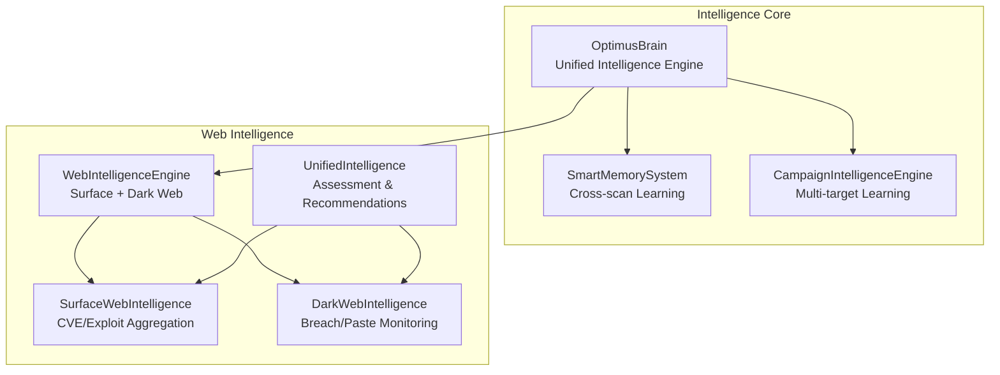
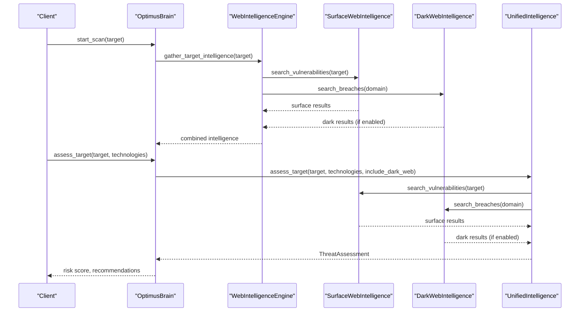
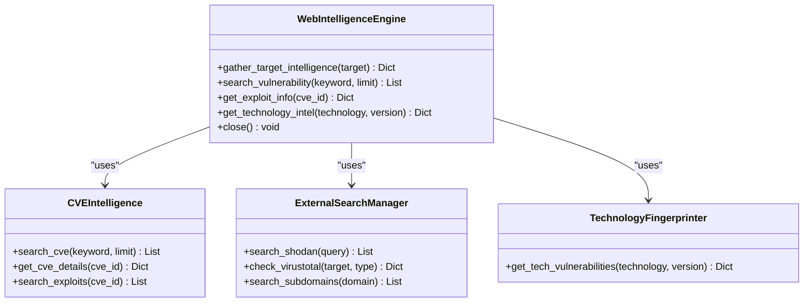
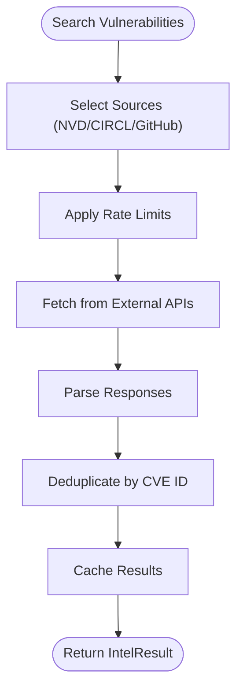
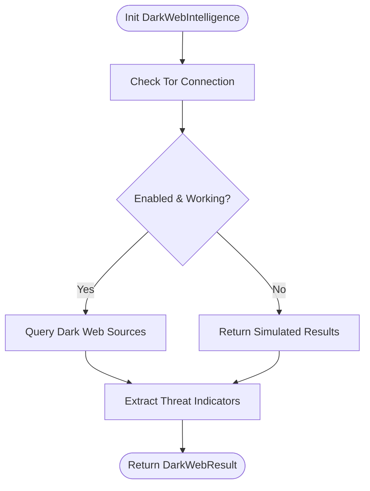
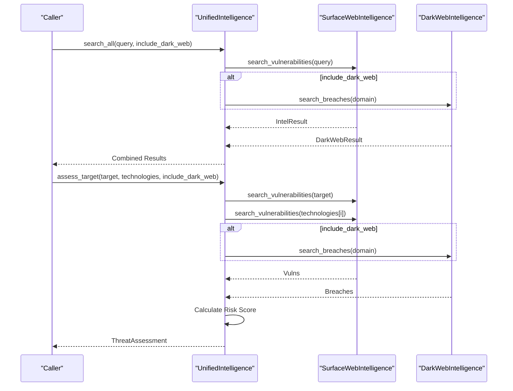
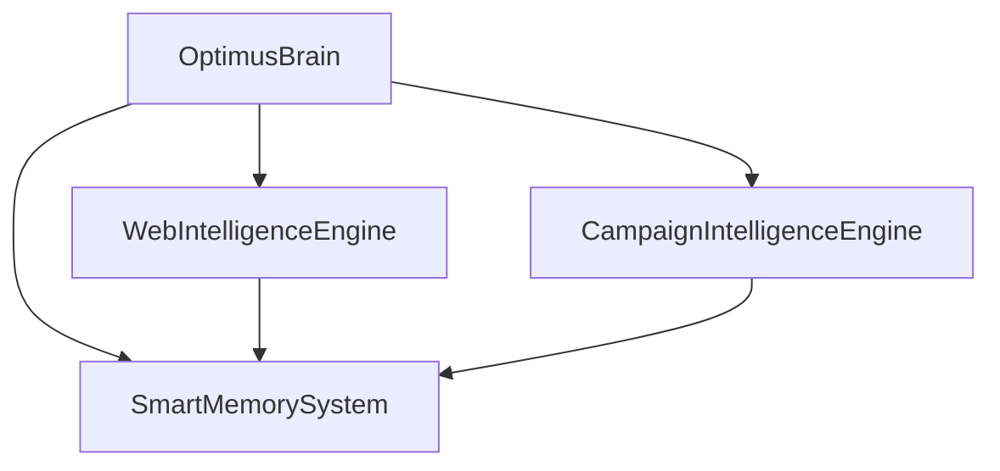
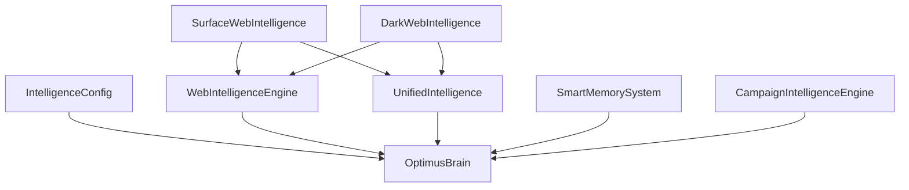

# Web Intelligence Integration

<cite>
**Referenced Files in This Document**
- [web_intelligence.py](file://backend/intelligence/web_intelligence.py)
- [surface_web_intel.py](file://backend/intelligence/surface_web_intel.py)
- [dark_web_intel.py](file://backend/intelligence/dark_web_intel.py)
- [unified_intel.py](file://backend/intelligence/unified_intel.py)
- [optimus_brain.py](file://backend/intelligence/optimus_brain.py)
- [memory_system.py](file://backend/intelligence/memory_system.py)
- [campaign_intelligence.py](file://backend/intelligence/campaign_intelligence.py)
- [intelligence_config.py](file://backend/config_pkg/intelligence_config.py)
- [INTELLIGENCE_INTEGRATION_SUMMARY.md](file://INTELLIGENCE_INTEGRATION_SUMMARY.md)
- [README.md](file://README.md)
</cite>

## Table of Contents
1. [Introduction](#introduction)
2. [Project Structure](#project-structure)
3. [Core Components](#core-components)
4. [Architecture Overview](#architecture-overview)
5. [Detailed Component Analysis](#detailed-component-analysis)
6. [Dependency Analysis](#dependency-analysis)
7. [Performance Considerations](#performance-considerations)
8. [Troubleshooting Guide](#troubleshooting-guide)
9. [Conclusion](#conclusion)
10. [Appendices](#appendices)

## Introduction
This document explains the Web Intelligence Integration for real-time threat intelligence gathering from surface and dark web sources. It details the WebIntelligenceEngine architecture for collecting, analyzing, and correlating threat intelligence data, including surface web monitoring, dark web market surveillance, and vulnerability disclosure tracking. It also covers intelligence gathering mechanisms, data correlation algorithms, threat assessment scoring, and integration with target profiling systems. Practical examples demonstrate pre-scan threat assessment, real-time defense awareness, and adaptive strategy adjustment based on the current threat landscape. Guidance is provided on intelligence source reliability, data validation procedures, privacy considerations for dark web data, and integration with other intelligence subsystems for comprehensive threat awareness.

## Project Structure
The Web Intelligence Integration resides in the backend intelligence package and integrates with the broader Optimus penetration testing platform. The key modules are:
- Surface web intelligence: vulnerability databases, exploit availability monitoring, and security news aggregation
- Dark web intelligence: breach monitoring, paste site scanning, and threat actor tracking (optional)
- Unified intelligence: combining surface and dark web intelligence with threat assessment and recommendations
- Web intelligence engine: orchestrating web-based intelligence gathering and correlating with target profiling
- Supporting systems: persistent memory, campaign intelligence, and configuration management

**Diagram sources**
- [optimus_brain.py](file://backend/intelligence/optimus_brain.py#L46-L170)
- [web_intelligence.py](file://backend/intelligence/web_intelligence.py#L453-L597)
- [surface_web_intel.py](file://backend/intelligence/surface_web_intel.py#L86-L359)
- [dark_web_intel.py](file://backend/intelligence/dark_web_intel.py#L62-L254)
- [unified_intel.py](file://backend/intelligence/unified_intel.py#L52-L329)
- [memory_system.py](file://backend/intelligence/memory_system.py#L42-L1022)
- [campaign_intelligence.py](file://backend/intelligence/campaign_intelligence.py#L507-L689)

**Section sources**
- [README.md](file://README.md#L1-L96)
- [INTELLIGENCE_INTEGRATION_SUMMARY.md](file://INTELLIGENCE_INTEGRATION_SUMMARY.md#L1-L420)

## Core Components
- WebIntelligenceEngine: Orchestrates surface and dark web intelligence, performs target profiling, and coordinates with external APIs (Shodan, VirusTotal).
- SurfaceWebIntelligence: Aggregates vulnerability data from NVD, CIRCL, and GitHub advisories; provides caching, rate limiting, and deduplication.
- DarkWebIntelligence: Optional module for breach monitoring and paste site scanning via Tor; includes simulated results and threat indicator extraction.
- UnifiedIntelligence: Combines surface and dark web results, calculates risk scores, generates recommendations, and enriches findings.
- OptimusBrain: The unified intelligence engine integrating memory, web intelligence, adaptive exploitation, vulnerability chaining, explainable AI, continuous learning, zero-day discovery, and campaign intelligence.
- SmartMemorySystem: Persistent storage for cross-scan learning, target profiles, tool effectiveness, and attack patterns.
- CampaignIntelligenceEngine: Multi-target learning, pattern analysis, and campaign optimization.

**Section sources**
- [web_intelligence.py](file://backend/intelligence/web_intelligence.py#L453-L608)
- [surface_web_intel.py](file://backend/intelligence/surface_web_intel.py#L86-L359)
- [dark_web_intel.py](file://backend/intelligence/dark_web_intel.py#L62-L254)
- [unified_intel.py](file://backend/intelligence/unified_intel.py#L52-L329)
- [optimus_brain.py](file://backend/intelligence/optimus_brain.py#L46-L170)
- [memory_system.py](file://backend/intelligence/memory_system.py#L42-L1022)
- [campaign_intelligence.py](file://backend/intelligence/campaign_intelligence.py#L507-L689)

## Architecture Overview
The Web Intelligence Integration follows a layered architecture:
- Data Collection Layer: Web scrapers, external API integrations, and Tor connectivity for dark web.
- Intelligence Processing Layer: Structured parsing, deduplication, enrichment, and correlation.
- Assessment and Recommendation Layer: Risk scoring, recommendations, and report generation.
- Integration Layer: Seamless integration with the OptimusBrain unified engine and other subsystems.

**Diagram sources**
- [optimus_brain.py](file://backend/intelligence/optimus_brain.py#L173-L226)
- [web_intelligence.py](file://backend/intelligence/web_intelligence.py#L477-L560)
- [unified_intel.py](file://backend/intelligence/unified_intel.py#L125-L207)
- [surface_web_intel.py](file://backend/intelligence/surface_web_intel.py#L117-L151)
- [dark_web_intel.py](file://backend/intelligence/dark_web_intel.py#L119-L156)

## Detailed Component Analysis

### WebIntelligenceEngine
The WebIntelligenceEngine coordinates web-based intelligence gathering:
- Surface web intelligence: CVE search, exploit lookup, technology fingerprinting, and reputation checks.
- Dark web intelligence: optional breach monitoring and paste site scanning via Tor.
- Target profiling: concurrent gathering of Shodan data, subdomains, and reputation; technology extraction; CVE correlation.

**Diagram sources**
- [web_intelligence.py](file://backend/intelligence/web_intelligence.py#L453-L597)

**Section sources**
- [web_intelligence.py](file://backend/intelligence/web_intelligence.py#L453-L608)

### SurfaceWebIntelligence
SurfaceWebIntelligence aggregates vulnerability data from multiple sources:
- NVD: structured CVE parsing with CVSS extraction and deduplication.
- CIRCL: fast CVE lookup for known identifiers.
- GitHub advisories: severity mapping and reference extraction.
- Caching and rate limiting: in-memory cache with TTL and per-source rate limits.
- Deduplication: removes duplicate CVEs across sources.

**Diagram sources**
- [surface_web_intel.py](file://backend/intelligence/surface_web_intel.py#L117-L151)
- [surface_web_intel.py](file://backend/intelligence/surface_web_intel.py#L178-L211)
- [surface_web_intel.py](file://backend/intelligence/surface_web_intel.py#L248-L287)
- [surface_web_intel.py](file://backend/intelligence/surface_web_intel.py#L289-L330)

**Section sources**
- [surface_web_intel.py](file://backend/intelligence/surface_web_intel.py#L86-L359)

### DarkWebIntelligence
DarkWebIntelligence provides optional dark web monitoring:
- Tor connectivity verification and simulated results fallback.
- Breach monitoring and paste site scanning placeholders.
- Threat indicator extraction (IP patterns).
- Configurable via environment variables and feature toggle.

**Diagram sources**
- [dark_web_intel.py](file://backend/intelligence/dark_web_intel.py#L94-L118)
- [dark_web_intel.py](file://backend/intelligence/dark_web_intel.py#L119-L156)
- [dark_web_intel.py](file://backend/intelligence/dark_web_intel.py#L189-L198)

**Section sources**
- [dark_web_intel.py](file://backend/intelligence/dark_web_intel.py#L62-L254)

### UnifiedIntelligence
UnifiedIntelligence combines surface and dark web intelligence:
- Combined search across sources with timing and error handling.
- Threat assessment with risk scoring, severity counts, exploit availability, and breach detection.
- Recommendations generation and confidence calculation.
- Finding enrichment with CVE details and public exploit presence.

**Diagram sources**
- [unified_intel.py](file://backend/intelligence/unified_intel.py#L72-L123)
- [unified_intel.py](file://backend/intelligence/unified_intel.py#L125-L207)

**Section sources**
- [unified_intel.py](file://backend/intelligence/unified_intel.py#L52-L329)

### Integration with Target Profiling Systems
OptimusBrain integrates web intelligence with memory and campaign systems:
- Pre-scan intelligence gathering via WebIntelligenceEngine.
- Past target profile recall and similar target discovery via SmartMemorySystem.
- Learning statistics and adaptive recommendations via continuous learning.
- Campaign insights and multi-target pattern analysis via CampaignIntelligenceEngine.

**Diagram sources**
- [optimus_brain.py](file://backend/intelligence/optimus_brain.py#L173-L226)
- [memory_system.py](file://backend/intelligence/memory_system.py#L474-L586)
- [campaign_intelligence.py](file://backend/intelligence/campaign_intelligence.py#L507-L689)

**Section sources**
- [optimus_brain.py](file://backend/intelligence/optimus_brain.py#L46-L170)
- [memory_system.py](file://backend/intelligence/memory_system.py#L42-L1022)
- [campaign_intelligence.py](file://backend/intelligence/campaign_intelligence.py#L507-L689)

## Dependency Analysis
The Web Intelligence Integration exhibits cohesive coupling among modules:
- WebIntelligenceEngine depends on SurfaceWebIntelligence and DarkWebIntelligence for data collection.
- UnifiedIntelligence depends on both surface and dark web collectors and uses shared data models.
- OptimusBrain orchestrates all subsystems and integrates with memory and campaign engines.
- Configuration management enables feature toggles and external API key provisioning.

**Diagram sources**
- [intelligence_config.py](file://backend/config_pkg/intelligence_config.py#L5-L62)
- [surface_web_intel.py](file://backend/intelligence/surface_web_intel.py#L86-L106)
- [dark_web_intel.py](file://backend/intelligence/dark_web_intel.py#L75-L87)
- [web_intelligence.py](file://backend/intelligence/web_intelligence.py#L459-L462)
- [unified_intel.py](file://backend/intelligence/unified_intel.py#L62-L68)
- [optimus_brain.py](file://backend/intelligence/optimus_brain.py#L60-L75)

**Section sources**
- [intelligence_config.py](file://backend/config_pkg/intelligence_config.py#L1-L63)
- [INTELLIGENCE_INTEGRATION_SUMMARY.md](file://INTELLIGENCE_INTEGRATION_SUMMARY.md#L352-L394)

## Performance Considerations
- Asynchronous I/O: Extensive use of asyncio for concurrent API calls and web scraping reduces latency.
- Caching: In-memory caches with TTL minimize repeated external requests and improve response times.
- Rate limiting: Per-source rate limits prevent throttling and maintain reliability.
- Deduplication: Reduces redundant processing and ensures efficient downstream analysis.
- Concurrency: Parallel execution of multiple intelligence tasks maximizes throughput.

[No sources needed since this section provides general guidance]

## Troubleshooting Guide
Common issues and resolutions:
- External API failures: UnifiedIntelligence and WebIntelligenceEngine handle exceptions and return partial results; verify API keys and quotas.
- Tor connectivity: DarkWebIntelligence gracefully falls back to simulated results when Tor is unavailable.
- Memory initialization: Ensure the SQLite database path is writable and the database initializes correctly.
- Configuration: Confirm environment variables for API keys and feature toggles are set appropriately.

**Section sources**
- [unified_intel.py](file://backend/intelligence/unified_intel.py#L107-L123)
- [web_intelligence.py](file://backend/intelligence/web_intelligence.py#L523-L560)
- [dark_web_intel.py](file://backend/intelligence/dark_web_intel.py#L136-L156)
- [memory_system.py](file://backend/intelligence/memory_system.py#L75-L183)
- [intelligence_config.py](file://backend/config_pkg/intelligence_config.py#L42-L62)

## Conclusion
The Web Intelligence Integration delivers a robust, extensible framework for real-time threat intelligence gathering from surface and dark web sources. By combining structured vulnerability aggregation, optional dark web monitoring, and comprehensive threat assessment, it enables proactive pre-scan threat assessment, real-time defense awareness, and adaptive strategy adjustments. Integration with memory and campaign systems further enhances long-term learning and multi-target insights, supporting informed decision-making and improved security posture.

[No sources needed since this section summarizes without analyzing specific files]

## Appendices

### Practical Intelligence Utilization Examples
- Pre-scan threat assessment: Use UnifiedIntelligence to calculate risk scores and generate recommendations before initiating scans.
- Real-time defense awareness: Leverage WebIntelligenceEngine to monitor exploit availability and adjust scanning parameters dynamically.
- Adaptive strategy adjustment: Employ OptimusBrain’s adaptive exploitation and vulnerability chaining to refine attack strategies based on current threat landscape.

**Section sources**
- [unified_intel.py](file://backend/intelligence/unified_intel.py#L125-L207)
- [optimus_brain.py](file://backend/intelligence/optimus_brain.py#L228-L326)
- [web_intelligence.py](file://backend/intelligence/web_intelligence.py#L477-L560)

### Intelligence Source Reliability and Validation
- Surface sources: Validate CVE data by cross-checking NVD and CIRCL; GitHub advisories provide severity mapping and references.
- Dark web sources: Use Tor connectivity checks and simulate results when unavailable; extract threat indicators for correlation.
- Data validation: Deduplicate findings by CVE ID, enforce TTL-based cache freshness, and log errors for diagnostics.

**Section sources**
- [surface_web_intel.py](file://backend/intelligence/surface_web_intel.py#L134-L151)
- [dark_web_intel.py](file://backend/intelligence/dark_web_intel.py#L94-L118)
- [unified_intel.py](file://backend/intelligence/unified_intel.py#L173-L191)

### Privacy Considerations for Dark Web Data
- Tor support is optional and requires proper installation; graceful degradation occurs when unavailable.
- Local storage of intelligence data in SQLite avoids external data transmission unless explicitly configured.
- API keys are loaded from environment variables to prevent hardcoding.

**Section sources**
- [dark_web_intel.py](file://backend/intelligence/dark_web_intel.py#L19-L25)
- [intelligence_config.py](file://backend/config_pkg/intelligence_config.py#L24-L41)
- [INTELLIGENCE_INTEGRATION_SUMMARY.md](file://INTELLIGENCE_INTEGRATION_SUMMARY.md#L303-L320)