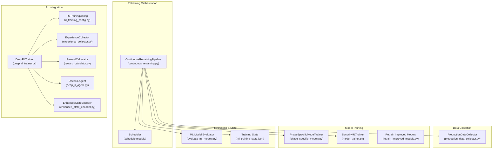
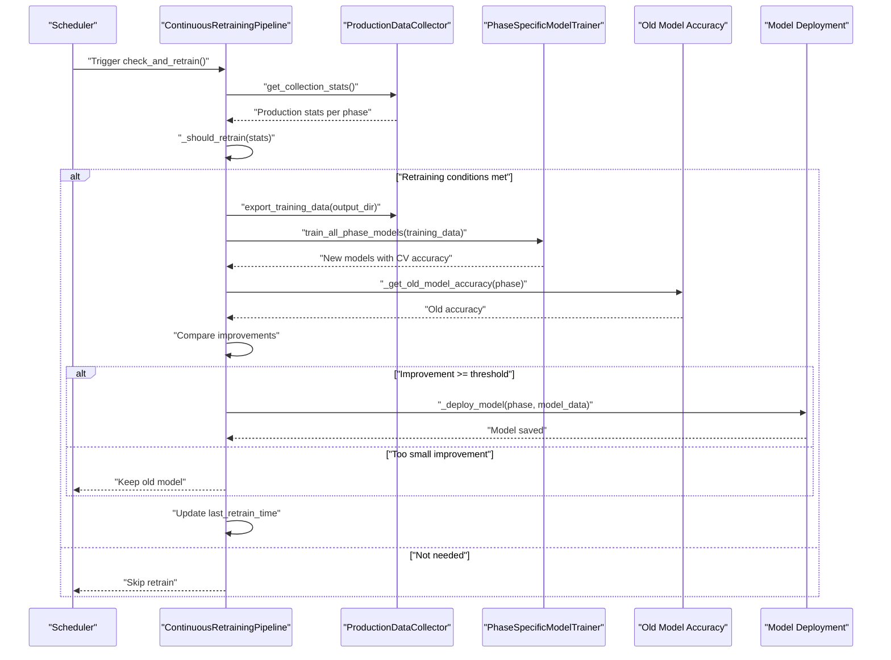
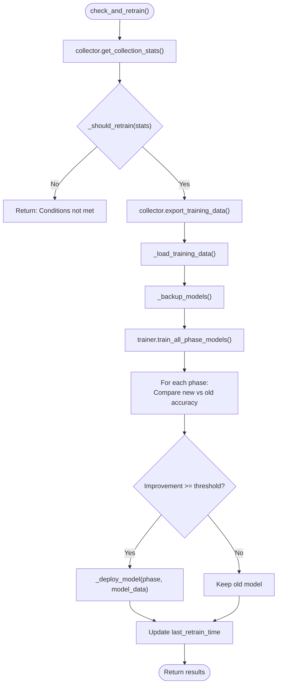
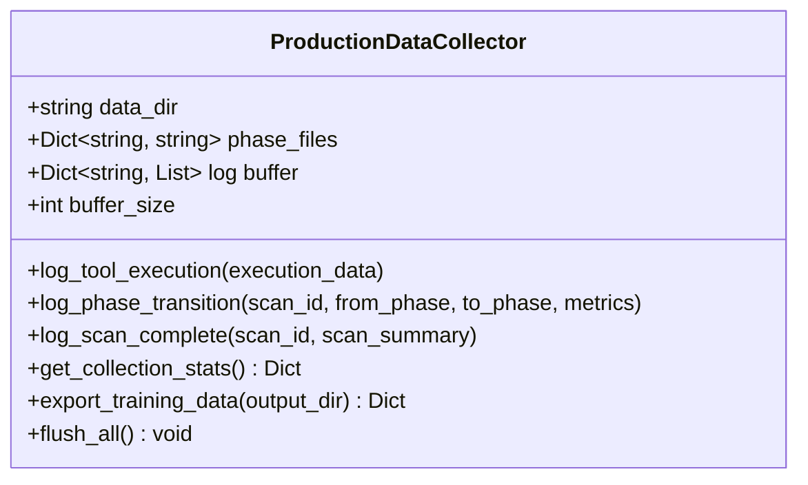
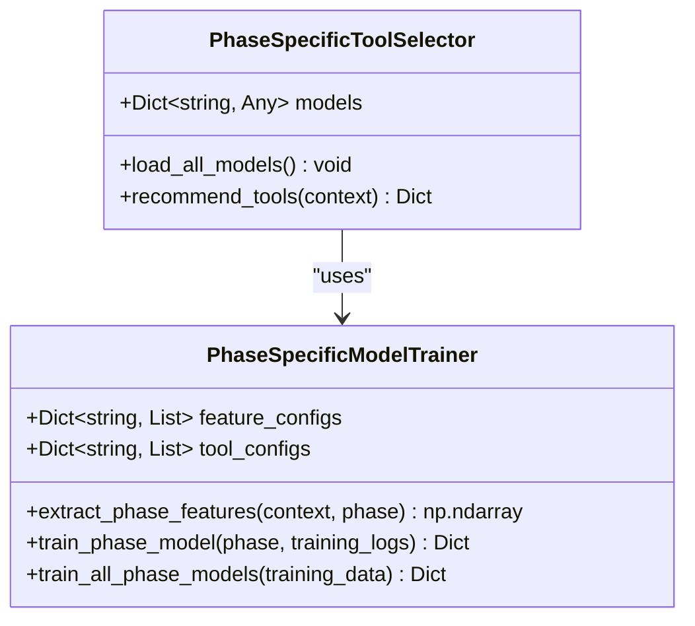
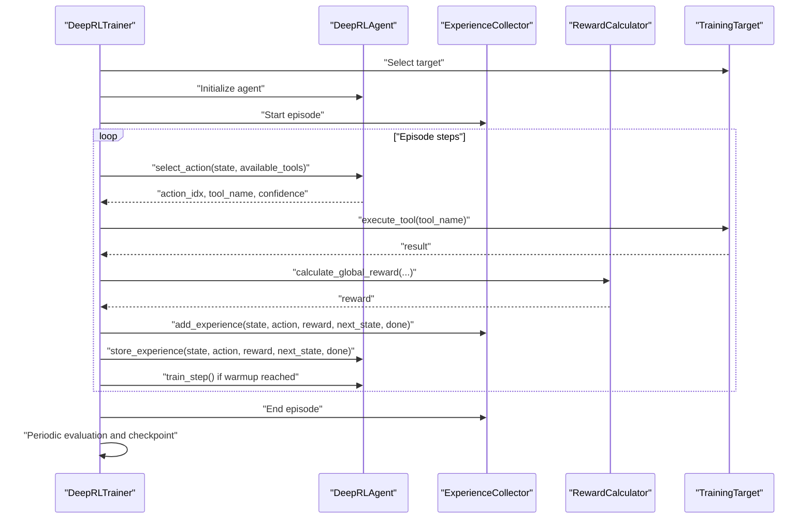
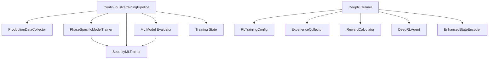

# Automated Retraining Pipeline

<cite>
**Referenced Files in This Document**
- [continuous_retraining.py](file://backend/training/continuous_retraining.py)
- [production_data_collector.py](file://backend/training/production_data_collector.py)
- [phase_specific_models.py](file://backend/training/phase_specific_models.py)
- [model_trainer.py](file://backend/training/model_trainer.py)
- [retrain_improved_models.py](file://backend/retrain_improved_models.py)
- [train_with_real_data.py](file://backend/train_with_real_data.py)
- [evaluate_ml_models.py](file://backend/testing/evaluate_ml_models.py)
- [ml_training_state.json](file://backend/data/ml_training_state.json)
- [deep_rl_trainer.py](file://backend/training/deep_rl_trainer.py)
- [rl_training_config.py](file://backend/training/rl_training_config.py)
- [experience_collector.py](file://backend/training/experience_collector.py)
- [reward_calculator.py](file://backend/training/reward_calculator.py)
- [deep_rl_agent.py](file://backend/training/deep_rl_agent.py)
- [enhanced_state_encoder.py](file://backend/training/enhanced_state_encoder.py)
</cite>

## Table of Contents
1. [Introduction](#introduction)
2. [Project Structure](#project-structure)
3. [Core Components](#core-components)
4. [Architecture Overview](#architecture-overview)
5. [Detailed Component Analysis](#detailed-component-analysis)
6. [Dependency Analysis](#dependency-analysis)
7. [Performance Considerations](#performance-considerations)
8. [Troubleshooting Guide](#troubleshooting-guide)
9. [Conclusion](#conclusion)

## Introduction
This document describes the automated retraining pipeline that continuously improves AI models using production data. The pipeline monitors new production logs, exports them to training format, trains phase-specific tool recommendation models, validates improvements against existing models, and deploys enhanced models when accuracy thresholds are met. It also integrates with the deep reinforcement learning (RL) training system for autonomous agent refinement and includes scheduling, manual overrides, and monitoring capabilities.

## Project Structure
The retraining pipeline spans several modules:
- Continuous retraining orchestration and scheduling
- Production data collection and export
- Phase-specific model training and deployment
- ML model evaluation and state tracking
- Deep RL training integration and monitoring

**Diagram sources**
- [continuous_retraining.py](file://backend/training/continuous_retraining.py#L27-L345)
- [production_data_collector.py](file://backend/training/production_data_collector.py#L14-L280)
- [phase_specific_models.py](file://backend/training/phase_specific_models.py#L15-L543)
- [model_trainer.py](file://backend/training/model_trainer.py#L20-L444)
- [retrain_improved_models.py](file://backend/retrain_improved_models.py#L1-L432)
- [evaluate_ml_models.py](file://backend/testing/evaluate_ml_models.py#L25-L316)
- [ml_training_state.json](file://backend/data/ml_training_state.json#L1-L51)
- [deep_rl_trainer.py](file://backend/training/deep_rl_trainer.py#L27-L547)
- [rl_training_config.py](file://backend/training/rl_training_config.py#L11-L159)
- [experience_collector.py](file://backend/training/experience_collector.py#L49-L240)
- [reward_calculator.py](file://backend/training/reward_calculator.py#L13-L234)
- [deep_rl_agent.py](file://backend/training/deep_rl_agent.py#L187-L724)
- [enhanced_state_encoder.py](file://backend/training/enhanced_state_encoder.py#L23-L593)

**Section sources**
- [continuous_retraining.py](file://backend/training/continuous_retraining.py#L1-L345)
- [production_data_collector.py](file://backend/training/production_data_collector.py#L1-L280)
- [phase_specific_models.py](file://backend/training/phase_specific_models.py#L1-L543)
- [model_trainer.py](file://backend/training/model_trainer.py#L1-L444)
- [retrain_improved_models.py](file://backend/retrain_improved_models.py#L1-L432)
- [evaluate_ml_models.py](file://backend/testing/evaluate_ml_models.py#L1-L316)
- [ml_training_state.json](file://backend/data/ml_training_state.json#L1-L51)
- [deep_rl_trainer.py](file://backend/training/deep_rl_trainer.py#L1-L547)
- [rl_training_config.py](file://backend/training/rl_training_config.py#L1-L159)
- [experience_collector.py](file://backend/training/experience_collector.py#L1-L240)
- [reward_calculator.py](file://backend/training/reward_calculator.py#L1-L234)
- [deep_rl_agent.py](file://backend/training/deep_rl_agent.py#L1-L724)
- [enhanced_state_encoder.py](file://backend/training/enhanced_state_encoder.py#L1-L593)

## Core Components
- ContinuousRetrainingPipeline orchestrates the entire retraining workflow, including data checks, scheduling, model backup, training, validation, and deployment decisions.
- ProductionDataCollector gathers production logs, batches them, and exports them to training-ready JSON files per phase.
- PhaseSpecificModelTrainer trains separate models for each pentesting phase using phase-specific features and evaluates them with cross-validation.
- SecurityMLTrainer provides generic ML training utilities for vulnerability detection, attack classification, severity prediction, and tool recommendation.
- Retrain Improved Models script enhances existing models with improved parameters and datasets.
- ML Model Evaluator assesses model performance against predefined success criteria.
- Deep RL Trainer coordinates multi-target RL training, experience collection, reward shaping, and checkpointing.

**Section sources**
- [continuous_retraining.py](file://backend/training/continuous_retraining.py#L27-L345)
- [production_data_collector.py](file://backend/training/production_data_collector.py#L14-L280)
- [phase_specific_models.py](file://backend/training/phase_specific_models.py#L15-L543)
- [model_trainer.py](file://backend/training/model_trainer.py#L20-L444)
- [retrain_improved_models.py](file://backend/retrain_improved_models.py#L1-L432)
- [evaluate_ml_models.py](file://backend/testing/evaluate_ml_models.py#L25-L316)
- [deep_rl_trainer.py](file://backend/training/deep_rl_trainer.py#L27-L547)

## Architecture Overview
The automated retraining pipeline follows a structured workflow:

**Diagram sources**
- [continuous_retraining.py](file://backend/training/continuous_retraining.py#L66-L212)
- [production_data_collector.py](file://backend/training/production_data_collector.py#L184-L268)
- [phase_specific_models.py](file://backend/training/phase_specific_models.py#L360-L404)

**Section sources**
- [continuous_retraining.py](file://backend/training/continuous_retraining.py#L66-L212)
- [production_data_collector.py](file://backend/training/production_data_collector.py#L184-L268)
- [phase_specific_models.py](file://backend/training/phase_specific_models.py#L360-L404)

## Detailed Component Analysis

### Continuous Retraining Pipeline
- Responsibilities:
  - Monitor production data volume and recency
  - Export production logs to training format
  - Train phase-specific models
  - Compare new model accuracy vs. existing models
  - Deploy improved models and update timestamps
  - Provide scheduling and manual override controls
- Key configuration:
  - Minimum new samples threshold
  - Maximum retrain interval
  - Minimum accuracy improvement threshold
  - Per-phase minimum samples
  - Backup and model directories
- Scheduling:
  - Optional daily schedule at a configurable time
  - Runs indefinitely until stopped

**Diagram sources**
- [continuous_retraining.py](file://backend/training/continuous_retraining.py#L66-L212)

**Section sources**
- [continuous_retraining.py](file://backend/training/continuous_retraining.py#L27-L345)

### Production Data Collector
- Collects tool execution events, phase transitions, and scan completions
- Buffers entries and flushes to JSONL files per phase
- Exports production logs to training-ready JSON files
- Provides collection statistics for retraining triggers

**Diagram sources**
- [production_data_collector.py](file://backend/training/production_data_collector.py#L14-L280)

**Section sources**
- [production_data_collector.py](file://backend/training/production_data_collector.py#L14-L280)

### Phase-Specific Model Trainer
- Trains separate models for each pentesting phase using phase-specific features
- Uses cross-validation to select the best model (RandomForest vs. GradientBoosting)
- Saves models with metadata including training samples, feature names, and model type
- Loads models at runtime for tool recommendation

**Diagram sources**
- [phase_specific_models.py](file://backend/training/phase_specific_models.py#L15-L543)

**Section sources**
- [phase_specific_models.py](file://backend/training/phase_specific_models.py#L15-L543)

### Model Training Utilities
- SecurityMLTrainer provides training utilities for various ML tasks:
  - Vulnerability detector (binary classification)
  - Attack classifier (multi-class)
  - Severity predictor (regression)
  - Tool recommender (classification)
  - Cloud detector and AI jailbreak detector
- Supports feature encoding, scaling, and saving/loading models

**Section sources**
- [model_trainer.py](file://backend/training/model_trainer.py#L20-L444)

### Retrain Improved Models
- Enhances existing models with improved parameters and larger datasets
- Includes targeted improvements for attack classifier, severity predictor, tool recommender, and RL agent
- Updates training state with metrics and improvements

**Section sources**
- [retrain_improved_models.py](file://backend/retrain_improved_models.py#L1-L432)
- [train_with_real_data.py](file://backend/train_with_real_data.py#L22-L800)

### ML Model Evaluation
- Evaluates trained models against success criteria:
  - Vulnerability detector: F1 ≥ 0.85, recall ≥ 0.80, precision ≥ 0.85
  - Attack classifier: Macro F1 ≥ 0.80, critical attack F1 ≥ 0.75
  - Severity predictor: MAE ≤ 1.0, R² ≥ 0.75, band accuracy ≥ 0.85
- Saves detailed evaluation results to JSON

**Section sources**
- [evaluate_ml_models.py](file://backend/testing/evaluate_ml_models.py#L25-L316)

### Deep RL Training Integration
- DeepRLTrainer coordinates multi-target training with experience collection, reward shaping, and checkpointing
- RLTrainingConfig defines targets, hyperparameters, and reward structure
- ExperienceCollector manages experience replay and statistics
- RewardCalculator computes unified rewards for environment, episode, and lesson components
- DeepRLAgent implements Dueling Double DQN with Noisy Networks and Prioritized Experience Replay
- EnhancedStateEncoder creates 128-dimensional state vectors for the RL agent

**Diagram sources**
- [deep_rl_trainer.py](file://backend/training/deep_rl_trainer.py#L58-L328)
- [rl_training_config.py](file://backend/training/rl_training_config.py#L30-L159)
- [experience_collector.py](file://backend/training/experience_collector.py#L49-L240)
- [reward_calculator.py](file://backend/training/reward_calculator.py#L13-L234)
- [deep_rl_agent.py](file://backend/training/deep_rl_agent.py#L187-L724)
- [enhanced_state_encoder.py](file://backend/training/enhanced_state_encoder.py#L23-L593)

**Section sources**
- [deep_rl_trainer.py](file://backend/training/deep_rl_trainer.py#L27-L547)
- [rl_training_config.py](file://backend/training/rl_training_config.py#L11-L159)
- [experience_collector.py](file://backend/training/experience_collector.py#L49-L240)
- [reward_calculator.py](file://backend/training/reward_calculator.py#L13-L234)
- [deep_rl_agent.py](file://backend/training/deep_rl_agent.py#L187-L724)
- [enhanced_state_encoder.py](file://backend/training/enhanced_state_encoder.py#L23-L593)

## Dependency Analysis
The pipeline exhibits clear separation of concerns:
- Retraining orchestration depends on data collection and model training modules
- Phase-specific models depend on feature configurations and tool registries
- RL training is decoupled but integrated via shared state encoders and reward calculators
- Evaluation and state tracking provide feedback loops for continuous improvement

**Diagram sources**
- [continuous_retraining.py](file://backend/training/continuous_retraining.py#L27-L345)
- [phase_specific_models.py](file://backend/training/phase_specific_models.py#L15-L543)
- [model_trainer.py](file://backend/training/model_trainer.py#L20-L444)
- [evaluate_ml_models.py](file://backend/testing/evaluate_ml_models.py#L25-L316)
- [deep_rl_trainer.py](file://backend/training/deep_rl_trainer.py#L27-L547)
- [rl_training_config.py](file://backend/training/rl_training_config.py#L30-L159)
- [experience_collector.py](file://backend/training/experience_collector.py#L49-L240)
- [reward_calculator.py](file://backend/training/reward_calculator.py#L13-L234)
- [deep_rl_agent.py](file://backend/training/deep_rl_agent.py#L187-L724)
- [enhanced_state_encoder.py](file://backend/training/enhanced_state_encoder.py#L23-L593)

**Section sources**
- [continuous_retraining.py](file://backend/training/continuous_retraining.py#L27-L345)
- [phase_specific_models.py](file://backend/training/phase_specific_models.py#L15-L543)
- [model_trainer.py](file://backend/training/model_trainer.py#L20-L444)
- [evaluate_ml_models.py](file://backend/testing/evaluate_ml_models.py#L25-L316)
- [deep_rl_trainer.py](file://backend/training/deep_rl_trainer.py#L27-L547)
- [rl_training_config.py](file://backend/training/rl_training_config.py#L30-L159)
- [experience_collector.py](file://backend/training/experience_collector.py#L49-L240)
- [reward_calculator.py](file://backend/training/reward_calculator.py#L13-L234)
- [deep_rl_agent.py](file://backend/training/deep_rl_agent.py#L187-L724)
- [enhanced_state_encoder.py](file://backend/training/enhanced_state_encoder.py#L23-L593)

## Performance Considerations
- Batch writing: ProductionDataCollector buffers entries to minimize disk I/O overhead
- Cross-validation: PhaseSpecificModelTrainer uses CV to select the best model variant per phase
- Early stopping and regularization: Various ML models employ regularization and early stopping to prevent overfitting
- RL training efficiency: Prioritized Experience Replay and target networks improve sample efficiency and training stability
- Scheduling cadence: Configurable intervals balance freshness of models with computational cost

## Troubleshooting Guide
- Retraining not triggered:
  - Verify production data volume meets minimum samples threshold
  - Check time since last retrain exceeds configured interval
  - Ensure per-phase minimum samples are satisfied
- Model not deployed:
  - Confirm improvement meets minimum accuracy threshold
  - Validate model backup and deployment paths
- Scheduler issues:
  - Confirm schedule module installation
  - Verify scheduled time and timezone settings
- RL training problems:
  - Check TensorFlow availability and GPU/CPU resources
  - Review experience collection and reward configuration
  - Inspect checkpoint loading and resume functionality

**Section sources**
- [continuous_retraining.py](file://backend/training/continuous_retraining.py#L104-L126)
- [production_data_collector.py](file://backend/training/production_data_collector.py#L152-L182)
- [phase_specific_models.py](file://backend/training/phase_specific_models.py#L317-L331)
- [deep_rl_trainer.py](file://backend/training/deep_rl_trainer.py#L462-L481)

## Conclusion
The automated retraining pipeline provides a robust framework for continuously improving AI models using production data. It balances automation with validation, ensures safe rollouts through accuracy comparisons, and integrates with deep RL systems for autonomous agent refinement. The modular design supports scheduling, manual overrides, and comprehensive monitoring, enabling reliable and scalable model maintenance in production environments.