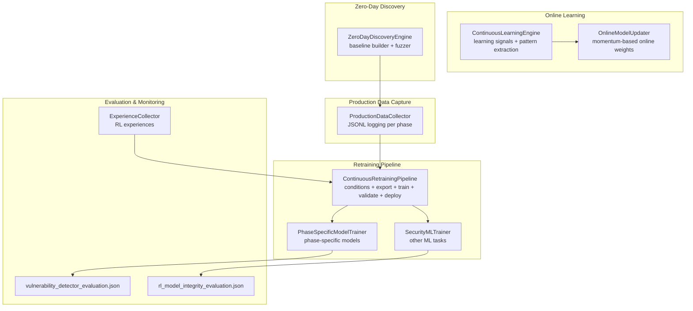
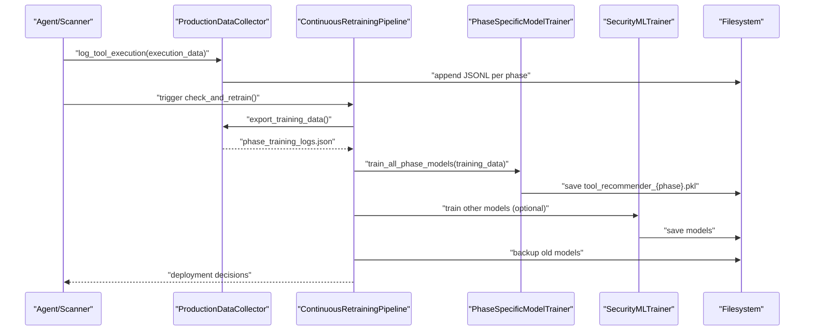
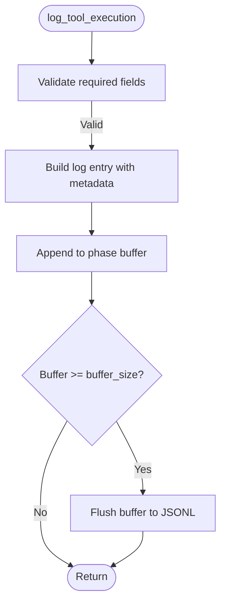
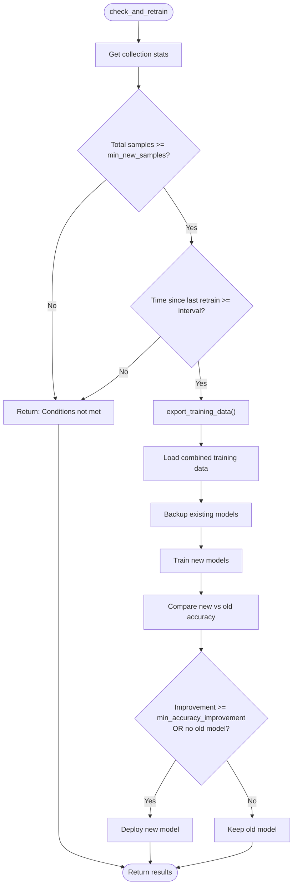
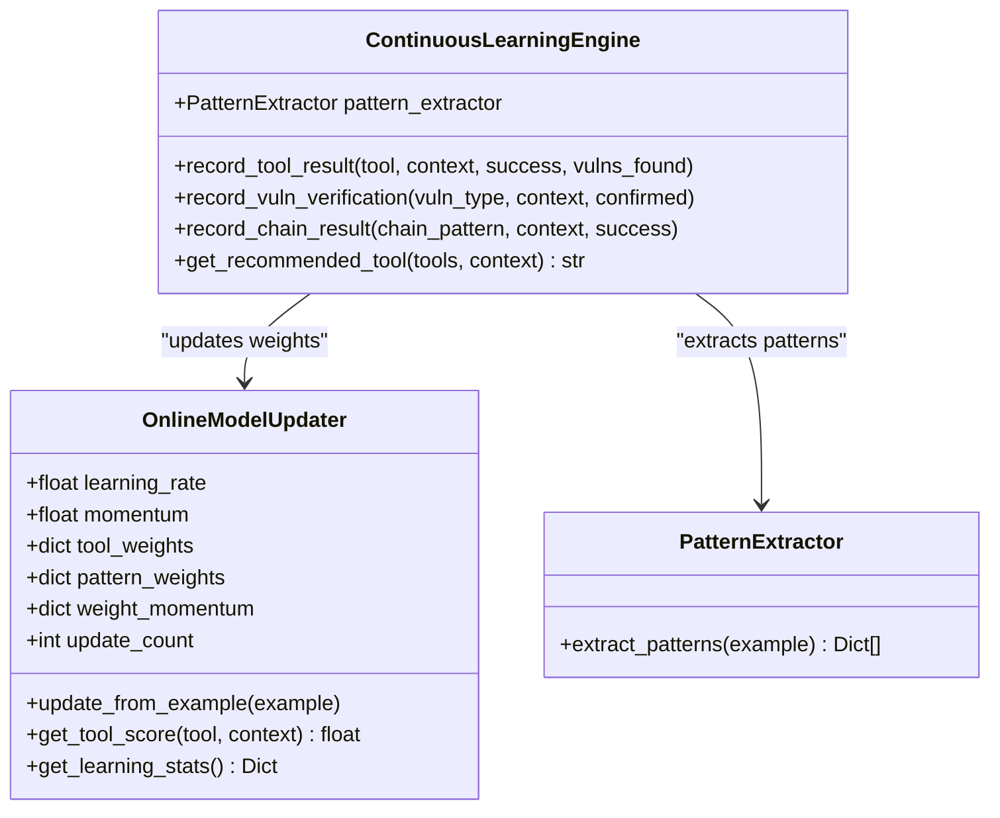
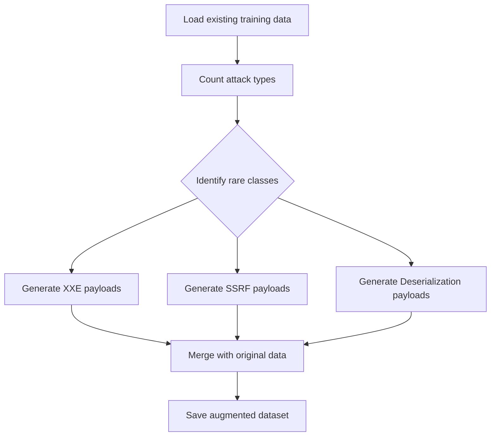
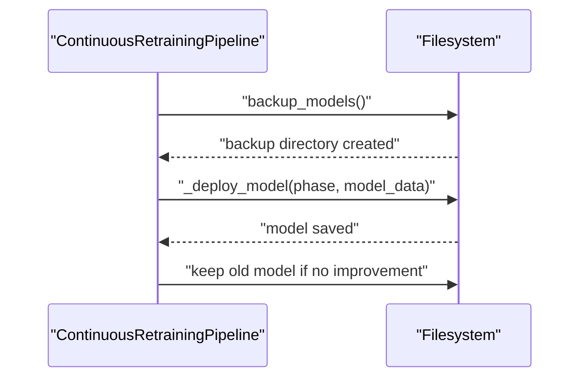
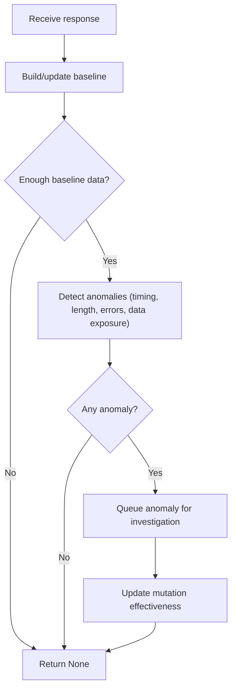
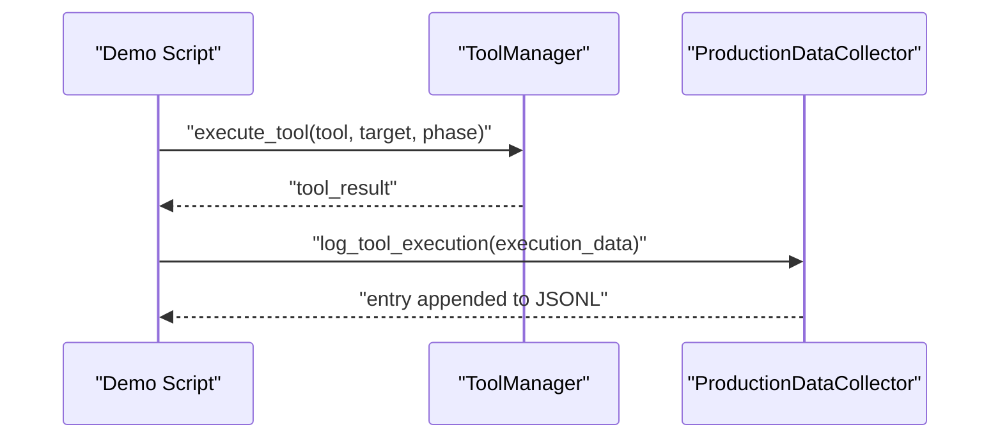
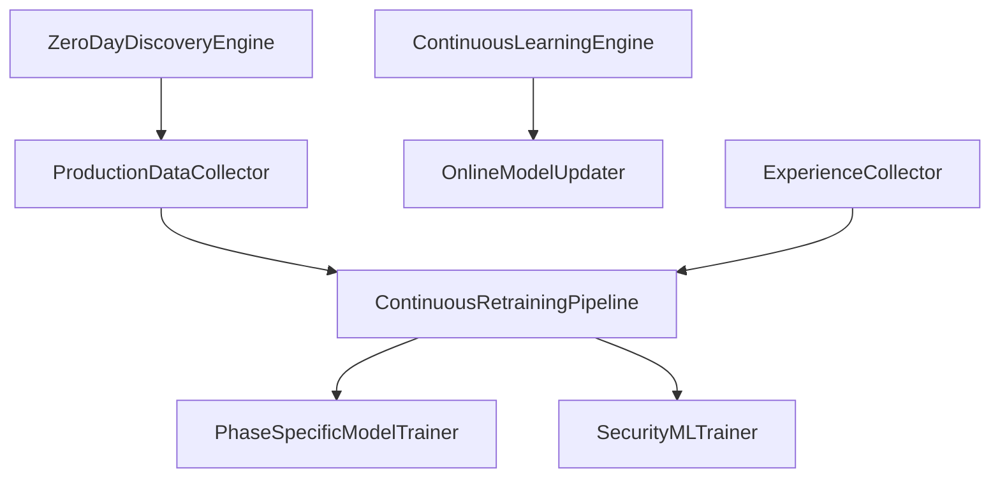

# Continuous Learning Systems

<cite>
**Referenced Files in This Document**
- [continuous_learning.py](file://backend/intelligence/continuous_learning.py)
- [production_data_collector.py](file://backend/training/production_data_collector.py)
- [continuous_retraining.py](file://backend/training/continuous_retraining.py)
- [data_augmentation.py](file://backend/training/data_augmentation.py)
- [model_trainer.py](file://backend/training/model_trainer.py)
- [phase_specific_models.py](file://backend/training/phase_specific_models.py)
- [online_weights.json](file://backend/data/models/online_weights.json)
- [ml_training_state.json](file://backend/data/ml_training_state.json)
- [experience_collector.py](file://backend/training/experience_collector.py)
- [demo_training_session.py](file://backend/testing/demo_training_session.py)
- [vulnerability_detector_evaluation.json](file://backend/evaluation_results/vulnerability_detector_evaluation.json)
- [rl_model_integrity_evaluation.json](file://backend/evaluation_results/rl_model_integrity_evaluation.json)
</cite>

## Table of Contents
1. [Introduction](#introduction)
2. [Project Structure](#project-structure)
3. [Core Components](#core-components)
4. [Architecture Overview](#architecture-overview)
5. [Detailed Component Analysis](#detailed-component-analysis)
6. [Dependency Analysis](#dependency-analysis)
7. [Performance Considerations](#performance-considerations)
8. [Troubleshooting Guide](#troubleshooting-guide)
9. [Conclusion](#conclusion)
10. [Appendices](#appendices)

## Introduction
This document describes the continuous learning systems that enable the AI agent to improve performance over time. It covers production data collection mechanisms, automatic retraining workflows, and data augmentation strategies. It documents online learning updates, model versioning and rollback mechanisms, and concrete examples of processing real-world scan results. It also addresses data quality controls, drift detection, and performance regression prevention, along with strategies for maintaining model consistency across environments and handling concept drift in cybersecurity contexts.

## Project Structure
The continuous learning system spans three primary areas:
- Production data capture and export for model improvement
- Automated retraining pipeline with validation and deployment
- Online learning and zero-day discovery engines

**Diagram sources**
- [production_data_collector.py](file://backend/training/production_data_collector.py#L14-L280)
- [continuous_retraining.py](file://backend/training/continuous_retraining.py#L27-L345)
- [phase_specific_models.py](file://backend/training/phase_specific_models.py#L15-L543)
- [model_trainer.py](file://backend/training/model_trainer.py#L20-L444)
- [continuous_learning.py](file://backend/intelligence/continuous_learning.py#L64-L376)
- [experience_collector.py](file://backend/training/experience_collector.py#L49-L240)
- [vulnerability_detector_evaluation.json](file://backend/evaluation_results/vulnerability_detector_evaluation.json#L1-L30)
- [rl_model_integrity_evaluation.json](file://backend/evaluation_results/rl_model_integrity_evaluation.json#L1-L10)

**Section sources**
- [production_data_collector.py](file://backend/training/production_data_collector.py#L14-L280)
- [continuous_retraining.py](file://backend/training/continuous_retraining.py#L27-L345)
- [phase_specific_models.py](file://backend/training/phase_specific_models.py#L15-L543)
- [model_trainer.py](file://backend/training/model_trainer.py#L20-L444)
- [continuous_learning.py](file://backend/intelligence/continuous_learning.py#L64-L376)
- [experience_collector.py](file://backend/training/experience_collector.py#L49-L240)
- [vulnerability_detector_evaluation.json](file://backend/evaluation_results/vulnerability_detector_evaluation.json#L1-L30)
- [rl_model_integrity_evaluation.json](file://backend/evaluation_results/rl_model_integrity_evaluation.json#L1-L10)

## Core Components
- ProductionDataCollector: Streams tool execution events from live scans into JSONL files per phase, with buffering and batch writes. It exports production logs into training-ready format and supports manual flush and statistics.
- ContinuousRetrainingPipeline: Orchestrates the entire retraining lifecycle, including condition checks, exporting production data, backing up models, training, validation against minimum accuracy thresholds, and deployment.
- PhaseSpecificModelTrainer: Trains separate models per pentest phase using domain-relevant features and tools, with cross-validation and standardized persistence.
- SecurityMLTrainer: Provides training for detectors, classifiers, predictors, and specialized security models, with standardized evaluation and persistence.
- OnlineModelUpdater: Maintains lightweight online weights for immediate adaptation from production feedback, with momentum-based updates and periodic persistence.
- ContinuousLearningEngine: Aggregates learning signals from tool outcomes, vulnerability verifications, and attack chains, updating online weights and extracting reusable patterns.
- ZeroDayDiscoveryEngine: Detects anomalies in responses using baselines and orchestrates intelligent fuzzing guided by mutation effectiveness.
- ExperienceCollector: Captures RL experiences for offline training and analysis, enabling deep reinforcement learning improvements.
- Evaluation artifacts: JSON reports for model evaluations and integrity checks support regression prevention and monitoring.

**Section sources**
- [production_data_collector.py](file://backend/training/production_data_collector.py#L14-L280)
- [continuous_retraining.py](file://backend/training/continuous_retraining.py#L27-L345)
- [phase_specific_models.py](file://backend/training/phase_specific_models.py#L15-L543)
- [model_trainer.py](file://backend/training/model_trainer.py#L20-L444)
- [continuous_learning.py](file://backend/intelligence/continuous_learning.py#L64-L376)
- [experience_collector.py](file://backend/training/experience_collector.py#L49-L240)
- [vulnerability_detector_evaluation.json](file://backend/evaluation_results/vulnerability_detector_evaluation.json#L1-L30)
- [rl_model_integrity_evaluation.json](file://backend/evaluation_results/rl_model_integrity_evaluation.json#L1-L10)

## Architecture Overview
The system integrates production telemetry, automated retraining, and online adaptation to continuously improve the agent’s performance while preserving stability.

**Diagram sources**
- [production_data_collector.py](file://backend/training/production_data_collector.py#L39-L183)
- [continuous_retraining.py](file://backend/training/continuous_retraining.py#L66-L212)
- [phase_specific_models.py](file://backend/training/phase_specific_models.py#L360-L404)
- [model_trainer.py](file://backend/training/model_trainer.py#L423-L443)

## Detailed Component Analysis

### Production Data Collection
ProductionDataCollector captures tool execution events and writes them to JSONL files organized by phase. It maintains an in-memory buffer and flushes to disk when the buffer reaches a configured size. It also supports logging phase transitions and scan completions, and exposes statistics and export capabilities.

Key behaviors:
- Buffered writes with thread lock for concurrency safety
- Per-phase JSONL files for targeted training
- Export to training-ready format merging with existing training data
- Statistics aggregation and manual flush

**Diagram sources**
- [production_data_collector.py](file://backend/training/production_data_collector.py#L39-L183)

**Section sources**
- [production_data_collector.py](file://backend/training/production_data_collector.py#L14-L280)

### Continuous Retraining Workflow
The pipeline evaluates whether retraining is needed based on thresholds for new samples, minimum per-phase samples, and time since last retrain. When triggered, it exports production logs, loads combined training data, backs up existing models, trains new models, validates improvements, and deploys only when thresholds are met.

Highlights:
- Configurable thresholds for triggering retraining
- Backup of existing models prior to training
- Validation against minimum accuracy improvement
- Deployment of new models per phase

**Diagram sources**
- [continuous_retraining.py](file://backend/training/continuous_retraining.py#L66-L212)
- [phase_specific_models.py](file://backend/training/phase_specific_models.py#L360-L404)

**Section sources**
- [continuous_retraining.py](file://backend/training/continuous_retraining.py#L27-L345)
- [phase_specific_models.py](file://backend/training/phase_specific_models.py#L15-L543)

### Online Learning Updates
OnlineModelUpdater applies online gradient descent with momentum to adjust weights in response to learning signals. It extracts features from context and updates weights for tools, vulnerability patterns, and attack chains. Weights are periodically persisted to disk.

Key aspects:
- Momentum-based weight updates
- Feature extraction from context
- Periodic persistence of weights
- Tool scoring based on learned weights

**Diagram sources**
- [continuous_learning.py](file://backend/intelligence/continuous_learning.py#L64-L376)

**Section sources**
- [continuous_learning.py](file://backend/intelligence/continuous_learning.py#L64-L376)
- [online_weights.json](file://backend/data/models/online_weights.json#L1-L82)

### Data Augmentation Strategies
AttackDataAugmenter generates synthetic payloads for rare attack categories (e.g., XXE, SSRF, Insecure Deserialization) to address class imbalance. It mutates templates and records severity and attack type metadata, then augments existing datasets and saves the combined result.

**Diagram sources**
- [data_augmentation.py](file://backend/training/data_augmentation.py#L8-L338)

**Section sources**
- [data_augmentation.py](file://backend/training/data_augmentation.py#L8-L338)

### Model Versioning and Rollback Mechanisms
- Versioning: Models are saved with metadata including training date and feature sets. Backups are created before retraining, enabling rollback.
- Rollback: If a new model fails validation or shows insufficient improvement, the pipeline keeps the previous model and logs the failure.
- Persistence: Models are stored in a models directory with phase-specific filenames.

**Diagram sources**
- [continuous_retraining.py](file://backend/training/continuous_retraining.py#L237-L280)

**Section sources**
- [continuous_retraining.py](file://backend/training/continuous_retraining.py#L237-L280)

### Zero-Day Discovery and Drift Detection
ZeroDayDiscoveryEngine builds response baselines per endpoint and detects anomalies using statistical deviations and pattern analysis. It guides intelligent fuzzing based on mutation effectiveness and queues high-priority anomalies for investigation.

**Diagram sources**
- [continuous_learning.py](file://backend/intelligence/continuous_learning.py#L681-L804)

**Section sources**
- [continuous_learning.py](file://backend/intelligence/continuous_learning.py#L416-L804)

### Real-World Scan Results Processing Example
A demo training session executes tools against targets, collects findings, and logs execution events for training. It demonstrates how real-world scan results are captured and prepared for continuous improvement.

**Diagram sources**
- [demo_training_session.py](file://backend/testing/demo_training_session.py#L12-L106)
- [production_data_collector.py](file://backend/training/production_data_collector.py#L39-L84)

**Section sources**
- [demo_training_session.py](file://backend/testing/demo_training_session.py#L12-L106)
- [production_data_collector.py](file://backend/training/production_data_collector.py#L39-L84)

### Integration with Production Environment
- Data capture: Tool execution events are logged immediately during scans, ensuring minimal overhead and real-time availability for retraining.
- Retraining cadence: The pipeline can run on a schedule or be invoked manually, with safeguards to avoid unnecessary retraining.
- Model deployment: New models are validated and deployed only when improvements exceed thresholds, preventing regressions.

**Section sources**
- [production_data_collector.py](file://backend/training/production_data_collector.py#L176-L208)
- [continuous_retraining.py](file://backend/training/continuous_retraining.py#L281-L301)

### Stability vs. Adaptation Balance
- Threshold-based retraining prevents frequent model churn.
- Minimum improvement thresholds ensure deployments only when beneficial.
- Backups enable quick rollback if regressions occur.
- Online learning complements batch retraining with rapid adaptation to recent feedback.

**Section sources**
- [continuous_retraining.py](file://backend/training/continuous_retraining.py#L104-L127)
- [continuous_learning.py](file://backend/intelligence/continuous_learning.py#L126-L147)

### Data Quality Controls and Drift Prevention
- Data quality: Required fields validation and structured logging reduce malformed entries.
- Drift detection: Zero-Day DiscoveryEngine identifies concept drift via baseline deviations and anomaly priorities.
- Regression prevention: Evaluation artifacts and integrity checks provide objective measures of model health.

**Section sources**
- [production_data_collector.py](file://backend/training/production_data_collector.py#L60-L84)
- [continuous_learning.py](file://backend/intelligence/continuous_learning.py#L735-L804)
- [vulnerability_detector_evaluation.json](file://backend/evaluation_results/vulnerability_detector_evaluation.json#L1-L30)
- [rl_model_integrity_evaluation.json](file://backend/evaluation_results/rl_model_integrity_evaluation.json#L1-L10)

### Concept Drift Handling in Cybersecurity
- Baseline-driven anomaly detection flags unusual response patterns, timing shifts, and new error signatures.
- Intelligent fuzzing adapts mutation strategies based on past anomaly success, improving coverage over time.
- Phase-specific models learn environment-specific patterns, reducing cross-phase drift impact.

**Section sources**
- [continuous_learning.py](file://backend/intelligence/continuous_learning.py#L442-L804)
- [phase_specific_models.py](file://backend/training/phase_specific_models.py#L15-L543)

## Dependency Analysis
The system exhibits clear separation of concerns:
- Data capture depends on runtime tool execution and is decoupled from training.
- Retraining pipeline depends on both production logs and training data.
- Online learning and zero-day discovery operate independently but can influence training data quality.

**Diagram sources**
- [production_data_collector.py](file://backend/training/production_data_collector.py#L14-L280)
- [continuous_retraining.py](file://backend/training/continuous_retraining.py#L27-L345)
- [phase_specific_models.py](file://backend/training/phase_specific_models.py#L15-L543)
- [model_trainer.py](file://backend/training/model_trainer.py#L20-L444)
- [continuous_learning.py](file://backend/intelligence/continuous_learning.py#L64-L376)
- [experience_collector.py](file://backend/training/experience_collector.py#L49-L240)

**Section sources**
- [production_data_collector.py](file://backend/training/production_data_collector.py#L14-L280)
- [continuous_retraining.py](file://backend/training/continuous_retraining.py#L27-L345)
- [phase_specific_models.py](file://backend/training/phase_specific_models.py#L15-L543)
- [model_trainer.py](file://backend/training/model_trainer.py#L20-L444)
- [continuous_learning.py](file://backend/intelligence/continuous_learning.py#L64-L376)
- [experience_collector.py](file://backend/training/experience_collector.py#L49-L240)

## Performance Considerations
- Batch writes and buffering minimize I/O overhead during high-volume production scans.
- Cross-validation and per-phase models improve generalization and reduce overfitting risk.
- Online learning updates are lightweight and incremental, avoiding heavy retraining costs.
- Evaluation artifacts guide decisions to prevent performance regressions.

[No sources needed since this section provides general guidance]

## Troubleshooting Guide
Common issues and resolutions:
- Missing required fields in execution logs: The collector validates required keys and logs errors; ensure scan results include scan_id, phase, tool, and context.
- Insufficient samples for retraining: Increase production volume or adjust thresholds in the retraining configuration.
- Model loading failures: Phase-specific models handle sklearn version mismatches gracefully and fall back to non-model behavior.
- Anomaly detection noise: Tune baseline thresholds and investigate false positives by reviewing anomaly priorities and content patterns.

**Section sources**
- [production_data_collector.py](file://backend/training/production_data_collector.py#L60-L84)
- [continuous_retraining.py](file://backend/training/continuous_retraining.py#L281-L301)
- [phase_specific_models.py](file://backend/training/phase_specific_models.py#L422-L467)
- [continuous_learning.py](file://backend/intelligence/continuous_learning.py#L735-L804)

## Conclusion
The continuous learning system integrates production telemetry, automated retraining, and online adaptation to evolve the agent’s capabilities safely and effectively. By combining threshold-based retraining, model backups, evaluation-driven deployment, and anomaly-based drift detection, it balances stability with adaptation. Data augmentation and phase-specific modeling further strengthen resilience against concept drift in cybersecurity scenarios.

[No sources needed since this section summarizes without analyzing specific files]

## Appendices

### Appendix A: Model Metrics Reference
- ML training state metrics include detector, classifier, predictor, and tool recommender performance.
- Evaluation results provide quantitative measures for vulnerability detectors and RL model integrity.

**Section sources**
- [ml_training_state.json](file://backend/data/ml_training_state.json#L1-L51)
- [vulnerability_detector_evaluation.json](file://backend/evaluation_results/vulnerability_detector_evaluation.json#L1-L30)
- [rl_model_integrity_evaluation.json](file://backend/evaluation_results/rl_model_integrity_evaluation.json#L1-L10)