# Data Augmentation Strategies

<cite>
**Referenced Files in This Document**
- [data_augmentation.py](file://backend/training/data_augmentation.py)
- [pattern_extractor.py](file://backend/training/pattern_extractor.py)
- [production_data_collector.py](file://backend/training/production_data_collector.py)
- [continuous_retraining.py](file://backend/training/continuous_retraining.py)
- [phase_specific_models.py](file://backend/training/phase_specific_models.py)
- [train_phase_models.py](file://backend/training/train_phase_models.py)
- [model_trainer.py](file://backend/training/model_trainer.py)
- [feature_extractor.py](file://backend/training/feature_extractor.py)
- [evaluate_ml_models.py](file://backend/testing/evaluate_ml_models.py)
- [experience_collector.py](file://backend/training/experience_collector.py)
- [ml_training_state.json](file://backend/data/ml_training_state.json)
</cite>

## Table of Contents
1. [Introduction](#introduction)
2. [Project Structure](#project-structure)
3. [Core Components](#core-components)
4. [Architecture Overview](#architecture-overview)
5. [Detailed Component Analysis](#detailed-component-analysis)
6. [Dependency Analysis](#dependency-analysis)
7. [Performance Considerations](#performance-considerations)
8. [Troubleshooting Guide](#troubleshooting-guide)
9. [Conclusion](#conclusion)
10. [Appendices](#appendices)

## Introduction
This document explains the data augmentation strategies used to enhance training datasets with production data. It covers augmentation algorithms, pattern extraction methods, synthetic data generation, techniques for expanding minority classes, creating edge cases, and maintaining dataset balance. It also documents integration with production data collection, validation of augmented samples, and the impact on model performance. Practical examples of augmentation transformations, acceptance criteria, and the relationship between data quality and model generalization are included, along with guidance on maintaining data authenticity while increasing diversity.

## Project Structure
The data augmentation system spans several modules:
- Data augmentation generators for rare attack types
- Pattern extraction for generalizing attack signatures
- Production data collection and export for training
- Continuous retraining pipeline integrating production logs
- Phase-specific tool recommendation models
- ML model trainers and evaluators
- Experience collection for reinforcement learning

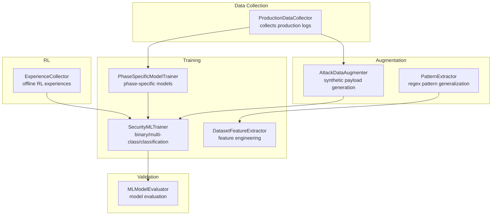

**Diagram sources**
- [production_data_collector.py](file://backend/training/production_data_collector.py#L14-L280)
- [data_augmentation.py](file://backend/training/data_augmentation.py#L8-L338)
- [pattern_extractor.py](file://backend/training/pattern_extractor.py#L4-L251)
- [phase_specific_models.py](file://backend/training/phase_specific_models.py#L15-L543)
- [model_trainer.py](file://backend/training/model_trainer.py#L20-L444)
- [feature_extractor.py](file://backend/training/feature_extractor.py#L7-L246)
- [evaluate_ml_models.py](file://backend/testing/evaluate_ml_models.py#L25-L316)
- [experience_collector.py](file://backend/training/experience_collector.py#L49-L240)

**Section sources**
- [production_data_collector.py](file://backend/training/production_data_collector.py#L14-L280)
- [data_augmentation.py](file://backend/training/data_augmentation.py#L8-L338)
- [pattern_extractor.py](file://backend/training/pattern_extractor.py#L4-L251)
- [phase_specific_models.py](file://backend/training/phase_specific_models.py#L15-L543)
- [model_trainer.py](file://backend/training/model_trainer.py#L20-L444)
- [feature_extractor.py](file://backend/training/feature_extractor.py#L7-L246)
- [evaluate_ml_models.py](file://backend/testing/evaluate_ml_models.py#L25-L316)
- [experience_collector.py](file://backend/training/experience_collector.py#L49-L240)

## Core Components
- AttackDataAugmenter: Generates synthetic payloads for rare attack categories (XXE, SSRF, Insecure Deserialization) using templates and randomized mutations.
- PatternExtractor: Extracts and generalizes regex patterns from training examples to support signature-based detection.
- ProductionDataCollector: Streams production tool execution logs into structured JSONL files, enabling continuous model improvement.
- ContinuousRetrainingPipeline: Monitors production data volume and freshness, exports logs to training format, backs up models, trains new models, validates improvements, and deploys when thresholds are met.
- PhaseSpecificModelTrainer: Trains separate models per pentest phase with phase-specific features and tools.
- SecurityMLTrainer: Trains binary vulnerability detectors, multi-class attack classifiers, tool recommenders, severity predictors, and specialized detectors.
- DatasetFeatureExtractor: Converts raw inputs (HTTP requests, cloud events, text prompts) into numerical features for ML models.
- MLModelEvaluator: Evaluates trained models on held-out test sets with strict success criteria.
- ExperienceCollector: Collects RL experiences for offline training and analysis.

**Section sources**
- [data_augmentation.py](file://backend/training/data_augmentation.py#L8-L338)
- [pattern_extractor.py](file://backend/training/pattern_extractor.py#L4-L251)
- [production_data_collector.py](file://backend/training/production_data_collector.py#L14-L280)
- [continuous_retraining.py](file://backend/training/continuous_retraining.py#L27-L345)
- [phase_specific_models.py](file://backend/training/phase_specific_models.py#L15-L543)
- [model_trainer.py](file://backend/training/model_trainer.py#L20-L444)
- [feature_extractor.py](file://backend/training/feature_extractor.py#L7-L246)
- [evaluate_ml_models.py](file://backend/testing/evaluate_ml_models.py#L25-L316)
- [experience_collector.py](file://backend/training/experience_collector.py#L49-L240)

## Architecture Overview
The augmentation pipeline integrates production data collection with synthetic augmentation and continuous retraining:

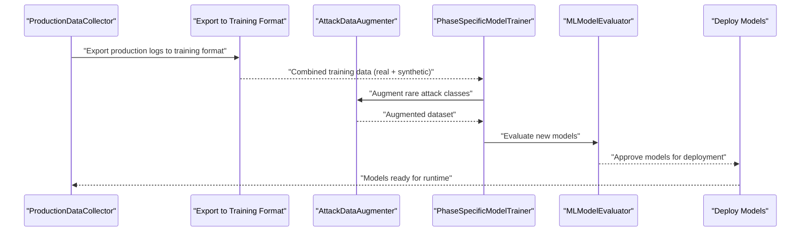

**Diagram sources**
- [production_data_collector.py](file://backend/training/production_data_collector.py#L209-L268)
- [data_augmentation.py](file://backend/training/data_augmentation.py#L218-L270)
- [phase_specific_models.py](file://backend/training/phase_specific_models.py#L360-L404)
- [evaluate_ml_models.py](file://backend/testing/evaluate_ml_models.py#L278-L316)
- [continuous_retraining.py](file://backend/training/continuous_retraining.py#L128-L212)

## Detailed Component Analysis

### AttackDataAugmenter
- Purpose: Generate synthetic training examples for underrepresented attack types to balance the dataset and improve minority-class detection.
- Algorithms:
  - Template-based generation for XXE, SSRF, and Insecure Deserialization.
  - Randomized mutations to vary payloads while preserving attack semantics.
- Minority class expansion:
  - Identifies rare attack types by counting occurrences.
  - Generates fixed-size synthetic batches for each rare class.
- Edge case creation:
  - Mutations include case variations, URL encoding, protocol variants, and obfuscation.
- Dataset balance:
  - Uses counts to determine thresholds and generates balanced synthetic samples.

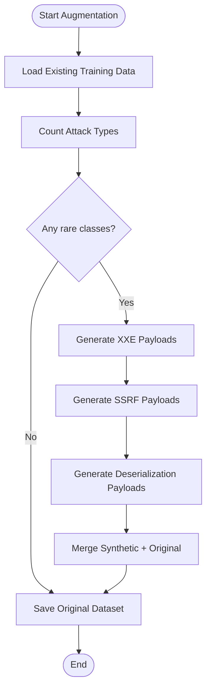

**Diagram sources**
- [data_augmentation.py](file://backend/training/data_augmentation.py#L218-L270)

**Section sources**
- [data_augmentation.py](file://backend/training/data_augmentation.py#L8-L338)

### PatternExtractor
- Purpose: Extract and generalize attack patterns from training examples into regex patterns for detection.
- Methods:
  - SQL injection, XSS, command injection, and path traversal pattern extraction.
  - Generalization converts specific tokens into generalized forms while preserving attack semantics.
- Integration:
  - Used by feature extractors and detection systems to improve coverage.

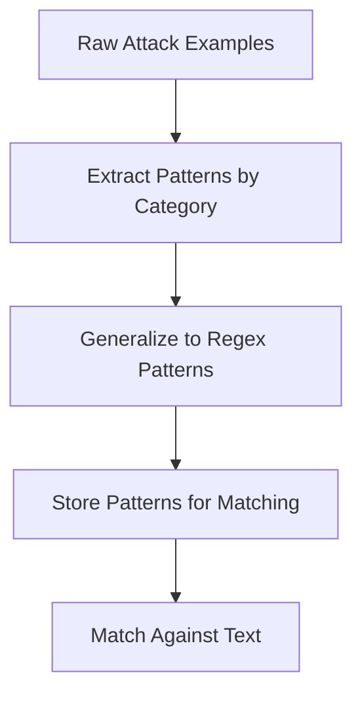

**Diagram sources**
- [pattern_extractor.py](file://backend/training/pattern_extractor.py#L13-L251)

**Section sources**
- [pattern_extractor.py](file://backend/training/pattern_extractor.py#L4-L251)

### ProductionDataCollector
- Purpose: Stream production tool execution logs into JSONL files organized by phase.
- Features:
  - Buffered writes with thread safety.
  - Structured logging for tool execution, phase transitions, and scan completions.
  - Export to training format with merging of existing datasets.
- Integration:
  - Supplies data to continuous retraining pipeline.

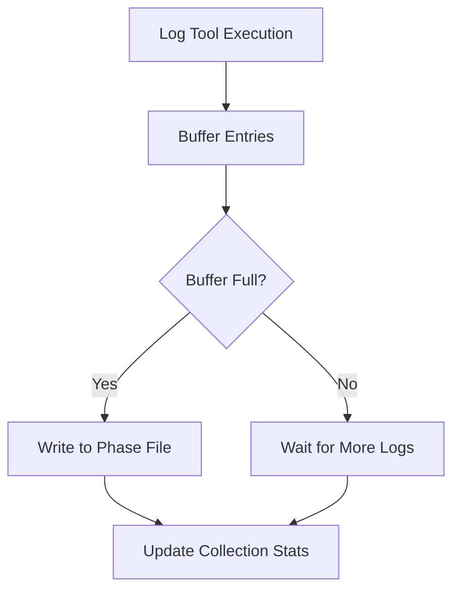

**Diagram sources**
- [production_data_collector.py](file://backend/training/production_data_collector.py#L39-L183)

**Section sources**
- [production_data_collector.py](file://backend/training/production_data_collector.py#L14-L280)

### ContinuousRetrainingPipeline
- Purpose: Automate model retraining using production data.
- Steps:
  - Export production logs to training format.
  - Load combined training data (production + synthetic).
  - Backup existing models.
  - Train new models per phase.
  - Validate improvements and deploy when thresholds are met.
- Triggers:
  - Minimum new samples threshold.
  - Time-based intervals.
  - Per-phase minimum sample requirements.

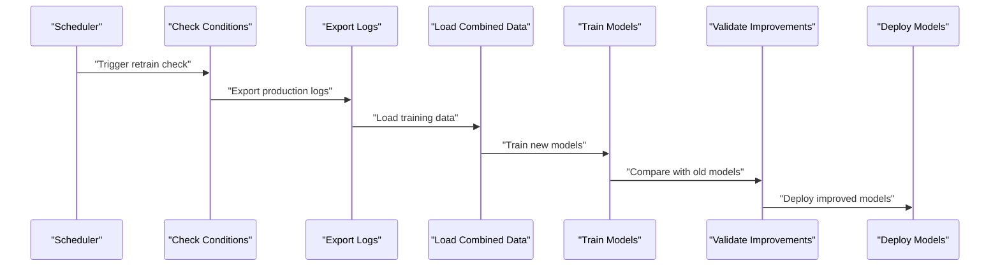

**Diagram sources**
- [continuous_retraining.py](file://backend/training/continuous_retraining.py#L66-L212)

**Section sources**
- [continuous_retraining.py](file://backend/training/continuous_retraining.py#L27-L345)

### Phase-SpecificModelTrainer
- Purpose: Train separate models for each pentest phase with phase-specific features and tools.
- Features:
  - Phase-specific feature sets and tool catalogs.
  - Cross-validation evaluation and feature importance analysis.
  - Ensemble training with Random Forest and Gradient Boosting.

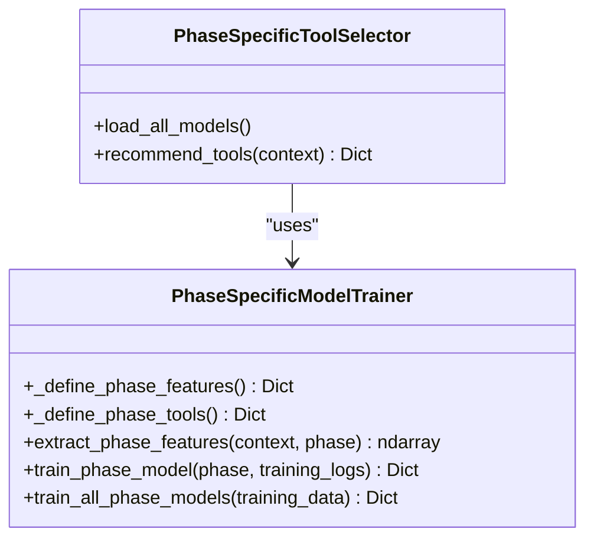

**Diagram sources**
- [phase_specific_models.py](file://backend/training/phase_specific_models.py#L15-L543)

**Section sources**
- [phase_specific_models.py](file://backend/training/phase_specific_models.py#L15-L543)

### SecurityMLTrainer
- Purpose: Train ML models for vulnerability detection, attack classification, tool recommendation, severity prediction, and specialized detectors.
- Techniques:
  - Ensemble methods for robustness.
  - Stratified splits and class balancing for imbalanced datasets.
  - Feature scaling and vectorization for text inputs.

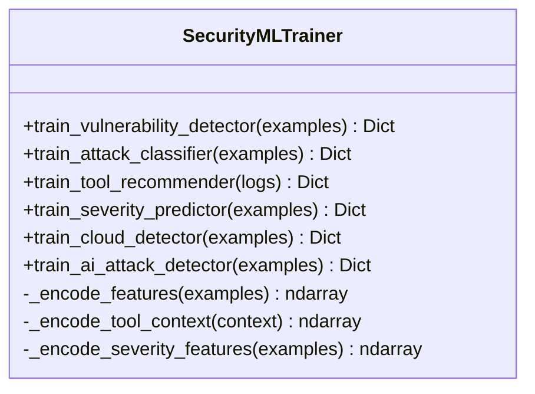

**Diagram sources**
- [model_trainer.py](file://backend/training/model_trainer.py#L20-L444)

**Section sources**
- [model_trainer.py](file://backend/training/model_trainer.py#L20-L444)

### DatasetFeatureExtractor
- Purpose: Convert raw inputs into numerical features for ML training.
- Inputs:
  - HTTP requests (entropy, keyword counts, encoding indicators).
  - Cloud security events (service, privilege, action indicators).
  - Text prompts (length, entropy, jailbreak indicators).

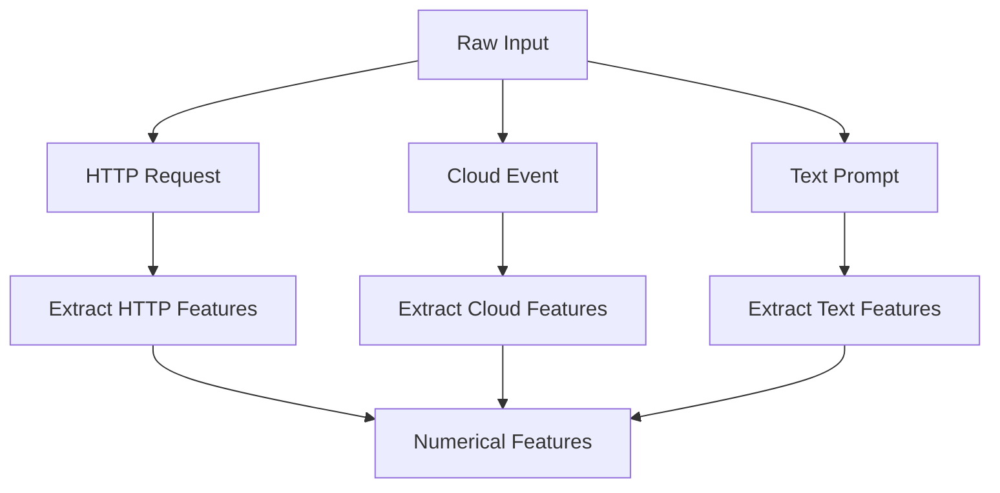

**Diagram sources**
- [feature_extractor.py](file://backend/training/feature_extractor.py#L120-L217)

**Section sources**
- [feature_extractor.py](file://backend/training/feature_extractor.py#L7-L246)

### MLModelEvaluator
- Purpose: Evaluate trained models on held-out test sets with strict success criteria.
- Models evaluated:
  - Vulnerability detector (binary classification).
  - Attack classifier (multi-class).
  - Severity predictor (regression).
- Criteria:
  - F1 and recall thresholds for binary classification.
  - Macro F1 and per-class thresholds for multi-class.
  - MAE, R², and severity band accuracy for regression.

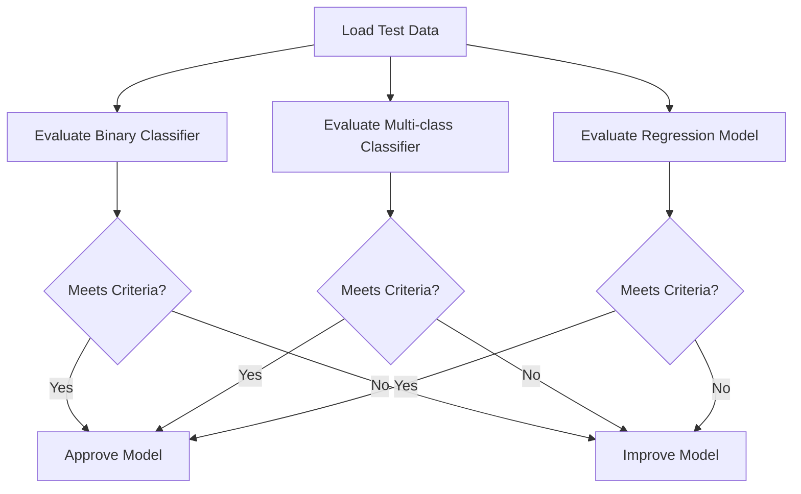

**Diagram sources**
- [evaluate_ml_models.py](file://backend/testing/evaluate_ml_models.py#L35-L259)

**Section sources**
- [evaluate_ml_models.py](file://backend/testing/evaluate_ml_models.py#L25-L316)

### ExperienceCollector
- Purpose: Collect RL experiences for offline training and analysis.
- Features:
  - Stores state-action-reward-next-state-done tuples.
  - Tracks episode summaries and statistics.
  - Supports saving/loading experiences for offline training.

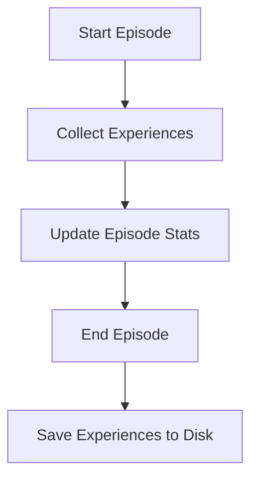

**Diagram sources**
- [experience_collector.py](file://backend/training/experience_collector.py#L75-L162)

**Section sources**
- [experience_collector.py](file://backend/training/experience_collector.py#L49-L240)

## Dependency Analysis
The augmentation system exhibits strong modularity with clear separation of concerns:
- Data augmentation depends on pattern extraction and feature engineering.
- Production data collection feeds both continuous retraining and synthetic augmentation.
- Phase-specific models rely on production logs and synthetic data to maintain balanced training.
- Evaluation ensures quality gates before deployment.

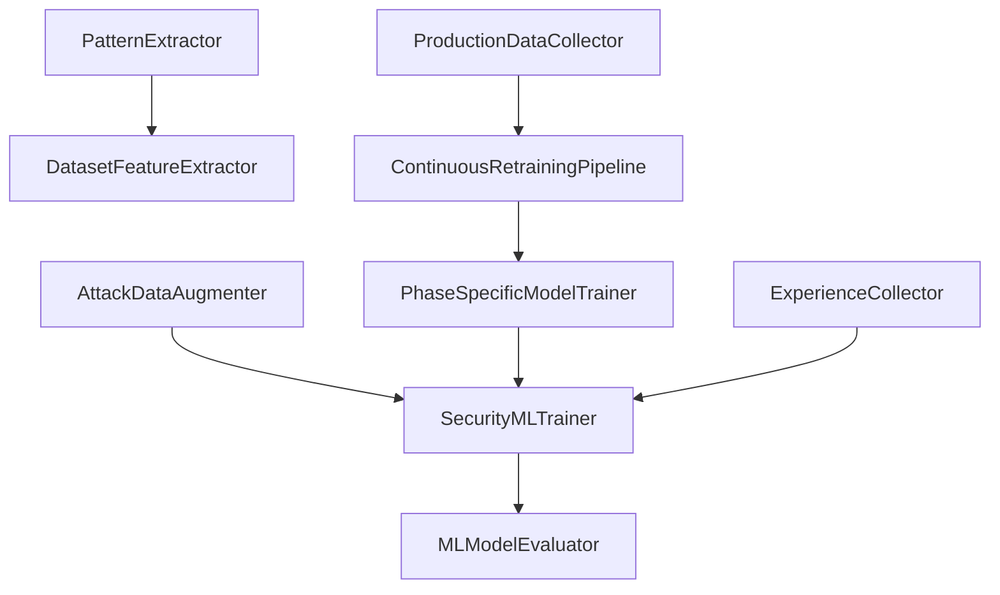

**Diagram sources**
- [data_augmentation.py](file://backend/training/data_augmentation.py#L8-L338)
- [pattern_extractor.py](file://backend/training/pattern_extractor.py#L4-L251)
- [production_data_collector.py](file://backend/training/production_data_collector.py#L14-L280)
- [continuous_retraining.py](file://backend/training/continuous_retraining.py#L27-L345)
- [phase_specific_models.py](file://backend/training/phase_specific_models.py#L15-L543)
- [model_trainer.py](file://backend/training/model_trainer.py#L20-L444)
- [feature_extractor.py](file://backend/training/feature_extractor.py#L7-L246)
- [evaluate_ml_models.py](file://backend/testing/evaluate_ml_models.py#L25-L316)
- [experience_collector.py](file://backend/training/experience_collector.py#L49-L240)

**Section sources**
- [data_augmentation.py](file://backend/training/data_augmentation.py#L8-L338)
- [pattern_extractor.py](file://backend/training/pattern_extractor.py#L4-L251)
- [production_data_collector.py](file://backend/training/production_data_collector.py#L14-L280)
- [continuous_retraining.py](file://backend/training/continuous_retraining.py#L27-L345)
- [phase_specific_models.py](file://backend/training/phase_specific_models.py#L15-L543)
- [model_trainer.py](file://backend/training/model_trainer.py#L20-L444)
- [feature_extractor.py](file://backend/training/feature_extractor.py#L7-L246)
- [evaluate_ml_models.py](file://backend/testing/evaluate_ml_models.py#L25-L316)
- [experience_collector.py](file://backend/training/experience_collector.py#L49-L240)

## Performance Considerations
- Synthetic augmentation reduces overfitting to majority classes by balancing rare attack distributions.
- Buffered production logging minimizes I/O overhead and improves throughput.
- Cross-validation and stratified sampling mitigate class imbalance effects.
- Feature engineering and vectorization ensure efficient model training and inference.
- Continuous retraining with backups prevents model drift and maintains performance.

[No sources needed since this section provides general guidance]

## Troubleshooting Guide
Common issues and resolutions:
- Missing production logs: Verify collector initialization and file permissions.
- Insufficient samples for retraining: Increase production logging volume or adjust thresholds.
- Model evaluation failures: Ensure models are saved with required attributes and compatible versions.
- Feature mismatch errors: Confirm feature extraction aligns with model expectations.
- RL experience serialization: Validate experience dataclasses and JSON serialization.

**Section sources**
- [production_data_collector.py](file://backend/training/production_data_collector.py#L14-L280)
- [continuous_retraining.py](file://backend/training/continuous_retraining.py#L27-L345)
- [evaluate_ml_models.py](file://backend/testing/evaluate_ml_models.py#L25-L316)
- [experience_collector.py](file://backend/training/experience_collector.py#L49-L240)

## Conclusion
The data augmentation system combines production data collection, synthetic payload generation, and continuous retraining to improve model generalization and robustness. By expanding minority classes, creating edge cases, and maintaining dataset balance, the system enhances detection capabilities across diverse attack vectors. Strict evaluation criteria and automated deployment ensure reliable model updates while preserving data authenticity.

[No sources needed since this section summarizes without analyzing specific files]

## Appendices

### Examples of Augmentation Transformations
- XXE payload mutations: case variations, URL encoding, protocol obfuscation, nested entity generation.
- SSRF target mutations: URL encoding, protocol switching, port addition, IPv4/IPv6 variations.
- Deserialization payloads: language-specific gadget templates for Java, Python, PHP, and .NET.

**Section sources**
- [data_augmentation.py](file://backend/training/data_augmentation.py#L16-L216)

### Criteria for Accepting Augmented Data
- Rarity thresholds: classes below a defined count are considered rare and augmented.
- Quality checks: synthetic samples must preserve attack semantics and be labeled consistently.
- Validation: augmented datasets are evaluated using established metrics before deployment.

**Section sources**
- [data_augmentation.py](file://backend/training/data_augmentation.py#L218-L270)
- [evaluate_ml_models.py](file://backend/testing/evaluate_ml_models.py#L35-L259)

### Relationship Between Data Quality and Model Generalization
- High-quality, balanced datasets improve generalization and reduce bias.
- Real-world production logs provide authentic edge cases; synthetic augmentation expands coverage.
- Continuous retraining with backups ensures models adapt to evolving threats while maintaining stability.

**Section sources**
- [continuous_retraining.py](file://backend/training/continuous_retraining.py#L27-L345)
- [ml_training_state.json](file://backend/data/ml_training_state.json#L1-L51)