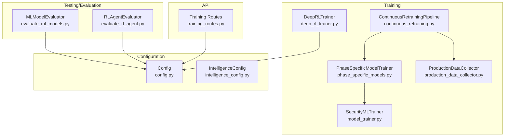
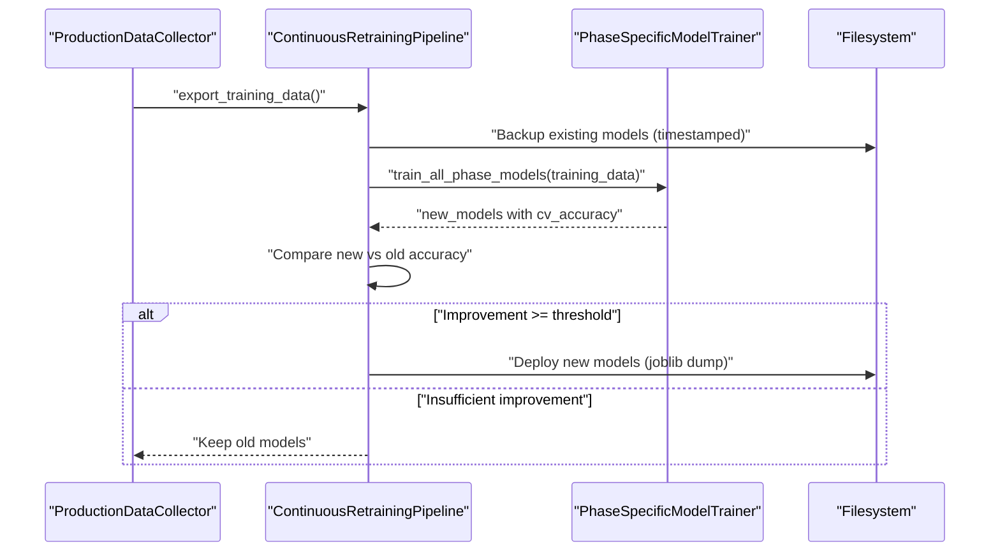
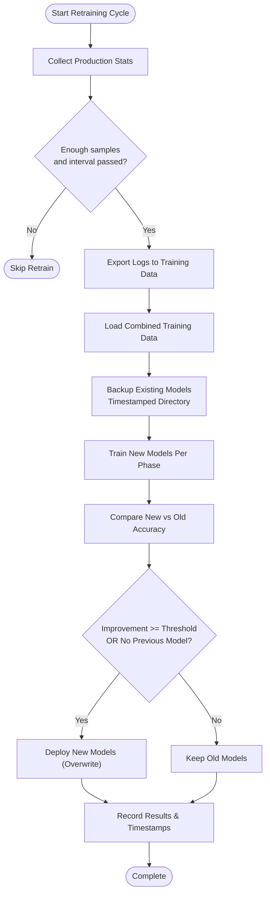
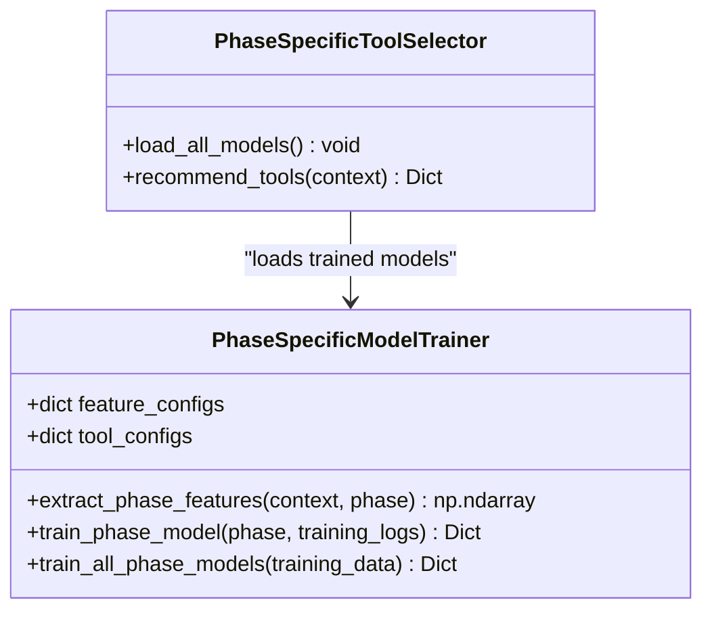
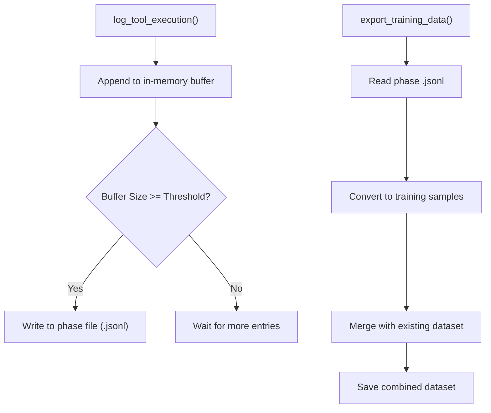
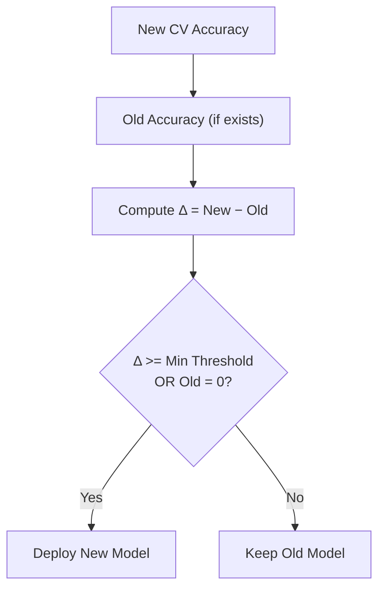
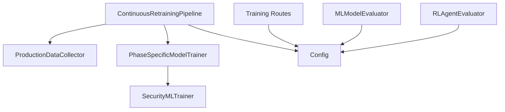

# Model Backup and Deployment

<cite>
**Referenced Files in This Document**
- [continuous_retraining.py](file://backend/training/continuous_retraining.py)
- [phase_specific_models.py](file://backend/training/phase_specific_models.py)
- [production_data_collector.py](file://backend/training/production_data_collector.py)
- [model_trainer.py](file://backend/training/model_trainer.py)
- [deep_rl_trainer.py](file://backend/training/deep_rl_trainer.py)
- [evaluate_ml_models.py](file://backend/testing/evaluate_ml_models.py)
- [evaluate_rl_agent.py](file://backend/testing/evaluate_rl_agent.py)
- [config.py](file://backend/config.py)
- [intelligence_config.py](file://backend/config_pkg/intelligence_config.py)
- [training_routes.py](file://backend/api/training_routes.py)
</cite>

## Table of Contents
1. [Introduction](#introduction)
2. [Project Structure](#project-structure)
3. [Core Components](#core-components)
4. [Architecture Overview](#architecture-overview)
5. [Detailed Component Analysis](#detailed-component-analysis)
6. [Dependency Analysis](#dependency-analysis)
7. [Performance Considerations](#performance-considerations)
8. [Troubleshooting Guide](#troubleshooting-guide)
9. [Conclusion](#conclusion)
10. [Appendices](#appendices)

## Introduction
This document describes the model backup and deployment system designed to safely update machine learning models during continuous learning. It explains how timestamped backups are created, how models are serialized and validated, and how deployment decisions are made based on accuracy improvements. It also covers the file management and storage layout, the decision matrix for replacing models, and integration with the broader training ecosystem. Safety mechanisms to prevent model degradation are highlighted, including validation thresholds and rollback readiness.

## Project Structure
The backup and deployment system spans several modules:
- Continuous retraining orchestrator that monitors production data and triggers retraining
- Phase-specific model trainer that builds separate models per pentesting phase
- Production data collector that gathers real-world execution logs
- Model evaluators that validate model quality and integrity
- Configuration modules that define model paths and environment settings
- API endpoints that expose model inventory and status

**Diagram sources**
- [continuous_retraining.py](file://backend/training/continuous_retraining.py#L27-L305)
- [phase_specific_models.py](file://backend/training/phase_specific_models.py#L15-L404)
- [production_data_collector.py](file://backend/training/production_data_collector.py#L14-L280)
- [model_trainer.py](file://backend/training/model_trainer.py#L20-L444)
- [deep_rl_trainer.py](file://backend/training/deep_rl_trainer.py#L27-L547)
- [evaluate_ml_models.py](file://backend/testing/evaluate_ml_models.py#L25-L316)
- [evaluate_rl_agent.py](file://backend/testing/evaluate_rl_agent.py#L18-L223)
- [config.py](file://backend/config.py#L6-L115)
- [intelligence_config.py](file://backend/config_pkg/intelligence_config.py#L5-L63)
- [training_routes.py](file://backend/api/training_routes.py#L62-L89)

**Section sources**
- [continuous_retraining.py](file://backend/training/continuous_retraining.py#L27-L305)
- [phase_specific_models.py](file://backend/training/phase_specific_models.py#L15-L404)
- [production_data_collector.py](file://backend/training/production_data_collector.py#L14-L280)
- [model_trainer.py](file://backend/training/model_trainer.py#L20-L444)
- [deep_rl_trainer.py](file://backend/training/deep_rl_trainer.py#L27-L547)
- [evaluate_ml_models.py](file://backend/testing/evaluate_ml_models.py#L25-L316)
- [evaluate_rl_agent.py](file://backend/testing/evaluate_rl_agent.py#L18-L223)
- [config.py](file://backend/config.py#L6-L115)
- [intelligence_config.py](file://backend/config_pkg/intelligence_config.py#L5-L63)
- [training_routes.py](file://backend/api/training_routes.py#L62-L89)

## Core Components
- ContinuousRetrainingPipeline: Monitors production data, decides when to retrain, backs up existing models, trains new models, validates accuracy, and deploys improved models.
- PhaseSpecificModelTrainer: Builds separate models per pentesting phase using phase-specific features and tools.
- ProductionDataCollector: Gathers real-world tool execution logs and exports them into training-ready datasets.
- SecurityMLTrainer: Provides generic model training utilities and persistence for ML models.
- DeepRLTrainer: Manages reinforcement learning training checkpoints and summaries.
- Evaluators: Validate ML and RL models against predefined success criteria.
- Configuration: Defines model paths, environment variables, and feature/tool sets.

Key responsibilities:
- Backup creation with timestamped directories
- Model serialization using joblib
- Accuracy-based deployment decision matrix
- Validation of model integrity and performance
- API exposure of model inventory

**Section sources**
- [continuous_retraining.py](file://backend/training/continuous_retraining.py#L27-L305)
- [phase_specific_models.py](file://backend/training/phase_specific_models.py#L15-L404)
- [production_data_collector.py](file://backend/training/production_data_collector.py#L14-L280)
- [model_trainer.py](file://backend/training/model_trainer.py#L20-L444)
- [deep_rl_trainer.py](file://backend/training/deep_rl_trainer.py#L27-L547)
- [evaluate_ml_models.py](file://backend/testing/evaluate_ml_models.py#L25-L316)
- [evaluate_rl_agent.py](file://backend/testing/evaluate_rl_agent.py#L18-L223)
- [config.py](file://backend/config.py#L6-L115)

## Architecture Overview
The system follows a continuous learning loop:
- ProductionDataCollector captures real execution logs
- Export converts logs into training datasets per phase
- PhaseSpecificModelTrainer trains models per phase
- ContinuousRetrainingPipeline compares new vs. old model accuracy
- On sufficient improvement, deploys new models; otherwise keeps old ones
- Backups are stored under timestamped directories for potential rollback

**Diagram sources**
- [production_data_collector.py](file://backend/training/production_data_collector.py#L209-L268)
- [continuous_retraining.py](file://backend/training/continuous_retraining.py#L128-L212)
- [phase_specific_models.py](file://backend/training/phase_specific_models.py#L360-L404)

## Detailed Component Analysis

### Continuous Retraining Pipeline
The pipeline coordinates the entire backup-and-deploy cycle:
- Checks production data volume and recency
- Exports production logs to training datasets
- Backs up existing models into timestamped directories
- Trains new models per phase
- Compares new vs. old model accuracy
- Deploys improved models atomically (overwrite)
- Records retraining history

**Diagram sources**
- [continuous_retraining.py](file://backend/training/continuous_retraining.py#L66-L212)

**Section sources**
- [continuous_retraining.py](file://backend/training/continuous_retraining.py#L66-L212)

### Phase-Specific Model Trainer
Trains separate models for each pentesting phase using phase-specific features and tools. It evaluates models with cross-validation and persists them to disk.

**Diagram sources**
- [phase_specific_models.py](file://backend/training/phase_specific_models.py#L15-L404)

**Section sources**
- [phase_specific_models.py](file://backend/training/phase_specific_models.py#L15-L404)

### Production Data Collector
Collects tool execution events, phase transitions, and scan completions. Buffers entries and flushes to JSON Lines files per phase. Exports to training-ready datasets by merging with existing training data.

**Diagram sources**
- [production_data_collector.py](file://backend/training/production_data_collector.py#L39-L268)

**Section sources**
- [production_data_collector.py](file://backend/training/production_data_collector.py#L39-L268)

### Model Serialization and Persistence
- Models are serialized using joblib with filenames per phase (e.g., tool_recommender_{phase}.pkl).
- Backup directories are timestamped and created before retraining.
- The system supports loading models with warnings handling for version mismatches.

**Section sources**
- [continuous_retraining.py](file://backend/training/continuous_retraining.py#L237-L279)
- [phase_specific_models.py](file://backend/training/phase_specific_models.py#L389-L393)
- [phase_specific_models.py](file://backend/training/phase_specific_models.py#L440-L448)

### Deployment Validation and Decision Matrix
Deployment occurs when:
- Improvement in cross-validation accuracy meets or exceeds a minimum threshold, OR
- No previous model exists for that phase.

Accuracy comparison:
- New accuracy is taken from the trained model’s cross-validation score.
- Old accuracy is retrieved from the existing model’s persisted metrics.

Decision logic:
- If improvement condition holds: deploy new model (overwrite).
- Otherwise: keep old model.

**Diagram sources**
- [continuous_retraining.py](file://backend/training/continuous_retraining.py#L165-L191)

**Section sources**
- [continuous_retraining.py](file://backend/training/continuous_retraining.py#L165-L191)

### File Management and Storage Organization
- Models are stored under a central models directory.
- Backup storage uses timestamped subdirectories to preserve previous versions.
- Training datasets are organized per phase in a dedicated training logs directory.
- RL training checkpoints and summaries are managed separately with metadata.

**Section sources**
- [continuous_retraining.py](file://backend/training/continuous_retraining.py#L49-L50)
- [continuous_retraining.py](file://backend/training/continuous_retraining.py#L237-L254)
- [production_data_collector.py](file://backend/training/production_data_collector.py#L29-L35)
- [deep_rl_trainer.py](file://backend/training/deep_rl_trainer.py#L440-L460)

### Atomic Deployment Operations
- Deployment is performed by writing the new model file to the same path as the old model, effectively overwriting it atomically at the filesystem level.
- Backups are created prior to overwrite, enabling rollback to the timestamped backup directory.

**Section sources**
- [continuous_retraining.py](file://backend/training/continuous_retraining.py#L271-L279)
- [continuous_retraining.py](file://backend/training/continuous_retraining.py#L237-L254)

### Examples and Scenarios
- Successful deployment: New model accuracy exceeds the minimum improvement threshold compared to the old model; the new model is saved and replaces the old one; the pipeline records the deployment.
- Failed deployment: New model accuracy does not meet the threshold; the pipeline keeps the old model and logs the decision.
- Rollback scenario: If a deployment causes downstream issues, administrators can restore from the timestamped backup directory created before the overwrite.

Note: The repository does not include explicit test fixtures for these scenarios; the above describes the intended behavior based on the code logic.

**Section sources**
- [continuous_retraining.py](file://backend/training/continuous_retraining.py#L177-L191)
- [continuous_retraining.py](file://backend/training/continuous_retraining.py#L237-L279)

### Integration with the Broader Training Ecosystem
- Configuration defines model paths and environment variables used across training and inference.
- API routes expose model inventory and status for operational visibility.
- Evaluators provide standardized checks for ML and RL models to ensure readiness for production.

**Section sources**
- [config.py](file://backend/config.py#L38-L39)
- [training_routes.py](file://backend/api/training_routes.py#L62-L89)
- [evaluate_ml_models.py](file://backend/testing/evaluate_ml_models.py#L25-L316)
- [evaluate_rl_agent.py](file://backend/testing/evaluate_rl_agent.py#L18-L223)

## Dependency Analysis
The following diagram highlights key dependencies among components involved in backup and deployment:

**Diagram sources**
- [continuous_retraining.py](file://backend/training/continuous_retraining.py#L32-L37)
- [phase_specific_models.py](file://backend/training/phase_specific_models.py#L20-L24)
- [model_trainer.py](file://backend/training/model_trainer.py#L20-L26)
- [config.py](file://backend/config.py#L6-L115)
- [training_routes.py](file://backend/api/training_routes.py#L62-L89)
- [evaluate_ml_models.py](file://backend/testing/evaluate_ml_models.py#L25-L31)
- [evaluate_rl_agent.py](file://backend/testing/evaluate_rl_agent.py#L18-L23)

**Section sources**
- [continuous_retraining.py](file://backend/training/continuous_retraining.py#L32-L37)
- [phase_specific_models.py](file://backend/training/phase_specific_models.py#L20-L24)
- [model_trainer.py](file://backend/training/model_trainer.py#L20-L26)
- [config.py](file://backend/config.py#L6-L115)
- [training_routes.py](file://backend/api/training_routes.py#L62-L89)
- [evaluate_ml_models.py](file://backend/testing/evaluate_ml_models.py#L25-L31)
- [evaluate_rl_agent.py](file://backend/testing/evaluate_rl_agent.py#L18-L23)

## Performance Considerations
- Batch writes: ProductionDataCollector uses an in-memory buffer to reduce I/O overhead and flushes periodically.
- Cross-validation: Phase-specific models use cross-validation to estimate generalization performance efficiently.
- Incremental retraining: Retraining is gated by thresholds to avoid unnecessary compute work.
- Model persistence: joblib serialization is efficient for scikit-learn models; consider compression or incremental updates for very large models.

[No sources needed since this section provides general guidance]

## Troubleshooting Guide
Common issues and remedies:
- Sklearn version mismatch warnings: When loading models, sklearn may warn about version mismatches. Use compatible environments or re-train models to align versions.
- Missing model files: If a model file is not found for a phase, runtime tool selection falls back to non-model-based strategies.
- Insufficient training samples: Phase-specific training warns when fewer than recommended samples are available; collect more production data.
- Scheduler not triggering: Ensure the auto-schedule setting is enabled and the scheduled time is valid.

**Section sources**
- [phase_specific_models.py](file://backend/training/phase_specific_models.py#L425-L426)
- [phase_specific_models.py](file://backend/training/phase_specific_models.py#L444-L447)
- [phase_specific_models.py](file://backend/training/phase_specific_models.py#L274-L276)
- [continuous_retraining.py](file://backend/training/continuous_retraining.py#L281-L301)

## Conclusion
The backup and deployment system provides a robust framework for continuous model improvement. By capturing production data, backing up existing models, validating improvements, and deploying only when beneficial, it minimizes risk and maintains system stability. The timestamped backup strategy and atomic overwrite ensure safe rollbacks, while configuration-driven paths and evaluators support integration with the broader training ecosystem.

[No sources needed since this section summarizes without analyzing specific files]

## Appendices

### Model Versioning and Compatibility
- Versioning: Backups are timestamped to reflect model versions at deployment time.
- Compatibility: The system accounts for sklearn version differences by catching warnings and attempting to load models with filtered warnings. Re-training with aligned versions is recommended for long-term stability.

**Section sources**
- [continuous_retraining.py](file://backend/training/continuous_retraining.py#L237-L254)
- [phase_specific_models.py](file://backend/training/phase_specific_models.py#L444-L447)

### Safety Mechanisms Preventing Degradation
- Minimum improvement threshold: Ensures only beneficial updates are deployed.
- Cross-validation accuracy: Used to compare new versus old model performance.
- Backup preservation: Maintains previous model versions for immediate rollback.
- Evaluators: Provide standardized checks for ML and RL models before production readiness.

**Section sources**
- [continuous_retraining.py](file://backend/training/continuous_retraining.py#L55-L64)
- [continuous_retraining.py](file://backend/training/continuous_retraining.py#L165-L191)
- [evaluate_ml_models.py](file://backend/testing/evaluate_ml_models.py#L35-L109)
- [evaluate_rl_agent.py](file://backend/testing/evaluate_rl_agent.py#L105-L156)