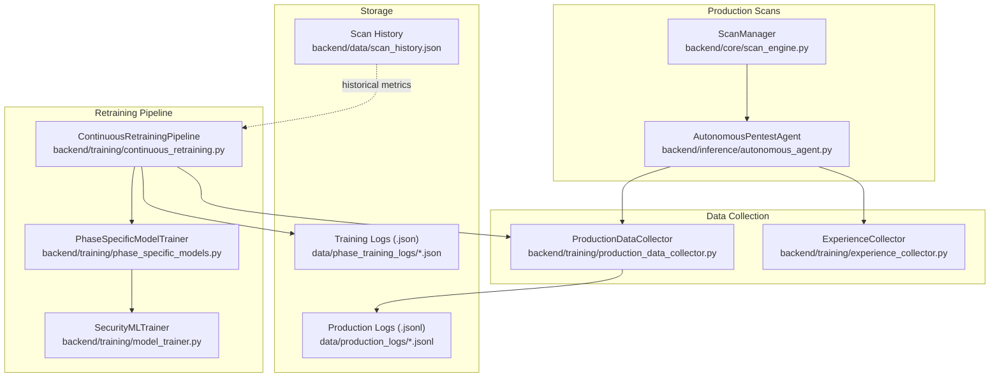
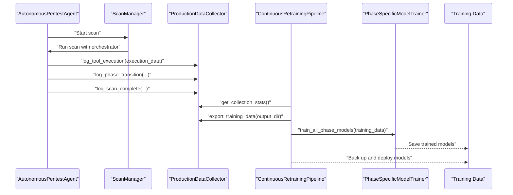
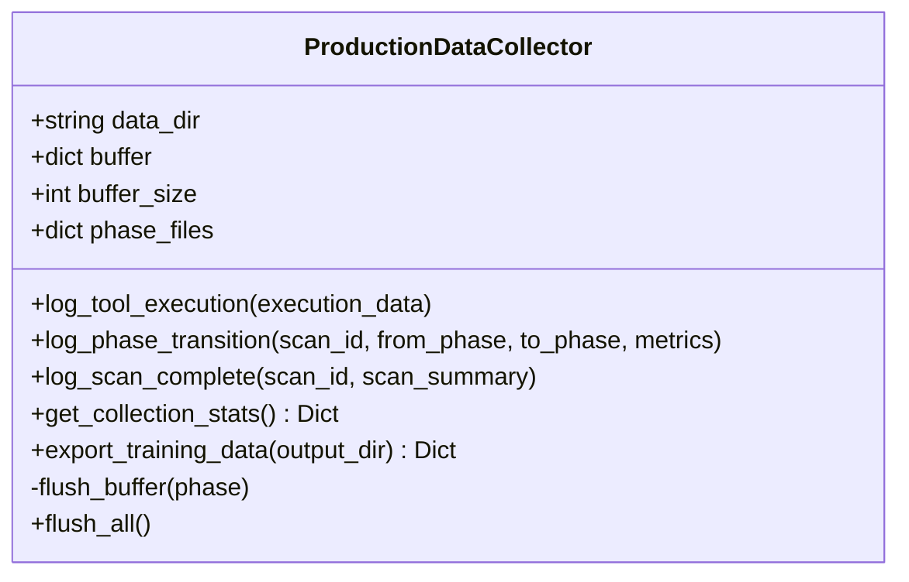
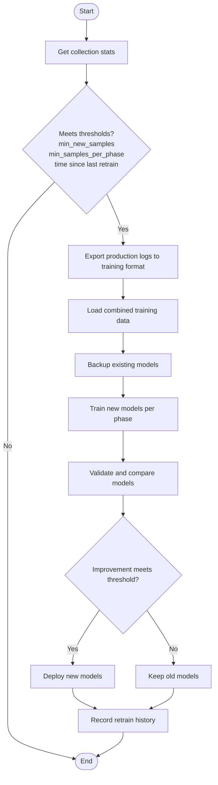
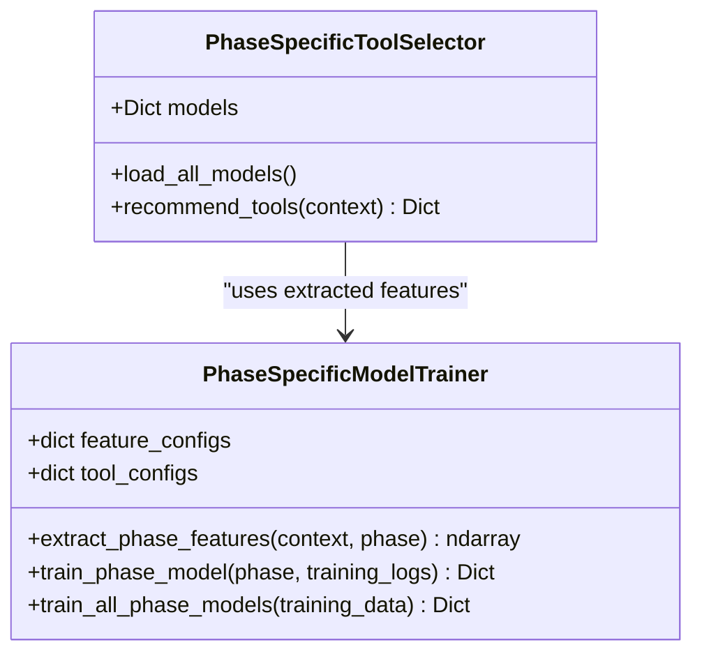
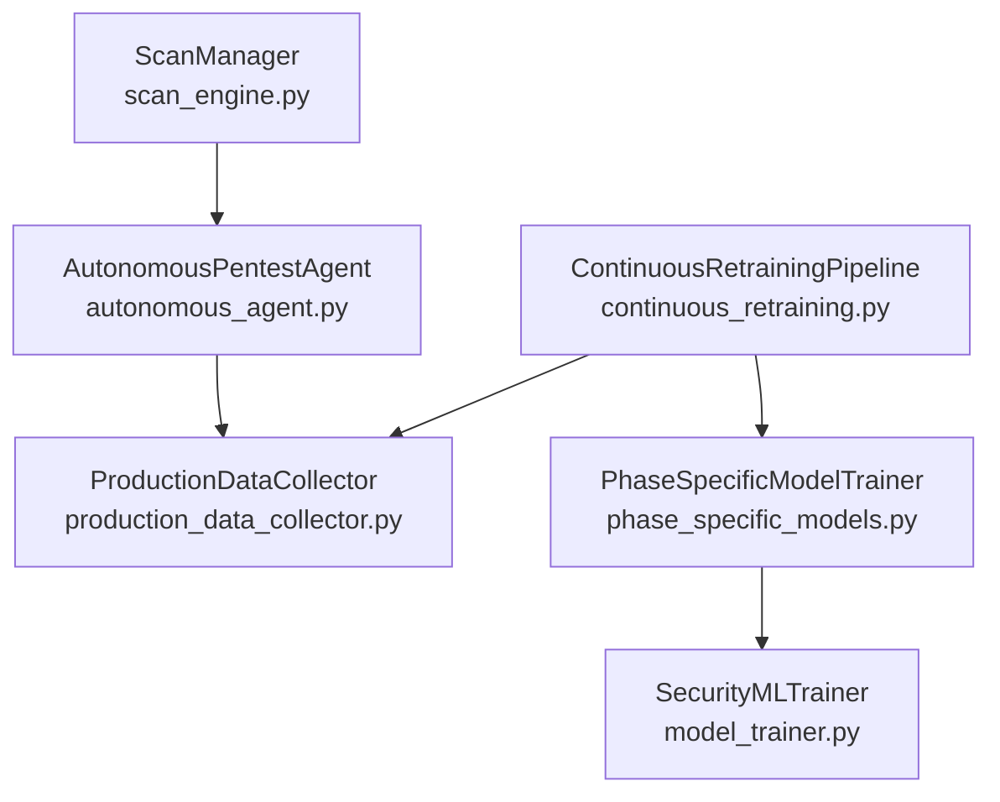

# Production Data Collection

<cite>
**Referenced Files in This Document**
- [production_data_collector.py](file://backend/training/production_data_collector.py)
- [continuous_retraining.py](file://backend/training/continuous_retraining.py)
- [phase_specific_models.py](file://backend/training/phase_specific_models.py)
- [model_trainer.py](file://backend/training/model_trainer.py)
- [experience_collector.py](file://backend/training/experience_collector.py)
- [scan_engine.py](file://backend/core/scan_engine.py)
- [autonomous_agent.py](file://backend/inference/autonomous_agent.py)
- [scan_history.json](file://backend/data/scan_history.json)
- [exploitation_prod.jsonl](file://backend/testing/data/test_production_logs/exploitation_prod.jsonl)
- [scanning_prod.jsonl](file://backend/testing/data/test_production_logs/scanning_prod.jsonl)
- [reconnaissance_prod.jsonl](file://backend/testing/data/test_production_logs/reconnaissance_prod.jsonl)
- [app.py](file://backend/app.py)
</cite>

## Table of Contents
1. [Introduction](#introduction)
2. [Project Structure](#project-structure)
3. [Core Components](#core-components)
4. [Architecture Overview](#architecture-overview)
5. [Detailed Component Analysis](#detailed-component-analysis)
6. [Dependency Analysis](#dependency-analysis)
7. [Performance Considerations](#performance-considerations)
8. [Troubleshooting Guide](#troubleshooting-guide)
9. [Conclusion](#conclusion)

## Introduction
This document describes the production data collection system that gathers real-world scan data to continuously improve the platform's models. It explains how scan logs are captured, processed, and stored; how collection statistics are tracked; how data quality is validated; and how the system integrates with the production environment. It also details the data export processes that transform production logs into training-ready formats, provides examples of collected data formats, outlines collection triggers, and clarifies the relationship between production scans and training datasets. Privacy considerations, sampling strategies, and the balance between data volume and quality are addressed.

## Project Structure
The production data collection system spans several modules:
- Data capture and buffering: ProductionDataCollector
- Retraining pipeline: ContinuousRetrainingPipeline
- Phase-specific model training: PhaseSpecificModelTrainer
- Model training utilities: SecurityMLTrainer
- Experience collection for RL: ExperienceCollector
- Scan orchestration: ScanManager and AutonomousPentestAgent
- Example production logs: JSON Lines files
- Application integration: Flask app with shared state

**Diagram sources**
- [production_data_collector.py](file://backend/training/production_data_collector.py#L14-L37)
- [continuous_retraining.py](file://backend/training/continuous_retraining.py#L27-L42)
- [phase_specific_models.py](file://backend/training/phase_specific_models.py#L15-L24)
- [model_trainer.py](file://backend/training/model_trainer.py#L20-L27)
- [experience_collector.py](file://backend/training/experience_collector.py#L49-L73)
- [scan_engine.py](file://backend/core/scan_engine.py#L26-L42)
- [autonomous_agent.py](file://backend/inference/autonomous_agent.py#L50-L77)
- [scan_history.json](file://backend/data/scan_history.json#L1-L79)

**Section sources**
- [production_data_collector.py](file://backend/training/production_data_collector.py#L14-L37)
- [continuous_retraining.py](file://backend/training/continuous_retraining.py#L27-L42)
- [phase_specific_models.py](file://backend/training/phase_specific_models.py#L15-L24)
- [model_trainer.py](file://backend/training/model_trainer.py#L20-L27)
- [experience_collector.py](file://backend/training/experience_collector.py#L49-L73)
- [scan_engine.py](file://backend/core/scan_engine.py#L26-L42)
- [autonomous_agent.py](file://backend/inference/autonomous_agent.py#L50-L77)
- [scan_history.json](file://backend/data/scan_history.json#L1-L79)

## Core Components
- ProductionDataCollector: Captures tool execution events, phase transitions, and scan completions; maintains in-memory buffers and flushes to JSON Lines files per phase; exports production logs to training-ready format.
- ContinuousRetrainingPipeline: Monitors production data volume and quality, triggers retraining when thresholds are met, backs up models, trains new models, validates improvements, and deploys better models.
- PhaseSpecificModelTrainer: Trains separate models per pentesting phase using phase-specific features and tools; evaluates models via cross-validation; saves models for runtime use.
- SecurityMLTrainer: Provides ML model training utilities for various security tasks; used by the retraining pipeline to train models when needed.
- ExperienceCollector: Collects RL experiences during training episodes for offline RL training.
- ScanManager and AutonomousPentestAgent: Orchestrate production scans, emit events, and drive tool execution that generates production logs.

**Section sources**
- [production_data_collector.py](file://backend/training/production_data_collector.py#L14-L37)
- [continuous_retraining.py](file://backend/training/continuous_retraining.py#L27-L42)
- [phase_specific_models.py](file://backend/training/phase_specific_models.py#L15-L24)
- [model_trainer.py](file://backend/training/model_trainer.py#L20-L27)
- [experience_collector.py](file://backend/training/experience_collector.py#L49-L73)
- [scan_engine.py](file://backend/core/scan_engine.py#L26-L42)
- [autonomous_agent.py](file://backend/inference/autonomous_agent.py#L50-L77)

## Architecture Overview
The production data collection system operates as follows:
- During production scans, the AutonomousPentestAgent executes tools and emits events.
- The ScanManager coordinates scan lifecycle and emits phase transitions and completion events.
- The ProductionDataCollector captures tool execution events, phase transitions, and scan completions into JSON Lines files organized by phase.
- The ContinuousRetrainingPipeline periodically checks collection statistics, exports production logs to training format, loads combined training data, backs up existing models, trains new models, validates improvements, and deploys better models.

**Diagram sources**
- [autonomous_agent.py](file://backend/inference/autonomous_agent.py#L133-L160)
- [scan_engine.py](file://backend/core/scan_engine.py#L82-L148)
- [production_data_collector.py](file://backend/training/production_data_collector.py#L39-L84)
- [continuous_retraining.py](file://backend/training/continuous_retraining.py#L66-L102)
- [phase_specific_models.py](file://backend/training/phase_specific_models.py#L360-L404)

## Detailed Component Analysis

### Production Data Collector
The ProductionDataCollector is responsible for capturing tool execution events, phase transitions, and scan completions from production scans. It:
- Buffers events in memory per phase and flushes to disk when the buffer reaches a configured size.
- Validates required fields before logging.
- Adds metadata such as timestamp and version.
- Exports production logs to training-ready JSON files by extracting context, tool, success, vulnerabilities found, and execution time.

Key behaviors:
- Thread-safe buffering with a lock.
- Per-phase JSON Lines files for efficient streaming and appending.
- Export merges production logs with existing training data for each phase.

**Diagram sources**
- [production_data_collector.py](file://backend/training/production_data_collector.py#L14-L37)
- [production_data_collector.py](file://backend/training/production_data_collector.py#L39-L84)
- [production_data_collector.py](file://backend/training/production_data_collector.py#L184-L207)
- [production_data_collector.py](file://backend/training/production_data_collector.py#L209-L268)

**Section sources**
- [production_data_collector.py](file://backend/training/production_data_collector.py#L14-L37)
- [production_data_collector.py](file://backend/training/production_data_collector.py#L39-L84)
- [production_data_collector.py](file://backend/training/production_data_collector.py#L184-L207)
- [production_data_collector.py](file://backend/training/production_data_collector.py#L209-L268)

### Continuous Retraining Pipeline
The ContinuousRetrainingPipeline automates the process of detecting when retraining is needed and executing the full pipeline:
- Checks collection statistics to determine if minimum samples and time thresholds are met.
- Exports production logs to training format.
- Loads combined training data (production + existing).
- Backs up existing models.
- Trains new models using PhaseSpecificModelTrainer.
- Validates improvements against existing models and deploys better ones.
- Maintains retraining history and supports scheduling.

**Diagram sources**
- [continuous_retraining.py](file://backend/training/continuous_retraining.py#L66-L102)
- [continuous_retraining.py](file://backend/training/continuous_retraining.py#L128-L212)
- [continuous_retraining.py](file://backend/training/continuous_retraining.py#L214-L235)
- [continuous_retraining.py](file://backend/training/continuous_retraining.py#L237-L279)

**Section sources**
- [continuous_retraining.py](file://backend/training/continuous_retraining.py#L27-L64)
- [continuous_retraining.py](file://backend/training/continuous_retraining.py#L66-L102)
- [continuous_retraining.py](file://backend/training/continuous_retraining.py#L128-L212)
- [continuous_retraining.py](file://backend/training/continuous_retraining.py#L214-L279)

### Phase-Specific Model Trainer
The PhaseSpecificModelTrainer trains separate models for each pentesting phase:
- Defines phase-specific feature sets and available tools.
- Extracts features from context dictionaries and encodes categorical and normalized values.
- Trains Random Forest and Gradient Boosting classifiers, selects the best via cross-validation, and saves models with metadata.
- Provides a runtime tool selector that recommends tools based on context and model probabilities.

**Diagram sources**
- [phase_specific_models.py](file://backend/training/phase_specific_models.py#L15-L24)
- [phase_specific_models.py](file://backend/training/phase_specific_models.py#L184-L251)
- [phase_specific_models.py](file://backend/training/phase_specific_models.py#L252-L358)
- [phase_specific_models.py](file://backend/training/phase_specific_models.py#L407-L414)
- [phase_specific_models.py](file://backend/training/phase_specific_models.py#L468-L542)

**Section sources**
- [phase_specific_models.py](file://backend/training/phase_specific_models.py#L15-L24)
- [phase_specific_models.py](file://backend/training/phase_specific_models.py#L184-L251)
- [phase_specific_models.py](file://backend/training/phase_specific_models.py#L252-L358)
- [phase_specific_models.py](file://backend/training/phase_specific_models.py#L407-L414)
- [phase_specific_models.py](file://backend/training/phase_specific_models.py#L468-L542)

### Data Export and Training Data Formats
The ProductionDataCollector exports production logs to training-ready JSON files:
- Reads each phase's JSON Lines file.
- Converts each entry to a training sample containing context, tool, success flag, vulnerabilities found, and execution time.
- Merges with existing training data for that phase and writes back to JSON.

Example training sample structure:
- context: dictionary with phase and scan state
- tool: string identifier
- success: boolean
- vulns_found: integer
- execution_time: float

**Section sources**
- [production_data_collector.py](file://backend/training/production_data_collector.py#L209-L268)
- [exploitation_prod.jsonl](file://backend/testing/data/test_production_logs/exploitation_prod.jsonl#L1-L4)
- [scanning_prod.jsonl](file://backend/testing/data/test_production_logs/scanning_prod.jsonl#L1-L4)
- [reconnaissance_prod.jsonl](file://backend/testing/data/test_production_logs/reconnaissance_prod.jsonl#L1-L4)

### Collection Triggers and Statistics Tracking
Collection triggers:
- Tool execution events are logged immediately upon completion of tool runs.
- Phase transitions and scan completions are logged to capture higher-level scan dynamics.
- Periodic checks by the ContinuousRetrainingPipeline determine when to retrain based on:
  - Minimum number of new samples per phase.
  - Minimum number of samples per phase.
  - Time elapsed since the last retrain for each phase.

Statistics tracking:
- ProductionDataCollector.get_collection_stats() counts entries per phase and buffer sizes.
- Historical scan durations are available in scan_history.json for trend analysis.

**Section sources**
- [production_data_collector.py](file://backend/training/production_data_collector.py#L184-L207)
- [continuous_retraining.py](file://backend/training/continuous_retraining.py#L104-L126)
- [scan_history.json](file://backend/data/scan_history.json#L1-L79)

### Integration with Production Environment
Integration points:
- ScanManager.start_scan() initializes and runs scans in background threads, emitting WebSocket events for phase transitions and completion.
- AutonomousPentestAgent orchestrates tool execution and interacts with the tool manager and knowledge base.
- Shared state (active_scans) is protected by a lock to prevent race conditions.
- Logging includes correlation IDs for traceability across distributed components.

**Section sources**
- [scan_engine.py](file://backend/core/scan_engine.py#L82-L148)
- [scan_engine.py](file://backend/core/scan_engine.py#L150-L310)
- [scan_engine.py](file://backend/core/scan_engine.py#L311-L344)
- [autonomous_agent.py](file://backend/inference/autonomous_agent.py#L133-L160)
- [app.py](file://backend/app.py#L168-L171)

## Dependency Analysis
The following diagram shows key dependencies among components involved in production data collection and retraining:

**Diagram sources**
- [production_data_collector.py](file://backend/training/production_data_collector.py#L14-L37)
- [continuous_retraining.py](file://backend/training/continuous_retraining.py#L27-L42)
- [phase_specific_models.py](file://backend/training/phase_specific_models.py#L15-L24)
- [model_trainer.py](file://backend/training/model_trainer.py#L20-L27)
- [scan_engine.py](file://backend/core/scan_engine.py#L26-L42)
- [autonomous_agent.py](file://backend/inference/autonomous_agent.py#L50-L77)

**Section sources**
- [production_data_collector.py](file://backend/training/production_data_collector.py#L14-L37)
- [continuous_retraining.py](file://backend/training/continuous_retraining.py#L27-L42)
- [phase_specific_models.py](file://backend/training/phase_specific_models.py#L15-L24)
- [model_trainer.py](file://backend/training/model_trainer.py#L20-L27)
- [scan_engine.py](file://backend/core/scan_engine.py#L26-L42)
- [autonomous_agent.py](file://backend/inference/autonomous_agent.py#L50-L77)

## Performance Considerations
- Buffering and batching: ProductionDataCollector uses an in-memory buffer per phase with a configurable size to reduce I/O overhead. The buffer is flushed when full or explicitly requested.
- Asynchronous retraining: The ContinuousRetrainingPipeline can be scheduled to run at fixed intervals, avoiding interference with ongoing scans.
- Cross-validation: PhaseSpecificModelTrainer uses cross-validation to estimate model performance without requiring a separate validation split, reducing data usage.
- Feature encoding: Phase-specific feature extraction ensures models only use relevant features, improving training efficiency and interpretability.

[No sources needed since this section provides general guidance]

## Troubleshooting Guide
Common issues and resolutions:
- Missing required fields in execution data: The collector validates required fields and logs errors; ensure execution_data includes scan_id, phase, tool, and context.
- JSON Lines parsing errors: The export process skips malformed lines; verify production logs are valid JSON Lines.
- Model loading failures: Phase-specific models are loaded from disk with error handling; check model files and sklearn compatibility.
- Race conditions in shared state: The application uses a threading lock for active_scans to prevent concurrent modifications.
- WebSocket emissions: ScanManager emits events asynchronously; failures are logged but do not block scan execution.

**Section sources**
- [production_data_collector.py](file://backend/training/production_data_collector.py#L60-L64)
- [production_data_collector.py](file://backend/training/production_data_collector.py#L242-L243)
- [phase_specific_models.py](file://backend/training/phase_specific_models.py#L456-L458)
- [app.py](file://backend/app.py#L168-L171)
- [scan_engine.py](file://backend/core/scan_engine.py#L314-L329)

## Conclusion
The production data collection system provides a robust mechanism for capturing real-world scan data, exporting it to training-ready formats, and continuously improving models through automated retraining. By buffering events efficiently, validating data quality, and integrating tightly with the production scan orchestration, the system balances data volume with model performance. The phase-specific approach ensures that models remain accurate and relevant as attack surfaces and techniques evolve.