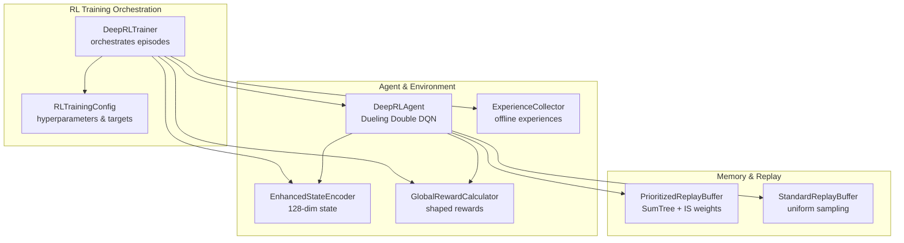
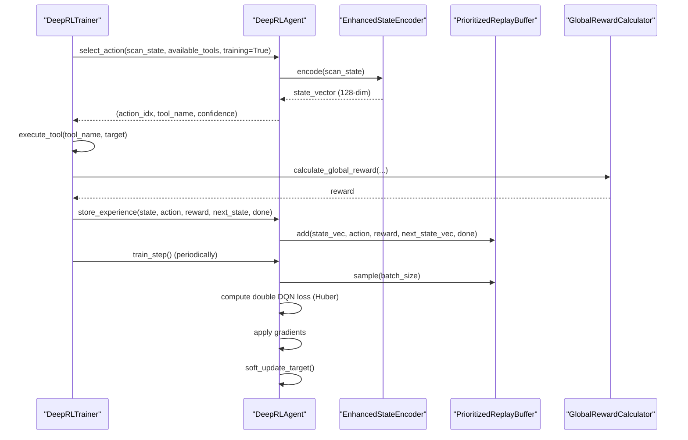
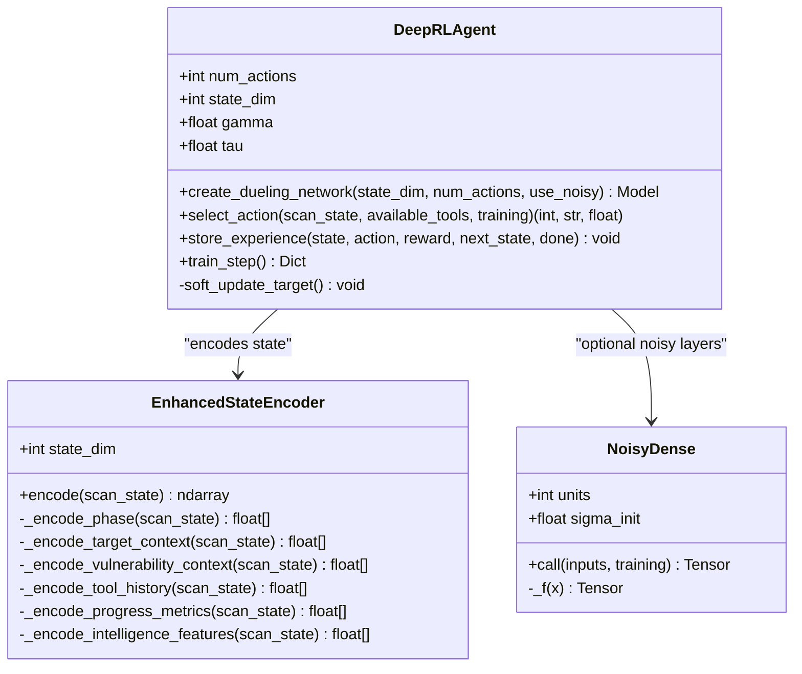
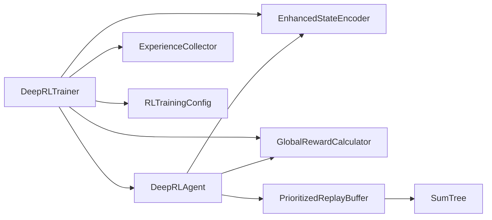

# Deep Reinforcement Learning Implementation

<cite>
**Referenced Files in This Document**
- [deep_rl_agent.py](file://backend/training/deep_rl_agent.py)
- [prioritized_replay.py](file://backend/training/prioritized_replay.py)
- [enhanced_state_encoder.py](file://backend/training/enhanced_state_encoder.py)
- [reward_calculator.py](file://backend/training/reward_calculator.py)
- [rl_training_config.py](file://backend/training/rl_training_config.py)
- [deep_rl_trainer.py](file://backend/training/deep_rl_trainer.py)
- [experience_collector.py](file://backend/training/experience_collector.py)
- [rl_state.py](file://backend/training/rl_state.py)
</cite>

## Table of Contents
1. [Introduction](#introduction)
2. [Project Structure](#project-structure)
3. [Core Components](#core-components)
4. [Architecture Overview](#architecture-overview)
5. [Detailed Component Analysis](#detailed-component-analysis)
6. [Dependency Analysis](#dependency-analysis)
7. [Performance Considerations](#performance-considerations)
8. [Troubleshooting Guide](#troubleshooting-guide)
9. [Conclusion](#conclusion)

## Introduction
This document explains the deep reinforcement learning implementation in the Optimus project, focusing on the Dueling Double DQN architecture with Prioritized Experience Replay (PER). It covers the neural network design, noisy networks for exploration, the dual-stream architecture separating value and advantage estimation, the double DQN mechanism to reduce overestimation bias, reward calculation, experience storage and retrieval, and soft target network updates. It also documents the relationship between state representation and action selection, common training issues and their solutions, and performance optimization techniques for the RL agent.

## Project Structure
The RL implementation is organized around a central agent, a replay buffer with PER, a state encoder, a reward calculator, and a training orchestrator. The agent encapsulates the DQN components, while the trainer coordinates episodes, tool execution, and experience collection.

**Diagram sources**
- [deep_rl_trainer.py](file://backend/training/deep_rl_trainer.py#L27-L122)
- [deep_rl_agent.py](file://backend/training/deep_rl_agent.py#L187-L299)
- [enhanced_state_encoder.py](file://backend/training/enhanced_state_encoder.py#L23-L74)
- [prioritized_replay.py](file://backend/training/prioritized_replay.py#L176-L376)
- [rl_training_config.py](file://backend/training/rl_training_config.py#L31-L142)

**Section sources**
- [deep_rl_trainer.py](file://backend/training/deep_rl_trainer.py#L27-L122)
- [deep_rl_agent.py](file://backend/training/deep_rl_agent.py#L187-L299)
- [enhanced_state_encoder.py](file://backend/training/enhanced_state_encoder.py#L23-L74)
- [prioritized_replay.py](file://backend/training/prioritized_replay.py#L176-L376)
- [rl_training_config.py](file://backend/training/rl_training_config.py#L31-L142)

## Core Components
- DeepRLAgent: Implements the Dueling Double DQN with optional noisy networks, PER, and soft target updates. It exposes action selection, experience storage, and training step logic.
- PrioritizedReplayBuffer: Implements a SumTree-based PER buffer with importance-sampling weights and beta annealing.
- EnhancedStateEncoder: Produces a 128-dimensional state vector capturing phase, target context, vulnerability context, tool history, progress metrics, and intelligence features.
- GlobalRewardCalculator: Computes shaped rewards combining environment, episode, and lesson rewards.
- DeepRLTrainer: Orchestrates episodes, integrates tool execution, collects experiences, and periodically evaluates and saves checkpoints.
- RLTrainingConfig: Defines training targets, hyperparameters, and reward shaping constants.

**Section sources**
- [deep_rl_agent.py](file://backend/training/deep_rl_agent.py#L187-L724)
- [prioritized_replay.py](file://backend/training/prioritized_replay.py#L176-L461)
- [enhanced_state_encoder.py](file://backend/training/enhanced_state_encoder.py#L23-L593)
- [reward_calculator.py](file://backend/training/reward_calculator.py#L13-L234)
- [deep_rl_trainer.py](file://backend/training/deep_rl_trainer.py#L27-L547)
- [rl_training_config.py](file://backend/training/rl_training_config.py#L31-L159)

## Architecture Overview
The RL agent learns to select security tools based on a rich 128-dimensional state representation. The agent’s policy network outputs Q-values for each of 35 tools. The training loop alternates between:
- Action selection with epsilon-greedy (fallback) or noisy networks
- Tool execution and reward calculation
- Experience storage in PER buffer
- Periodic training with double DQN loss and soft target updates

**Diagram sources**
- [deep_rl_trainer.py](file://backend/training/deep_rl_trainer.py#L170-L328)
- [deep_rl_agent.py](file://backend/training/deep_rl_agent.py#L312-L482)
- [enhanced_state_encoder.py](file://backend/training/enhanced_state_encoder.py#L75-L139)
- [prioritized_replay.py](file://backend/training/prioritized_replay.py#L270-L350)
- [reward_calculator.py](file://backend/training/reward_calculator.py#L38-L169)

## Detailed Component Analysis

### Dueling Double DQN Neural Network Design
The agent uses a Keras model with:
- Shared feature extraction layers (ReLU + LayerNormalization)
- Dual-stream architecture:
  - Value stream: outputs V(s)
  - Advantage stream: outputs A(s, a) for each action
- Combined Q(s, a) = V(s) + (A(s, a) − mean(A(s, ·)))

Key implementation details:
- NoisyDense layers replace the final shared layer and the value/advantage heads when noisy networks are enabled, enabling exploration without epsilon-greedy.
- Orthogonal initialization for dense layers and Zeros for biases improve training stability.
- The final Q-output is computed by adding value and the mean-centered advantage.

**Diagram sources**
- [deep_rl_agent.py](file://backend/training/deep_rl_agent.py#L43-L107)
- [deep_rl_agent.py](file://backend/training/deep_rl_agent.py#L109-L184)
- [deep_rl_agent.py](file://backend/training/deep_rl_agent.py#L187-L299)
- [enhanced_state_encoder.py](file://backend/training/enhanced_state_encoder.py#L23-L139)

**Section sources**
- [deep_rl_agent.py](file://backend/training/deep_rl_agent.py#L43-L107)
- [deep_rl_agent.py](file://backend/training/deep_rl_agent.py#L109-L184)
- [deep_rl_agent.py](file://backend/training/deep_rl_agent.py#L187-L299)
- [enhanced_state_encoder.py](file://backend/training/enhanced_state_encoder.py#L23-L139)

### Noisy Networks for Exploration
Noisy networks replace explicit epsilon-greedy exploration by injecting factorized Gaussian noise into the last shared layer and the value/advantage heads. During training, the layer uses noisy weights; during inference, clean deterministic weights are used. This reduces hyperparameter tuning and improves exploration quality.

Implementation highlights:
- Factorized noise function f(x) = sign(x) sqrt(|x|) applied to independent noise vectors for weights and biases.
- Sigma initialization scaled by input/output dimensions to stabilize learning.
- Applied only to the last shared layer and the value/advantage heads to preserve representational stability earlier in the network.

**Section sources**
- [deep_rl_agent.py](file://backend/training/deep_rl_agent.py#L43-L107)
- [deep_rl_agent.py](file://backend/training/deep_rl_agent.py#L142-L176)

### Dual-Stream Architecture: Value and Advantage Estimation
The network separates value and advantage streams:
- Value stream estimates V(s)
- Advantage stream estimates A(s, a) for each action
- Q(s, a) = V(s) + (A(s, a) − mean(A(s, ·)))

Benefits:
- Better value estimation by decoupling state value from action preferences
- Improved policy robustness by normalizing advantages

**Section sources**
- [deep_rl_agent.py](file://backend/training/deep_rl_agent.py#L154-L180)

### Double DQN Mechanism to Reduce Overestimation Bias
Double DQN uses:
- Online network to select the next action: argmax_a Q_online(s', a)
- Target network to evaluate Q_target(s', argmax_a Q_online(s', a))

This prevents overestimation by breaking the optimistic bias introduced when the same network selects and evaluates actions.

Training step specifics:
- Compute TD target r + γ Q_target(s', argmax_a Q_online(s', a))
- Huber loss with importance-sampling weights for PER
- Gradient clipping and optimizer application
- Soft target network update after each training step

**Section sources**
- [deep_rl_agent.py](file://backend/training/deep_rl_agent.py#L426-L466)

### Prioritized Experience Replay (PER)
PER focuses learning on experiences where TD error is large, improving sample efficiency.

Key components:
- SumTree storing priorities and enabling O(log n) insert/update/sample
- Priority = (|TD-error| + ε)^α
- Importance-sampling weights = (N × P(i))^(-β), normalized by max weight
- Beta anneals from beta_start to beta_end over frames

Sampling procedure:
- Stratified sampling across total priority
- Uniform random choice within each segment
- Return states, actions, rewards, next_states, dones, weights, indices

**Section sources**
- [prioritized_replay.py](file://backend/training/prioritized_replay.py#L27-L174)
- [prioritized_replay.py](file://backend/training/prioritized_replay.py#L176-L376)

### State Encoding and Action Selection
State encoding produces a 128-dimensional vector:
- Phase encoding (5 dims)
- Target context (25 dims): ports/services and complexity
- Vulnerability context (30 dims): severity distribution, types, exploitability, CVEs, severity stats
- Tool history (40 dims): flags, statistics, recent tools
- Progress metrics (15 dims): time, coverage, stall detection, phase progress
- Intelligence features (13 dims): technology stack, intelligence data, target profile

Action selection:
- Encodes current scan state
- Applies tool availability mask
- Uses noisy networks (preferred) or epsilon-greedy exploration
- Returns action index, tool name, and softmax-normalized confidence

**Section sources**
- [enhanced_state_encoder.py](file://backend/training/enhanced_state_encoder.py#L75-L139)
- [deep_rl_agent.py](file://backend/training/deep_rl_agent.py#L312-L370)

### Reward Calculation System
Rewards combine environment, episode, and lesson components:
- Critical/high/medium/low findings with severity-based bonuses
- Exploitable and CVE-linked findings receive extra rewards
- Penalties for timeouts, repeated tools, and no findings
- Episode-end bonuses for successful completion and time efficiency
- Phase stall penalties to encourage progress

The calculator maintains episode state to track previous findings, services, technologies, and tool usage patterns.

**Section sources**
- [reward_calculator.py](file://backend/training/reward_calculator.py#L38-L169)

### Experience Storage and Retrieval
During training:
- Agent encodes states and stores (s, a, r, s', done) tuples
- PER buffer stores experiences with max priority initially
- After training steps, TD errors update priorities
- Uniform buffer fallback when PER is disabled

Offline collection:
- ExperienceCollector logs experiences with metadata (tool, phase, target, findings delta, execution time, success)
- Supports saving/loading experiences for offline analysis and training

**Section sources**
- [deep_rl_agent.py](file://backend/training/deep_rl_agent.py#L371-L396)
- [prioritized_replay.py](file://backend/training/prioritized_replay.py#L233-L367)
- [experience_collector.py](file://backend/training/experience_collector.py#L83-L130)

### Training Loop with Gradient Computation
The training loop performs:
- Batch sampling from PER (with IS weights) or uniform buffer
- Forward pass through online network to get current Q-values
- Next-action selection via online network and evaluation via target network
- TD target computation and Huber loss
- Backpropagation with gradient clipping
- PER priority updates using TD errors
- Soft target network update θ_target ← τ θ_online + (1−τ) θ_target

Metrics tracked include loss, mean Q-value, mean TD error, epsilon, buffer size, and training steps.

**Section sources**
- [deep_rl_agent.py](file://backend/training/deep_rl_agent.py#L397-L482)

### Soft Target Network Updates
Target networks stabilize training by providing fixed targets during updates. The agent performs soft updates:
- θ_target ← τ θ_online + (1−τ) θ_target
- τ is small (e.g., 0.005) to maintain stability while gradually adapting targets

**Section sources**
- [deep_rl_agent.py](file://backend/training/deep_rl_agent.py#L483-L494)

### Relationship Between State Representation and Action Selection
- The 128-dimensional state captures current phase, target characteristics, discovered vulnerabilities, tool history, progress, and intelligence signals
- Action selection considers:
  - Q-values from the policy network
  - Tool availability mask to prevent invalid actions
  - Exploration strategy (noisy networks preferred; epsilon-greedy fallback)
- The dual-stream architecture ensures robust value estimation, improving action selection quality

**Section sources**
- [enhanced_state_encoder.py](file://backend/training/enhanced_state_encoder.py#L75-L139)
- [deep_rl_agent.py](file://backend/training/deep_rl_agent.py#L312-L370)

## Dependency Analysis
The RL system exhibits clear separation of concerns:
- DeepRLTrainer depends on DeepRLAgent, EnhancedStateEncoder, GlobalRewardCalculator, ExperienceCollector, and RLTrainingConfig
- DeepRLAgent depends on EnhancedStateEncoder and PrioritizedReplayBuffer (or StandardReplayBuffer)
- PrioritizedReplayBuffer uses SumTree for efficient priority operations
- RewardCalculator depends on RLTrainingConfig for reward constants

**Diagram sources**
- [deep_rl_trainer.py](file://backend/training/deep_rl_trainer.py#L33-L41)
- [deep_rl_agent.py](file://backend/training/deep_rl_agent.py#L252-L284)
- [prioritized_replay.py](file://backend/training/prioritized_replay.py#L27-L174)

**Section sources**
- [deep_rl_trainer.py](file://backend/training/deep_rl_trainer.py#L33-L41)
- [deep_rl_agent.py](file://backend/training/deep_rl_agent.py#L252-L284)
- [prioritized_replay.py](file://backend/training/prioritized_replay.py#L27-L174)

## Performance Considerations
- Use noisy networks to reduce epsilon decay tuning and improve exploration efficiency
- Prefer PER with alpha around 0.6 and beta annealing to balance bias and variance
- Soft update τ ≈ 0.005 stabilizes training while allowing gradual adaptation
- Clip gradients to mitigate exploding gradients during training
- Normalize state features to [0, 1] to improve convergence
- Monitor buffer utilization and adjust batch size accordingly
- Warm-up steps before training to collect diverse experiences

[No sources needed since this section provides general guidance]

## Troubleshooting Guide
Common issues and resolutions:
- Noisy networks not improving exploration:
  - Verify use_noisy flag and that NoisyDense layers are applied to the last shared layer and value/advantage heads
  - Ensure training mode enables noisy weights and inference mode uses deterministic weights
- Overfitting or unstable Q-values:
  - Increase PER alpha or enable PER
  - Reduce learning rate or increase tau for softer target updates
  - Add gradient clipping and LayerNormalization in shared layers
- Poor reward shaping:
  - Review GlobalRewardCalculator constants and episode/lesson reward contributions
  - Ensure penalties for timeouts and repeated tools are appropriately tuned
- Memory issues:
  - Reduce batch size or buffer capacity
  - Use StandardReplayBuffer temporarily for debugging
- Training stalls:
  - Check phase transitions and stall counters
  - Increase episode length or adjust reward constants to encourage progress

**Section sources**
- [deep_rl_agent.py](file://backend/training/deep_rl_agent.py#L290-L294)
- [deep_rl_agent.py](file://backend/training/deep_rl_agent.py#L454-L459)
- [reward_calculator.py](file://backend/training/reward_calculator.py#L101-L121)
- [deep_rl_trainer.py](file://backend/training/deep_rl_trainer.py#L397-L422)

## Conclusion
The Optimus RL implementation combines a Dueling Double DQN with Prioritized Experience Replay and noisy networks to learn effective tool selection policies. The 128-dimensional state encoding provides rich context, while shaped rewards guide the agent toward meaningful security outcomes. The training orchestration integrates tool execution, experience collection, and periodic evaluation, supported by robust memory management and soft target updates. Proper configuration of PER, exploration, and reward shaping yields stable and effective learning.