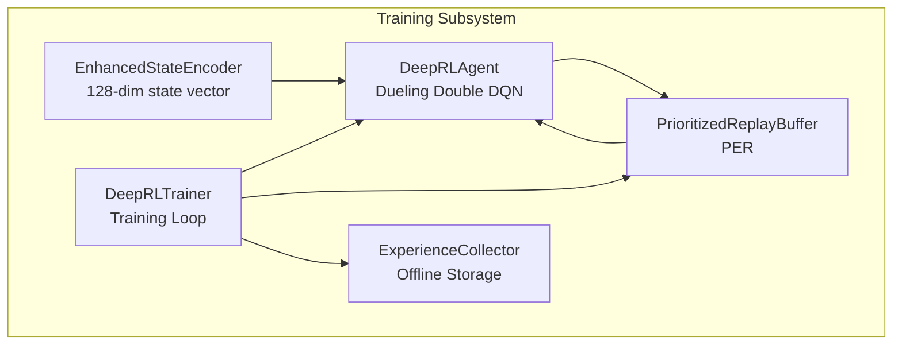
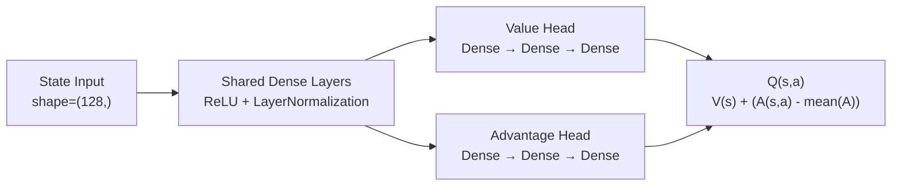
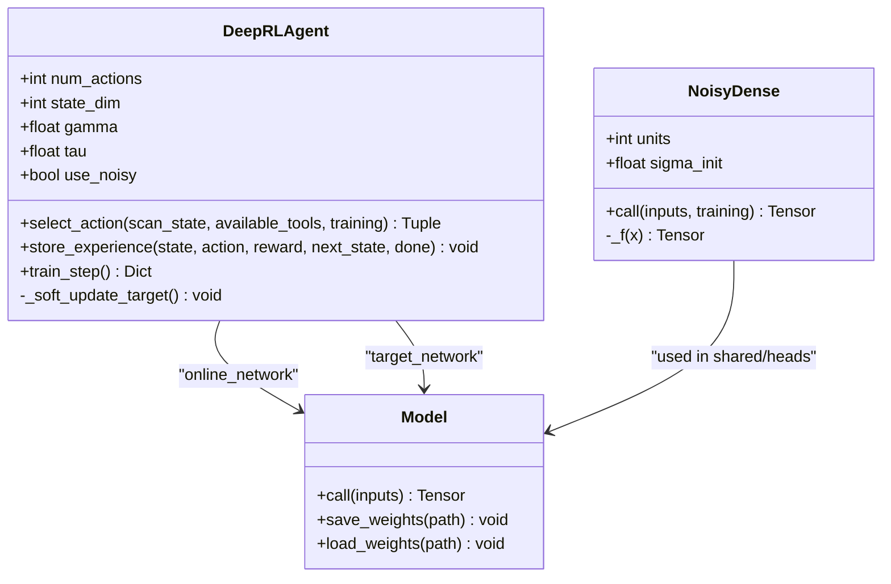
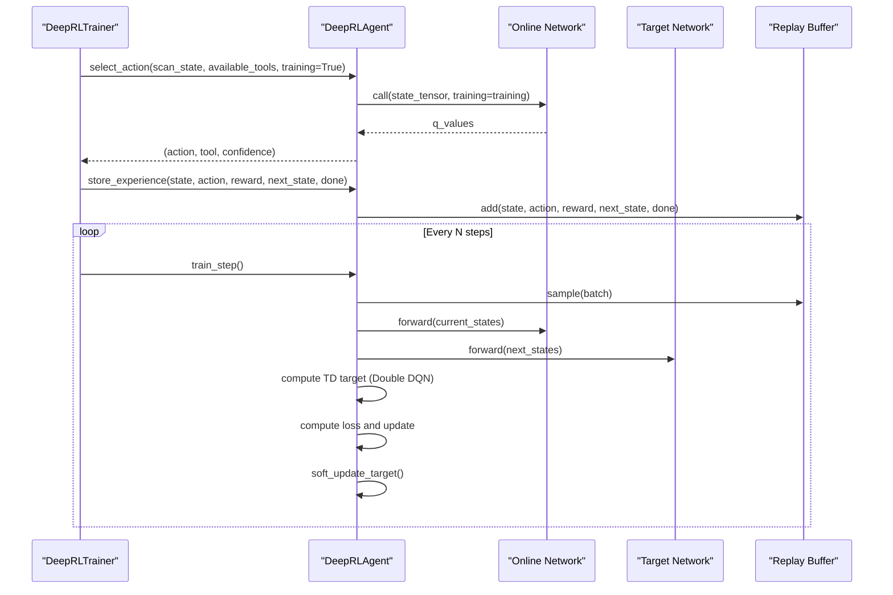
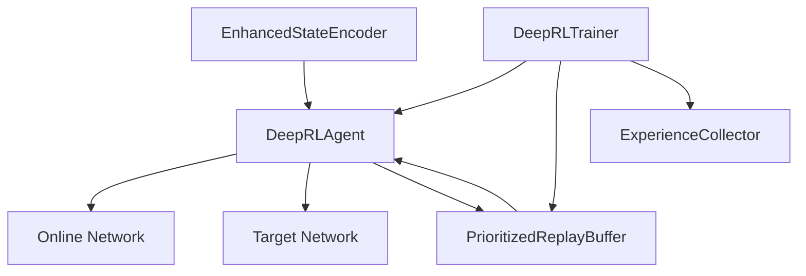

# Neural Network Architecture

<cite>
**Referenced Files in This Document**
- [deep_rl_agent.py](file://backend/training/deep_rl_agent.py)
- [enhanced_state_encoder.py](file://backend/training/enhanced_state_encoder.py)
- [prioritized_replay.py](file://backend/training/prioritized_replay.py)
- [rl_training_config.py](file://backend/training/rl_training_config.py)
- [deep_rl_trainer.py](file://backend/training/deep_rl_trainer.py)
- [experience_collector.py](file://backend/training/experience_collector.py)
</cite>

## Table of Contents
1. [Introduction](#introduction)
2. [Project Structure](#project-structure)
3. [Core Components](#core-components)
4. [Architecture Overview](#architecture-overview)
5. [Detailed Component Analysis](#detailed-component-analysis)
6. [Dependency Analysis](#dependency-analysis)
7. [Performance Considerations](#performance-considerations)
8. [Troubleshooting Guide](#troubleshooting-guide)
9. [Conclusion](#conclusion)

## Introduction
This document explains the neural network architecture used by the Deep Reinforcement Learning (DRL) agent in the Optimus project. It focuses on the Dueling Double DQN implementation, the dual-stream architecture, the mathematical decomposition of Q(s,a), the noisy network mechanism for exploration, and the state encoding pipeline that feeds the network. It also covers initialization strategies, layer normalization, and practical training considerations derived from the codebase.

## Project Structure
The neural network architecture is implemented within the training subsystem and integrates with state encoding, experience replay, and training orchestration.

**Diagram sources**
- [deep_rl_agent.py](file://backend/training/deep_rl_agent.py#L187-L724)
- [enhanced_state_encoder.py](file://backend/training/enhanced_state_encoder.py#L23-L593)
- [prioritized_replay.py](file://backend/training/prioritized_replay.py#L176-L461)
- [deep_rl_trainer.py](file://backend/training/deep_rl_trainer.py#L27-L547)
- [experience_collector.py](file://backend/training/experience_collector.py#L49-L240)

**Section sources**
- [deep_rl_agent.py](file://backend/training/deep_rl_agent.py#L1-L724)
- [enhanced_state_encoder.py](file://backend/training/enhanced_state_encoder.py#L1-L593)
- [prioritized_replay.py](file://backend/training/prioritized_replay.py#L1-L461)
- [deep_rl_trainer.py](file://backend/training/deep_rl_trainer.py#L1-L547)
- [experience_collector.py](file://backend/training/experience_collector.py#L1-L240)

## Core Components
- Dueling Double DQN with Prioritized Experience Replay (PER) and target networks.
- Dual-stream architecture: separate value and advantage streams combined into Q(s,a).
- Factorized Gaussian noisy layers replacing epsilon-greedy exploration.
- Orthogonal initialization and layer normalization for stable training.
- Rich 128-dimensional state encoding from multiple scan contexts.

**Section sources**
- [deep_rl_agent.py](file://backend/training/deep_rl_agent.py#L187-L724)
- [enhanced_state_encoder.py](file://backend/training/enhanced_state_encoder.py#L23-L593)
- [prioritized_replay.py](file://backend/training/prioritized_replay.py#L176-L461)

## Architecture Overview
The agent’s neural network is a Keras functional model with:
- Input: 128-dimensional state vector from the EnhancedStateEncoder.
- Shared feature extraction layers with ReLU activations and LayerNormalization.
- Two heads:
  - Value head: estimates V(s).
  - Advantage head: estimates A(s,a).
- Output: Q(s,a) = V(s) + (A(s,a) − mean(A(s,a'))), computed via Keras ops.

**Diagram sources**
- [deep_rl_agent.py](file://backend/training/deep_rl_agent.py#L109-L184)

**Section sources**
- [deep_rl_agent.py](file://backend/training/deep_rl_agent.py#L109-L184)

## Detailed Component Analysis

### Dueling Double DQN Neural Network
- Network creation: [create_dueling_network](file://backend/training/deep_rl_agent.py#L109-L184)
- Dual-stream architecture: [create_dueling_network](file://backend/training/deep_rl_agent.py#L154-L180)
- Q-function composition: [create_dueling_network](file://backend/training/deep_rl_agent.py#L178-L180)
- Noisy layers: [NoisyDense](file://backend/training/deep_rl_agent.py#L43-L106)
- Training step with Double DQN and PER: [train_step](file://backend/training/deep_rl_agent.py#L397-L481)

Key implementation highlights:
- Input dimension equals the EnhancedStateEncoder output (128).
- Hidden layers use ReLU activation and LayerNormalization.
- Last shared layer optionally replaced with a noisy dense layer for exploration.
- Value and advantage heads share the same shared backbone.
- Q(s,a) computed as V(s) plus centered advantage term.

**Diagram sources**
- [deep_rl_agent.py](file://backend/training/deep_rl_agent.py#L43-L106)
- [deep_rl_agent.py](file://backend/training/deep_rl_agent.py#L187-L724)

**Section sources**
- [deep_rl_agent.py](file://backend/training/deep_rl_agent.py#L43-L106)
- [deep_rl_agent.py](file://backend/training/deep_rl_agent.py#L109-L184)
- [deep_rl_agent.py](file://backend/training/deep_rl_agent.py#L397-L481)

### Noisy Networks for Exploration
- Factorized Gaussian noise mechanism: [NoisyDense.call](file://backend/training/deep_rl_agent.py#L87-L102)
- Factorized noise function: [NoisyDense._f](file://backend/training/deep_rl_agent.py#L104-L106)
- Initialization bounds derived from input/output dimensions: [NoisyDense.build](file://backend/training/deep_rl_agent.py#L56-L85)
- Optional integration in shared and head layers: [create_dueling_network](file://backend/training/deep_rl_agent.py#L142-L176)

Advantages over epsilon-greedy:
- End-to-end differentiable exploration.
- Stable long-term exploration without decaying epsilon schedules.
- Reduced hyperparameter tuning for exploration.

**Section sources**
- [deep_rl_agent.py](file://backend/training/deep_rl_agent.py#L43-L106)
- [deep_rl_agent.py](file://backend/training/deep_rl_agent.py#L109-L184)

### State Encoding and Input Dimensions
- 128-dimensional state vector composed from:
  - Phase encoding (5 dims)
  - Target context (25 dims)
  - Vulnerability context (30 dims)
  - Tool history (40 dims)
  - Progress metrics (15 dims)
  - Intelligence features (13 dims)
- Encoder implementation: [EnhancedStateEncoder](file://backend/training/enhanced_state_encoder.py#L23-L593)
- Agent input dimension: [DeepRLAgent.__init__](file://backend/training/deep_rl_agent.py#L202-L216)

Practical implications:
- The network input shape is fixed at (128,) for all training and inference.
- Values are clipped to [0, 1] for numerical stability.

**Section sources**
- [enhanced_state_encoder.py](file://backend/training/enhanced_state_encoder.py#L23-L593)
- [deep_rl_agent.py](file://backend/training/deep_rl_agent.py#L202-L216)

### Prioritized Experience Replay (PER)
- SumTree-based priority sampling: [SumTree](file://backend/training/prioritized_replay.py#L27-L174)
- PER buffer with importance sampling: [PrioritizedReplayBuffer](file://backend/training/prioritized_replay.py#L176-L376)
- Standard replay fallback: [StandardReplayBuffer](file://backend/training/prioritized_replay.py#L378-L461)
- Agent integration: [DeepRLAgent.__init__](file://backend/training/deep_rl_agent.py#L275-L283), [train_step](file://backend/training/deep_rl_agent.py#L407-L463)

Benefits:
- Focuses learning on high TD-error transitions.
- Improves sample efficiency compared to uniform replay.

**Section sources**
- [prioritized_replay.py](file://backend/training/prioritized_replay.py#L176-L376)
- [deep_rl_agent.py](file://backend/training/deep_rl_agent.py#L275-L283)
- [deep_rl_agent.py](file://backend/training/deep_rl_agent.py#L407-L463)

### Training Orchestration and Q-Value Prediction
- Training loop: [DeepRLTrainer._run_training_episode](file://backend/training/deep_rl_trainer.py#L170-L328)
- Forward pass and Q-value prediction: [DeepRLAgent.select_action](file://backend/training/deep_rl_agent.py#L312-L369)
- Double DQN update: [DeepRLAgent.train_step](file://backend/training/deep_rl_agent.py#L426-L441)
- Target network soft update: [DeepRLAgent._soft_update_target](file://backend/training/deep_rl_agent.py#L483-L489)

**Diagram sources**
- [deep_rl_trainer.py](file://backend/training/deep_rl_trainer.py#L170-L328)
- [deep_rl_agent.py](file://backend/training/deep_rl_agent.py#L312-L369)
- [deep_rl_agent.py](file://backend/training/deep_rl_agent.py#L397-L481)
- [prioritized_replay.py](file://backend/training/prioritized_replay.py#L270-L349)

**Section sources**
- [deep_rl_trainer.py](file://backend/training/deep_rl_trainer.py#L170-L328)
- [deep_rl_agent.py](file://backend/training/deep_rl_agent.py#L312-L369)
- [deep_rl_agent.py](file://backend/training/deep_rl_agent.py#L397-L481)

### Mathematical Foundation of Q(s,a)
The Q-function is decomposed as:
- Q(s,a) = V(s) + (A(s,a) − mean(A(s,a')))
- Value stream estimates state value V(s).
- Advantage stream estimates action-specific advantage A(s,a).
- Centering by mean ensures numerical stability and removes additive bias.

Implementation reference:
- Decomposition and combination: [create_dueling_network](file://backend/training/deep_rl_agent.py#L178-L180)

**Section sources**
- [deep_rl_agent.py](file://backend/training/deep_rl_agent.py#L178-L180)

### Network Layers, Activations, and Initialization
- Shared layers: Dense with ReLU activation and LayerNormalization.
- Noisy layers: Dense with factorized Gaussian noise injected during training.
- Initialization:
  - Dense kernels: Orthogonal initialization with gain sqrt(2).
  - Biases: Zeros initializer.
- Layer normalization: Applied after each dense layer to stabilize training.

References:
- Layer construction and normalization: [create_dueling_network](file://backend/training/deep_rl_agent.py#L139-L153)
- Noisy layer parameters: [NoisyDense.build](file://backend/training/deep_rl_agent.py#L56-L85)
- Orthogonal and Zeros initializers: [create_dueling_network](file://backend/training/deep_rl_agent.py#L145-L149)

**Section sources**
- [deep_rl_agent.py](file://backend/training/deep_rl_agent.py#L139-L153)
- [deep_rl_agent.py](file://backend/training/deep_rl_agent.py#L145-L149)
- [deep_rl_agent.py](file://backend/training/deep_rl_agent.py#L56-L85)

### Relationship Between State Encoding and Network Input
- The EnhancedStateEncoder produces a 128-dim vector suitable for the network input.
- The agent expects state_dim=128 and uses this to construct the input layer.
- During inference, the agent expands the encoded vector to batch shape and passes it through the network.

References:
- Encoder output shape: [EnhancedStateEncoder.encode](file://backend/training/enhanced_state_encoder.py#L75-L138)
- Agent input construction: [create_dueling_network](file://backend/training/deep_rl_agent.py#L136-L137)
- Agent state encoding usage: [DeepRLAgent.select_action](file://backend/training/deep_rl_agent.py#L329-L335)

**Section sources**
- [enhanced_state_encoder.py](file://backend/training/enhanced_state_encoder.py#L75-L138)
- [deep_rl_agent.py](file://backend/training/deep_rl_agent.py#L136-L137)
- [deep_rl_agent.py](file://backend/training/deep_rl_agent.py#L329-L335)

### Benefits of the Dueling Architecture for Value Estimation
- Separates state value V(s) from action advantages A(s,a).
- Improves learning efficiency by disentangling state evaluation from action selection.
- Reduces overestimation bias when combined with Double DQN.

Reference:
- Architecture and Q decomposition: [create_dueling_network](file://backend/training/deep_rl_agent.py#L109-L184)

**Section sources**
- [deep_rl_agent.py](file://backend/training/deep_rl_agent.py#L109-L184)

### Common Implementation Challenges and Optimization Techniques
- Exploration: Prefer noisy networks over epsilon-greedy to avoid brittle decay schedules.
- Stability: Use LayerNormalization after dense layers and gradient clipping.
- Target updates: Soft updates (tau) improve stability vs. hard copies.
- PER: Importance sampling weights prevent bias; anneal beta over time.
- Double DQN: Use online network for action selection and target network for value evaluation to reduce overestimation.

References:
- Exploration and epsilon handling: [DeepRLAgent.__init__](file://backend/training/deep_rl_agent.py#L290-L293), [DeepRLAgent.train_step](file://backend/training/deep_rl_agent.py#L468-L470)
- Gradient clipping: [DeepRLAgent.train_step](file://backend/training/deep_rl_agent.py#L454-L455)
- Target updates: [DeepRLAgent._soft_update_target](file://backend/training/deep_rl_agent.py#L483-L489)
- PER importance sampling: [PrioritizedReplayBuffer.sample](file://backend/training/prioritized_replay.py#L328-L336)
- Double DQN: [DeepRLAgent.train_step](file://backend/training/deep_rl_agent.py#L432-L438)

**Section sources**
- [deep_rl_agent.py](file://backend/training/deep_rl_agent.py#L290-L293)
- [deep_rl_agent.py](file://backend/training/deep_rl_agent.py#L454-L455)
- [deep_rl_agent.py](file://backend/training/deep_rl_agent.py#L483-L489)
- [prioritized_replay.py](file://backend/training/prioritized_replay.py#L328-L336)
- [deep_rl_agent.py](file://backend/training/deep_rl_agent.py#L432-L438)

## Dependency Analysis
The neural network depends on:
- State encoder for input vectors.
- Prioritized replay for experience sampling and weighting.
- Training orchestrator for episode loops and checkpointing.

**Diagram sources**
- [enhanced_state_encoder.py](file://backend/training/enhanced_state_encoder.py#L23-L593)
- [deep_rl_agent.py](file://backend/training/deep_rl_agent.py#L187-L724)
- [prioritized_replay.py](file://backend/training/prioritized_replay.py#L176-L461)
- [deep_rl_trainer.py](file://backend/training/deep_rl_trainer.py#L27-L547)
- [experience_collector.py](file://backend/training/experience_collector.py#L49-L240)

**Section sources**
- [deep_rl_agent.py](file://backend/training/deep_rl_agent.py#L187-L724)
- [prioritized_replay.py](file://backend/training/prioritized_replay.py#L176-L461)
- [deep_rl_trainer.py](file://backend/training/deep_rl_trainer.py#L27-L547)
- [experience_collector.py](file://backend/training/experience_collector.py#L49-L240)

## Performance Considerations
- Use LayerNormalization to stabilize hidden representations.
- Apply gradient clipping to mitigate exploding gradients.
- Prefer noisy networks for exploration to reduce hyperparameter sensitivity.
- Use Double DQN with PER to improve sample efficiency and reduce overestimation.
- Monitor TD error magnitudes and buffer priorities to tune alpha and beta.

[No sources needed since this section provides general guidance]

## Troubleshooting Guide
- NaN or unstable losses:
  - Check gradient clipping and learning rate.
  - Verify state normalization and clipping to [0,1].
- Poor exploration:
  - Ensure noisy networks are enabled and sigma_init is appropriate.
  - Confirm epsilon is not overriding noisy exploration.
- Slow convergence:
  - Increase PER alpha or adjust beta annealing schedule.
  - Consider reducing batch size or increasing learning rate slightly.
- Memory issues:
  - Reduce buffer capacity or batch size.
  - Use StandardReplayBuffer temporarily for debugging.

**Section sources**
- [deep_rl_agent.py](file://backend/training/deep_rl_agent.py#L454-L455)
- [deep_rl_agent.py](file://backend/training/deep_rl_agent.py#L290-L293)
- [prioritized_replay.py](file://backend/training/prioritized_replay.py#L328-L336)

## Conclusion
The Optimus DRL agent employs a Dueling Double DQN with a dual-stream architecture, factorized Gaussian noisy networks for exploration, and robust training practices including PER and soft target updates. The 128-dimensional state encoding from the EnhancedStateEncoder provides rich contextual information for decision-making. Together, these components enable stable and efficient reinforcement learning for tool selection in automated penetration testing scenarios.