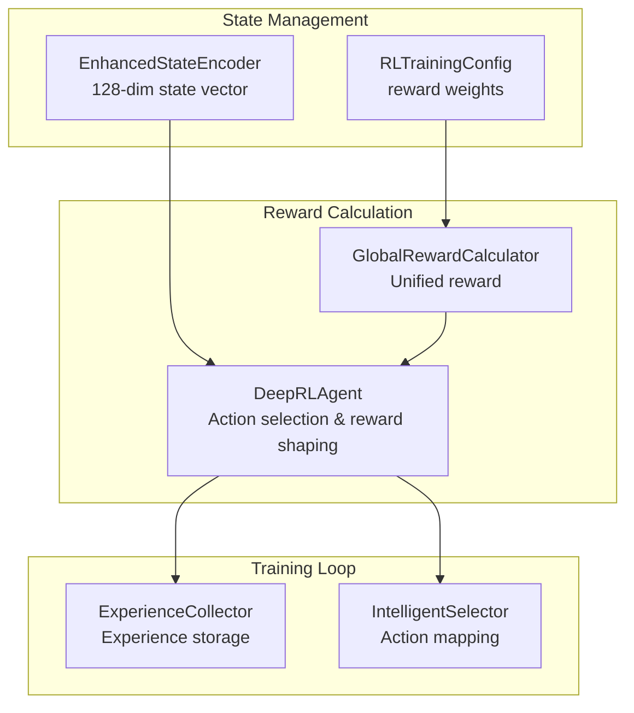
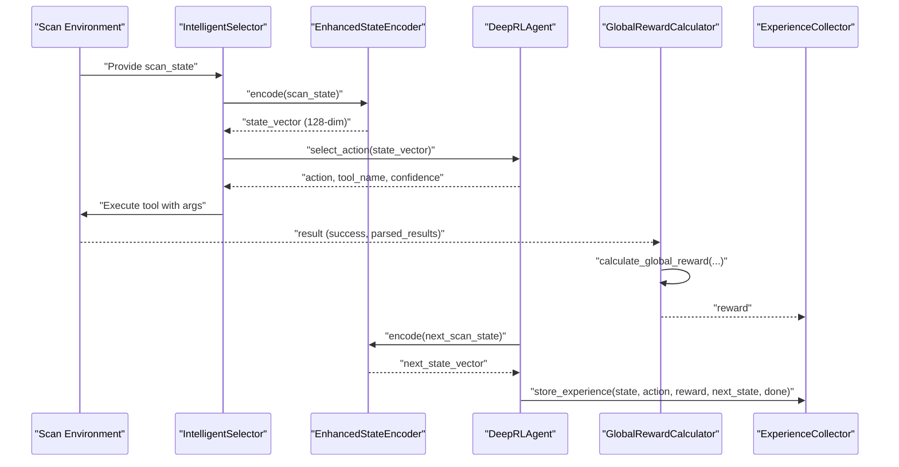
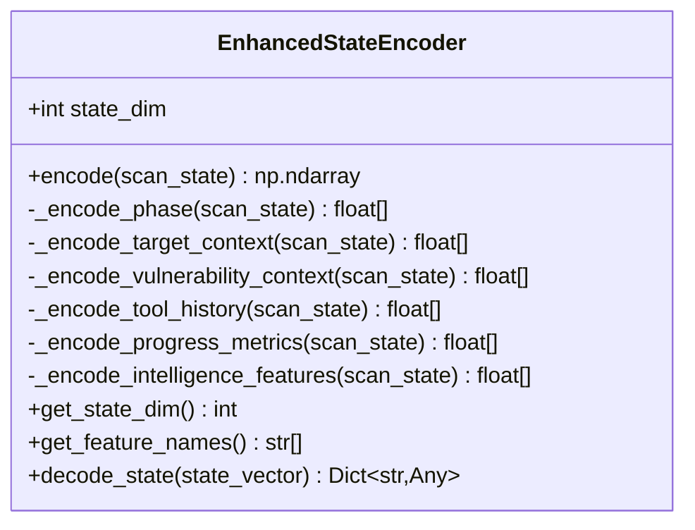
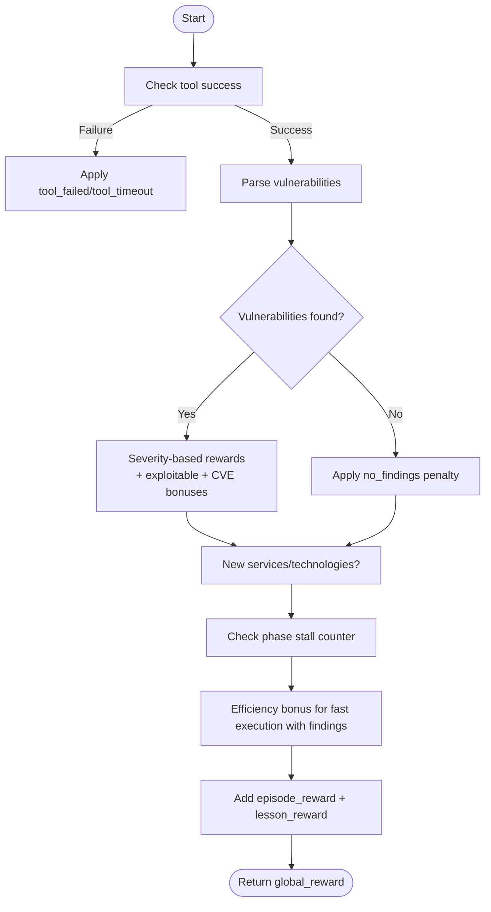
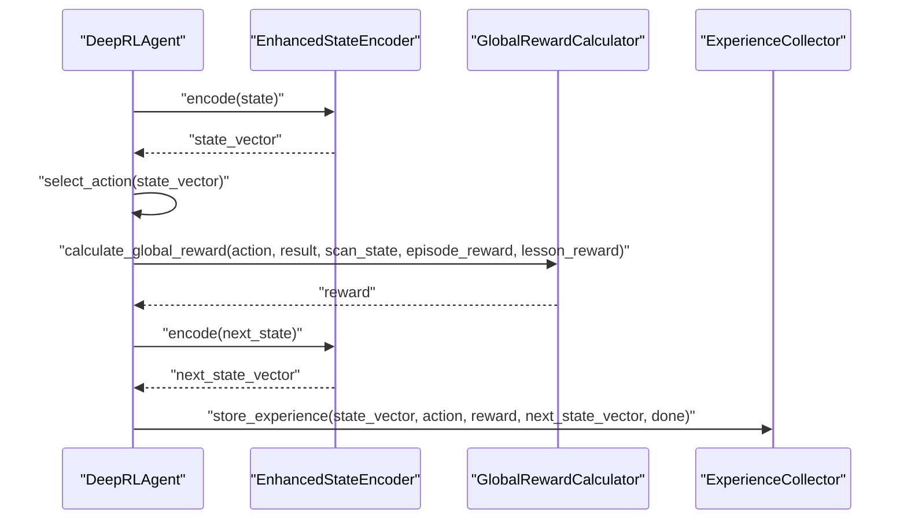
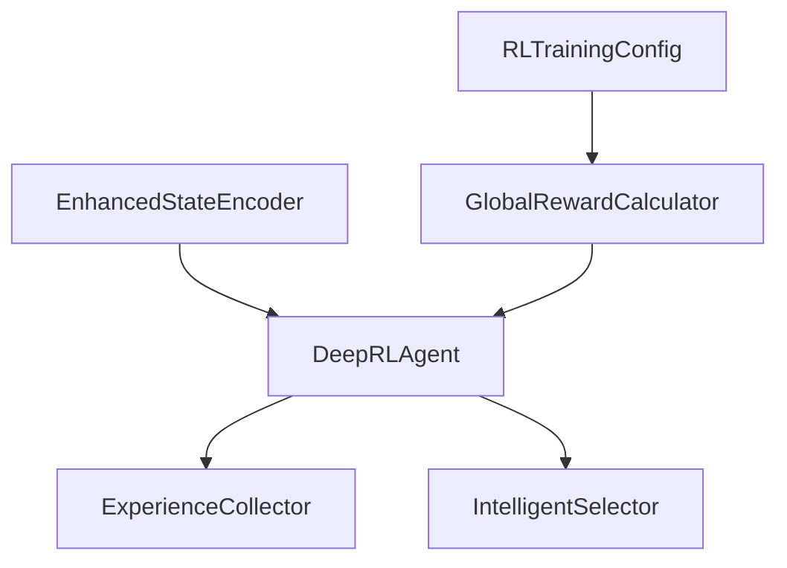

# State Management and Reward Calculation

<cite>
**Referenced Files in This Document**
- [enhanced_state_encoder.py](file://backend/training/enhanced_state_encoder.py)
- [reward_calculator.py](file://backend/training/reward_calculator.py)
- [rl_training_config.py](file://backend/training/rl_training_config.py)
- [deep_rl_agent.py](file://backend/training/deep_rl_agent.py)
- [experience_collector.py](file://backend/training/experience_collector.py)
- [intelligent_selector.py](file://backend/inference/intelligent_selector.py)
</cite>

## Table of Contents
1. [Introduction](#introduction)
2. [Project Structure](#project-structure)
3. [Core Components](#core-components)
4. [Architecture Overview](#architecture-overview)
5. [Detailed Component Analysis](#detailed-component-analysis)
6. [Dependency Analysis](#dependency-analysis)
7. [Performance Considerations](#performance-considerations)
8. [Troubleshooting Guide](#troubleshooting-guide)
9. [Conclusion](#conclusion)

## Introduction
This document explains the state management and reward calculation system used by the RL agent in the Optimus security automation platform. It focuses on the EnhancedStateEncoder that constructs a 128-dimensional state vector from scan context, and the unified reward calculation system that combines environment, episode, and lesson rewards into a single global reward signal. The document details state vector construction, feature normalization, dimensionality reduction techniques, reward structure, and the integration between state representation and action selection.

## Project Structure
The state management and reward calculation system spans several modules:
- State encoding: EnhancedStateEncoder produces a rich 128-dimensional vector capturing phase, target context, vulnerability context, tool history, progress metrics, and intelligence features.
- Reward calculation: GlobalRewardCalculator computes unified rewards from tool execution results, incorporating severity-based rewards, penalties for failures, bonuses for discoveries, and progression incentives.
- Training integration: DeepRLAgent consumes encoded states, selects actions, and calculates rewards for experience collection and training.
- Experience collection: ExperienceCollector stores (state, action, reward, next_state, done) tuples for offline training and analysis.

**Diagram sources**
- [enhanced_state_encoder.py](file://backend/training/enhanced_state_encoder.py#L23-L138)
- [reward_calculator.py](file://backend/training/reward_calculator.py#L13-L169)
- [rl_training_config.py](file://backend/training/rl_training_config.py#L100-L121)
- [deep_rl_agent.py](file://backend/training/deep_rl_agent.py#L371-L389)
- [experience_collector.py](file://backend/training/experience_collector.py#L49-L130)
- [intelligent_selector.py](file://backend/inference/intelligent_selector.py#L395-L427)

**Section sources**
- [enhanced_state_encoder.py](file://backend/training/enhanced_state_encoder.py#L1-L593)
- [reward_calculator.py](file://backend/training/reward_calculator.py#L1-L234)
- [rl_training_config.py](file://backend/training/rl_training_config.py#L1-L159)
- [deep_rl_agent.py](file://backend/training/deep_rl_agent.py#L1-L724)
- [experience_collector.py](file://backend/training/experience_collector.py#L1-L240)
- [intelligent_selector.py](file://backend/inference/intelligent_selector.py#L395-L427)

## Core Components
- EnhancedStateEncoder: Builds a 128-dimensional state vector from scan context, including phase encoding, target context, vulnerability context, tool history, progress metrics, and intelligence features. It normalizes values to [0, 1], ensures fixed dimensionality, and provides decoding for debugging.
- GlobalRewardCalculator: Computes unified rewards combining environment rewards (based on tool execution results), episode rewards, and lesson rewards. It includes severity-based rewards, penalties for failures and stalls, bonuses for new discoveries, and efficiency incentives.
- RLTrainingConfig: Defines reward weight configuration and training hyperparameters used by the reward calculator.
- DeepRLAgent: Integrates state encoding and reward calculation into the RL training loop, selecting actions and storing experiences for training.
- ExperienceCollector: Stores experiences with metadata for analysis and offline training.
- IntelligentSelector: Maps RL-selected actions to concrete tools and integrates state encoding and action selection in inference mode.

**Section sources**
- [enhanced_state_encoder.py](file://backend/training/enhanced_state_encoder.py#L23-L138)
- [reward_calculator.py](file://backend/training/reward_calculator.py#L13-L169)
- [rl_training_config.py](file://backend/training/rl_training_config.py#L100-L121)
- [deep_rl_agent.py](file://backend/training/deep_rl_agent.py#L371-L389)
- [experience_collector.py](file://backend/training/experience_collector.py#L49-L130)
- [intelligent_selector.py](file://backend/inference/intelligent_selector.py#L395-L427)

## Architecture Overview
The RL agent receives raw scan state dictionaries, encodes them into 128-dimensional vectors, and uses these vectors to select actions. After executing tools, the system calculates rewards based on findings and progress, then stores experiences for training.

**Diagram sources**
- [intelligent_selector.py](file://backend/inference/intelligent_selector.py#L395-L427)
- [enhanced_state_encoder.py](file://backend/training/enhanced_state_encoder.py#L75-L138)
- [deep_rl_agent.py](file://backend/training/deep_rl_agent.py#L371-L389)
- [reward_calculator.py](file://backend/training/reward_calculator.py#L38-L169)
- [experience_collector.py](file://backend/training/experience_collector.py#L83-L130)

## Detailed Component Analysis

### EnhancedStateEncoder
The EnhancedStateEncoder constructs a 128-dimensional state vector from scan context. It performs:
- Phase encoding: One-hot encoding across five phases.
- Target context: Presence of common ports, detected services, and target complexity derived from service/port counts.
- Vulnerability context: Severity distribution, detected vulnerability types, exploitability metrics, CVE tracking, and severity statistics.
- Tool history: Flags for 35 tracked tools, execution statistics, and recent tool indices.
- Progress metrics: Time metrics, coverage, stall detection, and phase/scan completion estimates.
- Intelligence features: Technology stack detection, intelligence data, and target profile.

**Diagram sources**
- [enhanced_state_encoder.py](file://backend/training/enhanced_state_encoder.py#L23-L138)

Key implementation patterns:
- Fixed dimensionality: Ensures exactly 128 features by truncating and padding.
- Feature normalization: Clips values to [0, 1] and normalizes counts and ratios.
- Dimensionality reduction: Uses one-hot encodings and compact statistics (e.g., severity counts, ratios) to represent rich contexts in a fixed-size vector.
- Robust parsing: Handles missing or malformed fields gracefully, returning zeros when invalid.

Concrete examples from the codebase:
- State vector construction: [encode](file://backend/training/enhanced_state_encoder.py#L75-L138)
- Vulnerability context encoding: [vulnerability context](file://backend/training/enhanced_state_encoder.py#L206-L324)
- Tool history encoding: [tool history](file://backend/training/enhanced_state_encoder.py#L326-L369)
- Progress metrics encoding: [progress metrics](file://backend/training/enhanced_state_encoder.py#L371-L467)
- Intelligence features encoding: [intelligence features](file://backend/training/enhanced_state_encoder.py#L469-L515)

**Section sources**
- [enhanced_state_encoder.py](file://backend/training/enhanced_state_encoder.py#L23-L138)
- [enhanced_state_encoder.py](file://backend/training/enhanced_state_encoder.py#L206-L324)
- [enhanced_state_encoder.py](file://backend/training/enhanced_state_encoder.py#L326-L369)
- [enhanced_state_encoder.py](file://backend/training/enhanced_state_encoder.py#L371-L467)
- [enhanced_state_encoder.py](file://backend/training/enhanced_state_encoder.py#L469-L515)

### Unified Reward Calculation System
The GlobalRewardCalculator computes a unified global reward combining environment, episode, and lesson rewards. The environment reward is derived from tool execution results and includes:
- Tool success/failure penalties (including timeouts and repeated tool usage).
- Severity-based rewards for vulnerabilities found (critical, high, medium, low).
- Bonuses for exploitable findings, credentials, and shells.
- Penalties for no findings and phase stalls.
- Bonuses for new service and technology discoveries.
- Efficiency bonus for fast executions with findings.

Episode and lesson rewards can be added to the environment reward to incorporate curriculum and external signals.

**Diagram sources**
- [reward_calculator.py](file://backend/training/reward_calculator.py#L38-L169)

Reward structure (from configuration):
- Positive rewards: critical_vuln_found, high_vuln_found, medium_vuln_found, low_vuln_found, info_found, new_service_discovered, new_technology_detected, successful_exploit, shell_obtained, credentials_found.
- Negative rewards: tool_failed, tool_timeout, repeated_tool, no_findings, phase_stall, scan_timeout.

Integration with state representation:
- The reward calculator uses parsed results and scan state to compute environment rewards, which are combined with episode and lesson rewards to form the global reward used for experience storage and training.

**Section sources**
- [reward_calculator.py](file://backend/training/reward_calculator.py#L13-L169)
- [rl_training_config.py](file://backend/training/rl_training_config.py#L100-L121)

### State Encoding and Action Selection Integration
The DeepRLAgent integrates state encoding and reward calculation:
- Encodes the current scan state into a 128-dimensional vector.
- Selects actions based on Q-values, optionally with noisy networks or epsilon-greedy exploration.
- Calculates global rewards using the GlobalRewardCalculator.
- Stores experiences with metadata for training.

**Diagram sources**
- [deep_rl_agent.py](file://backend/training/deep_rl_agent.py#L371-L389)
- [deep_rl_agent.py](file://backend/training/deep_rl_agent.py#L495-L596)
- [enhanced_state_encoder.py](file://backend/training/enhanced_state_encoder.py#L75-L138)
- [experience_collector.py](file://backend/training/experience_collector.py#L83-L130)

**Section sources**
- [deep_rl_agent.py](file://backend/training/deep_rl_agent.py#L371-L389)
- [deep_rl_agent.py](file://backend/training/deep_rl_agent.py#L495-L596)
- [enhanced_state_encoder.py](file://backend/training/enhanced_state_encoder.py#L75-L138)
- [experience_collector.py](file://backend/training/experience_collector.py#L83-L130)

## Dependency Analysis
The system exhibits clear separation of concerns:
- EnhancedStateEncoder depends on scan state dictionaries and returns fixed-size vectors.
- GlobalRewardCalculator depends on RLTrainingConfig for reward weights and on tool execution results and scan state.
- DeepRLAgent depends on EnhancedStateEncoder for state vectors and on GlobalRewardCalculator for reward computation.
- ExperienceCollector depends on the agent’s stored experiences and metadata.
- IntelligentSelector depends on EnhancedStateEncoder and DeepRLAgent for action selection in inference.

**Diagram sources**
- [enhanced_state_encoder.py](file://backend/training/enhanced_state_encoder.py#L23-L138)
- [reward_calculator.py](file://backend/training/reward_calculator.py#L13-L169)
- [rl_training_config.py](file://backend/training/rl_training_config.py#L100-L121)
- [deep_rl_agent.py](file://backend/training/deep_rl_agent.py#L371-L389)
- [experience_collector.py](file://backend/training/experience_collector.py#L49-L130)
- [intelligent_selector.py](file://backend/inference/intelligent_selector.py#L395-L427)

**Section sources**
- [enhanced_state_encoder.py](file://backend/training/enhanced_state_encoder.py#L23-L138)
- [reward_calculator.py](file://backend/training/reward_calculator.py#L13-L169)
- [rl_training_config.py](file://backend/training/rl_training_config.py#L100-L121)
- [deep_rl_agent.py](file://backend/training/deep_rl_agent.py#L371-L389)
- [experience_collector.py](file://backend/training/experience_collector.py#L49-L130)
- [intelligent_selector.py](file://backend/inference/intelligent_selector.py#L395-L427)

## Performance Considerations
- State vector construction: The encoder precomputes indices for tools, vulnerability types, and services to speed up encoding. Values are clipped to [0, 1] and padded/truncated to ensure fixed dimensionality.
- Reward computation: The reward calculator uses lightweight checks and simple arithmetic; caching repeated tool usage reduces overhead.
- Training loop: The agent uses prioritized experience replay and target networks to stabilize learning. Noisy networks replace epsilon-greedy exploration for better exploration efficiency.
- Memory footprint: The 128-dimensional state vectors are compact and suitable for neural network training. Experience tuples include metadata for analysis without excessive memory overhead.

[No sources needed since this section provides general guidance]

## Troubleshooting Guide
Common issues and resolutions:
- Invalid scan state input: The encoder handles numpy arrays by returning zero vectors and logs warnings. Ensure scan state is a dictionary.
- Missing fields in scan state: The encoder gracefully handles missing keys by defaulting to empty lists or zero values.
- Reward calculation anomalies: Verify reward weights in RLTrainingConfig and ensure tool results include parsed_results with expected fields.
- Training instability: Adjust reward shaping weights, exploration parameters, or prioritized replay settings in RLTrainingConfig.

**Section sources**
- [enhanced_state_encoder.py](file://backend/training/enhanced_state_encoder.py#L91-L94)
- [enhanced_state_encoder.py](file://backend/training/enhanced_state_encoder.py#L123-L127)
- [rl_training_config.py](file://backend/training/rl_training_config.py#L100-L121)
- [reward_calculator.py](file://backend/training/reward_calculator.py#L65-L74)

## Conclusion
The state management and reward calculation system provides a robust foundation for RL-driven security tool selection. The EnhancedStateEncoder captures rich contextual information in a fixed-size vector, while the GlobalRewardCalculator unifies diverse reward signals into a coherent global reward. Together, they enable the DeepRLAgent to learn effective scanning strategies, balance exploration and exploitation, and adapt to varying targets and environments.