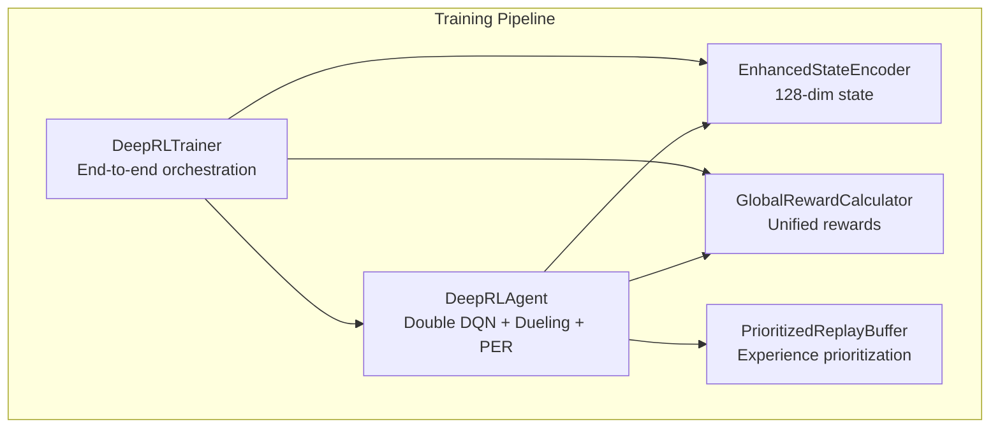
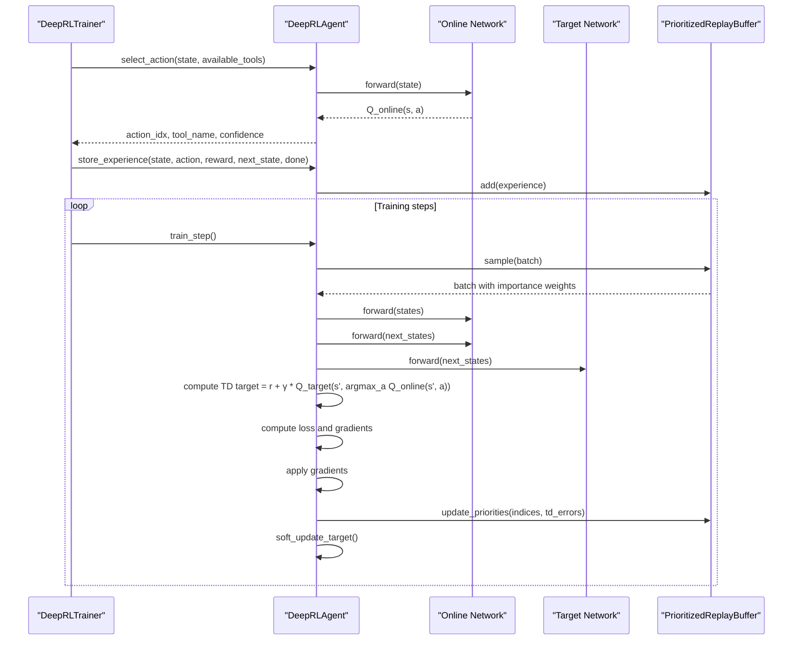
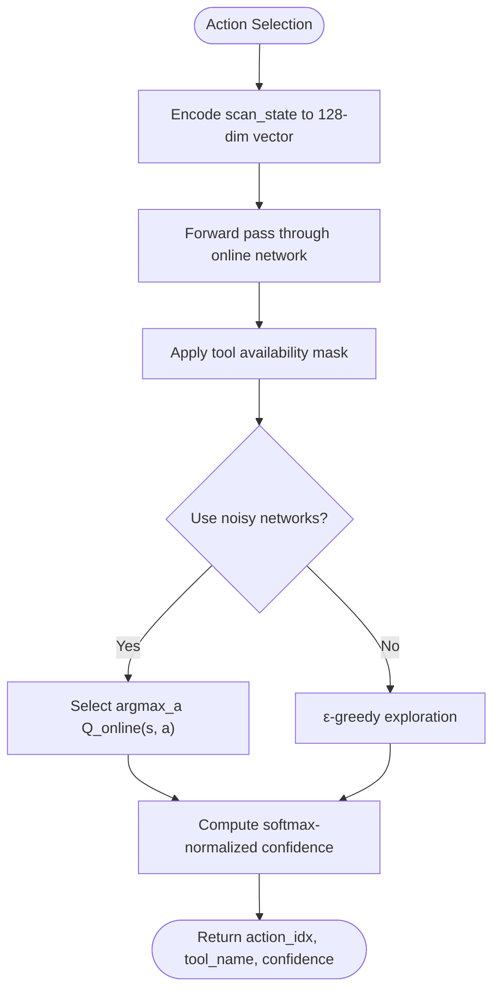
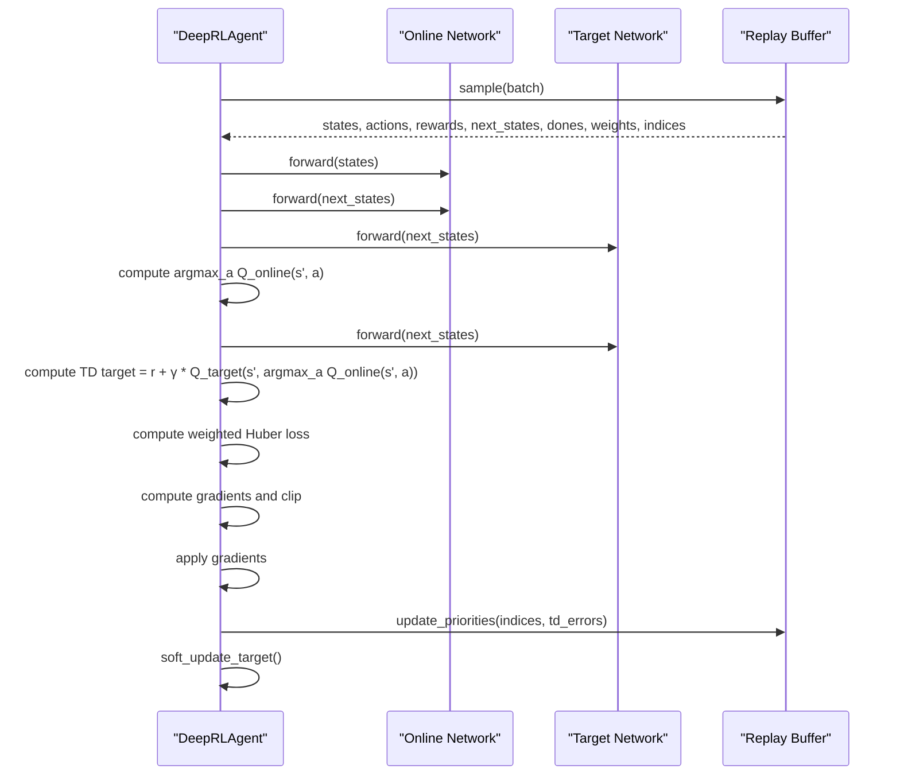
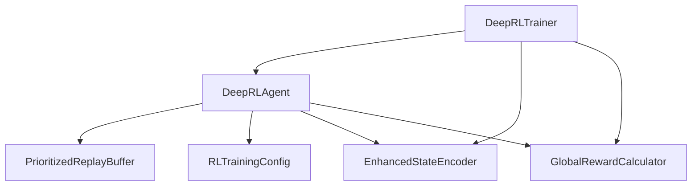

# Double DQN Methodology

<cite>
**Referenced Files in This Document**
- [deep_rl_agent.py](file://backend/training/deep_rl_agent.py)
- [deep_rl_trainer.py](file://backend/training/deep_rl_trainer.py)
- [prioritized_replay.py](file://backend/training/prioritized_replay.py)
- [enhanced_state_encoder.py](file://backend/training/enhanced_state_encoder.py)
- [reward_calculator.py](file://backend/training/reward_calculator.py)
- [rl_training_config.py](file://backend/training/rl_training_config.py)
</cite>

## Table of Contents
1. [Introduction](#introduction)
2. [Project Structure](#project-structure)
3. [Core Components](#core-components)
4. [Architecture Overview](#architecture-overview)
5. [Detailed Component Analysis](#detailed-component-analysis)
6. [Dependency Analysis](#dependency-analysis)
7. [Performance Considerations](#performance-considerations)
8. [Troubleshooting Guide](#troubleshooting-guide)
9. [Conclusion](#conclusion)

## Introduction
This document explains the Double Deep Q-Network (Double DQN) methodology implemented in the Optimus penetration testing automation system. It details how the implementation reduces overestimation bias by decoupling action selection from value evaluation, presents the mathematical formulation, and demonstrates the practical differences from standard DQN. The document also covers the complete training pipeline, including the Dueling architecture, Prioritized Experience Replay (PER), target networks, and reward shaping.

## Project Structure
The Double DQN implementation spans several modules within the training subsystem:
- Deep RL Agent: Implements the neural network architecture, Double DQN training step, and action selection logic.
- Deep RL Trainer: Orchestrates end-to-end training across multiple targets, episode execution, and checkpointing.
- Prioritized Replay Buffer: Manages experience prioritization and importance sampling weights.
- Enhanced State Encoder: Produces a rich 128-dimensional state representation for the agent.
- Reward Calculator: Computes unified rewards combining environment, episode, and lesson signals.
- Training Configuration: Defines hyperparameters, targets, and scheduling for training.

**Diagram sources**
- [deep_rl_trainer.py](file://backend/training/deep_rl_trainer.py#L27-L122)
- [deep_rl_agent.py](file://backend/training/deep_rl_agent.py#L187-L298)
- [enhanced_state_encoder.py](file://backend/training/enhanced_state_encoder.py#L23-L73)
- [reward_calculator.py](file://backend/training/reward_calculator.py#L13-L36)
- [prioritized_replay.py](file://backend/training/prioritized_replay.py#L176-L226)

**Section sources**
- [deep_rl_trainer.py](file://backend/training/deep_rl_trainer.py#L27-L122)
- [deep_rl_agent.py](file://backend/training/deep_rl_agent.py#L187-L298)
- [enhanced_state_encoder.py](file://backend/training/enhanced_state_encoder.py#L23-L73)
- [reward_calculator.py](file://backend/training/reward_calculator.py#L13-L36)
- [prioritized_replay.py](file://backend/training/prioritized_replay.py#L176-L226)

## Core Components
- Dueling Double DQN Agent: Implements a dual-stream architecture (value and advantage) and performs Double DQN updates by selecting actions with the online network while evaluating them with the target network.
- Prioritized Experience Replay: Improves learning efficiency by sampling experiences proportional to TD error magnitude.
- Target Network: Stabilizes training by decoupling the Q-value targets from the evolving online network.
- Noisy Networks: Replaces epsilon-greedy exploration with parameterized stochastic layers for more effective exploration.
- Enhanced State Encoder: Produces a comprehensive 128-dimensional state vector capturing phase, target context, findings, tool history, progress metrics, and intelligence features.
- Reward Shaping: Unifies environment, episode, and lesson rewards to guide policy learning effectively.

**Section sources**
- [deep_rl_agent.py](file://backend/training/deep_rl_agent.py#L109-L184)
- [deep_rl_agent.py](file://backend/training/deep_rl_agent.py#L397-L481)
- [prioritized_replay.py](file://backend/training/prioritized_replay.py#L176-L226)
- [enhanced_state_encoder.py](file://backend/training/enhanced_state_encoder.py#L75-L138)
- [reward_calculator.py](file://backend/training/reward_calculator.py#L38-L169)

## Architecture Overview
The Double DQN architecture integrates the following elements:
- Online and target networks share the same Dueling architecture but are decoupled during training.
- Action selection uses the online network’s Q-values.
- Value evaluation uses the target network’s Q-values to compute TD targets, reducing overestimation bias.
- Experience transitions are stored in a replay buffer and sampled with prioritization and importance sampling.
- Training proceeds with gradient computation, gradient clipping, and soft target network updates.

**Diagram sources**
- [deep_rl_trainer.py](file://backend/training/deep_rl_trainer.py#L170-L328)
- [deep_rl_agent.py](file://backend/training/deep_rl_agent.py#L312-L369)
- [deep_rl_agent.py](file://backend/training/deep_rl_agent.py#L397-L481)
- [prioritized_replay.py](file://backend/training/prioritized_replay.py#L270-L349)

## Detailed Component Analysis

### Mathematical Foundation and Implementation Differences
- Overestimation Bias: Standard DQN tends to overestimate Q-values because it uses the same Q-network for both action selection and value evaluation. Double DQN mitigates this by decoupling these two roles.
- Double DQN Update: The TD target becomes r + γ * Q_target(s', argmax_a Q_online(s', a)), where argmax_a Q_online(s', a) is computed using the online network, but the target Q_target(s', a) is evaluated using the target network.
- Practical Differences:
  - Reduced overestimation leads to more conservative value estimates.
  - Improved policy convergence and stability.
  - Better long-term performance compared to standard DQN.

**Section sources**
- [deep_rl_agent.py](file://backend/training/deep_rl_agent.py#L432-L441)

### Dueling Architecture
The agent employs a Dueling DQN architecture that separates value estimation from advantage estimation:
- Shared feature layers extract state representations.
- Value stream estimates V(s).
- Advantage stream estimates A(s, a).
- Combined Q(s, a) = V(s) + (A(s, a) − mean(A(s, ·))).

Benefits:
- Better generalization across actions.
- More stable value estimation.

**Section sources**
- [deep_rl_agent.py](file://backend/training/deep_rl_agent.py#L109-L184)

### Prioritized Experience Replay (PER)
Key aspects:
- SumTree data structure enables O(log n) insertion and sampling.
- Priority = (|TD-error| + ε)^α.
- Importance sampling weights = (N × P(i))^(-β), normalized by maximum weight.
- Beta anneals from β_start to 1.0 over β_frames.

Benefits:
- Focuses learning on important experiences.
- Faster convergence and improved sample efficiency.

**Section sources**
- [prioritized_replay.py](file://backend/training/prioritized_replay.py#L27-L174)
- [prioritized_replay.py](file://backend/training/prioritized_replay.py#L176-L226)
- [prioritized_replay.py](file://backend/training/prioritized_replay.py#L270-L349)
- [prioritized_replay.py](file://backend/training/prioritized_replay.py#L351-L367)

### Target Network and Soft Updates
- Target network weights are soft-updated toward online network weights using a small τ coefficient.
- This stabilizes training by keeping targets relatively fixed.

**Section sources**
- [deep_rl_agent.py](file://backend/training/deep_rl_agent.py#L483-L489)

### Noisy Networks vs. Epsilon-Greedy
- Noisy Dense layers replace explicit ε-greedy exploration.
- Exploration is learned via parameterized noise injected into the network weights.
- Epsilon decay is maintained only as a fallback when noisy networks are disabled.

**Section sources**
- [deep_rl_agent.py](file://backend/training/deep_rl_agent.py#L42-L106)
- [deep_rl_agent.py](file://backend/training/deep_rl_agent.py#L290-L293)

### Action Selection Process
The agent selects actions using the online network:
- Encodes the current scan state into a 128-dimensional vector.
- Applies tool availability masking to invalid actions.
- Uses either noisy networks (preferred) or ε-greedy to select the action with highest Q-value.
- Confidence is derived from softmax-normalized Q-values.

**Diagram sources**
- [deep_rl_agent.py](file://backend/training/deep_rl_agent.py#L312-L369)
- [enhanced_state_encoder.py](file://backend/training/enhanced_state_encoder.py#L75-L138)

**Section sources**
- [deep_rl_agent.py](file://backend/training/deep_rl_agent.py#L312-L369)
- [enhanced_state_encoder.py](file://backend/training/enhanced_state_encoder.py#L75-L138)

### Q-Value Computation and Double DQN Training Step
Training step highlights:
- Compute current Q(s, a) for taken actions using the online network.
- Use online network to select next actions: argmax_a Q_online(s', a).
- Evaluate selected actions using the target network: Q_target(s', argmax_a Q_online(s', a)).
- TD target = r + γ * Q_target(s', argmax_a Q_online(s', a)).
- Weighted Huber loss using importance sampling weights.
- Gradient clipping and optimizer application.
- Update replay priorities and soft-update target network.

**Diagram sources**
- [deep_rl_agent.py](file://backend/training/deep_rl_agent.py#L397-L481)
- [prioritized_replay.py](file://backend/training/prioritized_replay.py#L270-L349)

**Section sources**
- [deep_rl_agent.py](file://backend/training/deep_rl_agent.py#L397-L481)
- [prioritized_replay.py](file://backend/training/prioritized_replay.py#L270-L349)

### Reward Calculation and Policy Guidance
The reward calculator unifies multiple signals:
- Environment reward: findings severity, exploitability, new discoveries, tool failures/timeouts.
- Episode reward: completion bonuses and penalties.
- Lesson reward: optional external guidance.
- The unified reward drives policy learning toward effective and efficient pentesting.

**Section sources**
- [reward_calculator.py](file://backend/training/reward_calculator.py#L38-L169)

### End-to-End Training Orchestration
The trainer coordinates:
- Episode lifecycle: state initialization, action selection, tool execution, reward calculation, experience storage, periodic training.
- Phase transitions and early termination conditions.
- Periodic evaluation, checkpointing, and reporting.

**Section sources**
- [deep_rl_trainer.py](file://backend/training/deep_rl_trainer.py#L123-L328)

## Dependency Analysis
The Double DQN implementation exhibits strong modularity with clear separation of concerns:
- DeepRLTrainer depends on DeepRLAgent, EnhancedStateEncoder, and GlobalRewardCalculator.
- DeepRLAgent depends on PrioritizedReplayBuffer, Dueling network architecture, and training configuration.
- EnhancedStateEncoder provides a fixed-size state representation for the agent.
- Reward Calculator encapsulates reward shaping logic.

**Diagram sources**
- [deep_rl_trainer.py](file://backend/training/deep_rl_trainer.py#L33-L41)
- [deep_rl_agent.py](file://backend/training/deep_rl_agent.py#L202-L298)
- [rl_training_config.py](file://backend/training/rl_training_config.py#L31-L138)

**Section sources**
- [deep_rl_trainer.py](file://backend/training/deep_rl_trainer.py#L33-L41)
- [deep_rl_agent.py](file://backend/training/deep_rl_agent.py#L202-L298)
- [rl_training_config.py](file://backend/training/rl_training_config.py#L31-L138)

## Performance Considerations
- Gradient Clipping: Applied to stabilize training and prevent exploding gradients.
- Soft Target Updates: τ ≈ 0.005 keeps targets stable while allowing gradual adaptation.
- PER Benefits: Prioritizes important experiences, accelerating learning and improving sample efficiency.
- Noisy Networks: Provide more effective exploration than ε-greedy, especially in sparse reward environments.
- State Encoding: 128-dimensional vector captures rich context, enabling informed action selection.

[No sources needed since this section provides general guidance]

## Troubleshooting Guide
Common issues and remedies:
- Overfitting or unstable training:
  - Verify gradient clipping and soft target updates are active.
  - Check PER alpha/beta settings and ensure priorities are updating.
- Poor exploration:
  - Confirm noisy networks are enabled or ε-greedy is functioning when noisy networks are disabled.
- Slow convergence:
  - Increase PER alpha or adjust replay buffer capacity.
  - Review reward shaping to ensure meaningful positive/negative signals.
- Memory issues:
  - Monitor replay buffer size and adjust capacity accordingly.
- Training interruptions:
  - Use checkpointing to resume training from the latest saved state.

**Section sources**
- [deep_rl_agent.py](file://backend/training/deep_rl_agent.py#L452-L466)
- [deep_rl_agent.py](file://backend/training/deep_rl_agent.py#L461-L463)
- [prioritized_replay.py](file://backend/training/prioritized_replay.py#L351-L367)
- [deep_rl_trainer.py](file://backend/training/deep_rl_trainer.py#L440-L460)

## Conclusion
The Optimus system implements a robust Double DQN architecture that combines Dueling networks, Prioritized Experience Replay, target networks, and reward shaping to learn effective pentesting policies. By decoupling action selection from value evaluation, the implementation significantly reduces overestimation bias, leading to more stable and reliable policy learning. The rich state representation and comprehensive reward structure enable the agent to navigate complex scanning scenarios efficiently, demonstrating practical improvements over standard DQN in this domain.