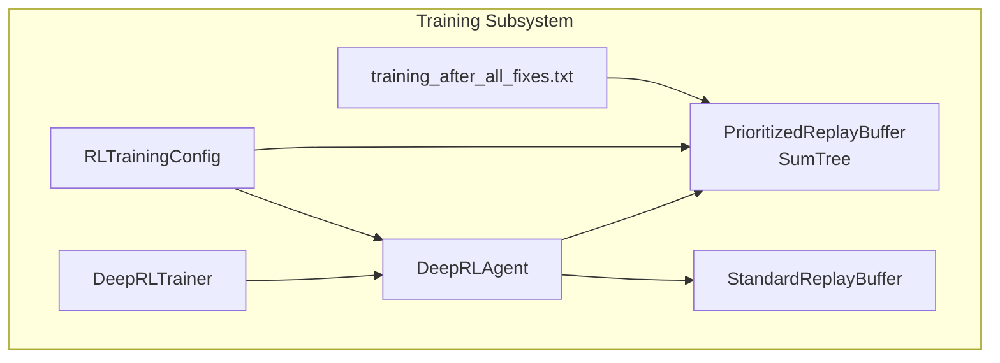
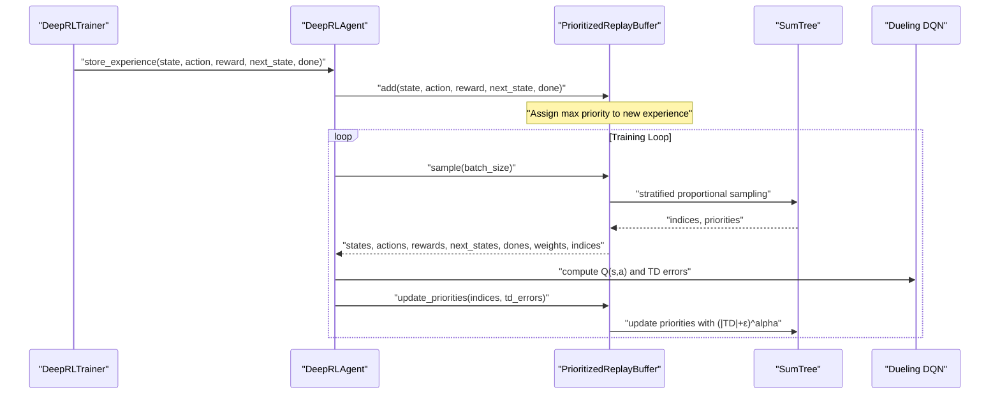
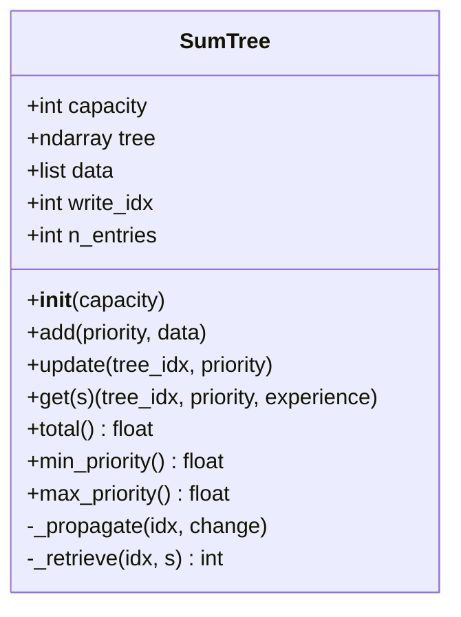
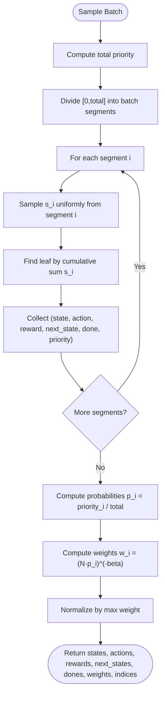
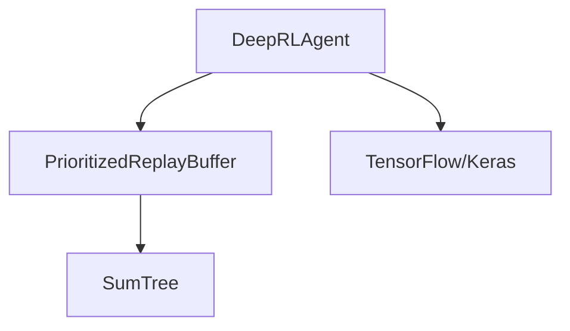

# Prioritized Experience Replay

<cite>
**Referenced Files in This Document**
- [prioritized_replay.py](file://backend/training/prioritized_replay.py)
- [deep_rl_agent.py](file://backend/training/deep_rl_agent.py)
- [deep_rl_trainer.py](file://backend/training/deep_rl_trainer.py)
- [rl_training_config.py](file://backend/training/rl_training_config.py)
- [training_after_all_fixes.txt](file://training_after_all_fixes.txt)
</cite>

## Table of Contents
1. [Introduction](#introduction)
2. [Project Structure](#project-structure)
3. [Core Components](#core-components)
4. [Architecture Overview](#architecture-overview)
5. [Detailed Component Analysis](#detailed-component-analysis)
6. [Dependency Analysis](#dependency-analysis)
7. [Performance Considerations](#performance-considerations)
8. [Troubleshooting Guide](#troubleshooting-guide)
9. [Conclusion](#conclusion)

## Introduction
This document explains the Prioritized Experience Replay (PER) system implemented in the Optimus project. It covers how priorities are computed from temporal difference (TD) errors, how experiences are sampled proportionally, how importance sampling weights correct for bias, and how the sum-tree data structure enables efficient updates and sampling. It also documents the progressive prioritization schedule via the alpha parameter and the beta annealing schedule, along with practical examples from the codebase showing priority assignment, weighted sampling, and priority updates after training steps.

## Project Structure
The PER implementation resides in the training subsystem and integrates with the RL agent and training orchestrator:
- PER buffer and sum-tree: backend/training/prioritized_replay.py
- RL agent integrating PER: backend/training/deep_rl_agent.py
- Training orchestration and experience collection: backend/training/deep_rl_trainer.py
- Training configuration including PER hyperparameters: backend/training/rl_training_config.py
- Example logs showing PER initialization and usage: training_after_all_fixes.txt

**Diagram sources**
- [prioritized_replay.py](file://backend/training/prioritized_replay.py#L176-L376)
- [deep_rl_agent.py](file://backend/training/deep_rl_agent.py#L276-L283)
- [deep_rl_trainer.py](file://backend/training/deep_rl_trainer.py#L1-L120)
- [rl_training_config.py](file://backend/training/rl_training_config.py#L77-L82)
- [training_after_all_fixes.txt](file://training_after_all_fixes.txt#L107-L108)

**Section sources**
- [prioritized_replay.py](file://backend/training/prioritized_replay.py#L1-L461)
- [deep_rl_agent.py](file://backend/training/deep_rl_agent.py#L187-L283)
- [deep_rl_trainer.py](file://backend/training/deep_rl_trainer.py#L1-L120)
- [rl_training_config.py](file://backend/training/rl_training_config.py#L77-L82)
- [training_after_all_fixes.txt](file://training_after_all_fixes.txt#L107-L108)

## Core Components
- SumTree: A binary sum tree that supports O(log n) addition and updates, and O(log n) proportional sampling.
- PrioritizedReplayBuffer: Implements proportional prioritization with alpha, importance sampling with beta, and stratified sampling for batches.
- StandardReplayBuffer: Baseline uniform sampling for comparison and fallback.
- DeepRLAgent: Integrates PER into the training loop, computes TD errors, applies importance sampling weights, and updates priorities.
- RLTrainingConfig: Defines PER hyperparameters (alpha, beta_start, beta_frames) and enables/disables PER.

Key implementation references:
- SumTree operations and bounds checks: [SumTree](file://backend/training/prioritized_replay.py#L41-L173)
- PER sampling and importance weights: [PrioritizedReplayBuffer.sample](file://backend/training/prioritized_replay.py#L270-L349)
- PER priority updates from TD errors: [PrioritizedReplayBuffer.update_priorities](file://backend/training/prioritized_replay.py#L351-L367)
- Agent training loop using PER: [DeepRLAgent.train_step](file://backend/training/deep_rl_agent.py#L418-L481)
- PER configuration in training config: [RLTrainingConfig](file://backend/training/rl_training_config.py#L77-L82)

**Section sources**
- [prioritized_replay.py](file://backend/training/prioritized_replay.py#L27-L173)
- [prioritized_replay.py](file://backend/training/prioritized_replay.py#L176-L376)
- [deep_rl_agent.py](file://backend/training/deep_rl_agent.py#L418-L481)
- [rl_training_config.py](file://backend/training/rl_training_config.py#L77-L82)

## Architecture Overview
The PER pipeline connects experience collection, storage, sampling, learning, and priority updates:

**Diagram sources**
- [deep_rl_trainer.py](file://backend/training/deep_rl_trainer.py#L290-L304)
- [deep_rl_agent.py](file://backend/training/deep_rl_agent.py#L290-L297)
- [deep_rl_agent.py](file://backend/training/deep_rl_agent.py#L418-L481)
- [prioritized_replay.py](file://backend/training/prioritized_replay.py#L233-L268)
- [prioritized_replay.py](file://backend/training/prioritized_replay.py#L270-L349)
- [prioritized_replay.py](file://backend/training/prioritized_replay.py#L351-L367)

## Detailed Component Analysis

### SumTree Implementation
The sum-tree organizes priorities in a binary heap-like structure:
- Leaf nodes store experience priorities.
- Internal nodes store the sum of their children.
- Root holds the total priority sum.

Operations:
- Add: Places new experience at the next write index and updates the tree path.
- Update: Clamps priority to a safe range, computes delta, and propagates change upward.
- Get: Performs binary search to locate the leaf corresponding to a random cumulative sum.

**Diagram sources**
- [prioritized_replay.py](file://backend/training/prioritized_replay.py#L27-L173)

**Section sources**
- [prioritized_replay.py](file://backend/training/prioritized_replay.py#L41-L173)

### PrioritizedReplayBuffer: Proportional Sampling and Importance Sampling
Key behaviors:
- Proportional selection: Experiences are drawn proportionally to their priority p_i^alpha, where alpha ∈ [0,1].
- Stratified sampling: The interval [0, total_priority) is divided into batch-sized segments; one sample is drawn uniformly from each segment to avoid bias.
- Importance sampling: Weights w_i = (N · p_i)^(-beta), normalized by the maximum weight in the batch to stabilize training.
- Beta annealing: beta increases linearly from beta_start to beta_end over beta_frames frames.

**Diagram sources**
- [prioritized_replay.py](file://backend/training/prioritized_replay.py#L270-L349)

**Section sources**
- [prioritized_replay.py](file://backend/training/prioritized_replay.py#L176-L376)

### Priority Assignment from TD Errors and Progressive Emphasis
- New experience priority: Assigns the current maximum priority raised to alpha so that new experiences are seen at least once.
- Priority update: After training, the buffer computes TD errors for sampled experiences and sets priority = (|TD| + ε)^alpha, clamping to a safe range and updating the running maximum.
- Progressive prioritization: As training progresses, larger TD errors increase priority more strongly due to alpha, increasing emphasis on important experiences.

Concrete references:
- New experience priority assignment: [PrioritizedReplayBuffer.add](file://backend/training/prioritized_replay.py#L233-L268)
- Priority update from TD errors: [PrioritizedReplayBuffer.update_priorities](file://backend/training/prioritized_replay.py#L351-L367)
- TD error computation and PER update in agent training: [DeepRLAgent.train_step](file://backend/training/deep_rl_agent.py#L443-L463)

**Section sources**
- [prioritized_replay.py](file://backend/training/prioritized_replay.py#L233-L268)
- [prioritized_replay.py](file://backend/training/prioritized_replay.py#L351-L367)
- [deep_rl_agent.py](file://backend/training/deep_rl_agent.py#L443-L463)

### Beta Annealing Schedule and Its Effect
- Beta property: beta = beta_start + (frame / beta_frames) · (beta_end - beta_start), clipped to [beta_start, beta_end].
- Effect: Importance sampling weights become less dominant over time, reducing over-penalization of rare samples and stabilizing learning.

References:
- Beta property and frame tracking: [PrioritizedReplayBuffer.__init__ and beta](file://backend/training/prioritized_replay.py#L190-L231)
- Frame increment during sampling: [PrioritizedReplayBuffer.sample](file://backend/training/prioritized_replay.py#L338-L339)

**Section sources**
- [prioritized_replay.py](file://backend/training/prioritized_replay.py#L190-L231)
- [prioritized_replay.py](file://backend/training/prioritized_replay.py#L338-L339)

### Integration with the RL Agent and Training Loop
- The agent selects actions, executes tools, collects experiences, and stores them in the buffer.
- During training, the agent samples a batch with importance weights, computes TD errors, and updates priorities.
- The training orchestrator coordinates experience collection and periodic saving.

References:
- Agent buffer instantiation with PER: [DeepRLAgent.__init__](file://backend/training/deep_rl_agent.py#L276-L283)
- Experience storage in buffer: [DeepRLTrainer._run_training_episode](file://backend/training/deep_rl_trainer.py#L290-L297)
- PER-enabled training step: [DeepRLAgent.train_step](file://backend/training/deep_rl_agent.py#L418-L481)

**Section sources**
- [deep_rl_agent.py](file://backend/training/deep_rl_agent.py#L276-L283)
- [deep_rl_trainer.py](file://backend/training/deep_rl_trainer.py#L290-L297)
- [deep_rl_agent.py](file://backend/training/deep_rl_agent.py#L418-L481)

## Dependency Analysis
PER depends on:
- TensorFlow/Keras for Q-network computations and gradient updates.
- NumPy for numerical operations and array handling.
- Logging for initialization messages and debug traces.

**Diagram sources**
- [prioritized_replay.py](file://backend/training/prioritized_replay.py#L1-L15)
- [deep_rl_agent.py](file://backend/training/deep_rl_agent.py#L19-L34)

**Section sources**
- [prioritized_replay.py](file://backend/training/prioritized_replay.py#L1-L15)
- [deep_rl_agent.py](file://backend/training/deep_rl_agent.py#L19-L34)

## Performance Considerations
- Sum-tree operations are O(log n), enabling efficient updates and sampling even with large buffers.
- Stratified sampling reduces variance compared to naive proportional sampling.
- Importance sampling normalization prevents extreme weight drift.
- Clamping priorities and using epsilon avoids numerical instability.
- Beta annealing mitigates over-penalization of rare samples as training progresses.

[No sources needed since this section provides general guidance]

## Troubleshooting Guide
Common issues and remedies:
- Zero or near-zero total priority: The buffer clamps total to a small positive value during sampling to prevent division by zero.
- Unstable weights: Normalizing weights by the maximum weight in the batch stabilizes training.
- Over-penalization of rare samples: Increase beta_frames or adjust beta_start/beta_end to slow the rate of beta growth.
- Numerical overflow/underflow: Clamping priorities and using epsilon in priority computation helps maintain stability.
- Logging evidence: PER initialization and agent initialization logs confirm hyperparameters and usage.

References:
- Weight normalization: [PrioritizedReplayBuffer.sample](file://backend/training/prioritized_replay.py#L335-L336)
- Priority clamping: [SumTree.update](file://backend/training/prioritized_replay.py#L120-L122)
- Logging evidence: [training_after_all_fixes.txt](file://training_after_all_fixes.txt#L107-L108)

**Section sources**
- [prioritized_replay.py](file://backend/training/prioritized_replay.py#L335-L336)
- [prioritized_replay.py](file://backend/training/prioritized_replay.py#L120-L122)
- [training_after_all_fixes.txt](file://training_after_all_fixes.txt#L107-L108)

## Conclusion
The Optimus PER system efficiently focuses learning on important experiences using TD error-based priorities, proportional sampling with stratification, and importance sampling weights corrected by beta annealing. The sum-tree data structure ensures logarithmic-time updates and sampling, while configuration via RLTrainingConfig allows flexible tuning of alpha and beta schedules. Practical integration in the RL agent and training orchestrator demonstrates end-to-end usage, with logging confirming correct initialization and operation.