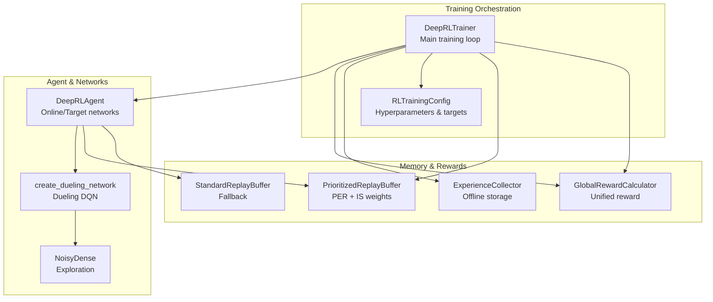
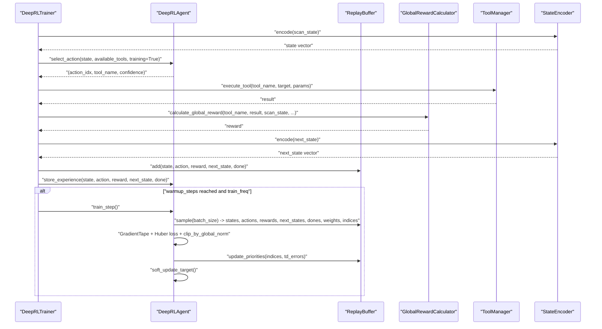
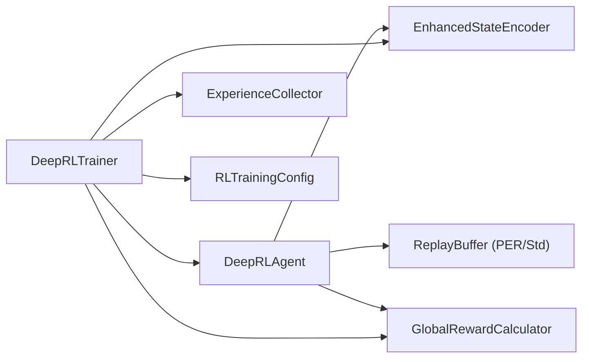

# Training Algorithms and Methods

<cite>
**Referenced Files in This Document**
- [deep_rl_agent.py](file://backend/training/deep_rl_agent.py)
- [deep_rl_trainer.py](file://backend/training/deep_rl_trainer.py)
- [prioritized_replay.py](file://backend/training/prioritized_replay.py)
- [reward_calculator.py](file://backend/training/reward_calculator.py)
- [rl_training_config.py](file://backend/training/rl_training_config.py)
- [experience_collector.py](file://backend/training/experience_collector.py)
- [run_rl_training.py](file://backend/training/run_rl_training.py)
</cite>

## Table of Contents
1. [Introduction](#introduction)
2. [Project Structure](#project-structure)
3. [Core Components](#core-components)
4. [Architecture Overview](#architecture-overview)
5. [Detailed Component Analysis](#detailed-component-analysis)
6. [Dependency Analysis](#dependency-analysis)
7. [Performance Considerations](#performance-considerations)
8. [Troubleshooting Guide](#troubleshooting-guide)
9. [Conclusion](#conclusion)

## Introduction
This document explains the training algorithms and methods implemented for the Deep Reinforcement Learning (DRL) agent used in the Optimus system. It focuses on:
- Double Deep Q-Network (Double DQN) to reduce overestimation bias
- Dueling architecture for improved value estimation
- Prioritized Experience Replay (PER) with importance sampling
- Training loop with GradientTape, Huber loss, gradient clipping, and optimizer configuration
- Soft target network updates, epsilon decay schedule, and unified reward calculation
- Practical examples from the codebase for training steps, experience storage/retrieval, and performance metrics
- Common training issues and mitigation strategies

## Project Structure
The training system is organized around a trainer orchestrating an RL agent, a replay buffer, a reward calculator, and an experience collector. Configuration defines hyperparameters and training schedules.

**Diagram sources**
- [deep_rl_trainer.py](file://backend/training/deep_rl_trainer.py#L27-L122)
- [deep_rl_agent.py](file://backend/training/deep_rl_agent.py#L187-L298)
- [prioritized_replay.py](file://backend/training/prioritized_replay.py#L176-L376)
- [reward_calculator.py](file://backend/training/reward_calculator.py#L13-L169)
- [rl_training_config.py](file://backend/training/rl_training_config.py#L30-L121)
- [experience_collector.py](file://backend/training/experience_collector.py#L49-L162)

**Section sources**
- [deep_rl_trainer.py](file://backend/training/deep_rl_trainer.py#L27-L122)
- [rl_training_config.py](file://backend/training/rl_training_config.py#L30-L121)

## Core Components
- DeepRLAgent: Implements the Dueling Double DQN with optional NoisyDense layers, PER, and target network updates. It performs training steps with GradientTape, Huber loss, and gradient clipping.
- PrioritizedReplayBuffer: Implements PER with SumTree for efficient priority sampling and importance sampling weights; includes a StandardReplayBuffer fallback.
- GlobalRewardCalculator: Computes unified rewards combining environment, episode, and lesson components.
- DeepRLTrainer: Orchestrates episodes, collects experiences, executes tools, calculates rewards, and triggers agent training.
- RLTrainingConfig: Centralizes hyperparameters, scheduling, and reward shaping constants.
- ExperienceCollector: Stores experiences with metadata for later offline training and analysis.

**Section sources**
- [deep_rl_agent.py](file://backend/training/deep_rl_agent.py#L187-L481)
- [prioritized_replay.py](file://backend/training/prioritized_replay.py#L176-L376)
- [reward_calculator.py](file://backend/training/reward_calculator.py#L13-L169)
- [deep_rl_trainer.py](file://backend/training/deep_rl_trainer.py#L27-L122)
- [rl_training_config.py](file://backend/training/rl_training_config.py#L30-L121)
- [experience_collector.py](file://backend/training/experience_collector.py#L49-L162)

## Architecture Overview
The training pipeline integrates state encoding, action selection, tool execution, reward calculation, experience storage, and agent training.

**Diagram sources**
- [deep_rl_trainer.py](file://backend/training/deep_rl_trainer.py#L170-L328)
- [deep_rl_agent.py](file://backend/training/deep_rl_agent.py#L397-L481)
- [prioritized_replay.py](file://backend/training/prioritized_replay.py#L270-L349)
- [reward_calculator.py](file://backend/training/reward_calculator.py#L38-L169)

## Detailed Component Analysis

### Double DQN Implementation and Overestimation Bias Reduction
- Action selection vs. value evaluation separation:
  - Online network selects actions: argmax_a Q_online(s', a)
  - Target network evaluates Q_target(s', argmax_a Q_online(s', a))
- TD target construction: r + γ * Q_target(s', argmax_a Q_online(s', a))
- This reduces overestimation bias compared to single DQN’s r + γ * max_a Q_target(s', a)

Key implementation references:
- Action selection and evaluation separation: [deep_rl_agent.py](file://backend/training/deep_rl_agent.py#L432-L441)
- TD target computation: [deep_rl_agent.py](file://backend/training/deep_rl_agent.py#L440-L441)

**Section sources**
- [deep_rl_agent.py](file://backend/training/deep_rl_agent.py#L432-L441)

### Dueling Architecture for Value Estimation
- Shared feature extraction layers feed two heads:
  - Value head V(s)
  - Advantage head A(s, a)
- Combined Q(s, a) = V(s) + (A(s, a) − mean_a(A(s, a)))
- Improves value estimation stability and generalization

Key implementation references:
- Dueling network creation: [deep_rl_agent.py](file://backend/training/deep_rl_agent.py#L109-L184)

**Section sources**
- [deep_rl_agent.py](file://backend/training/deep_rl_agent.py#L109-L184)

### Prioritized Experience Replay (PER) System
- Priority calculation: π_i ∝ (|TD-error_i| + ε)^α
- Importance sampling weights: w_i ∝ (N · P(i))^-β, normalized by max weight
- Progressive prioritization schedule: β increases from β_start to β_end over β_frames frames
- SumTree enables O(log n) insert/update/sampling

Key implementation references:
- PER buffer initialization and sampling: [prioritized_replay.py](file://backend/training/prioritized_replay.py#L190-L349)
- Priority update from TD errors: [prioritized_replay.py](file://backend/training/prioritized_replay.py#L351-L367)
- SumTree operations: [prioritized_replay.py](file://backend/training/prioritized_replay.py#L27-L174)

**Section sources**
- [prioritized_replay.py](file://backend/training/prioritized_replay.py#L190-L367)

### Training Loop: GradientTape, Loss, Clipping, Optimizer
- GradientTape computes gradients of weighted Huber loss with respect to online network parameters
- Weighted loss uses importance sampling weights from PER
- Gradients clipped globally by norm for stability
- Optimizer applies gradients to update online network weights
- After training step, PER priorities updated using TD errors
- Soft target network update performed with τ parameter

Key implementation references:
- GradientTape and loss: [deep_rl_agent.py](file://backend/training/deep_rl_agent.py#L426-L449)
- Gradient clipping and optimizer: [deep_rl_agent.py](file://backend/training/deep_rl_agent.py#L452-L459)
- PER priority update: [deep_rl_agent.py](file://backend/training/deep_rl_agent.py#L462-L463)
- Soft target update: [deep_rl_agent.py](file://backend/training/deep_rl_agent.py#L483-L489)

**Section sources**
- [deep_rl_agent.py](file://backend/training/deep_rl_agent.py#L426-L489)

### Soft Target Network Updates and Epsilon Decay
- Soft update: θ_target ← τ·θ_online + (1−τ)·θ_target
- Epsilon decay schedule: ε ← max(ε_min, ε·decay) when not using NoisyDense
- NoisyDense layers provide parameter noise for exploration when enabled

Key implementation references:
- Soft update: [deep_rl_agent.py](file://backend/training/deep_rl_agent.py#L483-L489)
- Epsilon decay: [deep_rl_agent.py](file://backend/training/deep_rl_agent.py#L469-L470)
- NoisyDense layer: [deep_rl_agent.py](file://backend/training/deep_rl_agent.py#L43-L106)

**Section sources**
- [deep_rl_agent.py](file://backend/training/deep_rl_agent.py#L483-L489)
- [deep_rl_agent.py](file://backend/training/deep_rl_agent.py#L469-L470)
- [deep_rl_agent.py](file://backend/training/deep_rl_agent.py#L43-L106)

### Unified Reward Calculation System
- Environment reward: severity-based, exploitability bonuses, new service/technology discovery, efficiency bonus
- Penalties: tool failure, timeout, repeated tool, no findings, phase stall, scan timeout
- Episode-end reward: completion bonus scaled by critical/high severity findings, time efficiency bonus, timeout penalty
- Episode and lesson rewards can be combined into a global reward

Key implementation references:
- Global reward calculation: [reward_calculator.py](file://backend/training/reward_calculator.py#L38-L169)
- Episode end reward: [reward_calculator.py](file://backend/training/reward_calculator.py#L192-L222)

**Section sources**
- [reward_calculator.py](file://backend/training/reward_calculator.py#L38-L169)
- [reward_calculator.py](file://backend/training/reward_calculator.py#L192-L222)

### Training Step Implementation Example
- Training step path: [deep_rl_agent.py](file://backend/training/deep_rl_agent.py#L397-L481)
- Sample batch and compute TD target: [deep_rl_agent.py](file://backend/training/deep_rl_agent.py#L407-L441)
- Compute weighted Huber loss and apply gradients: [deep_rl_agent.py](file://backend/training/deep_rl_agent.py#L426-L459)
- Update PER priorities and soft target: [deep_rl_agent.py](file://backend/training/deep_rl_agent.py#L462-L466)

**Section sources**
- [deep_rl_agent.py](file://backend/training/deep_rl_agent.py#L397-L481)

### Experience Storage and Retrieval
- ExperienceCollector stores experiences with metadata and aggregates stats: [experience_collector.py](file://backend/training/experience_collector.py#L49-L162)
- DeepRLTrainer adds experiences to both the agent’s buffer and the collector: [deep_rl_trainer.py](file://backend/training/deep_rl_trainer.py#L274-L297)
- PrioritizedReplayBuffer sampling with importance weights: [prioritized_replay.py](file://backend/training/prioritized_replay.py#L270-L349)

**Section sources**
- [experience_collector.py](file://backend/training/experience_collector.py#L49-L162)
- [deep_rl_trainer.py](file://backend/training/deep_rl_trainer.py#L274-L297)
- [prioritized_replay.py](file://backend/training/prioritized_replay.py#L270-L349)

### Performance Metrics Collection
- DeepRLAgent returns metrics: loss, mean Q-value, mean TD error, epsilon, buffer size, training steps: [deep_rl_agent.py](file://backend/training/deep_rl_agent.py#L474-L481)
- DeepRLTrainer tracks episode rewards, findings counts, lengths, and evaluation metrics: [deep_rl_trainer.py](file://backend/training/deep_rl_trainer.py#L48-L56)

**Section sources**
- [deep_rl_agent.py](file://backend/training/deep_rl_agent.py#L474-L481)
- [deep_rl_trainer.py](file://backend/training/deep_rl_trainer.py#L48-L56)

### Training Configuration and Scheduling
- Hyperparameters: learning rate, gamma, batch size, buffer size, PER parameters, exploration schedule, training schedule: [rl_training_config.py](file://backend/training/rl_training_config.py#L70-L98)
- Targets and reward shaping constants: [rl_training_config.py](file://backend/training/rl_training_config.py#L34-L121)

**Section sources**
- [rl_training_config.py](file://backend/training/rl_training_config.py#L70-L98)
- [rl_training_config.py](file://backend/training/rl_training_config.py#L34-L121)

### End-to-End Training Orchestration
- Episode loop: initialize scan state, available tools, run tool, update state, calculate reward, store experience, train agent: [deep_rl_trainer.py](file://backend/training/deep_rl_trainer.py#L170-L328)
- Checkpoints and evaluation: [deep_rl_trainer.py](file://backend/training/deep_rl_trainer.py#L424-L460)

**Section sources**
- [deep_rl_trainer.py](file://backend/training/deep_rl_trainer.py#L170-L328)
- [deep_rl_trainer.py](file://backend/training/deep_rl_trainer.py#L424-L460)

## Dependency Analysis
The agent depends on the state encoder, replay buffer, and reward calculator. The trainer coordinates these components and manages training schedules and checkpoints.

**Diagram sources**
- [deep_rl_agent.py](file://backend/training/deep_rl_agent.py#L36-L37)
- [deep_rl_trainer.py](file://backend/training/deep_rl_trainer.py#L33-L41)
- [rl_training_config.py](file://backend/training/rl_training_config.py#L30-L121)

**Section sources**
- [deep_rl_agent.py](file://backend/training/deep_rl_agent.py#L36-L37)
- [deep_rl_trainer.py](file://backend/training/deep_rl_trainer.py#L33-L41)
- [rl_training_config.py](file://backend/training/rl_training_config.py#L30-L121)

## Performance Considerations
- Use Huber loss to reduce sensitivity to outliers compared to MSE.
- Apply gradient clipping to prevent exploding gradients.
- Prefer soft target updates with small τ for stability.
- Use PER with progressive β annealing to balance bias and variance.
- Monitor mean Q-value and TD error metrics to detect divergence early.
- Ensure sufficient warmup steps before training begins.

[No sources needed since this section provides general guidance]

## Troubleshooting Guide
Common issues and solutions:
- Vanishing gradients:
  - Verify gradient clipping is active and not disabled.
  - Check learning rate and ensure proper normalization in layers.
  - Inspect batch sizes and ensure adequate diversity in PER sampling.
- Overfitting:
  - Increase PER α to focus more on hard-to-learn experiences.
  - Reduce τ for more frequent target updates.
  - Add dropout or regularization in network layers if applicable.
- Convergence problems:
  - Monitor epsilon decay schedule; ensure it reaches minimal value.
  - Verify PER β is increasing toward 1.0 over time.
  - Check reward shaping constants to avoid sparse rewards.
  - Validate that the agent receives meaningful feedback from tools.

Concrete references:
- Gradient clipping and optimizer application: [deep_rl_agent.py](file://backend/training/deep_rl_agent.py#L452-L459)
- Soft update and epsilon decay: [deep_rl_agent.py](file://backend/training/deep_rl_agent.py#L483-L489)
- PER beta progression: [prioritized_replay.py](file://backend/training/prioritized_replay.py#L227-L231)
- Reward shaping configuration: [rl_training_config.py](file://backend/training/rl_training_config.py#L100-L121)

**Section sources**
- [deep_rl_agent.py](file://backend/training/deep_rl_agent.py#L452-L489)
- [prioritized_replay.py](file://backend/training/prioritized_replay.py#L227-L231)
- [rl_training_config.py](file://backend/training/rl_training_config.py#L100-L121)

## Conclusion
The Optimus DRL training system combines Double DQN with a Dueling architecture, Prioritized Experience Replay, and a unified reward system. The training loop uses GradientTape for gradient computation, Huber loss with importance sampling, gradient clipping, and soft target updates. The trainer orchestrates episodes, manages experience collection, and evaluates performance. Proper configuration of PER, exploration schedules, and reward shaping is essential for stable and efficient learning.