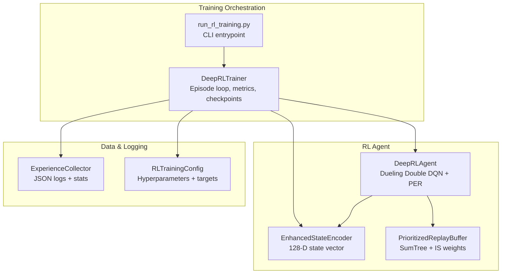
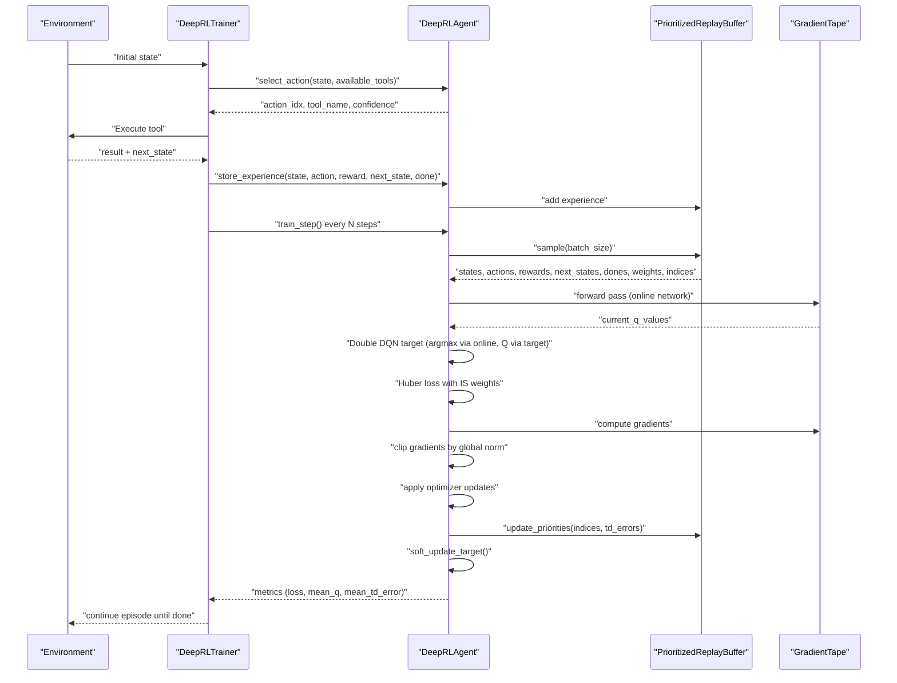
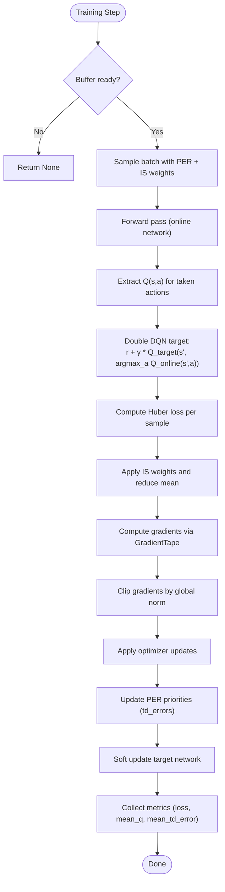
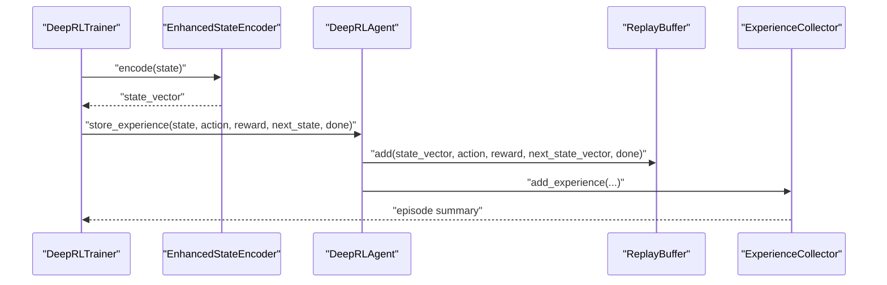
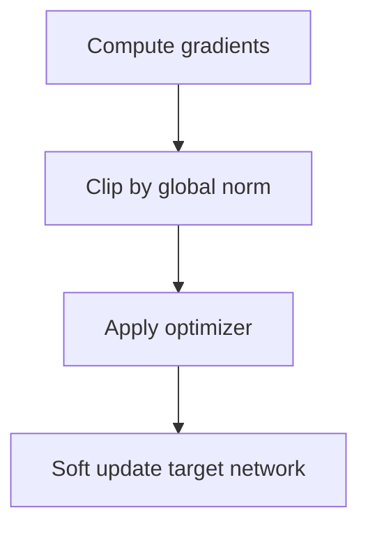
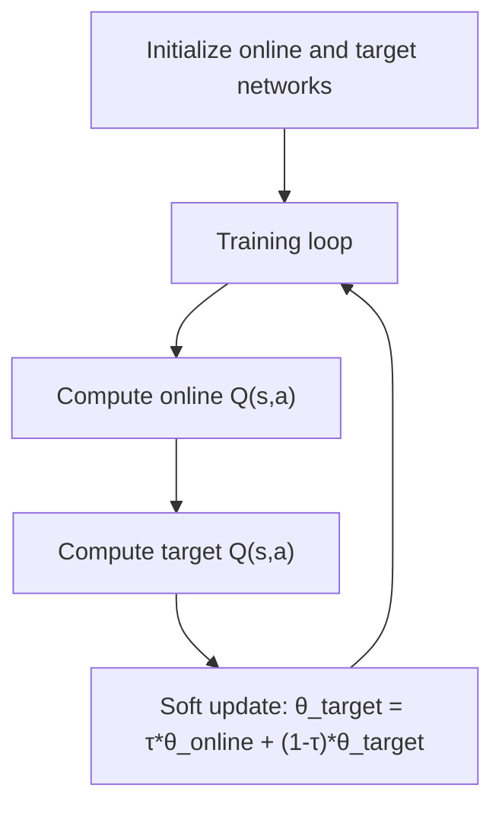
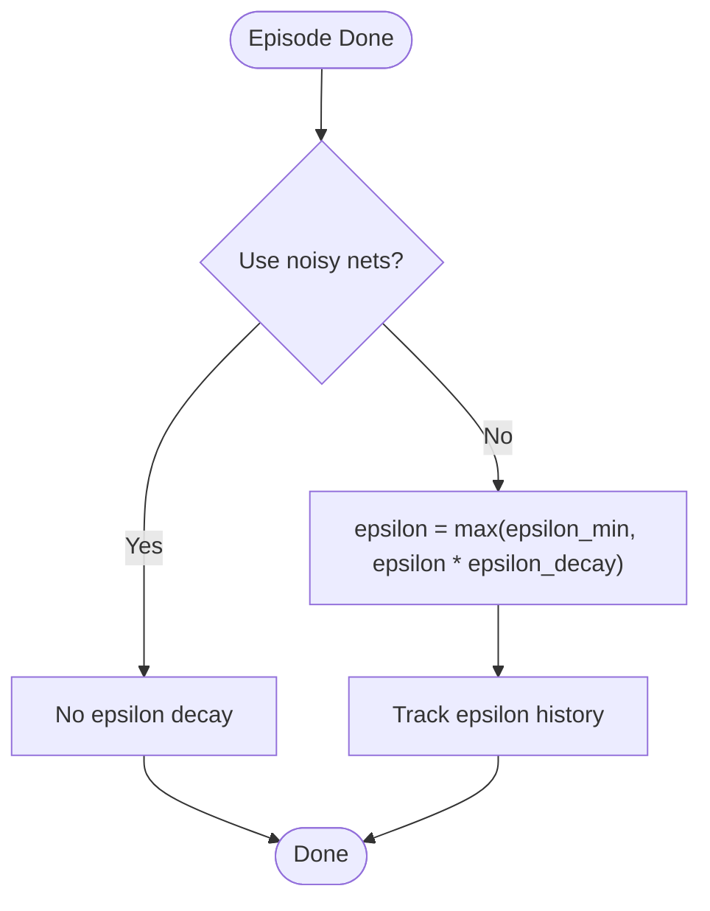
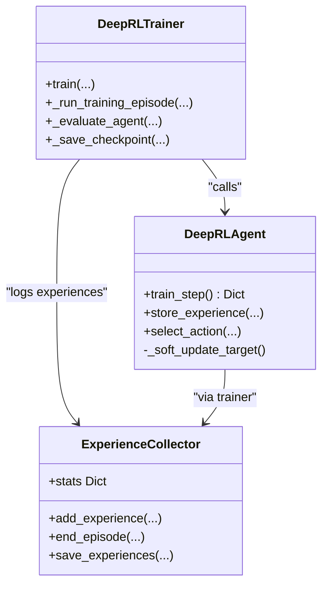
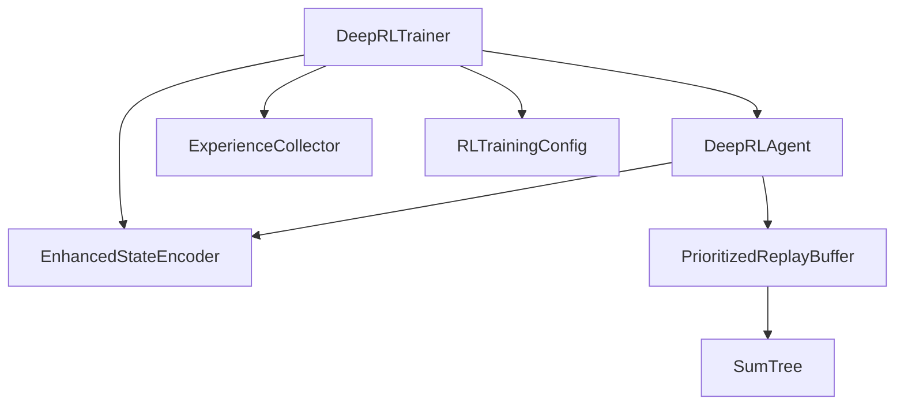

# Training Loop Implementation

<cite>
**Referenced Files in This Document**
- [deep_rl_trainer.py](file://backend/training/deep_rl_trainer.py)
- [deep_rl_agent.py](file://backend/training/deep_rl_agent.py)
- [rl_training_config.py](file://backend/training/rl_training_config.py)
- [prioritized_replay.py](file://backend/training/prioritized_replay.py)
- [experience_collector.py](file://backend/training/experience_collector.py)
- [enhanced_state_encoder.py](file://backend/training/enhanced_state_encoder.py)
- [run_rl_training.py](file://backend/training/run_rl_training.py)
- [test_epsilon_decay.py](file://backend/testing/test_epsilon_decay.py)
</cite>

## Table of Contents
1. [Introduction](#introduction)
2. [Project Structure](#project-structure)
3. [Core Components](#core-components)
4. [Architecture Overview](#architecture-overview)
5. [Detailed Component Analysis](#detailed-component-analysis)
6. [Dependency Analysis](#dependency-analysis)
7. [Performance Considerations](#performance-considerations)
8. [Troubleshooting Guide](#troubleshooting-guide)
9. [Conclusion](#conclusion)
10. [Appendices](#appendices)

## Introduction
This document explains the complete training loop implementation for the Deep Reinforcement Learning (DRL) agent used in the Optimus security automation platform. It covers the end-to-end process from environment interaction to model updates, including batch sampling, gradient computation with TensorFlow GradientTape, Huber loss usage, optimizer updates, gradient clipping, soft target network updates, epsilon decay scheduling, and comprehensive metrics collection. Practical examples are provided via file references to concrete code locations, and guidance is included for configuration, convergence monitoring, and common pitfalls.

## Project Structure
The training system is organized around a trainer orchestrating an RL agent, experience collection, state encoding, and replay buffers. Key modules include:
- Trainer orchestration and episode lifecycle
- DRL agent with Dueling Double DQN, PER, and soft updates
- Prioritized Experience Replay buffer
- Experience collector for logging and analysis
- Enhanced state encoder producing 128-D vectors
- Training configuration and quick-start runner

**Diagram sources**
- [deep_rl_trainer.py](file://backend/training/deep_rl_trainer.py#L58-L122)
- [deep_rl_agent.py](file://backend/training/deep_rl_agent.py#L187-L300)
- [enhanced_state_encoder.py](file://backend/training/enhanced_state_encoder.py#L23-L74)
- [prioritized_replay.py](file://backend/training/prioritized_replay.py#L176-L226)
- [experience_collector.py](file://backend/training/experience_collector.py#L49-L74)
- [rl_training_config.py](file://backend/training/rl_training_config.py#L30-L100)
- [run_rl_training.py](file://backend/training/run_rl_training.py#L91-L130)

**Section sources**
- [deep_rl_trainer.py](file://backend/training/deep_rl_trainer.py#L1-L122)
- [deep_rl_agent.py](file://backend/training/deep_rl_agent.py#L187-L300)
- [rl_training_config.py](file://backend/training/rl_training_config.py#L30-L100)
- [prioritized_replay.py](file://backend/training/prioritized_replay.py#L176-L226)
- [experience_collector.py](file://backend/training/experience_collector.py#L49-L74)
- [enhanced_state_encoder.py](file://backend/training/enhanced_state_encoder.py#L23-L74)
- [run_rl_training.py](file://backend/training/run_rl_training.py#L91-L130)

## Core Components
- DeepRLTrainer: Manages episodes, environment interactions, reward calculation, experience collection, periodic evaluation, and checkpointing.
- DeepRLAgent: Implements the neural network policy with Dueling Double DQN, Prioritized Experience Replay, soft target updates, and optional noisy networks.
- PrioritizedReplayBuffer: Efficiently samples experiences proportional to TD-error with importance-sampling weights.
- ExperienceCollector: Stores and aggregates episode experiences and statistics for analysis and offline training.
- EnhancedStateEncoder: Produces a fixed-size 128-D state vector capturing phase, target context, vulnerability context, tool history, progress metrics, and intelligence features.
- RLTrainingConfig: Centralized configuration for targets, hyperparameters, and reward shaping.

Key training loop responsibilities:
- Batch sampling: PER buffer with stratified sampling and IS weights.
- Gradient computation: tf.GradientTape for forward pass and gradient calculation.
- Loss: Huber loss applied element-wise and globally normalized with IS weights.
- Optimizer updates: Adam optimizer applies clipped gradients.
- Stability: Gradient global norm clipping and soft target network updates.
- Exploration: Noisy networks or epsilon-greedy decay.
- Metrics: Loss, mean Q-value, TD error magnitude, buffer size, training steps.

**Section sources**
- [deep_rl_trainer.py](file://backend/training/deep_rl_trainer.py#L170-L328)
- [deep_rl_agent.py](file://backend/training/deep_rl_agent.py#L397-L482)
- [prioritized_replay.py](file://backend/training/prioritized_replay.py#L270-L350)
- [experience_collector.py](file://backend/training/experience_collector.py#L83-L130)
- [enhanced_state_encoder.py](file://backend/training/enhanced_state_encoder.py#L75-L139)
- [rl_training_config.py](file://backend/training/rl_training_config.py#L30-L122)

## Architecture Overview
The training pipeline integrates environment interaction, experience storage, and agent learning in a closed loop.

**Diagram sources**
- [deep_rl_trainer.py](file://backend/training/deep_rl_trainer.py#L170-L328)
- [deep_rl_agent.py](file://backend/training/deep_rl_agent.py#L397-L482)
- [prioritized_replay.py](file://backend/training/prioritized_replay.py#L270-L350)

## Detailed Component Analysis

### Training Step Execution
The agent’s training step performs:
- Batch sampling from the PER buffer with importance weights.
- Forward pass on the online network to compute current Q-values.
- Double DQN target computation using online-selected actions and target network Q-values.
- Huber loss computation per-sample and global normalization with IS weights.
- GradientTape-based gradient computation and optimizer application.
- Gradient clipping by global norm for numerical stability.
- PER priority updates based on TD errors.
- Soft target network update controlled by a small tau coefficient.

**Diagram sources**
- [deep_rl_agent.py](file://backend/training/deep_rl_agent.py#L397-L482)
- [prioritized_replay.py](file://backend/training/prioritized_replay.py#L351-L368)

**Section sources**
- [deep_rl_agent.py](file://backend/training/deep_rl_agent.py#L397-L482)

### Batch Processing and Experience Collection
- The trainer encodes the current and next states using the enhanced state encoder.
- Experiences are stored in both the agent’s replay buffer and the centralized experience collector.
- The collector aggregates episode-level summaries and maintains statistics for analysis.

**Diagram sources**
- [deep_rl_trainer.py](file://backend/training/deep_rl_trainer.py#L268-L298)
- [enhanced_state_encoder.py](file://backend/training/enhanced_state_encoder.py#L75-L139)
- [experience_collector.py](file://backend/training/experience_collector.py#L83-L130)
- [deep_rl_agent.py](file://backend/training/deep_rl_agent.py#L371-L396)

**Section sources**
- [deep_rl_trainer.py](file://backend/training/deep_rl_trainer.py#L268-L298)
- [experience_collector.py](file://backend/training/experience_collector.py#L83-L130)
- [enhanced_state_encoder.py](file://backend/training/enhanced_state_encoder.py#L75-L139)
- [deep_rl_agent.py](file://backend/training/deep_rl_agent.py#L371-L396)

### Gradient Clipping and Numerical Stability
- Gradients are clipped using global norm threshold to prevent exploding gradients.
- Soft updates stabilize learning by slowly copying online network weights to the target network.

**Diagram sources**
- [deep_rl_agent.py](file://backend/training/deep_rl_agent.py#L454-L467)

**Section sources**
- [deep_rl_agent.py](file://backend/training/deep_rl_agent.py#L454-L467)

### Soft Update Strategy for Target Network Weights
- The target network weights are updated using a small tau coefficient: θ_target = τ*θ_online + (1-τ)*θ_target.
- This stabilizes training compared to hard updates.

**Diagram sources**
- [deep_rl_agent.py](file://backend/training/deep_rl_agent.py#L483-L494)

**Section sources**
- [deep_rl_agent.py](file://backend/training/deep_rl_agent.py#L483-L494)

### Epsilon Decay Schedule
- Epsilon-greedy exploration decays multiplicatively after each episode completion.
- The decay rate and minimum value are configurable in the RL agent initialization.

**Diagram sources**
- [deep_rl_agent.py](file://backend/training/deep_rl_agent.py#L468-L471)
- [test_epsilon_decay.py](file://backend/testing/test_epsilon_decay.py#L8-L32)

**Section sources**
- [deep_rl_agent.py](file://backend/training/deep_rl_agent.py#L468-L471)
- [test_epsilon_decay.py](file://backend/testing/test_epsilon_decay.py#L8-L32)

### Training Metrics Collection
- Loss values: scalar average loss from Huber loss.
- Q-value statistics: mean of current Q-values.
- TD error tracking: mean absolute TD error.
- Buffer metrics: current buffer size and effective batch size.
- Exploration: epsilon value (when applicable).
- Episode-level: total reward, steps, findings count, and time.

**Diagram sources**
- [deep_rl_agent.py](file://backend/training/deep_rl_agent.py#L397-L482)
- [experience_collector.py](file://backend/training/experience_collector.py#L83-L162)
- [deep_rl_trainer.py](file://backend/training/deep_rl_trainer.py#L170-L328)

**Section sources**
- [deep_rl_agent.py](file://backend/training/deep_rl_agent.py#L474-L481)
- [experience_collector.py](file://backend/training/experience_collector.py#L131-L162)
- [deep_rl_trainer.py](file://backend/training/deep_rl_trainer.py#L424-L439)

### Concrete Code Examples (by file reference)
- Training step execution: [deep_rl_agent.py](file://backend/training/deep_rl_agent.py#L397-L482)
- Batch processing and experience storage: [deep_rl_trainer.py](file://backend/training/deep_rl_trainer.py#L268-L298)
- Performance monitoring metrics: [deep_rl_agent.py](file://backend/training/deep_rl_agent.py#L474-L481)
- Epsilon decay verification: [test_epsilon_decay.py](file://backend/testing/test_epsilon_decay.py#L8-L32)

**Section sources**
- [deep_rl_agent.py](file://backend/training/deep_rl_agent.py#L397-L482)
- [deep_rl_trainer.py](file://backend/training/deep_rl_trainer.py#L268-L298)
- [test_epsilon_decay.py](file://backend/testing/test_epsilon_decay.py#L8-L32)

## Dependency Analysis
The training system exhibits clear separation of concerns with explicit dependencies:
- DeepRLTrainer depends on DeepRLAgent, EnhancedStateEncoder, ExperienceCollector, and RLTrainingConfig.
- DeepRLAgent depends on EnhancedStateEncoder and PrioritizedReplayBuffer.
- PrioritizedReplayBuffer uses a SumTree data structure for efficient priority sampling.
- ExperienceCollector is used by the trainer to maintain episode-level statistics.

**Diagram sources**
- [deep_rl_trainer.py](file://backend/training/deep_rl_trainer.py#L33-L41)
- [deep_rl_agent.py](file://backend/training/deep_rl_agent.py#L255-L284)
- [prioritized_replay.py](file://backend/training/prioritized_replay.py#L27-L55)

**Section sources**
- [deep_rl_trainer.py](file://backend/training/deep_rl_trainer.py#L33-L41)
- [deep_rl_agent.py](file://backend/training/deep_rl_agent.py#L255-L284)
- [prioritized_replay.py](file://backend/training/prioritized_replay.py#L27-L55)

## Performance Considerations
- Use of Huber loss reduces sensitivity to outliers compared to MSE, improving robustness.
- Gradient clipping prevents unstable updates and accelerates convergence.
- Soft target updates stabilize Q-value targets, reducing oscillations.
- Prioritized Experience Replay focuses learning on informative transitions, improving sample efficiency.
- Noisy networks can replace epsilon-greedy exploration, potentially yielding better exploration properties.
- State encoding compresses rich contextual information into a compact 128-D vector for efficient neural network processing.

[No sources needed since this section provides general guidance]

## Troubleshooting Guide
Common issues and solutions:
- Poor convergence or divergence:
  - Verify Huber loss is being computed and optimizer is applied.
  - Check gradient clipping thresholds and adjust if gradients appear unstable.
  - Ensure soft target updates are occurring regularly.
  - References: [deep_rl_agent.py](file://backend/training/deep_rl_agent.py#L446-L467)

- Low exploration or premature exploitation:
  - Confirm epsilon decay is functioning or noisy networks are enabled.
  - Validate that epsilon is decaying to an appropriate minimum value.
  - References: [deep_rl_agent.py](file://backend/training/deep_rl_agent.py#L468-L471), [test_epsilon_decay.py](file://backend/testing/test_epsilon_decay.py#L8-L32)

- Memory pressure or slow training:
  - Reduce batch size or enable PER with appropriate alpha/beta parameters.
  - Monitor buffer size and adjust capacity as needed.
  - References: [rl_training_config.py](file://backend/training/rl_training_config.py#L77-L88), [prioritized_replay.py](file://backend/training/prioritized_replay.py#L190-L226)

- Inconsistent state representation:
  - Validate state vector shapes and ranges produced by the encoder.
  - Ensure state encoding handles missing fields gracefully.
  - References: [enhanced_state_encoder.py](file://backend/training/enhanced_state_encoder.py#L75-L139)

- Checkpointing and resuming:
  - Confirm both model weights and training state are saved/loaded correctly.
  - References: [deep_rl_agent.py](file://backend/training/deep_rl_agent.py#L617-L698)

**Section sources**
- [deep_rl_agent.py](file://backend/training/deep_rl_agent.py#L446-L471)
- [test_epsilon_decay.py](file://backend/testing/test_epsilon_decay.py#L8-L32)
- [rl_training_config.py](file://backend/training/rl_training_config.py#L77-L88)
- [prioritized_replay.py](file://backend/training/prioritized_replay.py#L190-L226)
- [enhanced_state_encoder.py](file://backend/training/enhanced_state_encoder.py#L75-L139)
- [deep_rl_agent.py](file://backend/training/deep_rl_agent.py#L617-L698)

## Conclusion
The training loop integrates environment interaction, experience collection, and DRL updates with robust mechanisms for stability and efficiency. The combination of Dueling Double DQN, Prioritized Experience Replay, Huber loss, gradient clipping, and soft target updates provides a solid foundation for learning effective tool selection policies. Proper configuration of exploration, buffer parameters, and evaluation cadence ensures reliable convergence and meaningful performance tracking.

[No sources needed since this section summarizes without analyzing specific files]

## Appendices

### Training Configuration Parameters
Key hyperparameters and settings are defined centrally:
- Targets, episodes per target, time limits, and reward shaping.
- DQN hyperparameters: learning rate, discount factor, batch size, buffer size, target update frequency.
- Prioritized Experience Replay: alpha, beta annealing schedule.
- Exploration: noisy networks toggle, epsilon decay schedule.
- Training schedule: warmup steps, training frequency, saving and evaluation frequencies.
- Paths for model, experience, and logs.

**Section sources**
- [rl_training_config.py](file://backend/training/rl_training_config.py#L30-L122)

### Quick Start and CLI
The training runner supports specifying targets, episodes, max time, resuming from checkpoints, and dry runs.

**Section sources**
- [run_rl_training.py](file://backend/training/run_rl_training.py#L91-L201)