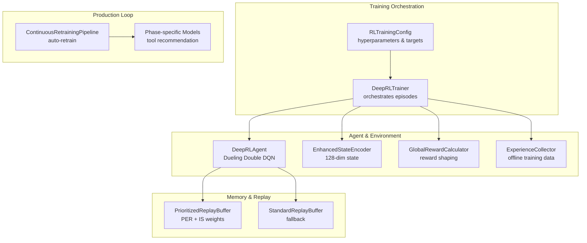
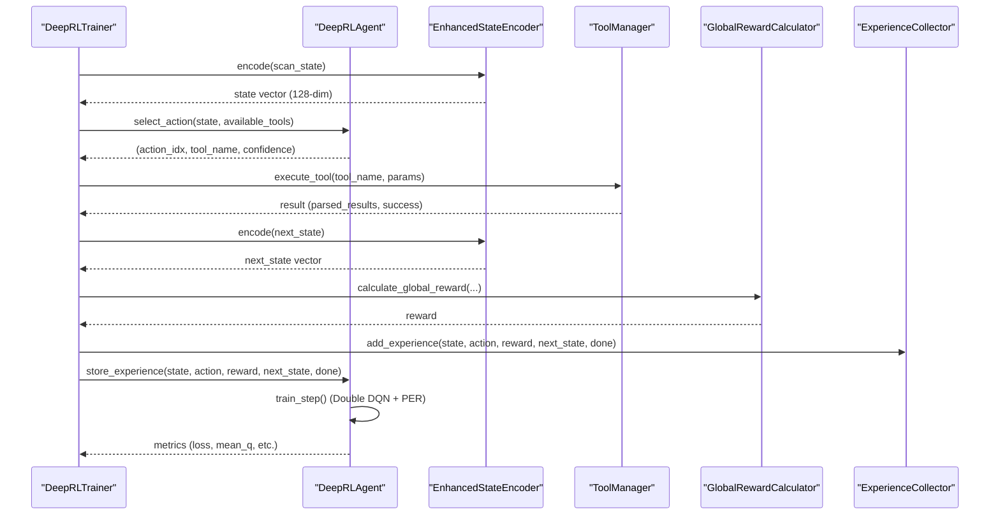
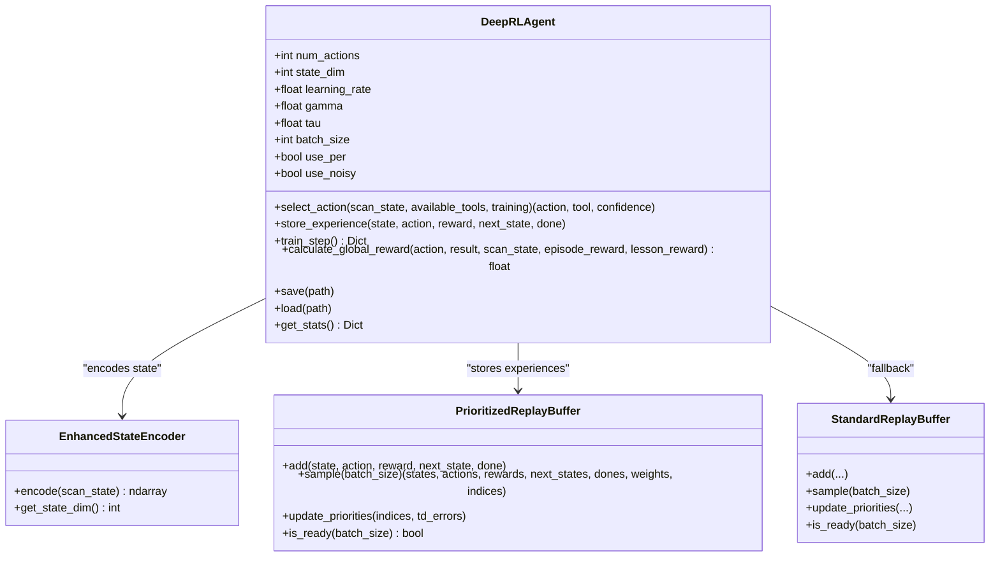
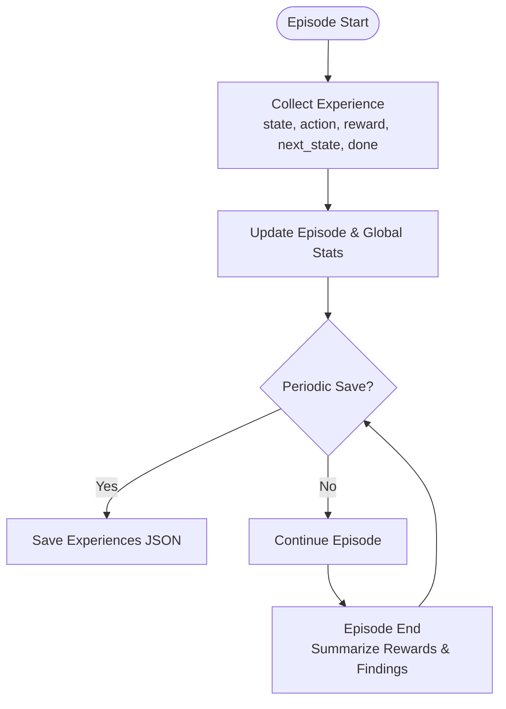
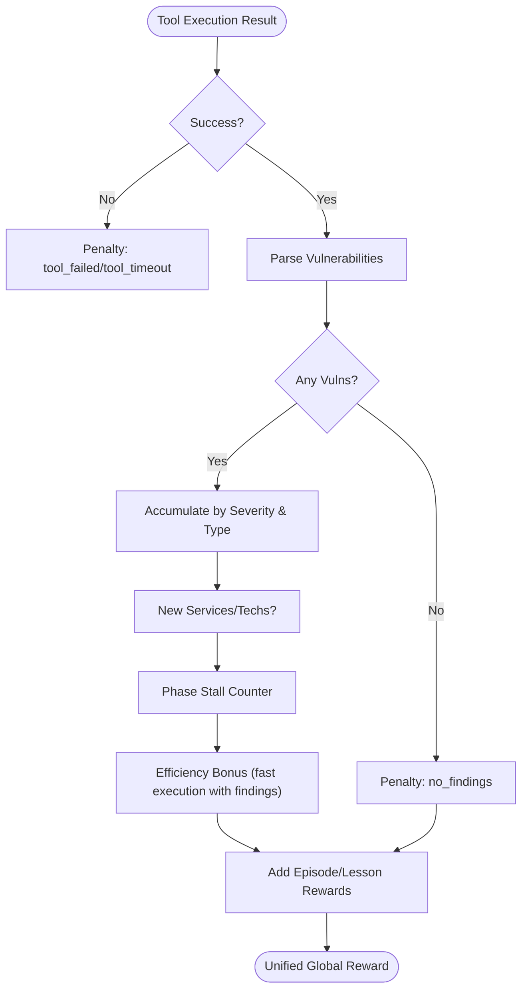
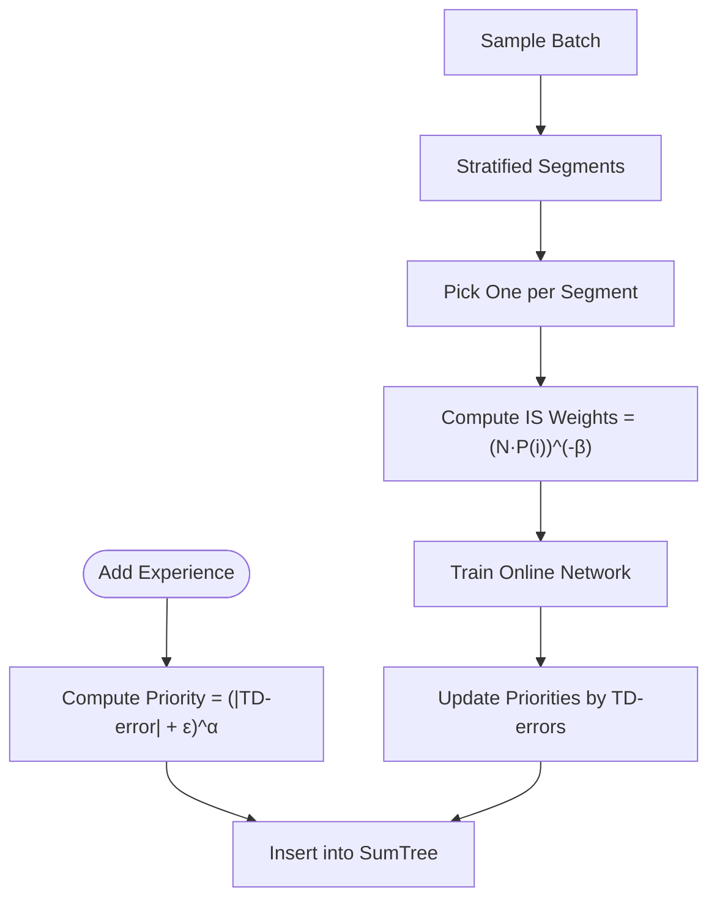
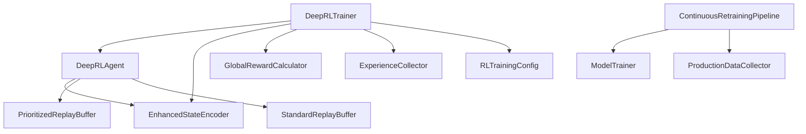

# Machine Learning and Training

<cite>
**Referenced Files in This Document**
- [deep_rl_agent.py](file://backend/training/deep_rl_agent.py)
- [deep_rl_trainer.py](file://backend/training/deep_rl_trainer.py)
- [experience_collector.py](file://backend/training/experience_collector.py)
- [reward_calculator.py](file://backend/training/reward_calculator.py)
- [enhanced_state_encoder.py](file://backend/training/enhanced_state_encoder.py)
- [rl_training_config.py](file://backend/training/rl_training_config.py)
- [prioritized_replay.py](file://backend/training/prioritized_replay.py)
- [run_rl_training.py](file://backend/training/run_rl_training.py)
- [continuous_retraining.py](file://backend/training/continuous_retraining.py)
- [model_trainer.py](file://backend/training/model_trainer.py)
- [evaluate_rl_agent.py](file://backend/testing/evaluate_rl_agent.py)
- [best_model_meta.json](file://backend/backend/data/models/deep_rl/best_model_meta.json)
- [training_state.json](file://backend/backend/data/models/deep_rl/best_model_agent/training_state.json)
- [ml_training_state.json](file://backend/data/ml_training_state.json)
</cite>

## Table of Contents
1. [Introduction](#introduction)
2. [Project Structure](#project-structure)
3. [Core Components](#core-components)
4. [Architecture Overview](#architecture-overview)
5. [Detailed Component Analysis](#detailed-component-analysis)
6. [Dependency Analysis](#dependency-analysis)
7. [Performance Considerations](#performance-considerations)
8. [Troubleshooting Guide](#troubleshooting-guide)
9. [Conclusion](#conclusion)
10. [Appendices](#appendices)

## Introduction
This document explains the machine learning and training systems in Optimus with a focus on deep reinforcement learning (deep RL). It covers the deep RL agent architecture, experience replay mechanisms, reward shaping, state representation, and continuous retraining. It also provides practical guidance for training data collection, model evaluation, and performance optimization, while highlighting the relationships between training components and their impact on autonomous agent performance.

## Project Structure
The deep RL training system is organized around modular components that orchestrate autonomous scanning, experience collection, reward calculation, and model training. Supporting components handle configuration, scheduling, and continuous improvement.

**Diagram sources**
- [deep_rl_trainer.py](file://backend/training/deep_rl_trainer.py#L27-L122)
- [deep_rl_agent.py](file://backend/training/deep_rl_agent.py#L187-L299)
- [enhanced_state_encoder.py](file://backend/training/enhanced_state_encoder.py#L23-L74)
- [reward_calculator.py](file://backend/training/reward_calculator.py#L13-L46)
- [experience_collector.py](file://backend/training/experience_collector.py#L49-L73)
- [prioritized_replay.py](file://backend/training/prioritized_replay.py#L176-L226)
- [rl_training_config.py](file://backend/training/rl_training_config.py#L30-L100)
- [continuous_retraining.py](file://backend/training/continuous_retraining.py#L27-L64)

**Section sources**
- [deep_rl_trainer.py](file://backend/training/deep_rl_trainer.py#L27-L122)
- [rl_training_config.py](file://backend/training/rl_training_config.py#L30-L100)

## Core Components
- Deep RL Agent: Implements a Dueling Double DQN with optional Noisy Networks, Prioritized Experience Replay, and soft-target updates. It selects actions based on a 128-dimensional state vector produced by the enhanced state encoder and stores experiences for training.
- Experience Collector: Captures (state, action, reward, next_state, done) tuples during training episodes and supports saving/loading for offline training.
- Reward Calculator: Computes unified global rewards combining environment, episode, and lesson rewards to guide policy learning.
- State Encoder: Produces a rich 128-dimensional state vector encoding phase, target context, vulnerability context, tool history, progress metrics, and intelligence features.
- Replay Buffers: Prioritized Replay Buffer (with importance sampling) and Standard Replay Buffer for stable and efficient learning.
- Training Orchestration: DeepRLTrainer coordinates episodes, tool execution, reward calculation, experience storage, and periodic evaluation.
- Continuous Retraining: Automated pipeline to retrain phase-specific models using production data and schedule periodic improvements.

**Section sources**
- [deep_rl_agent.py](file://backend/training/deep_rl_agent.py#L187-L299)
- [experience_collector.py](file://backend/training/experience_collector.py#L49-L73)
- [reward_calculator.py](file://backend/training/reward_calculator.py#L13-L46)
- [enhanced_state_encoder.py](file://backend/training/enhanced_state_encoder.py#L23-L74)
- [prioritized_replay.py](file://backend/training/prioritized_replay.py#L176-L226)
- [deep_rl_trainer.py](file://backend/training/deep_rl_trainer.py#L27-L57)
- [continuous_retraining.py](file://backend/training/continuous_retraining.py#L27-L64)

## Architecture Overview
The deep RL agent operates within an episode loop that alternates between selecting actions, executing tools, receiving results, calculating rewards, and storing experiences. The agent trains via Double DQN with Huber loss, uses PER for efficient learning, and applies soft updates to stabilize training.

**Diagram sources**
- [deep_rl_trainer.py](file://backend/training/deep_rl_trainer.py#L170-L328)
- [deep_rl_agent.py](file://backend/training/deep_rl_agent.py#L397-L482)
- [enhanced_state_encoder.py](file://backend/training/enhanced_state_encoder.py#L75-L138)
- [reward_calculator.py](file://backend/training/reward_calculator.py#L38-L169)
- [experience_collector.py](file://backend/training/experience_collector.py#L83-L130)

## Detailed Component Analysis

### Deep RL Agent
The agent implements a Dueling Double DQN with optional Noisy Networks for exploration, Prioritized Experience Replay, and soft-target updates. It exposes methods for action selection, experience storage, and training steps.

Key implementation highlights:
- Dueling architecture separates value and advantage streams to improve value estimation.
- Double DQN reduces overestimation by decoupling action selection and value evaluation.
- Noisy Dense layers provide factorized Gaussian noise for exploration.
- Prioritized Replay focuses on important experiences using TD-error-based priorities.
- Soft target updates stabilize learning by slowly copying online network weights.

**Diagram sources**
- [deep_rl_agent.py](file://backend/training/deep_rl_agent.py#L187-L299)
- [enhanced_state_encoder.py](file://backend/training/enhanced_state_encoder.py#L75-L138)
- [prioritized_replay.py](file://backend/training/prioritized_replay.py#L176-L226)
- [prioritized_replay.py](file://backend/training/prioritized_replay.py#L378-L461)

**Section sources**
- [deep_rl_agent.py](file://backend/training/deep_rl_agent.py#L187-L299)
- [deep_rl_agent.py](file://backend/training/deep_rl_agent.py#L397-L482)
- [deep_rl_agent.py](file://backend/training/deep_rl_agent.py#L495-L596)

### Experience Collector
The experience collector aggregates episodes into a structured dataset suitable for offline training. It tracks episode statistics, tools used, findings by severity, and saves experiences to JSON for later use.

Key implementation highlights:
- Stores experiences with metadata (tool_name, phase, target, findings counts, execution time, success).
- Provides batch retrieval and conversion to NumPy arrays for training.
- Saves and loads experience datasets for reproducible offline training.

**Diagram sources**
- [experience_collector.py](file://backend/training/experience_collector.py#L75-L162)
- [experience_collector.py](file://backend/training/experience_collector.py#L164-L201)

**Section sources**
- [experience_collector.py](file://backend/training/experience_collector.py#L49-L73)
- [experience_collector.py](file://backend/training/experience_collector.py#L83-L130)
- [experience_collector.py](file://backend/training/experience_collector.py#L164-L201)

### Reward Calculator
The reward calculator computes a unified global reward by combining environment-level rewards (success, findings, new discoveries), penalties (repeated tools, timeouts, stalls), and optional episode/lesson bonuses. It supports episode-end bonuses and time-efficiency incentives.

Key implementation highlights:
- Environment reward shaped by severity, exploitability, and CVE presence.
- Penalties for timeouts, repeated tools, and lack of findings.
- Episode-end bonuses for successful completion and time efficiency.
- Episode stall detection to penalize lack of progress.

**Diagram sources**
- [reward_calculator.py](file://backend/training/reward_calculator.py#L38-L169)

**Section sources**
- [reward_calculator.py](file://backend/training/reward_calculator.py#L13-L46)
- [reward_calculator.py](file://backend/training/reward_calculator.py#L38-L169)
- [reward_calculator.py](file://backend/training/reward_calculator.py#L192-L222)

### State Representation
The enhanced state encoder produces a 128-dimensional vector capturing:
- Phase encoding (5 dims)
- Target context (25 dims): ports, services, complexity
- Vulnerability context (30 dims): severity distribution, types, exploitability, CVEs, severity stats
- Tool history (40 dims): flags, statistics, recent tools
- Progress metrics (15 dims): time, coverage, stall detection, phase progress
- Intelligence features (13 dims): technology stack, intelligence data, target profile

This rich representation enables the agent to make informed decisions across phases and contexts.

**Section sources**
- [enhanced_state_encoder.py](file://backend/training/enhanced_state_encoder.py#L23-L74)
- [enhanced_state_encoder.py](file://backend/training/enhanced_state_encoder.py#L75-L138)
- [enhanced_state_encoder.py](file://backend/training/enhanced_state_encoder.py#L517-L562)

### Prioritized Experience Replay
The replay buffer prioritizes experiences based on TD error using a sum tree for efficient sampling. It applies importance sampling weights to correct for bias and anneals the importance sampling exponent over time.

Key implementation highlights:
- SumTree structure supports O(log n) insert/update/retrieve.
- Stratified sampling ensures diverse batches.
- Priority updates clamp values and maintain max priority for new experiences.
- Beta annealing balances between exploitation and exploration.

**Diagram sources**
- [prioritized_replay.py](file://backend/training/prioritized_replay.py#L176-L226)
- [prioritized_replay.py](file://backend/training/prioritized_replay.py#L270-L349)
- [prioritized_replay.py](file://backend/training/prioritized_replay.py#L351-L367)

**Section sources**
- [prioritized_replay.py](file://backend/training/prioritized_replay.py#L176-L226)
- [prioritized_replay.py](file://backend/training/prioritized_replay.py#L270-L349)
- [prioritized_replay.py](file://backend/training/prioritized_replay.py#L351-L367)

### Training Orchestration
The DeepRLTrainer orchestrates training across multiple targets, manages episodes, evaluates performance, and periodically saves checkpoints. It integrates the RL agent, state encoder, reward calculator, and experience collector.

Key implementation highlights:
- Episode loop with phase transitions and termination conditions.
- Periodic evaluation and best-model saving.
- Checkpointing of training state and agent weights.
- Logging and reporting of training summaries.

**Section sources**
- [deep_rl_trainer.py](file://backend/training/deep_rl_trainer.py#L27-L57)
- [deep_rl_trainer.py](file://backend/training/deep_rl_trainer.py#L123-L168)
- [deep_rl_trainer.py](file://backend/training/deep_rl_trainer.py#L170-L328)
- [deep_rl_trainer.py](file://backend/training/deep_rl_trainer.py#L424-L439)
- [deep_rl_trainer.py](file://backend/training/deep_rl_trainer.py#L440-L481)

### Continuous Retraining
The continuous retraining pipeline automatically collects production data, exports it to training format, backs up existing models, trains new models, validates improvements, and deploys better-performing models. It supports scheduled execution and manual triggers.

Key implementation highlights:
- Production data collection and export to training logs.
- Per-phase model training and validation against baselines.
- Deployment decisions based on minimum accuracy improvement thresholds.
- Scheduling support using the schedule library.

**Section sources**
- [continuous_retraining.py](file://backend/training/continuous_retraining.py#L27-L64)
- [continuous_retraining.py](file://backend/training/continuous_retraining.py#L104-L127)
- [continuous_retraining.py](file://backend/training/continuous_retraining.py#L128-L212)
- [continuous_retraining.py](file://backend/training/continuous_retraining.py#L281-L301)

## Dependency Analysis
The training system exhibits strong cohesion within each component and clear interfaces between them. Coupling is primarily through shared data structures (experience tuples, state vectors, reward values) and configuration objects.

**Diagram sources**
- [deep_rl_agent.py](file://backend/training/deep_rl_agent.py#L252-L283)
- [deep_rl_trainer.py](file://backend/training/deep_rl_trainer.py#L33-L41)
- [rl_training_config.py](file://backend/training/rl_training_config.py#L30-L100)
- [continuous_retraining.py](file://backend/training/continuous_retraining.py#L21-L37)

**Section sources**
- [deep_rl_agent.py](file://backend/training/deep_rl_agent.py#L252-L283)
- [deep_rl_trainer.py](file://backend/training/deep_rl_trainer.py#L33-L41)
- [rl_training_config.py](file://backend/training/rl_training_config.py#L30-L100)
- [continuous_retraining.py](file://backend/training/continuous_retraining.py#L21-L37)

## Performance Considerations
- Use Prioritized Experience Replay to accelerate learning by focusing on informative experiences.
- Apply Double DQN with soft target updates to stabilize training and reduce overestimation.
- Prefer Noisy Networks for exploration to avoid manual epsilon decay tuning.
- Monitor training metrics (loss, mean Q-value, TD error) and adjust hyperparameters accordingly.
- Ensure sufficient warmup steps before training begins and maintain adequate replay buffer capacity.
- Use standardized evaluation metrics (episode reward, findings count, convergence) to assess agent performance.

[No sources needed since this section provides general guidance]

## Troubleshooting Guide
Common issues and resolutions:
- TensorFlow availability: Ensure TensorFlow is installed; otherwise, the agent raises an ImportError.
- Checkpoint loading failures: Verify checkpoint directories and JSON state files exist and are readable.
- Insufficient training episodes: The evaluation suite indicates insufficient training if fewer than 200 episodes were recorded.
- Model integrity: Validate model file existence and loadability; missing or corrupted files will cause loading failures.
- Unicode encoding errors during retraining: Set environment variables to disable oneDNN custom operations if encountering encoding errors.

**Section sources**
- [deep_rl_agent.py](file://backend/training/deep_rl_agent.py#L234-L236)
- [deep_rl_agent.py](file://backend/training/deep_rl_agent.py#L652-L697)
- [evaluate_rl_agent.py](file://backend/testing/evaluate_rl_agent.py#L105-L156)
- [data\owasp_training_new\workflow_results_owasp_workflow_20251129_112421.json](file://backend/data/owasp_training_new/workflow_results_owasp_workflow_20251129_112421.json#L17-L19)

## Conclusion
Optimus’s deep RL system combines a robust agent architecture with rich state representation, prioritized experience replay, and comprehensive reward shaping. The training orchestration and continuous retraining pipeline ensure sustained performance improvements over time. By following the documented procedures and leveraging the provided components, teams can effectively train, evaluate, and deploy autonomous decision-making capabilities for security operations.

[No sources needed since this section summarizes without analyzing specific files]

## Appendices

### Practical Examples

- Training Data Collection
  - Use the experience collector to capture episodes and save experiences to JSON for offline training.
  - Example path: [experience_collector.py](file://backend/training/experience_collector.py#L164-L184)

- Model Evaluation Procedures
  - Evaluate learning convergence, exploration/exploitation balance, and model integrity using the evaluation suite.
  - Example path: [evaluate_rl_agent.py](file://backend/testing/evaluate_rl_agent.py#L25-L69)

- Performance Optimization Techniques
  - Tune hyperparameters (learning rate, gamma, batch size, PER alpha/beta) via configuration.
  - Example path: [rl_training_config.py](file://backend/training/rl_training_config.py#L65-L121)

- Continuous Retraining
  - Trigger retraining when production data thresholds are met; optionally schedule daily retraining.
  - Example path: [continuous_retraining.py](file://backend/training/continuous_retraining.py#L104-L127)

- Training Execution
  - Start training with default or custom configurations; resume from checkpoints if needed.
  - Example path: [run_rl_training.py](file://backend/training/run_rl_training.py#L91-L108)

**Section sources**
- [experience_collector.py](file://backend/training/experience_collector.py#L164-L184)
- [evaluate_rl_agent.py](file://backend/testing/evaluate_rl_agent.py#L25-L69)
- [rl_training_config.py](file://backend/training/rl_training_config.py#L65-L121)
- [continuous_retraining.py](file://backend/training/continuous_retraining.py#L104-L127)
- [run_rl_training.py](file://backend/training/run_rl_training.py#L91-L108)

### Training Artifacts and Metrics
- Best model metadata and training history:
  - [best_model_meta.json](file://backend/backend/data/models/deep_rl/best_model_meta.json#L1-L138)
  - [training_state.json](file://backend/backend/data/models/deep_rl/best_model_agent/training_state.json)
- ML training state and metrics:
  - [ml_training_state.json](file://backend/data/ml_training_state.json#L1-L51)

**Section sources**
- [best_model_meta.json](file://backend/backend/data/models/deep_rl/best_model_meta.json#L1-L138)
- [training_state.json](file://backend/backend/data/models/deep_rl/best_model_agent/training_state.json)
- [ml_training_state.json](file://backend/data/ml_training_state.json#L1-L51)