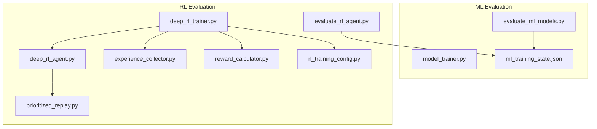
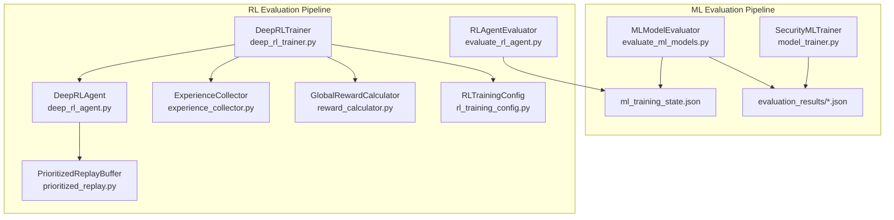
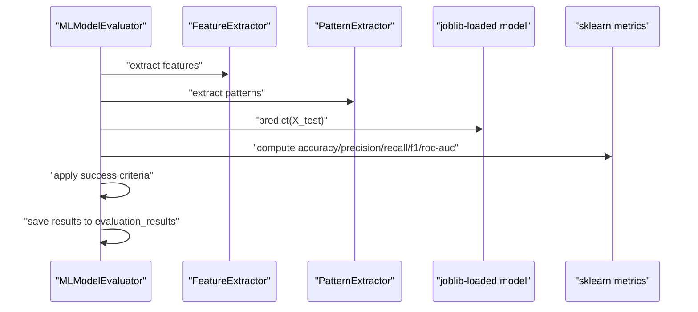
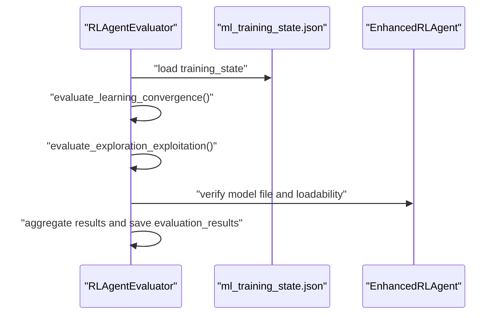
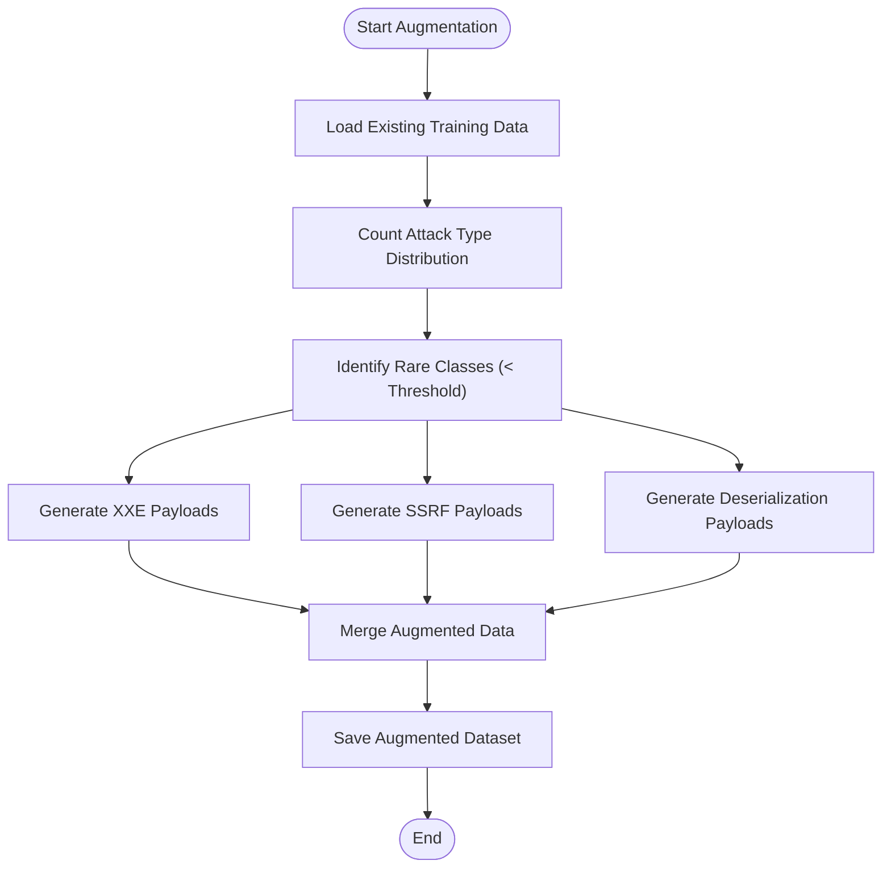
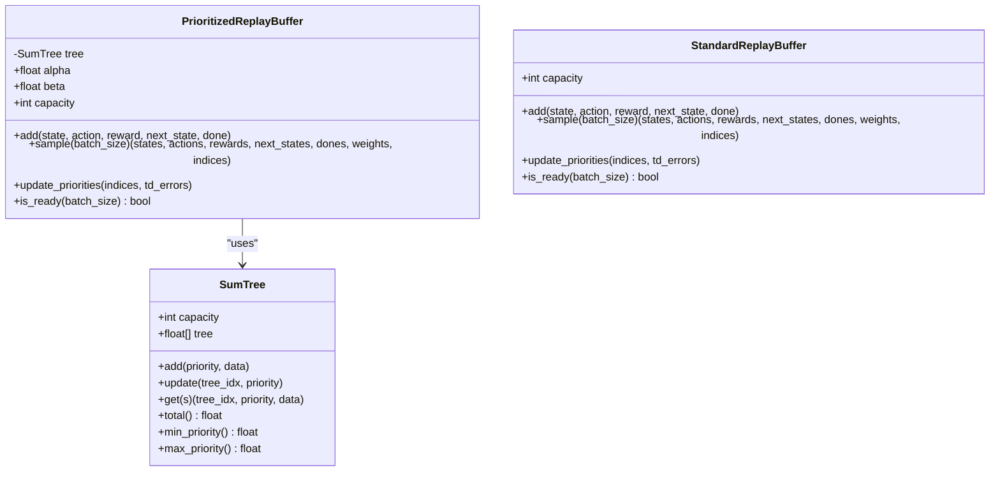
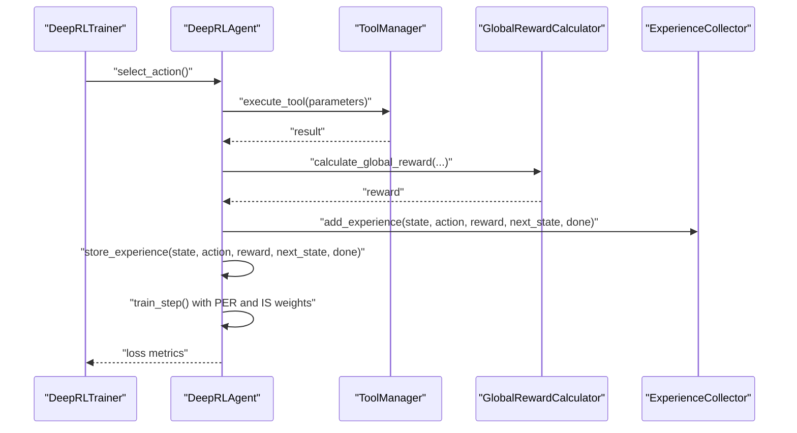
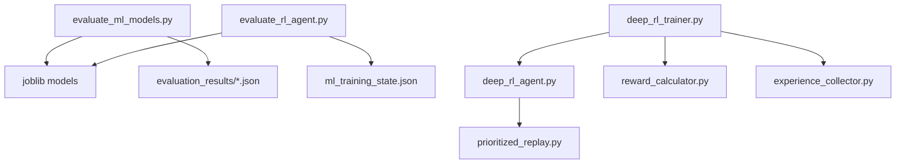

# Evaluation Metrics and Validation

<cite>
**Referenced Files in This Document**
- [evaluate_ml_models.py](file://backend/testing/evaluate_ml_models.py)
- [evaluate_rl_agent.py](file://backend/testing/evaluate_rl_agent.py)
- [data_augmentation.py](file://backend/training/data_augmentation.py)
- [prioritized_replay.py](file://backend/training/prioritized_replay.py)
- [reward_calculator.py](file://backend/training/reward_calculator.py)
- [experience_collector.py](file://backend/training/experience_collector.py)
- [deep_rl_trainer.py](file://backend/training/deep_rl_trainer.py)
- [rl_training_config.py](file://backend/training/rl_training_config.py)
- [deep_rl_agent.py](file://backend/training/deep_rl_agent.py)
- [model_trainer.py](file://backend/training/model_trainer.py)
- [ml_training_state.json](file://backend/data/ml_training_state.json)
- [vulnerability_detector_evaluation.json](file://backend/evaluation_results/vulnerability_detector_evaluation.json)
- [attack_classifier_evaluation.json](file://backend/evaluation_results/attack_classifier_evaluation.json)
- [rl_convergence_evaluation.json](file://backend/evaluation_results/rl_convergence_evaluation.json)
</cite>

## Table of Contents
1. [Introduction](#introduction)
2. [Project Structure](#project-structure)
3. [Core Components](#core-components)
4. [Architecture Overview](#architecture-overview)
5. [Detailed Component Analysis](#detailed-component-analysis)
6. [Dependency Analysis](#dependency-analysis)
7. [Performance Considerations](#performance-considerations)
8. [Troubleshooting Guide](#troubleshooting-guide)
9. [Conclusion](#conclusion)
10. [Appendices](#appendices)

## Introduction
This document describes the complete evaluation framework for both machine learning models and reinforcement learning (RL) agents within the Optimus system. It covers performance metrics calculation, success criteria, reward-based evaluation, convergence detection, and validation pipelines. It also documents data augmentation techniques for improving model robustness, the prioritized replay system for experience weighting and importance sampling, and practical guidance for selecting appropriate metrics and interpreting results.

## Project Structure
The evaluation system spans two primary areas:
- Machine Learning evaluation scripts that assess vulnerability detectors, attack classifiers, and severity predictors.
- RL evaluation and training components that validate convergence, exploration/exploitation balance, and model integrity, and that support reward shaping and experience replay.

**Diagram sources**
- [evaluate_ml_models.py](file://backend/testing/evaluate_ml_models.py#L1-L316)
- [model_trainer.py](file://backend/training/model_trainer.py#L1-L444)
- [ml_training_state.json](file://backend/data/ml_training_state.json#L1-L51)
- [evaluate_rl_agent.py](file://backend/testing/evaluate_rl_agent.py#L1-L223)
- [deep_rl_trainer.py](file://backend/training/deep_rl_trainer.py#L1-L547)
- [deep_rl_agent.py](file://backend/training/deep_rl_agent.py#L1-L724)
- [prioritized_replay.py](file://backend/training/prioritized_replay.py#L1-L461)
- [experience_collector.py](file://backend/training/experience_collector.py#L1-L240)
- [reward_calculator.py](file://backend/training/reward_calculator.py#L1-L234)
- [rl_training_config.py](file://backend/training/rl_training_config.py#L1-L159)

**Section sources**
- [evaluate_ml_models.py](file://backend/testing/evaluate_ml_models.py#L1-L316)
- [evaluate_rl_agent.py](file://backend/testing/evaluate_rl_agent.py#L1-L223)
- [deep_rl_trainer.py](file://backend/training/deep_rl_trainer.py#L1-L547)
- [prioritized_replay.py](file://backend/training/prioritized_replay.py#L1-L461)
- [experience_collector.py](file://backend/training/experience_collector.py#L1-L240)
- [reward_calculator.py](file://backend/training/reward_calculator.py#L1-L234)
- [rl_training_config.py](file://backend/training/rl_training_config.py#L1-L159)
- [deep_rl_agent.py](file://backend/training/deep_rl_agent.py#L1-L724)
- [model_trainer.py](file://backend/training/model_trainer.py#L1-L444)
- [ml_training_state.json](file://backend/data/ml_training_state.json#L1-L51)

## Core Components
- ML Model Evaluator: Computes classification/regression metrics, applies success criteria, and saves evaluation results.
- RL Agent Evaluator: Validates learning convergence, exploration decay, and model integrity; aggregates pass/fail outcomes.
- Data Augmentation: Generates synthetic payloads for rare attack categories to improve minority class performance.
- Prioritized Replay Buffer: Implements importance-sampling-corrected experience replay with TD-error-based priorities.
- Reward Calculator: Defines unified reward shaping for tool execution results and environment dynamics.
- Experience Collector: Captures (state, action, reward, next_state, done) tuples for offline analysis and training.
- RL Trainer: Orchestrates multi-target training, episode execution, reward calculation, and periodic evaluation.
- RL Training Config: Centralizes hyperparameters, reward weights, and training schedules.

**Section sources**
- [evaluate_ml_models.py](file://backend/testing/evaluate_ml_models.py#L25-L316)
- [evaluate_rl_agent.py](file://backend/testing/evaluate_rl_agent.py#L18-L223)
- [data_augmentation.py](file://backend/training/data_augmentation.py#L8-L338)
- [prioritized_replay.py](file://backend/training/prioritized_replay.py#L176-L461)
- [reward_calculator.py](file://backend/training/reward_calculator.py#L13-L234)
- [experience_collector.py](file://backend/training/experience_collector.py#L49-L240)
- [deep_rl_trainer.py](file://backend/training/deep_rl_trainer.py#L27-L547)
- [rl_training_config.py](file://backend/training/rl_training_config.py#L30-L159)

## Architecture Overview
The evaluation architecture integrates ML and RL components with training and validation artifacts.

**Diagram sources**
- [evaluate_ml_models.py](file://backend/testing/evaluate_ml_models.py#L25-L316)
- [model_trainer.py](file://backend/training/model_trainer.py#L20-L444)
- [ml_training_state.json](file://backend/data/ml_training_state.json#L1-L51)
- [evaluate_rl_agent.py](file://backend/testing/evaluate_rl_agent.py#L18-L223)
- [deep_rl_trainer.py](file://backend/training/deep_rl_trainer.py#L27-L547)
- [deep_rl_agent.py](file://backend/training/deep_rl_agent.py#L187-L724)
- [prioritized_replay.py](file://backend/training/prioritized_replay.py#L176-L461)
- [experience_collector.py](file://backend/training/experience_collector.py#L49-L240)
- [reward_calculator.py](file://backend/training/reward_calculator.py#L13-L234)
- [rl_training_config.py](file://backend/training/rl_training_config.py#L30-L159)

## Detailed Component Analysis

### ML Model Evaluation Framework
The ML evaluation suite computes classification and regression metrics, applies domain-specific success criteria, and persists structured results.

Key capabilities:
- Vulnerability Detector (binary classification): Accuracy, Precision, Recall, F1, ROC-AUC, confusion matrix, and false positive rate thresholds.
- Attack Type Classifier (multi-class): Macro F1, per-class F1 for critical attacks, and detailed per-class reports.
- Severity Predictor (regression): MAE, RMSE, R², and severity band accuracy.

Success criteria:
- Vulnerability Detector: F1 ≥ 0.85, Recall ≥ 0.80, Precision ≥ 0.85.
- Attack Classifier: Macro F1 ≥ 0.80, minimum critical attack F1 ≥ 0.75.
- Severity Predictor: MAE ≤ 1.0, R² ≥ 0.75, severity band accuracy ≥ 0.85.

**Diagram sources**
- [evaluate_ml_models.py](file://backend/testing/evaluate_ml_models.py#L25-L316)

**Section sources**
- [evaluate_ml_models.py](file://backend/testing/evaluate_ml_models.py#L25-L316)
- [model_trainer.py](file://backend/training/model_trainer.py#L20-L444)
- [ml_training_state.json](file://backend/data/ml_training_state.json#L3-L26)

### RL Agent Evaluation Framework
The RL evaluation suite validates training convergence, exploration behavior, and model integrity, and aggregates pass/fail outcomes.

Key tests:
- Learning Convergence: Verifies sufficient episodes trained; recommends training if insufficient.
- Exploration/Exploitation Balance: Checks final epsilon decay toward target threshold.
- Model File Integrity: Ensures model file exists, is loadable, and has expected metadata.

**Diagram sources**
- [evaluate_rl_agent.py](file://backend/testing/evaluate_rl_agent.py#L18-L223)

**Section sources**
- [evaluate_rl_agent.py](file://backend/testing/evaluate_rl_agent.py#L18-L223)
- [ml_training_state.json](file://backend/data/ml_training_state.json#L27-L32)

### Data Augmentation for Robustness
The data augmentation module generates synthetic payloads for rare attack categories to address class imbalance and improve generalization.

Techniques:
- XXE payload generation with template-based mutations and severity assignment.
- SSRF payload generation targeting internal endpoints and protocol variations.
- Insecure deserialization payloads across multiple languages.
- Automatic identification of rare attack types and augmentation to target thresholds.

**Diagram sources**
- [data_augmentation.py](file://backend/training/data_augmentation.py#L218-L270)

**Section sources**
- [data_augmentation.py](file://backend/training/data_augmentation.py#L8-L338)

### Prioritized Replay System and Importance Sampling
The prioritized replay buffer focuses learning on important experiences using TD-error-based priorities and importance sampling weights to correct for bias.

Key components:
- SumTree: Efficient O(log n) insertion and sampling using cumulative priority sums.
- PrioritizedReplayBuffer: Stratified sampling across priority segments, computing IS weights, and updating priorities.
- StandardReplayBuffer: Uniform sampling fallback.

**Diagram sources**
- [prioritized_replay.py](file://backend/training/prioritized_replay.py#L27-L174)
- [prioritized_replay.py](file://backend/training/prioritized_replay.py#L176-L461)

**Section sources**
- [prioritized_replay.py](file://backend/training/prioritized_replay.py#L176-L461)

### Reward-Based Evaluation and Convergence Detection
The reward calculator defines unified reward shaping across tool execution results, environment dynamics, and episode completion. The RL trainer orchestrates training loops, episode execution, reward computation, and periodic evaluation.

Key elements:
- GlobalRewardCalculator: Environment, episode, and lesson reward composition with penalties for timeouts, stalls, and repeated tools; bonuses for findings and efficiency.
- DeepRLTrainer: Manages multi-target training, episode lifecycle, experience collection, and checkpointing.
- ExperienceCollector: Stores experiences with metadata for later analysis and offline training.
- RLTrainingConfig: Centralizes hyperparameters, reward weights, and scheduling.

**Diagram sources**
- [deep_rl_trainer.py](file://backend/training/deep_rl_trainer.py#L170-L328)
- [deep_rl_agent.py](file://backend/training/deep_rl_agent.py#L371-L482)
- [reward_calculator.py](file://backend/training/reward_calculator.py#L38-L169)
- [experience_collector.py](file://backend/training/experience_collector.py#L83-L130)
- [rl_training_config.py](file://backend/training/rl_training_config.py#L30-L159)

**Section sources**
- [reward_calculator.py](file://backend/training/reward_calculator.py#L13-L234)
- [deep_rl_trainer.py](file://backend/training/deep_rl_trainer.py#L27-L547)
- [experience_collector.py](file://backend/training/experience_collector.py#L49-L240)
- [rl_training_config.py](file://backend/training/rl_training_config.py#L30-L159)
- [deep_rl_agent.py](file://backend/training/deep_rl_agent.py#L187-L724)

## Dependency Analysis
The evaluation system exhibits clear separation of concerns:
- ML evaluation depends on trained models and test datasets, producing structured JSON results.
- RL evaluation consumes training state and model artifacts, validating convergence and integrity.
- RL training integrates reward shaping, experience collection, replay buffers, and agent training.

**Diagram sources**
- [evaluate_ml_models.py](file://backend/testing/evaluate_ml_models.py#L25-L316)
- [evaluate_rl_agent.py](file://backend/testing/evaluate_rl_agent.py#L18-L223)
- [deep_rl_trainer.py](file://backend/training/deep_rl_trainer.py#L27-L547)
- [deep_rl_agent.py](file://backend/training/deep_rl_agent.py#L187-L724)
- [prioritized_replay.py](file://backend/training/prioritized_replay.py#L176-L461)
- [experience_collector.py](file://backend/training/experience_collector.py#L49-L240)
- [reward_calculator.py](file://backend/training/reward_calculator.py#L13-L234)

**Section sources**
- [evaluate_ml_models.py](file://backend/testing/evaluate_ml_models.py#L25-L316)
- [evaluate_rl_agent.py](file://backend/testing/evaluate_rl_agent.py#L18-L223)
- [deep_rl_trainer.py](file://backend/training/deep_rl_trainer.py#L27-L547)
- [deep_rl_agent.py](file://backend/training/deep_rl_agent.py#L187-L724)
- [prioritized_replay.py](file://backend/training/prioritized_replay.py#L176-L461)
- [experience_collector.py](file://backend/training/experience_collector.py#L49-L240)
- [reward_calculator.py](file://backend/training/reward_calculator.py#L13-L234)

## Performance Considerations
- RL training efficiency: Prioritized replay reduces on-policy inefficiency by focusing on high-TD-error transitions; importance sampling weights mitigate bias introduced by non-uniform sampling.
- Exploration: Noisy networks or epsilon decay should reach target thresholds for stable policy learning; insufficient decay indicates need for more training.
- Reward shaping: Balanced reward weights prevent reward hacking and encourage desired behaviors such as finding critical vulnerabilities and progressing through phases.
- Data quality: For ML models, ensure representative test splits and balanced evaluation metrics; consider stratification and hold-out sets for unbiased performance estimates.

## Troubleshooting Guide
Common issues and resolutions:
- Insufficient RL training episodes: Increase episodes trained; convergence requires adequate exposure to diverse scenarios.
- High false positive rate in vulnerability detection: Investigate feature scaling, class imbalance, and threshold tuning; consider cost-sensitive metrics.
- Poor per-class performance in attack classification: Apply class balancing, increase estimator counts, and expand training data for rare classes.
- Low severity prediction accuracy: Improve feature engineering and consider ensemble regressors; validate R² and MAE thresholds.
- Model loading failures: Verify model file existence, correct format, and compatible versions; re-save weights if corrupted.

**Section sources**
- [evaluate_rl_agent.py](file://backend/testing/evaluate_rl_agent.py#L25-L69)
- [evaluate_ml_models.py](file://backend/testing/evaluate_ml_models.py#L35-L109)
- [ml_training_state.json](file://backend/data/ml_training_state.json#L27-L32)

## Conclusion
The evaluation framework provides a robust foundation for validating both ML models and RL agents. By combining standardized metrics, success criteria, reward shaping, and replay-based learning, the system ensures reliable performance assessment and continuous improvement. Structured evaluation results enable informed decisions about model readiness and deployment.

## Appendices

### Practical Evaluation Script Usage
- ML model evaluation: Run the ML evaluator to compute metrics and apply success criteria; review saved JSON results in the evaluation results directory.
- RL agent evaluation: Execute the RL evaluator to validate convergence, exploration, and model integrity; inspect aggregated results and recommendations.
- Data augmentation: Use the augmentation module to generate synthetic samples for rare attack types and retrain classifiers to improve minority class performance.
- Automated pipelines: Integrate evaluation scripts into CI/CD to automatically validate model performance and RL convergence after training runs.

### Metric Interpretation Guidelines
- Binary classification (vulnerability detector): Prioritize F1 and recall for minimizing missed vulnerabilities; ensure precision remains high to reduce false alarms.
- Multi-class classification (attack classifier): Focus on macro F1 and per-class F1 for critical attacks; investigate class imbalance and feature representation.
- Regression (severity predictor): Monitor MAE and R²; severity band accuracy provides practical interpretability for risk categorization.
- RL reward-based assessment: Track average episode reward and findings; ensure reward shaping encourages desired behaviors and avoids unintended side effects.

### Benchmarking Against Baselines
- Establish baselines using historical metrics from the training state file.
- Compare current evaluation results to baseline thresholds to quantify improvements or regressions.
- Use cross-validation or hold-out sets to obtain statistically robust estimates of performance differences.

**Section sources**
- [ml_training_state.json](file://backend/data/ml_training_state.json#L3-L26)
- [vulnerability_detector_evaluation.json](file://backend/evaluation_results/vulnerability_detector_evaluation.json#L4-L16)
- [attack_classifier_evaluation.json](file://backend/evaluation_results/attack_classifier_evaluation.json#L4-L8)
- [rl_convergence_evaluation.json](file://backend/evaluation_results/rl_convergence_evaluation.json#L4-L8)