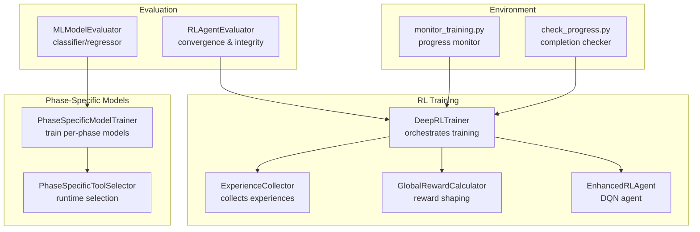
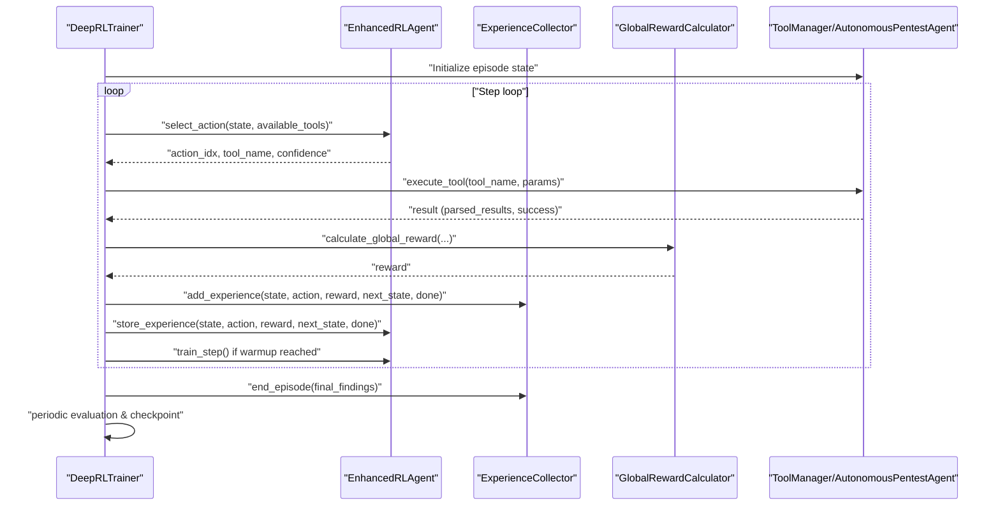
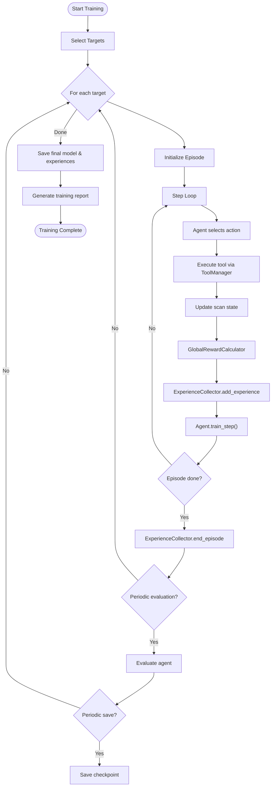
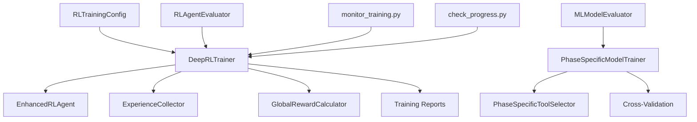

# Model Training and Evaluation

<cite>
**Referenced Files in This Document**
- [deep_rl_trainer.py](file://backend/training/deep_rl_trainer.py)
- [experience_collector.py](file://backend/training/experience_collector.py)
- [reward_calculator.py](file://backend/training/reward_calculator.py)
- [rl_trainer.py](file://backend/training/rl_trainer.py)
- [model_trainer.py](file://backend/training/model_trainer.py)
- [rl_training_config.py](file://backend/training/rl_training_config.py)
- [curriculum_config.py](file://backend/training/curriculum_config.py)
- [phase_specific_models.py](file://backend/training/phase_specific_models.py)
- [train_phase_models.py](file://backend/training/train_phase_models.py)
- [run_rl_training.py](file://backend/training/run_rl_training.py)
- [evaluate_rl_agent.py](file://backend/testing/evaluate_rl_agent.py)
- [evaluate_ml_models.py](file://backend/testing/evaluate_ml_models.py)
- [monitor_training.py](file://backend/training_environment/monitor_training.py)
- [check_progress.py](file://backend/training_environment/check_progress.py)
</cite>

## Table of Contents
1. [Introduction](#introduction)
2. [Project Structure](#project-structure)
3. [Core Components](#core-components)
4. [Architecture Overview](#architecture-overview)
5. [Detailed Component Analysis](#detailed-component-analysis)
6. [Dependency Analysis](#dependency-analysis)
7. [Performance Considerations](#performance-considerations)
8. [Troubleshooting Guide](#troubleshooting-guide)
9. [Conclusion](#conclusion)
10. [Appendices](#appendices)

## Introduction
This document describes the model training and evaluation systems used by the project’s reinforcement learning (RL) and machine learning (ML) components. It explains the training pipeline architecture, including data collection via experience collectors, reward calculation mechanisms, and model evaluation procedures. It also documents curriculum learning, phase-specific model training, and cross-validation techniques. Practical guidance is provided for training configuration, hyperparameter tuning, performance monitoring, data quality assurance, checkpointing strategies, and automated workflows. Finally, it covers environment setup, resource allocation, and troubleshooting common training issues.

## Project Structure
The training system is organized around modular components:
- RL training orchestration and execution
- Experience collection and replay
- Reward shaping and episode termination
- Phase-specific ML models for tool recommendation
- Cross-validation and evaluation suites
- Automated monitoring and progress tracking

**Diagram sources**
- [deep_rl_trainer.py](file://backend/training/deep_rl_trainer.py#L27-L121)
- [experience_collector.py](file://backend/training/experience_collector.py#L49-L162)
- [reward_calculator.py](file://backend/training/reward_calculator.py#L13-L169)
- [rl_trainer.py](file://backend/training/rl_trainer.py#L15-L242)
- [phase_specific_models.py](file://backend/training/phase_specific_models.py#L15-L404)
- [evaluate_rl_agent.py](file://backend/testing/evaluate_rl_agent.py#L18-L156)
- [evaluate_ml_models.py](file://backend/testing/evaluate_ml_models.py#L25-L276)
- [monitor_training.py](file://backend/training_environment/monitor_training.py#L12-L51)
- [check_progress.py](file://backend/training_environment/check_progress.py#L12-L49)

**Section sources**
- [deep_rl_trainer.py](file://backend/training/deep_rl_trainer.py#L27-L121)
- [rl_training_config.py](file://backend/training/rl_training_config.py#L31-L138)

## Core Components
- Deep RL Trainer: orchestrates multi-target training, episode loops, periodic evaluation, and checkpointing.
- Experience Collector: records state-action-reward transitions with metadata for offline analysis.
- Reward Calculator: computes unified global rewards from tool outcomes, progress, and penalties.
- RL Agent: DQN-based agent with epsilon-greedy exploration and replay memory.
- Phase-Specific Model Trainer: trains per-phase ML models for tool recommendation with cross-validation.
- Evaluation Suites: automated tests for RL convergence, exploration decay, and ML model performance.
- Monitoring Utilities: scripts to observe training progress and completion.

**Section sources**
- [deep_rl_trainer.py](file://backend/training/deep_rl_trainer.py#L27-L121)
- [experience_collector.py](file://backend/training/experience_collector.py#L49-L162)
- [reward_calculator.py](file://backend/training/reward_calculator.py#L13-L169)
- [rl_trainer.py](file://backend/training/rl_trainer.py#L15-L242)
- [phase_specific_models.py](file://backend/training/phase_specific_models.py#L15-L404)
- [evaluate_rl_agent.py](file://backend/testing/evaluate_rl_agent.py#L18-L156)
- [evaluate_ml_models.py](file://backend/testing/evaluate_ml_models.py#L25-L276)
- [monitor_training.py](file://backend/training_environment/monitor_training.py#L12-L51)
- [check_progress.py](file://backend/training_environment/check_progress.py#L12-L49)

## Architecture Overview
The RL training pipeline integrates an RL agent with a simulated pentesting environment. The agent selects tools per phase, executes them, and receives rewards shaped by findings, efficiency, and penalties for timeouts or stalls. Experiences are stored and later used for training and evaluation.

**Diagram sources**
- [deep_rl_trainer.py](file://backend/training/deep_rl_trainer.py#L170-L328)
- [rl_trainer.py](file://backend/training/rl_trainer.py#L109-L242)
- [experience_collector.py](file://backend/training/experience_collector.py#L83-L162)
- [reward_calculator.py](file://backend/training/reward_calculator.py#L38-L169)

## Detailed Component Analysis

### Deep RL Trainer
The Deep RL Trainer coordinates multi-target training, episode execution, reward computation, experience storage, and periodic evaluation. It supports resuming from checkpoints, saving best and final models, and generating training reports.

Key responsibilities:
- Manage training targets and episodes
- Orchestrate episode loops with phase transitions
- Integrate reward calculation and experience collection
- Periodic evaluation and checkpointing
- Training summary generation and reporting

**Diagram sources**
- [deep_rl_trainer.py](file://backend/training/deep_rl_trainer.py#L58-L121)
- [deep_rl_trainer.py](file://backend/training/deep_rl_trainer.py#L123-L168)
- [deep_rl_trainer.py](file://backend/training/deep_rl_trainer.py#L170-L328)

**Section sources**
- [deep_rl_trainer.py](file://backend/training/deep_rl_trainer.py#L27-L121)
- [deep_rl_trainer.py](file://backend/training/deep_rl_trainer.py#L123-L168)
- [deep_rl_trainer.py](file://backend/training/deep_rl_trainer.py#L170-L328)
- [deep_rl_trainer.py](file://backend/training/deep_rl_trainer.py#L424-L461)
- [deep_rl_trainer.py](file://backend/training/deep_rl_trainer.py#L482-L505)

### Experience Collector
The Experience Collector maintains a rolling buffer of experiences and metadata, aggregates episode summaries, and persists experiences to disk for offline analysis. It tracks statistics such as total experiences, rewards, tools used, and findings by severity.

Key responsibilities:
- Record experiences with state/action/reward/next_state/done
- Maintain episode-level summaries
- Persist experiences to JSON
- Provide batches for offline training

**Section sources**
- [experience_collector.py](file://backend/training/experience_collector.py#L49-L162)
- [experience_collector.py](file://backend/training/experience_collector.py#L164-L201)
- [experience_collector.py](file://backend/training/experience_collector.py#L211-L222)

### Reward Calculator
The Global Reward Calculator computes unified rewards combining environment, episode, and lesson components. It incentivizes vulnerability discovery, new technology/service detection, efficient execution, and penalizes timeouts, repeated tools, and stalls. Episode-end bonuses/penalties further shape long-term behavior.

Key responsibilities:
- Compute environment reward from tool outcomes
- Track phase progress and stall penalties
- Apply efficiency bonuses
- Aggregate episode-end rewards

**Section sources**
- [reward_calculator.py](file://backend/training/reward_calculator.py#L13-L169)
- [reward_calculator.py](file://backend/training/reward_calculator.py#L192-L222)

### RL Agent (DQN)
The Enhanced RL Agent implements a DQN with separate Q-network and target network, epsilon-greedy action selection, and replay memory. It supports saving/loading full training state and updating target networks periodically.

Key responsibilities:
- Build and maintain Q-networks
- Epsilon-greedy action selection with available tools mask
- Experience replay and loss computation
- Periodic target network updates
- Save/load model state

**Section sources**
- [rl_trainer.py](file://backend/training/rl_trainer.py#L15-L67)
- [rl_trainer.py](file://backend/training/rl_trainer.py#L69-L108)
- [rl_trainer.py](file://backend/training/rl_trainer.py#L114-L147)
- [rl_trainer.py](file://backend/training/rl_trainer.py#L201-L242)
- [rl_trainer.py](file://backend/training/rl_trainer.py#L287-L350)

### Phase-Specific Models
Phase-specific models are trained to recommend tools per pentesting phase using contextual features. Each phase has dedicated features and tools. Cross-validation evaluates model quality, and runtime selector loads models to provide recommendations.

Key responsibilities:
- Define phase-specific features and tools
- Train Random Forest and Gradient Boosting classifiers
- Cross-validate and select best model per phase
- Save/load models and provide recommendations

**Section sources**
- [phase_specific_models.py](file://backend/training/phase_specific_models.py#L26-L151)
- [phase_specific_models.py](file://backend/training/phase_specific_models.py#L252-L358)
- [phase_specific_models.py](file://backend/training/phase_specific_models.py#L407-L542)
- [train_phase_models.py](file://backend/training/train_phase_models.py#L181-L216)
- [train_phase_models.py](file://backend/training/train_phase_models.py#L218-L262)

### Curriculum Learning and Phase Policies
Curriculum learning is supported by mapping training phases to target selection policies. The policy determines which targets are used during each phase to gradually increase difficulty and focus.

**Section sources**
- [curriculum_config.py](file://backend/training/curriculum_config.py#L8-L15)

### Training Configuration and Hyperparameters
Training configuration defines targets, episodes, time limits, DQN hyperparameters, prioritized experience replay, exploration settings, and reward shaping coefficients. Configuration can be loaded from JSON or overridden via CLI.

**Section sources**
- [rl_training_config.py](file://backend/training/rl_training_config.py#L31-L138)
- [rl_training_config.py](file://backend/training/rl_training_config.py#L145-L158)
- [run_rl_training.py](file://backend/training/run_rl_training.py#L49-L88)
- [run_rl_training.py](file://backend/training/run_rl_training.py#L137-L154)

### Evaluation Procedures
Two complementary evaluation suites assess training quality:
- RL Agent Evaluator: checks learning convergence, exploration decay, and model integrity.
- ML Model Evaluator: validates binary vulnerability detection, multi-class attack classification, and CVSS severity prediction.

**Section sources**
- [evaluate_rl_agent.py](file://backend/testing/evaluate_rl_agent.py#L18-L156)
- [evaluate_ml_models.py](file://backend/testing/evaluate_ml_models.py#L25-L276)

### Automated Monitoring and Progress Tracking
Monitoring utilities watch training output directories and display progress, checkpoints, and results upon completion.

**Section sources**
- [monitor_training.py](file://backend/training_environment/monitor_training.py#L12-L51)
- [check_progress.py](file://backend/training_environment/check_progress.py#L12-L49)

## Dependency Analysis
The training system exhibits clear separation of concerns with minimal coupling between RL and ML components. RL depends on experience collection, reward shaping, and agent training. Phase-specific models depend on curated training logs augmented with synthetic data. Evaluation suites consume trained artifacts and produce structured reports.

**Diagram sources**
- [rl_training_config.py](file://backend/training/rl_training_config.py#L31-L138)
- [deep_rl_trainer.py](file://backend/training/deep_rl_trainer.py#L27-L121)
- [phase_specific_models.py](file://backend/training/phase_specific_models.py#L15-L404)
- [evaluate_rl_agent.py](file://backend/testing/evaluate_rl_agent.py#L18-L156)
- [evaluate_ml_models.py](file://backend/testing/evaluate_ml_models.py#L25-L276)
- [monitor_training.py](file://backend/training_environment/monitor_training.py#L12-L51)
- [check_progress.py](file://backend/training_environment/check_progress.py#L12-L49)

**Section sources**
- [rl_training_config.py](file://backend/training/rl_training_config.py#L31-L138)
- [deep_rl_trainer.py](file://backend/training/deep_rl_trainer.py#L27-L121)
- [phase_specific_models.py](file://backend/training/phase_specific_models.py#L15-L404)
- [evaluate_rl_agent.py](file://backend/testing/evaluate_rl_agent.py#L18-L156)
- [evaluate_ml_models.py](file://backend/testing/evaluate_ml_models.py#L25-L276)
- [monitor_training.py](file://backend/training_environment/monitor_training.py#L12-L51)
- [check_progress.py](file://backend/training_environment/check_progress.py#L12-L49)

## Performance Considerations
- Exploration vs exploitation: Epsilon decay should reach target thresholds for stable policy learning.
- Experience replay: Buffer size and batch sizes impact learning stability; tune to avoid overfitting.
- Reward shaping: Penalties for timeouts and stalls prevent deadlocks; ensure balanced incentives.
- Cross-validation: Use per-phase models with adequate samples; synthetic augmentation helps when real data is sparse.
- Early stopping and evaluation: Monitor validation metrics to prevent overtraining.

[No sources needed since this section provides general guidance]

## Troubleshooting Guide
Common issues and resolutions:
- Training interrupted: Checkpoint saved on interruption; resume from latest checkpoint.
- No targets configured: Ensure at least one enabled target is present.
- Model loading failures: Verify model file integrity and compatible versions.
- Insufficient training data: Use synthetic augmentation or collect more real logs.
- Timeout or stall episodes: Adjust timeouts and reward penalties for progress.

**Section sources**
- [deep_rl_trainer.py](file://backend/training/deep_rl_trainer.py#L104-L114)
- [run_rl_training.py](file://backend/training/run_rl_training.py#L149-L154)
- [evaluate_rl_agent.py](file://backend/testing/evaluate_rl_agent.py#L132-L146)
- [train_phase_models.py](file://backend/training/train_phase_models.py#L203-L216)

## Conclusion
The training system combines RL and ML components to learn effective pentesting strategies and tool recommendations. The RL pipeline emphasizes robust reward shaping, experience collection, and periodic evaluation, while phase-specific models improve tool selection through contextual modeling and cross-validation. Automated monitoring and evaluation ensure reliable progress tracking and readiness assessment.

[No sources needed since this section summarizes without analyzing specific files]

## Appendices

### Practical Training Configuration Examples
- CLI-driven training with custom targets and episodes
- JSON configuration loading for reproducibility
- Resume from checkpoint for continued training

**Section sources**
- [run_rl_training.py](file://backend/training/run_rl_training.py#L91-L201)
- [rl_training_config.py](file://backend/training/rl_training_config.py#L145-L158)

### Hyperparameter Tuning Guidance
- Learning rate and discount factor for DQN stability
- Epsilon decay and minimum epsilon for exploration balance
- Batch size and replay buffer capacity for sample efficiency
- Reward shaping coefficients for desired behavior

**Section sources**
- [rl_training_config.py](file://backend/training/rl_training_config.py#L70-L93)
- [rl_trainer.py](file://backend/training/rl_trainer.py#L18-L41)
- [reward_calculator.py](file://backend/training/reward_calculator.py#L101-L121)

### Evaluation Metrics and Convergence Detection
- RL: Convergence via reward improvement and epsilon decay; integrity via model loadability
- ML: Binary/classification/regression metrics with success thresholds

**Section sources**
- [evaluate_rl_agent.py](file://backend/testing/evaluate_rl_agent.py#L25-L156)
- [evaluate_ml_models.py](file://backend/testing/evaluate_ml_models.py#L35-L276)

### Data Quality Assurance and Checkpointing Strategies
- Experience metadata for traceability and analysis
- Periodic checkpoints and best-model saving
- Synthetic augmentation to improve coverage

**Section sources**
- [experience_collector.py](file://backend/training/experience_collector.py#L18-L46)
- [deep_rl_trainer.py](file://backend/training/deep_rl_trainer.py#L440-L461)
- [train_phase_models.py](file://backend/training/train_phase_models.py#L202-L216)

### Automated Workflows and Environment Setup
- Quick-start training script with CLI options
- Monitoring scripts for progress and completion
- Logging configuration for diagnostics

**Section sources**
- [run_rl_training.py](file://backend/training/run_rl_training.py#L24-L47)
- [monitor_training.py](file://backend/training_environment/monitor_training.py#L12-L51)
- [check_progress.py](file://backend/training_environment/check_progress.py#L12-L49)