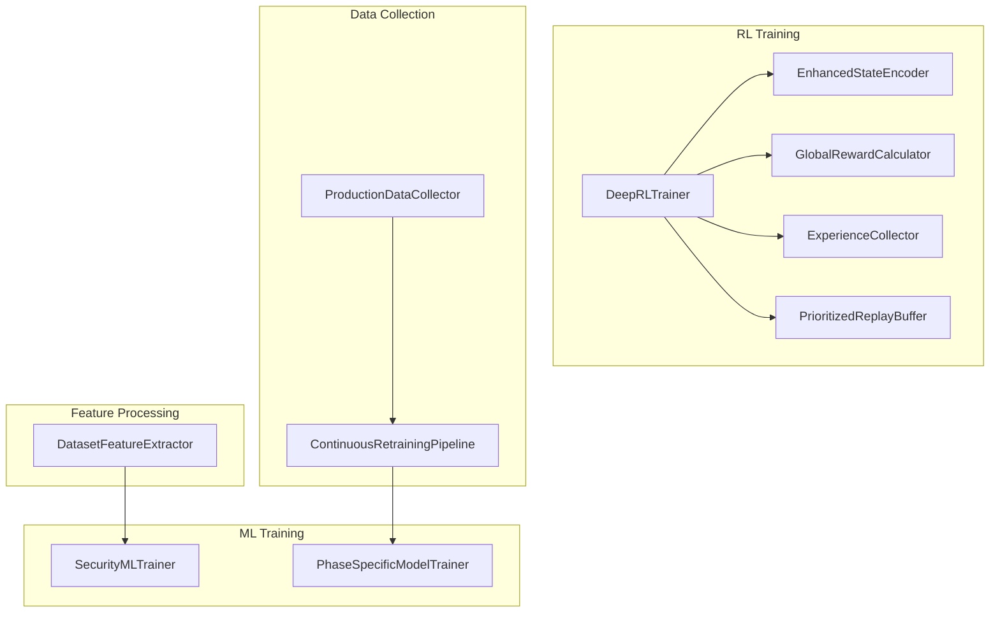
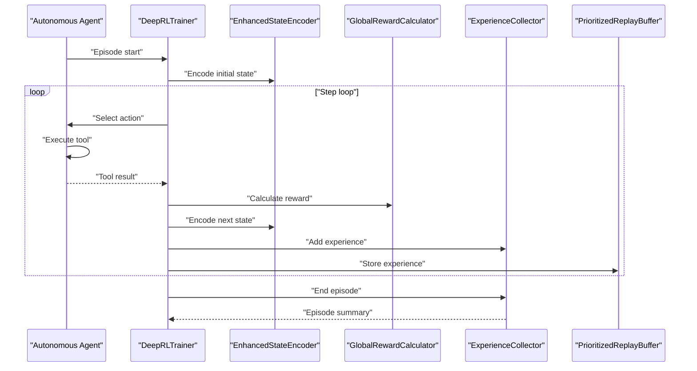
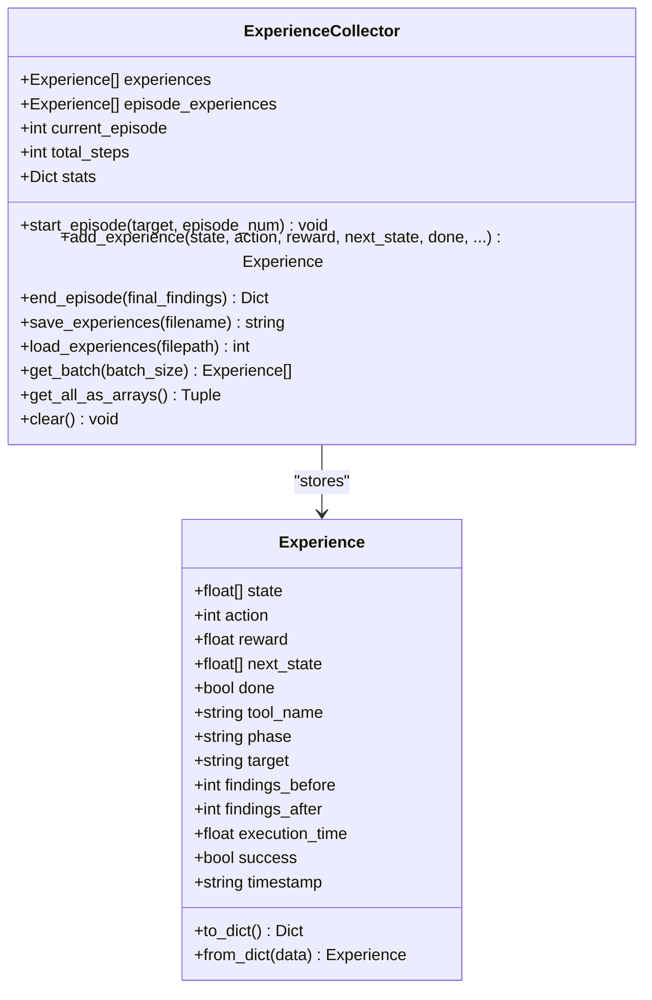
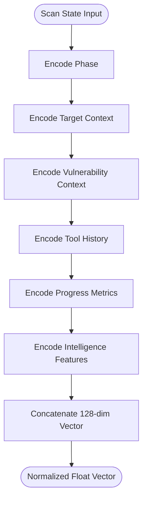
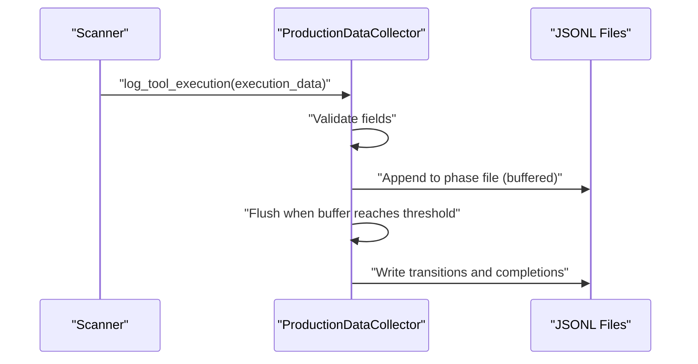
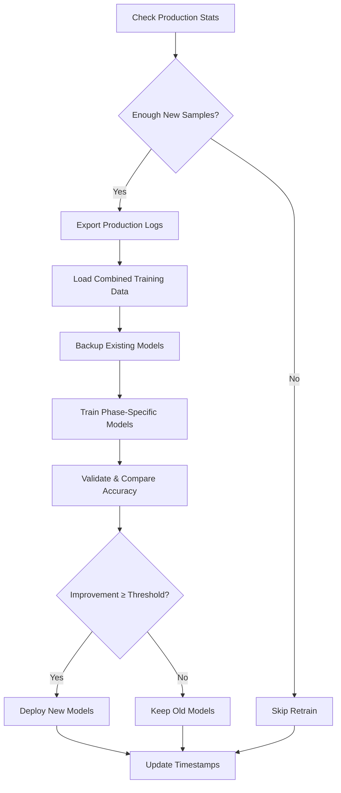
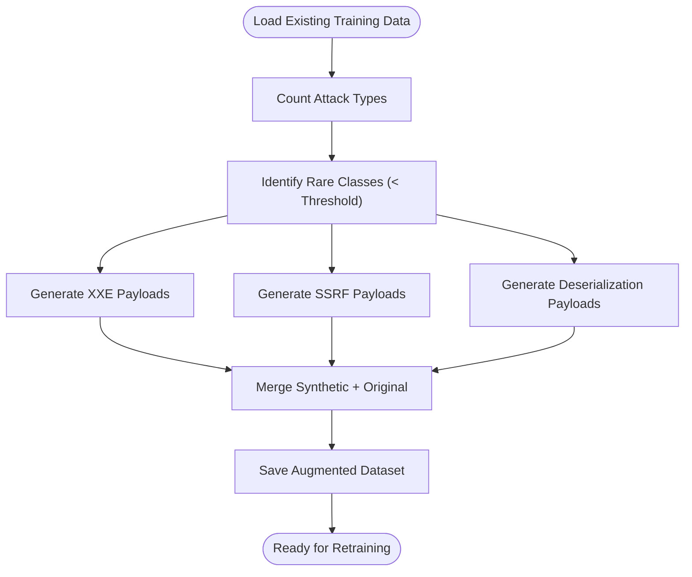
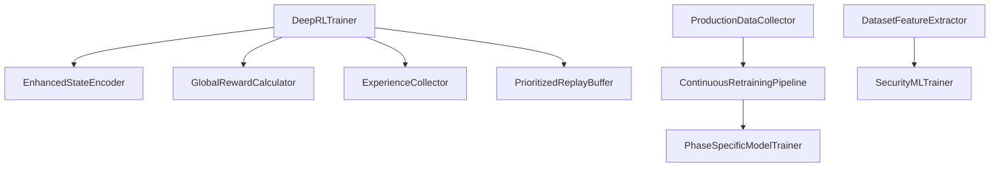

# Training Data Management

<cite>
**Referenced Files in This Document**
- [experience_collector.py](file://backend/training/experience_collector.py)
- [feature_extractor.py](file://backend/training/feature_extractor.py)
- [production_data_collector.py](file://backend/training/production_data_collector.py)
- [data_augmentation.py](file://backend/training/data_augmentation.py)
- [prioritized_replay.py](file://backend/training/prioritized_replay.py)
- [model_trainer.py](file://backend/training/model_trainer.py)
- [deep_rl_trainer.py](file://backend/training/deep_rl_trainer.py)
- [enhanced_state_encoder.py](file://backend/training/enhanced_state_encoder.py)
- [reward_calculator.py](file://backend/training/reward_calculator.py)
- [rl_training_config.py](file://backend/training/rl_training_config.py)
- [continuous_retraining.py](file://backend/training/continuous_retraining.py)
- [train_phase_models.py](file://backend/training/train_phase_models.py)
- [phase_specific_models.py](file://backend/training/phase_specific_models.py)
- [scanning_training_logs.json](file://backend/testing/data/test_training_logs/scanning_training_logs.json)
- [exploitation_training_logs.json](file://backend/testing/data/test_training_logs/exploitation_training_logs.json)
- [ml_training_state.json](file://backend/data/ml_training_state.json)
</cite>

## Table of Contents
1. [Introduction](#introduction)
2. [Project Structure](#project-structure)
3. [Core Components](#core-components)
4. [Architecture Overview](#architecture-overview)
5. [Detailed Component Analysis](#detailed-component-analysis)
6. [Dependency Analysis](#dependency-analysis)
7. [Performance Considerations](#performance-considerations)
8. [Troubleshooting Guide](#troubleshooting-guide)
9. [Conclusion](#conclusion)
10. [Appendices](#appendices)

## Introduction
This document describes the training data management system for autonomous agent operations, focusing on the end-to-end pipeline from experience collection to model retraining. It covers:
- Experience collection and preprocessing for reinforcement learning
- Feature extraction from raw security scan data
- Production data collection and continuous retraining
- Data labeling strategies, quality control, and versioning
- Practical workflows, storage optimization, and integrity verification
- Privacy, secure handling, and compliance considerations
- Data augmentation and balancing techniques for imbalanced datasets

## Project Structure
The training data management system spans several modules:
- RL training orchestration and experience management
- Feature extraction for structured datasets
- Production data collection and export
- Model training and deployment
- Continuous retraining pipeline
- Phase-specific tool recommendation models

**Diagram sources**
- [deep_rl_trainer.py](file://backend/training/deep_rl_trainer.py#L27-L122)
- [enhanced_state_encoder.py](file://backend/training/enhanced_state_encoder.py#L23-L139)
- [reward_calculator.py](file://backend/training/reward_calculator.py#L13-L170)
- [experience_collector.py](file://backend/training/experience_collector.py#L49-L240)
- [prioritized_replay.py](file://backend/training/prioritized_replay.py#L176-L376)
- [production_data_collector.py](file://backend/training/production_data_collector.py#L14-L280)
- [continuous_retraining.py](file://backend/training/continuous_retraining.py#L27-L213)
- [phase_specific_models.py](file://backend/training/phase_specific_models.py#L15-L404)
- [model_trainer.py](file://backend/training/model_trainer.py#L20-L444)
- [feature_extractor.py](file://backend/training/feature_extractor.py#L7-L246)

**Section sources**
- [deep_rl_trainer.py](file://backend/training/deep_rl_trainer.py#L27-L122)
- [production_data_collector.py](file://backend/training/production_data_collector.py#L14-L280)
- [continuous_retraining.py](file://backend/training/continuous_retraining.py#L27-L213)
- [phase_specific_models.py](file://backend/training/phase_specific_models.py#L15-L404)
- [model_trainer.py](file://backend/training/model_trainer.py#L20-L444)
- [feature_extractor.py](file://backend/training/feature_extractor.py#L7-L246)

## Core Components
- ExperienceCollector: Stores RL experiences with metadata, supports saving/loading, and batch retrieval for offline training.
- EnhancedStateEncoder: Produces a 128-dimensional state vector capturing phase, target context, vulnerability context, tool history, progress metrics, and intelligence features.
- GlobalRewardCalculator: Computes unified rewards combining environment, episode, and lesson signals.
- ProductionDataCollector: Logs tool executions, phase transitions, and scan completions; exports to training-ready JSON.
- ContinuousRetrainingPipeline: Monitors production data, triggers retraining, validates improvements, and deploys new models.
- PhaseSpecificModelTrainer: Builds separate models per pentesting phase using domain-relevant features.
- DatasetFeatureExtractor: Transforms raw HTTP/cloud/AI jailbreak logs into structured feature vectors for ML training.
- AttackDataAugmenter: Generates synthetic examples for rare attack categories to balance datasets.
- PrioritizedReplayBuffer: Efficiently samples important experiences using a sum tree and importance sampling.

**Section sources**
- [experience_collector.py](file://backend/training/experience_collector.py#L49-L240)
- [enhanced_state_encoder.py](file://backend/training/enhanced_state_encoder.py#L23-L139)
- [reward_calculator.py](file://backend/training/reward_calculator.py#L13-L170)
- [production_data_collector.py](file://backend/training/production_data_collector.py#L14-L280)
- [continuous_retraining.py](file://backend/training/continuous_retraining.py#L27-L213)
- [phase_specific_models.py](file://backend/training/phase_specific_models.py#L15-L404)
- [feature_extractor.py](file://backend/training/feature_extractor.py#L7-L246)
- [data_augmentation.py](file://backend/training/data_augmentation.py#L8-L271)
- [prioritized_replay.py](file://backend/training/prioritized_replay.py#L176-L376)

## Architecture Overview
The system integrates RL training with production data feedback loops. RL agents collect experiences during autonomous scans, which are stored and later used for offline training. Parallel production logs feed a continuous retraining pipeline that updates phase-specific models and ML classifiers.

**Diagram sources**
- [deep_rl_trainer.py](file://backend/training/deep_rl_trainer.py#L170-L328)
- [enhanced_state_encoder.py](file://backend/training/enhanced_state_encoder.py#L75-L139)
- [reward_calculator.py](file://backend/training/reward_calculator.py#L38-L170)
- [experience_collector.py](file://backend/training/experience_collector.py#L83-L130)
- [prioritized_replay.py](file://backend/training/prioritized_replay.py#L233-L269)

## Detailed Component Analysis

### Experience Collection Pipeline
The RL training pipeline captures experiences with rich metadata for analysis and offline training. Experiences include state vectors, actions, rewards, next states, terminal flags, and contextual metadata such as tool name, phase, target, findings counts, execution time, and success.

**Diagram sources**
- [experience_collector.py](file://backend/training/experience_collector.py#L18-L130)
- [experience_collector.py](file://backend/training/experience_collector.py#L49-L240)

Practical workflow highlights:
- Episode lifecycle: start, incremental experience addition, and episode summary computation.
- Batch retrieval for offline training and conversion to NumPy arrays for training frameworks.
- Persistent storage with metadata and statistics for auditing and analysis.

**Section sources**
- [experience_collector.py](file://backend/training/experience_collector.py#L49-L240)

### State Encoding and Feature Extraction
The EnhancedStateEncoder transforms scan context into a fixed-size 128-dimensional vector, enabling the RL agent to reason about:
- Phase encoding
- Target context (ports, services, complexity)
- Vulnerability context (counts, types, severity stats, CVEs)
- Tool history (usage flags, recency)
- Progress metrics (time, coverage, stall detection)
- Intelligence features (technology stack, reputation, target profile)

**Diagram sources**
- [enhanced_state_encoder.py](file://backend/training/enhanced_state_encoder.py#L75-L139)

Feature extractor for structured datasets converts raw logs into feature vectors suitable for ML classifiers:
- HTTP request features: length, entropy, keyword counts, XSS/command indicators, encoding patterns
- Cloud event features: service, privileged actions, MFA usage
- Text features: length, entropy, jailbreak keywords, suspicious patterns

**Section sources**
- [enhanced_state_encoder.py](file://backend/training/enhanced_state_encoder.py#L23-L139)
- [feature_extractor.py](file://backend/training/feature_extractor.py#L7-L246)

### Production Data Collection and Continuous Retraining
ProductionDataCollector captures tool execution events, phase transitions, and scan completions in JSONL files organized by phase. It maintains in-memory buffers for efficient batch writes and exposes collection statistics.

**Diagram sources**
- [production_data_collector.py](file://backend/training/production_data_collector.py#L39-L183)

ContinuousRetrainingPipeline orchestrates periodic or on-demand retraining:
- Checks production data volume and time thresholds
- Exports production logs to training format
- Loads combined datasets (production + synthetic)
- Backs up existing models
- Trains new models per phase
- Validates improvements and deploys if threshold met

**Diagram sources**
- [continuous_retraining.py](file://backend/training/continuous_retraining.py#L66-L213)
- [phase_specific_models.py](file://backend/training/phase_specific_models.py#L252-L404)

**Section sources**
- [production_data_collector.py](file://backend/training/production_data_collector.py#L14-L280)
- [continuous_retraining.py](file://backend/training/continuous_retraining.py#L27-L213)
- [phase_specific_models.py](file://backend/training/phase_specific_models.py#L15-L404)

### Data Labeling, Quality Control, and Versioning
- Labeling: Tool execution logs include labels such as attack types, severity, and success flags. Structured datasets define labels for vulnerability detectors and attack classifiers.
- Quality control: Validation checks ensure required fields are present; logging captures errors and anomalies; cross-validation evaluates model performance; stall detection and reward shaping prevent degenerate behaviors.
- Versioning: Training reports and checkpoints include timestamps and metadata; model artifacts are saved with descriptive filenames; training state JSON documents current metrics and datasets used.

**Section sources**
- [production_data_collector.py](file://backend/training/production_data_collector.py#L39-L119)
- [continuous_retraining.py](file://backend/training/continuous_retraining.py#L128-L213)
- [ml_training_state.json](file://backend/data/ml_training_state.json#L1-L51)

### Data Augmentation and Balancing
AttackDataAugmenter generates synthetic examples for rare attack categories (e.g., XXE, SSRF, deserialization) by mutating templates and distributing severity scores. It identifies rare classes and augments to balanced distributions.

**Diagram sources**
- [data_augmentation.py](file://backend/training/data_augmentation.py#L218-L271)

**Section sources**
- [data_augmentation.py](file://backend/training/data_augmentation.py#L8-L271)

### Storage Optimization and Integrity Verification
- Buffered writes: ProductionDataCollector uses in-memory buffers to reduce I/O overhead and flush when thresholds are reached.
- JSONL format: Append-only records enable streaming ingestion and partial recovery.
- Integrity checks: Logging captures errors during parsing and writing; checksums or signatures are not implemented in the referenced code; consider adding file hashes for auditability.
- Offline training: ExperienceCollector saves aggregated experiences with metadata for reproducibility and analysis.

**Section sources**
- [production_data_collector.py](file://backend/training/production_data_collector.py#L14-L183)
- [experience_collector.py](file://backend/training/experience_collector.py#L164-L202)

### Privacy, Secure Data Handling, and Compliance
- Data minimization: Only necessary fields are logged; timestamps and metadata are included for traceability.
- Access controls: Model and training artifacts are stored locally; restrict filesystem permissions and network exposure.
- Audit trails: Logging includes timestamps and event types; consider integrating structured audit logs for compliance.
- Data retention: Implement policies for purging sensitive logs and retaining only anonymized training data.

[No sources needed since this section provides general guidance]

## Dependency Analysis
The RL training pipeline depends on state encoding, reward calculation, experience collection, and replay buffers. Production data feeds continuous retraining, which trains phase-specific models.

**Diagram sources**
- [deep_rl_trainer.py](file://backend/training/deep_rl_trainer.py#L33-L41)
- [enhanced_state_encoder.py](file://backend/training/enhanced_state_encoder.py#L23-L74)
- [reward_calculator.py](file://backend/training/reward_calculator.py#L13-L30)
- [experience_collector.py](file://backend/training/experience_collector.py#L49-L74)
- [prioritized_replay.py](file://backend/training/prioritized_replay.py#L176-L226)
- [production_data_collector.py](file://backend/training/production_data_collector.py#L14-L38)
- [continuous_retraining.py](file://backend/training/continuous_retraining.py#L27-L38)
- [phase_specific_models.py](file://backend/training/phase_specific_models.py#L15-L25)
- [model_trainer.py](file://backend/training/model_trainer.py#L20-L27)
- [feature_extractor.py](file://backend/training/feature_extractor.py#L7-L11)

**Section sources**
- [deep_rl_trainer.py](file://backend/training/deep_rl_trainer.py#L33-L41)
- [continuous_retraining.py](file://backend/training/continuous_retraining.py#L27-L38)

## Performance Considerations
- State dimensionality: 128-dim vectors enable rich context but require careful normalization and feature engineering.
- Replay efficiency: Prioritized replay reduces variance and accelerates learning by focusing on informative experiences.
- Batch processing: ExperienceCollector supports batch retrieval and NumPy conversion for efficient training.
- I/O throughput: Buffered production logging minimizes disk writes; ensure adequate disk bandwidth for high-volume scans.
- Model scalability: Phase-specific models reduce complexity per task; ensemble methods improve robustness.

[No sources needed since this section provides general guidance]

## Troubleshooting Guide
Common issues and remedies:
- Missing required fields in production logs: Validation logs errors; ensure execution_data includes required keys before logging.
- Encoding failures: State encoder handles exceptions by returning zeros; inspect scan_state structure and feature extraction logic.
- Training instability: Adjust reward shaping, exploration parameters, and replay buffer sizes; review episode termination conditions.
- Model degradation: Monitor validation metrics; trigger continuous retraining when accuracy drops below thresholds.

**Section sources**
- [production_data_collector.py](file://backend/training/production_data_collector.py#L60-L85)
- [enhanced_state_encoder.py](file://backend/training/enhanced_state_encoder.py#L123-L128)
- [continuous_retraining.py](file://backend/training/continuous_retraining.py#L104-L127)

## Conclusion
The training data management system integrates RL experience collection, structured feature extraction, production data feedback, and continuous model retraining. It emphasizes robust logging, quality control, and scalable storage to support autonomous agent operations and maintain data freshness. By leveraging prioritized replay, phase-specific models, and data augmentation, the system improves learning efficiency and addresses class imbalance in security datasets.

[No sources needed since this section summarizes without analyzing specific files]

## Appendices

### Example Workflows
- RL training episode: Start episode → encode state → select action → execute tool → compute reward → encode next state → store experience → train agent → end episode.
- Production retraining: Export production logs → load combined dataset → backup models → train new models → validate and compare → deploy improved models.

**Section sources**
- [deep_rl_trainer.py](file://backend/training/deep_rl_trainer.py#L170-L328)
- [continuous_retraining.py](file://backend/training/continuous_retraining.py#L128-L213)

### Data Formats and Examples
- Training logs (JSON): Context, tool, success, vulnerabilities found, execution time.
- Training state (JSON): Metrics, datasets used, improvements.

**Section sources**
- [scanning_training_logs.json](file://backend/testing/data/test_training_logs/scanning_training_logs.json#L1-L68)
- [exploitation_training_logs.json](file://backend/testing/data/test_training_logs/exploitation_training_logs.json#L1-L68)
- [ml_training_state.json](file://backend/data/ml_training_state.json#L1-L51)