# Training Pipeline Management

<cite>
**Referenced Files in This Document**
- [deep_rl_trainer.py](file://backend/training/deep_rl_trainer.py)
- [rl_trainer.py](file://backend/training/rl_trainer.py)
- [rl_training_config.py](file://backend/training/rl_training_config.py)
- [experience_collector.py](file://backend/training/experience_collector.py)
- [reward_calculator.py](file://backend/training/reward_calculator.py)
- [prioritized_replay.py](file://backend/training/prioritized_replay.py)
- [model_trainer.py](file://backend/training/model_trainer.py)
- [phase_specific_models.py](file://backend/training/phase_specific_models.py)
- [train_phase_models.py](file://backend/training/train_phase_models.py)
- [data_augmentation.py](file://backend/training/data_augmentation.py)
- [run_rl_training.py](file://backend/training/run_rl_training.py)
- [continuous_retraining.py](file://backend/training/continuous_retraining.py)
- [curriculum_config.py](file://backend/training/curriculum_config.py)
- [newbie_to_pro_training.py](file://backend/training_environment/newbie_to_pro_training.py)
</cite>

## Table of Contents
1. [Introduction](#introduction)
2. [Project Structure](#project-structure)
3. [Core Components](#core-components)
4. [Architecture Overview](#architecture-overview)
5. [Detailed Component Analysis](#detailed-component-analysis)
6. [Dependency Analysis](#dependency-analysis)
7. [Performance Considerations](#performance-considerations)
8. [Troubleshooting Guide](#troubleshooting-guide)
9. [Conclusion](#conclusion)
10. [Appendices](#appendices)

## Introduction
This document describes the training pipeline management system for the Optimus platform. It covers the end-to-end workflow from data preparation to model deployment, including:
- Reinforcement Learning (RL) training with DQN, experience replay, and epsilon-greedy exploration
- Supervised learning models for vulnerability detection, attack classification, and tool recommendation
- Curriculum learning progression and phase-specific training strategies
- Training configuration management, hyperparameter optimization, and automated workflows
- Practical setup, progress monitoring, and troubleshooting guidance
- Environment isolation, resource allocation, and performance optimization strategies

## Project Structure
The training system is organized around modular components:
- RL training orchestration and agents
- Experience collection and reward shaping
- Supervised learning trainers and phase-specific models
- Data augmentation and continuous retraining
- Curriculum-driven training environments

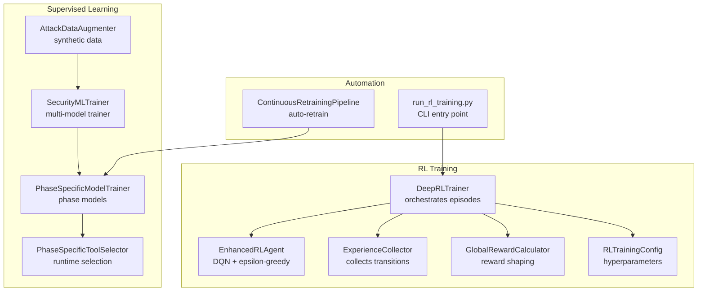

**Diagram sources**
- [deep_rl_trainer.py](file://backend/training/deep_rl_trainer.py#L27-L122)
- [rl_trainer.py](file://backend/training/rl_trainer.py#L15-L42)
- [experience_collector.py](file://backend/training/experience_collector.py#L49-L82)
- [reward_calculator.py](file://backend/training/reward_calculator.py#L13-L37)
- [rl_training_config.py](file://backend/training/rl_training_config.py#L31-L126)
- [model_trainer.py](file://backend/training/model_trainer.py#L20-L27)
- [phase_specific_models.py](file://backend/training/phase_specific_models.py#L15-L25)
- [phase_specific_models.py](file://backend/training/phase_specific_models.py#L407-L415)
- [data_augmentation.py](file://backend/training/data_augmentation.py#L8-L15)
- [run_rl_training.py](file://backend/training/run_rl_training.py#L91-L187)
- [continuous_retraining.py](file://backend/training/continuous_retraining.py#L27-L43)

**Section sources**
- [deep_rl_trainer.py](file://backend/training/deep_rl_trainer.py#L1-L122)
- [rl_trainer.py](file://backend/training/rl_trainer.py#L15-L42)
- [experience_collector.py](file://backend/training/experience_collector.py#L49-L82)
- [reward_calculator.py](file://backend/training/reward_calculator.py#L13-L37)
- [rl_training_config.py](file://backend/training/rl_training_config.py#L31-L126)
- [model_trainer.py](file://backend/training/model_trainer.py#L20-L27)
- [phase_specific_models.py](file://backend/training/phase_specific_models.py#L15-L25)
- [phase_specific_models.py](file://backend/training/phase_specific_models.py#L407-L415)
- [data_augmentation.py](file://backend/training/data_augmentation.py#L8-L15)
- [run_rl_training.py](file://backend/training/run_rl_training.py#L91-L187)
- [continuous_retraining.py](file://backend/training/continuous_retraining.py#L27-L43)

## Core Components
- Deep RL Trainer orchestrates multi-target training, episode loops, and periodic evaluation/saving.
- RL Agent implements DQN with epsilon-greedy action selection and experience replay.
- Experience Collector records transitions with metadata for offline analysis.
- Reward Calculator computes unified rewards combining environment, episode, and lesson signals.
- Supervised ML Trainer trains classifiers/regressors for vulnerability detection, attack classification, and severity prediction.
- Phase-Specific Models train separate models per pentesting phase with cross-validation.
- Data Augmentation synthesizes rare attack types to balance datasets.
- Continuous Retraining Pipeline automates model updates using production logs.
- Curriculum and Training Environment define structured learning progression.

**Section sources**
- [deep_rl_trainer.py](file://backend/training/deep_rl_trainer.py#L27-L122)
- [rl_trainer.py](file://backend/training/rl_trainer.py#L15-L42)
- [experience_collector.py](file://backend/training/experience_collector.py#L49-L82)
- [reward_calculator.py](file://backend/training/reward_calculator.py#L13-L37)
- [model_trainer.py](file://backend/training/model_trainer.py#L20-L98)
- [phase_specific_models.py](file://backend/training/phase_specific_models.py#L15-L25)
- [data_augmentation.py](file://backend/training/data_augmentation.py#L8-L15)
- [continuous_retraining.py](file://backend/training/continuous_retraining.py#L27-L43)
- [curriculum_config.py](file://backend/training/curriculum_config.py#L8-L15)
- [newbie_to_pro_training.py](file://backend/training_environment/newbie_to_pro_training.py#L131-L138)

## Architecture Overview
The RL training pipeline integrates state encoding, tool execution, reward computation, experience storage, and agent updates. The supervised learning stack builds on curated and augmented datasets to improve detection and recommendation capabilities.

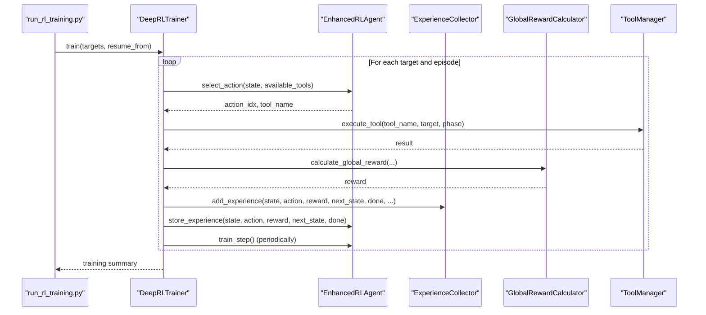

**Diagram sources**
- [run_rl_training.py](file://backend/training/run_rl_training.py#L179-L187)
- [deep_rl_trainer.py](file://backend/training/deep_rl_trainer.py#L123-L169)
- [rl_trainer.py](file://backend/training/rl_trainer.py#L69-L109)
- [experience_collector.py](file://backend/training/experience_collector.py#L83-L130)
- [reward_calculator.py](file://backend/training/reward_calculator.py#L38-L169)

## Detailed Component Analysis

### RL Trainer Architecture with DQN Implementation
The RL trainer coordinates training across multiple targets, managing episode loops, tool execution, reward calculation, and agent updates. It supports checkpointing, evaluation, and periodic saves.

Key responsibilities:
- Episode lifecycle: initialize state, select actions, execute tools, update state, compute rewards, store experiences, and train the agent.
- Phase transitions: advance from reconnaissance to scanning, exploitation, post-exploitation, and covering tracks based on heuristics.
- Evaluation and best model tracking: periodic evaluation and saving the best model based on average reward.

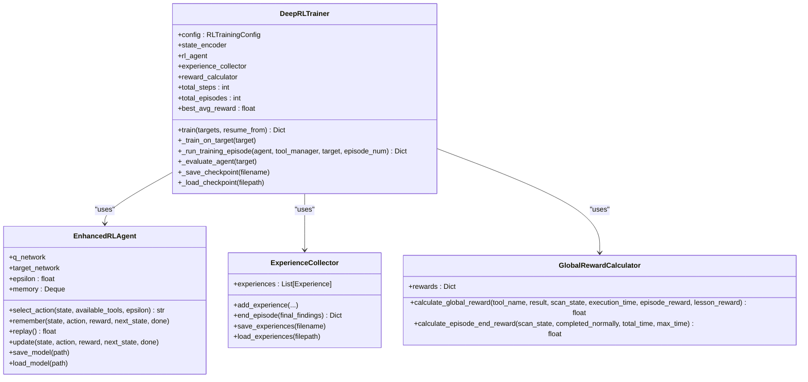

**Diagram sources**
- [deep_rl_trainer.py](file://backend/training/deep_rl_trainer.py#L27-L122)
- [rl_trainer.py](file://backend/training/rl_trainer.py#L15-L42)
- [experience_collector.py](file://backend/training/experience_collector.py#L49-L82)
- [reward_calculator.py](file://backend/training/reward_calculator.py#L13-L37)

**Section sources**
- [deep_rl_trainer.py](file://backend/training/deep_rl_trainer.py#L58-L169)
- [rl_trainer.py](file://backend/training/rl_trainer.py#L69-L148)
- [experience_collector.py](file://backend/training/experience_collector.py#L83-L162)
- [reward_calculator.py](file://backend/training/reward_calculator.py#L38-L169)

### Experience Replay Mechanisms and Prioritized Experience Replay
The system supports both standard and prioritized experience replay:
- Standard replay buffer stores transitions and samples uniformly.
- Prioritized Experience Replay (PER) uses a sum tree to sample experiences proportional to TD error, with importance sampling weights to correct bias.

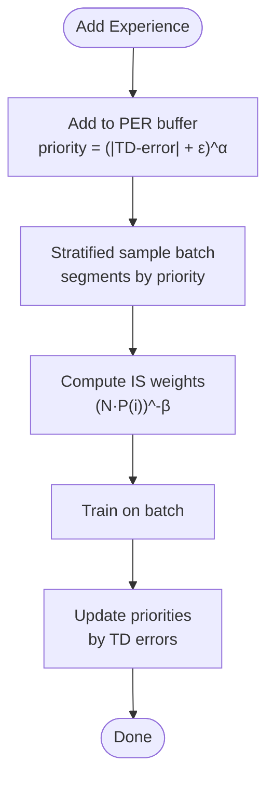

**Diagram sources**
- [prioritized_replay.py](file://backend/training/prioritized_replay.py#L233-L349)
- [prioritized_replay.py](file://backend/training/prioritized_replay.py#L351-L367)

**Section sources**
- [prioritized_replay.py](file://backend/training/prioritized_replay.py#L176-L376)
- [prioritized_replay.py](file://backend/training/prioritized_replay.py#L378-L461)

### Epsilon-Greedy Exploration Strategies
The RL agent selects actions using epsilon-greedy:
- With probability epsilon, choose randomly among available actions.
- Otherwise, select the action with the highest Q-value masked to available actions.
- Epsilon decays after episodes to reduce exploration over time.

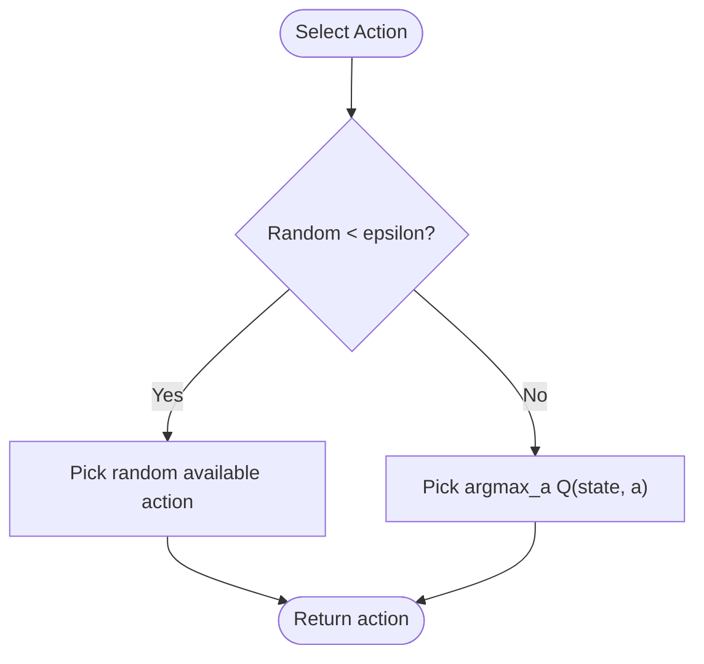

**Diagram sources**
- [rl_trainer.py](file://backend/training/rl_trainer.py#L69-L109)

**Section sources**
- [rl_trainer.py](file://backend/training/rl_trainer.py#L69-L109)
- [rl_trainer.py](file://backend/training/rl_trainer.py#L231-L242)

### Supervised Learning: Model Trainer and Cross-Validation
The model trainer builds ensembles and individual models for:
- Vulnerability detector (binary classification)
- Attack classifier (multi-class)
- Tool recommender (classification)
- Severity predictor (regression)
- Cloud attack detector (binary)
- AI jailbreak detector (text classification)

Cross-validation and feature engineering are integrated, with standardized scaling and encoding.

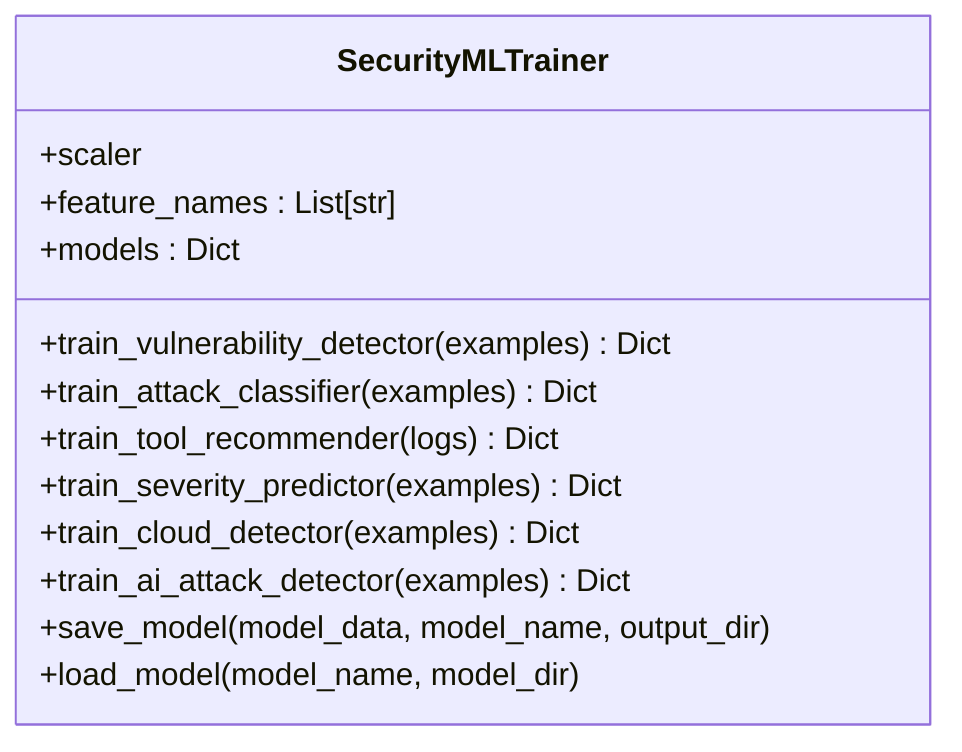

**Diagram sources**
- [model_trainer.py](file://backend/training/model_trainer.py#L20-L98)

**Section sources**
- [model_trainer.py](file://backend/training/model_trainer.py#L28-L361)

### Phase-Specific Training Strategies and Tool Recommendation
Phase-specific models tailor recommendations to each pentesting phase:
- Feature sets are curated per phase (reconnaissance, scanning, exploitation, post-exploitation, covering tracks).
- Models are trained with cross-validation and saved for runtime selection.
- Runtime selector loads models and recommends tools conditioned on context, excluding previously executed tools.

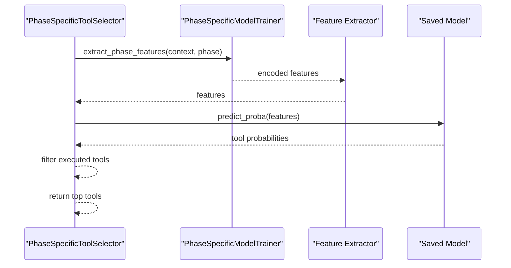

**Diagram sources**
- [phase_specific_models.py](file://backend/training/phase_specific_models.py#L407-L415)
- [phase_specific_models.py](file://backend/training/phase_specific_models.py#L468-L542)
- [phase_specific_models.py](file://backend/training/phase_specific_models.py#L252-L358)

**Section sources**
- [phase_specific_models.py](file://backend/training/phase_specific_models.py#L26-L151)
- [phase_specific_models.py](file://backend/training/phase_specific_models.py#L252-L358)
- [phase_specific_models.py](file://backend/training/phase_specific_models.py#L407-L542)

### Data Augmentation Techniques for Rare Attack Types
Synthetic data generation augments underrepresented attack categories:
- XXE payloads with mutations
- SSRF targets with variations
- Insecure deserialization payloads across languages

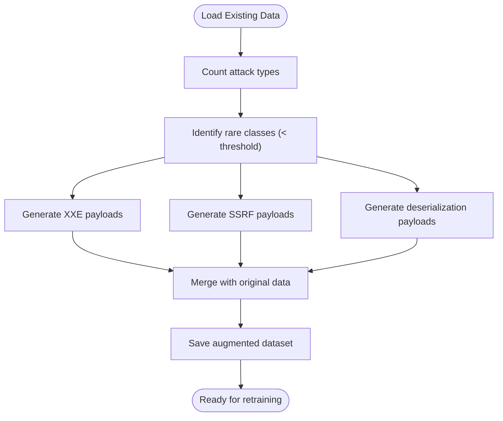

**Diagram sources**
- [data_augmentation.py](file://backend/training/data_augmentation.py#L218-L270)
- [data_augmentation.py](file://backend/training/data_augmentation.py#L316-L334)

**Section sources**
- [data_augmentation.py](file://backend/training/data_augmentation.py#L16-L270)
- [data_augmentation.py](file://backend/training/data_augmentation.py#L316-L334)

### Training Configuration Management and Hyperparameter Optimization
Training configuration encapsulates:
- Targets, episodes, time limits, and DQN hyperparameters
- Prioritized experience replay settings
- Exploration schedules and training schedule
- Reward shaping constants

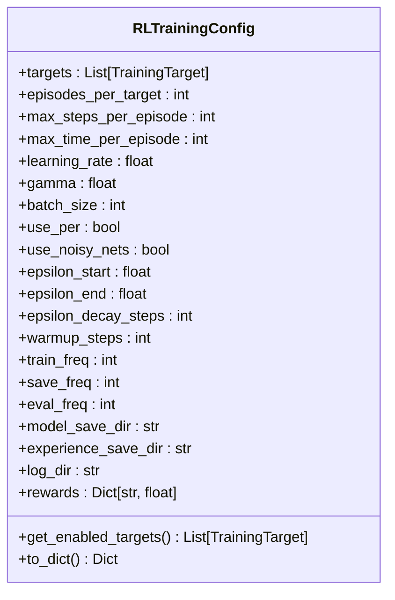

**Diagram sources**
- [rl_training_config.py](file://backend/training/rl_training_config.py#L31-L126)

**Section sources**
- [rl_training_config.py](file://backend/training/rl_training_config.py#L11-L159)

### Automated Training Workflows
Automated workflows include:
- Quick-start RL training script with CLI argument parsing
- Continuous retraining pipeline that exports production logs, backs up models, compares accuracy, and deploys improvements

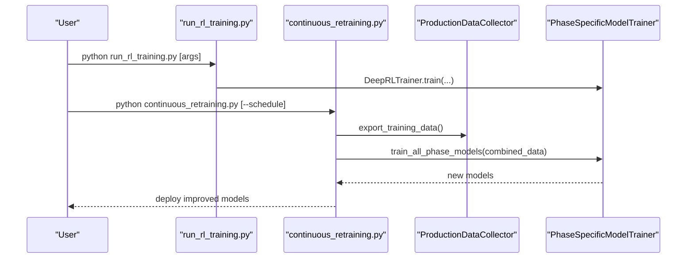

**Diagram sources**
- [run_rl_training.py](file://backend/training/run_rl_training.py#L91-L187)
- [continuous_retraining.py](file://backend/training/continuous_retraining.py#L128-L212)

**Section sources**
- [run_rl_training.py](file://backend/training/run_rl_training.py#L91-L201)
- [continuous_retraining.py](file://backend/training/continuous_retraining.py#L66-L212)

### Curriculum Learning Progression and Phase-Specific Training
The curriculum defines structured learning progression from novice to mastery, with phase-specific targets and lessons.

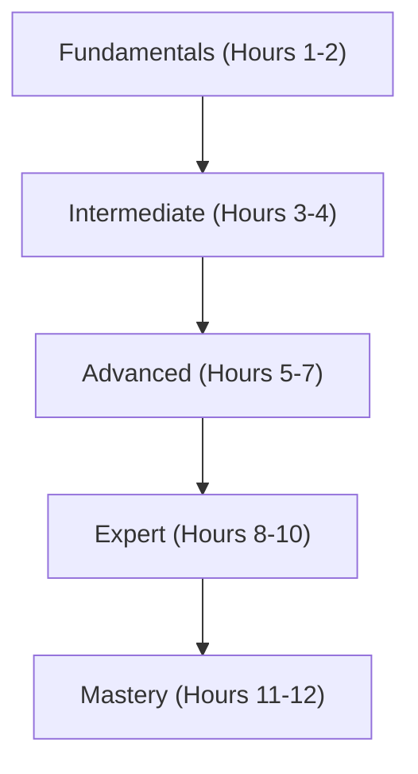

**Diagram sources**
- [newbie_to_pro_training.py](file://backend/training_environment/newbie_to_pro_training.py#L19-L51)
- [curriculum_config.py](file://backend/training/curriculum_config.py#L8-L15)

**Section sources**
- [newbie_to_pro_training.py](file://backend/training_environment/newbie_to_pro_training.py#L131-L138)
- [newbie_to_pro_training.py](file://backend/training_environment/newbie_to_pro_training.py#L295-L694)
- [curriculum_config.py](file://backend/training/curriculum_config.py#L8-L15)

## Dependency Analysis
The training system exhibits clear separation of concerns:
- RL components depend on configuration, reward calculation, and experience collection.
- Supervised learning depends on curated datasets and augmentation.
- Automation pipelines depend on both RL and supervised components.

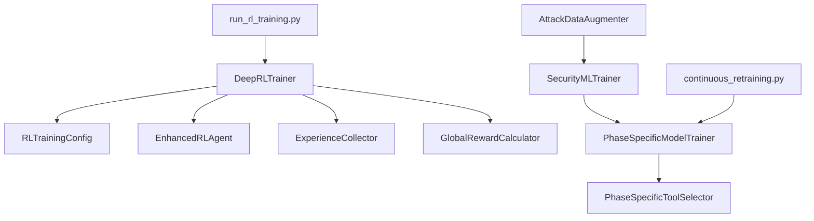

**Diagram sources**
- [deep_rl_trainer.py](file://backend/training/deep_rl_trainer.py#L33-L41)
- [rl_training_config.py](file://backend/training/rl_training_config.py#L31-L126)
- [model_trainer.py](file://backend/training/model_trainer.py#L20-L27)
- [phase_specific_models.py](file://backend/training/phase_specific_models.py#L15-L25)
- [data_augmentation.py](file://backend/training/data_augmentation.py#L8-L15)
- [run_rl_training.py](file://backend/training/run_rl_training.py#L20-L22)
- [continuous_retraining.py](file://backend/training/continuous_retraining.py#L21-L38)

**Section sources**
- [deep_rl_trainer.py](file://backend/training/deep_rl_trainer.py#L33-L41)
- [rl_training_config.py](file://backend/training/rl_training_config.py#L31-L126)
- [model_trainer.py](file://backend/training/model_trainer.py#L20-L27)
- [phase_specific_models.py](file://backend/training/phase_specific_models.py#L15-L25)
- [data_augmentation.py](file://backend/training/data_augmentation.py#L8-L15)
- [run_rl_training.py](file://backend/training/run_rl_training.py#L20-L22)
- [continuous_retraining.py](file://backend/training/continuous_retraining.py#L21-L38)

## Performance Considerations
- Use prioritized experience replay to focus on informative transitions and accelerate learning.
- Tune epsilon decay and exploration parameters to balance exploration and exploitation.
- Employ cross-validation for supervised models to avoid overfitting and ensure robustness.
- Monitor training metrics (average reward, episode lengths, findings counts) and adjust hyperparameters accordingly.
- Utilize standardized scaling and feature engineering to improve model convergence.

[No sources needed since this section provides general guidance]

## Troubleshooting Guide
Common issues and resolutions:
- Training interrupted: Check for keyboard interrupts and ensure checkpoints are saved.
- No targets configured: Verify training targets are enabled and URLs are valid.
- Tool execution failures: Inspect tool results and handle exceptions gracefully; review timeouts and errors.
- Poor reward shaping: Adjust reward constants and penalties to encourage desired behaviors.
- Model loading errors: Ensure model files exist and compatible with the current environment.

**Section sources**
- [deep_rl_trainer.py](file://backend/training/deep_rl_trainer.py#L104-L114)
- [deep_rl_trainer.py](file://backend/training/deep_rl_trainer.py#L247-L250)
- [reward_calculator.py](file://backend/training/reward_calculator.py#L67-L75)
- [phase_specific_models.py](file://backend/training/phase_specific_models.py#L422-L427)

## Conclusion
The Optimus training pipeline integrates RL and supervised learning with structured curriculum progression and automation. RL agents learn tool selection via DQN with experience replay and epsilon-greedy exploration, while supervised models improve detection and recommendation through curated and augmented datasets. Automated workflows continuously refine models using production data, ensuring sustained performance gains.

[No sources needed since this section summarizes without analyzing specific files]

## Appendices

### Practical Examples
- Start RL training with default targets and episodes:
  - [run_rl_training.py](file://backend/training/run_rl_training.py#L179-L187)
- Resume training from a checkpoint:
  - [run_rl_training.py](file://backend/training/run_rl_training.py#L186-L187)
- Train phase-specific models with synthetic augmentation:
  - [train_phase_models.py](file://backend/training/train_phase_models.py#L218-L263)
- Retrain models automatically using production logs:
  - [continuous_retraining.py](file://backend/training/continuous_retraining.py#L307-L345)

**Section sources**
- [run_rl_training.py](file://backend/training/run_rl_training.py#L179-L187)
- [train_phase_models.py](file://backend/training/train_phase_models.py#L218-L263)
- [continuous_retraining.py](file://backend/training/continuous_retraining.py#L307-L345)