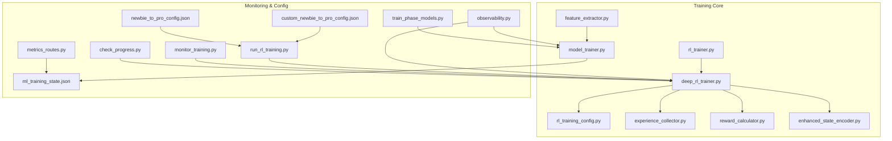
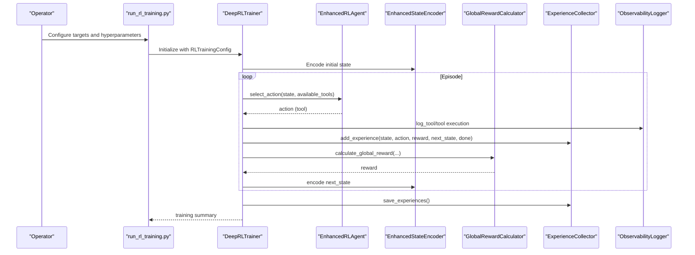
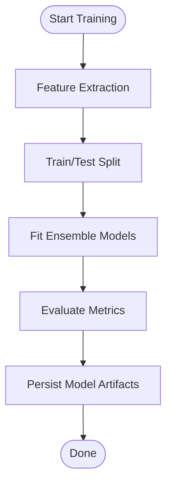
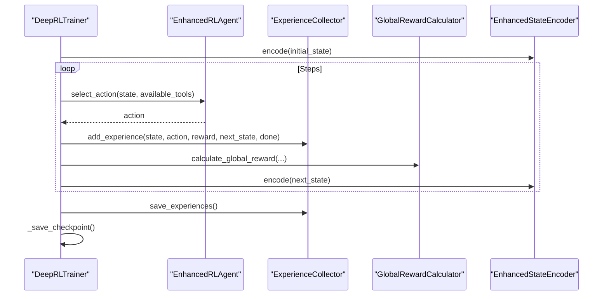
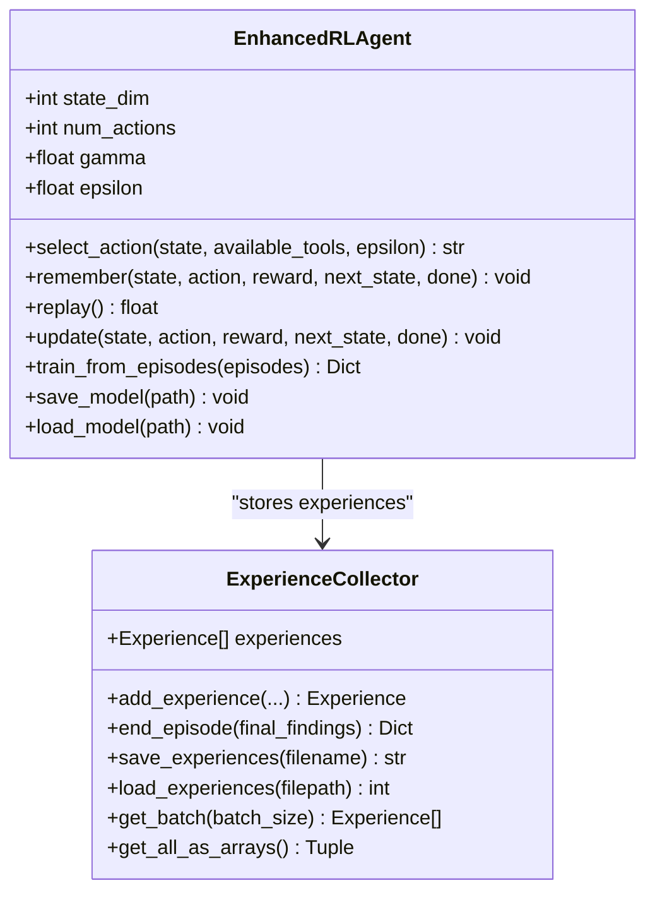
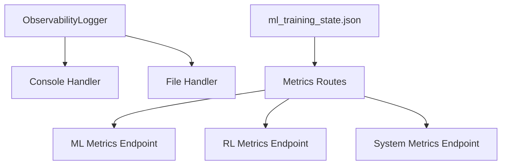
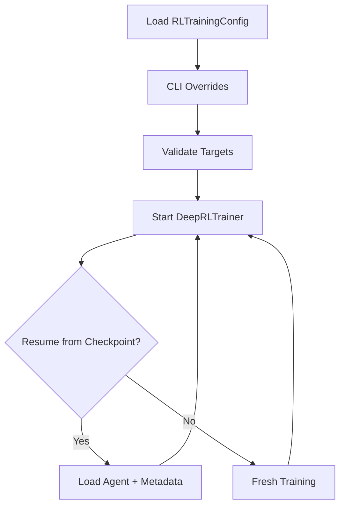
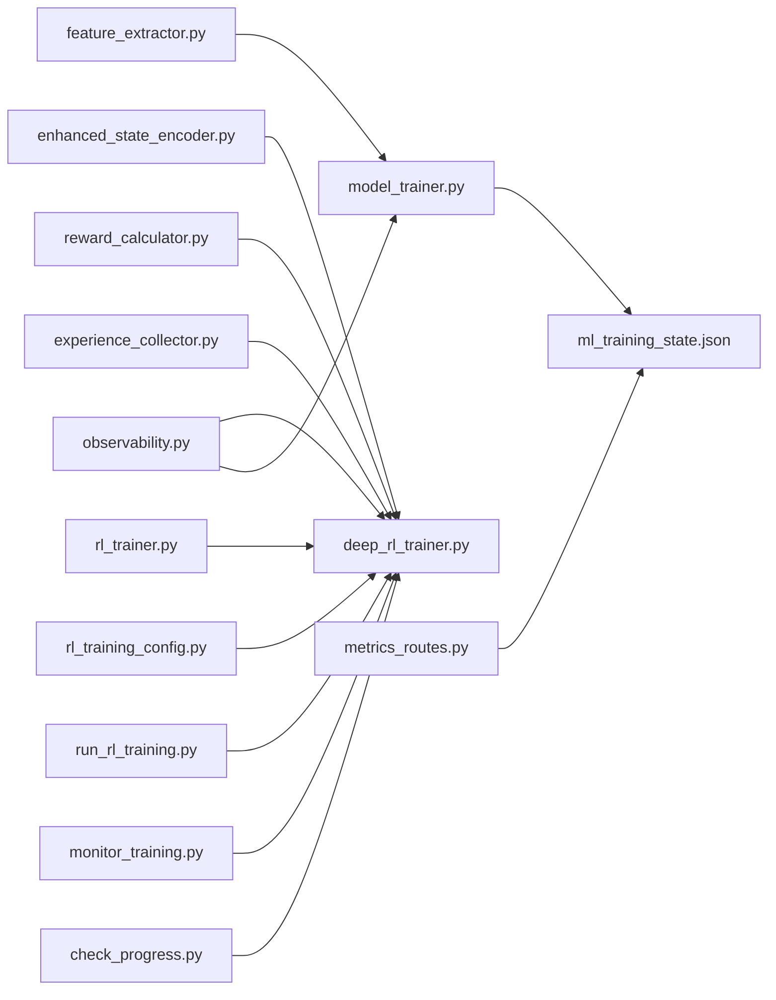

# Performance Optimization and Monitoring

<cite>
**Referenced Files in This Document**
- [model_trainer.py](file://backend/training/model_trainer.py)
- [deep_rl_trainer.py](file://backend/training/deep_rl_trainer.py)
- [rl_trainer.py](file://backend/training/rl_trainer.py)
- [rl_training_config.py](file://backend/training/rl_training_config.py)
- [feature_extractor.py](file://backend/training/feature_extractor.py)
- [experience_collector.py](file://backend/training/experience_collector.py)
- [reward_calculator.py](file://backend/training/reward_calculator.py)
- [enhanced_state_encoder.py](file://backend/training/enhanced_state_encoder.py)
- [observability.py](file://backend/utils/observability.py)
- [metrics_routes.py](file://backend/api/metrics_routes.py)
- [run_rl_training.py](file://backend/training/run_rl_training.py)
- [train_phase_models.py](file://backend/training/train_phase_models.py)
- [ml_training_state.json](file://backend/data/ml_training_state.json)
- [monitor_training.py](file://backend/training_environment/monitor_training.py)
- [check_progress.py](file://backend/training_environment/check_progress.py)
- [custom_newbie_to_pro_config.json](file://backend/training_environment/custom_newbie_to_pro_config.json)
- [newbie_to_pro_config.json](file://backend/training_environment/newbie_to_pro_config.json)
</cite>

## Table of Contents
1. [Introduction](#introduction)
2. [Project Structure](#project-structure)
3. [Core Components](#core-components)
4. [Architecture Overview](#architecture-overview)
5. [Detailed Component Analysis](#detailed-component-analysis)
6. [Dependency Analysis](#dependency-analysis)
7. [Performance Considerations](#performance-considerations)
8. [Troubleshooting Guide](#troubleshooting-guide)
9. [Conclusion](#conclusion)
10. [Appendices](#appendices)

## Introduction
This document provides a comprehensive guide to performance optimization and monitoring within the Optimus machine learning training framework. It explains training configuration management, feature extraction optimization, and observability mechanisms for tracking model performance. It also documents training efficiency improvements, memory optimization techniques, and computational resource management. Practical examples cover performance profiling, bottleneck identification, and optimization strategies. Monitoring dashboards, alerting systems, and performance regression detection are addressed, along with trade-offs between training speed and model quality, scaling considerations for distributed training, and integration of performance metrics with broader system monitoring. Guidance is included for capacity planning, resource allocation, and maintaining optimal training throughput.

## Project Structure
The training system is organized around modular components:
- Machine learning trainers for classification, regression, and recommendation tasks
- Deep reinforcement learning (RL) trainer orchestrating episodes, experience collection, and reward shaping
- Feature extraction utilities for structured datasets and text
- Observability and metrics APIs for runtime monitoring
- Training configuration and curriculum definitions
- Utilities for progress monitoring and model persistence

**Diagram sources**
- [model_trainer.py](file://backend/training/model_trainer.py#L1-L444)
- [deep_rl_trainer.py](file://backend/training/deep_rl_trainer.py#L1-L547)
- [rl_trainer.py](file://backend/training/rl_trainer.py#L1-L357)
- [rl_training_config.py](file://backend/training/rl_training_config.py#L1-L159)
- [feature_extractor.py](file://backend/training/feature_extractor.py#L1-L246)
- [experience_collector.py](file://backend/training/experience_collector.py#L1-L240)
- [reward_calculator.py](file://backend/training/reward_calculator.py#L1-L234)
- [enhanced_state_encoder.py](file://backend/training/enhanced_state_encoder.py#L1-L593)
- [observability.py](file://backend/utils/observability.py#L1-L269)
- [metrics_routes.py](file://backend/api/metrics_routes.py#L1-L109)
- [run_rl_training.py](file://backend/training/run_rl_training.py#L1-L205)
- [train_phase_models.py](file://backend/training/train_phase_models.py#L1-L263)
- [ml_training_state.json](file://backend/data/ml_training_state.json#L1-L51)
- [monitor_training.py](file://backend/training_environment/monitor_training.py#L1-L53)
- [check_progress.py](file://backend/training_environment/check_progress.py#L1-L52)
- [custom_newbie_to_pro_config.json](file://backend/training_environment/custom_newbie_to_pro_config.json#L1-L346)
- [newbie_to_pro_config.json](file://backend/training_environment/newbie_to_pro_config.json#L1-L350)

**Section sources**
- [model_trainer.py](file://backend/training/model_trainer.py#L1-L444)
- [deep_rl_trainer.py](file://backend/training/deep_rl_trainer.py#L1-L547)
- [rl_trainer.py](file://backend/training/rl_trainer.py#L1-L357)
- [rl_training_config.py](file://backend/training/rl_training_config.py#L1-L159)
- [feature_extractor.py](file://backend/training/feature_extractor.py#L1-L246)
- [experience_collector.py](file://backend/training/experience_collector.py#L1-L240)
- [reward_calculator.py](file://backend/training/reward_calculator.py#L1-L234)
- [enhanced_state_encoder.py](file://backend/training/enhanced_state_encoder.py#L1-L593)
- [observability.py](file://backend/utils/observability.py#L1-L269)
- [metrics_routes.py](file://backend/api/metrics_routes.py#L1-L109)
- [run_rl_training.py](file://backend/training/run_rl_training.py#L1-L205)
- [train_phase_models.py](file://backend/training/train_phase_models.py#L1-L263)
- [ml_training_state.json](file://backend/data/ml_training_state.json#L1-L51)
- [monitor_training.py](file://backend/training_environment/monitor_training.py#L1-L53)
- [check_progress.py](file://backend/training_environment/check_progress.py#L1-L52)
- [custom_newbie_to_pro_config.json](file://backend/training_environment/custom_newbie_to_pro_config.json#L1-L346)
- [newbie_to_pro_config.json](file://backend/training_environment/newbie_to_pro_config.json#L1-L350)

## Core Components
- Machine Learning Trainers: Provide scalable, ensemble-based models for vulnerability detection, attack classification, tool recommendation, severity prediction, cloud anomaly detection, and AI jailbreak detection. They include standardized preprocessing, evaluation metrics, and persistence.
- Deep RL Trainer: Orchestrates multi-target training, episode lifecycle, experience collection, periodic evaluation, and checkpointing. It integrates reward shaping and state encoding for efficient decision-making.
- RL Agent: Implements a DQN-based agent with experience replay, epsilon-greedy exploration, and reward computation tailored for security tool selection.
- Feature Extraction: Offers dataset-specific feature engineering for HTTP requests, cloud events, and text prompts to improve model generalization.
- Observability and Metrics: Centralized logging with trace IDs, structured metrics endpoints, and system resource monitoring for training and operational visibility.
- Training Configuration: Defines targets, hyperparameters, scheduling, and reward shaping for reproducible and scalable training runs.
- Curriculum and Progress Monitoring: JSON-based training plans and CLI monitors for progress tracking and automated checkpoints.

**Section sources**
- [model_trainer.py](file://backend/training/model_trainer.py#L20-L444)
- [deep_rl_trainer.py](file://backend/training/deep_rl_trainer.py#L27-L547)
- [rl_trainer.py](file://backend/training/rl_trainer.py#L15-L357)
- [feature_extractor.py](file://backend/training/feature_extractor.py#L7-L246)
- [observability.py](file://backend/utils/observability.py#L15-L269)
- [metrics_routes.py](file://backend/api/metrics_routes.py#L1-L109)
- [rl_training_config.py](file://backend/training/rl_training_config.py#L11-L159)
- [monitor_training.py](file://backend/training_environment/monitor_training.py#L12-L53)
- [check_progress.py](file://backend/training_environment/check_progress.py#L12-L52)

## Architecture Overview
The training pipeline combines supervised learning and reinforcement learning:
- Supervised learning: Feature extraction → model training → evaluation → persistence
- Reinforcement learning: State encoding → agent action selection → tool execution → reward calculation → experience collection → agent training → periodic evaluation

**Diagram sources**
- [run_rl_training.py](file://backend/training/run_rl_training.py#L91-L205)
- [deep_rl_trainer.py](file://backend/training/deep_rl_trainer.py#L58-L328)
- [rl_trainer.py](file://backend/training/rl_trainer.py#L69-L242)
- [enhanced_state_encoder.py](file://backend/training/enhanced_state_encoder.py#L75-L138)
- [reward_calculator.py](file://backend/training/reward_calculator.py#L38-L169)
- [experience_collector.py](file://backend/training/experience_collector.py#L83-L162)
- [observability.py](file://backend/utils/observability.py#L157-L226)

## Detailed Component Analysis

### Machine Learning Training Pipeline
- Feature engineering: Structured feature extraction for HTTP, cloud, and text inputs; normalization and scaling for numerical stability.
- Model orchestration: Multi-model training with standardized evaluation metrics and persistence to disk.
- Persistence: Joblib-based serialization for scikit-learn ensembles and custom pickling for TensorFlow-based agents.

**Diagram sources**
- [model_trainer.py](file://backend/training/model_trainer.py#L28-L97)
- [model_trainer.py](file://backend/training/model_trainer.py#L99-L149)
- [model_trainer.py](file://backend/training/model_trainer.py#L151-L202)
- [model_trainer.py](file://backend/training/model_trainer.py#L204-L251)
- [model_trainer.py](file://backend/training/model_trainer.py#L253-L306)
- [model_trainer.py](file://backend/training/model_trainer.py#L308-L361)
- [feature_extractor.py](file://backend/training/feature_extractor.py#L18-L118)

**Section sources**
- [model_trainer.py](file://backend/training/model_trainer.py#L20-L444)
- [feature_extractor.py](file://backend/training/feature_extractor.py#L7-L246)

### Deep RL Training Orchestration
- Episode lifecycle: State encoding, action selection, tool execution, reward calculation, experience storage, agent training, and periodic evaluation.
- Checkpointing: Saves both agent weights and metadata for resumable training.
- Logging: Extensive logging with timing, episode summaries, and evaluation metrics.

**Diagram sources**
- [deep_rl_trainer.py](file://backend/training/deep_rl_trainer.py#L170-L328)
- [experience_collector.py](file://backend/training/experience_collector.py#L83-L162)
- [reward_calculator.py](file://backend/training/reward_calculator.py#L38-L169)
- [enhanced_state_encoder.py](file://backend/training/enhanced_state_encoder.py#L75-L138)

**Section sources**
- [deep_rl_trainer.py](file://backend/training/deep_rl_trainer.py#L27-L547)
- [experience_collector.py](file://backend/training/experience_collector.py#L49-L240)
- [reward_calculator.py](file://backend/training/reward_calculator.py#L13-L234)
- [enhanced_state_encoder.py](file://backend/training/enhanced_state_encoder.py#L23-L593)

### RL Agent and Experience Management
- Agent: DQN with experience replay, epsilon-greedy exploration, and target network updates; supports saving/loading with full training state.
- Experience Collection: Structured experience tuples with metadata for analysis and offline training; batch retrieval and persistence.

**Diagram sources**
- [rl_trainer.py](file://backend/training/rl_trainer.py#L15-L357)
- [experience_collector.py](file://backend/training/experience_collector.py#L49-L240)

**Section sources**
- [rl_trainer.py](file://backend/training/rl_trainer.py#L15-L357)
- [experience_collector.py](file://backend/training/experience_collector.py#L49-L240)

### Observability and Metrics
- Centralized logging with trace ID propagation across threads and modules.
- Metrics endpoints expose ML and RL metrics, scan history placeholders, and system resource utilization.
- Training state persistence for model performance snapshots.

**Diagram sources**
- [observability.py](file://backend/utils/observability.py#L51-L157)
- [metrics_routes.py](file://backend/api/metrics_routes.py#L13-L109)
- [ml_training_state.json](file://backend/data/ml_training_state.json#L1-L51)

**Section sources**
- [observability.py](file://backend/utils/observability.py#L15-L269)
- [metrics_routes.py](file://backend/api/metrics_routes.py#L1-L109)
- [ml_training_state.json](file://backend/data/ml_training_state.json#L1-L51)

### Training Configuration Management
- RLTrainingConfig defines targets, hyperparameters, scheduling, and reward shaping.
- CLI runner supports argument-driven configuration overrides and resume from checkpoints.
- Curriculum configs define training plans, skills, and evaluation criteria.

**Diagram sources**
- [rl_training_config.py](file://backend/training/rl_training_config.py#L30-L159)
- [run_rl_training.py](file://backend/training/run_rl_training.py#L49-L88)
- [run_rl_training.py](file://backend/training/run_rl_training.py#L137-L170)

**Section sources**
- [rl_training_config.py](file://backend/training/rl_training_config.py#L11-L159)
- [run_rl_training.py](file://backend/training/run_rl_training.py#L1-L205)
- [custom_newbie_to_pro_config.json](file://backend/training_environment/custom_newbie_to_pro_config.json#L1-L346)
- [newbie_to_pro_config.json](file://backend/training_environment/newbie_to_pro_config.json#L1-L350)

## Dependency Analysis
The system exhibits clear separation of concerns:
- Supervised learning depends on feature extraction and evaluation utilities.
- RL training depends on state encoding, reward calculation, experience collection, and agent training.
- Observability and metrics are cross-cutting concerns integrated into training and API layers.
- Configuration drives both RL training and curriculum-based training plans.

**Diagram sources**
- [feature_extractor.py](file://backend/training/feature_extractor.py#L1-L246)
- [model_trainer.py](file://backend/training/model_trainer.py#L1-L444)
- [enhanced_state_encoder.py](file://backend/training/enhanced_state_encoder.py#L1-L593)
- [deep_rl_trainer.py](file://backend/training/deep_rl_trainer.py#L1-L547)
- [reward_calculator.py](file://backend/training/reward_calculator.py#L1-L234)
- [experience_collector.py](file://backend/training/experience_collector.py#L1-L240)
- [rl_trainer.py](file://backend/training/rl_trainer.py#L1-L357)
- [rl_training_config.py](file://backend/training/rl_training_config.py#L1-L159)
- [run_rl_training.py](file://backend/training/run_rl_training.py#L1-L205)
- [observability.py](file://backend/utils/observability.py#L1-L269)
- [metrics_routes.py](file://backend/api/metrics_routes.py#L1-L109)
- [monitor_training.py](file://backend/training_environment/monitor_training.py#L1-L53)
- [check_progress.py](file://backend/training_environment/check_progress.py#L1-L52)
- [ml_training_state.json](file://backend/data/ml_training_state.json#L1-L51)

**Section sources**
- [model_trainer.py](file://backend/training/model_trainer.py#L1-L444)
- [deep_rl_trainer.py](file://backend/training/deep_rl_trainer.py#L1-L547)
- [rl_trainer.py](file://backend/training/rl_trainer.py#L1-L357)
- [rl_training_config.py](file://backend/training/rl_training_config.py#L1-L159)
- [feature_extractor.py](file://backend/training/feature_extractor.py#L1-L246)
- [experience_collector.py](file://backend/training/experience_collector.py#L1-L240)
- [reward_calculator.py](file://backend/training/reward_calculator.py#L1-L234)
- [enhanced_state_encoder.py](file://backend/training/enhanced_state_encoder.py#L1-L593)
- [observability.py](file://backend/utils/observability.py#L1-L269)
- [metrics_routes.py](file://backend/api/metrics_routes.py#L1-L109)
- [run_rl_training.py](file://backend/training/run_rl_training.py#L1-L205)
- [monitor_training.py](file://backend/training_environment/monitor_training.py#L1-L53)
- [check_progress.py](file://backend/training_environment/check_progress.py#L1-L52)
- [ml_training_state.json](file://backend/data/ml_training_state.json#L1-L51)

## Performance Considerations
- Training efficiency improvements
  - Parallelism: Use n_jobs=-1 in scikit-learn estimators to leverage CPU cores during training.
  - Early stopping: Enable early stopping in neural networks to reduce unnecessary iterations.
  - Batch sizes: Tune batch sizes for experience replay to balance memory and gradient stability.
  - Warm-up steps: Defer agent training until sufficient experiences are collected to avoid unstable updates.
  - Training frequency: Adjust train frequency to balance compute and learning stability.

- Memory optimization techniques
  - Experience collection: Limit stored experiences and periodically prune or compress to manage memory footprint.
  - State encoding: Normalize and clip state vectors to fixed ranges to prevent overflow and reduce memory variance.
  - Model persistence: Serialize only essential training state and weights to minimize disk usage.

- Computational resource management
  - Resource-aware scheduling: Use max_time_per_episode and max_steps_per_episode to bound compute usage per episode.
  - System metrics: Monitor CPU, memory, and disk usage via metrics endpoints to detect resource bottlenecks.
  - Checkpointing: Save checkpoints at regular intervals to enable fast recovery and incremental progress.

- Practical profiling and bottleneck identification
  - Timing instrumentation: Measure execution time for tool execution, reward calculation, and experience collection to identify hotspots.
  - Logging granularity: Use observability logs to trace end-to-end flows and correlate performance with training progress.
  - Metrics aggregation: Track episode rewards, findings counts, and training throughput to detect regressions.

- Scaling considerations for distributed training
  - Multi-target training: Distribute training across multiple targets to increase data diversity and throughput.
  - Curriculum-based training: Use structured configs to scale training across phases and difficulty levels.
  - Checkpoint synchronization: Ensure consistent checkpoint metadata across distributed runs for reliable resumption.

- Integration with broader monitoring
  - Metrics API: Expose training metrics and system resources for dashboard integration.
  - Alerting: Define thresholds for training throughput, reward degradation, and resource saturation to trigger alerts.
  - Regression detection: Compare current metrics against historical baselines to detect performance drops.

[No sources needed since this section provides general guidance]

## Troubleshooting Guide
Common issues and resolutions:
- Training stalls or low throughput
  - Verify episode termination conditions and phase transitions to ensure episodes complete.
  - Check reward shaping penalties that might discourage exploration or tool usage.
  - Review experience collection and replay buffer sizes to maintain adequate diversity.

- Poor model performance
  - Inspect feature extraction logic for missing or mis-scaled features.
  - Validate evaluation metrics and consider adjusting class weights or model hyperparameters.
  - Use synthetic augmentation alongside real logs to improve coverage.

- Observability gaps
  - Ensure trace ID propagation is active and logging handlers are properly initialized.
  - Confirm metrics endpoints are reachable and system metrics dependencies are installed.

- Resource exhaustion
  - Reduce episodes per target or max steps per episode to fit available memory.
  - Monitor system metrics and adjust training frequency or batch sizes accordingly.

**Section sources**
- [deep_rl_trainer.py](file://backend/training/deep_rl_trainer.py#L381-L395)
- [reward_calculator.py](file://backend/training/reward_calculator.py#L38-L169)
- [experience_collector.py](file://backend/training/experience_collector.py#L164-L184)
- [observability.py](file://backend/utils/observability.py#L255-L269)
- [metrics_routes.py](file://backend/api/metrics_routes.py#L85-L109)

## Conclusion
The Optimus training framework integrates supervised and reinforcement learning with robust observability and configuration management. By leveraging parallel training, memory-efficient experience handling, and structured metrics, it achieves scalable and reproducible performance. The provided monitoring and alerting mechanisms enable proactive maintenance of training throughput and model quality. Proper configuration, profiling, and capacity planning ensure efficient operation across diverse environments and target sets.

[No sources needed since this section summarizes without analyzing specific files]

## Appendices

### Practical Examples
- Performance profiling
  - Instrument tool execution and reward calculation to measure latency and throughput.
  - Use observability logs to trace end-to-end episode flows and identify slow components.

- Bottleneck identification
  - Monitor episode rewards and findings counts to detect stagnation.
  - Analyze experience collection rates and replay buffer utilization to assess data pipeline health.

- Optimization strategies
  - Increase batch sizes for experience replay and adjust training frequency to improve sample efficiency.
  - Tune exploration parameters and reward shaping to accelerate learning without sacrificing safety.

- Monitoring dashboards and alerting
  - Expose ML and RL metrics via API endpoints for visualization.
  - Set up alerts for sustained low reward trends, resource saturation, and checkpoint failures.

- Capacity planning and resource allocation
  - Use curriculum configs to estimate training durations and allocate compute resources accordingly.
  - Monitor system metrics to right-size CPU, memory, and disk for sustained training runs.

**Section sources**
- [metrics_routes.py](file://backend/api/metrics_routes.py#L13-L109)
- [ml_training_state.json](file://backend/data/ml_training_state.json#L1-L51)
- [custom_newbie_to_pro_config.json](file://backend/training_environment/custom_newbie_to_pro_config.json#L1-L346)
- [newbie_to_pro_config.json](file://backend/training_environment/newbie_to_pro_config.json#L1-L350)