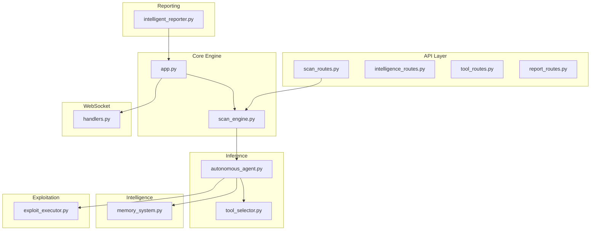
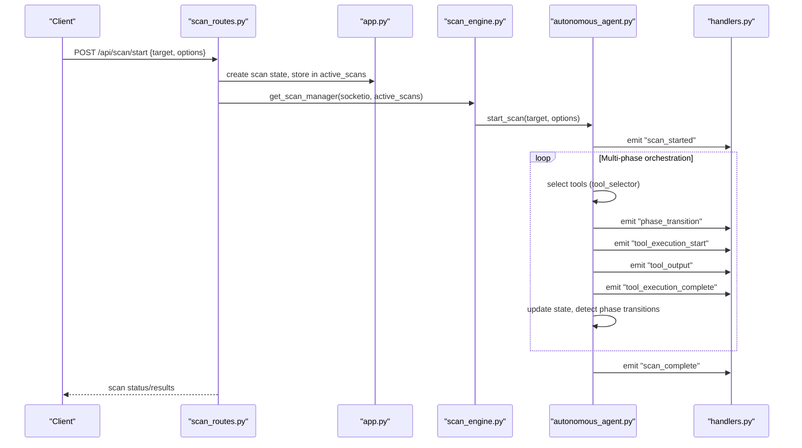
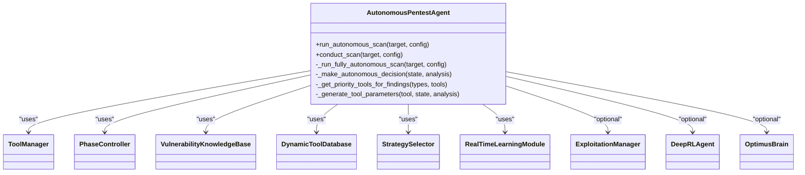
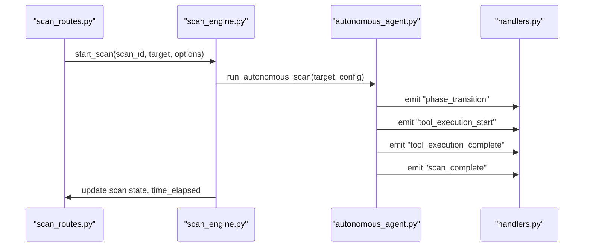
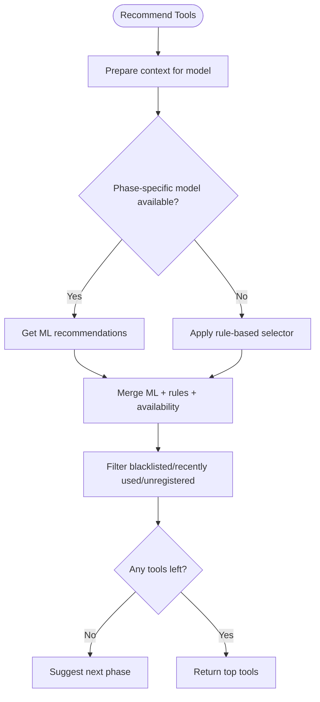
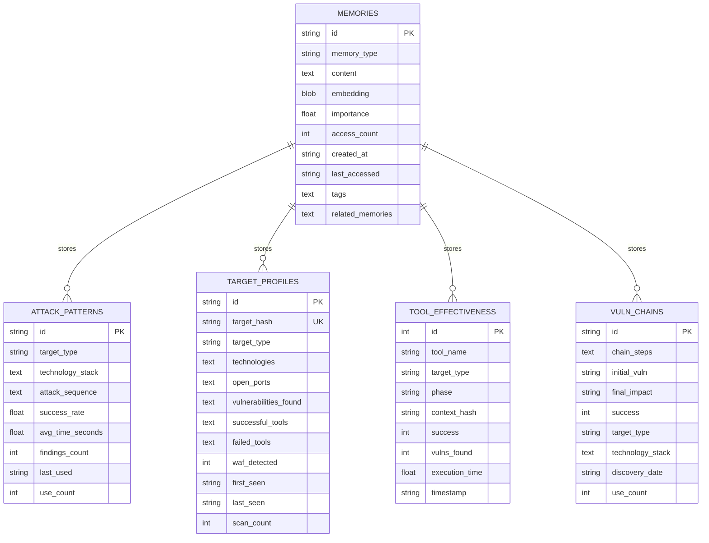
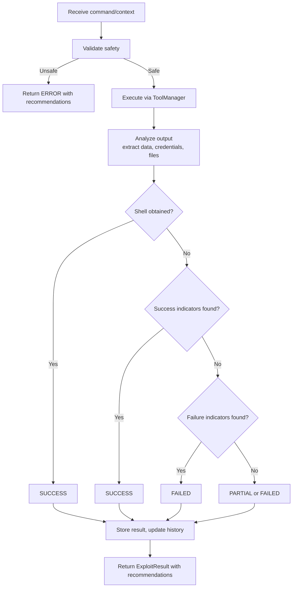
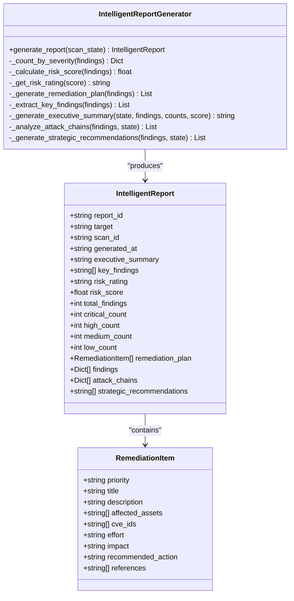
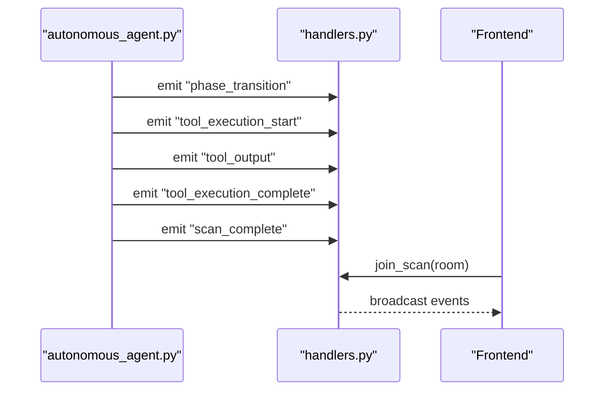
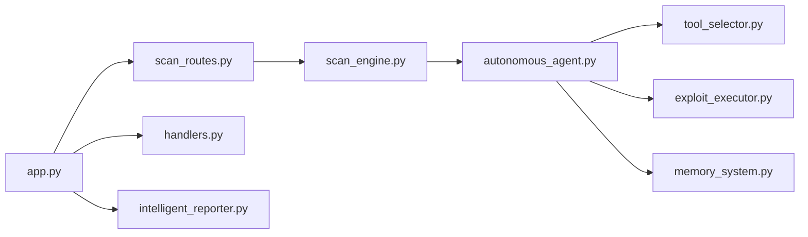

# Core Features

<cite>
**Referenced Files in This Document**
- [app.py](file://backend/app.py)
- [scan_engine.py](file://backend/core/scan_engine.py)
- [autonomous_agent.py](file://backend/inference/autonomous_agent.py)
- [memory_system.py](file://backend/intelligence/memory_system.py)
- [intelligent_reporter.py](file://backend/reporting/intelligent_reporter.py)
- [tool_selector.py](file://backend/inference/tool_selector.py)
- [exploit_executor.py](file://backend/exploitation/exploit_executor.py)
- [scan_routes.py](file://backend/api/scan_routes.py)
- [handlers.py](file://backend/websocket/handlers.py)
</cite>

## Table of Contents
1. [Introduction](#introduction)
2. [Project Structure](#project-structure)
3. [Core Components](#core-components)
4. [Architecture Overview](#architecture-overview)
5. [Detailed Component Analysis](#detailed-component-analysis)
6. [Dependency Analysis](#dependency-analysis)
7. [Performance Considerations](#performance-considerations)
8. [Troubleshooting Guide](#troubleshooting-guide)
9. [Conclusion](#conclusion)

## Introduction
This document explains the Optimus core features that enable an AI-driven autonomous penetration testing platform. It covers the end-to-end autonomous workflow across multi-phase scanning (reconnaissance, scanning, exploitation, post-exploitation), intelligent tool selection powered by hybrid ML/RL/phase-aware models, real-time progress monitoring via WebSocket events, cross-scan memory for persistent knowledge, and adaptive exploitation strategies. It also documents the relationships among the autonomous agent, intelligence layer, and reporting system, and provides concrete examples from the codebase for scan orchestration, tool integration, and report generation.

## Project Structure
Optimus is organized around a modular backend with clear separation of concerns:
- API layer: HTTP endpoints for scan lifecycle and tool execution
- Core engine: Central orchestration and state management
- Inference: Autonomous agent, tool selection, and learning modules
- Intelligence: Cross-scan memory and knowledge systems
- Exploitation: Safe, validated exploit execution with feedback loops
- Reporting: AI-enhanced report generation
- WebSocket: Real-time progress and tool output streaming

**Diagram sources**
- [app.py](file://backend/app.py#L179-L274)
- [scan_engine.py](file://backend/core/scan_engine.py#L26-L81)
- [autonomous_agent.py](file://backend/inference/autonomous_agent.py#L50-L131)
- [memory_system.py](file://backend/intelligence/memory_system.py#L42-L70)
- [intelligent_reporter.py](file://backend/reporting/intelligent_reporter.py#L72-L101)
- [tool_selector.py](file://backend/inference/tool_selector.py#L26-L67)
- [exploit_executor.py](file://backend/exploitation/exploit_executor.py#L106-L152)
- [scan_routes.py](file://backend/api/scan_routes.py#L40-L140)
- [handlers.py](file://backend/websocket/handlers.py#L26-L119)

**Section sources**
- [app.py](file://backend/app.py#L179-L274)
- [scan_engine.py](file://backend/core/scan_engine.py#L26-L81)
- [scan_routes.py](file://backend/api/scan_routes.py#L40-L140)
- [handlers.py](file://backend/websocket/handlers.py#L26-L119)

## Core Components
- Autonomous Pentest Agent: Orchestrates multi-phase scanning, adapts strategies, integrates ML/RL/phase-specific models, and coordinates tool execution and exploitation.
- Scan Manager: Central coordinator that initializes agents, manages threads, emits WebSocket events, and updates scan state.
- Tool Selector: Hybrid system combining phase-aware models, rule-based heuristics, and availability checks to recommend tools.
- Intelligence Layer: Cross-scan memory system storing attack patterns, target profiles, tool effectiveness, and vulnerability chains for persistent knowledge.
- Exploit Executor: Safely executes exploits with validation, output parsing, and feedback for learning.
- Reporting System: AI-enhanced report generator producing executive summaries, prioritized remediation plans, and attack chain analysis.

**Section sources**
- [autonomous_agent.py](file://backend/inference/autonomous_agent.py#L50-L131)
- [scan_engine.py](file://backend/core/scan_engine.py#L26-L81)
- [tool_selector.py](file://backend/inference/tool_selector.py#L26-L67)
- [memory_system.py](file://backend/intelligence/memory_system.py#L42-L70)
- [exploit_executor.py](file://backend/exploitation/exploit_executor.py#L106-L152)
- [intelligent_reporter.py](file://backend/reporting/intelligent_reporter.py#L72-L101)

## Architecture Overview
The platform’s runtime architecture ties the API, core engine, inference, intelligence, exploitation, and reporting layers together with real-time WebSocket updates.

**Diagram sources**
- [scan_routes.py](file://backend/api/scan_routes.py#L40-L140)
- [app.py](file://backend/app.py#L252-L274)
- [scan_engine.py](file://backend/core/scan_engine.py#L82-L148)
- [autonomous_agent.py](file://backend/inference/autonomous_agent.py#L133-L327)
- [handlers.py](file://backend/websocket/handlers.py#L123-L179)

## Detailed Component Analysis

### Autonomous Pentest Agent
The agent orchestrates the entire autonomous workflow:
- Initializes ToolManager, PhaseController, VulnerabilityKnowledgeBase, DynamicToolDatabase, StrategySelector, RealTimeLearningModule, and optional Deep RL agent and OptimusBrain.
- Runs a multi-phase loop across reconnaissance, scanning, exploitation, post-exploitation, and covering tracks.
- Adapts strategy and phase transitions based on findings and staleness detection.
- Generates tool parameters per phase and executes tools via ToolManager.
- Integrates exploitation via ExploitationManager and records results.

**Diagram sources**
- [autonomous_agent.py](file://backend/inference/autonomous_agent.py#L50-L131)

**Section sources**
- [autonomous_agent.py](file://backend/inference/autonomous_agent.py#L133-L327)
- [autonomous_agent.py](file://backend/inference/autonomous_agent.py#L564-L677)
- [autonomous_agent.py](file://backend/inference/autonomous_agent.py#L718-L794)

### Scan Manager and Orchestration
The Scan Manager centralizes scan lifecycle:
- Initializes ToolManager and AutonomousPentestAgent.
- Starts scans in background threads, emitting WebSocket events for phase transitions and completion.
- Manages stop/pause/resume controls and updates scan state atomically using locks.
- Provides tool execution and recommendations APIs.

**Diagram sources**
- [scan_engine.py](file://backend/core/scan_engine.py#L82-L148)
- [autonomous_agent.py](file://backend/inference/autonomous_agent.py#L133-L327)
- [handlers.py](file://backend/websocket/handlers.py#L162-L179)

**Section sources**
- [scan_engine.py](file://backend/core/scan_engine.py#L26-L81)
- [scan_engine.py](file://backend/core/scan_engine.py#L82-L148)
- [scan_engine.py](file://backend/core/scan_engine.py#L311-L364)

### Intelligent Tool Selection
The PhaseAwareToolSelector combines:
- Phase-specific models (when available) with rule-based heuristics.
- Availability checks via tool registry and anti-repetition filters.
- Confidence thresholds and reasoning for transparency.

**Diagram sources**
- [tool_selector.py](file://backend/inference/tool_selector.py#L68-L186)
- [tool_selector.py](file://backend/inference/tool_selector.py#L188-L296)
- [tool_selector.py](file://backend/inference/tool_selector.py#L298-L390)

**Section sources**
- [tool_selector.py](file://backend/inference/tool_selector.py#L26-L67)
- [tool_selector.py](file://backend/inference/tool_selector.py#L68-L186)
- [tool_selector.py](file://backend/inference/tool_selector.py#L298-L390)

### Cross-Scan Memory and Persistent Knowledge
The SmartMemorySystem persists insights across scans:
- Stores attack patterns, target profiles, tool effectiveness, vulnerability chains, and scan history.
- Supports semantic recall with embeddings and tags.
- Enables cross-scan pattern recognition and improved tool selection.

**Diagram sources**
- [memory_system.py](file://backend/intelligence/memory_system.py#L80-L183)
- [memory_system.py](file://backend/intelligence/memory_system.py#L324-L414)
- [memory_system.py](file://backend/intelligence/memory_system.py#L474-L551)
- [memory_system.py](file://backend/intelligence/memory_system.py#L639-L722)
- [memory_system.py](file://backend/intelligence/memory_system.py#L763-L800)

**Section sources**
- [memory_system.py](file://backend/intelligence/memory_system.py#L42-L70)
- [memory_system.py](file://backend/intelligence/memory_system.py#L324-L414)
- [memory_system.py](file://backend/intelligence/memory_system.py#L474-L551)
- [memory_system.py](file://backend/intelligence/memory_system.py#L639-L722)
- [memory_system.py](file://backend/intelligence/memory_system.py#L763-L800)

### Adaptive Exploitation and Safe Execution
ExploitExecutor validates commands, executes via ToolManager, parses results, and provides recommendations:
- Safety validation against destructive patterns.
- Extraction of credentials, databases, tables, versions, and files.
- Status classification (success, partial, failed, blocked, timeout).
- Recommendations for next steps and learning feedback.

**Diagram sources**
- [exploit_executor.py](file://backend/exploitation/exploit_executor.py#L240-L356)
- [exploit_executor.py](file://backend/exploitation/exploit_executor.py#L416-L533)
- [exploit_executor.py](file://backend/exploitation/exploit_executor.py#L535-L620)

**Section sources**
- [exploit_executor.py](file://backend/exploitation/exploit_executor.py#L106-L152)
- [exploit_executor.py](file://backend/exploitation/exploit_executor.py#L240-L356)
- [exploit_executor.py](file://backend/exploitation/exploit_executor.py#L416-L533)

### Reporting and Executive Summaries
The IntelligentReportGenerator produces:
- Executive summaries using LLM when available, with template fallback.
- Prioritized remediation items (P1–P4) with effort and impact.
- Risk scoring and attack chain analysis.
- Strategic recommendations based on findings.

**Diagram sources**
- [intelligent_reporter.py](file://backend/reporting/intelligent_reporter.py#L15-L70)
- [intelligent_reporter.py](file://backend/reporting/intelligent_reporter.py#L72-L101)
- [intelligent_reporter.py](file://backend/reporting/intelligent_reporter.py#L102-L160)

**Section sources**
- [intelligent_reporter.py](file://backend/reporting/intelligent_reporter.py#L102-L160)
- [intelligent_reporter.py](file://backend/reporting/intelligent_reporter.py#L188-L221)
- [intelligent_reporter.py](file://backend/reporting/intelligent_reporter.py#L223-L271)
- [intelligent_reporter.py](file://backend/reporting/intelligent_reporter.py#L388-L406)
- [intelligent_reporter.py](file://backend/reporting/intelligent_reporter.py#L484-L514)
- [intelligent_reporter.py](file://backend/reporting/intelligent_reporter.py#L516-L548)

### Real-Time Progress Monitoring
WebSocket handlers emit live events for:
- Scan lifecycle: started, update, phase transition, complete, error.
- Tool lifecycle: start, output, completion.
- Finding discovery and tool resolution.

**Diagram sources**
- [handlers.py](file://backend/websocket/handlers.py#L123-L179)
- [handlers.py](file://backend/websocket/handlers.py#L181-L238)
- [handlers.py](file://backend/websocket/handlers.py#L240-L293)

**Section sources**
- [handlers.py](file://backend/websocket/handlers.py#L26-L119)
- [handlers.py](file://backend/websocket/handlers.py#L123-L179)
- [handlers.py](file://backend/websocket/handlers.py#L181-L238)

## Dependency Analysis
Key relationships:
- app.py registers blueprints and initializes the Scan Manager and optional intelligence modules, wiring SocketIO for real-time updates.
- scan_routes.py creates scan state, delegates to scan_engine.py, and returns results/status.
- scan_engine.py initializes the autonomous agent and orchestrates multi-phase scanning, emitting WebSocket events.
- autonomous_agent.py coordinates tool selection, exploitation, and state updates.
- tool_selector.py provides hybrid tool recommendations.
- exploit_executor.py executes validated exploits and feeds results back into the agent.
- memory_system.py persists and retrieves cross-scan knowledge.
- intelligent_reporter.py generates reports from scan state.

**Diagram sources**
- [app.py](file://backend/app.py#L179-L274)
- [scan_routes.py](file://backend/api/scan_routes.py#L40-L140)
- [scan_engine.py](file://backend/core/scan_engine.py#L26-L81)
- [autonomous_agent.py](file://backend/inference/autonomous_agent.py#L50-L131)
- [tool_selector.py](file://backend/inference/tool_selector.py#L26-L67)
- [exploit_executor.py](file://backend/exploitation/exploit_executor.py#L106-L152)
- [memory_system.py](file://backend/intelligence/memory_system.py#L42-L70)
- [intelligent_reporter.py](file://backend/reporting/intelligent_reporter.py#L72-L101)

**Section sources**
- [app.py](file://backend/app.py#L179-L274)
- [scan_engine.py](file://backend/core/scan_engine.py#L26-L81)
- [autonomous_agent.py](file://backend/inference/autonomous_agent.py#L50-L131)
- [tool_selector.py](file://backend/inference/tool_selector.py#L26-L67)
- [exploit_executor.py](file://backend/exploitation/exploit_executor.py#L106-L152)
- [memory_system.py](file://backend/intelligence/memory_system.py#L42-L70)
- [intelligent_reporter.py](file://backend/reporting/intelligent_reporter.py#L72-L101)

## Performance Considerations
- Asynchronous execution and background threads prevent blocking the API and keep WebSocket updates responsive.
- Tool execution history and memory caching reduce repeated computation and improve recommendations.
- Confidence thresholds and anti-repetition mechanisms limit redundant tool usage and reduce wasted time.
- Embedding-based semantic recall in memory system balances accuracy and performance with indexing and similarity ranking.

## Troubleshooting Guide
Common issues and mitigations:
- Circular imports: Lazy loading of scan manager and active scans in routes and handlers resolves import-time conflicts.
- Tool availability: Use tool registry checks and rule-based fallbacks to avoid attempting unregistered tools.
- Safety violations: ExploitExecutor blocks destructive commands; review recommendations and adjust exploit parameters.
- WebSocket failures: Verify SocketIO configuration and room joins; ensure correlation IDs are propagated for traceability.
- Intelligence disabled: If memory or brain modules are unavailable, the agent falls back to rule-based and heuristic strategies.

**Section sources**
- [scan_routes.py](file://backend/api/scan_routes.py#L22-L33)
- [handlers.py](file://backend/websocket/handlers.py#L16-L24)
- [exploit_executor.py](file://backend/exploitation/exploit_executor.py#L394-L414)
- [app.py](file://backend/app.py#L232-L239)

## Conclusion
Optimus delivers a robust, AI-driven autonomous penetration testing platform. Its multi-phase scanning, hybrid intelligent tool selection, real-time monitoring, cross-scan memory, and adaptive exploitation collectively enable efficient and effective security assessments. The modular architecture ensures maintainability, extensibility, and resilience, while the reporting system transforms raw findings into actionable insights for stakeholders.