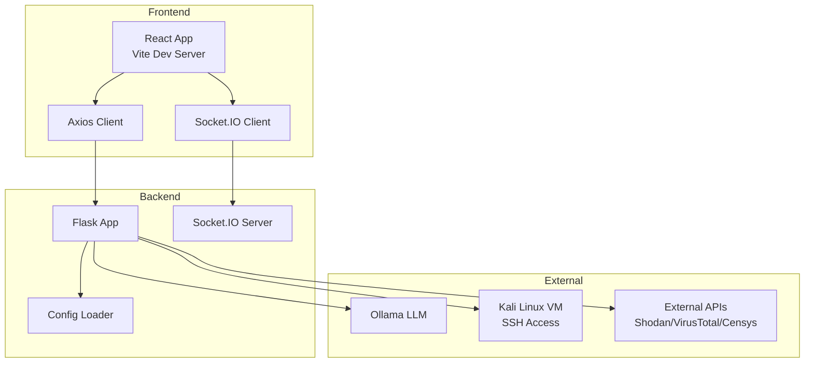

# Getting Started Guide

<cite>
**Referenced Files in This Document**
- [README.md](file://README.md)
- [.env.example](file://.env.example)
- [frontend/.env.example](file://frontend/.env.example)
- [backend/requirements.txt](file://backend/requirements.txt)
- [frontend/package.json](file://frontend/package.json)
- [scripts/start.sh](file://scripts/start.sh)
- [scripts/health_check.sh](file://scripts/health_check.sh)
- [START_OPTIMUS.bat](file://START_OPTIMUS.bat)
- [backend/app.py](file://backend/app.py)
- [backend/config.py](file://backend/config.py)
- [frontend/vite.config.ts](file://frontend/vite.config.ts)
- [frontend/src/App.tsx](file://frontend/src/App.tsx)
- [frontend/src/pages/Scan.tsx](file://frontend/src/pages/Scan.tsx)
- [frontend/src/services/api.ts](file://frontend/src/services/api.ts)
- [frontend/src/services/socket.ts](file://frontend/src/services/socket.ts)
- [frontend/src/hooks/index.ts](file://frontend/src/hooks/index.ts)
- [frontend/src/components/ScanProgress.tsx](file://frontend/src/components/ScanProgress.tsx)
- [frontend/src/components/Terminal.tsx](file://frontend/src/components/Terminal.tsx)
</cite>

## Table of Contents
1. [Introduction](#introduction)
2. [Prerequisites](#prerequisites)
3. [System Requirements](#system-requirements)
4. [Installation](#installation)
5. [Environment Configuration](#environment-configuration)
6. [First Scan Tutorial](#first-scan-tutorial)
7. [Architecture Overview](#architecture-overview)
8. [Troubleshooting Guide](#troubleshooting-guide)
9. [Conclusion](#conclusion)

## Introduction
Optimus is an AI-powered security testing platform that automates penetration testing across reconnaissance, scanning, exploitation, and post-exploitation phases. It features intelligent tool selection, real-time monitoring via WebSocket, vulnerability chaining, and self-learning parsers. This guide helps you set up the platform, configure environments, and run your first scan with practical examples.

## Prerequisites
Before installing Optimus, ensure you have:
- Python 3.10+ for the backend
- Node.js 16+ for the frontend
- Ollama for local LLM integration
- A Kali Linux VM with SSH access
- Git for cloning the repository

These requirements are essential for backend API startup, frontend development server, AI model inference, and remote tool execution on the Kali VM.

**Section sources**
- [README.md](file://README.md#L23-L30)

## System Requirements
- Hardware: Minimum 8 GB RAM recommended; 16 GB+ for optimal performance during AI inference and scanning
- Operating Systems: Windows, macOS, or Linux for development; Kali Linux VM for target execution
- Network: Local access to Ollama (default port 11434), SSH access to Kali VM, and outbound internet for optional external APIs
- Ports: Backend API runs on port 5000; Frontend runs on port 5173; WebSocket connections supported

Note: These requirements align with the default ports and integrations defined in the project configuration.

**Section sources**
- [backend/app.py](file://backend/app.py#L325-L340)
- [frontend/vite.config.ts](file://frontend/vite.config.ts#L13-L34)
- [backend/config.py](file://backend/config.py#L48-L52)

## Installation
Follow these steps to install and run Optimus locally:

1. Clone the repository and enter the project directory
2. Backend setup
   - Create a Python virtual environment
   - Activate the environment
   - Install backend dependencies
3. Frontend setup
   - Install Node.js dependencies
4. Start the platform
   - Use the provided scripts or manual commands

Step-by-step instructions:

- Backend virtual environment and dependencies
  - Navigate to the backend directory
  - Create a virtual environment
  - Activate the environment
  - Install Python packages from requirements.txt

- Frontend dependencies
  - Navigate to the frontend directory
  - Install Node.js packages

- Start the platform
  - Option A: Use the Bash script to start both backend and frontend
  - Option B: Use the Windows batch script for automated startup
  - Option C: Start backend and frontend manually

Verification:
- Health checks confirm backend and frontend are responsive
- Logs are written to the logs directory for diagnostics

**Section sources**
- [README.md](file://README.md#L31-L82)
- [backend/requirements.txt](file://backend/requirements.txt#L1-L49)
- [frontend/package.json](file://frontend/package.json#L1-L50)
- [scripts/start.sh](file://scripts/start.sh#L1-L53)
- [scripts/health_check.sh](file://scripts/health_check.sh#L1-L63)
- [START_OPTIMUS.bat](file://START_OPTIMUS.bat#L1-L91)

## Environment Configuration
Configure environment variables for both backend and frontend:

- Backend (.env)
  - Copy .env.example to .env
  - Set Kali VM SSH credentials and connection parameters
  - Configure Ollama base URL, model, and timeout
  - Enable/disable intelligence features and training flags
  - Optional: External API keys (Shodan, VirusTotal, Censys)

- Frontend (.env)
  - Set VITE_API_URL and VITE_WS_URL to match backend host and port
  - Adjust app version if needed

Key configuration points:
- Kali VM SSH: KALI_HOST, KALI_PORT, KALI_USER, KALI_PASSWORD, KALI_KEY_PATH
- Ollama: OLLAMA_BASE_URL, OLLAMA_MODEL, OLLAMA_TIMEOUT
- Paths: DATASET_PATH, MODEL_PATH, DATA_PATH
- Training: TRAINING_ENABLED, RL hyperparameters
- Intelligence: Feature toggles and cache TTL

Example references:
- Backend environment variables and defaults
- Frontend environment variables for API and WebSocket URLs

**Section sources**
- [.env.example](file://.env.example#L1-L77)
- [frontend/.env.example](file://frontend/.env.example#L1-L11)
- [backend/config.py](file://backend/config.py#L6-L77)

## First Scan Tutorial
Perform your first scan using the frontend dashboard:

1. Start the backend and frontend servers
2. Open the dashboard at http://localhost:5173
3. Navigate to the Scan page
4. Configure target and scan options
5. Initiate the scan and monitor progress

Step-by-step walkthrough:

- Target configuration
  - Enter a valid URL or IP address
  - Choose scan mode: Quick, Standard, or Full Pentest
  - Toggle advanced options (enable exploitation, AI-powered analysis, duration, excluded paths)

- Scan initiation
  - Click Start Scan
  - The frontend calls the backend API to start a new scan
  - WebSocket events stream real-time updates

- Monitor progress
  - Scan progress timeline shows current phase
  - Terminal displays live tool output and system messages
  - Findings panel lists discovered vulnerabilities

- Result interpretation
  - Coverage percentage indicates breadth of testing
  - Tools executed count reflects automation depth
  - Severity levels help prioritize remediation

Practical example:
- Target: https://example.com
- Mode: Standard
- Enable exploitation: Off (safe default)
- AI-powered analysis: On
- Max duration: 3600 seconds
- Excluded paths: Leave empty for full scope

Expected outcome:
- Real-time terminal output from reconnaissance to reporting
- Vulnerability findings categorized by severity
- Final report generation option available

**Section sources**
- [frontend/src/pages/Scan.tsx](file://frontend/src/pages/Scan.tsx#L36-L119)
- [frontend/src/services/api.ts](file://frontend/src/services/api.ts#L63-L152)
- [frontend/src/services/socket.ts](file://frontend/src/services/socket.ts#L64-L237)
- [frontend/src/hooks/index.ts](file://frontend/src/hooks/index.ts#L62-L197)
- [frontend/src/components/ScanProgress.tsx](file://frontend/src/components/ScanProgress.tsx#L38-L234)
- [frontend/src/components/Terminal.tsx](file://frontend/src/components/Terminal.tsx#L20-L181)

## Architecture Overview
Optimus consists of:
- Backend API (Flask + Socket.IO) with CORS enabled and health checks
- Frontend (React + TypeScript) with Vite proxy for API and WebSocket traffic
- Intelligence and tool systems integrated via environment-configured features
- WebSocket-based real-time communication for scan events

**Diagram sources**
- [backend/app.py](file://backend/app.py#L120-L163)
- [frontend/vite.config.ts](file://frontend/vite.config.ts#L13-L34)
- [frontend/src/services/api.ts](file://frontend/src/services/api.ts#L19-L57)
- [frontend/src/services/socket.ts](file://frontend/src/services/socket.ts#L64-L106)
- [backend/config.py](file://backend/config.py#L48-L77)

## Troubleshooting Guide
Common setup issues and resolutions:

- Backend not starting
  - Verify Python version meets prerequisites
  - Ensure virtual environment is activated and dependencies installed
  - Check logs in the logs directory for errors

- Frontend not loading
  - Confirm Node.js version meets prerequisites
  - Install frontend dependencies and retry
  - Verify Vite proxy settings match backend host/port

- Health check failures
  - Use the health check script to verify backend and frontend status
  - Review backend.log and frontend.log for stack traces

- WebSocket connection errors
  - Ensure backend is reachable at the configured host/port
  - Check firewall rules and CORS configuration
  - Confirm Socket.IO client and server versions are compatible

- SSH connectivity to Kali VM
  - Validate KALI_HOST, KALI_PORT, KALI_USER, and KALI_PASSWORD
  - Test SSH access independently before starting scans
  - Consider using key-based authentication for automation

- Ollama integration
  - Confirm Ollama is running and accessible at the configured base URL
  - Verify the model name matches the installed Ollama model
  - Increase timeout if inference takes longer than expected

- Port conflicts
  - Backend runs on port 5000; frontend on 5173
  - Change ports in configuration if needed
  - Use strictPort in Vite to prevent unexpected port reuse

**Section sources**
- [scripts/health_check.sh](file://scripts/health_check.sh#L1-L63)
- [backend/app.py](file://backend/app.py#L276-L290)
- [frontend/vite.config.ts](file://frontend/vite.config.ts#L13-L34)
- [backend/config.py](file://backend/config.py#L12-L35)
- [frontend/src/services/socket.ts](file://frontend/src/services/socket.ts#L94-L100)

## Conclusion
You now have the essentials to install Optimus, configure environments, and run your first scan. Start with the backend and frontend setup, validate connectivity to the Kali VM and Ollama, and use the Scan page to initiate and monitor tests. Refer to the troubleshooting section for resolving common issues and consult the health check script for ongoing operational verification.