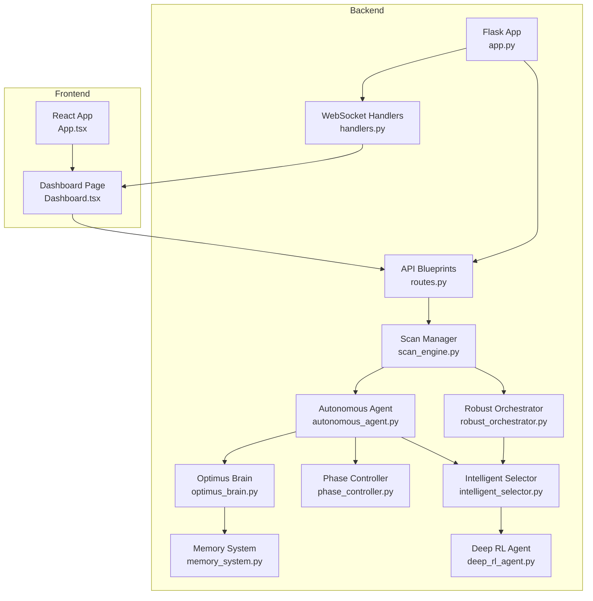
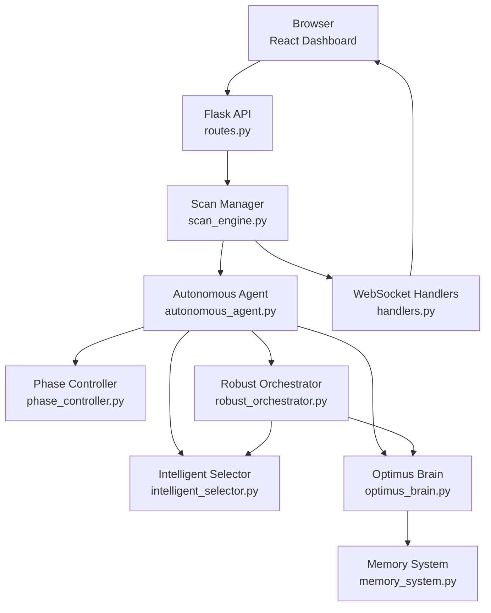
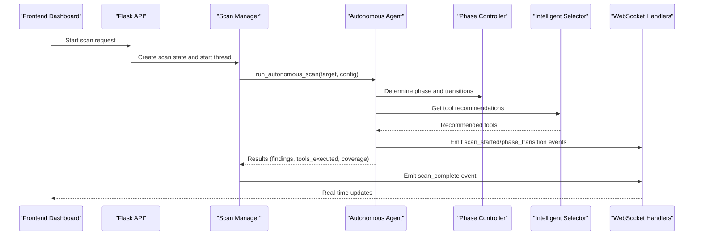
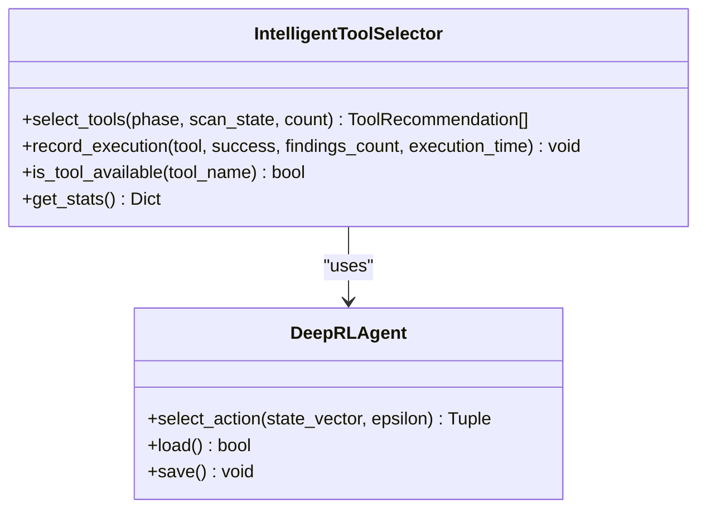
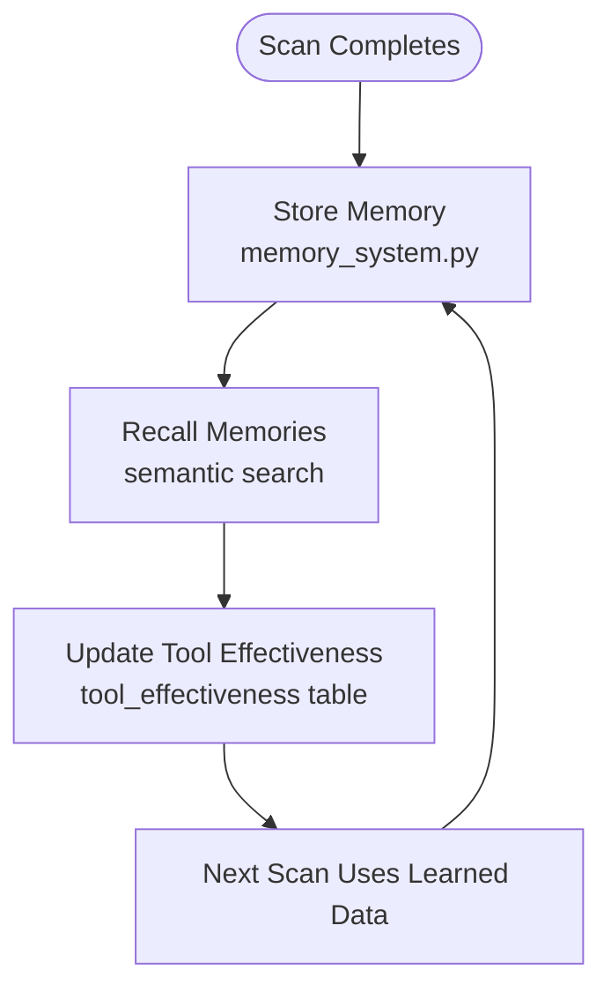
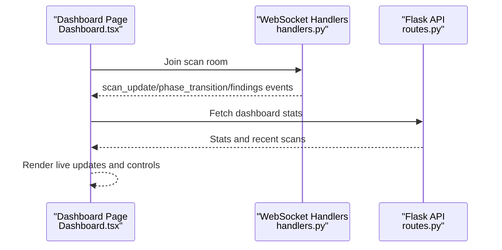
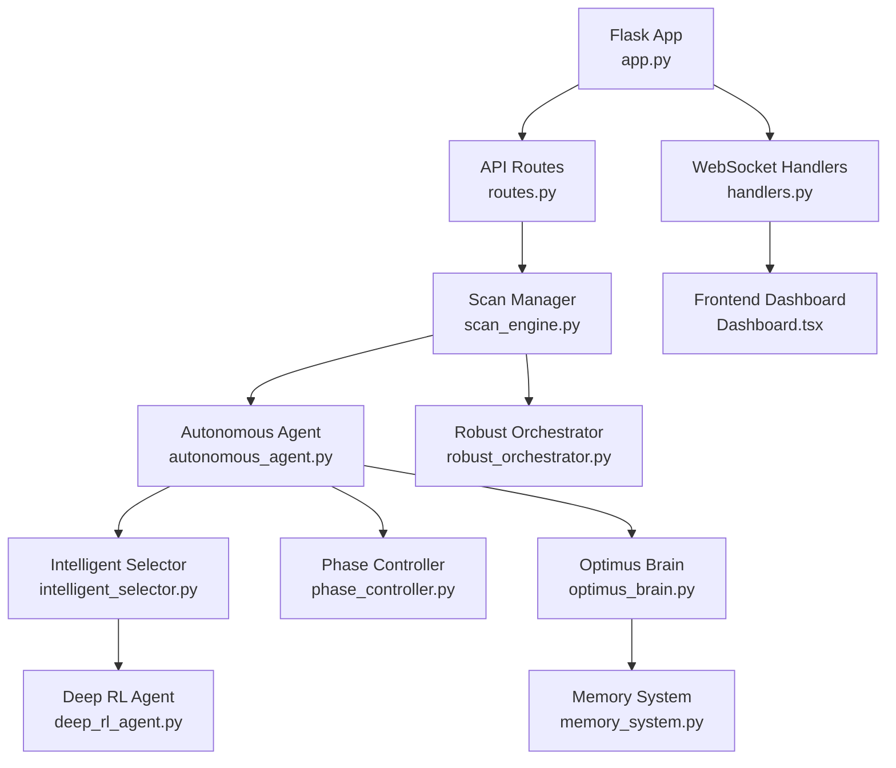

# Project Overview

<cite>
**Referenced Files in This Document**
- [README.md](file://README.md)
- [app.py](file://backend/app.py)
- [routes.py](file://backend/api/routes.py)
- [scan_engine.py](file://backend/core/scan_engine.py)
- [autonomous_agent.py](file://backend/inference/autonomous_agent.py)
- [intelligent_selector.py](file://backend/inference/intelligent_selector.py)
- [phase_controller.py](file://backend/inference/phase_controller.py)
- [memory_system.py](file://backend/intelligence/memory_system.py)
- [optimus_brain.py](file://backend/intelligence/optimus_brain.py)
- [handlers.py](file://backend/websocket/handlers.py)
- [deep_rl_agent.py](file://backend/training/deep_rl_agent.py)
- [robust_orchestrator.py](file://backend/inference/robust_orchestrator.py)
- [App.tsx](file://frontend/src/App.tsx)
- [Dashboard.tsx](file://frontend/src/pages/Dashboard.tsx)
</cite>

## Table of Contents
1. [Introduction](#introduction)
2. [Project Structure](#project-structure)
3. [Core Components](#core-components)
4. [Architecture Overview](#architecture-overview)
5. [Detailed Component Analysis](#detailed-component-analysis)
6. [Dependency Analysis](#dependency-analysis)
7. [Performance Considerations](#performance-considerations)
8. [Troubleshooting Guide](#troubleshooting-guide)
9. [Conclusion](#conclusion)

## Introduction
Optimus is an AI-powered autonomous penetration testing platform designed to perform end-to-end vulnerability discovery and exploitation with minimal human intervention. It combines a React-based frontend dashboard with a Flask backend API and WebSocket real-time monitoring to deliver a modern, integrated security testing experience. The platform emphasizes autonomous scanning, multi-phase workflows, intelligent tool selection, and persistent cross-scan learning to improve decision-making over time.

Key value propositions:
- Autonomous scanning: AI-driven decision making automates reconnaissance, scanning, exploitation, and post-exploitation phases.
- Multi-phase approach: Structured progression with phase controllers ensuring adequate coverage and timing.
- Intelligent tool selection: Deep RL agent and rule-based selectors adaptively choose tools based on target characteristics and findings.
- Real-time monitoring: WebSocket events stream live scan updates, tool execution logs, and findings to the dashboard.
- Cross-scan memory: Persistent memory system learns from previous scans to optimize future assessments.

## Project Structure
The project follows a layered architecture:
- Frontend: React SPA with routing, real-time WebSocket integration, and reusable UI components.
- Backend: Flask API with blueprints for routes, WebSocket handlers, and centralized scan management.
- Inference: Autonomous agent, intelligent selector, phase controller, and orchestrator modules.
- Intelligence: Unified intelligence engine (Optimus Brain) integrating memory, web intelligence, and adaptive engines.
- Training: Deep RL agent with dueling architecture and prioritized experience replay for tool selection.
- Reporting: Professional report generation and export utilities.

**Diagram sources**
- [app.py](file://backend/app.py#L120-L228)
- [routes.py](file://backend/api/routes.py#L1-L54)
- [handlers.py](file://backend/websocket/handlers.py#L26-L119)
- [scan_engine.py](file://backend/core/scan_engine.py#L26-L81)
- [autonomous_agent.py](file://backend/inference/autonomous_agent.py#L50-L132)
- [robust_orchestrator.py](file://backend/inference/robust_orchestrator.py#L129-L156)
- [intelligent_selector.py](file://backend/inference/intelligent_selector.py#L33-L690)
- [phase_controller.py](file://backend/inference/phase_controller.py#L7-L115)
- [memory_system.py](file://backend/intelligence/memory_system.py#L42-L186)
- [optimus_brain.py](file://backend/intelligence/optimus_brain.py#L46-L170)
- [deep_rl_agent.py](file://backend/training/deep_rl_agent.py#L187-L200)
- [App.tsx](file://frontend/src/App.tsx#L81-L161)
- [Dashboard.tsx](file://frontend/src/pages/Dashboard.tsx#L33-L227)

**Section sources**
- [README.md](file://README.md#L1-L96)
- [app.py](file://backend/app.py#L120-L228)
- [routes.py](file://backend/api/routes.py#L1-L54)
- [handlers.py](file://backend/websocket/handlers.py#L26-L119)
- [scan_engine.py](file://backend/core/scan_engine.py#L26-L81)
- [autonomous_agent.py](file://backend/inference/autonomous_agent.py#L50-L132)
- [robust_orchestrator.py](file://backend/inference/robust_orchestrator.py#L129-L156)
- [intelligent_selector.py](file://backend/inference/intelligent_selector.py#L33-L690)
- [phase_controller.py](file://backend/inference/phase_controller.py#L7-L115)
- [memory_system.py](file://backend/intelligence/memory_system.py#L42-L186)
- [optimus_brain.py](file://backend/intelligence/optimus_brain.py#L46-L170)
- [deep_rl_agent.py](file://backend/training/deep_rl_agent.py#L187-L200)
- [App.tsx](file://frontend/src/App.tsx#L81-L161)
- [Dashboard.tsx](file://frontend/src/pages/Dashboard.tsx#L33-L227)

## Core Components
- Flask API and Blueprints: Centralized endpoints for dashboard stats, scan lifecycle, tool execution, intelligence, metrics, and reports.
- Scan Manager: Orchestrates scan threads, manages state, emits WebSocket events, and coordinates the autonomous agent or robust orchestrator.
- Autonomous Agent: Executes multi-phase scans, selects tools, adapts strategy, and integrates with the intelligence layer.
- Intelligent Selector: Combines Deep RL agent, rule-based heuristics, and reactive recommendations to pick tools dynamically.
- Phase Controller: Enforces structured progression across reconnaissance, enumeration, vulnerability scanning, exploitation, and post-exploitation.
- Optimus Brain: Unified intelligence engine integrating memory, web intelligence, adaptive exploitation, vulnerability chaining, explainable AI, continuous learning, and campaign intelligence.
- Memory System: Persistent cross-scan memory enabling pattern recognition, tool effectiveness tracking, and target profiling.
- Deep RL Agent: Dueling Double DQN with prioritized experience replay for intelligent tool selection.
- WebSocket Handlers: Real-time event streaming for scan updates, tool execution, findings, and phase transitions.
- Frontend Dashboard: Real-time monitoring, scan controls, findings display, and quick actions.

**Section sources**
- [routes.py](file://backend/api/routes.py#L1-L54)
- [scan_engine.py](file://backend/core/scan_engine.py#L26-L81)
- [autonomous_agent.py](file://backend/inference/autonomous_agent.py#L50-L132)
- [intelligent_selector.py](file://backend/inference/intelligent_selector.py#L33-L690)
- [phase_controller.py](file://backend/inference/phase_controller.py#L7-L115)
- [optimus_brain.py](file://backend/intelligence/optimus_brain.py#L46-L170)
- [memory_system.py](file://backend/intelligence/memory_system.py#L42-L186)
- [deep_rl_agent.py](file://backend/training/deep_rl_agent.py#L187-L200)
- [handlers.py](file://backend/websocket/handlers.py#L26-L119)
- [Dashboard.tsx](file://frontend/src/pages/Dashboard.tsx#L33-L227)

## Architecture Overview
The system architecture integrates a React dashboard with a Flask backend that exposes REST endpoints and WebSocket channels. The backend initializes the intelligence layer and hybrid tool system, registers route blueprints, and manages scan lifecycle via a central Scan Manager. The autonomous agent or robust orchestrator executes multi-phase scans, leveraging the intelligent selector and phase controller, while emitting real-time updates through WebSocket events.

**Diagram sources**
- [app.py](file://backend/app.py#L179-L274)
- [routes.py](file://backend/api/routes.py#L1-L54)
- [handlers.py](file://backend/websocket/handlers.py#L26-L119)
- [scan_engine.py](file://backend/core/scan_engine.py#L26-L81)
- [autonomous_agent.py](file://backend/inference/autonomous_agent.py#L50-L132)
- [robust_orchestrator.py](file://backend/inference/robust_orchestrator.py#L129-L156)
- [intelligent_selector.py](file://backend/inference/intelligent_selector.py#L33-L690)
- [phase_controller.py](file://backend/inference/phase_controller.py#L7-L115)
- [optimus_brain.py](file://backend/intelligence/optimus_brain.py#L46-L170)
- [memory_system.py](file://backend/intelligence/memory_system.py#L42-L186)

## Detailed Component Analysis

### Autonomous Agent and Multi-Phase Execution
The autonomous agent orchestrates end-to-end scans with adaptive decision-making, strategy selection, and real-time learning. It initializes tool management, intelligent selection, phase control, knowledge bases, and optional exploitation and RL components. The agent enforces phase transitions based on findings, coverage, and iterative feedback loops, emitting WebSocket events for real-time monitoring.

**Diagram sources**
- [scan_engine.py](file://backend/core/scan_engine.py#L82-L148)
- [autonomous_agent.py](file://backend/inference/autonomous_agent.py#L133-L327)
- [phase_controller.py](file://backend/inference/phase_controller.py#L28-L114)
- [intelligent_selector.py](file://backend/inference/intelligent_selector.py#L300-L383)
- [handlers.py](file://backend/websocket/handlers.py#L123-L179)

**Section sources**
- [autonomous_agent.py](file://backend/inference/autonomous_agent.py#L50-L132)
- [autonomous_agent.py](file://backend/inference/autonomous_agent.py#L133-L327)
- [phase_controller.py](file://backend/inference/phase_controller.py#L28-L114)
- [intelligent_selector.py](file://backend/inference/intelligent_selector.py#L300-L383)
- [scan_engine.py](file://backend/core/scan_engine.py#L82-L148)
- [handlers.py](file://backend/websocket/handlers.py#L123-L179)

### Intelligent Tool Selection and Deep RL
The intelligent selector integrates a trained Deep RL agent with rule-based and reactive strategies. It encodes scan states, selects tools with confidence scores, and records execution outcomes to refine future selections. The Deep RL agent employs a dueling architecture with double DQN, prioritized experience replay, and noisy networks for exploration.

**Diagram sources**
- [intelligent_selector.py](file://backend/inference/intelligent_selector.py#L33-L690)
- [deep_rl_agent.py](file://backend/training/deep_rl_agent.py#L187-L200)

**Section sources**
- [intelligent_selector.py](file://backend/inference/intelligent_selector.py#L33-L690)
- [deep_rl_agent.py](file://backend/training/deep_rl_agent.py#L187-L200)

### Cross-Scan Memory and Learning
The memory system persists findings, tool effectiveness, attack patterns, and target profiles across scans. It supports semantic search, pattern recognition, and statistical summaries to inform intelligent decisions. The Optimus Brain coordinates memory access and integrates with other intelligence modules for unified decision-making.

**Diagram sources**
- [memory_system.py](file://backend/intelligence/memory_system.py#L189-L241)
- [memory_system.py](file://backend/intelligence/memory_system.py#L325-L414)
- [memory_system.py](file://backend/intelligence/memory_system.py#L639-L722)

**Section sources**
- [memory_system.py](file://backend/intelligence/memory_system.py#L42-L186)
- [memory_system.py](file://backend/intelligence/memory_system.py#L189-L241)
- [memory_system.py](file://backend/intelligence/memory_system.py#L325-L414)
- [memory_system.py](file://backend/intelligence/memory_system.py#L639-L722)
- [optimus_brain.py](file://backend/intelligence/optimus_brain.py#L46-L170)

### Frontend Dashboard and Real-Time Monitoring
The React dashboard provides real-time visibility into scan progress, findings, and recent activity. It subscribes to WebSocket events to render live updates, terminal output, and scan status. Users can initiate scans, review findings, and navigate to reports.

**Diagram sources**
- [Dashboard.tsx](file://frontend/src/pages/Dashboard.tsx#L33-L227)
- [handlers.py](file://backend/websocket/handlers.py#L50-L119)
- [routes.py](file://backend/api/routes.py#L19-L54)

**Section sources**
- [Dashboard.tsx](file://frontend/src/pages/Dashboard.tsx#L33-L227)
- [handlers.py](file://backend/websocket/handlers.py#L50-L119)
- [routes.py](file://backend/api/routes.py#L19-L54)

## Dependency Analysis
The backend composes multiple modules with clear separation of concerns:
- Flask app registers blueprints for API routes and WebSocket handlers, initializes the intelligence layer and hybrid tool system, and manages global state for active scans.
- Scan Manager depends on the autonomous agent or robust orchestrator, tool manager, and WebSocket handlers to coordinate execution and emit events.
- The autonomous agent integrates the intelligent selector, phase controller, memory system, and optional exploitation components.
- The intelligent selector relies on the Deep RL agent and tool availability checks.
- The frontend depends on API endpoints and WebSocket channels for real-time updates.

**Diagram sources**
- [app.py](file://backend/app.py#L179-L274)
- [routes.py](file://backend/api/routes.py#L1-L54)
- [handlers.py](file://backend/websocket/handlers.py#L26-L119)
- [scan_engine.py](file://backend/core/scan_engine.py#L26-L81)
- [autonomous_agent.py](file://backend/inference/autonomous_agent.py#L50-L132)
- [robust_orchestrator.py](file://backend/inference/robust_orchestrator.py#L129-L156)
- [intelligent_selector.py](file://backend/inference/intelligent_selector.py#L33-L690)
- [phase_controller.py](file://backend/inference/phase_controller.py#L7-L115)
- [optimus_brain.py](file://backend/intelligence/optimus_brain.py#L46-L170)
- [memory_system.py](file://backend/intelligence/memory_system.py#L42-L186)
- [deep_rl_agent.py](file://backend/training/deep_rl_agent.py#L187-L200)
- [Dashboard.tsx](file://frontend/src/pages/Dashboard.tsx#L33-L227)

**Section sources**
- [app.py](file://backend/app.py#L179-L274)
- [scan_engine.py](file://backend/core/scan_engine.py#L26-L81)
- [autonomous_agent.py](file://backend/inference/autonomous_agent.py#L50-L132)
- [intelligent_selector.py](file://backend/inference/intelligent_selector.py#L33-L690)
- [phase_controller.py](file://backend/inference/phase_controller.py#L7-L115)
- [optimus_brain.py](file://backend/intelligence/optimus_brain.py#L46-L170)
- [memory_system.py](file://backend/intelligence/memory_system.py#L42-L186)
- [deep_rl_agent.py](file://backend/training/deep_rl_agent.py#L187-L200)
- [handlers.py](file://backend/websocket/handlers.py#L26-L119)
- [Dashboard.tsx](file://frontend/src/pages/Dashboard.tsx#L33-L227)

## Performance Considerations
- Asynchronous execution: Background threads and WebSocket events prevent blocking and enable responsive UI updates during scans.
- Phase enforcement: Phase controllers enforce minimum tool execution and time thresholds to ensure adequate coverage without premature termination.
- Intelligent selection: The intelligent selector reduces redundant tool execution and focuses on high-impact actions based on findings and target characteristics.
- Memory caching: In-memory caches in the memory system accelerate frequent queries and reduce database overhead.
- RL agent loading: The Deep RL agent is conditionally loaded to balance startup time and capability.

[No sources needed since this section provides general guidance]

## Troubleshooting Guide
Common issues and resolutions:
- WebSocket connectivity: Verify origins and credentials configuration in the Flask app and ensure the frontend connects to the correct backend address.
- Scan state synchronization: Use the scan manager’s thread-safe access patterns and locks to avoid race conditions when updating scan state.
- Tool availability: Confirm tool availability checks and SSH client connectivity for remote tool execution.
- Memory persistence: Ensure the memory database path exists and is writable; verify SQLite initialization and indexing.
- RL model loading: Confirm TensorFlow availability and model weights presence for the Deep RL agent.

**Section sources**
- [app.py](file://backend/app.py#L124-L163)
- [handlers.py](file://backend/websocket/handlers.py#L26-L119)
- [scan_engine.py](file://backend/core/scan_engine.py#L374-L421)
- [memory_system.py](file://backend/intelligence/memory_system.py#L75-L183)
- [deep_rl_agent.py](file://backend/training/deep_rl_agent.py#L20-L34)

## Conclusion
Optimus delivers a modern, autonomous penetration testing platform that combines structured multi-phase workflows with AI-driven decision-making. Its architecture integrates a React dashboard, Flask API, intelligent tool selection, cross-scan memory, and real-time monitoring to streamline security assessments. By emphasizing autonomous scanning, adaptive tool selection, and persistent learning, Optimus accelerates vulnerability discovery and exploitation while providing actionable insights through professional reporting and explainable AI.