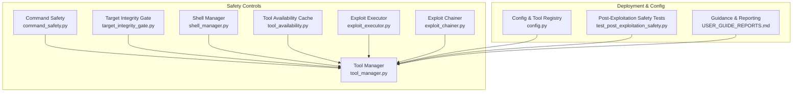
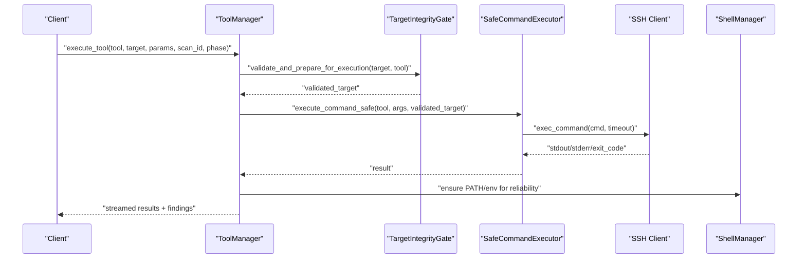
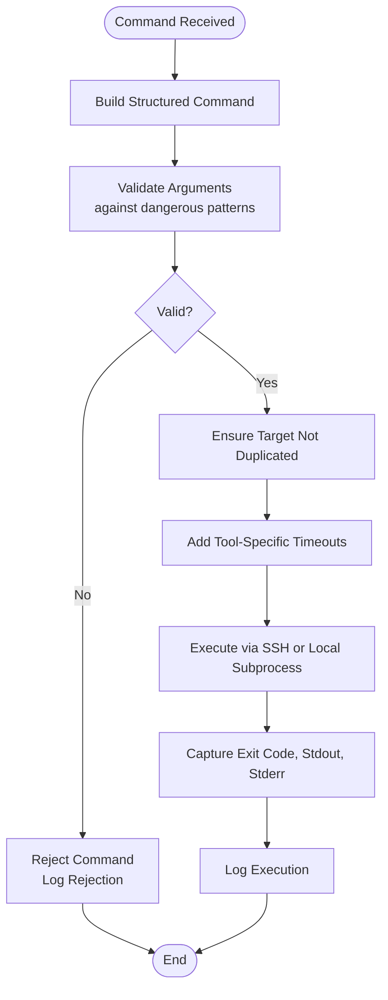
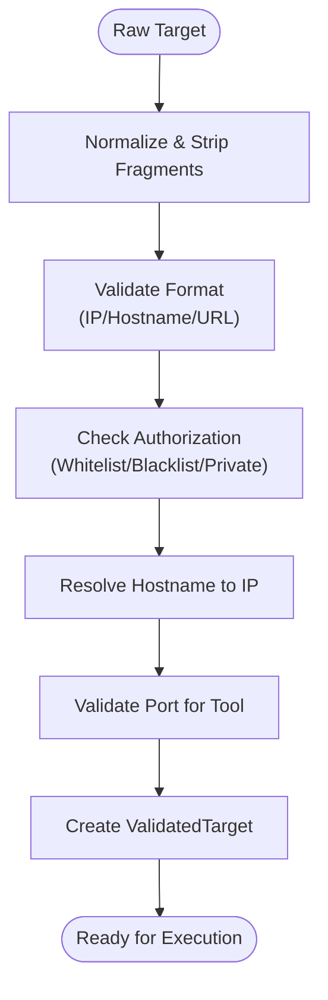
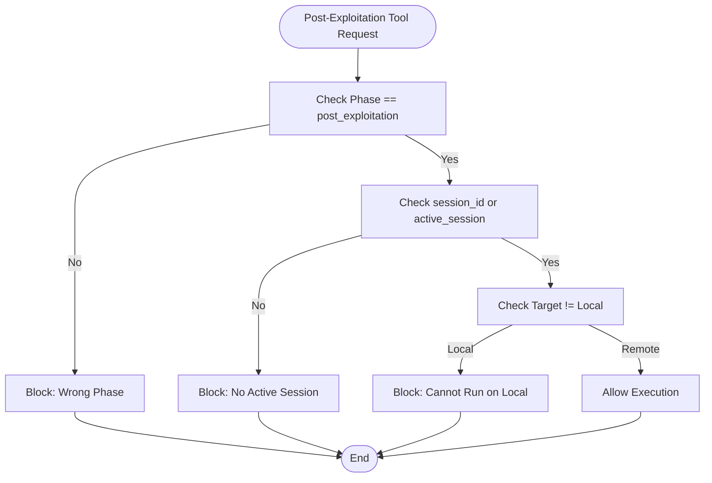
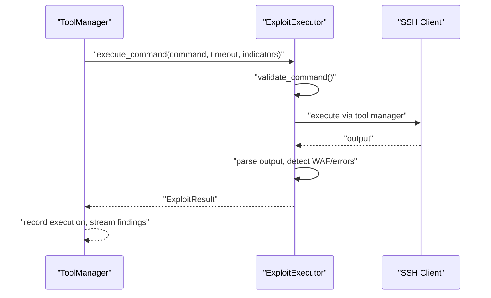
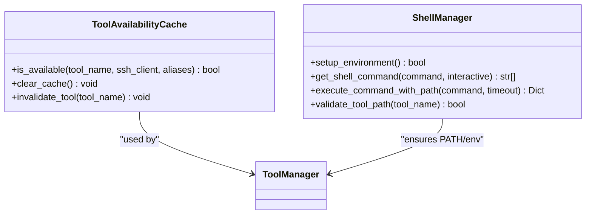
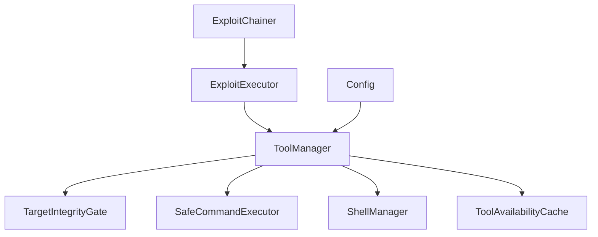

# Security Considerations

<cite>
**Referenced Files in This Document**
- [README.md](file://README.md)
- [config.py](file://backend/config.py)
- [command_safety.py](file://backend/inference/command_safety.py)
- [target_integrity_gate.py](file://backend/inference/target_integrity_gate.py)
- [tool_manager.py](file://backend/inference/tool_manager.py)
- [shell_manager.py](file://backend/execution/shell_manager.py)
- [exploit_executor.py](file://backend/exploitation/exploit_executor.py)
- [exploit_chainer.py](file://backend/exploitation/exploit_chainer.py)
- [test_post_exploitation_safety.py](file://backend/testing/test_post_exploitation_safety.py)
- [tool_availability.py](file://backend/inference/tool_availability.py)
- [USER_GUIDE_REPORTS.md](file://docs/USER_GUIDE_REPORTS.md)
</cite>

## Table of Contents
1. [Introduction](#introduction)
2. [Project Structure](#project-structure)
3. [Core Components](#core-components)
4. [Architecture Overview](#architecture-overview)
5. [Detailed Component Analysis](#detailed-component-analysis)
6. [Dependency Analysis](#dependency-analysis)
7. [Performance Considerations](#performance-considerations)
8. [Troubleshooting Guide](#troubleshooting-guide)
9. [Conclusion](#conclusion)
10. [Appendices](#appendices)

## Introduction
This document presents Optimus security considerations with a focus on responsible usage and safety measures. It explains command safety controls (input validation, timeout management, and resource limiting), post-exploitation safety mechanisms (session gating, rate limiting, and timeout enforcement), target integrity gates to prevent unintended damage, and operational best practices for deployment environments. It also provides ethical hacking guidelines, responsible disclosure procedures, legal compliance expectations, and troubleshooting guidance for security-related issues.

## Project Structure
Optimus integrates safety controls across several layers:
- Command safety and execution orchestration
- Target integrity validation and authorization
- Tool execution with SSH and environment hardening
- Exploitation execution with safety checks and result parsing
- Post-exploitation safeguards and rate limiting
- Configuration-driven tool lists and phase boundaries

**Diagram sources**
- [command_safety.py](file://backend/inference/command_safety.py#L1-L362)
- [target_integrity_gate.py](file://backend/inference/target_integrity_gate.py#L1-L366)
- [tool_manager.py](file://backend/inference/tool_manager.py#L1-L800)
- [shell_manager.py](file://backend/execution/shell_manager.py#L1-L320)
- [exploit_executor.py](file://backend/exploitation/exploit_executor.py#L1-L729)
- [exploit_chainer.py](file://backend/exploitation/exploit_chainer.py#L1-L865)
- [tool_availability.py](file://backend/inference/tool_availability.py#L1-L165)
- [config.py](file://backend/config.py#L1-L115)
- [test_post_exploitation_safety.py](file://backend/testing/test_post_exploitation_safety.py#L1-L189)
- [USER_GUIDE_REPORTS.md](file://docs/USER_GUIDE_REPORTS.md#L162-L214)

**Section sources**
- [README.md](file://README.md#L84-L89)
- [config.py](file://backend/config.py#L78-L115)

## Core Components
- Command Safety and Correctness Engine: Enforces structured command creation, validates arguments, and executes via SSH or local shell with timeouts.
- Target Integrity Gate: Authorizes targets, validates formats, resolves hostnames, and enforces tool-specific port constraints.
- Tool Manager: Orchestrates tool execution with SSH, applies safety gates, streams output, and records results.
- Shell Manager: Ensures PATH and environment consistency for reliable tool execution.
- Exploit Executor: Validates commands, parses results, detects WAF/IPS, and extracts findings.
- Exploit Chainer: Chains multi-step exploits with state, sessions, and fallbacks while detecting defensive detection.
- Tool Availability Cache: Caches tool availability with TTL and registry-based verification.
- Configuration: Defines tool categories per phase, including covering tracks.

**Section sources**
- [command_safety.py](file://backend/inference/command_safety.py#L1-L362)
- [target_integrity_gate.py](file://backend/inference/target_integrity_gate.py#L1-L366)
- [tool_manager.py](file://backend/inference/tool_manager.py#L226-L646)
- [shell_manager.py](file://backend/execution/shell_manager.py#L1-L320)
- [exploit_executor.py](file://backend/exploitation/exploit_executor.py#L106-L729)
- [exploit_chainer.py](file://backend/exploitation/exploit_chainer.py#L256-L800)
- [tool_availability.py](file://backend/inference/tool_availability.py#L15-L165)
- [config.py](file://backend/config.py#L78-L115)

## Architecture Overview
The system enforces safety at multiple layers:
- Input validation and argument sanitization before command construction
- Target integrity checks and authorization
- Tool availability verification and registry-backed discovery
- SSH-based execution with timeouts and streaming
- Post-exploitation gating requiring active sessions and remote targets
- Result parsing and detection of defensive systems

**Diagram sources**
- [tool_manager.py](file://backend/inference/tool_manager.py#L359-L503)
- [target_integrity_gate.py](file://backend/inference/target_integrity_gate.py#L333-L354)
- [command_safety.py](file://backend/inference/command_safety.py#L283-L358)
- [shell_manager.py](file://backend/execution/shell_manager.py#L224-L269)

## Detailed Component Analysis

### Command Safety Controls
- Structured command creation prevents double-target injection and adds tool-specific timeout parameters for network scanners.
- Argument validation blocks suspicious patterns (pipes, redirections, eval/exec, shell invocation).
- Execution via SSH or local subprocess with enforced timeouts.
- Logging of rejected, validated, and executed commands for auditability.

**Diagram sources**
- [command_safety.py](file://backend/inference/command_safety.py#L36-L88)
- [command_safety.py](file://backend/inference/command_safety.py#L145-L175)
- [command_safety.py](file://backend/inference/command_safety.py#L290-L358)

**Section sources**
- [command_safety.py](file://backend/inference/command_safety.py#L18-L88)
- [command_safety.py](file://backend/inference/command_safety.py#L145-L257)
- [command_safety.py](file://backend/inference/command_safety.py#L283-L358)

### Target Integrity Gates
- Validates raw targets, strips injection attempts, and normalizes formats.
- Authorizes targets against whitelisted/private ranges and blacklisted domains.
- Resolves hostnames to IPs and enforces tool-specific port constraints.
- Produces a unified validated target for downstream tool execution.

**Diagram sources**
- [target_integrity_gate.py](file://backend/inference/target_integrity_gate.py#L67-L105)
- [target_integrity_gate.py](file://backend/inference/target_integrity_gate.py#L177-L265)
- [target_integrity_gate.py](file://backend/inference/target_integrity_gate.py#L267-L331)

**Section sources**
- [target_integrity_gate.py](file://backend/inference/target_integrity_gate.py#L19-L154)
- [target_integrity_gate.py](file://backend/inference/target_integrity_gate.py#L177-L331)

### Post-Exploitation Safety Mechanisms
- Post-exploitation tools are gated behind active sessions and remote targets; execution is blocked otherwise.
- Rate limiting and timeout restrictions protect resources and reduce risk of cascading failures.
- Tests validate blocking without session, invalid session, and excessive timeout scenarios.

**Diagram sources**
- [tool_manager.py](file://backend/inference/tool_manager.py#L241-L290)
- [test_post_exploitation_safety.py](file://backend/testing/test_post_exploitation_safety.py#L11-L90)

**Section sources**
- [tool_manager.py](file://backend/inference/tool_manager.py#L241-L290)
- [test_post_exploitation_safety.py](file://backend/testing/test_post_exploitation_safety.py#L11-L144)

### Exploitation Safety and Result Parsing
- Commands are validated for destructive patterns; execution occurs with timeouts and streaming.
- Output parsing detects WAF/IPS blocks, connection errors, and success/failure indicators.
- Extracts credentials, databases, tables, versions, and file artifacts; generates recommendations.

**Diagram sources**
- [exploit_executor.py](file://backend/exploitation/exploit_executor.py#L273-L357)
- [exploit_executor.py](file://backend/exploitation/exploit_executor.py#L416-L533)
- [tool_manager.py](file://backend/inference/tool_manager.py#L464-L503)

**Section sources**
- [exploit_executor.py](file://backend/exploitation/exploit_executor.py#L106-L206)
- [exploit_executor.py](file://backend/exploitation/exploit_executor.py#L273-L357)
- [exploit_executor.py](file://backend/exploitation/exploit_executor.py#L416-L533)

### Tool Availability and Environment Hardening
- Tool availability cache uses registry-based verification with TTL and dynamic discovery.
- Shell manager ensures PATH and environment are configured for both interactive and non-interactive shells.

**Diagram sources**
- [tool_availability.py](file://backend/inference/tool_availability.py#L15-L137)
- [shell_manager.py](file://backend/execution/shell_manager.py#L13-L269)

**Section sources**
- [tool_availability.py](file://backend/inference/tool_availability.py#L15-L165)
- [shell_manager.py](file://backend/execution/shell_manager.py#L13-L320)

## Dependency Analysis
- ToolManager depends on TargetIntegrityGate, SafeCommandExecutor, ShellManager, and ToolAvailabilityCache.
- ExploitExecutor and ExploitChainer depend on ToolManager and tool registries.
- Configuration defines tool categories per phase, including covering tracks.

**Diagram sources**
- [tool_manager.py](file://backend/inference/tool_manager.py#L359-L503)
- [exploit_executor.py](file://backend/exploitation/exploit_executor.py#L106-L153)
- [exploit_chainer.py](file://backend/exploitation/exploit_chainer.py#L256-L331)
- [config.py](file://backend/config.py#L78-L115)

**Section sources**
- [tool_manager.py](file://backend/inference/tool_manager.py#L359-L503)
- [exploit_executor.py](file://backend/exploitation/exploit_executor.py#L106-L153)
- [exploit_chainer.py](file://backend/exploitation/exploit_chainer.py#L256-L331)
- [config.py](file://backend/config.py#L78-L115)

## Performance Considerations
- Timeouts are enforced per command and tool family to prevent stalls and resource exhaustion.
- Adaptive data timeouts for long-running tools (e.g., nmap, masscan) balance responsiveness with legitimate delays.
- Dynamic tool execution history informs timeout adjustments for improved throughput.
- SSH keepalive and retry logic improve reliability in unstable environments.

[No sources needed since this section provides general guidance]

## Troubleshooting Guide
Common security-related issues and mitigations:
- Command blocked by safety engine: Review argument patterns flagged as dangerous; remove pipes, redirections, or eval/exec constructs.
- Target integrity validation failure: Ensure target is a valid IP/hostname/URL and falls within authorized ranges; verify DNS resolution.
- Post-exploitation tool blocked: Confirm active session exists and target is remote; avoid running privilege escalation tools locally.
- Excessive timeout or rate limiting: Reduce requested timeout or throttle tool frequency; respect built-in limits.
- SSH connection failures: Verify credentials, host keys, and network connectivity; check keepalive and retry settings.

**Section sources**
- [command_safety.py](file://backend/inference/command_safety.py#L145-L175)
- [target_integrity_gate.py](file://backend/inference/target_integrity_gate.py#L67-L105)
- [tool_manager.py](file://backend/inference/tool_manager.py#L241-L290)
- [test_post_exploitation_safety.py](file://backend/testing/test_post_exploitation_safety.py#L91-L144)

## Conclusion
Optimus incorporates layered safety controls to minimize system abuse risks: strict input validation, target integrity gates, SSH-based execution with timeouts, post-exploitation gating, and result parsing with defensive detection. Operational best practices—ethical use, responsible disclosure, legal compliance, network isolation, and access control—ensure secure production deployments.

[No sources needed since this section summarizes without analyzing specific files]

## Appendices

### Ethical Hacking and Legal Compliance
- Use only on systems where you have explicit authorization.
- Follow responsible disclosure procedures when vulnerabilities are found.
- Comply with applicable laws and organizational policies.

**Section sources**
- [README.md](file://README.md#L84-L89)

### Deployment Security Best Practices
- Isolate the platform in a dedicated network segment.
- Restrict SSH access to trusted hosts and enforce strong authentication.
- Limit tool categories per phase; disable unnecessary tools.
- Monitor logs and alerts for suspicious activity.

**Section sources**
- [config.py](file://backend/config.py#L78-L115)
- [USER_GUIDE_REPORTS.md](file://docs/USER_GUIDE_REPORTS.md#L162-L214)